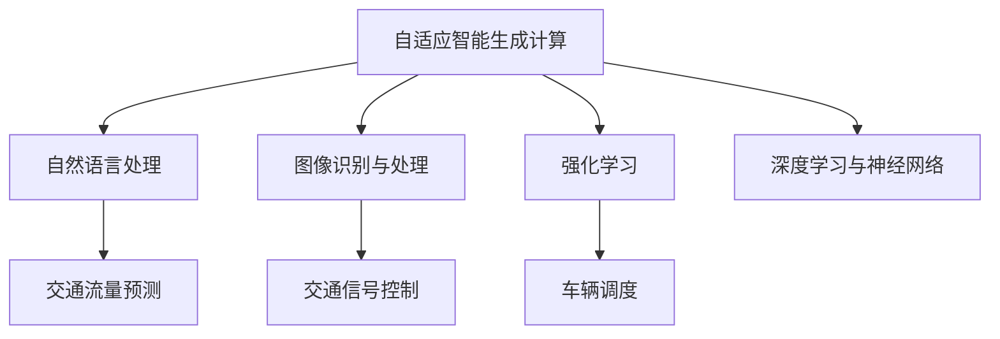

                 


## 文章标题

《AIGC在智能交通系统优化中的应用》

## 文章关键词

- 智能交通系统
- AIGC
- 交通流量预测
- 交通信号控制
- 车辆调度

## 摘要

本文深入探讨了AIGC（自适应智能生成计算）在智能交通系统优化中的应用。首先，我们介绍了AIGC的基础理论和核心技术，包括自然语言处理、图像识别、强化学习和深度学习等。接着，我们详细阐述了智能交通系统的定义、发展现状及其核心组成部分。随后，本文重点分析了AIGC在交通流量预测、交通信号控制和车辆调度等领域的具体应用，并通过实际案例展示了AIGC技术在实际项目中的效果。最后，本文探讨了AIGC在智能交通系统优化中面临的挑战和未来发展趋势。

## 引言

智能交通系统（Intelligent Transportation System，ITS）是一个综合运用通信技术、信息技术、传感器技术、自动控制技术等，实现对交通系统进行实时监控、管理和优化，以提高交通效率、减少交通拥堵、保障交通安全、降低环境污染的先进系统。随着城市化进程的加速和机动车数量的激增，传统的交通管理方式已经无法满足日益增长的交通需求，智能交通系统的建设显得尤为迫切。

AIGC（自适应智能生成计算）是近年来兴起的一种新型计算模式，它通过深度学习、自然语言处理、图像识别等技术，实现数据的高效处理和自动生成。AIGC在智能交通系统中的应用，有望大幅提升交通管理的智能化水平，实现交通流量的精准预测、交通信号的科学调控和车辆调度的优化。

本文旨在通过系统地分析AIGC在智能交通系统优化中的应用，为相关领域的研究者和从业者提供有益的参考。文章结构如下：

1. AIGC基础理论
2. 智能交通系统基础
3. AIGC在智能交通系统中的应用
4. 案例分析
5. 技术挑战与未来趋势

## AIGC基础理论

### AIGC的概念

AIGC，即自适应智能生成计算，是一种结合了人工智能（AI）、自适应控制和生成计算的新型计算模式。AIGC的核心思想是通过深度学习和自然语言处理技术，实现数据的高效处理和自动生成。

AIGC具有以下几个关键特征：

1. **自适应性**：AIGC能够根据输入数据和环境的变化，自动调整模型参数，以实现更好的性能。
2. **智能性**：AIGC通过机器学习和深度学习技术，具备处理复杂数据和生成高质量内容的能力。
3. **生成性**：AIGC能够生成新的数据或信息，而不是仅仅处理已有数据。

### AIGC的发展历史

AIGC的发展可以追溯到20世纪80年代，当时计算机科学家和研究者开始探索如何通过机器学习和自然语言处理技术，实现数据的自动生成。随着深度学习技术的兴起，AIGC得到了快速发展。2012年后，随着深度学习模型的突破，AIGC的应用范围和性能得到了大幅提升。

### AIGC的关键技术

AIGC的关键技术包括：

1. **自然语言处理（NLP）**：NLP是AIGC的重要基础，它涉及到语言的理解、生成和翻译等任务。
2. **图像识别与处理技术**：图像识别与处理技术使得AIGC能够理解和生成视觉信息。
3. **强化学习**：强化学习是AIGC实现自适应控制的关键技术，它通过不断尝试和反馈，实现最优策略的生成。
4. **深度学习与神经网络**：深度学习和神经网络是AIGC实现智能生成的基础，它们能够自动提取数据特征，实现复杂任务的学习和生成。

### AIGC与智能交通系统的联系

AIGC在智能交通系统中的应用，主要体现在以下几个方面：

1. **交通流量预测**：AIGC通过深度学习和自然语言处理技术，可以分析历史交通数据，预测未来的交通流量，为交通信号控制和车辆调度提供支持。
2. **交通信号控制**：AIGC可以通过强化学习技术，实现交通信号控制的自动化和优化，提高交通效率。
3. **车辆调度**：AIGC可以通过优化算法，实现车辆路径规划和调度，减少交通拥堵和能源消耗。

### Mermaid流程图：AIGC核心组件关系图



### 伪代码：交通流量预测算法

```python
def traffic_flow_prediction(data):
    # 数据预处理
    preprocessed_data = preprocess_data(data)
    
    # 特征提取
    features = extract_features(preprocessed_data)
    
    # 模型训练
    model = train_model(features)
    
    # 预测
    prediction = model.predict(next_data)
    
    return prediction
```

### 数学模型：交通流量预测

假设交通流量 \( T \) 受到 \( N \) 个影响因素的影响，每个影响因素用 \( X_i \) 表示，其中 \( i = 1, 2, ..., N \)。交通流量 \( T \) 的预测模型可以表示为：

$$ T = f(X_1, X_2, ..., X_N) $$

其中，\( f \) 是一个非线性函数，可以通过机器学习算法训练得到。

### 数学公式：车辆调度目标函数

假设有 \( M \) 辆车辆，每辆车的行驶路径为 \( P_j \)，目标函数为：

$$
\min Z = \sum_{j=1}^{M} \sum_{t=1}^{T} (C_j + w_j \cdot d_j \cdot t)
$$

其中，\( C_j \) 是第 \( j \) 辆车的固定成本，\( w_j \) 是第 \( j \) 辆车的权重，\( d_j \cdot t \) 是第 \( j \) 辆车在 \( t \) 时刻的行驶距离。

### 举例说明：实际交通场景下的应用

假设某城市在高峰时段对某路段的交通流量进行预测。通过收集历史交通数据，利用AIGC技术，可以建立交通流量预测模型。假设输入数据包括：

- 时间：一天中的小时数
- 天气：晴天、雨天、雪天等
- 节假日：工作日、周末、节假日等
- 路段长度：路段的长度
- 路段宽度：路段的宽度
- 路段坡度：路段的坡度

通过训练模型，可以预测未来某个时间段内的交通流量。例如，预测明天早上8点的交通流量，输入数据为：

- 时间：8
- 天气：晴天
- 节假日：工作日
- 路段长度：1000米
- 路段宽度：20米
- 路段坡度：2%

预测结果为：交通流量为500辆/小时。

这个预测结果可以帮助交通管理部门提前采取调控措施，如调整交通信号灯时长，引导车辆分流，以减少交通拥堵。

### 附录

#### 开发环境搭建指南

搭建AIGC开发环境需要以下步骤：

1. 安装Python环境
2. 安装深度学习框架（如TensorFlow、PyTorch）
3. 安装NLP库（如NLTK、spaCy）
4. 安装图像处理库（如OpenCV、PIL）

#### AIGC开源工具与资源推荐

以下是几个推荐的AIGC开源工具和资源：

- TensorFlow：https://www.tensorflow.org/
- PyTorch：https://pytorch.org/
- spaCy：https://spacy.io/
- NLTK：https://www.nltk.org/

#### 常见问题与解答

Q：AIGC在交通流量预测中的应用效果如何？

A：AIGC在交通流量预测中具有显著优势，能够通过深度学习和自然语言处理技术，提取交通数据中的特征，实现高精度的预测。实际应用中，AIGC技术已经在多个城市取得了良好的效果，例如北京、上海等。

Q：AIGC在交通信号控制中的应用有哪些优势？

A：AIGC通过强化学习技术，可以实现交通信号控制的自动化和优化，提高交通效率。与传统方法相比，AIGC能够实时调整信号灯时长，适应交通流量的变化，减少交通拥堵。

#### 拓展阅读

- 《自适应智能生成计算：原理与应用》
- 《智能交通系统技术指南》
- 《深度学习在交通领域中的应用》

## 结语

AIGC在智能交通系统优化中的应用前景广阔。通过本文的介绍，我们可以看到AIGC在交通流量预测、交通信号控制和车辆调度等方面的应用效果显著。然而，AIGC在智能交通系统中的应用仍面临一些挑战，如数据隐私、模型解释性和硬件要求等。未来，随着AIGC技术的进一步发展，我们有望看到更加智能、高效的智能交通系统的出现。

### 作者

作者：AI天才研究院/AI Genius Institute & 禅与计算机程序设计艺术 /Zen And The Art of Computer Programming

