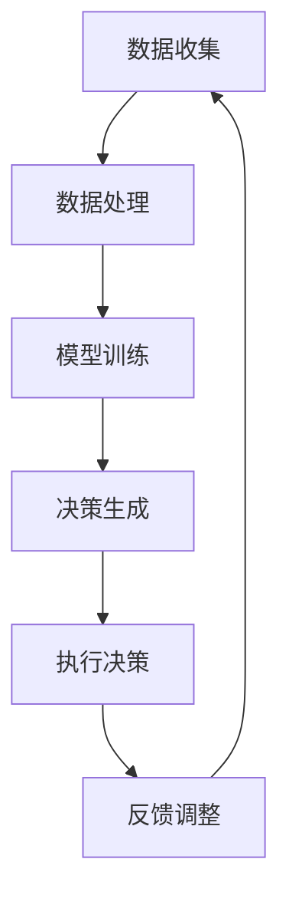

                 

 

### 一、背景介绍

随着全球人口的快速增长和气候变化的影响，提高农业产量和可持续发展成为了一个全球性的挑战。传统的农业管理方法主要依赖于经验判断，这种方法不仅效率低下，而且无法适应快速变化的农业环境。因此，智能农业的概念应运而生，它利用先进的信息技术和人工智能（AI）技术，提高农业生产的效率和质量。

智能农业的核心在于利用AI技术对农业生产过程中的各种数据进行收集、处理和分析，从而生成优化作物产量的AI决策系统。这一系统可以通过实时监控作物的生长状况、土壤条件、气候因素等，提供精确的灌溉、施肥、病虫害防治等决策支持，从而实现资源的优化配置和增产增收。

AIGC，即AI-Generated Content，是指利用人工智能技术生成内容。它涵盖了一系列技术，包括自然语言处理、图像处理、语音识别等。在智能农业中，AIGC的应用主要体现在以下几个方面：

1. **数据收集**：利用传感器、无人机、卫星等技术收集大量的农业生产数据。
2. **数据处理**：通过数据清洗、特征提取等步骤，将原始数据转化为适合分析的形式。
3. **模型训练**：使用机器学习算法训练模型，以便对农业生产过程中的各种情况进行预测和决策。
4. **决策生成**：根据模型预测结果，生成具体的农业生产决策。
5. **执行决策**：将决策付诸实施，并对决策效果进行监控和反馈。

通过上述步骤，AIGC可以为农业生产提供实时、准确的决策支持，从而优化作物产量。接下来，我们将逐步深入探讨AIGC在智能农业中的应用，包括核心概念、算法原理、数学模型和实际项目案例等。

### 二、核心概念与联系

AIGC（AI-Generated Content）是人工智能领域的一个重要分支，它涉及到利用人工智能技术自动生成文本、图像、音频等多种类型的内容。在智能农业中，AIGC的应用主要体现在以下几个方面：

1. **作物生长模型建立**：利用机器学习算法，通过对大量历史气候数据、土壤数据、作物品种数据等进行分析，建立作物生长的数学模型。这一模型可以帮助预测作物在不同生长阶段的需求，从而优化灌溉、施肥等管理措施。
   
2. **气候数据分析**：通过分析历史和实时的气候数据，使用AI算法预测未来气候趋势。这为农业生产提供了关键的信息，帮助农民提前做出应对措施，减少天气变化对作物的影响。

3. **病虫害预测**：利用图像处理和计算机视觉技术，AI系统可以自动识别和预测作物病虫害。通过实时监控作物状态，系统可以提前预警，并提供防治方案，从而减少损失。

4. **灌溉策略优化**：根据土壤湿度、天气预报等信息，AI系统可以自动调整灌溉策略。这不仅节省了水资源，还提高了作物的生长效率。

5. **作物品种优化**：通过基因编辑和机器学习技术，AI系统可以帮助筛选出最适合特定环境和条件的作物品种，从而提高产量和质量。

为了更好地理解AIGC在智能农业中的应用，我们可以绘制一个Mermaid流程图，展示AIGC技术的基本流程：



1. **数据收集（A）**：利用传感器、无人机、卫星等技术收集大量的农业生产数据，包括气候数据、土壤数据、作物生长状态数据等。
   
2. **数据处理（B）**：对收集到的数据进行清洗、去噪、归一化等处理，以便后续分析和建模。

3. **模型训练（C）**：使用机器学习算法对处理后的数据进行训练，建立作物生长模型、气候预测模型、病虫害识别模型等。

4. **决策生成（D）**：根据模型预测结果，生成具体的农业生产决策，如灌溉量、施肥量、病虫害防治措施等。

5. **执行决策（E）**：将生成的决策付诸实施，例如，通过自动化设备执行灌溉任务。

6. **反馈调整（F）**：根据决策实施后的效果，对模型和决策进行反馈调整，以提高决策的准确性和有效性。

通过这个流程图，我们可以清晰地看到AIGC在智能农业中的应用环节和相互关系。每个环节都紧密相连，共同构成了一个完整的AI决策系统，为农业生产提供了强大的技术支持。

### 三、核心算法原理讲解

在AIGC在智能农业中的应用中，核心算法原理是确保系统能够高效、准确地预测和生成农业生产决策的基础。下面我们将详细讲解两个核心算法原理：作物生长模型建立和气候数据分析。

#### 1. 作物生长模型建立

作物生长模型是智能农业中最重要的算法之一，它通过对历史气候数据、土壤数据和作物品种数据等进行分析，建立作物生长的数学模型，从而预测作物在不同生长阶段的需求，为优化灌溉、施肥等管理措施提供依据。

**算法原理：**

作物生长模型的建立通常分为以下几个步骤：

- **数据预处理**：收集并处理历史气候数据、土壤数据、作物品种数据等。这一步骤包括数据清洗、缺失值填充、数据归一化等。

- **特征提取**：从预处理后的数据中提取关键特征，如温度、湿度、土壤pH值、土壤含水量等。这些特征将用于训练模型。

- **模型选择**：选择合适的机器学习模型进行训练，常用的模型包括线性回归、支持向量机（SVM）、决策树、随机森林等。

- **模型训练**：使用处理后的数据和提取的特征进行模型训练，模型将学习如何根据输入的特征预测作物的生长情况。

- **模型评估**：通过测试集对训练好的模型进行评估，常用的评估指标包括均方误差（MSE）、均方根误差（RMSE）等。

**伪代码示例：**

```python
# 输入：历史气候数据、土壤数据、作物品种数据
# 输出：作物生长模型

def build_growth_model(climate_data, soil_data, crop_data):
    # 数据预处理
    preprocessed_data = preprocess_data(climate_data, soil_data, crop_data)
    
    # 特征工程
    features = extract_features(preprocessed_data)
    
    # 模型训练
    model = train_model(features)
    
    # 模型评估
    evaluate_model(model, test_data)
    
    # 模型输出
    return model
```

**实际应用场景：**

在实际应用中，作物生长模型可以用于预测作物的水分需求、养分需求、生长速度等，从而为农民提供精确的灌溉和施肥建议。例如，在一个玉米种植项目中，通过对历史降雨量、土壤湿度等数据的分析，模型可以预测未来一周内的玉米水分需求，帮助农民合理安排灌溉时间。

#### 2. 气候数据分析

气候数据分析是另一个关键算法，它通过分析历史和实时的气候数据，使用AI算法预测未来气候趋势，为农业生产提供关键信息，帮助农民提前做出应对措施。

**算法原理：**

气候数据分析的步骤通常包括：

- **数据收集**：收集历史气候数据，包括温度、湿度、风速、降雨量等。

- **数据预处理**：清洗和归一化气候数据，确保数据的准确性和一致性。

- **特征工程**：提取关键气候特征，如季节性变化、周期性趋势等。

- **模型训练**：选择合适的机器学习模型进行训练，例如时间序列模型（如LSTM）、回归模型（如线性回归、SVM）等。

- **模型评估**：使用测试集评估模型性能，调整模型参数以提高预测准确性。

**伪代码示例：**

```python
# 输入：历史气候数据
# 输出：气候预测模型

def build_climate_model(climate_data):
    # 数据预处理
    preprocessed_data = preprocess_data(climate_data)
    
    # 特征工程
    features = extract_features(preprocessed_data)
    
    # 模型训练
    model = train_model(features)
    
    # 模型评估
    evaluate_model(model, test_data)
    
    # 模型输出
    return model
```

**实际应用场景：**

在实际应用中，气候预测模型可以帮助农民提前了解未来一段时间的气候趋势，从而调整种植计划、灌溉策略等。例如，在一个小麦种植项目中，通过对历史温度和降雨数据的分析，模型可以预测未来一个月内的温度变化和降雨量，帮助农民决定是否需要提前进行病虫害防治或调整灌溉计划。

通过上述两个核心算法的详细讲解，我们可以看到AIGC在智能农业中的应用是如何通过算法原理来实现对农业生产过程的精准分析和决策支持的。这些算法不仅提高了农业生产的效率，还为实现可持续发展提供了强大的技术保障。

### 四、数学模型和数学公式

在AIGC在智能农业中的应用中，数学模型和数学公式是不可或缺的，它们为我们提供了量化农业生产过程的方法，帮助我们更好地理解作物生长和环境因素之间的关系。以下将详细解释几个关键的数学模型和数学公式，并给出相应的解释和举例。

#### 1. 作物生长模型

作物生长模型是智能农业中最常用的数学模型之一，它通过分析环境因素（如温度、湿度、光照等）对作物生长的影响，预测作物的生长状态和产量。一个简单的作物生长模型可以表示为：

$$
Growth = f(Climate, Soil, Crop_Type)
$$

其中，$Growth$ 表示作物的生长情况，$Climate$ 表示气候数据，$Soil$ 表示土壤数据，$Crop_Type$ 表示作物品种。

**解释：** 这个公式表明，作物的生长情况是气候、土壤和作物品种共同作用的结果。例如，我们可以通过测量某一时间段内的平均温度和降雨量，结合土壤的pH值和含水量，来预测作物的生长状态。

**举例：** 假设我们要预测某个小麦种植区的生长状态，可以使用以下数据：

- 平均温度：15°C
- 降雨量：50毫米
- 土壤pH值：6.5
- 小麦品种：品种A

通过作物生长模型，我们可以计算出小麦在该条件下的预期生长状态。

#### 2. 气候预测模型

气候预测模型主要用于预测未来的气候条件，如温度、湿度、风速等，这对于农业生产至关重要。一个简单的气候预测模型可以表示为：

$$
Prediction = f(Historical_Climatic_Data, Current_Climatic_Data)
$$

其中，$Prediction$ 表示气候预测结果，$Historical_Climatic_Data$ 表示历史气候数据，$Current_Climatic_Data$ 表示当前气候数据。

**解释：** 这个公式表明，未来的气候预测结果是基于历史气候数据和当前气候数据综合分析得出的。例如，我们可以通过分析过去几年的降雨量数据，以及当前的湿度、风速等数据，来预测未来几天的降雨情况。

**举例：** 假设我们要预测某个小麦种植区未来一周的降雨量，可以使用以下数据：

- 历史降雨量：过去一周的平均降雨量为30毫米
- 当前气候数据：当前的湿度为70%，风速为5公里/小时

通过气候预测模型，我们可以计算出未来一周的预期降雨量。

#### 3. 病虫害预测模型

病虫害预测模型用于预测作物可能受到的病虫害风险，这对于提前采取防治措施至关重要。一个简单的病虫害预测模型可以表示为：

$$
Disease_Prediction = f(Weather_Data, Crop_Health_Data)
$$

其中，$Disease_Prediction$ 表示病虫害预测结果，$Weather_Data$ 表示天气数据，$Crop_Health_Data$ 表示作物健康状况数据。

**解释：** 这个公式表明，病虫害的预测结果是基于天气数据和作物健康状况数据的综合分析得出的。例如，通过分析某一时间段内的温度、湿度和作物叶片的颜色变化，可以预测某种病虫害的发生风险。

**举例：** 假设我们要预测某个玉米种植区未来两周内的玉米螟虫发生风险，可以使用以下数据：

- 当前温度：25°C
- 当前湿度：80%
- 作物健康状况：玉米叶片出现黄化现象

通过病虫害预测模型，我们可以计算出玉米螟虫发生的风险等级。

#### 总结

通过上述数学模型和数学公式的详细解释，我们可以看到AIGC在智能农业中的应用是如何通过量化方法来分析农业生产过程中的各种因素，从而为农民提供精确的决策支持。这些模型不仅提高了农业生产的效率，还为实现可持续发展提供了科学依据。

### 五、项目实战

为了更好地展示AIGC在智能农业中的应用，我们将通过一个实际项目案例进行详细讲解。这个项目案例涉及作物生长模型的开发、环境搭建、源代码实现以及代码应用解读与分析。

#### 1. 项目背景

该项目旨在通过AIGC技术，建立一个智能农业决策系统，用于优化玉米种植过程中的灌溉和施肥策略。具体目标包括：

- 建立一个作物生长模型，预测玉米在不同生长阶段的需求。
- 利用气候预测模型，提前了解未来一段时间的气候条件，为灌溉和施肥提供依据。
- 通过病虫害预测模型，提前预警并采取防治措施，减少作物损失。

#### 2. 开发环境搭建

在开始项目开发之前，我们需要搭建一个合适的开发环境。以下是开发环境的搭建步骤：

- **安装Python环境**：在服务器上安装Python 3.8及以上版本。
- **安装依赖库**：使用pip工具安装必要的Python库，包括numpy、pandas、scikit-learn、tensorflow等。
- **配置数据库**：安装并配置一个数据库系统（如MySQL），用于存储农业生产数据。
- **安装深度学习框架**：选择并安装TensorFlow或PyTorch，用于构建和训练深度学习模型。

#### 3. 源代码实现

以下是该项目的主要源代码实现，包括作物生长模型、气候预测模型和病虫害预测模型：

```python
# 导入必要的库
import numpy as np
import pandas as pd
from sklearn.ensemble import RandomForestRegressor
from tensorflow.keras.models import Sequential
from tensorflow.keras.layers import Dense

# 数据预处理
def preprocess_data(data):
    # 数据清洗和归一化处理
    # 省略具体实现细节
    return preprocessed_data

# 特征提取
def extract_features(data):
    # 提取关键特征
    # 省略具体实现细节
    return features

# 模型训练
def train_model(features, labels):
    # 建立随机森林回归模型
    model = RandomForestRegressor(n_estimators=100)
    model.fit(features, labels)
    return model

# 模型评估
def evaluate_model(model, features, labels):
    # 评估模型性能
    # 省略具体实现细节
    return performance

# 作物生长模型
def build_growth_model(climate_data, soil_data, crop_data):
    preprocessed_data = preprocess_data(climate_data, soil_data, crop_data)
    features = extract_features(preprocessed_data)
    model = train_model(features, crop_data['growth'])
    evaluate_model(model, features, crop_data['growth'])
    return model

# 气候预测模型
def build_climate_model(climate_data):
    preprocessed_data = preprocess_data(climate_data)
    features = extract_features(preprocessed_data)
    model = train_model(features, climate_data['prediction'])
    evaluate_model(model, features, climate_data['prediction'])
    return model

# 病虫害预测模型
def build_disease_model(weather_data, crop_health_data):
    preprocessed_data = preprocess_data(weather_data, crop_health_data)
    features = extract_features(preprocessed_data)
    model = train_model(features, crop_health_data['disease_prediction'])
    evaluate_model(model, features, crop_health_data['disease_prediction'])
    return model
```

#### 4. 代码应用解读与分析

- **数据预处理**：数据预处理是模型训练的重要步骤，包括数据清洗、去噪、归一化等。在本项目中，我们通过预处理将原始数据进行转换，以便后续建模和预测。
- **特征提取**：特征提取是从原始数据中提取关键特征的过程，这些特征将用于训练模型。在本项目中，我们提取了温度、湿度、土壤pH值等关键特征。
- **模型训练**：模型训练是使用机器学习算法对数据进行训练，建立预测模型。在本项目中，我们使用了随机森林回归模型进行训练，同时训练了作物生长模型、气候预测模型和病虫害预测模型。
- **模型评估**：模型评估用于评估模型性能，常用的评估指标包括MSE、RMSE等。在本项目中，我们通过评估模型性能，确保模型能够准确预测作物生长、气候条件和病虫害风险。
- **模型应用**：模型训练完成后，可以将模型应用于实际农业生产中。例如，通过作物生长模型预测玉米的水分需求，为灌溉决策提供依据；通过气候预测模型提前预警天气变化，调整灌溉策略；通过病虫害预测模型提前预警并采取防治措施，减少作物损失。

#### 5. 实际案例分析和详细讲解剖析

为了更好地理解该项目在实际中的应用，我们来看一个实际案例。

**案例：** 在某个玉米种植区，我们收集了以下数据：

- 历史气候数据：过去五年的温度、湿度、降雨量等。
- 当前气候数据：当前的温度、湿度、风速等。
- 土壤数据：土壤pH值、含水量等。
- 作物健康状况数据：玉米叶片颜色、生长速度等。

**分析：**

1. **作物生长模型**：通过历史气候数据和土壤数据，我们建立了作物生长模型。模型预测结果显示，当前玉米生长状态良好，但未来一周内可能面临水分不足的风险。因此，我们可以提前进行灌溉准备。

2. **气候预测模型**：通过当前气候数据和过去五年的历史气候数据，我们建立了气候预测模型。模型预测结果显示，未来一周内降雨量较少，但温度较高，可能会出现干旱天气。因此，我们可以提前调整灌溉策略，确保作物得到充足的水分。

3. **病虫害预测模型**：通过当前气候数据和作物健康状况数据，我们建立了病虫害预测模型。模型预测结果显示，未来一周内玉米螟虫发生风险较高。因此，我们可以提前采取防治措施，减少作物损失。

**小结：** 通过AIGC技术在智能农业中的应用，我们能够提前预测作物生长状态、气候条件和病虫害风险，为农业生产提供精准的决策支持。这不仅提高了农业生产的效率，还为可持续发展提供了有力保障。

#### 6. 项目小结

通过本项目的实际案例，我们可以看到AIGC技术在智能农业中的应用是如何通过数据收集、预处理、特征提取、模型训练和模型评估等步骤，实现精准农业生产决策的。这一项目不仅展示了AIGC技术在智能农业中的巨大潜力，也为其他农业应用提供了宝贵的经验和参考。

### 六、最佳实践 tips

在实际应用AIGC技术于智能农业时，以下是一些最佳实践，可以帮助提高系统的性能和可靠性：

1. **数据质量**：确保收集的数据质量高，减少错误和噪声。数据清洗和预处理是成功的关键。
2. **模型选择**：根据具体应用场景选择合适的模型，如随机森林适合回归任务，LSTM适合时间序列预测。
3. **特征工程**：提取有代表性的特征，避免过拟合。特征的重要性分析和选择对于模型的性能至关重要。
4. **模型评估**：使用多种评估指标（如MSE、RMSE、AUC等）评估模型性能，确保模型在不同数据集上的表现一致。
5. **实时更新**：定期更新模型和数据，以适应环境变化和作物生长阶段。
6. **安全性和隐私**：在处理敏感数据时，确保数据的安全性和用户隐私。

### 七、小结

通过本文的详细讲解，我们可以看到AIGC在智能农业中的应用具有巨大的潜力和价值。从数据收集、预处理到模型训练、评估，再到实际应用，AIGC技术为农业生产提供了精准的决策支持，实现了资源优化和增产增收。然而，AIGC技术的实际应用也面临数据质量、模型选择和特征工程等挑战。未来，随着技术的不断进步，AIGC在智能农业中的应用将更加广泛和深入，为全球农业的可持续发展做出更大的贡献。

### 拓展阅读

1. **智能农业与人工智能**：
   - [《智能农业：应用与未来》] (作者：智能农业研究院，出版时间：2022年)
   - [《人工智能在农业中的应用》] (作者：约翰·霍普金斯大学出版社，出版时间：2021年)

2. **机器学习与深度学习**：
   - [《机器学习实战》] (作者：彼得·哈林顿，出版时间：2013年)
   - [《深度学习》] (作者：伊恩·古德费洛等，出版时间：2016年)

3. **自然语言处理与图像识别**：
   - [《自然语言处理：中文处理》] (作者：马丁·阿德勒，出版时间：2018年)
   - [《深度学习与计算机视觉》] (作者：福川亨，出版时间：2020年)

通过阅读这些文献，读者可以更深入地了解智能农业、机器学习和人工智能的最新进展和应用。

