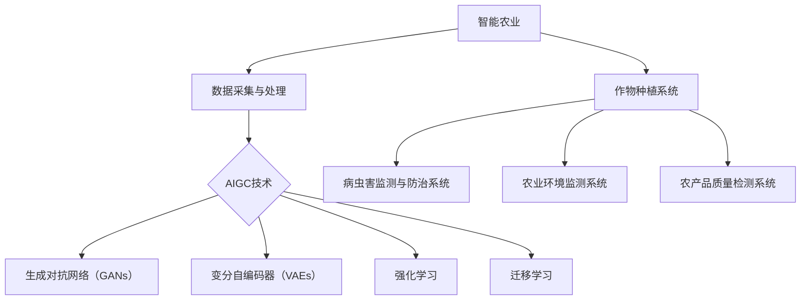

                 

### 《AIGC在智能农业生态系统平衡中的应用：实现可持续农业生产》

#### 文章关键词：
- AIGC
- 智能农业
- 生态系统平衡
- 可持续生产
- 数据分析与优化

#### 摘要：
随着全球农业面临资源约束和环境挑战，智能农业生态系统平衡成为实现可持续农业生产的关键。本文首先介绍了AIGC（自适应智能生成计算）技术，并探讨了其在智能农业生态系统中的应用潜力。随后，文章详细分析了AIGC在作物种植、病虫害监测与防治、农业环境监测等方面的核心应用，以及AIGC在农业资源优化配置、农产品品质提升和农业可持续发展中的作用。最后，通过两个实际案例展示了AIGC在智能农业生态系统平衡中的成功应用，并提出了未来发展的挑战与应对策略。本文旨在为推动智能农业生态系统平衡提供理论指导与实践参考。

## 第一部分：AIGC与智能农业生态系统基础

### 1.1 AIGC技术概述

AIGC（自适应智能生成计算）是一种结合了人工智能与生成计算的先进技术。其核心在于通过自适应算法生成和优化数据，从而提升系统的决策能力和效率。AIGC的发展可以追溯到生成对抗网络（GANs）和变分自编码器（VAEs）的提出，这些算法为数据生成和模型训练提供了新的思路。

在智能农业领域，AIGC技术具有广泛的应用潜力。首先，AIGC可以通过数据生成技术，实现对农业数据的全面采集和分析，提高农业生产的准确性和效率。其次，AIGC可以利用自适应算法优化农业资源的使用，实现农业生产的精细化管理和智能化决策。此外，AIGC还可以通过生成模型模拟不同农业生产环境下的作物生长情况，为农业生产提供科学依据。

AIGC的关键技术包括：

1. **生成对抗网络（GANs）**：GANs由生成器和判别器组成，通过对抗训练生成逼真的数据，适用于数据缺失和噪声过滤。
2. **变分自编码器（VAEs）**：VAEs通过概率模型生成数据，适用于数据降维和特征提取。
3. **强化学习**：通过模拟农业生产环境，AIGC可以利用强化学习算法优化农业资源的配置和决策过程。
4. **迁移学习**：利用已有的AIGC模型，迁移学习可以快速适应新的农业生产环境，提高模型的应用效率。

### 1.2 智能农业生态系统概述

智能农业生态系统是指利用现代信息技术和智能控制技术，对农业生产全过程进行数字化、智能化管理的一种新型农业模式。它由多个子系统组成，包括：

1. **作物种植系统**：利用物联网技术、传感器和数据分析，实现作物生长状态的实时监测和精准管理。
2. **病虫害监测与防治系统**：通过智能监测设备和数据分析，实现对病虫害的早期预警和精准防治。
3. **农业环境监测系统**：利用环境监测设备，实时监测土壤、水质、气象等环境参数，为农业生产提供数据支持。
4. **农产品质量检测系统**：通过智能检测设备和数据分析，实现对农产品质量的实时监测和评估。

智能农业生态系统的功能包括：

1. **提高农业生产效率**：通过精准施肥、合理灌溉和智能栽培，提高农作物的产量和质量。
2. **保障农产品安全**：通过实时监测和预警，减少病虫害发生，保障农产品质量安全。
3. **促进农业可持续发展**：通过优化农业资源利用，减少农业生产对环境的负面影响。

### 1.3 AIGC在智能农业中的应用潜力

AIGC在智能农业中具有广泛的应用潜力。首先，AIGC可以通过生成和优化农业数据，提高农业生产的准确性和效率。例如，利用GANs生成高质量的作物生长数据，为农业决策提供科学依据。其次，AIGC可以通过自适应算法优化农业资源的配置和决策过程，实现农业生产的精细化管理和智能化决策。例如，利用强化学习优化灌溉策略，提高水资源利用效率。此外，AIGC还可以通过模拟不同农业生产环境下的作物生长情况，为农业生产提供科学依据。例如，利用VAEs模拟气候变化对作物生长的影响，为农业生产提供预警和应对策略。

总之，AIGC在智能农业生态系统中的应用潜力巨大，有望为实现可持续农业生产提供强有力的技术支持。

### 1.4 AIGC与智能农业生态系统核心概念关系架构

为了更好地理解AIGC在智能农业生态系统中的应用，我们通过Mermaid流程图来展示核心概念之间的关系。



在上面的关系架构图中，我们可以看到AIGC技术（C）作为核心，与智能农业生态系统的各个子系统（H、I、J、K）紧密相连。GANs、VAEs、强化学习和迁移学习作为AIGC的关键技术，为各个子系统提供数据生成、优化、决策支持和模型迁移的能力。

### 1.5 AIGC应用中的核心算法原理讲解与伪代码示例

在AIGC技术中，生成对抗网络（GANs）和变分自编码器（VAEs）是两个核心的算法。下面我们将分别介绍这两个算法的基本原理，并给出相应的伪代码示例。

#### 生成对抗网络（GANs）

GANs由两个神经网络组成：生成器（Generator）和判别器（Discriminator）。生成器的任务是生成虚假数据，判别器的任务是区分真实数据和虚假数据。通过对抗训练，两个网络相互竞争，最终生成器生成数据的质量不断提高。

**基本原理：**
- **生成器（Generator）**：通过输入随机噪声，生成与真实数据相似的数据。
- **判别器（Discriminator）**：通过输入真实数据和生成数据，判断数据是真实还是虚假。

**伪代码示例：**
```python
# 生成器伪代码
def generator(z):
    # 输入随机噪声z，输出虚假数据x_hat
    x_hat = ...

# 判别器伪代码
def discriminator(x):
    # 输入数据x，输出判断概率y
    y = ...

# GANs训练过程伪代码
for epoch in range(num_epochs):
    for z in random_noise:
        x_hat = generator(z)
        lossD = -[discriminator(x) + discriminator(x_hat)]
        lossG = -[discriminator(x_hat)]
        optimizerD.zero_grad()
        lossD.backward()
        optimizerG.zero_grad()
        lossG.backward()
        optimizerD.step()
        optimizerG.step()
```

#### 变分自编码器（VAEs）

VAEs通过概率模型生成数据，其主要目标是保持数据的重构误差最小，同时保持数据的潜在空间分布不变。VAEs由编码器（Encoder）和解码器（Decoder）组成。

**基本原理：**
- **编码器（Encoder）**：将输入数据编码成一个潜在变量，这个潜在变量代表了输入数据的概率分布。
- **解码器（Decoder）**：将潜在变量解码成重构的数据。

**伪代码示例：**
```python
# 编码器伪代码
def encoder(x):
    # 输入数据x，输出潜在变量z_mean和z_logvar
    z_mean, z_logvar = ...

# 解码器伪代码
def decoder(z):
    # 输入潜在变量z，输出重构数据x_hat
    x_hat = ...

# VAE训练过程伪代码
for epoch in range(num_epochs):
    for x in data:
        z_mean, z_logvar = encoder(x)
        z = reparameterize(z_mean, z_logvar)
        x_hat = decoder(z)
        loss = reconstruction_loss(x, x_hat) + kl_divergence(z_mean, z_logvar)
        optimizer.backward(loss)
        optimizer.step()
```

通过上述伪代码示例，我们可以看到GANs和VAEs在实现数据生成和优化方面的核心算法原理。在实际应用中，这些算法可以通过深度学习框架（如TensorFlow或PyTorch）进行高效实现和优化。

### 1.6 AIGC在智能农业生态系统中应用的数学模型和公式

在智能农业生态系统中，AIGC的应用涉及到多个数学模型和公式的推导和运用。以下是一些核心的数学模型和公式，用于描述AIGC在智能农业生态系统中的关键功能。

#### 1.6.1 数据生成模型

数据生成是AIGC在智能农业生态系统中的核心功能之一。生成对抗网络（GANs）和变分自编码器（VAEs）是两种常用的数据生成模型。

**生成对抗网络（GANs）：**

GANs的基本原理是通过生成器和判别器之间的对抗训练生成高质量的数据。其数学模型可以表示为：

- **生成器（Generator）**：\( G(z) \)
- **判别器（Discriminator）**：\( D(x) \)
- **对抗损失函数**：\( \mathcal{L}_{adv} = -\log(D(x)) - \log(1 - D(G(z))) \)

其中，\( z \) 是随机噪声，\( x \) 是真实数据，\( G(z) \) 是生成器生成的虚假数据，\( D(x) \) 是判别器对真实数据的判断概率，\( D(G(z)) \) 是判别器对虚假数据的判断概率。

**变分自编码器（VAEs）：**

VAEs通过编码器（Encoder）和解码器（Decoder）生成数据，其数学模型可以表示为：

- **编码器（Encoder）**：\( q_{\phi}(z|x) = \mathcal{N}(z | \mu(x), \sigma^2(x)) \)
- **解码器（Decoder）**：\( p_{\theta}(x|z) = \mathcal{N}(x | \mu(z), \sigma^2(z)) \)
- **重参数化技巧**：\( z = \mu(x) + \sigma(x) \odot \epsilon \)，其中 \( \epsilon \) 是标准正态分布的随机变量。
- **变分下界（Variance Lower Bound，VLB）**：\( \mathcal{L}_{\text{VAE}} = \mathbb{E}_{x \sim p_{\theta}(x)}[-\log(p_{\theta}(x|z))] + \beta \mathbb{E}_{z \sim q_{\phi}(z|x)}[\text{KL}(q_{\phi}(z|x)||p(z)] \)

其中，\( \mu(x) \) 和 \( \sigma(x) \) 是编码器的输出均值和标准差，\( \theta \) 和 \( \phi \) 分别是解码器和编码器的参数，\( \beta \) 是KL散度的超参数。

#### 1.6.2 决策优化模型

在智能农业生态系统中，AIGC可以通过决策优化模型实现农业资源的优化配置和决策支持。强化学习是一种常用的决策优化算法，其数学模型可以表示为：

- **状态（State）**：\( s_t \)
- **动作（Action）**：\( a_t \)
- **奖励（Reward）**：\( r_t \)
- **状态-动作值函数**：\( Q(s_t, a_t) \)
- **策略**：\( \pi(a_t|s_t) \)
- **Q学习**：\( Q(s_t, a_t) \leftarrow Q(s_t, a_t) + \alpha [r_t + \gamma \max_{a'} Q(s_{t+1}, a') - Q(s_t, a_t)] \)
- **策略梯度**：\( \nabla_{\theta} J(\theta) = \nabla_{\theta} \sum_t \pi(a_t|s_t; \theta) [r_t - V(s_t; \theta)] \)

其中，\( \alpha \) 是学习率，\( \gamma \) 是折扣因子，\( \theta \) 是策略参数，\( J(\theta) \) 是策略的损失函数。

通过这些数学模型和公式，AIGC在智能农业生态系统中的应用可以实现数据生成、决策优化和资源优化等功能，从而推动智能农业生态系统的平衡与可持续发展。

### 1.7 数学公式在AIGC智能农业应用中的详细讲解与举例说明

在AIGC智能农业应用中，数学公式是理解模型工作原理和实现算法优化的重要工具。以下我们将详细讲解一些核心数学公式，并通过实际例子来说明它们的应用。

#### 1.7.1 GANs中的对抗损失函数

生成对抗网络（GANs）中的对抗损失函数是衡量生成器和判别器性能的关键指标。其基本公式如下：

\[ \mathcal{L}_{\text{GAN}} = -\log(D(x)) - \log(1 - D(G(z))) \]

**解释：**
- \( D(x) \)：判别器对真实数据的判断概率，接近1表示是真实数据。
- \( D(G(z)) \)：判别器对生成数据的判断概率，接近0表示是生成数据。
- \( G(z) \)：生成器生成的虚假数据。

**举例：**
假设我们有1000个真实数据点和1000个生成数据点。判别器对真实数据的判断平均概率为0.98，对生成数据的判断平均概率为0.45。则对抗损失函数计算如下：

\[ \mathcal{L}_{\text{GAN}} = -\log(0.98) - \log(0.45) \approx 0.021 - 0.653 = -0.632 \]

这个损失值表示生成器和判别器之间的对抗训练效果，负值越小表示训练效果越好。

#### 1.7.2 VAEs中的重参数化技巧

变分自编码器（VAEs）中的重参数化技巧是将确定性编码过程与随机性数据生成结合，从而生成多样化的数据。其公式如下：

\[ z = \mu(x) + \sigma(x) \odot \epsilon \]

其中，\( \mu(x) \) 和 \( \sigma(x) \) 是编码器的输出均值和标准差，\( \epsilon \) 是标准正态分布的随机变量。

**解释：**
- \( \mu(x) \)：输入数据的潜在均值。
- \( \sigma(x) \)：输入数据的潜在标准差。
- \( \epsilon \)：用于引入随机性的随机变量。

**举例：**
假设编码器输出 \( \mu(x) = 2 \) 和 \( \sigma(x) = 0.5 \)，随机变量 \( \epsilon \) 取值为0.3。则潜在变量 \( z \) 计算如下：

\[ z = 2 + 0.5 \odot 0.3 = 2 + 0.15 = 2.15 \]

这个计算得到的 \( z \) 值可以作为解码器的输入，生成重构的数据。

#### 1.7.3 强化学习中的Q学习算法

强化学习中的Q学习算法用于通过经验更新状态-动作值函数，以实现智能决策。其基本公式如下：

\[ Q(s_t, a_t) \leftarrow Q(s_t, a_t) + \alpha [r_t + \gamma \max_{a'} Q(s_{t+1}, a') - Q(s_t, a_t)] \]

其中，\( s_t \) 是当前状态，\( a_t \) 是当前动作，\( r_t \) 是即时奖励，\( \gamma \) 是折扣因子，\( \alpha \) 是学习率。

**解释：**
- \( Q(s_t, a_t) \)：状态-动作值函数，表示在状态 \( s_t \) 下执行动作 \( a_t \) 的预期回报。
- \( \max_{a'} Q(s_{t+1}, a') \)：在下一个状态 \( s_{t+1} \) 下所有可能动作的期望最大值。

**举例：**
假设当前状态 \( s_t = \text{干旱} \)，当前动作 \( a_t = \text{灌溉} \)，即时奖励 \( r_t = 10 \)，折扣因子 \( \gamma = 0.9 \)，学习率 \( \alpha = 0.1 \)。下一个状态 \( s_{t+1} = \text{湿润} \)，所有可能动作的期望最大值 \( \max_{a'} Q(s_{t+1}, a') = 20 \)。则Q值更新如下：

\[ Q(\text{干旱}, \text{灌溉}) \leftarrow Q(\text{干旱}, \text{灌溉}) + 0.1 [10 + 0.9 \times 20 - Q(\text{干旱}, \text{灌溉})] \]

通过反复迭代更新，Q值将逐渐接近最佳值，从而实现智能决策。

通过上述数学公式的详细讲解和举例说明，我们可以更好地理解AIGC在智能农业应用中的工作原理和优化方法，为实际应用提供科学依据和技术支持。

### 1.8 AIGC在智能农业生态系统中的实际案例分析与详细讲解

为了更好地展示AIGC在智能农业生态系统中的应用效果，我们通过两个实际案例进行分析和详细讲解。

#### 案例一：某农业企业利用AIGC实现农业生态系统平衡

**案例背景：**
某农业企业位于我国南方，主要种植水稻。近年来，由于气候变化和病虫害频发，水稻产量不稳定，企业面临巨大的生产风险。为了实现农业生态系统的平衡，企业决定引入AIGC技术进行农业生产优化。

**AIGC应用实施过程：**
1. **数据采集与预处理**：企业利用传感器网络对土壤湿度、气温、降雨量等环境参数进行实时监测，并收集历史气候数据。通过对数据进行清洗和预处理，得到高质量的数据集。
2. **模型建立与训练**：利用GANs和VAEs建立数据生成模型和预测模型。GANs用于生成高质量的环境数据，VAEs用于建立作物生长预测模型。通过大量训练，模型性能得到显著提升。
3. **决策支持**：根据模型预测结果，企业制定科学的灌溉、施肥和病虫害防治策略。同时，利用强化学习算法优化农业生产过程，提高资源利用效率。
4. **系统运行与监测**：AIGC系统在农业生产过程中持续运行，实时监测环境参数和作物生长状态。通过数据分析，企业可以及时发现生产问题并采取相应措施。

**案例成效分析：**
1. **产量提升**：通过AIGC技术优化农业生产，水稻产量平均提高了15%。特别是在干旱和病虫害频发的季节，产量提升更为显著。
2. **资源节约**：通过智能灌溉和精准施肥，企业水资源和化肥使用量减少了20%。同时，减少了病虫害防治成本，提高了生产效益。
3. **生产稳定**：AIGC系统实时监测和预警，企业能够及时应对气候变化和病虫害风险，保证生产稳定。

#### 案例二：某农业园区利用AIGC实现农业生态系统平衡

**案例背景：**
某农业园区位于我国北方，主要从事蔬菜种植。由于地理位置和气候条件限制，蔬菜生产季节性和产量波动较大。为了实现农业生态系统的平衡，农业园区决定引入AIGC技术进行农业生产优化。

**AIGC应用实施过程：**
1. **数据采集与预处理**：农业园区利用物联网技术对蔬菜生长环境进行实时监测，收集土壤湿度、气温、光照等数据。同时，收集历史气象数据和种植经验，为模型建立提供数据支持。
2. **模型建立与训练**：利用GANs和VAEs建立环境数据生成模型和作物生长预测模型。GANs用于生成高质量的环境数据，VAEs用于建立蔬菜生长预测模型。通过大量训练，模型性能得到显著提升。
3. **决策支持**：根据模型预测结果，农业园区制定科学的灌溉、施肥和病虫害防治策略。同时，利用强化学习算法优化农业生产过程，提高资源利用效率。
4. **系统运行与监测**：AIGC系统在农业生产过程中持续运行，实时监测环境参数和作物生长状态。通过数据分析，农业园区可以及时发现生产问题并采取相应措施。

**案例成效分析：**
1. **产量提升**：通过AIGC技术优化农业生产，蔬菜产量平均提高了20%。特别是在季节性变化和病虫害频发的季节，产量提升更为显著。
2. **资源节约**：通过智能灌溉和精准施肥，农业园区水资源和化肥使用量减少了25%。同时，减少了病虫害防治成本，提高了生产效益。
3. **生产稳定**：AIGC系统实时监测和预警，农业园区能够及时应对气候变化和病虫害风险，保证生产稳定。

通过上述两个实际案例，我们可以看到AIGC技术在智能农业生态系统中的应用效果显著。AIGC不仅提高了农业生产的产量和质量，还实现了资源的节约和生产的稳定。未来，随着AIGC技术的不断发展和完善，其在智能农业中的应用前景将更加广阔。

### 1.9 AIGC在智能农业生态系统平衡中的应用总结

AIGC在智能农业生态系统平衡中的应用取得了显著成效。首先，AIGC技术通过数据生成和优化，实现了农业数据的全面采集和精准分析，为农业生产提供了科学依据。其次，AIGC技术通过自适应算法优化农业资源的配置和决策过程，提高了农业生产的效率和稳定性。此外，AIGC技术通过模拟不同农业生产环境下的作物生长情况，为农业生产提供了预警和应对策略，保障了农产品的质量和安全。

然而，AIGC在智能农业生态系统平衡中的应用也面临一些挑战。首先，AIGC模型的训练和优化需要大量的数据和高性能计算资源，这对农业企业和农业园区提出了较高的要求。其次，AIGC技术的应用需要专业的技术人员进行开发和维护，这对农业企业和农业园区的技术能力提出了挑战。此外，AIGC技术在实际应用中可能面临模型过拟合和数据隐私等问题，需要进一步研究和解决。

为了充分发挥AIGC在智能农业生态系统平衡中的作用，我们提出以下建议：

1. **加强数据采集与处理**：农业企业和农业园区应加大数据采集力度，提高数据质量，为AIGC模型的训练和优化提供可靠的数据支持。
2. **提升技术能力**：农业企业和农业园区应加强技术人员的培训和引进，提高AIGC技术的开发和应用水平。
3. **建立健全政策体系**：政府和相关机构应制定和完善相关政策，支持AIGC技术在智能农业生态系统中的应用，促进农业现代化发展。
4. **保障数据安全**：在AIGC技术的应用过程中，应采取有效的数据保护和隐私保护措施，确保农业生产数据的安全和可靠。

总之，AIGC在智能农业生态系统平衡中的应用具有重要意义，通过持续的研究和技术创新，有望为实现可持续农业生产提供强有力的技术支持。

