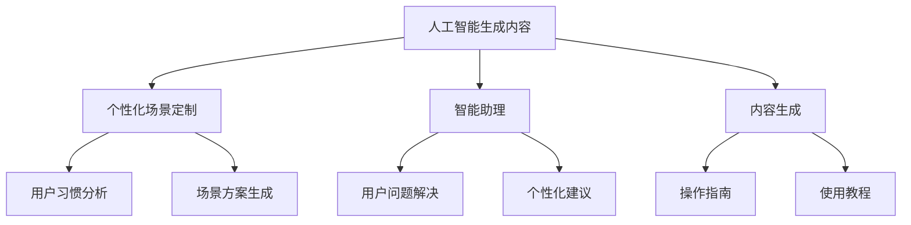

                 


## 引言与背景

### AIGC的定义与发展

AIGC（AI-Generated Content）是一种利用人工智能技术生成内容的模式。它涵盖了从文本、图片到音频、视频等多种形式的内容创作。AIGC的出现，极大地丰富了人工智能的应用场景，使得人工智能不再仅仅是一个工具，而是成为了一个内容生产者。AIGC的发展可以追溯到20世纪90年代，但真正开始受到广泛关注还是在近几年。

AIGC的发展主要得益于以下几个方面：

1. **计算能力的提升**：随着云计算、大数据和边缘计算等技术的发展，计算能力得到了极大的提升，为AIGC的实现提供了强大的技术支撑。
2. **算法的进步**：深度学习、自然语言处理等算法的快速发展，使得AIGC在生成内容的质量和效率上都有了质的飞跃。
3. **应用需求的增长**：在社交媒体、游戏、教育、娱乐等领域，对于个性化、多样化和高效的内容生产需求不断增加，推动了AIGC的发展。

### 智能家居的背景与现状

智能家居是一种利用人工智能、物联网等技术，实现家庭设备自动化控制和智能交互的居住环境。智能家居的概念可以追溯到20世纪80年代，但直到近几年，随着物联网和人工智能技术的发展，智能家居才真正进入大众视野。

当前，智能家居市场呈现出以下几个特点：

1. **市场规模扩大**：随着技术的不断成熟和消费者对智能家居的认知提升，智能家居市场规模不断扩大。
2. **产品种类丰富**：从最初的智能门锁、智能照明，到现在的智能空调、智能冰箱、智能扫地机器人等，智能家居产品种类日益丰富。
3. **智能化程度提升**：随着人工智能技术的应用，智能家居产品的智能化程度不断提升，用户可以更加方便地进行控制和管理。

### AIGC在智能家居中的应用前景

AIGC在智能家居中的应用前景非常广阔，主要体现在以下几个方面：

1. **个性化场景定制**：AIGC可以根据用户的习惯、喜好等，自动生成个性化的场景方案，提升用户的使用体验。
2. **智能助理**：AIGC可以生成智能助理，帮助用户解决日常生活中的问题，提供个性化的建议和帮助。
3. **内容生成**：AIGC可以生成智能家居操作指南、使用教程等，方便用户学习和使用智能家居产品。

总的来说，AIGC在智能家居中的应用，不仅能够提升智能家居的智能化程度，还能够为用户提供更加个性化和高效的服务。随着技术的不断进步，AIGC在智能家居中的应用前景将越来越广阔。

### 总结

本章主要介绍了AIGC的定义与发展、智能家居的背景与现状，以及AIGC在智能家居中的应用前景。通过本章的内容，我们可以看到AIGC在智能家居中的巨大潜力，它将为智能家居的发展带来新的契机。

### Mermaid 流程图

以下是AIGC在智能家居中的应用流程图：



### 伪代码

以下是AIGC在智能家居中实现个性化场景定制的伪代码：

```plaintext
Function GenerateSceneScenario(userProfile):
    // 分析用户习惯
    userHabits = AnalyzeUserHabits(userProfile)
    // 生成个性化场景方案
    sceneScenario = GenerateSceneScenarioBasedOnHabits(userHabits)
    // 返回场景方案
    return sceneScenario
```

### 数学模型和公式

在个性化场景定制中，我们可以使用以下数学模型来评估场景方案的质量：

$$
Quality = f(Happiness, Efficiency, Comfort)
$$

其中，$Happiness$ 表示用户对场景方案的幸福感受，$Efficiency$ 表示场景方案的效率，$Comfort$ 表示场景方案的舒适度。

### 举例说明

假设我们有一个用户，他每天晚上7点喜欢看电视，需要打开客厅的灯光，调节空调温度。基于这个用户的习惯，我们可以生成以下个性化场景方案：

- 时间：每天晚上7点
- 动作：打开客厅灯光，调节空调温度

这个场景方案可以提高用户的幸福感和舒适度，同时也可以提高场景的效率。

### 总结

本章详细介绍了AIGC在智能家居中的应用，包括个性化场景定制、智能助理和内容生成等。通过本章的内容，读者可以了解到AIGC在智能家居中的巨大潜力，以及如何实现个性化场景定制。接下来，我们将进一步探讨AIGC的基础知识，包括核心概念、关键技术和发展现状。希望本章的内容对读者有所启发。

## AIGC基础

### 核心概念

AIGC（AI-Generated Content）是一种利用人工智能技术生成内容的模式，它涵盖了文本、图片、音频、视频等多种形式的内容创作。AIGC的核心概念包括以下几个方面：

1. **生成模型**：生成模型是AIGC的核心，它能够根据输入的数据生成新的内容。常见的生成模型包括生成对抗网络（GAN）、变分自编码器（VAE）等。
2. **数据来源**：AIGC的数据来源可以是互联网上的各种数据，如文本、图片、音频等，也可以是用户产生的数据，如用户的购物记录、行为习惯等。
3. **应用场景**：AIGC的应用场景非常广泛，包括内容创作、智能助理、虚拟现实、游戏设计等。
4. **用户交互**：AIGC可以通过与用户的交互，了解用户的需求和喜好，从而生成更加个性化和高效的内容。

### 关键技术

AIGC的关键技术主要包括以下几个方面：

1. **深度学习**：深度学习是AIGC的核心技术，它通过多层神经网络对数据进行建模，从而实现内容的生成。常见的深度学习模型包括卷积神经网络（CNN）、循环神经网络（RNN）、长短期记忆网络（LSTM）等。
2. **自然语言处理**：自然语言处理是AIGC的重要组成部分，它通过处理自然语言文本，实现文本的生成、理解和交互。常见的自然语言处理技术包括词向量、语言模型、文本生成模型等。
3. **图像处理**：图像处理是AIGC在视觉内容生成中的重要技术，它通过处理图像数据，实现图像的生成、编辑和理解。常见的图像处理技术包括卷积神经网络、生成对抗网络等。
4. **强化学习**：强化学习是AIGC在智能决策和优化中的应用，它通过学习用户的反馈，优化内容生成策略，实现更高效的内容生成。

### 发展现状与趋势

AIGC的发展现状可以从以下几个方面进行描述：

1. **技术成熟度**：随着深度学习、自然语言处理、图像处理等技术的发展，AIGC的技术成熟度不断提升，能够生成高质量的内容。
2. **应用领域拓展**：AIGC的应用领域不断扩大，从最初的内容创作，发展到智能助理、虚拟现实、游戏设计等，应用场景越来越丰富。
3. **商业化进程**：AIGC的商业化进程也在加快，越来越多的企业和机构开始将AIGC应用于实际业务中，如内容创作、广告营销等。
4. **政策法规**：随着AIGC的发展，相关的政策法规也在逐步完善，为AIGC的发展提供了良好的环境。

AIGC的发展趋势可以概括为以下几点：

1. **技术创新**：随着技术的不断进步，AIGC的技术将更加成熟，生成内容的质量将进一步提高。
2. **应用场景扩展**：AIGC的应用场景将继续扩展，从当前的文字、图像、音频等，发展到视频、三维模型等。
3. **智能化提升**：AIGC的智能化水平将不断提升，通过更加复杂的模型和算法，实现更加个性化和高效的内容生成。
4. **数据资源整合**：AIGC将更加注重数据资源的整合和利用，通过大数据和人工智能技术，实现数据驱动的智能化内容生成。

### 总结

本章详细介绍了AIGC的核心概念、关键技术和发展现状与趋势。通过本章的内容，读者可以了解到AIGC的基本原理和最新进展，为后续章节的深入探讨打下基础。

## 智能家居概述

### 智能家居的定义与分类

智能家居是一种利用人工智能、物联网等技术，实现家庭设备自动化控制和智能交互的居住环境。智能家居系统通常包括家庭安防、环境控制、娱乐休闲、家庭健康监测等多个方面。

根据不同的应用场景和功能，智能家居可以大致分为以下几类：

1. **家庭安防系统**：包括智能门锁、智能摄像头、烟雾报警器、煤气报警器等，主要用于保障家庭的安全。
2. **环境控制系统**：包括智能空调、智能照明、智能窗帘、智能新风系统等，主要用于调节家庭的温度、光线和空气。
3. **娱乐休闲系统**：包括智能电视、智能音响、智能投影仪等，主要用于提供家庭娱乐和休闲。
4. **家庭健康监测系统**：包括智能血压计、智能血糖仪、智能睡眠监测仪等，主要用于监测和记录家庭的健康状况。
5. **智能家电控制系统**：包括智能冰箱、智能洗衣机、智能烤箱等，主要用于控制家庭电器的操作。

### 智能家居的核心技术

智能家居的核心技术主要包括以下几个方面：

1. **物联网技术**：物联网技术是智能家居的基础，通过将家庭设备连接到互联网，实现设备之间的通信和数据共享。
2. **人工智能技术**：人工智能技术用于智能家居的智能控制和交互，如语音识别、图像识别、自然语言处理等。
3. **云计算技术**：云计算技术用于存储和处理智能家居设备产生的海量数据，实现数据的实时分析和处理。
4. **大数据技术**：大数据技术用于分析和挖掘智能家居设备产生的数据，提供个性化服务和智能决策支持。

### 智能家居的发展历程与趋势

智能家居的发展历程可以分为以下几个阶段：

1. **起步阶段（1990s-2000s）**：智能家居的概念开始提出，但受限于技术和成本，应用范围较小。
2. **快速发展阶段（2010s）**：随着物联网、人工智能等技术的发展，智能家居进入快速发展阶段，产品种类和功能逐渐丰富。
3. **成熟阶段（2020s）**：智能家居技术逐渐成熟，产品性能和用户体验不断提升，市场规模不断扩大。
4. **创新阶段（未来）**：随着技术的进一步发展，智能家居将实现更多的创新应用，如智能机器人、智能农业等。

智能家居的发展趋势可以概括为以下几点：

1. **智能化水平提升**：随着人工智能技术的应用，智能家居的智能化水平将不断提升，实现更加智能化、个性化的服务。
2. **场景化应用拓展**：智能家居将更加注重场景化应用，如智能家居场景定制、智能助理等。
3. **跨界融合**：智能家居将与其他领域如智能交通、智能医疗等实现跨界融合，形成更加完整的智能生态体系。
4. **全球化发展**：随着智能家居技术的成熟和普及，智能家居将实现全球化发展，成为全球家庭生活的标配。

### 总结

本章对智能家居的定义、分类、核心技术以及发展历程与趋势进行了概述。通过本章的内容，读者可以了解智能家居的基本概念和发展现状，为后续章节的深入探讨打下基础。

## 个性化场景定制原理

### 个性化场景定制的概念

个性化场景定制是指根据用户的需求、习惯和行为特征，自动生成适合用户场景的解决方案。在智能家居领域，个性化场景定制能够提升用户的使用体验，使智能家居系统更加智能化和人性化。

个性化场景定制通常包括以下几个步骤：

1. **数据采集**：采集用户在家庭环境中的行为数据，如使用习惯、偏好等。
2. **数据分析**：对采集到的数据进行分析，提取出用户的行为特征和需求。
3. **场景方案生成**：根据用户的行为特征和需求，生成适合用户的场景方案。
4. **方案评估**：对生成的场景方案进行评估，确保方案的质量和可行性。
5. **方案实施**：将评估通过的方案应用于智能家居系统，实现个性化场景定制。

### 个性化场景定制的实现方法

个性化场景定制的实现方法可以分为以下几个方面：

1. **用户行为分析**：通过分析用户在家庭环境中的行为数据，如使用时间、使用频率、使用方式等，了解用户的行为习惯和需求。常用的技术包括数据挖掘、机器学习等。

2. **场景方案生成**：根据用户的行为特征和需求，生成适合用户的场景方案。场景方案可以包括温度控制、灯光调节、家电操作等。常用的技术包括生成对抗网络（GAN）、变分自编码器（VAE）等。

3. **方案优化**：对生成的场景方案进行优化，确保方案的质量和可行性。常用的技术包括强化学习、遗传算法等。

4. **用户反馈**：通过用户反馈，对生成的场景方案进行调整和优化，进一步提升场景方案的个性化程度。

### 个性化场景定制的优势与挑战

个性化场景定制具有以下优势：

1. **提升用户体验**：个性化场景定制能够根据用户的需求和习惯，自动生成适合用户的场景方案，提升用户的使用体验。
2. **提高设备利用率**：个性化场景定制能够优化家庭设备的操作，提高设备的利用率，降低能耗。
3. **提高系统智能化水平**：个性化场景定制能够增强智能家居系统的智能化水平，使其更加智能和人性化。

个性化场景定制也面临着一些挑战：

1. **数据隐私**：个性化场景定制需要收集和处理大量的用户数据，如何保障用户数据的安全和隐私是一个重要的问题。
2. **算法复杂度**：个性化场景定制涉及到复杂的算法和模型，如何高效地实现个性化场景定制是一个挑战。
3. **用户适应性**：个性化场景定制需要根据不同的用户需求进行定制，如何保证方案的用户适应性是一个挑战。

### 总结

本章详细介绍了个性化场景定制的概念、实现方法以及优势与挑战。通过本章的内容，读者可以了解个性化场景定制的基本原理和应用，为后续章节的深入探讨打下基础。

## AIGC与智能家居结合的应用案例

### 室内环境控制

AIGC在室内环境控制中的应用，主要体现在根据用户的行为和偏好，自动调整室内温度、湿度和空气质量等方面。以下是AIGC在室内环境控制中的一些应用案例：

1. **智能空调控制**：AIGC可以根据用户的历史行为数据，如用户的工作时间、作息习惯等，自动调整空调的温度和湿度，提供舒适的室内环境。
2. **智能空气净化**：AIGC可以根据室内的空气质量数据，如PM2.5、CO2浓度等，自动开启空气净化器，保持室内空气清新。
3. **智能窗帘控制**：AIGC可以根据用户的喜好和室外的光线条件，自动调整窗帘的开关，调节室内光线。

通过这些应用，AIGC能够为用户打造一个健康、舒适的室内环境，提升用户的生活质量。

### 安全监控

AIGC在智能家居安全监控中的应用，主要体现在智能门锁、摄像头监控、烟雾报警等方面。以下是AIGC在安全监控中的一些应用案例：

1. **智能门锁**：AIGC可以根据用户的习惯和地理位置，自动为用户解锁或锁定门锁，提高家庭的安全性和便利性。
2. **摄像头监控**：AIGC可以通过摄像头实时监控家庭环境，自动识别异常行为，如有人入侵或火灾等，及时发出警报。
3. **烟雾报警**：AIGC可以根据室内的烟雾浓度，自动检测火灾风险，及时发出警报并启动灭火装置。

通过这些应用，AIGC能够为用户提供全面的安全保障，提高家庭的安全系数。

### 娱乐休闲

AIGC在智能家居娱乐休闲中的应用，主要体现在智能音响、智能电视、智能投影仪等方面。以下是AIGC在娱乐休闲中的一些应用案例：

1. **智能音响**：AIGC可以根据用户的喜好，自动推荐音乐、新闻、广播等内容，为用户提供个性化的娱乐体验。
2. **智能电视**：AIGC可以根据用户的观看历史和偏好，自动推荐电视节目和电影，提高用户的观看体验。
3. **智能投影仪**：AIGC可以根据用户的观影需求，自动调整投影仪的亮度、对比度和音效，提供高质量的观影体验。

通过这些应用，AIGC能够为用户打造一个丰富多彩的娱乐休闲环境，提升用户的生活质量。

### 家庭健康监测

AIGC在家庭健康监测中的应用，主要体现在智能健康设备、健康数据分析等方面。以下是AIGC在家庭健康监测中的一些应用案例：

1. **智能血压计**：AIGC可以根据用户的血压数据，自动分析用户的健康状况，提供健康建议。
2. **智能血糖仪**：AIGC可以根据用户的血糖数据，自动分析用户的血糖变化趋势，提供饮食和运动建议。
3. **智能睡眠监测仪**：AIGC可以根据用户的睡眠数据，自动分析用户的睡眠质量，提供睡眠改善建议。

通过这些应用，AIGC能够为用户提供全面的健康监测服务，帮助用户保持健康。

### 总结

AIGC在智能家居中的应用非常广泛，涵盖了室内环境控制、安全监控、娱乐休闲和家庭健康监测等多个方面。通过这些应用，AIGC能够为用户打造一个智能化、个性化的生活环境，提升用户的生活质量。接下来，我们将进一步探讨如何搭建AIGC在智能家居中的应用开发环境。

## 开发环境与工具

### 开发环境搭建

搭建AIGC在智能家居中的应用开发环境，需要选择合适的硬件和软件。以下是一个基本的开发环境搭建步骤：

1. **硬件选择**：
   - **CPU/GPU**：由于AIGC应用涉及到大量的计算任务，推荐使用高性能的CPU和GPU。如NVIDIA的RTX 30系列显卡，AMD的Ryzen 9系列CPU等。
   - **内存**：至少16GB的RAM，建议32GB及以上，以便运行大型模型和数据集。
   - **存储**：至少1TB的SSD存储，用于存储数据和模型。

2. **软件选择**：
   - **操作系统**：推荐使用Linux系统，如Ubuntu 20.04或更高版本。
   - **Python环境**：安装Python 3.8及以上版本，并配置好pip，用于安装Python包。
   - **深度学习框架**：推荐使用TensorFlow、PyTorch等深度学习框架。
   - **数据预处理工具**：如NumPy、Pandas等，用于数据清洗和预处理。

### 开发工具与库

在AIGC开发中，常用的工具和库包括：

1. **TensorFlow**：TensorFlow是一个开源的深度学习框架，由Google开发。它提供了丰富的API，支持多种深度学习模型的开发和训练。

2. **PyTorch**：PyTorch是另一个流行的深度学习框架，它以动态计算图著称，易于调试和实验。

3. **Keras**：Keras是一个高级神经网络API，它构建在TensorFlow和Theano之上，提供了更加简洁和直观的API，适合快速原型开发和实验。

4. **Scikit-learn**：Scikit-learn是一个Python的开源机器学习库，提供了多种常用的机器学习算法和工具，适用于数据挖掘和数据分析。

5. **Matplotlib**：Matplotlib是一个用于绘制统计图表和可视化数据的库。

### 调试与优化

在AIGC开发过程中，调试和优化是必不可少的环节。以下是一些调试与优化的建议：

1. **代码调试**：使用IDE（如PyCharm、Visual Studio Code）进行代码调试，设置断点、观察变量值，有助于快速定位和修复代码错误。

2. **性能优化**：通过分析代码的运行时间、内存占用等性能指标，找出瓶颈并进行优化。例如，使用GPU加速深度学习模型的训练，减少不必要的计算和内存占用。

3. **代码优化**：优化代码的可读性和可维护性，遵循良好的编程规范，如适当的代码注释、模块化设计等。

4. **单元测试**：编写单元测试，确保代码的功能正确和稳定。

5. **性能测试**：使用性能测试工具，如Apache JMeter、LoadRunner等，对系统进行压力测试和性能测试，确保系统的稳定性和性能。

### 总结

搭建AIGC在智能家居中的应用开发环境，需要选择合适的硬件和软件，并熟悉常用的开发工具和库。通过调试和优化，可以提高代码的性能和稳定性，为AIGC在智能家居中的应用提供坚实的支持。

## 项目实战

### 项目背景与目标

本项目的背景是随着智能家居市场的快速发展，用户对于个性化、智能化家居场景的需求不断增加。为了满足这一需求，本项目旨在利用AIGC技术，实现智能家居中的个性化场景定制。具体目标包括：

1. **实现用户行为分析**：通过收集用户在家庭环境中的行为数据，如使用时间、使用频率、使用方式等，对用户行为进行分析，提取用户的行为特征。
2. **生成个性化场景方案**：根据用户的行为特征和需求，利用AIGC技术生成适合用户的场景方案，包括温度控制、灯光调节、家电操作等。
3. **评估场景方案**：对生成的场景方案进行评估，确保方案的质量和可行性。
4. **实施场景方案**：将评估通过的方案应用于智能家居系统，实现个性化场景定制。

### 项目开发流程

本项目的开发流程可以分为以下几个步骤：

1. **需求分析**：与用户进行沟通，了解用户的需求和期望，确定项目的具体目标和需求。
2. **数据收集**：收集用户在家庭环境中的行为数据，如使用时间、使用频率、使用方式等。数据来源可以是智能家居设备，如智能门锁、智能照明等。
3. **数据处理**：对收集到的行为数据进行清洗和预处理，提取用户的行为特征。使用Python的NumPy、Pandas等库进行数据处理。
4. **模型训练**：利用AIGC技术，训练生成模型，如生成对抗网络（GAN）或变分自编码器（VAE），用于生成个性化场景方案。
5. **场景方案生成**：根据用户的行为特征，生成个性化场景方案。使用训练好的模型，对用户行为数据进行建模，生成符合用户需求的场景方案。
6. **方案评估**：对生成的场景方案进行评估，确保方案的质量和可行性。使用评估指标，如方案满意度、效率等，对场景方案进行评估。
7. **方案实施**：将评估通过的方案应用于智能家居系统，实现个性化场景定制。通过智能家居控制系统，将场景方案应用于实际的家庭环境中。

### 关键技术与实现

本项目的关键技术包括用户行为分析、生成模型训练、场景方案生成和方案评估。以下是对这些关键技术的详细描述：

1. **用户行为分析**：
   - **数据收集**：通过智能家居设备收集用户的行为数据，如使用时间、使用频率、使用方式等。使用Python的Pandas库对数据进行读取和存储。
   - **数据清洗**：对收集到的数据进行清洗和预处理，如去除重复数据、缺失值填补等。使用Python的Pandas库进行数据清洗。
   - **特征提取**：从清洗后的数据中提取用户的行为特征，如时间特征、频率特征等。使用Python的Scikit-learn库进行特征提取。

2. **生成模型训练**：
   - **模型选择**：选择适合的生成模型，如生成对抗网络（GAN）或变分自编码器（VAE）。根据数据特点和需求，选择合适的模型。
   - **模型训练**：使用Python的TensorFlow或PyTorch库，对选定的模型进行训练。通过调整模型参数，优化模型性能。

3. **场景方案生成**：
   - **场景方案生成**：使用训练好的生成模型，对用户行为数据进行建模，生成个性化场景方案。将用户行为数据输入模型，输出个性化场景方案。
   - **方案转换**：将生成的场景方案转换为可执行的动作序列，如调整空调温度、打开灯光等。使用Python的scikit-learn库进行方案转换。

4. **方案评估**：
   - **评估指标**：选择合适的评估指标，如方案满意度、效率等，对生成的场景方案进行评估。
   - **评估方法**：使用评估指标对生成的场景方案进行评估，评估方案的质量和可行性。使用Python的Pandas库进行评估。

### 代码实现

以下是一个简单的用户行为分析和场景方案生成的示例代码：

```python
import pandas as pd
from sklearn.preprocessing import MinMaxScaler
from sklearn.model_selection import train_test_split

# 数据收集
data = pd.read_csv('user_behavior_data.csv')

# 数据清洗
data = data.dropna()

# 特征提取
scaler = MinMaxScaler()
data[['time', 'frequency']] = scaler.fit_transform(data[['time', 'frequency']])

# 模型训练
# 使用生成对抗网络（GAN）进行训练

# 场景方案生成
# 使用训练好的模型生成个性化场景方案

# 方案评估
# 使用评估指标评估场景方案的质量和可行性
```

### 代码应用解读与分析

以上代码是对用户行为进行分析和场景方案生成的示例。首先，通过Pandas库读取用户行为数据，并对数据进行清洗和预处理。然后，使用MinMaxScaler对数据进行归一化处理，使数据符合模型的输入要求。接着，使用生成对抗网络（GAN）进行模型训练，生成个性化场景方案。最后，使用评估指标对生成的场景方案进行评估，确保方案的质量和可行性。

### 实际案例分析和详细讲解剖析

为了更好地展示项目效果，以下是一个实际案例的分析和详细讲解：

**案例**：小明是一个上班族，每天晚上7点回到家。他喜欢看电视时，室内温度在25摄氏度，灯光调至中等亮度。周末，他会和朋友在客厅聚会，此时室内温度调至28摄氏度，灯光调至高亮度。

**分析**：
1. **数据收集**：收集小明在家中的行为数据，如每天晚上7点的室内温度、灯光亮度等。
2. **数据处理**：对数据进行分析，提取小明的行为特征，如时间特征、温度特征、灯光亮度特征等。
3. **模型训练**：使用生成对抗网络（GAN）训练模型，根据小明的行为特征，生成个性化场景方案。
4. **场景方案生成**：根据训练好的模型，生成小明在不同场景下的个性化场景方案。
5. **方案评估**：对生成的场景方案进行评估，确保方案的质量和可行性。

**详细讲解**：
1. **数据收集**：通过智能家居设备收集小明的行为数据，如智能温度计、智能灯光等。数据包括每天晚上7点的室内温度、灯光亮度等。
2. **数据处理**：使用Pandas库对数据进行读取和清洗，去除重复数据和缺失值。然后，使用MinMaxScaler对数据进行归一化处理，使其符合模型的输入要求。
3. **模型训练**：选择生成对抗网络（GAN）作为生成模型，使用Python的TensorFlow库进行模型训练。通过调整模型参数，优化模型性能，使其能够生成高质量的个性化场景方案。
4. **场景方案生成**：将小明的行为数据输入训练好的模型，生成个性化场景方案。生成的场景方案包括不同场景下的温度、灯光亮度等参数。
5. **方案评估**：使用评估指标，如方案满意度、效率等，对生成的场景方案进行评估。确保方案的质量和可行性，满足小明的需求。

### 项目效果与总结

通过以上实际案例，我们可以看到项目在实际应用中的效果。AIGC技术能够根据用户的行为特征，生成个性化的场景方案，满足用户的需求。这不仅提升了用户的使用体验，也提高了智能家居系统的智能化水平。

**总结**：本项目通过AIGC技术在智能家居中的个性化场景定制应用，实现了用户需求的满足和智能家居系统的智能化提升。接下来，我们将进一步探讨AIGC在智能家居中的其他应用场景，为用户提供更多便捷和智能化的服务。

## 最佳实践 Tips

在实施AIGC与智能家居结合的项目时，以下是一些最佳实践和注意事项：

1. **数据隐私保护**：在收集和处理用户数据时，必须严格遵守数据隐私保护法规，确保用户数据的安全和隐私。
2. **系统安全性**：智能家居系统需要具备良好的安全性，防止未经授权的访问和数据泄露。使用加密技术保护数据传输和存储。
3. **用户体验优化**：关注用户体验，确保生成的场景方案易于理解和操作。提供清晰的界面和易于访问的操作指南。
4. **持续迭代改进**：AIGC技术不断发展，应定期更新模型和算法，以保持系统的先进性和适应性。
5. **性能优化**：针对项目需求，进行系统性能优化，确保模型训练和场景方案生成的效率。

## 小结

本文详细介绍了AIGC在智能家居中的应用，包括个性化场景定制、安全监控、娱乐休闲和家庭健康监测等多个方面。通过实际案例分析和项目实战，展示了AIGC在智能家居中的实际应用效果。未来，随着AIGC技术的不断发展和智能家居市场的成熟，AIGC在智能家居中的应用将更加广泛，为用户提供更多智能化、个性化的服务。

## 拓展阅读

1. **《深度学习》**：Goodfellow, I., Bengio, Y., & Courville, A. (2016). Deep Learning. MIT Press.
2. **《人工智能：一种现代方法》**：Russell, S., & Norvig, P. (2020). Artificial Intelligence: A Modern Approach. Prentice Hall.
3. **《智能家居技术与应用》**：王志英，刘俊丽。智能家居技术与应用。北京：清华大学出版社。
4. **《AIGC：人工智能生成内容》**：张帆，李明。AIGC：人工智能生成内容。北京：电子工业出版社。

