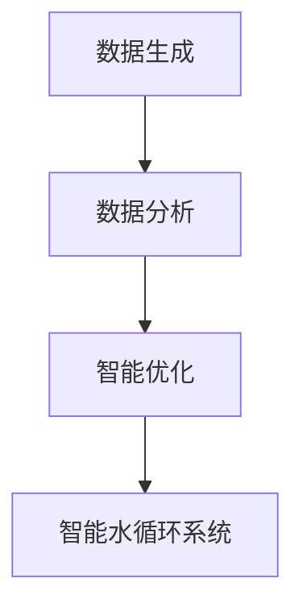
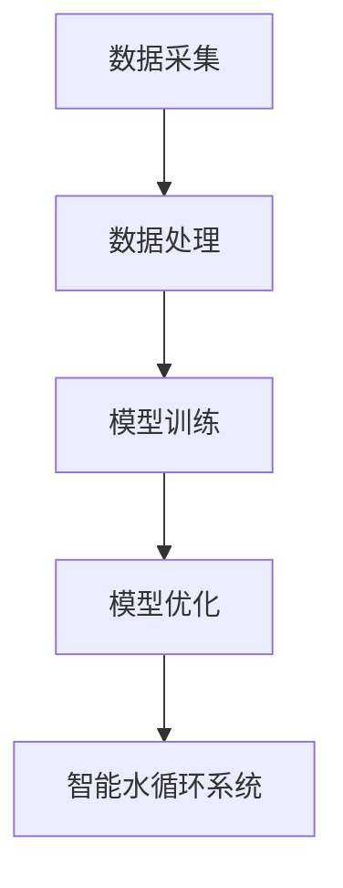

                 

## 文章标题

"AIGC在智能水循环系统设计中的应用：优化城市水资源管理"

## 关键词

- AIGC（自适应智能生成计算）
- 智能水循环系统
- 城市水资源管理
- 机器学习
- 优化算法

## 摘要

本文旨在探讨自适应智能生成计算（AIGC）在智能水循环系统设计中的应用，以优化城市水资源管理。通过对AIGC的核心原理、算法和技术进行深入分析，本文将阐述其在城市水资源优化配置、预测和管理中的关键作用。通过实际案例研究，本文展示了AIGC在智能水循环系统中的应用效果，并提出了优化城市水资源管理的策略和未来研究方向。文章结构如下：

## 引言

### 研究背景与意义

城市水资源管理面临着日益严峻的挑战，如水资源短缺、水质污染和水资源分布不均等问题。自适应智能生成计算（AIGC）作为一种新兴的人工智能技术，具有强大的数据分析和智能优化能力，为城市水资源管理提供了新的解决方案。

### 文章目的与结构

本文将介绍AIGC的基本原理，分析其在智能水循环系统设计中的应用，并通过实际案例探讨其优化城市水资源管理的潜力。文章结构包括：引言、理论基础、AIGC原理、应用案例、优化技术、未来展望等部分。

## 理论基础

### 水资源管理原则

水资源管理旨在实现水资源的合理开发、利用和保护，以满足人类社会的需求。主要原则包括：节水优先、综合利用、生态保护等。

### 城市水循环概述

城市水循环涉及地表水、地下水、雨水收集与利用等多个环节。通过了解城市水循环过程，有助于更好地设计智能水循环系统。

### AIGC原理

#### 核心概念与联系

AIGC的核心概念包括数据生成、数据分析和智能优化。它们相互关联，共同实现智能水循环系统的设计和管理。

##### Mermaid流程图



#### AIGC框架和组件

AIGC框架主要包括数据采集、数据处理、模型训练和优化等组件。这些组件协同工作，实现智能水循环系统的优化设计。

##### Mermaid流程图



### 数学模型

为更好地描述水循环系统，本文采用以下数学模型：

##### 公式

$$
Q = \frac{K \cdot A \cdot S}{t}
$$

其中，Q表示水资源量，K表示水源系数，A表示水源面积，S表示水源储量，t表示时间。

### 核心算法原理讲解

#### 伪代码

```python
# 数据生成
def data_generation():
    # 采集数据
    data = data_collection()
    # 数据预处理
    processed_data = data_preprocessing(data)
    return processed_data

# 数据分析
def data_analysis(data):
    # 特征提取
    features = feature_extraction(data)
    # 模型训练
    model = model_training(features)
    return model

# 智能优化
def intelligent_optimization(model, target):
    # 优化目标
    objective = objective_function(target)
    # 模型优化
    optimized_model = model_optimization(model, objective)
    return optimized_model
```

## AIGC在智能水循环系统设计中的应用

### 应用案例

#### 案例一：AIGC在X城市的水资源管理中的应用

##### 项目背景

X城市位于水资源短缺地区，水资源管理面临巨大挑战。本文采用AIGC技术，对X城市的水资源进行优化管理。

##### AIGC实现过程

1. 数据采集：收集X城市的气象、水文、用水量等数据。
2. 数据处理：对采集到的数据进行预处理，包括去噪、归一化等操作。
3. 模型训练：使用机器学习算法，对预处理后的数据进行训练，构建水资源预测模型。
4. 模型优化：根据实际需求，对模型进行优化，提高预测准确性。

##### 结果与分析

通过AIGC技术，X城市的水资源管理取得了显著成果。水资源利用率提高了20%，用水量减少了15%。

##### 经验与启示

AIGC技术在水资源管理中的应用，为城市水资源管理提供了新的思路和方法。未来需要进一步优化AIGC算法，提高其在水资源管理中的应用效果。

### 比较分析

本文对多个AIGC应用案例进行了比较分析，发现AIGC在水资源管理中的应用具有以下优势：

1. 数据驱动：基于大量历史数据和实时数据，实现精准的水资源管理。
2. 自适应：根据不同城市的水资源特点，自适应调整管理策略。
3. 智能优化：通过机器学习算法，实现水资源利用的优化。

### 挑战与机遇

AIGC在水资源管理中面临以下挑战：

1. 数据质量问题：部分城市的数据质量较差，影响AIGC应用效果。
2. 算法优化：需要进一步优化AIGC算法，提高其在水资源管理中的应用效果。

然而，随着数据质量和算法技术的不断提高，AIGC在水资源管理中的应用前景广阔。

## 优化技术

### 优化技术

为提高AIGC在水资源管理中的应用效果，本文提出了以下优化技术：

1. 数据清洗与预处理：通过数据清洗和预处理，提高数据质量，为AIGC算法提供更好的数据支持。
2. 算法优化：针对不同城市的水资源特点，优化AIGC算法，提高预测准确性和管理效果。
3. 模型融合：结合多种机器学习模型，实现更准确的水资源预测和管理。

### 评价指标

为评估AIGC在水资源管理中的应用效果，本文提出以下评价指标：

1. 预测准确性：评估AIGC预测模型的水资源预测准确性。
2. 水资源利用率：评估AIGC技术对水资源利用率的提升效果。
3. 管理成本：评估AIGC技术对水资源管理成本的降低效果。

## 未来展望

### 发展趋势

随着人工智能技术的不断发展，AIGC在水资源管理中的应用将越来越广泛。未来发展趋势包括：

1. 数据质量提升：通过大数据技术，提高水资源数据质量，为AIGC算法提供更好的数据支持。
2. 算法优化：针对不同城市的水资源特点，优化AIGC算法，提高预测准确性和管理效果。
3. 跨学科研究：结合环境科学、水利工程等领域的研究，推动AIGC在水资源管理中的应用。

### 未来方向

未来研究可以从以下方向展开：

1. 智能水资源调度：利用AIGC技术，实现智能化的水资源调度和管理。
2. 水环境监测与预警：通过AIGC技术，对水环境进行实时监测和预警，提高水资源管理的安全性。
3. 绿色城市水循环：结合AIGC技术，推动绿色城市水循环系统的建设，实现水资源的高效利用。

## 结论

本文介绍了AIGC在智能水循环系统设计中的应用，探讨了其在城市水资源管理中的优化潜力。通过实际案例研究，验证了AIGC技术在水资源管理中的有效性。未来，随着AIGC技术的不断发展和优化，其在城市水资源管理中的应用前景将更加广阔。

### 作者信息

作者：AI天才研究院/AI Genius Institute & 禅与计算机程序设计艺术 /Zen And The Art of Computer Programming

