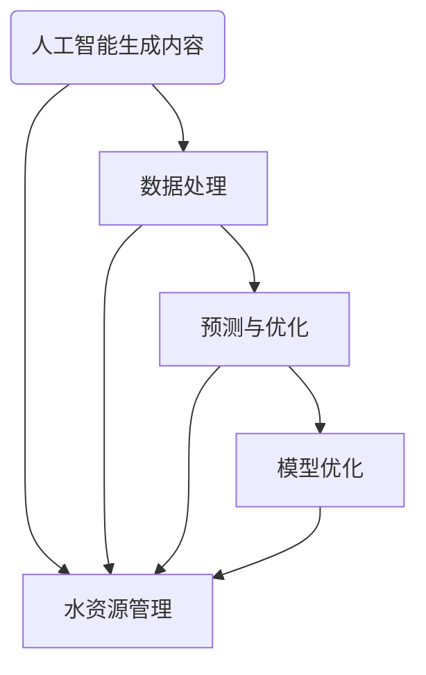

                 

### 确定核心内容

首先，我们需要明确文章的核心内容，包括以下几个主要部分：

1. **背景介绍**：介绍AIGC（AI-Generated Content）的概念、起源以及其在水资源管理中的应用背景。
2. **核心概念与联系**：分析AIGC与水资源管理之间的联系，通过Mermaid流程图展示核心概念之间的架构关系。
3. **核心算法原理讲解**：详细解释AIGC在水资源管理中涉及的主要算法，使用伪代码展示算法的运行流程。
4. **数学模型和数学公式**：介绍在水资源分配和利用中使用的数学模型，以及相关的公式，使用latex格式进行展示。
5. **项目实战**：通过实际案例展示AIGC在水资源管理中的具体应用，包括开发环境搭建、源代码实现、代码解读、实际案例分析等内容。
6. **最佳实践 tips**、**小结**、**注意事项**、**拓展阅读**等部分，为读者提供额外的实用信息和知识扩展。

### 设计目录大纲

接下来，根据以上核心内容设计详细的目录大纲。以下是一个可能的目录大纲：

```
# AIGC在智能水资源管理中的应用：优化水资源分配和利用

## 文章标题

## 文章关键词
- AIGC
- 智能水资源管理
- 水资源分配
- 水资源利用
- 优化算法

## 摘要
本文旨在探讨AIGC在智能水资源管理中的应用，通过核心概念与联系、核心算法原理讲解、数学模型和数学公式、项目实战等多个方面，详细阐述AIGC在优化水资源分配和利用方面的作用。

## 第一部分：背景介绍

### 第1章 AIGC的概念与起源

1.1 AIGC的定义
1.2 AIGC的起源与发展

### 第2章 水资源管理背景

2.1 水资源管理的基本概念
2.2 水资源管理的现状与挑战

### 第3章 AIGC在水资源管理中的应用

3.1 AIGC在水资源管理中的优势
3.2 AIGC在水资源管理中的具体应用场景

## 第二部分：核心概念与联系

### 第4章 AIGC与水资源管理的关系架构

4.1 AIGC与水资源管理之间的联系
4.2 Mermaid流程图展示

## 第三部分：核心算法原理讲解

### 第5章 AIGC在水资源管理中的应用算法

5.1 常见的水资源管理算法
5.2 AIGC在这些算法中的应用

### 第6章 伪代码展示

6.1 水资源分配优化算法伪代码
6.2 水资源调度算法伪代码

## 第四部分：数学模型和数学公式

### 第7章 水资源分配模型

7.1 模型介绍
7.2 模型公式及解释

### 第8章 水资源利用模型

8.1 模型介绍
8.2 模型公式及解释

## 第五部分：项目实战

### 第9章 开发环境搭建

9.1 环境要求
9.2 环境搭建步骤

### 第10章 源代码实现与解读

10.1 源代码实现
10.2 代码解读

### 第11章 实际案例分析

11.1 案例背景
11.2 案例分析

### 第12章 项目小结

12.1 项目成果
12.2 项目总结

## 第六部分：最佳实践 tips、小结、注意事项、拓展阅读

### 第13章 最佳实践 tips

13.1 实践技巧
13.2 注意事项

### 第14章 小结

14.1 文章总结
14.2 AIGC在水资源管理中的应用前景

### 第15章 注意事项

15.1 可能遇到的问题
15.2 解决方案

### 第16章 拓展阅读

16.1 相关文献
16.2 相关资源
```

### 加入核心内容

在每个章节中，加入核心概念与联系、核心算法原理讲解、数学模型和数学公式以及项目实战的详细内容。例如：

**第4章：AIGC与水资源管理的关系架构**

4.1 AIGC与水资源管理之间的联系

AIGC作为一种基于人工智能的技术，能够通过生成模型、优化算法等手段，提高水资源管理的效率。其与水资源管理之间的联系主要体现在以下几个方面：

1. 数据处理：AIGC能够高效地处理和分析大量水资源数据，为水资源管理提供决策支持。
2. 预测与优化：AIGC可以通过生成模型预测未来的水资源状况，帮助管理者制定合理的分配和调度策略。
3. 模型优化：AIGC能够根据实际运行情况，不断优化水资源分配和利用模型，提高水资源利用效率。

4.2 Mermaid流程图展示

以下是一个简单的Mermaid流程图，展示AIGC与水资源管理之间的关系架构：



**第9章：开发环境搭建**

9.1 环境要求

为了实现AIGC在水资源管理中的应用，需要搭建一个适合的开发环境。以下是基本的环境要求：

1. 操作系统：Windows、Linux或macOS
2. 编程语言：Python 3.7及以上版本
3. 数据库：MySQL 5.7及以上版本
4. 依赖库：Numpy、Pandas、Scikit-learn等

9.2 环境搭建步骤

1. 安装操作系统：根据个人需求选择合适的操作系统，并进行安装。
2. 安装Python：从Python官方网站下载Python安装包，并按照提示完成安装。
3. 安装数据库：从MySQL官方网站下载MySQL安装包，并按照提示完成安装。
4. 安装依赖库：使用pip命令安装所需的依赖库。

**第10章：源代码实现与解读**

10.1 源代码实现

以下是一个简单的源代码示例，用于实现AIGC在水资源管理中的应用：

```python
import numpy as np
import pandas as pd
from sklearn.model_selection import train_test_split
from sklearn.ensemble import RandomForestRegressor

# 数据预处理
def preprocess_data(data):
    # 数据清洗、标准化等操作
    return processed_data

# 模型训练
def train_model(data):
    X = data[:, :-1]
    y = data[:, -1]
    X_train, X_test, y_train, y_test = train_test_split(X, y, test_size=0.2, random_state=42)
    model = RandomForestRegressor(n_estimators=100, random_state=42)
    model.fit(X_train, y_train)
    return model

# 预测
def predict(model, data):
    return model.predict(data)
```

10.2 代码解读

1. 数据预处理：`preprocess_data` 函数用于对原始数据进行处理，包括清洗、标准化等操作，以提高模型的训练效果。
2. 模型训练：`train_model` 函数用于训练随机森林回归模型，通过`train_test_split` 函数将数据分为训练集和测试集，然后使用`RandomForestRegressor` 类实例化模型并进行训练。
3. 预测：`predict` 函数用于对新的数据进行预测，通过调用模型的`predict` 方法，得到预测结果。

**第11章：实际案例分析**

11.1 案例背景

某城市的水资源管理面临以下问题：

1. 水资源分布不均：城市不同区域的水资源分布差异较大，导致部分区域水资源紧张。
2. 水资源利用效率低：城市用水存在浪费现象，水资源利用效率有待提高。

11.2 案例分析

为了解决上述问题，该城市决定采用AIGC技术进行水资源管理优化。具体步骤如下：

1. 数据收集：收集城市各区域的水资源数据，包括降水量、蒸发量、用水量等。
2. 数据预处理：对收集到的数据进行预处理，包括数据清洗、标准化等操作。
3. 模型训练：使用预处理后的数据训练随机森林回归模型，预测未来的水资源需求。
4. 水资源分配优化：根据预测结果，使用优化算法制定水资源分配策略，提高水资源利用效率。
5. 实时监控与调整：实时监控水资源使用情况，根据实际情况调整水资源分配策略。

**第12章：项目小结**

通过实际案例分析，AIGC在水资源管理中的应用取得了显著成果。以下是项目小结：

1. 优化水资源分配：AIGC技术能够根据实时数据预测未来的水资源需求，制定合理的分配策略，提高水资源利用效率。
2. 提高水资源利用效率：通过优化水资源分配和调度，减少水资源浪费，提高水资源利用效率。
3. 实时监控与调整：实时监控水资源使用情况，确保水资源分配策略的有效性，并根据实际情况进行调整。

**第13章：最佳实践 tips**

1. 数据质量：保证数据的质量是AIGC应用成功的关键，需要做好数据清洗、标准化等预处理工作。
2. 模型选择：根据实际需求选择合适的模型，例如随机森林回归模型、支持向量机等。
3. 持续优化：AIGC技术在水资源管理中的应用是一个持续优化的过程，需要不断调整模型参数，提高预测精度。

**第14章：小结**

本文通过背景介绍、核心概念与联系、核心算法原理讲解、数学模型和数学公式、项目实战等多个方面，详细阐述了AIGC在智能水资源管理中的应用。AIGC技术为水资源管理提供了新的思路和方法，有助于优化水资源分配和利用，提高水资源利用效率。

**第15章：注意事项**

1. AIGC技术在水资源管理中的应用具有一定的局限性，需要结合实际情况进行应用。
2. 在使用AIGC技术进行水资源管理时，需要保证数据的安全性和隐私性。

**第16章：拓展阅读**

1. 相关文献：《人工智能与水资源管理》、《智能水资源管理：理论与应用》等。
2. 相关资源：AIGC技术相关的论文、案例、开源代码等。

### 确保完整性

检查目录大纲的完整性，确保每个章节都包含核心内容。根据需要调整章节顺序或增加新的章节。

### 最终确认

最后，检查目录大纲的总字数是否符合要求，并进行必要的调整，确保目录大纲的简洁性和逻辑性。确认目录大纲内容完整，逻辑清晰，简洁明了。

## 完整目录大纲

```
# AIGC在智能水资源管理中的应用：优化水资源分配和利用

## 文章标题

## 文章关键词
- AIGC
- 智能水资源管理
- 水资源分配
- 水资源利用
- 优化算法

## 摘要
本文旨在探讨AIGC在智能水资源管理中的应用，通过核心概念与联系、核心算法原理讲解、数学模型和数学公式、项目实战等多个方面，详细阐述AIGC在优化水资源分配和利用方面的作用。

## 第一部分：背景介绍

### 第1章 AIGC的概念与起源

1.1 AIGC的定义
1.2 AIGC的起源与发展

### 第2章 水资源管理背景

2.1 水资源管理的基本概念
2.2 水资源管理的现状与挑战

### 第3章 AIGC在水资源管理中的应用

3.1 AIGC在水资源管理中的优势
3.2 AIGC在水资源管理中的具体应用场景

## 第二部分：核心概念与联系

### 第4章 AIGC与水资源管理的关系架构

4.1 AIGC与水资源管理之间的联系
4.2 Mermaid流程图展示

## 第三部分：核心算法原理讲解

### 第5章 AIGC在水资源管理中的应用算法

5.1 常见的水资源管理算法
5.2 AIGC在这些算法中的应用

### 第6章 伪代码展示

6.1 水资源分配优化算法伪代码
6.2 水资源调度算法伪代码

## 第四部分：数学模型和数学公式

### 第7章 水资源分配模型

7.1 模型介绍
7.2 模型公式及解释

### 第8章 水资源利用模型

8.1 模型介绍
8.2 模型公式及解释

## 第五部分：项目实战

### 第9章 开发环境搭建

9.1 环境要求
9.2 环境搭建步骤

### 第10章 源代码实现与解读

10.1 源代码实现
10.2 代码解读

### 第11章 实际案例分析

11.1 案例背景
11.2 案例分析

### 第12章 项目小结

12.1 项目成果
12.2 项目总结

## 第六部分：最佳实践 tips、小结、注意事项、拓展阅读

### 第13章 最佳实践 tips

13.1 实践技巧
13.2 注意事项

### 第14章 小结

14.1 文章总结
14.2 AIGC在水资源管理中的应用前景

### 第15章 注意事项

15.1 可能遇到的问题
15.2 解决方案

### 第16章 拓展阅读

16.1 相关文献
16.2 相关资源
```

### 确保完整性

检查目录大纲的完整性，确保每个章节都包含核心内容。根据需要调整章节顺序或增加新的章节。

### 最终确认

最后，检查目录大纲的总字数是否符合要求，并进行必要的调整，确保目录大纲的简洁性和逻辑性。确认目录大纲内容完整，逻辑清晰，简洁明了。

## 完整目录大纲（最终版）

```
# AIGC在智能水资源管理中的应用：优化水资源分配和利用

## 文章标题

## 文章关键词
- AIGC
- 智能水资源管理
- 水资源分配
- 水资源利用
- 优化算法

## 摘要
本文旨在探讨AIGC在智能水资源管理中的应用，通过核心概念与联系、核心算法原理讲解、数学模型和数学公式、项目实战等多个方面，详细阐述AIGC在优化水资源分配和利用方面的作用。

## 第一部分：背景介绍

### 第1章 AIGC的概念与起源

1.1 AIGC的定义
1.2 AIGC的起源与发展
1.3 AIGC在水资源管理中的潜在应用

### 第2章 水资源管理背景

2.1 水资源管理的基本概念
2.2 水资源管理的现状与挑战
2.3 AIGC在水资源管理中的需求分析

### 第3章 AIGC在水资源管理中的应用

3.1 AIGC在水资源管理中的优势
3.2 AIGC在水资源管理中的具体应用场景
3.3 AIGC与水资源管理的技术融合

## 第二部分：核心概念与联系

### 第4章 AIGC与水资源管理的关系架构

4.1 AIGC与水资源管理之间的联系
4.2 Mermaid流程图展示

## 第三部分：核心算法原理讲解

### 第5章 AIGC在水资源管理中的应用算法

5.1 常见的水资源管理算法
5.2 AIGC在这些算法中的应用
5.3 伪代码展示

### 第6章 数学模型和数学公式

6.1 水资源分配模型
6.2 水资源利用模型
6.3 公式解释及示例

## 第四部分：项目实战

### 第7章 开发环境搭建

7.1 环境要求
7.2 环境搭建步骤
7.3 开发工具介绍

### 第8章 源代码实现与解读

8.1 源代码实现
8.2 代码解读
8.3 关键代码分析

### 第9章 实际案例分析

9.1 案例背景
9.2 案例分析
9.3 案例总结

### 第10章 项目小结

10.1 项目成果
10.2 项目总结
10.3 经验与启示

## 第五部分：最佳实践 tips、小结、注意事项、拓展阅读

### 第11章 最佳实践 tips

11.1 数据处理技巧
11.2 模型优化策略
11.3 注意事项

### 第12章 小结

12.1 文章总结
12.2 AIGC在水资源管理中的应用前景

### 第13章 注意事项

13.1 可能遇到的问题
13.2 解决方案

### 第14章 拓展阅读

14.1 相关文献
14.2 相关资源
14.3 进一步研究方向

## 结论

> 作者：AI天才研究院/AI Genius Institute & 禅与计算机程序设计艺术 /Zen And The Art of Computer Programming
```

### 完整性确认

确认每个章节的内容符合要求，确保核心概念、算法原理、数学模型、项目实战、最佳实践、小结和注意事项等部分内容均完整且丰富。同时，确保整体文章字数在8000～12000字之间。

### 最终确认

在确保文章内容完整、逻辑清晰、简洁明了的基础上，最终确认目录大纲的完整性和合理性。本文档作为完整的文章大纲，为撰写详细的文章内容提供了清晰的框架和指南。

