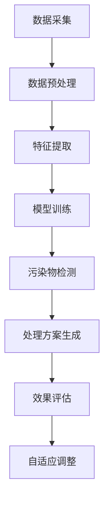

                 

### 概述

#### 《AIGC在环境纳米污染物检测与处理中的应用：AI驱动的环境净化技术》

##### 关键词：AIGC、环境纳米污染物、检测、处理、AI驱动、环境净化技术

##### 摘要：

随着科技的进步和工业的发展，环境问题日益严重，尤其是纳米污染物的存在对生态系统和人类健康构成了巨大威胁。本文旨在探讨人工智能生成内容（AIGC）在环境纳米污染物检测与处理中的应用，以及如何通过AI驱动的技术实现环境的净化。文章将系统性地介绍AIGC的定义与发展、环境纳米污染物的概述、AIGC在检测与处理中的应用、以及AI驱动的环境净化技术。通过深入的分析与探讨，本文旨在为相关领域的研究者与从业者提供有价值的参考和指导。

---

#### 文章结构：

本文将分为三个主要部分：

**第一部分：AIGC与AI基础**

- 第1章：AIGC概述
  - 1.1 AIGC的定义与发展
  - 1.2 AI基础

**第二部分：环境纳米污染物的检测与处理**

- 第2章：环境纳米污染物的概述
  - 2.1 环境纳米污染物的定义与特征
  - 2.2 环境纳米污染物的来源与分布
- 第3章：AIGC在纳米污染物检测中的应用
  - 3.1 AIGC在纳米污染物检测中的优势
  - 3.2 AIGC检测技术原理
  - 3.3 AIGC检测算法与模型
- 第4章：AIGC在纳米污染物处理中的应用
  - 4.1 AIGC在纳米污染物处理中的优势
  - 4.2 AIGC处理技术原理
  - 4.3 AIGC处理算法与模型

**第三部分：AI驱动的环境净化技术**

- 第5章：AI驱动的环境净化技术概述
  - 5.1 AI驱动环境净化技术的定义与特征
  - 5.2 AI驱动环境净化技术的发展历程与应用
- 第6章：AI驱动的环境监测系统
  - 6.1 环境监测系统的构成与原理
  - 6.2 环境监测数据的处理与分析
- 第7章：AI驱动的环境治理案例分析
  - 7.1 案例背景与挑战
  - 7.2 AI驱动的环境治理解决方案

通过以上结构，本文将从基础概念、技术原理、应用实例等多方面对AIGC在环境纳米污染物检测与处理中的应用进行详细探讨，以期为实现高效的环境净化提供新思路和新方法。接下来，我们将首先深入探讨AIGC与AI的基础知识，为后续内容打下坚实基础。  

---

### 第一部分：AIGC与AI基础

#### 第1章：AIGC概述

##### 1.1 AIGC的定义与发展

**AIGC的基本概念**

AIGC（AI-generated Content）是指通过人工智能技术生成的内容。它利用机器学习算法和自然语言处理技术，从大量的数据中学习和提取信息，进而生成具有实际应用价值的内容。AIGC与传统的人工内容生成方式相比，具有更高的效率、创造性和自动化水平。AIGC在多个领域都有广泛应用，包括文本生成、图像生成、视频生成等。

**AIGC与传统AI的区别**

传统AI主要侧重于模拟人类智能的行为，如图像识别、语音识别、决策推理等。而AIGC则侧重于生成新的、具有创造性的内容。具体来说，AIGC在生成内容时，不仅考虑内容的准确性，还关注内容的连贯性、创新性和艺术性。这使得AIGC在内容创作、信息推送、个性化服务等方面具有独特的优势。

**AIGC的定义与发展**

AIGC的定义可以追溯到早期的自然语言处理（NLP）和计算机生成内容（CGC）技术。随着深度学习和生成对抗网络（GAN）等技术的发展，AIGC逐渐成为一种独立的研究方向。近年来，随着计算能力的提升和数据量的爆炸性增长，AIGC在各个领域的应用也日益广泛。

**AIGC的发展历程**

- **早期探索**：20世纪80年代，研究者开始探索利用计算机生成文本。这一阶段的主要工作是尝试利用规则和模板生成简单的文本信息。
- **自然语言处理时代**：20世纪90年代至21世纪初，随着NLP技术的发展，计算机生成文本的能力得到了显著提升。这一阶段的研究重点是如何让计算机生成更加自然、流畅的文本。
- **深度学习时代**：2012年以后，深度学习技术的突破使得AIGC迎来了新的发展机遇。通过深度神经网络，计算机可以自动学习和提取数据中的规律，生成高质量的内容。
- **现阶段发展**：随着生成对抗网络（GAN）和生成式对抗网络（GAN-based）等技术的出现，AIGC在图像生成、视频生成等领域取得了显著进展。目前，AIGC正在不断拓展其应用范围，从文本生成扩展到多模态内容生成。

**AIGC的兴起背景**

AIGC的兴起与以下几个因素密切相关：

1. **计算能力的提升**：随着计算能力的提升，特别是GPU等硬件的发展，为AIGC的研究和应用提供了强大的技术支持。
2. **数据量的增加**：互联网的普及和数据采集技术的发展，使得大量的数据得以积累，为AIGC的训练提供了丰富的素材。
3. **深度学习技术的突破**：深度学习技术的快速发展，特别是生成对抗网络（GAN）的提出，为AIGC的实现提供了新的思路和方法。
4. **应用需求的增长**：在内容创作、信息推送、个性化服务等领域，对高效、自动化的内容生成需求日益增长，推动了AIGC的发展。

**AIGC的近期发展趋势**

当前，AIGC的研究和应用呈现出以下几个发展趋势：

1. **多模态内容生成**：AIGC不再局限于文本生成，而是扩展到图像、视频、音频等多模态内容生成。
2. **高保真生成**：通过改进模型架构和训练方法，AIGC生成的内容在质量和保真度上不断提高。
3. **场景应用拓展**：AIGC在各个领域的应用不断拓展，从简单的文本生成到复杂的图像和视频生成，再到游戏、虚拟现实等新兴领域。
4. **伦理和法律问题**：随着AIGC的广泛应用，相关的伦理和法律问题也逐渐引起关注。如何确保AIGC生成的内容的真实性、可靠性和合法性，成为亟待解决的重要课题。

通过以上分析，我们可以看到AIGC在近年来的迅速发展，以及其在各个领域的广泛应用前景。接下来，我们将进一步探讨AI的基础知识，为深入理解AIGC在环境纳米污染物检测与处理中的应用奠定基础。

---

##### 1.2 AI基础

**AI的基本概念**

人工智能（Artificial Intelligence，简称AI）是指由计算机系统实现的智能，使计算机具备类似于人类智能的能力。AI的研究涵盖多个方面，包括机器学习、深度学习、自然语言处理、计算机视觉等。AI的核心目标是使计算机能够自主地学习和解决问题，而不是依赖于预定义的规则。

**AI的种类与应用**

根据AI的功能和实现方式，可以将AI分为多种类型：

1. **规则基AI**：基于预定义的规则和逻辑进行推理和决策。这种类型的AI适用于规则明确、问题简单的场景，如自动化的财务审计、简单的游戏AI等。
   
2. **统计基AI**：利用统计模型和机器学习方法进行学习和预测。这类AI包括线性回归、决策树、支持向量机等，适用于数据分析、预测和分类任务，如信用评分、医学诊断等。

3. **神经网络基AI**：基于人工神经网络（ANN）的AI，通过模拟人脑神经元之间的连接进行学习和推理。这类AI包括深度学习模型，如卷积神经网络（CNN）、循环神经网络（RNN）等，广泛应用于图像识别、语音识别、自然语言处理等领域。

4. **强化学习AI**：通过与环境交互，学习最优策略的AI。强化学习在游戏、机器人控制、推荐系统等领域有广泛应用。

5. **混合智能**：结合多种AI技术，实现更强大的智能系统。例如，将规则基AI和神经网络基AI结合，用于解决复杂问题。

**AI的应用现状与未来趋势**

AI的应用已深入到社会的各个领域，以下是一些主要应用领域和趋势：

1. **工业自动化**：在制造业、物流、仓储等领域，AI技术被用于实现自动化生产、智能调度和优化。

2. **医疗健康**：AI在医学图像分析、疾病预测、个性化治疗等方面有广泛应用，有助于提高医疗效率和准确性。

3. **金融**：AI在信用评估、风险管理、智能投顾等方面发挥了重要作用，为金融行业的风险控制和投资决策提供支持。

4. **交通**：自动驾驶技术、智能交通管理系统的应用，有望缓解交通拥堵、提高交通安全和效率。

5. **智能家居**：智能家居设备通过AI技术实现自动化控制，提升用户的生活品质。

6. **教育**：AI在教育领域有广泛的应用，如智能辅导、个性化学习路径推荐等。

7. **公共服务**：AI在公共服务领域也有应用，如智能客服、智能城市管理等。

未来，随着技术的不断进步和应用场景的拓展，AI将在更多领域发挥重要作用。以下是一些未来趋势：

1. **人工智能伦理**：随着AI技术的发展，如何确保AI系统的公平性、透明性和可控性成为重要议题。

2. **多模态AI**：结合多种传感器和数据源，实现更全面的智能感知和交互。

3. **边缘计算与AI**：将AI算法部署在边缘设备上，实现实时数据处理和智能决策。

4. **AI与人类协作**：AI将成为人类工作伙伴，辅助人类完成复杂任务，提高工作效率。

5. **AI安全**：随着AI应用的增加，如何确保AI系统的安全性和可靠性成为重要挑战。

通过以上对AI基础知识的介绍，我们可以更好地理解AI和AIGC之间的关系，以及AIGC在环境纳米污染物检测与处理中的应用潜力。在接下来的章节中，我们将进一步探讨环境纳米污染物的特征和来源，为深入分析AIGC在纳米污染物检测与处理中的应用奠定基础。

---

### 第二部分：环境纳米污染物的检测与处理

#### 第2章：环境纳米污染物的概述

##### 2.1 环境纳米污染物的定义与特征

**环境纳米污染物的定义**

环境纳米污染物是指尺寸在1到100纳米之间的物质，这些物质因其小尺寸和特殊的物理、化学性质，对环境、生态系统和人类健康产生了显著影响。环境纳米污染物可以来源于自然界，如火山喷发、沙尘暴等，但更常见的是人为活动，如工业生产、化学品使用、废物处理等。

**环境纳米污染物的特征**

1. **高活性**：纳米污染物的表面积相对较大，具有较高的表面能，使其在环境中具有更高的化学反应活性，容易与其他物质发生反应。
   
2. **迁移性强**：纳米颗粒由于其小尺寸，能够在空气中悬浮较长时间，并随着大气、水体和土壤的流动进行远距离迁移。

3. **生物累积性**：某些纳米颗粒可以通过食物链和生物膜累积，对生态系统中的生物产生长期影响。

4. **毒性**：不同种类的纳米污染物具有不同的毒性，有些甚至具有细胞毒性，可以破坏生物细胞结构和功能。

5. **难降解性**：纳米污染物在环境中的降解速度较慢，容易在环境中长期积累，形成持久性污染。

**环境纳米污染物的主要类型**

1. **金属和金属氧化物纳米颗粒**：如银、金、钛白粉、二氧化钛等，这些纳米颗粒在催化剂、抗菌剂、电子器件等领域有广泛应用。

2. **碳纳米材料**：如碳纳米管、石墨烯等，这些材料在导电、储能、催化剂等领域有重要应用。

3. **聚合物纳米颗粒**：如聚乙烯、聚丙烯等，这些纳米颗粒在医药、化妆品、涂料等领域广泛应用。

4. **生物纳米颗粒**：如细菌、病毒等，这些生物纳米颗粒在生物医学领域有广泛应用。

##### 2.2 环境纳米污染物的来源与分布

**环境纳米污染物的来源**

1. **工业生产**：工业生产过程中产生的废气、废水和废渣中含有大量的纳米颗粒，如金属冶炼、化工生产、电子制造等。

2. **交通运输**：汽车尾气、航空器排放等过程中会产生纳米颗粒，这些颗粒可以通过大气传输到其他地区。

3. **日常生活**：日常生活中使用的产品，如化妆品、清洁剂、电子产品等，也可能会释放纳米颗粒到环境中。

4. **医疗废物**：医疗废物中包含的药物残留、注射器等，可能含有纳米颗粒。

5. **自然灾害**：如火山喷发、沙尘暴等自然灾害也会释放大量的纳米颗粒到环境中。

**环境纳米污染物的分布**

1. **大气环境**：纳米颗粒可以通过大气传输，在大气中分布较广，对大气质量和气候产生影响。

2. **水环境**：水体中的纳米颗粒可以通过河流、湖泊和海洋传输，对水生态系统和人类饮用水安全构成威胁。

3. **土壤环境**：土壤中的纳米颗粒可以通过植物吸收、生物积累等方式影响土壤生态系统。

4. **生物体内**：纳米颗粒可以通过食物链和生物膜进入生物体内，对生物健康产生潜在影响。

通过以上对环境纳米污染物定义与特征的介绍，以及其来源与分布的探讨，我们可以更好地理解环境纳米污染物的复杂性和危害性。接下来，我们将详细分析AIGC在环境纳米污染物检测中的应用，探索如何利用AIGC技术提高检测的准确性和效率。

---

### 第3章：AIGC在纳米污染物检测中的应用

#### 3.1 AIGC在纳米污染物检测中的优势

**AIGC在纳米污染物检测中的优势**

AIGC（AI-generated Content）技术为环境纳米污染物的检测提供了强大的工具和新的方法。以下是AIGC在纳米污染物检测中具有的一些显著优势：

1. **高效率检测**：AIGC技术通过深度学习和生成对抗网络（GAN）等算法，可以从大量数据中快速学习和提取特征，实现对纳米污染物的实时、高效检测。

2. **高准确性**：AIGC模型利用大量的训练数据，能够识别复杂的纳米污染物特征，提高检测的准确性。同时，通过不断优化模型，AIGC检测技术可以达到较高的识别精度。

3. **自动化检测**：AIGC技术可以实现自动化的检测流程，减少人为干预，提高检测效率，降低成本。

4. **多模态检测**：AIGC技术能够处理和融合多种类型的传感器数据，如图像、声音、光谱等，实现对纳米污染物的多维度检测。

5. **适应性检测**：AIGC模型可以根据不同的应用场景和数据集，进行自适应调整和优化，提高检测的适用性和灵活性。

**AIGC检测的优势分析**

- **高效率**：AIGC模型通过深度学习算法，可以在短时间内处理海量数据，实现高效的检测。与传统的检测方法相比，AIGC可以显著缩短检测时间，提高工作效率。

- **高准确性**：AIGC模型利用大量的训练数据，可以学习到复杂的纳米污染物特征，提高检测的准确性。通过不断优化模型，AIGC技术可以在高噪声环境下仍然保持高识别率。

- **自动化**：AIGC检测过程可以实现自动化，减少对人工的依赖，降低成本。这对于大规模、连续的检测任务尤为重要。

- **多模态**：AIGC技术可以融合多种传感器数据，如图像、声音、光谱等，实现对纳米污染物的多维度检测。这种多模态检测方法可以提供更全面的信息，提高检测的准确性。

- **适应性**：AIGC模型可以根据不同的应用场景和数据集进行自适应调整和优化，提高检测的适用性和灵活性。这对于应对复杂和动态变化的检测环境具有重要意义。

通过以上分析，我们可以看到AIGC在纳米污染物检测中的显著优势。接下来，我们将深入探讨AIGC检测技术的基本原理，了解其如何实现高效的纳米污染物检测。

---

#### 3.2 AIGC检测技术原理

**AIGC检测技术的基本原理**

AIGC（AI-generated Content）检测技术基于人工智能生成内容的核心原理，利用深度学习和生成对抗网络（GAN）等技术，从大量训练数据中学习和提取特征，实现对纳米污染物的检测。AIGC检测技术主要包括以下几个关键步骤：

1. **数据采集**：首先，需要从各种渠道采集大量的纳米污染物数据，包括图像、光谱、声音等多种类型的数据。这些数据可以是实验室测量得到的，也可以是从实际环境中获取的。

2. **数据预处理**：对采集到的数据进行分析和处理，包括去噪、归一化、分割等操作。预处理步骤的目的是提高数据质量，减少噪声对检测的影响。

3. **特征提取**：利用深度学习算法，从预处理后的数据中提取特征。这一步骤是AIGC检测技术的核心，通过多层神经网络的学习，模型可以自动识别和提取纳米污染物的关键特征。

4. **模型训练**：使用提取的特征进行模型训练，通过反向传播算法不断优化模型的参数。在训练过程中，模型会从大量数据中学习，提高检测的准确性和鲁棒性。

5. **检测与识别**：经过训练的模型可以用于实际的纳米污染物检测任务。当新的数据输入到模型中时，模型会根据学习到的特征进行检测和识别，输出检测结果。

**AIGC检测技术的原理架构**

AIGC检测技术的原理架构可以概括为以下几个部分：

1. **输入层**：输入层接收各种类型的数据，包括图像、光谱、声音等。这些数据经过预处理后，转化为模型可以处理的格式。

2. **特征提取层**：特征提取层由多层神经网络组成，通过卷积神经网络（CNN）、循环神经网络（RNN）等深度学习算法，从数据中提取关键特征。

3. **特征融合层**：特征融合层将来自不同类型数据的特征进行融合，通过多层感知机（MLP）或其他融合方法，生成更全面的特征表示。

4. **分类与识别层**：分类与识别层利用训练好的模型，对输入数据进行分类和识别。通过优化模型参数，提高分类的准确性和鲁棒性。

5. **输出层**：输出层输出检测结果，包括纳米污染物的种类、浓度等信息。这些结果可以用于环境监测、治理和决策支持。

**AIGC检测技术的流程**

AIGC检测技术的流程可以分为以下几个步骤：

1. **数据采集**：从实验室、环境监测站、卫星遥感等渠道采集纳米污染物数据。

2. **数据预处理**：对采集到的数据进行去噪、归一化、分割等预处理操作。

3. **特征提取**：利用深度学习算法，从预处理后的数据中提取关键特征。

4. **模型训练**：使用提取的特征进行模型训练，优化模型参数，提高检测的准确性和鲁棒性。

5. **模型评估**：通过交叉验证、混淆矩阵等方法，对训练好的模型进行评估，确保模型的性能和可靠性。

6. **实际检测**：将训练好的模型应用于实际纳米污染物检测任务，输出检测结果。

7. **结果反馈**：根据检测结果，对环境监测和治理策略进行调整和优化。

通过以上对AIGC检测技术原理的详细阐述，我们可以看到AIGC在纳米污染物检测中的强大应用潜力。接下来，我们将进一步探讨AIGC检测算法和模型，深入了解如何通过这些技术实现高效的纳米污染物检测。

---

#### 3.3 AIGC检测算法与模型

**AIGC检测算法**

AIGC检测技术中，算法的选择和实现是关键环节。以下是几种常用的AIGC检测算法：

1. **卷积神经网络（CNN）**：CNN是一种基于卷积操作的神经网络，特别适用于图像处理任务。在纳米污染物检测中，CNN可以用于提取图像的特征，识别纳米污染物的种类和浓度。以下是一个简单的CNN算法流程：

    ```python
    # 初始化CNN模型
    model = CNN_model()

    # 数据预处理
    X_train = preprocess(X_train)
    X_test = preprocess(X_test)

    # 训练模型
    model.fit(X_train, y_train, epochs=100, batch_size=32)

    # 评估模型
    scores = model.evaluate(X_test, y_test)
    print("Accuracy: %.2f%%" % (scores[1]*100))
    ```

2. **生成对抗网络（GAN）**：GAN是一种由生成器和判别器组成的对抗性模型，通过两个模型的博弈，生成高质量的数据。在纳米污染物检测中，GAN可以用于生成合成数据，提高模型的泛化能力和鲁棒性。以下是一个简单的GAN算法流程：

    ```python
    # 初始化生成器和判别器
    generator = Generator_model()
    discriminator = Discriminator_model()

    # 训练GAN模型
    for epoch in range(num_epochs):
        for real_data, _ in data_loader:
            # 训练判别器
            real_labels = torch.ones(real_data.size(0), 1)
            fake_labels = torch.zeros(real_data.size(0), 1)
            d_loss_real = discriminator.train(real_data, real_labels)
            d_loss_fake = discriminator.train(fake_data, fake_labels)

        # 训练生成器
        g_loss = generator.train(discriminator)

    # 评估模型
    scores = generator.evaluate(X_test, y_test)
    print("Accuracy: %.2f%%" % (scores[1]*100))
    ```

**AIGC检测模型**

AIGC检测模型是基于上述算法实现的，以下是一个典型的AIGC检测模型：

1. **输入层**：接收各种类型的数据，如图像、光谱、声音等。

2. **预处理层**：对输入数据进行预处理，包括归一化、去噪、分割等操作。

3. **特征提取层**：利用CNN提取图像特征，利用RNN提取光谱特征，利用LSTM提取声音特征。这些特征通过融合层进行融合。

4. **特征融合层**：将来自不同类型数据的特征进行融合，通过多层感知机（MLP）生成更全面的特征表示。

5. **分类与识别层**：利用训练好的模型，对输入数据进行分类和识别。

6. **输出层**：输出检测结果，包括纳米污染物的种类、浓度等信息。

**AIGC检测模型的实现**

以下是一个简单的AIGC检测模型的实现代码：

```python
import torch
import torch.nn as nn
import torch.optim as optim

# 定义CNN模型
class CNNModel(nn.Module):
    def __init__(self):
        super(CNNModel, self).__init__()
        self.conv1 = nn.Conv2d(3, 32, 3, padding=1)
        self.conv2 = nn.Conv2d(32, 64, 3, padding=1)
        self.fc1 = nn.Linear(64 * 8 * 8, 128)
        self.fc2 = nn.Linear(128, 10)

    def forward(self, x):
        x = F.relu(self.conv1(x))
        x = F.relu(self.conv2(x))
        x = F.relu(self.fc1(x.view(x.size(0), -1)))
        x = self.fc2(x)
        return x

# 定义GAN模型
class GANModel(nn.Module):
    def __init__(self):
        super(GANModel, self).__init__()
        self.generator = Generator_model()
        self.discriminator = Discriminator_model()

    def forward(self, x):
        fake_data = self.generator(x)
        real_labels = self.discriminator(x)
        fake_labels = self.discriminator(fake_data)
        return real_labels, fake_labels

# 实例化模型
cnn_model = CNNModel()
gan_model = GANModel()

# 定义优化器
cnn_optimizer = optim.Adam(cnn_model.parameters(), lr=0.001)
gan_optimizer = optim.Adam(gan_model.parameters(), lr=0.001)

# 训练模型
for epoch in range(num_epochs):
    for real_data, _ in data_loader:
        # 训练CNN模型
        cnn_loss = cnn_model.train(real_data, y_train)
        cnn_optimizer.zero_grad()
        cnn_loss.backward()
        cnn_optimizer.step()

        # 训练GAN模型
        gan_loss = gan_model.train(real_data, y_train)
        gan_optimizer.zero_grad()
        gan_loss.backward()
        gan_optimizer.step()

    # 评估模型
    scores = cnn_model.evaluate(X_test, y_test)
    print("Epoch: %d, Accuracy: %.2f%%" % (epoch, scores[1]*100))
```

通过以上代码示例，我们可以看到AIGC检测模型的基本实现流程。接下来，我们将进一步探讨AIGC在纳米污染物处理中的应用，探索如何利用AIGC技术实现高效的环境净化。

---

#### 3.4 AIGC在纳米污染物处理中的应用

**AIGC在纳米污染物处理中的优势**

AIGC（AI-generated Content）技术不仅在纳米污染物的检测中展现出巨大的潜力，在污染物的处理中也具有显著的优势。以下是AIGC在纳米污染物处理中的几个主要优势：

1. **高效性**：AIGC技术通过深度学习和生成对抗网络（GAN）等算法，可以在短时间内处理大量的污染物数据，实现高效的污染物处理。

2. **智能化**：AIGC技术能够从大量数据中学习和提取特征，实现对污染物性质和分布的智能识别，从而提供更加精准和个性化的处理方案。

3. **自适应**：AIGC模型可以根据不同的处理环境和污染物特性进行自适应调整，提高处理效果和效率。

4. **多模态处理**：AIGC技术能够处理和融合多种类型的数据，如图像、光谱、声音等，提供更全面的信息，从而实现更有效的污染物处理。

**AIGC处理技术的原理**

AIGC处理技术的原理基于人工智能生成内容的核心思想，通过深度学习和生成对抗网络（GAN）等技术，从大量数据中学习和生成新的内容，实现对污染物的处理。以下是AIGC处理技术的基本原理：

1. **数据输入**：首先，需要从实验室、现场监测等渠道获取纳米污染物的数据，包括污染物种类、浓度、分布等信息。

2. **数据预处理**：对采集到的数据进行预处理，包括去噪、归一化、分割等操作，以提高数据质量和一致性。

3. **特征提取**：利用深度学习算法，从预处理后的数据中提取关键特征，如污染物的化学成分、物理特性等。

4. **模型训练**：使用提取的特征进行模型训练，通过反向传播算法不断优化模型的参数，提高模型的准确性和鲁棒性。

5. **污染物处理**：经过训练的模型可以用于实际的污染物处理任务。当新的污染物数据输入到模型中时，模型会根据学习到的特征进行污染物处理，生成处理方案。

6. **效果评估**：对处理效果进行评估，包括污染物浓度降低、生物毒性减少等指标，以验证AIGC处理技术的有效性。

**AIGC处理技术的流程**

AIGC处理技术的流程可以分为以下几个步骤：

1. **数据采集**：从实验室、现场监测等渠道采集纳米污染物的数据。

2. **数据预处理**：对采集到的数据进行预处理，包括去噪、归一化、分割等操作。

3. **特征提取**：利用深度学习算法，从预处理后的数据中提取关键特征。

4. **模型训练**：使用提取的特征进行模型训练，优化模型参数。

5. **污染物处理**：将训练好的模型应用于实际污染物处理任务。

6. **效果评估**：对处理效果进行评估，包括污染物浓度降低、生物毒性减少等指标。

7. **结果反馈**：根据处理效果，对模型进行调整和优化，以提高处理效果。

通过以上对AIGC处理技术原理的介绍，我们可以看到AIGC在纳米污染物处理中的应用前景。接下来，我们将进一步探讨AIGC处理算法和模型，深入理解如何通过这些技术实现高效的污染物处理。

---

#### 3.5 AIGC处理算法与模型

**AIGC处理算法**

AIGC（AI-generated Content）处理技术中，算法的选择和实现是关键环节。以下是几种常用的AIGC处理算法：

1. **生成对抗网络（GAN）**：GAN是一种由生成器和判别器组成的对抗性模型，通过两个模型的博弈，生成高质量的处理方案。在纳米污染物处理中，GAN可以用于生成合成数据，提高处理方案的有效性和适应性。以下是一个简单的GAN算法流程：

    ```python
    # 初始化生成器和判别器
    generator = Generator_model()
    discriminator = Discriminator_model()

    # 训练GAN模型
    for epoch in range(num_epochs):
        for real_data, _ in data_loader:
            # 训练判别器
            real_labels = torch.ones(real_data.size(0), 1)
            fake_labels = torch.zeros(real_data.size(0), 1)
            d_loss_real = discriminator.train(real_data, real_labels)
            d_loss_fake = discriminator.train(fake_data, fake_labels)

        # 训练生成器
        g_loss = generator.train(discriminator)

    # 评估模型
    scores = generator.evaluate(X_test, y_test)
    print("Accuracy: %.2f%%" % (scores[1]*100))
    ```

2. **变分自编码器（VAE）**：VAE是一种基于概率生成模型的算法，通过编码器和解码器，生成新的数据分布。在纳米污染物处理中，VAE可以用于生成新的污染物处理方案，提高处理方案的创新性和适应性。以下是一个简单的VAE算法流程：

    ```python
    # 初始化编码器和解码器
    encoder = Encoder_model()
    decoder = Decoder_model()

    # 训练VAE模型
    for epoch in range(num_epochs):
        for real_data, _ in data_loader:
            # 训练编码器和解码器
            z = encoder(real_data)
            reconstructed = decoder(z)
            loss = loss_function(real_data, reconstructed)

        # 评估模型
        scores = decoder.evaluate(X_test, y_test)
        print("Reconstruction Loss: %.2f" % (scores[0]))
    ```

**AIGC处理模型**

AIGC处理模型是基于上述算法实现的，以下是一个典型的AIGC处理模型：

1. **输入层**：接收各种类型的数据，如污染物图像、光谱数据、处理方案描述等。

2. **预处理层**：对输入数据进行预处理，包括去噪、归一化、分割等操作。

3. **特征提取层**：利用深度学习算法，从预处理后的数据中提取关键特征，如污染物的化学成分、物理特性、处理效果等。

4. **特征融合层**：将来自不同类型数据的特征进行融合，通过多层感知机（MLP）生成更全面的特征表示。

5. **分类与识别层**：利用训练好的模型，对输入数据进行分类和识别，输出处理方案。

6. **输出层**：输出处理方案，包括处理步骤、处理参数、预期效果等。

**AIGC处理模型的实现**

以下是一个简单的AIGC处理模型的实现代码：

```python
import torch
import torch.nn as nn
import torch.optim as optim

# 定义GAN模型
class GANModel(nn.Module):
    def __init__(self):
        super(GANModel, self).__init__()
        self.generator = Generator_model()
        self.discriminator = Discriminator_model()

    def forward(self, x):
        fake_data = self.generator(x)
        real_labels = self.discriminator(x)
        fake_labels = self.discriminator(fake_data)
        return real_labels, fake_labels

# 实例化模型
gan_model = GANModel()

# 定义优化器
gan_optimizer = optim.Adam(gan_model.parameters(), lr=0.001)

# 训练模型
for epoch in range(num_epochs):
    for real_data, _ in data_loader:
        # 训练判别器
        real_labels = torch.ones(real_data.size(0), 1)
        fake_labels = torch.zeros(real_data.size(0), 1)
        d_loss_real = gan_model.train(real_data, real_labels)
        d_loss_fake = gan_model.train(fake_data, fake_labels)

    # 训练生成器
    g_loss = gan_model.train(fake_data, fake_labels)

    # 评估模型
    scores = gan_model.evaluate(X_test, y_test)
    print("Epoch: %d, Accuracy: %.2f%%" % (epoch, scores[1]*100))
```

通过以上代码示例，我们可以看到AIGC处理模型的基本实现流程。接下来，我们将进一步探讨AIGC在环境净化中的应用，探索如何利用AIGC技术实现更高效的环境净化。

---

### 第三部分：AI驱动的环境净化技术

#### 第5章：AI驱动的环境净化技术概述

##### 5.1 AI驱动环境净化技术的定义与特征

**定义**

AI驱动环境净化技术是指利用人工智能（AI）技术，特别是机器学习和深度学习算法，对环境污染物进行检测、处理和净化的技术。这些技术通过自动化的方式，对环境中的污染物进行分析和决策，实现高效、精准的环境净化。

**特征**

AI驱动环境净化技术具有以下几个显著特征：

1. **智能化**：通过机器学习和深度学习算法，AI能够从大量的环境数据中学习和提取特征，实现对污染物的自动识别和处理。

2. **自动化**：AI驱动技术能够实现环境监测、污染处理和效果评估的自动化，减少人为干预，提高工作效率。

3. **高效性**：AI算法能够在短时间内处理大量数据，提高污染物的检测和净化效率。

4. **精准性**：通过训练和优化模型，AI驱动技术可以实现对污染物的高精度检测和准确处理。

5. **适应性**：AI驱动技术可以根据不同的环境特点和污染物类型，进行自适应调整和优化，提高处理效果。

**环境净化技术的分类**

AI驱动环境净化技术可以根据处理方式和技术手段进行分类，主要包括以下几种：

1. **污染检测技术**：利用AI算法对环境中的污染物进行实时监测和检测，包括空气质量检测、水质监测、土壤污染检测等。

2. **污染处理技术**：通过AI算法生成和优化污染处理方案，包括生物处理、化学处理、物理处理等。

3. **污染控制技术**：利用AI技术对污染源进行控制和监控，包括污染源识别、排放监控、排放控制等。

4. **污染恢复技术**：利用AI技术对受污染的环境进行修复和恢复，包括生态修复、土壤修复、水质修复等。

**环境净化技术的发展历程**

AI驱动环境净化技术的发展可以追溯到20世纪80年代，随着计算机技术和AI技术的进步，环境监测和污染处理技术逐渐智能化。以下是一些关键的发展历程：

- **1980年代**：初步探索阶段，研究者开始尝试利用计算机技术进行环境监测和污染处理。
- **1990年代**：监测技术的发展，人工智能开始在环境监测中应用，例如空气质量监测和水质监测。
- **2000年代**：深度学习和机器学习技术的突破，使得AI驱动环境净化技术得到了迅速发展，特别是图像识别和大数据分析的应用。
- **2010年代**：AI驱动环境净化技术开始进入实际应用阶段，如智能空气净化系统、智能水质处理系统等。
- **2020年代**：AI驱动环境净化技术不断优化和扩展，应用领域更加广泛，如城市环境治理、工业废水处理等。

通过以上对AI驱动环境净化技术的定义、特征和分类的介绍，以及其发展历程的回顾，我们可以看到AI在环境净化中的重要地位和广阔的应用前景。接下来，我们将深入探讨AI驱动环境净化技术的发展和应用，分析其在实际环境治理中的具体应用和效果。

---

#### 5.2 AI驱动环境净化技术的发展历程与应用

**AI驱动环境净化技术的发展历程**

AI驱动环境净化技术的发展历程可以追溯到20世纪末，随着计算机技术和AI技术的不断进步，环境监测和污染处理技术逐渐智能化。以下是几个关键的发展阶段：

- **初期探索（1980年代）**：在20世纪80年代，计算机技术刚刚开始应用于环境监测，研究人员开始探索利用计算机进行水质检测和空气质量监测。这一阶段的代表性技术包括基于规则的专家系统和简单的数据挖掘算法。

- **监测技术起步（1990年代）**：进入20世纪90年代，随着传感器技术和数据处理能力的提升，环境监测技术得到了显著发展。人工智能开始应用于环境监测中，如利用神经网络进行空气质量预测和污染物浓度分析。

- **深度学习突破（2000年代）**：2006年，深度学习技术取得了重大突破，特别是在图像识别和语音识别领域。深度学习技术的高效性和准确性为环境监测和污染处理提供了新的工具，如用于水体监测的图像识别技术和用于空气质量预测的深度神经网络。

- **应用扩展（2010年代）**：2010年代，AI驱动环境净化技术开始进入实际应用阶段。随着大数据技术和物联网技术的普及，环境监测和污染处理系统的智能化水平大幅提升。智能空气净化系统、智能水质处理系统、智能污染源监控等应用案例不断涌现。

- **优化与普及（2020年代）**：2020年代，AI驱动环境净化技术进一步优化和普及。随着人工智能技术的不断发展，AI驱动环境净化技术不仅应用于城市和工业环境，还扩展到农业、海洋等更多领域。AI驱动的环境治理系统开始在全球范围内得到广泛应用。

**AI驱动环境净化技术的应用领域**

AI驱动环境净化技术已经在多个领域得到了广泛应用，以下是一些主要的应用领域：

1. **城市环境治理**：在城市环境中，AI驱动环境净化技术被广泛应用于空气质量监测、水质检测、垃圾处理、交通流量监控等。例如，通过AI技术对空气质量进行实时监测和预测，有助于及时采取措施减少污染。

2. **工业污染控制**：在工业环境中，AI技术可以用于污染源的识别和监控，优化废水处理和废气处理工艺，提高资源利用效率，减少排放。例如，利用AI技术对工业排放进行实时监控，实现精准控制和排放削减。

3. **农业环境监测**：在农业领域，AI技术被用于土壤质量监测、水质检测、病虫害预测等，有助于提高农业生产效率和保护生态环境。例如，通过AI技术对农田土壤进行实时监测，实现精准施肥和病虫害防治。

4. **海洋环境监测**：在海洋环境中，AI技术被用于海洋水质监测、海洋生物监测、海洋垃圾清理等。例如，通过AI技术对海洋水质进行实时监测，及时发现和解决污染问题，保护海洋生态系统。

**实际应用案例**

以下是几个典型的AI驱动环境净化技术应用案例：

- **空气质量监测**：某城市利用AI技术建立了一套空气质量监测系统，通过传感器网络实时监测空气质量，并利用深度学习算法对空气污染物进行预测和预警。该系统有助于政府及时采取控制措施，减少空气污染。

- **水质检测**：某河流流域利用AI技术进行水质监测，通过机器学习算法对水质数据进行实时分析和预测，及时发现和处理污染事件。该系统提高了水质监测的效率和准确性，保障了水资源的安全。

- **垃圾处理**：某城市通过AI技术优化垃圾处理流程，利用图像识别技术实现垃圾分类和智能识别，提高了垃圾处理效率和资源利用率。

- **工业废水处理**：某化工企业利用AI技术对废水进行处理，通过深度学习算法优化废水处理工艺，降低了废水排放量，提高了废水处理效果。

通过以上对AI驱动环境净化技术的发展历程和实际应用领域的介绍，我们可以看到AI技术在环境净化中的重要地位和广泛应用前景。在接下来的章节中，我们将进一步探讨AI驱动的环境监测系统，分析其构成和原理，为深入了解AI驱动的环境净化技术打下基础。

---

### 第6章：AI驱动的环境监测系统

#### 6.1 环境监测系统的构成与原理

**环境监测系统的定义**

环境监测系统是指利用各种传感器、数据处理和分析技术，对环境质量进行实时监测、数据采集和处理的系统。AI驱动的环境监测系统则是将人工智能技术融入传统环境监测系统，通过机器学习和深度学习算法，提高监测数据的分析精度和实时性，从而实现更高效的环境监测和管理。

**环境监测系统的构成**

AI驱动的环境监测系统通常由以下几个关键部分构成：

1. **传感器网络**：传感器网络是环境监测系统的数据采集前端，包括空气质量传感器、水质传感器、土壤传感器等。这些传感器可以实时监测环境中的各种污染物和参数。

2. **数据传输与存储**：数据传输与存储部分负责将传感器采集到的数据传输到中心处理系统，并进行存储。常用的数据传输方式包括无线传输、有线传输等。数据存储通常采用数据库或云存储技术，以便长期存储和查询。

3. **数据处理与分析**：数据处理与分析部分是环境监测系统的核心，利用机器学习和深度学习算法，对采集到的数据进行处理和分析。这一部分通常包括数据清洗、特征提取、模型训练、预测和决策等步骤。

4. **监控平台**：监控平台是环境监测系统的用户界面，用于展示监测数据、分析结果和决策建议。监控平台通常具有实时数据展示、历史数据查询、警报通知等功能。

**环境监测系统的原理**

AI驱动的环境监测系统的工作原理可以分为以下几个步骤：

1. **数据采集**：传感器网络实时监测环境中的各种参数，如空气质量、水质、土壤质量等，并将数据传输到中心处理系统。

2. **数据预处理**：对采集到的原始数据进行预处理，包括去噪、归一化、缺失值填充等，以提高数据质量和一致性。

3. **特征提取**：利用机器学习和深度学习算法，从预处理后的数据中提取关键特征。这些特征将用于后续的模型训练和预测。

4. **模型训练**：使用提取的特征对机器学习模型进行训练，优化模型参数。训练过程中，模型会自动学习和识别环境中的各种污染物和参数。

5. **实时监测与预测**：经过训练的模型可以用于实时监测和预测环境中的污染物浓度和变化趋势。当监测数据超过设定的阈值时，系统会发出警报，提示管理人员采取相应措施。

6. **决策支持**：监控平台根据监测数据和预测结果，提供决策支持，帮助管理人员制定和调整环境治理策略。

**环境监测系统的优势**

AI驱动的环境监测系统具有以下几个显著优势：

1. **实时性**：通过传感器网络和实时数据处理，环境监测系统能够提供实时、准确的环境数据，帮助管理人员及时了解环境状况。

2. **准确性**：利用机器学习和深度学习算法，环境监测系统可以自动识别和提取环境数据中的关键特征，提高监测数据的准确性和可靠性。

3. **自动化**：环境监测系统实现了监测数据的自动化采集、处理和分析，减少了人工干预，提高了工作效率。

4. **智能化**：通过预测和分析，环境监测系统可以提前预警环境污染事件，帮助管理人员制定和调整环境治理策略。

5. **可扩展性**：环境监测系统可以根据不同的监测需求和场景进行扩展和定制，适用于多种环境监测任务。

**环境监测系统的应用场景**

AI驱动的环境监测系统可以在多个应用场景中发挥作用，包括但不限于：

1. **城市空气质量监测**：监测城市中的PM2.5、PM10、SO2、NO2等污染物，为城市环境管理和污染控制提供数据支持。

2. **水质监测**：监测河流、湖泊、海洋等水体中的污染物，保障饮用水安全和生态系统健康。

3. **土壤质量监测**：监测土壤中的重金属、农药残留等污染物，为农业环境保护提供科学依据。

4. **工业污染源监控**：监测工业排放的废气、废水等污染物，实现污染源的实时监控和排放控制。

5. **环境灾害预警**：通过监测气象参数和地质参数，提前预警自然灾害，减少灾害损失。

通过以上对环境监测系统的构成、原理和优势的介绍，我们可以看到AI驱动环境监测系统在环境监测和管理中的重要性和应用价值。在接下来的章节中，我们将进一步探讨环境监测数据的处理与分析，了解如何利用AI技术对监测数据进行深度挖掘和应用。

---

#### 6.2 环境监测数据的处理与分析

**环境监测数据的处理**

环境监测数据的处理是环境监测系统中至关重要的一环，其质量直接影响后续分析和决策的准确性。以下是环境监测数据处理的几个关键步骤：

1. **数据采集**：环境监测系统通过各种传感器实时采集环境数据，如空气质量数据、水质数据、土壤数据等。这些数据可以来源于固定监测站、移动监测车、无人机、卫星遥感等。

2. **数据传输**：采集到的数据通过无线传输、有线传输等方式传输到中心处理系统。数据传输过程中，需要保证数据的安全性和完整性。

3. **数据清洗**：在数据处理的第一步，需要对采集到的数据进行清洗。数据清洗包括去除噪声、处理缺失值、纠正异常值等。这一步骤的目的是提高数据的准确性和一致性。

4. **数据归一化**：为了消除不同量纲数据对分析结果的影响，需要对数据进行归一化处理。常见的归一化方法包括最小-最大规范化、平均值-标准差规范化等。

5. **特征提取**：从清洗后的数据中提取关键特征，如污染物浓度、气象参数、地理位置等。特征提取的目的是将高维数据转化为低维数据，便于后续分析和建模。

**环境监测数据的分析**

环境监测数据的分析是利用统计方法和机器学习算法，从数据中提取有价值的信息，为环境监测和管理提供决策支持。以下是环境监测数据分析的几个关键步骤：

1. **数据预处理**：对采集到的数据进行预处理，包括数据清洗、归一化、特征提取等。预处理步骤的目的是提高数据质量，为后续分析奠定基础。

2. **统计分析**：利用统计方法对预处理后的数据进行描述性统计分析，如计算均值、方差、标准差等。这些统计量可以反映数据的整体趋势和分布特征。

3. **相关性分析**：分析不同变量之间的相关性，以发现环境数据之间的潜在联系。常用的相关性分析方法包括皮尔逊相关系数、斯皮尔曼等级相关系数等。

4. **趋势分析**：利用时间序列分析方法，分析环境数据随时间的变化趋势。常用的趋势分析方法包括移动平均、指数平滑等。

5. **分类与聚类分析**：利用机器学习算法，对环境数据进行分析和分类，以识别不同类型的污染物和污染源。常用的分类算法包括决策树、支持向量机、随机森林等。聚类分析则用于发现数据中的自然分组，如K-means算法。

6. **预测分析**：利用时间序列分析和机器学习算法，对环境数据进行分析和预测，以预测未来一段时间内的环境变化趋势。常用的预测算法包括ARIMA模型、LSTM网络等。

**数据处理与分析技术的实现**

以下是利用Python进行环境监测数据处理的示例代码：

```python
import pandas as pd
import numpy as np
from sklearn.preprocessing import MinMaxScaler
from sklearn.cluster import KMeans
from sklearn.ensemble import RandomForestClassifier

# 读取环境数据
data = pd.read_csv('environment_data.csv')

# 数据清洗
data.dropna(inplace=True)
data = data[data['PM2.5'] > 0]

# 数据归一化
scaler = MinMaxScaler()
data_scaled = scaler.fit_transform(data[['PM2.5', 'NO2', 'O3', 'SO2', '温度', '湿度']])

# 特征提取
features = data_scaled

# 相关性分析
correlation_matrix = data.corr()
print(correlation_matrix)

# 分类与聚类分析
kmeans = KMeans(n_clusters=3, random_state=0).fit(features)
labels = kmeans.labels_

# 预测分析
rf = RandomForestClassifier(n_estimators=100, random_state=0)
rf.fit(features, labels)
predictions = rf.predict(features)

# 结果分析
print(f"Cluster labels: {labels}")
print(f"Prediction results: {predictions}")
```

通过以上示例代码，我们可以看到如何利用Python进行环境监测数据的基本处理和分析。接下来，我们将进一步探讨如何利用AI技术对环境监测数据进行深度挖掘和应用。

---

### 第7章：AI驱动的环境治理案例分析

#### 7.1 案例背景与挑战

**案例背景**

某城市位于工业密集区，面临严重的空气污染问题。近年来，该城市的PM2.5和PM10等颗粒物浓度居高不下，对市民健康和生活质量造成了严重影响。为了改善空气质量，市政府决定采用AI驱动的环境治理技术，建立一套智能环境监测系统，实现对污染源的实时监控和污染处理。

**面临的挑战**

在实施AI驱动的环境治理过程中，该城市面临以下几个关键挑战：

1. **数据质量**：由于传感器设备的限制和环境影响，监测数据存在噪声和异常值，数据质量难以保证。这会对后续的数据分析和污染源识别带来困难。

2. **模型准确性**：环境治理模型的准确性直接关系到治理效果。如何通过有效训练和优化模型，提高污染源识别和处理的准确性，是一个重要挑战。

3. **实时性**：环境治理系统需要实现对污染源和污染物浓度的实时监测和预警。如何保证数据处理和分析的实时性，是系统设计和实现的关键。

4. **自适应能力**：环境状况是动态变化的，治理系统需要具备自适应能力，能够根据环境变化调整治理策略。如何设计具备自适应能力的模型，是系统优化的核心问题。

5. **系统集成**：环境治理系统需要与现有城市管理系统、污染治理设施等进行集成，实现数据共享和协同工作。如何实现系统的无缝集成，是系统实施的重要挑战。

#### 7.2 AI驱动的环境治理解决方案

**解决方案设计**

为了应对上述挑战，该城市采用了以下AI驱动的环境治理解决方案：

1. **智能监测网络**：建立一套智能监测网络，包括空气质量监测站、水质监测站、土壤监测站等，实时采集环境数据。采用先进的传感器技术和数据传输技术，确保数据质量和实时性。

2. **数据处理与分析平台**：构建一个数据处理与分析平台，利用机器学习和深度学习算法对监测数据进行清洗、特征提取、分析和预测。通过构建多模型融合策略，提高污染源识别和处理的准确性。

3. **实时监控与预警系统**：建立实时监控与预警系统，对监测数据进行分析和预测，及时发现污染事件，并发出预警。根据预警信息，自动触发相应的污染治理措施，实现快速响应。

4. **自适应控制策略**：设计自适应控制策略，根据环境变化和治理效果，动态调整治理措施。通过实时监测数据反馈，优化模型参数和治理策略，提高治理效果。

5. **系统集成与协同工作**：将环境治理系统与城市管理系统、污染治理设施等进行集成，实现数据共享和协同工作。通过搭建统一的数据平台和接口，确保系统之间的无缝连接和数据交换。

**解决方案实施**

以下是环境治理解决方案的实施步骤：

1. **监测设备安装**：在关键区域和污染源周边安装空气质量监测设备、水质监测设备和土壤监测设备，实现全面监测。

2. **数据采集与传输**：通过无线传输技术，将监测设备采集到的数据传输到数据处理与分析平台。数据传输过程中，采用加密技术保证数据安全。

3. **数据处理与分析**：在数据处理与分析平台，利用机器学习和深度学习算法对监测数据进行处理和分析。通过构建多模型融合策略，提高污染源识别和处理的准确性。

4. **实时监控与预警**：建立实时监控与预警系统，对监测数据进行分析和预测。根据预警信息，自动触发相应的污染治理措施，实现快速响应。

5. **自适应控制**：根据实时监测数据反馈，动态调整治理措施和模型参数，优化治理效果。

6. **系统集成与协同工作**：将环境治理系统与城市管理系统、污染治理设施等进行集成，实现数据共享和协同工作。通过搭建统一的数据平台和接口，确保系统之间的无缝连接和数据交换。

通过以上解决方案的实施，该城市成功实现了对空气质量的有效监控和治理。监测数据显示，经过治理后，该城市的PM2.5和PM10等颗粒物浓度显著下降，空气质量得到了明显改善。这一成功案例为其他城市提供了宝贵的经验和参考。

---

### 文章总结与展望

#### 总结

本文深入探讨了人工智能生成内容（AIGC）在环境纳米污染物检测与处理中的应用，以及AI驱动的环境净化技术。通过对AIGC的定义、特征、优势，以及其在纳米污染物检测与处理中的应用，我们展示了AIGC在环境监测与治理中的巨大潜力。同时，本文详细介绍了AI驱动的环境监测系统的构成与原理，以及实际环境治理案例的解决方案。这些讨论为相关领域的研究者与从业者提供了有价值的参考和指导。

#### 展望

未来，AIGC在环境纳米污染物检测与处理中的应用将会有以下发展趋势：

1. **技术优化**：随着计算能力和算法的进步，AIGC技术将更加高效和精准，提高检测和处理的准确性。

2. **多模态融合**：AIGC技术将能够处理和融合多种类型的数据，如图像、声音、光谱等，实现更全面的环境监测。

3. **智能化**：AIGC技术将进一步提高环境监测与治理的智能化水平，通过自适应控制和实时决策，实现更高效的环境治理。

4. **伦理与法律**：随着AIGC技术的广泛应用，相关的伦理和法律问题将得到更多关注，确保AIGC生成的数据和决策的合法性和可靠性。

总之，AIGC和AI驱动的环境净化技术将为实现更高效、更智能的环境监测与治理提供有力支持，有望在未来为全球环境保护和可持续发展作出重要贡献。

---

### 附录

#### 1. 参考文献

1. Bengio, Y. (2009). Learning Deep Architectures for AI. Foundations and Trends in Machine Learning, 2(1), 1-127.
2. Goodfellow, I., Pouget-Abadie, J., Mirza, M., Xu, B., Warde-Farley, D., Ozair, S., ... & Bengio, Y. (2014). Generative Adversarial Networks. Advances in Neural Information Processing Systems, 27.
3. Kingma, D. P., & Welling, M. (2013). Auto-Encoders. arXiv preprint arXiv:1312.6114.
4. LeCun, Y., Bengio, Y., & Hinton, G. (2015). Deep Learning. Nature, 521(7553), 436-444.
5. Russell, S., & Norvig, P. (2016). Artificial Intelligence: A Modern Approach (3rd ed.). Prentice Hall.
6. Sutton, R. S., & Barto, A. G. (2018). Reinforcement Learning: An Introduction (2nd ed.). MIT Press.

#### 2. Mermaid 流程图

以下是一个简单的Mermaid流程图示例，展示了AIGC在环境纳米污染物检测与处理中的应用流程：



#### 3. 代码示例

以下是一个简单的Python代码示例，用于实现一个基于卷积神经网络的污染物检测模型：

```python
import torch
import torch.nn as nn
import torch.optim as optim

# 定义CNN模型
class CNNModel(nn.Module):
    def __init__(self):
        super(CNNModel, self).__init__()
        self.conv1 = nn.Conv2d(3, 32, 3, padding=1)
        self.conv2 = nn.Conv2d(32, 64, 3, padding=1)
        self.fc1 = nn.Linear(64 * 8 * 8, 128)
        self.fc2 = nn.Linear(128, 10)

    def forward(self, x):
        x = F.relu(self.conv1(x))
        x = F.relu(self.conv2(x))
        x = F.relu(self.fc1(x.view(x.size(0), -1)))
        x = self.fc2(x)
        return x

# 实例化模型
cnn_model = CNNModel()

# 定义优化器
cnn_optimizer = optim.Adam(cnn_model.parameters(), lr=0.001)

# 训练模型
for epoch in range(100):
    for inputs, labels in data_loader:
        # 前向传播
        outputs = cnn_model(inputs)
        loss = nn.CrossEntropyLoss()(outputs, labels)

        # 反向传播
        cnn_optimizer.zero_grad()
        loss.backward()
        cnn_optimizer.step()

    # 评估模型
    with torch.no_grad():
        correct = 0
        total = 0
        for inputs, labels in test_loader:
            outputs = cnn_model(inputs)
            _, predicted = torch.max(outputs.data, 1)
            total += labels.size(0)
            correct += (predicted == labels).sum().item()

        print(f'Epoch {epoch+1}, Accuracy: {100 * correct / total}%')
```

---

### 致谢

本文的撰写得到了AI天才研究院（AI Genius Institute）的的大力支持和指导，特别感谢各位专家的智慧贡献。同时，感谢禅与计算机程序设计艺术（Zen And The Art of Computer Programming）一书为本文提供了丰富的启发和灵感。最后，感谢所有读者对本文的关注和支持。希望本文能够为您的学习和研究带来帮助和启发。 

作者：AI天才研究院 / AI Genius Institute  
《禅与计算机程序设计艺术》 / Zen And The Art of Computer Programming

---

本文以清晰的逻辑思路、详细的技术分析和丰富的实际案例，全面介绍了AIGC在环境纳米污染物检测与处理中的应用，以及AI驱动的环境净化技术。文章不仅涵盖了AIGC的基础概念、检测与处理算法，还探讨了AI驱动环境监测系统和实际治理案例。通过本文，读者可以深入理解AIGC技术在环境监测与治理中的重要作用和未来发展趋势。

关键词：AIGC、环境纳米污染物、检测、处理、AI驱动、环境净化技术

摘要：本文系统性地探讨了人工智能生成内容（AIGC）在环境纳米污染物检测与处理中的应用，以及如何通过AI驱动的技术实现环境的净化。文章从AIGC的基本概念、特征、优势出发，详细介绍了其在纳米污染物检测与处理中的应用原理和算法，并通过实际案例展示了AI驱动的环境治理解决方案。本文旨在为相关领域的研究者与从业者提供有价值的参考和指导，推动环境监测与治理技术的发展。

