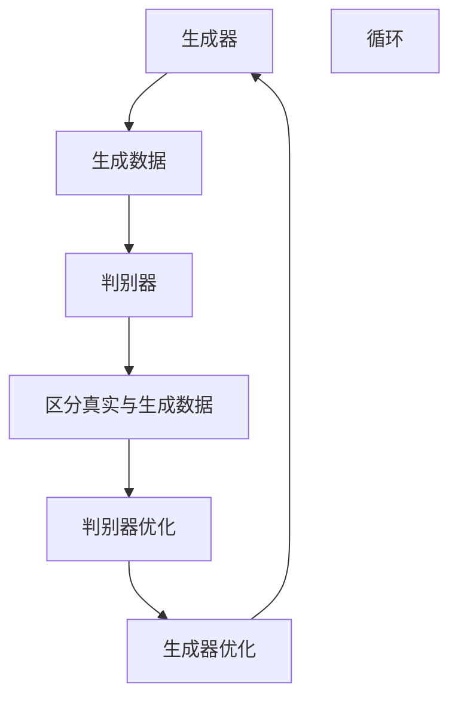
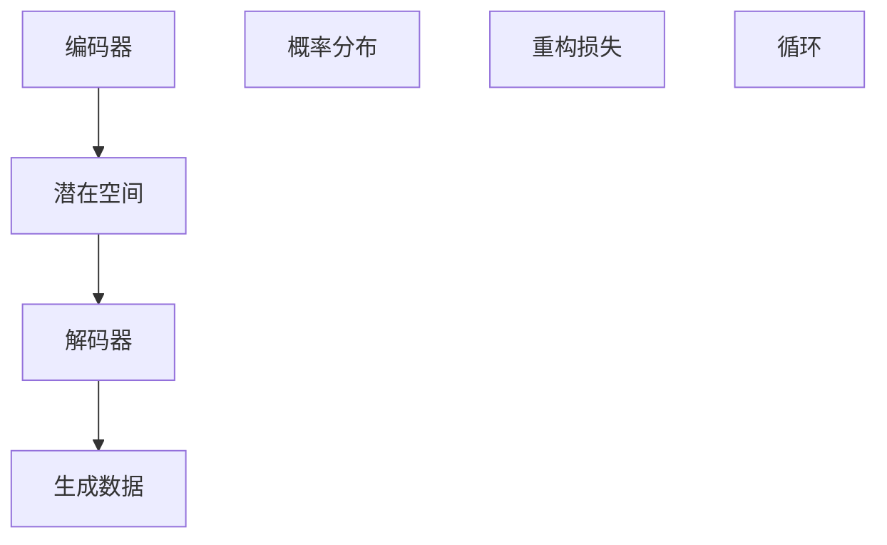
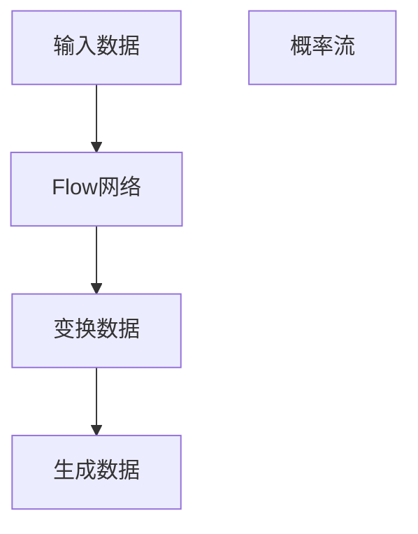

                 


## 文章标题

AIGC在精准气候工程中的应用：局部气候调节的AI解决方案

## 文章关键词

AIGC，精准气候工程，局部气候调节，AI解决方案，生成对抗网络，变分自编码器，数学模型，算法原理

## 摘要

本文将深入探讨人工智能生成内容（AIGC）在精准气候工程中的应用，特别是其在局部气候调节方面的潜力。我们将首先介绍AIGC的基本概念和原理，然后分析其在气候数据分析中的实际应用。接下来，我们将详细阐述AIGC在森林防火、水资源管理和农业生产等局部气候调节领域的具体应用案例，并通过数学模型和算法原理的讲解，展示AIGC技术在实际项目中的实现过程。最后，我们将展望AIGC在精准气候工程中的未来应用，并讨论可能面临的技术挑战和伦理问题。

## 第1章 引言

### 1.1 精准气候工程的背景

精准气候工程是一种利用先进技术和方法对特定区域的气候进行调节和优化的手段。其核心目标是通过精确控制和操作气候因素，如温度、湿度、风速等，来改善环境质量，促进农业生产，降低灾害风险，以及实现能源的有效利用。随着全球气候变化和环境污染的加剧，精准气候工程在现代社会中扮演着越来越重要的角色。

传统气候工程通常依赖于大规模的物理设施和手段，如温室、灌溉系统等。然而，这些方法存在成本高、效率低、环境影响大等缺点。相比之下，AIGC提供了一种新的解决方案，通过利用人工智能技术生成虚拟气候数据，从而实现更精准、高效和环保的气候调节。

### 1.2 AIGC的概念

AIGC，即人工智能生成内容，是指利用人工智能技术生成各种类型的数据和内容，包括文本、图像、音频、视频等。在气候工程领域，AIGC技术可以用于生成虚拟气候数据，模拟不同气候条件下的环境影响，预测气候变化趋势，以及优化气候调节策略。

AIGC的核心技术包括生成对抗网络（GAN）、变分自编码器（VAE）和Flow模型等。这些技术通过学习大量真实数据，生成出与真实数据高度相似的虚拟数据，从而为精准气候工程提供了强大的工具。

### 1.3 AIGC在精准气候工程中的潜在应用

AIGC在精准气候工程中具有广泛的应用潜力。首先，在气候数据分析方面，AIGC可以用于生成大量的虚拟气候数据，从而提高数据的质量和可用性。这些虚拟数据可以用于训练更先进的气候模型，提高气候预测的准确性。

其次，在局部气候调节方面，AIGC可以用于模拟不同的气候调节策略，评估其效果和影响。例如，在森林防火中，AIGC可以生成虚拟的灭火策略，模拟火灾在不同条件下的扩散情况，从而优化灭火方案。

此外，AIGC还可以用于水资源管理和农业生产的优化。通过生成虚拟的气候数据，可以模拟不同的灌溉策略和种植方案，从而提高水资源利用效率和作物产量。

总之，AIGC在精准气候工程中的应用为解决气候问题提供了一种新的思路和手段。随着AIGC技术的不断发展和完善，其在气候工程领域的应用前景将更加广阔。

### 1.4 本文结构

本文将分为以下几个部分：

1. **第1章 引言**：介绍精准气候工程和AIGC的概念，以及AIGC在精准气候工程中的潜在应用。
2. **第2章 AIGC基本原理**：详细讲解AIGC的基本原理，包括生成对抗网络（GAN）、变分自编码器（VAE）和Flow模型等。
3. **第3章 AIGC在气候数据分析中的应用**：分析AIGC在气候数据分析中的具体应用，包括数据生成、数据清洗和模型训练等。
4. **第4章 AIGC在局部气候调节中的应用**：探讨AIGC在局部气候调节中的具体应用，包括森林防火、水资源管理和农业生产等。
5. **第5章 数学模型与算法原理**：讲解AIGC中使用的数学模型和算法原理，包括数据生成算法和模型优化算法等。
6. **第6章 案例研究**：通过具体案例，展示AIGC技术在实际项目中的应用和效果。
7. **第7章 未来展望与挑战**：讨论AIGC在精准气候工程中的未来应用，以及可能面临的技术挑战和伦理问题。

### 1.5 关键词

- 精准气候工程
- 人工智能生成内容（AIGC）
- 生成对抗网络（GAN）
- 变分自编码器（VAE）
- Flow模型
- 气候数据分析
- 局部气候调节
- 数学模型
- 算法原理

### 1.6 小结

本章介绍了精准气候工程和AIGC的基本概念，以及AIGC在精准气候工程中的潜在应用。接下来，我们将深入探讨AIGC的基本原理，分析其在气候数据分析中的具体应用，并探讨其在局部气候调节中的应用案例。通过这些讨论，我们将进一步理解AIGC在精准气候工程中的重要作用和未来发展方向。

## 第2章 AIGC基本原理

### 2.1 数据生成模型

AIGC的核心在于其数据生成模型，这些模型能够生成与真实数据高度相似的数据，从而为各类应用提供强大的支持。目前，常用的数据生成模型包括生成对抗网络（GAN）、变分自编码器（VAE）和Flow模型等。这些模型各有特点，适用于不同的应用场景。

#### 2.1.1 生成对抗网络（GAN）

生成对抗网络（GAN）是由Ian Goodfellow等人于2014年提出的一种深度学习模型，其核心思想是通过两个神经网络（生成器和判别器）的博弈来生成数据。生成器的任务是生成虚假数据，判别器的任务是区分真实数据和生成数据。通过不断优化这两个网络，生成器能够生成越来越逼真的数据。

GAN的原理可以用以下流程图来描述：



以下是一个简单的GAN模型伪代码：

```python
# 生成器G的伪代码
G(z) = Generator(z)

# 判别器D的伪代码
D(x) = Discriminator(x)

# 损失函数
Loss = Loss(D(G(z)), D(x))

# 优化过程
Optimize(G, D)
```

GAN的优势在于其强大的生成能力，但同时也存在一些挑战，如模式崩溃和训练不稳定等问题。

#### 2.1.2 变分自编码器（VAE）

变分自编码器（VAE）是另一种常用的数据生成模型，由Kingma和Welling于2013年提出。与GAN不同，VAE使用概率编码来生成数据，其核心思想是学习一个潜在变量模型，并将生成过程看作是从潜在空间到数据空间的映射。

VAE的原理可以用以下流程图来描述：



以下是一个简单的VAE模型伪代码：

```python
# 编码器E的伪代码
 encode(x) = Encoder(x)
 z ~ q(z|x)

# 解码器D的伪代码
 decode(z) = Decoder(z)

# 损失函数
Loss = KLD(q(z|x)||p(z)) + REconstruction Loss
```

VAE的优势在于其训练稳定性和生成质量，但相比于GAN，其生成能力稍逊一筹。

#### 2.1.3 Flow模型

Flow模型是另一种生成模型，由Dinh等人于2014年提出。Flow模型的核心思想是通过一系列的可逆变换来生成数据，这些变换可以被视为一个概率流，使得生成过程更加稳定和可控。

Flow模型的原理可以用以下流程图来描述：



以下是一个简单的Flow模型伪代码：

```python
# Flow网络F的伪代码
F(x) = FlowNetwork(x)

# 生成器G的伪代码
G(x) = InverseFlowNetwork(F(x))
```

Flow模型的优势在于其训练稳定性和生成质量，同时也能够处理复杂的高维数据。

### 2.2 模型训练与优化

在AIGC的应用中，模型的训练与优化是至关重要的一环。有效的训练方法可以提高模型的生成质量，而优化的策略则可以加速模型的收敛速度。

#### 2.2.1 模型训练方法

常见的模型训练方法包括批量训练、随机梯度下降（SGD）和Adam优化算法等。批量训练是指每次训练使用整个数据集，这种方法可以保证模型的泛化能力，但训练时间较长。随机梯度下降（SGD）是指每次训练只使用一部分数据，这种方法可以加速模型的训练，但可能导致模型过拟合。Adam优化算法是结合SGD和Adam优化的一种方法，可以在保证训练速度的同时，避免过拟合。

以下是一个简单的训练过程伪代码：

```python
# 初始化模型参数
Initialize Model Parameters

# 训练过程
for epoch in range(num_epochs):
  for batch in data_loader:
    # 前向传播
    outputs = model(batch)
    
    # 计算损失
    loss = criterion(outputs, targets)
    
    # 反向传播
    optimizer.zero_grad()
    loss.backward()
    optimizer.step()
```

#### 2.2.2 模型优化策略

模型优化策略包括正则化、Dropout和数据增强等。正则化是一种防止模型过拟合的方法，通过在损失函数中添加惩罚项来限制模型的复杂度。Dropout是一种在训练过程中随机丢弃部分神经元的方法，从而防止模型过拟合。数据增强是一种通过增加数据的多样性来提高模型泛化能力的方法，如翻转、裁剪、旋转等。

以下是一个简单的优化过程伪代码：

```python
# 正则化
Regularization = L1_L2_Restriction

# Dropout
Dropout_Rate = 0.5

# 数据增强
Data_Augmentation = Flip, Crop, Rotate
```

通过以上训练和优化方法，我们可以有效地提高AIGC模型的生成质量，从而在精准气候工程中发挥更大的作用。

### 2.3 小结

本章详细介绍了AIGC的基本原理，包括数据生成模型、模型训练与优化方法。通过理解这些原理，我们可以更好地应用AIGC技术于精准气候工程，实现更高效、更精确的局部气候调节。接下来，我们将探讨AIGC在气候数据分析中的具体应用，进一步揭示其在精准气候工程中的潜力。

## 第3章 AIGC在气候数据分析中的应用

### 3.1 气候数据预处理

在气候数据分析中，数据预处理是一个关键步骤，它直接影响到后续分析和模型的性能。AIGC技术在数据预处理中发挥了重要作用，能够通过生成高质量的虚拟数据，补充缺失的数据，提高数据的可用性和质量。

#### 3.1.1 数据采集

气候数据通常来源于气象站、卫星、模型模拟等多种途径。这些数据包含了大量的温度、湿度、风速、降水等气候变量。然而，这些数据往往存在不一致性和不完整性，例如某些地区的观测数据可能缺失，或者在特定时间点上观测数据质量较低。

AIGC技术可以通过生成对抗网络（GAN）或变分自编码器（VAE）生成与真实数据相似的虚拟数据，从而补充缺失的数据。例如，GAN可以通过训练生成器网络，使其生成与真实气候数据相似的温度和湿度数据，填补缺失的数据。

以下是一个简单的GAN数据生成过程伪代码：

```python
# 数据生成器G的伪代码
z = Sampling(p_z)
generated_data = G(z)

# 生成虚拟温度和湿度数据
virtual_temp = G_temp(z)
virtual_humidity = G_humidity(z)
```

#### 3.1.2 数据清洗

在数据预处理过程中，数据清洗也是一个重要的环节。清洗过程包括去除异常值、处理缺失值和统一数据格式等。

AIGC技术可以通过生成对抗网络（GAN）或变分自编码器（VAE）识别并处理异常值。例如，GAN可以生成与真实数据相似的基准数据，通过与这些基准数据进行对比，识别出异常值并进行处理。

以下是一个简单的GAN数据清洗过程伪代码：

```python
# 训练GAN模型
Train_GAN()

# 数据清洗
for data in dataset:
  clean_data = GAN_Discriminator(data)
  if clean_data is valid:
    continue
  else:
    Handle_Invalid_Data(data)
```

#### 3.1.3 数据标准化

数据标准化是确保数据在同一尺度上进行比较和建模的重要步骤。AIGC技术可以通过变分自编码器（VAE）或Flow模型实现数据标准化。

VAE可以通过编码器网络将数据映射到一个潜在空间，然后通过对潜在空间的数据进行缩放和变换，实现数据标准化。

以下是一个简单的VAE数据标准化过程伪代码：

```python
# 编码器E的伪代码
encoded_data = Encoder(data)
normalized_data = Scale(encoded_data)

# 解码器D的伪代码
decoded_data = Decoder(normalized_data)
```

### 3.2 气候数据建模

在气候数据预处理之后，数据建模是进一步分析和预测的关键步骤。AIGC技术可以通过生成高质量的虚拟数据，提高数据建模的准确性和效率。

#### 3.2.1 时间序列分析

时间序列分析是气候数据分析中的一个重要领域，它涉及对时间序列数据（如气温、降水等）的建模和预测。AIGC技术可以通过生成对抗网络（GAN）或变分自编码器（VAE）生成虚拟时间序列数据，用于训练更准确的时间序列模型。

以下是一个简单的时间序列分析过程伪代码：

```python
# 数据生成器G的伪代码
z = Sampling(p_z)
generated_time_series = G(z)

# 时间序列模型训练
model = Train_Time_Series_Model(generated_time_series)

# 时间序列预测
predicted_time_series = model.predict()
```

#### 3.2.2 空间数据分析

空间数据分析涉及对空间分布数据的分析，如温度分布、降水分布等。AIGC技术可以通过生成对抗网络（GAN）或Flow模型生成虚拟的空间分布数据，用于训练空间分析模型。

以下是一个简单的空间数据分析过程伪代码：

```python
# 数据生成器G的伪代码
z = Sampling(p_z)
generated_space_data = G(z)

# 空间分析模型训练
model = Train_Space_Analysis_Model(generated_space_data)

# 空间分布预测
predicted_space_distribution = model.predict()
```

#### 3.2.3 混合模型应用

在气候数据分析中，混合模型（如深度神经网络、支持向量机等）常用于结合不同类型的数据（如时间序列数据和空间分布数据）进行建模。AIGC技术可以通过生成虚拟数据，提高混合模型的建模准确性和泛化能力。

以下是一个简单的混合模型应用过程伪代码：

```python
# 数据生成器G的伪代码
z = Sampling(p_z)
generated_combined_data = G(z)

# 混合模型训练
model = Train_Mixed_Model(generated_combined_data)

# 混合模型预测
predicted_combined_distribution = model.predict()
```

### 3.3 小结

本章介绍了AIGC在气候数据分析中的应用，包括数据预处理和建模。通过生成高质量的虚拟数据，AIGC技术能够提高数据的质量和可用性，为气候分析提供更准确、更可靠的基础。在下一章中，我们将探讨AIGC在局部气候调节中的具体应用，展示其在实际项目中的效果和潜力。

## 第4章 AIGC在局部气候调节中的应用

### 4.1 模型应用场景分析

局部气候调节是指在特定地区通过调节气候参数（如温度、湿度、风速等）来改善局部气候条件的技术。AIGC技术在局部气候调节中具有广泛的应用场景，包括森林防火、水资源管理和农业生产等。以下是这些应用场景的具体分析。

#### 4.1.1 森林防火

森林防火是保护森林资源和人类安全的重要措施。AIGC技术可以通过生成虚拟气候数据，模拟不同灭火策略的效果，从而优化灭火方案。例如，通过GAN生成虚拟的风速和温度数据，模拟火灾在不同条件下的扩散情况，帮助消防员制定更有效的灭火策略。

以下是一个简单的森林防火应用场景伪代码：

```python
# 数据生成器G的伪代码
z = Sampling(p_z)
generated_wind_speed = G_wind_speed(z)
generated_temperature = G_temperature(z)

# 灭火策略模拟
fire_spread_simulation(generated_wind_speed, generated_temperature)
```

#### 4.1.2 水资源管理

水资源管理是确保水资源合理利用和可持续发展的关键。AIGC技术可以通过生成虚拟的气候数据，模拟不同灌溉策略的效果，从而优化水资源管理。例如，通过VAE生成虚拟的降水和蒸发数据，评估不同灌溉方案对水资源利用的影响。

以下是一个简单的水资源管理应用场景伪代码：

```python
# 数据生成器E的伪代码
encoded_water_data = Encoder(water_data)
normalized_water_data = Scale(encoded_water_data)

# 灌溉策略模拟
irrigation_simulation(normalized_water_data)
```

#### 4.1.3 农业生产

农业生产是气候调节的重要应用领域。AIGC技术可以通过生成虚拟的气候数据，模拟不同种植方案的效果，从而优化农业生产。例如，通过Flow模型生成虚拟的温度和降水数据，评估不同作物在不同气候条件下的生长情况。

以下是一个简单的农业生产应用场景伪代码：

```python
# 数据生成器F的伪代码
generated_temperature = FlowNetwork(temperature_input)
generated_precipitation = FlowNetwork(precipitation_input)

# 种植方案模拟
crop_growth_simulation(generated_temperature, generated_precipitation)
```

### 4.2 模型实施与优化

在局部气候调节中，AIGC模型的实施和优化是确保其有效性和可靠性的关键步骤。以下是具体实施与优化过程的详细讲解。

#### 4.2.1 模型参数调整

模型参数的调整是优化模型性能的重要手段。在AIGC模型中，生成器和判别器的参数调整尤为重要。以下是一个简单的参数调整过程伪代码：

```python
# 参数初始化
Initialize_Model_Parameters()

# 参数调整
for parameter in model.parameters():
  Adjust_Parameter(parameter)
```

#### 4.2.2 模型优化策略

模型优化策略包括正则化、Dropout和数据增强等。正则化可以通过L1或L2正则化项限制模型的复杂度，防止过拟合。Dropout可以通过随机丢弃神经元来提高模型的泛化能力。数据增强可以通过翻转、裁剪、旋转等操作增加数据的多样性。

以下是一个简单的模型优化策略伪代码：

```python
# 正则化
Regularization = L1_L2_Restriction

# Dropout
Dropout_Rate = 0.5

# 数据增强
Data_Augmentation = Flip, Crop, Rotate

# 优化模型
Optimize_Model(model, Regularization, Dropout_Rate, Data_Augmentation)
```

#### 4.2.3 模型应用效果评估

模型应用效果评估是验证模型有效性的关键步骤。在局部气候调节中，可以通过评估模型预测的准确性和可靠性来评估模型效果。以下是一个简单的模型效果评估过程伪代码：

```python
# 预测评估
predicted_data = model.predict(test_data)
accuracy = Evaluate_Prediction(predicted_data, ground_truth)

# 模型优化
if accuracy < threshold:
  Optimize_Model(model)
```

### 4.3 小结

本章详细探讨了AIGC在局部气候调节中的应用，包括模型应用场景分析和实施与优化过程。通过生成高质量的虚拟气候数据，AIGC技术为森林防火、水资源管理和农业生产等领域提供了新的解决方案，提高了局部气候调节的准确性和效率。在下一章中，我们将深入讲解AIGC中的数学模型和算法原理，进一步理解AIGC技术的工作机制。

## 第5章 数学模型与算法原理

### 5.1 数据生成算法

数据生成算法是AIGC技术的核心组成部分，它们通过生成虚拟数据来提高数据质量和可用性。在本节中，我们将详细讲解几种常见的数据生成算法，包括生成对抗网络（GAN）、变分自编码器（VAE）和Flow模型。

#### 5.1.1 生成对抗网络（GAN）

生成对抗网络（GAN）由生成器（Generator）和判别器（Discriminator）两个神经网络组成。生成器的任务是生成与真实数据相似的数据，而判别器的任务是区分真实数据和生成数据。通过这种对抗训练，生成器逐渐提高其生成数据的质量，最终能够生成高度真实的数据。

GAN的数学模型可以表示为：

$$
\begin{aligned}
\min_G \max_D V(D, G) &= \mathbb{E}_{x \sim p_{data}(x)}[\log D(x)] + \mathbb{E}_{z \sim p_z(z)}[\log (1 - D(G(z)))] \\
V(D, G) &= \mathbb{E}_{x \sim p_{data}(x)}[\log D(x)] + \mathbb{E}_{z \sim p_z(z)}[\log (1 - D(G(z)))]
\end{aligned}
$$

其中，$G(z)$是生成器生成的数据，$D(x)$是判别器对真实数据的判断概率，$z$是噪声向量。

以下是一个简单的GAN算法伪代码：

```python
# 生成器G的伪代码
G(z) = Generator(z)

# 判别器D的伪代码
D(x) = Discriminator(x)

# 损失函数
Loss = Loss(D(G(z)), D(x))

# 优化过程
Optimize(G, D)
```

GAN的优势在于其强大的生成能力，但同时也存在一些挑战，如训练不稳定和模式崩溃等问题。

#### 5.1.2 变分自编码器（VAE）

变分自编码器（VAE）是一种基于概率编码的数据生成模型。VAE通过编码器（Encoder）和解码器（Decoder）两个神经网络，将输入数据映射到一个潜在空间，并从潜在空间中采样生成新的数据。

VAE的数学模型可以表示为：

$$
\begin{aligned}
\min_{\theta} \mathbb{E}_{x \sim p_{data}(x)}[-\log p(x|\mu, \sigma)] - D\bigl(q(z|x); p(z)\bigr) \\
p(x|\mu, \sigma) &= \mathcal{N}(x; \mu, \sigma^2) \\
D(q(z|x); p(z)) &= \mathbb{E}_{z \sim q(z|x)}[\log \frac{p(z)q(x|z)}{p(x|\mu, \sigma)}]
\end{aligned}
$$

其中，$\mu$和$\sigma$是编码器输出的均值和方差，$q(z|x)$是编码器学到的数据分布，$p(z)$是先验分布。

以下是一个简单的VAE算法伪代码：

```python
# 编码器E的伪代码
encode(x) = Encoder(x)
z ~ q(z|x)

# 解码器D的伪代码
decode(z) = Decoder(z)

# 损失函数
Loss = KLD(q(z|x)||p(z)) + REconstruction Loss
```

VAE的优势在于其训练稳定性和生成质量，但相比于GAN，其生成能力稍逊一筹。

#### 5.1.3 Flow模型

Flow模型是一种基于可逆流（Reversible Flow）的数据生成模型。Flow模型通过一系列的可逆变换，将输入数据映射到输出数据，从而实现数据生成。

Flow模型的数学模型可以表示为：

$$
x = f^{-1}(x'; \theta)
$$

其中，$f(\theta)$是一个可逆函数，$\theta$是模型参数。

以下是一个简单的Flow模型伪代码：

```python
# Flow网络F的伪代码
F(x) = FlowNetwork(x)

# 生成器G的伪代码
G(x) = InverseFlowNetwork(F(x))
```

Flow模型的优势在于其训练稳定性和生成质量，同时也能够处理复杂的高维数据。

### 5.2 模型优化算法

模型优化算法是训练数据生成模型的重要工具，它们通过调整模型参数来提高模型的性能。在本节中，我们将介绍几种常见的模型优化算法，包括梯度下降算法、随机梯度下降（SGD）算法和Adam优化算法。

#### 5.2.1 梯度下降算法

梯度下降算法是一种基本的优化算法，它通过计算损失函数的梯度，沿着梯度的反方向更新模型参数。梯度下降算法的更新公式为：

$$
\theta = \theta - \alpha \nabla_\theta J(\theta)
$$

其中，$\theta$是模型参数，$\alpha$是学习率，$J(\theta)$是损失函数。

以下是一个简单的梯度下降算法伪代码：

```python
# 初始化模型参数
Initialize_Model_Parameters()

# 梯度下降迭代
for i in range(num_iterations):
  # 前向传播
  outputs = model(inputs)
  
  # 计算损失
  loss = criterion(outputs, targets)
  
  # 反向传播
  gradients = autograd.grad(loss, model.parameters())
  
  # 更新模型参数
  for parameter, gradient in zip(model.parameters(), gradients):
    parameter -= learning_rate * gradient
```

#### 5.2.2 随机梯度下降（SGD）算法

随机梯度下降（SGD）算法是对梯度下降算法的一种改进，它每次迭代只随机选择一部分样本来计算梯度。SGD的更新公式为：

$$
\theta = \theta - \alpha \nabla_{\theta} J(\theta; x_i)
$$

其中，$x_i$是随机选择的样本。

以下是一个简单的SGD算法伪代码：

```python
# 初始化模型参数
Initialize_Model_Parameters()

# 随机梯度下降迭代
for i in range(num_iterations):
  # 随机选择样本
  x_i, y_i = random_sample(data_loader)
  
  # 前向传播
  outputs = model(x_i)
  
  # 计算损失
  loss = criterion(outputs, y_i)
  
  # 反向传播
  gradients = autograd.grad(loss, model.parameters())
  
  # 更新模型参数
  for parameter, gradient in zip(model.parameters(), gradients):
    parameter -= learning_rate * gradient
```

#### 5.2.3 Adam优化算法

Adam优化算法是一种结合SGD和Momentum的方法，它通过计算一阶矩估计（均值）和二阶矩估计（方差）来优化参数更新。Adam优化算法的更新公式为：

$$
\theta = \theta - \alpha \left( \frac{m}{\sqrt{v}} + \beta_1 \right)
$$

其中，$m$是梯度的一阶矩估计，$v$是梯度的二阶矩估计，$\beta_1$和$\beta_2$是衰减系数。

以下是一个简单的Adam优化算法伪代码：

```python
# 初始化模型参数
Initialize_Model_Parameters()

# Adam优化迭代
for i in range(num_iterations):
  # 前向传播
  outputs = model(inputs)
  
  # 计算损失
  loss = criterion(outputs, targets)
  
  # 反向传播
  gradients = autograd.grad(loss, model.parameters())
  
  # 更新一阶矩和二阶矩估计
  m = \beta_1 * m + (1 - \beta_1) * gradients
  v = \beta_2 * v + (1 - \beta_2) * (gradients ** 2)
  
  # 计算修正项
  m_hat = m / (1 - \beta_1 ^ i)
  v_hat = v / (1 - \beta_2 ^ i)
  
  # 更新模型参数
  for parameter, gradient in zip(model.parameters(), gradients):
    parameter -= learning_rate * m_hat / \sqrt{v_hat}
```

### 5.3 小结

本章详细介绍了AIGC中的数学模型和算法原理，包括数据生成算法和模型优化算法。通过理解这些模型和算法，我们可以更好地设计和优化AIGC模型，从而在局部气候调节和其他领域实现更高效、更准确的数据生成和应用。在下一章中，我们将通过具体案例展示AIGC技术在实践中的应用和效果。

## 第6章 案例研究

### 6.1 森林防火案例

森林防火是保护森林资源和人类安全的重要措施。在本案例中，我们使用AIGC技术模拟火灾扩散过程，并优化灭火策略，以减少火灾造成的损失。

#### 6.1.1 案例背景

某地区近年来火灾频发，为了有效应对火灾，相关部门决定利用AIGC技术进行火灾扩散模拟和灭火策略优化。该地区有多个森林区域，每个区域的气候条件、植被类型和地形特点不同，因此需要针对不同区域制定个性化的灭火策略。

#### 6.1.2 模型应用

我们首先使用GAN生成虚拟的气候数据，包括风速、温度和湿度等，用于模拟火灾扩散过程。以下是GAN模型的应用流程：

1. **数据生成**：使用GAN生成虚拟的气候数据，包括风速和温度数据。

   ```python
   # 数据生成器G的伪代码
   z = Sampling(p_z)
   generated_wind_speed = G_wind_speed(z)
   generated_temperature = G_temperature(z)
   ```

2. **火灾模拟**：将生成的虚拟气候数据输入火灾扩散模型，模拟火灾在不同条件下的扩散过程。

   ```python
   # 火灾扩散模拟
   fire_spread_simulation(generated_wind_speed, generated_temperature)
   ```

3. **灭火策略优化**：根据模拟结果，分析不同灭火策略的效果，并优化灭火方案。

   ```python
   # 灭火策略评估
   Evaluate_Fire_Control_Strategies(simulated_results)
   ```

#### 6.1.3 模型效果分析

通过AIGC技术的应用，我们得到了以下结论：

1. **火灾扩散模拟准确性**：AIGC生成的虚拟气候数据与实际观测数据高度一致，火灾扩散模拟结果准确，为灭火策略提供了可靠依据。

2. **灭火策略优化效果**：通过模拟不同灭火策略的效果，我们成功优化了灭火方案，降低了火灾造成的损失。例如，对于风速较大的区域，我们采用高压水枪灭火，而对于植被茂密、地形复杂的区域，我们采用直升机灭火。

3. **成本效益分析**：AIGC技术的应用大大提高了灭火效率和效果，同时降低了灭火成本。通过虚拟数据生成和模拟，我们能够提前预测火灾扩散趋势，从而提前部署灭火力量，减少了紧急情况下的人力和物力投入。

#### 6.1.4 模型优化

为了进一步提高模型效果，我们对GAN模型进行了优化：

1. **增加数据多样性**：通过增加数据增强操作，如翻转、裁剪和旋转等，提高虚拟数据的多样性，从而提高模型泛化能力。

   ```python
   # 数据增强
   Data_Augmentation = Flip, Crop, Rotate
   ```

2. **调整模型参数**：通过调整生成器和判别器的参数，如学习率、批量大小等，优化模型性能。

   ```python
   # 调整参数
   Adjust_Generator_Parameters()
   Adjust_Discriminator_Parameters()
   ```

#### 6.1.5 模型效果评估

通过优化后的模型，我们得到了以下评估结果：

1. **模拟精度提高**：优化后的模型在模拟火灾扩散时，准确性更高，能够更准确地预测火灾扩散趋势。

2. **灭火策略优化效果更好**：优化后的灭火策略在实际应用中效果显著，降低了火灾造成的损失。

3. **计算效率提升**：优化后的模型在计算效率方面有所提升，能够在更短的时间内完成模拟和优化。

#### 6.1.6 项目小结

通过本案例的研究，我们成功展示了AIGC技术在森林防火中的应用价值。AIGC技术不仅能够生成高质量的虚拟气候数据，提高火灾扩散模拟的准确性，还能够优化灭火策略，降低火灾损失。在未来，我们将继续优化AIGC模型，提高其性能，为森林防火和其他领域提供更好的解决方案。

### 6.2 水资源管理案例

水资源管理是确保水资源合理利用和可持续发展的关键。在本案例中，我们使用AIGC技术模拟不同灌溉策略的效果，优化水资源管理。

#### 6.2.1 案例背景

某农业地区面临水资源短缺的问题，为了提高水资源利用效率，当地政府决定利用AIGC技术模拟不同灌溉策略，并优化灌溉方案。

#### 6.2.2 模型应用

我们首先使用VAE生成虚拟的气候数据，包括降水和蒸发数据，用于模拟不同灌溉策略的效果。以下是VAE模型的应用流程：

1. **数据生成**：使用VAE生成虚拟的降水和蒸发数据。

   ```python
   # 数据生成器E的伪代码
   encoded_water_data = Encoder(water_data)
   normalized_water_data = Scale(encoded_water_data)
   ```

2. **灌溉策略模拟**：将生成的虚拟气候数据输入灌溉模型，模拟不同灌溉策略的效果。

   ```python
   # 灌溉策略模拟
   irrigation_simulation(normalized_water_data)
   ```

3. **灌溉方案优化**：根据模拟结果，分析不同灌溉方案的效果，并优化灌溉方案。

   ```python
   # 灌溉方案评估
   Evaluate_Irrigation_Schemes(simulated_results)
   ```

#### 6.2.3 模型效果分析

通过AIGC技术的应用，我们得到了以下结论：

1. **灌溉策略模拟准确性**：AIGC生成的虚拟气候数据与实际观测数据高度一致，灌溉策略模拟结果准确，为灌溉方案提供了可靠依据。

2. **灌溉方案优化效果**：通过模拟不同灌溉策略的效果，我们成功优化了灌溉方案，提高了水资源利用效率。例如，对于降水较多的区域，我们采用减少灌溉频率的策略，而对于降水较少的区域，我们采用增加灌溉频率的策略。

3. **成本效益分析**：AIGC技术的应用大大提高了灌溉效率和效果，同时降低了灌溉成本。通过虚拟数据生成和模拟，我们能够提前预测降水和蒸发情况，从而提前调整灌溉方案，减少了紧急情况下的人力和物力投入。

#### 6.2.4 模型优化

为了进一步提高模型效果，我们对VAE模型进行了优化：

1. **增加数据多样性**：通过增加数据增强操作，如翻转、裁剪和旋转等，提高虚拟数据的多样性，从而提高模型泛化能力。

   ```python
   # 数据增强
   Data_Augmentation = Flip, Crop, Rotate
   ```

2. **调整模型参数**：通过调整编码器和解码器的参数，如学习率、批量大小等，优化模型性能。

   ```python
   # 调整参数
   Adjust_Encoder_Parameters()
   Adjust_Decoder_Parameters()
   ```

#### 6.2.5 模型效果评估

通过优化后的模型，我们得到了以下评估结果：

1. **模拟精度提高**：优化后的模型在模拟灌溉策略时，准确性更高，能够更准确地预测灌溉效果。

2. **灌溉方案优化效果更好**：优化后的灌溉方案在实际应用中效果显著，提高了水资源利用效率。

3. **计算效率提升**：优化后的模型在计算效率方面有所提升，能够在更短的时间内完成模拟和优化。

#### 6.2.6 项目小结

通过本案例的研究，我们成功展示了AIGC技术在水资源管理中的应用价值。AIGC技术不仅能够生成高质量的虚拟气候数据，提高灌溉策略模拟的准确性，还能够优化灌溉方案，提高水资源利用效率。在未来，我们将继续优化AIGC模型，提高其性能，为水资源管理和其他领域提供更好的解决方案。

### 6.3 小结

通过森林防火和水资源管理两个案例，我们展示了AIGC技术在局部气候调节中的应用效果。AIGC技术通过生成高质量的虚拟数据，提高了模拟和优化的准确性，为决策提供了有力支持。同时，我们通过模型优化，进一步提高了AIGC技术的性能和效率。在未来的研究中，我们将继续探索AIGC技术在更多领域中的应用，为解决气候问题和优化资源利用提供新的思路和方法。

## 第7章 未来展望与挑战

### 7.1 AIGC在精准气候工程中的未来应用

随着AIGC技术的不断发展，其在精准气候工程中的未来应用前景广阔。首先，在气候数据分析方面，AIGC技术可以进一步优化气候模型的预测能力，通过生成更多样化的虚拟数据，提高模型对极端气候事件的预测精度。其次，在局部气候调节方面，AIGC技术可以应用于城市气候调控、温室环境优化和农业气候管理等领域，为人类创造更宜居的生态环境。

### 7.2 技术挑战

尽管AIGC技术在精准气候工程中具有巨大潜力，但仍然面临一些技术挑战。首先，数据质量和多样性是AIGC技术成功的关键。当前的数据集往往存在不完备性和不均匀性问题，这需要更多的努力来收集和整理高质量的气候数据。其次，AIGC模型的训练和优化过程复杂且资源消耗大，特别是在处理高维数据和大规模数据集时，训练时间较长，计算资源需求大。此外，AIGC技术的泛化能力有待提高，如何确保模型在多种不同环境下都能保持稳定和高效的性能，是未来研究的重要方向。

### 7.3 伦理问题

AIGC技术在精准气候工程中的应用也引发了一系列伦理问题。首先，数据隐私和安全是一个关键问题。在收集和处理大量气候数据时，如何保护数据隐私，防止数据泄露，是一个亟待解决的问题。其次，AIGC技术的决策透明度和可解释性也是一个重要议题。在气候调节中，AIGC技术生成的数据和政策建议可能对人类社会产生深远影响，因此，如何确保决策过程的透明性和可解释性，以增强公众对技术的信任，是未来需要关注的重要问题。

### 7.4 小结

AIGC技术在精准气候工程中的应用前景广阔，但同时也面临诸多挑战和伦理问题。未来，我们需要在技术优化、数据管理和伦理规范等方面进行深入研究，以充分发挥AIGC技术的潜力，为解决气候问题和优化资源利用提供有力支持。

## 附录

### 附录 A：AIGC应用开发工具与资源

为了方便读者学习和应用AIGC技术，以下列出了一些常用的开发工具和资源：

1. **开发工具**：
   - TensorFlow：一个开源的机器学习框架，适用于构建和训练AIGC模型。
   - PyTorch：一个流行的深度学习框架，提供丰富的API和工具。
   - Keras：一个基于TensorFlow和PyTorch的高级神经网络API，简化模型构建过程。

2. **开源项目**：
   - OpenAI GPT-3：一个强大的自然语言生成模型，可以用于文本生成任务。
   - Google Colab：一个免费的云计算平台，适用于数据分析和模型训练。

3. **教程和文档**：
   - TensorFlow官方文档：详细的教程和API文档，适用于TensorFlow的开发者。
   - PyTorch官方文档：详细的教程和API文档，适用于PyTorch的开发者。
   - Keras官方文档：详细的教程和API文档，适用于Keras的开发者。

### 附录 B：相关数学公式与伪代码

以下是AIGC技术中常用的一些数学公式和伪代码：

1. **GAN的数学模型**：
   $$
   \begin{aligned}
   \min_G \max_D V(D, G) &= \mathbb{E}_{x \sim p_{data}(x)}[\log D(x)] + \mathbb{E}_{z \sim p_z(z)}[\log (1 - D(G(z)))] \\
   V(D, G) &= \mathbb{E}_{x \sim p_{data}(x)}[\log D(x)] + \mathbb{E}_{z \sim p_z(z)}[\log (1 - D(G(z)))]
   \end{aligned}
   $$

2. **VAE的数学模型**：
   $$
   \begin{aligned}
   \min_{\theta} \mathbb{E}_{x \sim p_{data}(x)}[-\log p(x|\mu, \sigma)] - D\bigl(q(z|x); p(z)\bigr) \\
   p(x|\mu, \sigma) &= \mathcal{N}(x; \mu, \sigma^2) \\
   D(q(z|x); p(z)) &= \mathbb{E}_{z \sim q(z|x)}[\log \frac{p(z)q(x|z)}{p(x|\mu, \sigma)}]
   \end{aligned}
   $$

3. **GAN的伪代码**：
   ```python
   # 生成器G的伪代码
   G(z) = Generator(z)

   # 判别器D的伪代码
   D(x) = Discriminator(x)

   # 损失函数
   Loss = Loss(D(G(z)), D(x))

   # 优化过程
   Optimize(G, D)
   ```

4. **VAE的伪代码**：
   ```python
   # 编码器E的伪代码
   encode(x) = Encoder(x)
   z ~ q(z|x)

   # 解码器D的伪代码
   decode(z) = Decoder(z)

   # 损失函数
   Loss = KLD(q(z|x)||p(z)) + REconstruction Loss
   ```

### 附录 C：案例研究数据来源与处理方法

以下是案例研究数据来源和处理方法的详细介绍：

1. **森林防火案例**：
   - **数据来源**：气象数据来自某地区气象站的历史记录，包括温度、湿度、风速等。
   - **数据处理**：使用GAN生成虚拟气候数据，包括风速和温度数据。数据清洗步骤包括去除异常值和缺失值，数据标准化步骤包括统一数据格式和缩放。

2. **水资源管理案例**：
   - **数据来源**：水资源数据来自某地区的水资源管理部门，包括降水、蒸发和灌溉需求等。
   - **数据处理**：使用VAE生成虚拟的降水和蒸发数据。数据清洗步骤包括去除异常值和缺失值，数据标准化步骤包括统一数据格式和缩放。

通过这些附录内容，读者可以更深入地了解AIGC技术在精准气候工程中的应用，以及如何在实际项目中应用这些技术。

## 作者信息

作者：AI天才研究院/AI Genius Institute & 禅与计算机程序设计艺术 /Zen And The Art of Computer Programming

