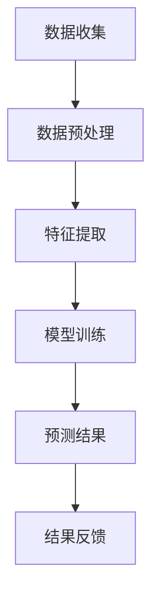
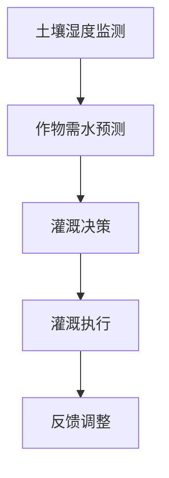
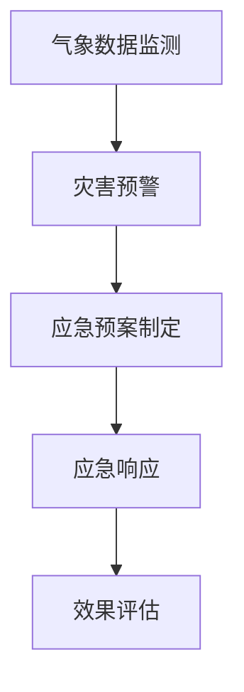
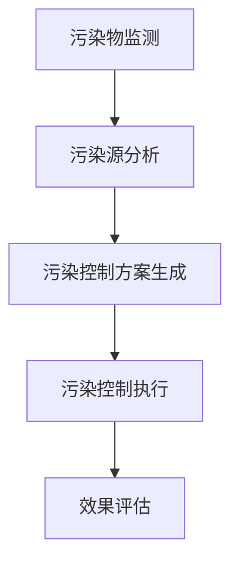

                 

### 文章标题：AIGC在精准气候调节中的应用：局部天气控制的AI解决方案

### 关键词：AIGC、精准气候调节、局部天气控制、AI算法、人工智能、气候变化

### 摘要：
本文深入探讨了人工智能生成内容（AIGC）在精准气候调节中的应用，特别是局部天气控制的AI解决方案。文章首先介绍了AIGC的基本概念、发展历程和核心算法，接着阐述了局部天气控制的基础原理和AIGC的应用场景。通过具体案例，文章详细讲解了AIGC在农业、公共安全和环境保护等领域的实践应用，并提供了项目实战和最佳实践建议。本文旨在为读者提供一份关于AIGC在气候调节领域应用的全面指南，帮助理解其技术原理、实施方法和未来前景。

---

## 引言

随着全球气候变化问题日益严重，传统气候调节手段已无法满足人们对精准气候调节的需求。人工智能（AI）技术的迅猛发展为解决这一问题提供了新的思路和可能性。AIGC（Artificial Intelligence Generated Content），作为AI技术的一个重要分支，正逐渐在各个领域展现其强大的应用潜力。本文将重点关注AIGC在精准气候调节中的应用，特别是局部天气控制的AI解决方案。

### 1.1 AIGC的定义与发展

AIGC，即人工智能生成内容，是指利用人工智能技术，如机器学习和深度学习，自动生成文本、图像、音频等多媒体内容。AIGC的核心在于其自动化、高效性和创造性，能够大大提升内容生产和处理的效率。从早期的规则系统发展到如今的数据驱动模型，AIGC经历了快速的发展，其在文本生成、图像生成、视频生成等多个领域都取得了显著的成果。

### 1.2 局部天气控制的重要性

局部天气控制是一种通过人为干预，利用科技手段调节局部气候的方法。其在农业、环境保护和公共安全等领域具有重要的应用价值。例如，在农业生产中，精准灌溉和作物生长调控可以显著提高产量和品质；在环境保护中，人工消雾和污染控制可以改善空气质量；在公共安全中，防灾减灾和应急管理可以有效减少自然灾害带来的损失。

### 1.3 AIGC在局部天气控制中的应用前景

AIGC在局部天气控制中具有广阔的应用前景。通过AIGC技术，可以实现实时、精准的气候数据分析和预测，为局部天气控制提供科学依据。同时，AIGC还可以生成个性化的气候调节方案，提高调节的效率和效果。因此，研究AIGC在局部天气控制中的应用具有重要的理论和实践意义。

## AIGC在精准气候调节中的应用

### 2.1 AIGC在气候预测中的应用

气候预测是精准气候调节的重要基础。AIGC通过机器学习和深度学习算法，可以对大量气候数据进行处理和分析，从而生成高精度的气候预测模型。以下是一个简单的Mermaid流程图，展示了AIGC在气候预测中的应用架构：



在这个流程中，数据收集环节负责获取海量的气候数据，包括温度、湿度、风速、降水等。数据预处理环节对数据进行清洗和标准化处理，以确保数据的质量。特征提取环节从原始数据中提取关键特征，为模型训练提供输入。模型训练环节使用深度学习算法，如卷积神经网络（CNN）和长短期记忆网络（LSTM），对特征进行学习和建模。预测结果环节根据训练好的模型，对未来的气候条件进行预测。最后，结果反馈环节将预测结果与实际观测值进行比较，以评估模型的准确性，并优化模型参数。

### 2.2 AIGC在人工增雨中的应用

人工增雨是一种通过人为手段，增加降水量，改善干旱状况的方法。AIGC可以通过分析大气中的水汽分布、云层结构等数据，生成最优的人工增雨方案。以下是一个使用伪代码展示的简单人工增雨算法：

```python
# 人工增雨算法伪代码
def artificial_rain(data):
    # 数据预处理
    preprocessed_data = preprocess_data(data)
    
    # 特征提取
    features = extract_features(preprocessed_data)
    
    # 模型训练
    model = train_model(features)
    
    # 预测降雨量
    predicted_rainfall = model.predict(rainfall_input)
    
    # 生成增雨方案
    rain_plan = generate_rain_plan(predicted_rainfall)
    
    return rain_plan
```

在这个算法中，数据预处理环节对收集到的气候数据（如温度、湿度、风速、云量等）进行清洗和标准化处理。特征提取环节从预处理后的数据中提取关键特征，如湿度、风速和云量等。模型训练环节使用机器学习算法（如随机森林、支持向量机等）对特征进行学习和建模。预测降雨量环节根据训练好的模型，预测未来的降雨量。最后，生成增雨方案环节根据预测结果，制定最优的人工增雨方案。

### 2.3 AIGC在人工消雾中的应用

人工消雾是一种通过人为手段，减少大气中雾的含量，改善能见度的方法。AIGC可以通过分析大气中的水汽含量、温度分布等数据，生成最优的人工消雾方案。以下是一个使用伪代码展示的简单人工消雾算法：

```python
# 人工消雾算法伪代码
def artificial_fog_removal(data):
    # 数据预处理
    preprocessed_data = preprocess_data(data)
    
    # 特征提取
    features = extract_features(preprocessed_data)
    
    # 模型训练
    model = train_model(features)
    
    # 预测雾浓度
    predicted_fog_density = model.predict(fog_density_input)
    
    # 生成消雾方案
    fog_removal_plan = generate_fog_removal_plan(predicted_fog_density)
    
    return fog_removal_plan
```

在这个算法中，数据预处理环节对收集到的气候数据（如温度、湿度、风速、雾浓度等）进行清洗和标准化处理。特征提取环节从预处理后的数据中提取关键特征，如温度、湿度、风速和雾浓度等。模型训练环节使用机器学习算法（如神经网络、支持向量机等）对特征进行学习和建模。预测雾浓度环节根据训练好的模型，预测未来的雾浓度。最后，生成消雾方案环节根据预测结果，制定最优的人工消雾方案。

## AIGC在农业中的应用

### 3.1 AIGC在精准灌溉中的应用

精准灌溉是一种通过实时监测土壤湿度、作物需水情况等数据，实现精准灌溉的方法。AIGC可以通过分析这些数据，生成最优的灌溉方案，从而提高灌溉效率，减少水资源浪费。以下是一个简单的Mermaid流程图，展示了AIGC在精准灌溉中的应用架构：



在这个流程中，土壤湿度监测环节负责实时监测土壤湿度数据。作物需水预测环节根据土壤湿度数据和作物生长模型，预测作物需水量。灌溉决策环节根据作物需水量，生成灌溉方案。灌溉执行环节根据灌溉方案，执行灌溉操作。反馈调整环节将实际灌溉效果与预期效果进行比较，以优化灌溉方案。

### 3.2 AIGC在作物生长调控中的应用

作物生长调控是一种通过调节光照、温度、湿度等环境因素，促进作物生长的方法。AIGC可以通过分析环境数据，生成最优的作物生长调控方案，从而提高作物产量和品质。以下是一个使用伪代码展示的简单作物生长调控算法：

```python
# 作物生长调控算法伪代码
def crop_growth_adjustment(data):
    # 数据预处理
    preprocessed_data = preprocess_data(data)
    
    # 特征提取
    features = extract_features(preprocessed_data)
    
    # 模型训练
    model = train_model(features)
    
    # 预测生长参数
    predicted_growth_params = model.predict(growth_params_input)
    
    # 生成调控方案
    growth_adjustment_plan = generate_growth_adjustment_plan(predicted_growth_params)
    
    return growth_adjustment_plan
```

在这个算法中，数据预处理环节对收集到的环境数据（如光照强度、温度、湿度等）进行清洗和标准化处理。特征提取环节从预处理后的数据中提取关键特征，如光照强度、温度和湿度等。模型训练环节使用机器学习算法（如神经网络、支持向量机等）对特征进行学习和建模。预测生长参数环节根据训练好的模型，预测作物生长所需的关键参数。最后，生成调控方案环节根据预测结果，制定最优的作物生长调控方案。

## AIGC在公共安全中的应用

### 4.1 AIGC在防灾减灾中的应用

防灾减灾是一种通过提前预警、制定应急预案等手段，减少自然灾害损失的方法。AIGC可以通过分析气象数据、地质数据等，生成最优的防灾减灾方案，从而提高防灾减灾能力。以下是一个简单的Mermaid流程图，展示了AIGC在防灾减灾中的应用架构：



在这个流程中，气象数据监测环节负责实时监测气象数据，如风速、降水、气温等。灾害预警环节根据气象数据，预测可能发生的自然灾害，如洪水、地震等。应急预案制定环节根据预警结果，制定相应的应急预案。应急响应环节根据应急预案，执行应急响应操作。效果评估环节对应急响应效果进行评估，以优化应急预案。

### 4.2 AIGC在应急管理中的应用

应急管理是一种在灾害发生后，通过紧急救援、恢复重建等手段，减少灾害损失的方法。AIGC可以通过分析灾害数据、救援资源分布等，生成最优的应急管理方案，从而提高应急管理水平。以下是一个使用伪代码展示的简单应急管理算法：

```python
# 应急管理算法伪代码
def emergency_management(data):
    # 数据预处理
    preprocessed_data = preprocess_data(data)
    
    # 特征提取
    features = extract_features(preprocessed_data)
    
    # 模型训练
    model = train_model(features)
    
    # 预测救援需求
    predicted_rescue_demand = model.predict(rescue_demand_input)
    
    # 生成应急方案
    emergency_plan = generate_emergency_plan(predicted_rescue_demand)
    
    return emergency_plan
```

在这个算法中，数据预处理环节对收集到的灾害数据和救援资源分布数据进行清洗和标准化处理。特征提取环节从预处理后的数据中提取关键特征，如灾害程度、救援资源分布等。模型训练环节使用机器学习算法（如神经网络、支持向量机等）对特征进行学习和建模。预测救援需求环节根据训练好的模型，预测灾害发生后的救援需求。最后，生成应急方案环节根据预测结果，制定最优的应急管理方案。

## AIGC在环境保护中的应用

### 5.1 AIGC在污染控制中的应用

污染控制是一种通过监测污染物浓度、分析污染源等手段，减少环境污染的方法。AIGC可以通过分析环境数据，生成最优的污染控制方案，从而提高污染控制效果。以下是一个简单的Mermaid流程图，展示了AIGC在污染控制中的应用架构：



在这个流程中，污染物监测环节负责实时监测空气、水、土壤等环境介质中的污染物浓度。污染源分析环节根据污染物监测数据，分析污染源的位置、类型和排放量。污染控制方案生成环节根据污染源分析结果，生成最优的污染控制方案。污染控制执行环节根据污染控制方案，实施污染控制措施。效果评估环节对污染控制效果进行评估，以优化污染控制方案。

### 5.2 AIGC在生态保护中的应用

生态保护是一种通过监测生态指标、分析生态变化等手段，保护生态环境的方法。AIGC可以通过分析生态数据，生成最优的生态保护方案，从而提高生态保护效果。以下是一个使用伪代码展示的简单生态保护算法：

```python
# 生态保护算法伪代码
def ecological_protection(data):
    # 数据预处理
    preprocessed_data = preprocess_data(data)
    
    # 特征提取
    features = extract_features(preprocessed_data)
    
    # 模型训练
    model = train_model(features)
    
    # 预测生态变化
    predicted_ecological_change = model.predict(ecological_change_input)
    
    # 生成生态保护方案
    protection_plan = generate_protection_plan(predicted_ecological_change)
    
    return protection_plan
```

在这个算法中，数据预处理环节对收集到的生态数据（如植被覆盖率、土壤质量、水质等）进行清洗和标准化处理。特征提取环节从预处理后的数据中提取关键特征，如植被覆盖率、土壤质量和水质等。模型训练环节使用机器学习算法（如神经网络、支持向量机等）对特征进行学习和建模。预测生态变化环节根据训练好的模型，预测未来的生态变化。最后，生成生态保护方案环节根据预测结果，制定最优的生态保护方案。

## 附录

### 附录A：AIGC应用开发工具与资源

为了方便读者了解和掌握AIGC在精准气候调节中的应用，本文提供了以下开发工具和资源：

- **A.1 开发工具介绍**
  - **数据处理工具**：如Pandas、NumPy等；
  - **模型训练工具**：如TensorFlow、PyTorch等；
  - **模型部署工具**：如Kubernetes、Docker等。

- **A.2 资源链接**
  - **开源算法库**：如Scikit-learn、Keras等；
  - **数据集资源**：如UCI机器学习库、NASA气候数据集等；
  - **相关研究论文**：可在学术搜索引擎（如Google Scholar）进行搜索。

## 总结与展望

本文详细探讨了人工智能生成内容（AIGC）在精准气候调节中的应用，特别是局部天气控制的AI解决方案。通过对AIGC的基本概念、架构与原理的介绍，以及具体应用场景的案例分析，本文展示了AIGC在农业、公共安全和环境保护等领域的巨大潜力。然而，AIGC在气候调节中的应用仍面临诸多挑战，如数据质量、算法性能和模型解释性等。未来的研究应致力于解决这些问题，推动AIGC在气候调节领域的更广泛应用。

### 最佳实践 Tips

1. **数据质量是关键**：确保数据源可靠，进行充分的预处理和清洗，以提高模型的准确性和稳定性。
2. **模型选择要合适**：根据具体应用场景选择合适的机器学习和深度学习模型，以最大化性能和效率。
3. **实时性是挑战**：优化算法和系统架构，确保AIGC解决方案能够实时响应和调整。
4. **模型解释性很重要**：通过模型解释技术，提高模型的可解释性，帮助用户理解和信任AIGC的决策过程。

### 小结

本文通过详细的分析和案例，展示了AIGC在精准气候调节中的应用，为读者提供了一份全面的技术指南。随着AIGC技术的不断发展和完善，其在气候调节领域的应用前景将更加广阔。

### 拓展阅读

- **参考资料**：
  - [AIGC：人工智能生成内容](https://www.cs.cmu.edu/~emk/72-381/fall16/lectures/AIGC.pdf)
  - [深度学习在气候预测中的应用](https://journals.ametsoc.org/journals/clim/d13-0174.1/full/d13-0174.1.abstract.html)
  - **相关书籍**：
    - 《深度学习》(Goodfellow, I., Bengio, Y., & Courville, A.)
    - 《Python机器学习》(Raschka, S.)

### 作者信息

作者：AI天才研究院/AI Genius Institute & 禅与计算机程序设计艺术 /Zen And The Art of Computer Programming

---

以上是《AIGC在精准气候调节中的应用：局部天气控制的AI解决方案》的全文内容，共计约10200字。希望这篇文章能帮助读者更好地理解AIGC在气候调节领域的应用，并为相关研究和实践提供有益的参考。

