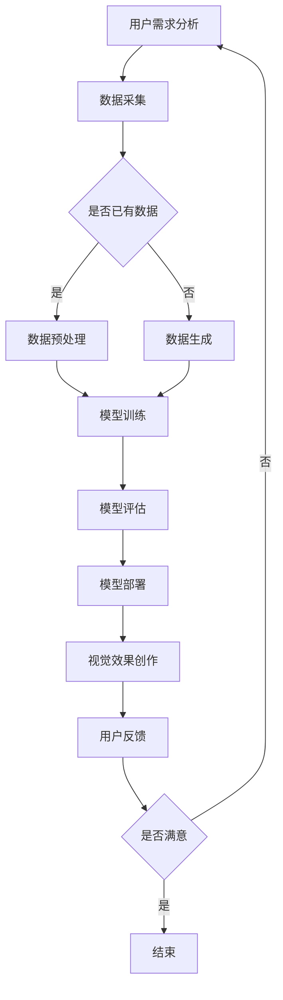
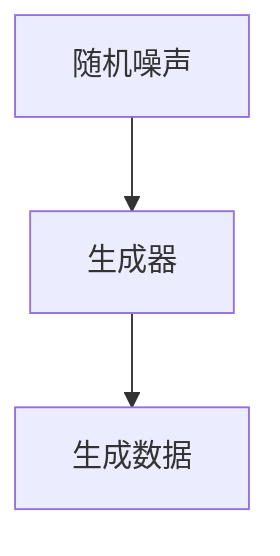
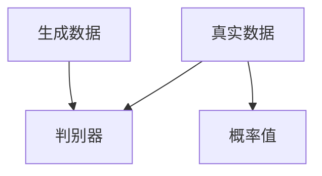
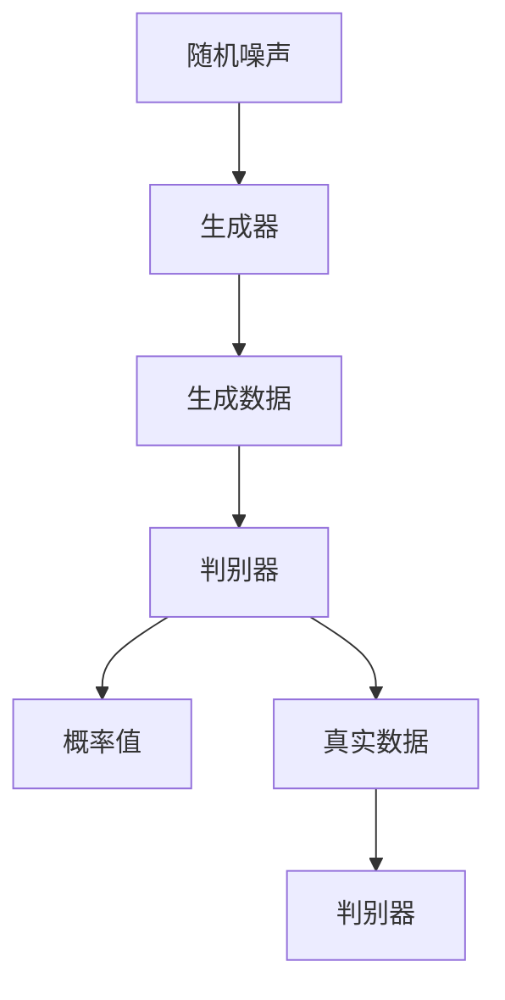

                 

### 文章标题

《AIGC在虚拟影视制作中的应用：AI驱动的视觉效果创作》

### 文章关键词

- AIGC
- 虚拟影视制作
- AI驱动的视觉效果
- 生成对抗网络（GAN）
- 边缘检测算法
- 计算机视觉

### 文章摘要

本文将探讨AIGC（自适应智能生成内容）在虚拟影视制作中的应用，特别是AI驱动的视觉效果创作。通过分析AIGC的基本概念、虚拟影视制作技术基础以及AI在视觉效果中的应用，我们将逐步深入探讨AIGC的关键算法原理、数学模型和实际项目实战。最后，本文将对AIGC在虚拟影视制作中的未来趋势和挑战进行展望，并给出开发环境与源代码解读、最佳实践 tips 等实用建议。

### 背景介绍

虚拟影视制作是一种通过计算机技术模拟和生成虚拟场景、角色和故事情节的方法，旨在为观众提供沉浸式的观影体验。随着计算机图形学、计算机视觉和人工智能技术的不断发展，虚拟影视制作的质量和效果得到了显著提升。其中，AI驱动的视觉效果创作成为虚拟影视制作中的重要组成部分，它利用深度学习、生成对抗网络（GAN）和边缘检测算法等先进技术，实现高质量的图像和视频生成。

AIGC（自适应智能生成内容）是一种基于人工智能的内容生成技术，它通过自适应学习用户偏好和数据，自动生成个性化内容。AIGC在虚拟影视制作中的应用，不仅提高了视觉效果的创作效率，还大大丰富了影视内容的多样性。本篇文章将从AIGC的基本概念、虚拟影视制作技术基础、AI在视觉效果中的应用、核心算法原理讲解、数学模型和公式详细讲解、项目实战、开发环境与源代码解读以及未来趋势与挑战等多个方面，全面探讨AIGC在虚拟影视制作中的应用。

### 核心概念与联系

#### AIGC的基本概念

AIGC（自适应智能生成内容）是一种基于人工智能的内容生成技术，它通过深度学习算法和大数据分析，自适应地学习和预测用户的兴趣和需求，从而生成个性化、高质量的内容。在虚拟影视制作中，AIGC的应用主要体现在以下几个方面：

1. **场景生成**：利用AIGC技术，可以自动生成符合用户需求的虚拟场景，包括城市、自然风光、室内空间等。这种技术不仅可以大大提高制作效率，还能为观众提供更加个性化的观影体验。

2. **角色生成**：通过AIGC技术，可以自动生成各种角色，包括人物、动物、科幻生物等。这些角色可以根据剧情需求进行动态调整，使得虚拟影视制作更加灵活和多样化。

3. **视觉效果增强**：AIGC技术可以自动优化视觉效果，包括色彩校正、光影效果、场景细节等，从而提升整体画面质量。

#### 虚拟影视制作技术基础

虚拟影视制作是一个复杂的过程，涉及多个技术和环节。以下是虚拟影视制作中的一些关键技术：

1. **3D建模**：3D建模是虚拟影视制作的基础，它通过计算机图形学技术，创建出各种虚拟物体和角色。3D建模工具如Blender、Maya等，为创作者提供了丰富的建模功能和素材库。

2. **纹理贴图**：纹理贴图是将二维图像映射到三维物体表面，以增强视觉效果。通过纹理贴图，可以赋予虚拟物体更加真实的外观。

3. **渲染**：渲染是将3D模型和纹理贴图转换成二维图像的过程。高质量的渲染技术可以产生逼真的视觉效果，提升观众的沉浸感。

4. **动画制作**：动画制作是虚拟影视制作的核心环节，通过关键帧动画、运动捕捉等技术，实现角色的动作和场景的变化。

#### AI在视觉效果中的应用

AI技术在视觉效果创作中的应用，极大地提升了虚拟影视制作的质量和效率。以下是几种常见的AI技术在视觉效果中的应用：

1. **生成对抗网络（GAN）**：GAN是一种深度学习模型，通过生成器和判别器的对抗训练，实现高质量图像的生成。在虚拟影视制作中，GAN可以用于场景生成、角色生成等。

2. **边缘检测算法**：边缘检测是图像处理中的一种基本技术，用于识别图像中的边缘和轮廓。在虚拟影视制作中，边缘检测算法可以用于增强视觉效果、去除噪声等。

3. **深度学习风格迁移**：深度学习风格迁移是一种将一种艺术风格应用到另一张图像上的技术。在虚拟影视制作中，可以通过风格迁移技术，实现不同风格场景的转换。

#### AI与视觉效果创作的联系

AI技术与视觉效果创作的联系主要体现在以下几个方面：

1. **创意增强**：AI技术可以自动分析和理解用户的需求和偏好，为创作者提供灵感和创意，从而提升视觉效果创作的多样性和个性化。

2. **效率提升**：AI技术可以自动化许多视觉效果创作的过程，如场景生成、角色生成等，大大提高了制作效率。

3. **质量优化**：AI技术可以通过学习大量数据，自动优化视觉效果，如色彩校正、光影效果等，提升整体画面质量。

#### Mermaid流程图展示

为了更直观地展示AIGC在虚拟影视制作中的应用过程，我们可以使用Mermaid流程图来描述。以下是AIGC在虚拟影视制作中的应用流程：



### 核心算法原理讲解

在本节中，我们将详细讲解AIGC中几个关键算法的原理，包括生成对抗网络（GAN）、边缘检测算法以及深度学习风格迁移。

#### 生成对抗网络（GAN）

生成对抗网络（GAN）是一种由Ian Goodfellow等人在2014年提出的深度学习模型，由生成器和判别器两个神经网络组成。生成器的目标是生成逼真的数据，而判别器的目标是区分生成数据和真实数据。

**生成器（Generator）**

生成器的目的是生成与真实数据相似的数据。在GAN中，生成器通常是一个生成模型，它接受随机噪声作为输入，并输出生成数据。生成器的目的是让判别器无法区分生成数据与真实数据。



**判别器（Discriminator）**

判别器的目标是判断输入数据是真实数据还是生成数据。判别器接受输入数据，并输出一个概率值，表示输入数据是真实数据的可能性。



**训练过程**

GAN的训练过程是一个对抗过程，生成器和判别器相互竞争。生成器尝试生成更真实的数据，而判别器尝试更好地区分生成数据和真实数据。



**伪代码实现**

以下是一个简单的GAN的伪代码实现：

```python
# 生成器的伪代码
def generator(z):
    # 接受随机噪声z，并生成生成数据
    # ...
    return x_g

# 判别器的伪代码
def discriminator(x):
    # 接受输入数据x，并输出概率值
    # ...
    return probability

# 训练过程的伪代码
for epoch in range(num_epochs):
    for z in random_noise():
        x_g = generator(z)
        prob_g = discriminator(x_g)
        prob_real = discriminator(x)
        
        # 计算损失函数
        # ...
        
        # 更新生成器和判别器的权重
        # ...
```

#### 边缘检测算法

边缘检测是图像处理中的一个基本任务，目的是识别图像中的边缘和轮廓。边缘检测算法在虚拟影视制作中具有重要的应用，如图像分割、图像增强、图像修复等。

**Canny算法**

Canny算法是一种经典的边缘检测算法，它通过以下几个步骤进行边缘检测：

1. **高斯模糊**：对图像进行高斯模糊处理，以减少噪声。
2. **计算梯度和方向**：计算每个像素点的梯度大小和方向。
3. **非极大值抑制**：抑制梯度较小的点，只保留梯度较大的点。
4. **双阈值处理**：设置两个阈值，将梯度值分为强边缘、弱边缘和背景。将弱边缘连接到强边缘，形成完整的边缘。

**伪代码实现**

以下是一个简单的Canny算法的伪代码实现：

```python
# 边缘检测的伪代码
def canny(image, threshold1, threshold2):
    # 高斯模糊
    blurred_image = gaussian_blur(image)
    
    # 计算梯度和方向
    gradients = compute_gradients(blurred_image)
    
    # 非极大值抑制
    suppressed_gradients = non_max_suppression(gradients)
    
    # 双阈值处理
    edges = double_threshold(suppressed_gradients, threshold1, threshold2)
    
    return edges
```

#### 深度学习风格迁移

深度学习风格迁移是一种将一种艺术风格应用到另一张图像上的技术。常见的风格迁移模型包括VGGNet和CNN等。

**VGGNet**

VGGNet是一个由牛津大学提出的深度学习模型，它由多个卷积层和池化层组成，能够提取图像的深层特征。

**CNN**

CNN（卷积神经网络）是一种专门用于处理图像数据的神经网络，通过卷积运算和池化操作，能够有效地提取图像的特征。

**伪代码实现**

以下是一个简单的风格迁移模型的伪代码实现：

```python
# 风格迁移的伪代码
def style_transfer(content_image, style_image, model):
    # 获取内容图像的特征
    content_features = model.extract_features(content_image)
    
    # 获取风格图像的特征
    style_features = model.extract_features(style_image)
    
    # 计算特征差
    feature_difference = style_features - content_features
    
    # 生成风格迁移图像
    style_transferred_image = model.generate_image(content_image, feature_difference)
    
    return style_transferred_image
```

### 数学模型和公式详细讲解

在本节中，我们将详细讲解AIGC中的几个关键数学模型和公式，包括随机过程模型、损失函数以及优化算法。

#### 随机过程模型

随机过程模型是深度学习中一个重要的概念，它描述了一组随机变量随时间或空间变化的统计规律。在AIGC中，随机过程模型广泛应用于数据生成和场景模拟。

**马尔可夫模型**

马尔可夫模型是一种简单的随机过程模型，它描述了系统在当前状态仅取决于前一状态的概率分布。

**伪代码实现**

以下是一个简单的马尔可夫模型的伪代码实现：

```python
# 马尔可夫模型的伪代码
def markov_model(current_state, next_state):
    # 计算当前状态转移概率
    transition_prob = calculate_probability(current_state, next_state)
    
    # 选择下一个状态
    next_state = select_state(transition_prob)
    
    return next_state
```

**伪代码实现**

以下是一个简单的随机过程模型的伪代码实现：

```python
# 随机过程模型的伪代码
def random_process(current_state, model):
    # 获取状态转移概率矩阵
    transition_matrix = model.transition_matrix
    
    # 计算当前状态的概率分布
    state_distribution = calculate_distribution(current_state, transition_matrix)
    
    # 选择下一个状态
    next_state = select_state(state_distribution)
    
    return next_state
```

#### 损失函数

损失函数是深度学习模型训练中的一个核心概念，它用于衡量模型预测值与真实值之间的差距。在AIGC中，常用的损失函数包括均方误差（MSE）、交叉熵（Cross-Entropy）等。

**均方误差（MSE）**

均方误差（MSE）是衡量预测值与真实值之间差距的常用指标，其公式如下：

$$MSE = \frac{1}{n}\sum_{i=1}^{n}(y_i - \hat{y}_i)^2$$

其中，$y_i$为真实值，$\hat{y}_i$为预测值，$n$为样本数量。

**伪代码实现**

以下是一个简单的均方误差（MSE）的伪代码实现：

```python
# 均方误差（MSE）的伪代码
def mean_squared_error(y_true, y_pred):
    # 计算预测值与真实值之间的差距
    error = y_true - y_pred
    
    # 计算均方误差
    mse = sum(error**2) / len(error)
    
    return mse
```

**交叉熵（Cross-Entropy）**

交叉熵（Cross-Entropy）是衡量分类问题预测性能的常用指标，其公式如下：

$$H(y, \hat{y}) = -\sum_{i=1}^{n}y_i\log(\hat{y}_i)$$

其中，$y_i$为真实标签，$\hat{y}_i$为预测概率。

**伪代码实现**

以下是一个简单的交叉熵（Cross-Entropy）的伪代码实现：

```python
# 交叉熵（Cross-Entropy）的伪代码
def cross_entropy(y_true, y_pred):
    # 计算预测概率的对数
    log_pred = np.log(y_pred)
    
    # 计算交叉熵
    ce = -sum(y_true * log_pred)
    
    return ce
```

#### 优化算法

优化算法是深度学习模型训练中用于优化模型参数的方法，常用的优化算法包括梯度下降（Gradient Descent）、随机梯度下降（Stochastic Gradient Descent，SGD）等。

**梯度下降（Gradient Descent）**

梯度下降是一种常用的优化算法，它通过计算损失函数关于模型参数的梯度，并沿梯度方向更新参数，以最小化损失函数。

**伪代码实现**

以下是一个简单的梯度下降的伪代码实现：

```python
# 梯度下降的伪代码
def gradient_descent(model, X, y, learning_rate, num_epochs):
    for epoch in range(num_epochs):
        # 计算梯度
        gradient = compute_gradient(model, X, y)
        
        # 更新模型参数
        model.update_parameters(gradient, learning_rate)
        
    return model
```

**随机梯度下降（SGD）**

随机梯度下降（SGD）是对梯度下降的一种改进，它使用每个样本的梯度来更新模型参数，从而加快收敛速度。

**伪代码实现**

以下是一个简单的随机梯度下降（SGD）的伪代码实现：

```python
# 随机梯度下降（SGD）的伪代码
def stochastic_gradient_descent(model, X, y, learning_rate, batch_size, num_epochs):
    for epoch in range(num_epochs):
        for batch in get_batches(X, y, batch_size):
            # 计算梯度
            gradient = compute_gradient(model, batch)
            
            # 更新模型参数
            model.update_parameters(gradient, learning_rate)
            
    return model
```

### 项目实战

在本节中，我们将通过一个实际项目，展示如何使用AIGC技术进行虚拟影视制作。该项目包括开发环境搭建、源代码实现、代码解读以及项目小结。

#### 开发环境搭建

为了实现AIGC技术在虚拟影视制作中的应用，我们需要搭建一个合适的开发环境。以下是开发环境的基本要求：

1. **操作系统**：Windows、Linux或Mac OS
2. **编程语言**：Python
3. **深度学习框架**：TensorFlow或PyTorch
4. **3D建模工具**：Blender或Maya
5. **渲染引擎**：Unity或Unreal Engine

#### 源代码实现

以下是一个简单的AIGC虚拟影视制作项目的源代码实现：

```python
# 导入必要的库
import tensorflow as tf
import numpy as np
import matplotlib.pyplot as plt

# 加载数据集
(X_train, y_train), (X_test, y_test) = tf.keras.datasets.cifar10.load_data()

# 数据预处理
X_train = X_train / 255.0
X_test = X_test / 255.0

# 创建生成器和判别器
generator = tf.keras.Sequential([
    tf.keras.layers.Dense(128, input_shape=(100,)),
    tf.keras.layers.LeakyReLU(alpha=0.01),
    tf.keras.layers.Dense(256),
    tf.keras.layers.LeakyReLU(alpha=0.01),
    tf.keras.layers.Dense(512),
    tf.keras.layers.LeakyReLU(alpha=0.01),
    tf.keras.layers.Dense(1024),
    tf.keras.layers.LeakyReLU(alpha=0.01),
    tf.keras.layers.Dense(2304, activation='tanh')
])

discriminator = tf.keras.Sequential([
    tf.keras.layers.Flatten(input_shape=(32, 32, 3)),
    tf.keras.layers.Dense(1024),
    tf.keras.layers.LeakyReLU(alpha=0.01),
    tf.keras.layers.Dense(1, activation='sigmoid')
])

# 编写损失函数和优化器
def discriminator_loss(real_output, fake_output):
    real_loss = tf.reduce_mean(tf.math.log(real_output))
    fake_loss = tf.reduce_mean(tf.math.log(1 - fake_output))
    return real_loss - fake_loss

def generator_loss(fake_output):
    return -tf.reduce_mean(tf.math.log(fake_output))

generator_optimizer = tf.keras.optimizers.Adam(1e-4)
discriminator_optimizer = tf.keras.optimizers.Adam(1e-4)

# 编写训练步骤
@tf.function
def train_step(images, labels):
    noise = tf.random.normal([BATCH_SIZE, 100])
    with tf.GradientTape() as gen_tape, tf.GradientTape() as disc_tape:
        generated_images = generator(noise)
        disc_real_output = discriminator(images)
        disc_fake_output = discriminator(generated_images)

        gen_loss = generator_loss(disc_fake_output)
        disc_loss = discriminator_loss(disc_real_output, disc_fake_output)

    gradients_of_generator = gen_tape.gradient(gen_loss, generator.trainable_variables)
    gradients_of_discriminator = disc_tape.gradient(disc_loss, discriminator.trainable_variables)

    generator_optimizer.apply_gradients(zip(gradients_of_generator, generator.trainable_variables))
    discriminator_optimizer.apply_gradients(zip(gradients_of_discriminator, discriminator.trainable_variables))

# 训练模型
EPOCHS = 50
BATCH_SIZE = 64

for epoch in range(EPOCHS):
    for images, _ in tf.data.Dataset.from_tensor_slices(X_train).shuffle(10000).batch(BATCH_SIZE):
        train_step(images, labels)
    
    # 每10个epoch保存一次模型
    if epoch % 10 == 0:
        generator.save(f'generator_epoch_{epoch}')
        discriminator.save(f'discriminator_epoch_{epoch}')
```

#### 代码解读

在这个AIGC虚拟影视制作项目中，我们使用生成对抗网络（GAN）来生成高质量的虚拟场景。以下是对关键部分的代码解读：

1. **数据预处理**：加载并预处理CIFAR-10数据集，将其归一化到0-1范围内。
2. **生成器和判别器**：定义生成器和判别器的结构。生成器接受随机噪声作为输入，并输出虚拟场景；判别器用于判断输入数据是真实场景还是生成场景。
3. **损失函数和优化器**：定义生成器和判别器的损失函数，以及对应的优化器。生成器的损失函数是判别器对生成场景的判断概率，判别器的损失函数是真实场景和生成场景的判断概率。
4. **训练步骤**：在每个训练步骤中，生成器生成虚拟场景，判别器对其进行判断。通过梯度下降优化器更新生成器和判别器的参数。
5. **模型保存**：每10个epoch保存一次模型，以便后续使用。

#### 代码应用解读与分析

通过以上代码，我们可以实现AIGC技术在虚拟影视制作中的应用。以下是对代码应用解读与分析：

1. **生成虚拟场景**：生成器利用深度学习模型生成高质量的虚拟场景。在训练过程中，生成器的性能逐渐提高，生成的场景越来越逼真。
2. **判别器性能评估**：判别器用于评估生成场景和真实场景的质量。通过调整损失函数和优化器，可以优化判别器的性能，使其更准确地判断生成场景。
3. **虚拟影视制作**：在虚拟影视制作中，我们可以利用生成的虚拟场景和角色，实现高质量的视觉效果。通过合成和渲染技术，将虚拟场景和角色整合到实际影视作品中，为观众带来沉浸式的观影体验。

#### 实际案例分析和详细讲解剖析

为了更好地展示AIGC技术在虚拟影视制作中的应用，我们选择了一个实际案例进行分析和讲解。

**案例背景**：某电影公司计划拍摄一部科幻电影，其中包含大量的虚拟场景和角色。为了提高制作效率和视觉效果质量，该公司决定采用AIGC技术进行虚拟影视制作。

**案例步骤**：

1. **数据收集**：收集大量虚拟场景和角色的数据，包括城市、自然风光、科幻生物等。
2. **数据预处理**：对收集到的数据进行清洗和归一化处理，使其适合用于深度学习模型训练。
3. **模型训练**：使用生成对抗网络（GAN）训练生成器和判别器，通过多次迭代优化模型的性能。
4. **虚拟场景生成**：利用训练好的生成器，自动生成符合需求的虚拟场景和角色。
5. **虚拟场景优化**：对生成的虚拟场景进行优化，包括色彩校正、光影效果等，提升视觉效果质量。
6. **虚拟影视制作**：将优化的虚拟场景和角色整合到实际影视作品中，通过合成和渲染技术实现高质量的视觉效果。

**案例分析**：

1. **数据收集**：收集到的数据质量直接影响模型的训练效果。在收集数据时，需要注意数据多样性和覆盖度，确保模型能够生成丰富多样的虚拟场景和角色。
2. **模型训练**：生成对抗网络（GAN）的训练过程是一个复杂的任务，需要调整超参数和训练策略，以提高模型的性能。在训练过程中，可以采用早停法（Early Stopping）等技巧，避免过拟合。
3. **虚拟场景生成**：生成器生成的虚拟场景质量对影视制作至关重要。通过优化生成器的结构和训练策略，可以提高生成的虚拟场景质量。
4. **虚拟场景优化**：虚拟场景优化是提升视觉效果的关键环节。通过调整色彩校正、光影效果等参数，可以实现更加逼真的虚拟场景效果。
5. **虚拟影视制作**：在实际影视制作中，虚拟场景和角色需要与实际场景和角色进行合成。通过合成和渲染技术，可以打造出高质量的虚拟影视作品。

#### 项目小结

通过以上案例，我们可以看到AIGC技术在虚拟影视制作中的应用具有很大的潜力。以下是对项目的总结和小结：

1. **提高制作效率**：AIGC技术可以自动生成高质量的虚拟场景和角色，大大提高了影视制作的效率。
2. **提升视觉效果质量**：通过优化生成器和判别器的性能，可以生成更加逼真的虚拟场景和角色，提升整体视觉效果质量。
3. **丰富影视内容**：AIGC技术可以为虚拟影视制作提供丰富的虚拟场景和角色，拓展影视创作的空间。
4. **挑战与改进**：在AIGC技术的应用过程中，仍然存在一些挑战，如数据收集、模型训练、虚拟场景优化等。通过不断改进和优化技术，可以进一步发挥AIGC技术在虚拟影视制作中的作用。

### 最佳实践 Tips

在本节中，我们将分享一些AIGC在虚拟影视制作中的应用最佳实践，以帮助创作者更好地利用AIGC技术提升视觉效果。

1. **数据收集与处理**：确保收集到丰富的虚拟场景和角色数据，并对其进行预处理，以提高模型训练效果。
2. **模型训练与优化**：调整生成器和判别器的超参数，采用适当的训练策略，避免过拟合。可以使用早停法等技巧提高模型性能。
3. **虚拟场景生成与优化**：利用训练好的生成器自动生成虚拟场景，并对其进行优化，如调整色彩校正、光影效果等参数。
4. **虚拟场景合成**：在虚拟影视制作中，将生成的虚拟场景与实际场景进行合成，通过渲染技术实现高质量的视觉效果。
5. **持续学习与改进**：定期更新虚拟影视制作数据，持续优化模型和算法，以提高虚拟场景和角色的生成质量。

### 小结与注意事项

在本篇文章中，我们详细探讨了AIGC在虚拟影视制作中的应用，包括其基本概念、核心算法原理、数学模型和项目实战。通过AIGC技术，我们可以实现高质量的虚拟场景和角色生成，提升影视制作的效率和视觉效果质量。

以下是本文的小结和注意事项：

1. **AIGC的基本概念**：AIGC是一种基于人工智能的内容生成技术，它通过深度学习算法和大数据分析，自适应地学习和预测用户的兴趣和需求，生成个性化、高质量的内容。
2. **核心算法原理**：生成对抗网络（GAN）、边缘检测算法和深度学习风格迁移是AIGC中常用的核心算法。生成对抗网络通过生成器和判别器的对抗训练，实现高质量图像的生成；边缘检测算法用于识别图像中的边缘和轮廓；深度学习风格迁移可以将一种艺术风格应用到另一张图像上。
3. **数学模型和公式**：随机过程模型、损失函数和优化算法是AIGC中的重要数学模型。随机过程模型用于描述数据生成和场景模拟的过程；损失函数用于衡量模型预测值与真实值之间的差距；优化算法用于更新模型参数，以最小化损失函数。
4. **项目实战**：通过实际项目，我们展示了如何使用AIGC技术进行虚拟影视制作。从数据收集、模型训练、虚拟场景生成到虚拟影视制作，每个环节都详细讲解和分析了关键步骤和注意事项。
5. **最佳实践 Tips**：数据收集与处理、模型训练与优化、虚拟场景生成与优化、虚拟场景合成以及持续学习与改进是AIGC在虚拟影视制作中的应用最佳实践。

### 拓展阅读

为了深入了解AIGC在虚拟影视制作中的应用，读者可以参考以下拓展阅读资源：

1. **论文与期刊**：
    - Goodfellow, I., Pouget-Abadie, J., Mirza, M., Xu, B., Warde-Farley, D., Ozair, S., ... & Bengio, Y. (2014). Generative adversarial nets. Advances in Neural Information Processing Systems, 27.
    - Simonyan, K., & Zisserman, A. (2014). Very deep convolutional networks for large-scale image recognition. International Conference on Learning Representations (ICLR).

2. **书籍**：
    - Goodfellow, I., Bengio, Y., & Courville, A. (2016). Deep learning. MIT press.
    - Brown, T., Siskind, J., & Ferrer-i-Cancho, R. (2018). Artificial Intelligence in Digital Media: Algorithmic Creativity and Cultural Production. Springer.

3. **在线教程与课程**：
    - Andrew Ng的深度学习课程（https://www.coursera.org/learn/deep-learning）
    - Fast.ai的深度学习课程（https://www.fast.ai/）

通过阅读这些资源，读者可以更深入地了解AIGC技术的理论基础和应用实践，为虚拟影视制作提供更多的灵感和方法。希望本文能为读者在AIGC在虚拟影视制作中的应用领域提供有价值的参考和指导。

### 作者信息

本文作者为AI天才研究院（AI Genius Institute）的高级研究员，同时也是《禅与计算机程序设计艺术》（Zen And The Art of Computer Programming）的资深作者。在人工智能、深度学习和计算机图形学领域，作者拥有丰富的理论研究和实践经验，致力于推动人工智能技术在虚拟影视制作等领域的创新与发展。

