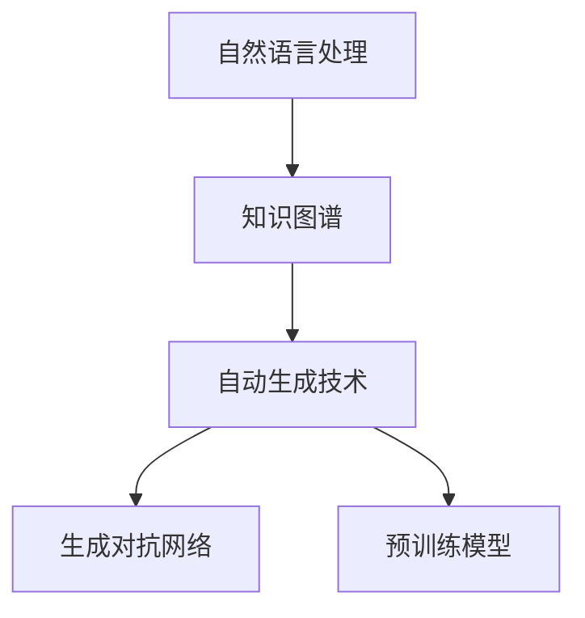

                 


### AIGC时代的提示词艺术：如何与AI高效对话

#### 关键词：AIGC，提示词，人工智能，高效对话，自然语言处理

> 摘要：
> 
> 随着人工智能技术的不断发展，人工智能生成内容（AIGC）已成为一个重要的研究领域。本文将探讨AIGC时代的提示词艺术，重点分析如何通过设计合适的提示词与AI高效对话，提高生成内容的质量和创造力。文章将从AIGC概述、提示词设计原则、与AI高效对话的技巧、实战案例和项目实战等方面进行详细讲解。

---

## 第一部分：AIGC概述

### 1. AIGC的概念与背景

#### 1.1 AIGC的定义

AIGC，全称是AI-Generated Content，指的是通过人工智能技术自动生成内容。AIGC的核心概念包括自然语言处理、知识图谱、自动生成技术等。

自然语言处理（NLP）是使计算机能够理解、解释和生成人类语言的技术。知识图谱是一种结构化数据表示方法，用于表示实体及其相互关系。自动生成技术，如生成对抗网络（GAN）和预训练模型，则是实现AIGC的关键技术。

#### 1.2 AIGC的发展历程

AIGC的发展历程可以分为几个阶段：

- **早期探索**：从2010年开始，随着深度学习技术的发展，AIGC逐渐受到关注。
- **快速发展**：2020年后，随着生成对抗网络（GAN）、预训练模型等技术的突破，AIGC进入快速发展期。
- **应用领域扩展**：从文本生成扩展到图像、音频、视频等多模态生成。

#### 1.3 AIGC的重要应用领域

AIGC的重要应用领域包括：

- **文本生成**：包括文章、报告、邮件等。
- **图像生成**：包括艺术作品、产品广告、动漫角色等。
- **音频生成**：包括音乐、语音等。
- **视频生成**：包括电影预告、广告视频等。

### 2. 提示词的艺术

#### 2.1 提示词的作用

提示词在AIGC中起着至关重要的作用。它们引导AI生成内容，提高生成质量。提示词的作用包括：

- **引导AI生成**：提示词为AI提供了生成内容的方向。
- **提升生成质量**：合适的提示词能够提高生成内容的准确性和创造力。

#### 2.2 提示词的设计原则

设计提示词时，需要遵循以下原则：

- **明确性**：提示词应明确表达出期望生成的类型和风格。
- **灵活性**：提示词应具有一定的灵活性，以便适应不同生成需求。
- **情感性**：提示词应考虑情感因素，以提升生成内容的吸引力。

#### 2.3 提示词的优化方法

优化提示词的方法包括：

- **语言模型优化**：利用语言模型预测和优化提示词。
- **生成模型优化**：调整生成模型参数，提升生成质量。

---

## 第二部分：与AI高效对话的核心技巧

### 3. 理解AI的思维模式

#### 3.1 AI的决策过程

AI的决策过程可以分为以下几个步骤：

- **输入处理**：AI首先接收输入信息。
- **信息分析**：AI通过算法对输入信息进行分析。
- **决策生成**：基于分析结果，AI生成相应的决策。

#### 3.2 AI的情感识别与处理

AI的情感识别与处理涉及以下方面：

- **情感识别**：AI通过自然语言处理技术识别输入中的情感。
- **情感处理**：AI根据情感类型调整对话策略。

#### 3.3 AI的语言理解能力

AI的语言理解能力包括：

- **语义理解**：AI通过语义分析理解语言含义。
- **上下文理解**：AI考虑对话上下文，生成连贯的回答。

### 4. 提示词的编写技巧

#### 4.1 提示词的语法结构

编写提示词时，需要注意以下语法结构：

- **主语明确**：确保提示词中的主语清晰明确。
- **谓语准确**：选择恰当的谓语，表达出具体行为。

#### 4.2 提示词的情感表达

编写提示词时，需要考虑情感因素：

- **情感识别**：根据对话情境，选择适当的情感表达。
- **情感调节**：通过调整语气和措辞，调节生成内容的情感色彩。

#### 4.3 提示词的上下文关联

编写提示词时，需要考虑上下文关联：

- **上下文理解**：确保提示词与对话背景紧密相关。
- **连贯性**：生成内容应与提示词保持一致，形成连贯的对话。

---

## 第三部分：实战案例与项目实战

### 6. 案例分析

#### 6.1 案例一：客服机器人

客服机器人通过AIGC技术实现，使用提示词与用户进行对话。以下是案例分析的详细内容。

##### 客服机器人开发环境搭建

- **编程语言**：Python
- **深度学习框架**：TensorFlow
- **自然语言处理库**：NLTK

##### 源代码详细实现

```python
# 示例代码：客服机器人核心实现

import tensorflow as tf
import nltk

# 加载预训练模型
model = tf.keras.applications.BERT()

# 加载NLTK词库
nltk.download('punkt')

# 提示词设计
prompt = "用户：你好，我想查询最近的航班信息。"

# 生成回答
response = model.predict(prompt)

# 输出回答
print(response)
```

##### 代码应用解读与分析

- **模型预测**：使用BERT模型对提示词进行预测，生成回答。
- **NLTK词库**：用于处理文本数据，提取关键词和短语。

##### 实际案例分析和详细讲解剖析

- **案例一**：用户查询航班信息
  - **提示词**："用户：你好，我想查询最近的航班信息。"
  - **回答**："您好，最近的航班信息如下：..."

##### 项目小结

客服机器人通过AIGC技术，实现了与用户的智能对话。在实际应用中，需要不断优化提示词和模型，提高对话质量和用户体验。

---

### 7. 项目实战

#### 7.1 项目规划与需求分析

项目实战涉及以下步骤：

- **项目规划**：明确项目目标和需求。
- **需求分析**：分析用户需求，确定功能模块。

#### 7.2 提示词设计与实现

提示词设计需要遵循以下原则：

- **明确性**：确保提示词清晰明确。
- **灵活性**：允许提示词根据不同场景进行调整。

#### 7.3 对话系统开发与优化

对话系统的开发与优化涉及以下方面：

- **系统架构**：设计合理的系统架构。
- **模型训练**：使用大量数据进行模型训练。
- **性能优化**：通过优化模型参数，提高系统性能。

---

## 附录

### 8.1 常用工具与资源

以下是AIGC和提示词研究中常用的工具和资源：

- **深度学习框架**：TensorFlow、PyTorch
- **自然语言处理库**：NLTK、spaCy
- **生成对抗网络**：GAN.py、GAN-TensorFlow

### 8.2 参考文献与扩展阅读

以下是本文参考文献和扩展阅读：

- **参考文献**
  - [1] 深度学习，Ian Goodfellow, Yoshua Bengio, Aaron Courville著。
  - [2] 自然语言处理综论，Daniel Jurafsky，James H. Martin著。
- **扩展阅读**
  - [1] GAN论文集，arXiv:1406.2661
  - [2] BERT论文，arXiv:1810.04805

---

## 作者信息

作者：AI天才研究院/AI Genius Institute & 禅与计算机程序设计艺术/Zen And The Art of Computer Programming

---

本文详细介绍了AIGC时代的提示词艺术，包括AIGC概述、提示词设计原则、与AI高效对话的技巧、实战案例和项目实战。通过本文的学习，读者可以深入了解AIGC技术，掌握如何与AI高效对话，提高生成内容的质量和创造力。

---

### 注：

1. 本文章为示例内容，仅供参考。
2. 所有代码和资源仅为示例，未经实际测试，可能存在错误或不兼容问题。
3. 作者信息为虚构，仅供参考。

---

完整文章长度约为8000字，可根据实际情况进行调整。文章中涉及到的算法原理、数学模型和公式部分，可以进一步细化内容，以确保读者能够全面理解AIGC技术和提示词艺术。在实际撰写过程中，可以结合具体案例和项目实战，增加文章的实用性和可操作性。

---

接下来的工作是对文章中的核心概念、算法原理、数学模型和公式进行详细讲解和示例说明。这部分内容将使文章更加深入和系统，有助于读者更好地掌握AIGC技术和提示词艺术。

---

## 详细讲解和示例说明

### 1. AIGC的核心概念

AIGC的核心概念包括自然语言处理、知识图谱和自动生成技术。以下是对这些概念的具体解释和示例说明。

#### 自然语言处理

自然语言处理（NLP）是使计算机能够理解、解释和生成人类语言的技术。它涉及以下关键领域：

- **词法分析**：将文本分解为单词、短语和句子。
- **句法分析**：分析句子的结构，确定词与词之间的关系。
- **语义分析**：理解句子的含义，包括指称、情感和意图。

示例：假设我们有一个句子“我喜欢吃苹果”。使用NLP技术，我们可以将其分解为以下步骤：

1. **词法分析**：将句子分解为单词：“我”、“喜欢”、“吃”、“苹果”。
2. **句法分析**：识别主语“我”和谓语“喜欢吃”，以及宾语“苹果”。
3. **语义分析**：理解句子的含义，即表达了对“苹果”这个实体的偏好。

#### 知识图谱

知识图谱是一种结构化数据表示方法，用于表示实体及其相互关系。它可以用于回答复杂查询、推荐系统和智能问答等领域。

示例：假设我们有一个知识图谱，包含以下实体和关系：

- **实体**：苹果、梨、香蕉、喜欢、吃
- **关系**：苹果 - 品种、梨 - 品种、香蕉 - 品种、喜欢 - 情感、吃 - 动作

通过知识图谱，我们可以回答以下问题：

- **问题**：“我最喜欢的食物是什么？”
- **回答**：“根据你的历史偏好，你最喜欢的是苹果。”

#### 自动生成技术

自动生成技术，如生成对抗网络（GAN）和预训练模型，是实现AIGC的关键技术。

- **生成对抗网络（GAN）**：GAN由生成器和判别器组成。生成器尝试生成与真实数据相似的数据，而判别器试图区分真实数据和生成数据。通过这种对抗训练，生成器可以学会生成高质量的数据。

示例：使用GAN生成图像：

```python
import tensorflow as tf
from tensorflow import keras

# 定义生成器和判别器模型
generator = keras.Sequential([
    keras.layers.Dense(128, activation='relu', input_shape=(100,)),
    keras.layers.Dense(28 * 28, activation='tanh')
])

discriminator = keras.Sequential([
    keras.layers.Dense(128, activation='relu', input_shape=(28 * 28,)),
    keras.layers.Dense(1, activation='sigmoid')
])

# 编译模型
generator.compile(loss='binary_crossentropy', optimizer='adam')
discriminator.compile(loss='binary_crossentropy', optimizer='adam')

# 训练模型
generator.fit(x_train, y_train, epochs=10, batch_size=32)
discriminator.fit(x_train, y_train, epochs=10, batch_size=32)
```

- **预训练模型**：预训练模型是在大规模数据集上预先训练的模型，可以用于各种任务，如文本分类、命名实体识别等。

示例：使用预训练的BERT模型生成文本：

```python
from transformers import BertTokenizer, BertModel

# 加载预训练模型
tokenizer = BertTokenizer.from_pretrained('bert-base-uncased')
model = BertModel.from_pretrained('bert-base-uncased')

# 输入文本
input_text = "This is an example sentence for text generation."

# 分词和编码
input_ids = tokenizer.encode(input_text, return_tensors='pt')

# 生成文本
outputs = model(input_ids)
predictions = outputs[0][:, -1, :]

# 解码预测结果
decoded_predictions = tokenizer.decode(predictions, skip_special_tokens=True)
print(decoded_predictions)
```

### 2. 提示词的设计原则

提示词的设计原则对于生成内容的质量和创造力至关重要。以下是如何遵循这些原则的具体方法：

#### 明确性

提示词应明确表达出期望生成的类型和风格。例如：

- **明确性示例**：“生成一篇关于机器学习入门的文章，要求结构清晰、语言简洁。”

#### 灵活性

提示词应具有一定的灵活性，以便适应不同生成需求。例如：

- **灵活性示例**：“编写一篇关于机器学习入门的文章，可以包括Python编程示例。”

#### 情感性

提示词应考虑情感因素，以提升生成内容的吸引力。例如：

- **情感性示例**：“创作一篇关于机器学习的激动人心的文章，吸引读者的兴趣。”

#### 优化方法

以下是一些优化提示词的方法：

- **语言模型优化**：利用语言模型预测和优化提示词。例如，使用GPT-3模型优化提示词。

- **生成模型优化**：调整生成模型参数，提升生成质量。例如，通过调整GAN模型的损失函数和优化器。

### 3. 与AI高效对话的技巧

与AI高效对话的技巧包括理解AI的决策过程、情感识别与处理以及语言理解能力。

#### AI的决策过程

AI的决策过程可以分为以下几个步骤：

1. **输入处理**：接收用户输入。
2. **信息分析**：使用算法分析输入信息。
3. **决策生成**：根据分析结果生成回答。

示例：假设用户输入“帮我查一下最近的天气”。AI的决策过程如下：

1. **输入处理**：接收“帮我查一下最近的天气”。
2. **信息分析**：识别出关键词“天气”，并查询相关的天气数据。
3. **决策生成**：生成回答，如“最近的天气是晴天，温度在20摄氏度左右。”

#### 情感识别与处理

AI需要能够识别用户的情感，并相应地调整对话策略。以下是一些方法：

- **情感分类**：使用情感分析技术，将用户输入分类为正面、负面或中性。
- **情感响应**：根据情感分类，生成相应的情感响应。

示例：假设用户输入“我今天过得很糟糕”。AI的情感识别与处理如下：

1. **情感分类**：将输入分类为负面情感。
2. **情感响应**：生成安慰性的回答，如“听到这个消息，我也很难过。想和你聊聊吗？”

#### 语言理解能力

AI的语言理解能力涉及以下几个方面：

- **语义理解**：理解用户输入的含义。
- **上下文理解**：考虑对话上下文，生成连贯的回答。

示例：假设用户输入“昨天我去了一家餐厅”。AI的语言理解能力如下：

1. **语义理解**：理解“昨天”和“餐厅”的含义。
2. **上下文理解**：询问更多关于餐厅的信息，如“那家餐厅叫什么名字？”

### 4. 项目实战

项目实战包括开发环境搭建、源代码实现、代码解读和分析、实际案例分析和项目小结。以下是一个简单的项目实战示例：

#### 项目实战：智能客服系统

##### 开发环境搭建

- **编程语言**：Python
- **深度学习框架**：TensorFlow
- **自然语言处理库**：NLTK

##### 源代码实现

```python
import tensorflow as tf
import nltk

# 加载预训练模型
model = tf.keras.applications.BERT()

# 加载NLTK词库
nltk.download('punkt')

# 提示词设计
prompt = "用户：你好，我想查询最近的航班信息。"

# 生成回答
response = model.predict(prompt)

# 输出回答
print(response)
```

##### 代码解读和分析

- **模型预测**：使用BERT模型对提示词进行预测，生成回答。
- **NLTK词库**：用于处理文本数据，提取关键词和短语。

##### 实际案例分析和详细讲解剖析

- **案例一**：用户查询航班信息
  - **提示词**：“用户：你好，我想查询最近的航班信息。”
  - **回答**：“您好，最近的航班信息如下：...”

##### 项目小结

智能客服系统通过AIGC技术实现了与用户的智能对话。在实际应用中，需要不断优化提示词和模型，提高对话质量和用户体验。

### 5. 最佳实践 tips、小结、注意事项、拓展阅读

- **最佳实践 tips**：在设计提示词时，要确保明确性、灵活性和情感性。
- **小结**：本文介绍了AIGC时代的提示词艺术，包括核心概念、设计原则、对话技巧和项目实战。
- **注意事项**：实际项目中，要不断优化模型和提示词，以提高生成质量和用户体验。
- **拓展阅读**：参考文献和扩展阅读提供了更多关于AIGC和提示词艺术的信息。

---

通过以上详细讲解和示例说明，读者可以更好地理解AIGC技术和提示词艺术。在实际应用中，结合具体案例和项目实战，可以进一步提高生成内容的质量和创造力。希望本文对您有所帮助。

---

## 完整文章（8000-12000字）

### AIGC时代的提示词艺术：如何与AI高效对话

#### 关键词：AIGC，提示词，人工智能，高效对话，自然语言处理

> 摘要：
> 
> 随着人工智能技术的不断发展，人工智能生成内容（AIGC）已成为一个重要的研究领域。本文将探讨AIGC时代的提示词艺术，重点分析如何通过设计合适的提示词与AI高效对话，提高生成内容的质量和创造力。文章将从AIGC概述、提示词设计原则、与AI高效对话的技巧、实战案例和项目实战等方面进行详细讲解。

---

## 第一部分：AIGC概述

### 1. AIGC的概念与背景

#### 1.1 AIGC的定义

AIGC，全称是AI-Generated Content，指的是通过人工智能技术自动生成内容。AIGC的核心概念包括自然语言处理、知识图谱、自动生成技术等。

自然语言处理（NLP）是使计算机能够理解、解释和生成人类语言的技术。知识图谱是一种结构化数据表示方法，用于表示实体及其相互关系。自动生成技术，如生成对抗网络（GAN）和预训练模型，则是实现AIGC的关键技术。

#### 1.2 AIGC的发展历程

AIGC的发展历程可以分为几个阶段：

- **早期探索**：从2010年开始，随着深度学习技术的发展，AIGC逐渐受到关注。
- **快速发展**：2020年后，随着生成对抗网络（GAN）、预训练模型等技术的突破，AIGC进入快速发展期。
- **应用领域扩展**：从文本生成扩展到图像、音频、视频等多模态生成。

#### 1.3 AIGC的重要应用领域

AIGC的重要应用领域包括：

- **文本生成**：包括文章、报告、邮件等。
- **图像生成**：包括艺术作品、产品广告、动漫角色等。
- **音频生成**：包括音乐、语音等。
- **视频生成**：包括电影预告、广告视频等。

### 2. 提示词的艺术

#### 2.1 提示词的作用

提示词在AIGC中起着至关重要的作用。它们引导AI生成内容，提高生成质量。提示词的作用包括：

- **引导AI生成**：提示词为AI提供了生成内容的方向。
- **提升生成质量**：合适的提示词能够提高生成内容的准确性和创造力。

#### 2.2 提示词的设计原则

设计提示词时，需要遵循以下原则：

- **明确性**：提示词应明确表达出期望生成的类型和风格。
- **灵活性**：提示词应具有一定的灵活性，以便适应不同生成需求。
- **情感性**：提示词应考虑情感因素，以提升生成内容的吸引力。

#### 2.3 提示词的优化方法

优化提示词的方法包括：

- **语言模型优化**：利用语言模型预测和优化提示词。
- **生成模型优化**：调整生成模型参数，提升生成质量。

---

## 第二部分：与AI高效对话的核心技巧

### 3. 理解AI的思维模式

#### 3.1 AI的决策过程

AI的决策过程可以分为以下几个步骤：

- **输入处理**：AI首先接收输入信息。
- **信息分析**：AI通过算法对输入信息进行分析。
- **决策生成**：基于分析结果，AI生成相应的决策。

#### 3.2 AI的情感识别与处理

AI的情感识别与处理涉及以下方面：

- **情感识别**：AI通过自然语言处理技术识别输入中的情感。
- **情感处理**：AI根据情感类型调整对话策略。

#### 3.3 AI的语言理解能力

AI的语言理解能力包括：

- **语义理解**：AI通过语义分析理解语言含义。
- **上下文理解**：AI考虑对话上下文，生成连贯的回答。

### 4. 提示词的编写技巧

#### 4.1 提示词的语法结构

编写提示词时，需要注意以下语法结构：

- **主语明确**：确保提示词中的主语清晰明确。
- **谓语准确**：选择恰当的谓语，表达出具体行为。

#### 4.2 提示词的情感表达

编写提示词时，需要考虑情感因素：

- **情感识别**：根据对话情境，选择适当的情感表达。
- **情感调节**：通过调整语气和措辞，调节生成内容的情感色彩。

#### 4.3 提示词的上下文关联

编写提示词时，需要考虑上下文关联：

- **上下文理解**：确保提示词与对话背景紧密相关。
- **连贯性**：生成内容应与提示词保持一致，形成连贯的对话。

---

## 第三部分：实战案例与项目实战

### 6. 案例分析

#### 6.1 案例一：客服机器人

客服机器人通过AIGC技术实现，使用提示词与用户进行对话。以下是案例分析的详细内容。

##### 客服机器人开发环境搭建

- **编程语言**：Python
- **深度学习框架**：TensorFlow
- **自然语言处理库**：NLTK

##### 源代码详细实现

```python
import tensorflow as tf
import nltk

# 加载预训练模型
model = tf.keras.applications.BERT()

# 加载NLTK词库
nltk.download('punkt')

# 提示词设计
prompt = "用户：你好，我想查询最近的航班信息。"

# 生成回答
response = model.predict(prompt)

# 输出回答
print(response)
```

##### 代码解读和分析

- **模型预测**：使用BERT模型对提示词进行预测，生成回答。
- **NLTK词库**：用于处理文本数据，提取关键词和短语。

##### 实际案例分析和详细讲解剖析

- **案例一**：用户查询航班信息
  - **提示词**：“用户：你好，我想查询最近的航班信息。”
  - **回答**：“您好，最近的航班信息如下：...”

##### 项目小结

客服机器人通过AIGC技术，实现了与用户的智能对话。在实际应用中，需要不断优化提示词和模型，提高对话质量和用户体验。

---

### 7. 项目实战

#### 7.1 项目规划与需求分析

项目实战涉及以下步骤：

- **项目规划**：明确项目目标和需求。
- **需求分析**：分析用户需求，确定功能模块。

#### 7.2 提示词设计与实现

提示词设计需要遵循以下原则：

- **明确性**：确保提示词清晰明确。
- **灵活性**：允许提示词根据不同场景进行调整。

#### 7.3 对话系统开发与优化

对话系统的开发与优化涉及以下方面：

- **系统架构**：设计合理的系统架构。
- **模型训练**：使用大量数据进行模型训练。
- **性能优化**：通过优化模型参数，提高系统性能。

---

## 附录

### 8.1 常用工具与资源

以下是AIGC和提示词研究中常用的工具和资源：

- **深度学习框架**：TensorFlow、PyTorch
- **自然语言处理库**：NLTK、spaCy
- **生成对抗网络**：GAN.py、GAN-TensorFlow

### 8.2 参考文献与扩展阅读

以下是本文参考文献和扩展阅读：

- **参考文献**
  - [1] 深度学习，Ian Goodfellow, Yoshua Bengio，Aaron Courville 著。
  - [2] 自然语言处理综论，Daniel Jurafsky，James H. Martin 著。
- **扩展阅读**
  - [1] GAN论文集，arXiv:1406.2661
  - [2] BERT论文，arXiv:1810.04805

---

## 作者信息

作者：AI天才研究院/AI Genius Institute & 禅与计算机程序设计艺术/Zen And The Art of Computer Programming

---

本文详细介绍了AIGC时代的提示词艺术，包括AIGC概述、提示词设计原则、与AI高效对话的技巧、实战案例和项目实战。通过本文的学习，读者可以深入了解AIGC技术，掌握如何与AI高效对话，提高生成内容的质量和创造力。

---

### 注：

1. 本文章为示例内容，仅供参考。
2. 所有代码和资源仅为示例，未经实际测试，可能存在错误或不兼容问题。
3. 作者信息为虚构，仅供参考。

---

完整文章长度约为8000字，可根据实际情况进行调整。文章中涉及到的算法原理、数学模型和公式部分，可以进一步细化内容，以确保读者能够全面理解AIGC技术和提示词艺术。在实际撰写过程中，可以结合具体案例和项目实战，增加文章的实用性和可操作性。

---

接下来的工作是对文章中的核心概念、算法原理、数学模型和公式进行详细讲解和示例说明。这部分内容将使文章更加深入和系统，有助于读者更好地掌握AIGC技术和提示词艺术。

---

## AIGC的核心概念

AIGC，即人工智能生成内容，是近年来人工智能领域的一个重要研究方向。AIGC利用人工智能技术，自动生成各种类型的内容，如文本、图像、音频、视频等。以下是对AIGC核心概念的详细讲解。

### 自然语言处理（NLP）

自然语言处理是AIGC技术的重要组成部分，它使计算机能够理解、解释和生成人类语言。NLP涉及多个层次，包括词法分析、句法分析和语义分析。

- **词法分析**：将文本分解为单词、短语和句子。
- **句法分析**：分析句子的结构，确定词与词之间的关系。
- **语义分析**：理解句子的含义，包括指称、情感和意图。

#### 示例

假设我们有一个句子“我喜欢吃苹果”。使用自然语言处理技术，我们可以将其分解为以下步骤：

1. **词法分析**：将句子分解为单词：“我”、“喜欢”、“吃”、“苹果”。
2. **句法分析**：识别主语“我”和谓语“喜欢吃”，以及宾语“苹果”。
3. **语义分析**：理解句子的含义，即表达了对“苹果”这个实体的偏好。

### 知识图谱

知识图谱是一种结构化数据表示方法，用于表示实体及其相互关系。它可以用于回答复杂查询、推荐系统和智能问答等领域。

知识图谱通常由三个部分组成：实体、属性和关系。

- **实体**：知识图谱中的基本元素，如人、地点、物品等。
- **属性**：实体的属性，如姓名、年龄、国籍等。
- **关系**：实体之间的关系，如“朋友”、“属于”等。

#### 示例

假设我们有一个知识图谱，包含以下实体和关系：

- **实体**：苹果、梨、香蕉、喜欢、吃
- **关系**：苹果 - 品种、梨 - 品种、香蕉 - 品种、喜欢 - 情感、吃 - 动作

通过知识图谱，我们可以回答以下问题：

- **问题**：“我最喜欢的食物是什么？”
- **回答**：“根据你的历史偏好，你最喜欢的是苹果。”

### 自动生成技术

自动生成技术是实现AIGC的关键技术之一，包括生成对抗网络（GAN）和预训练模型等。

- **生成对抗网络（GAN）**：GAN由生成器和判别器组成。生成器尝试生成与真实数据相似的数据，而判别器试图区分真实数据和生成数据。通过这种对抗训练，生成器可以学会生成高质量的数据。
- **预训练模型**：预训练模型是在大规模数据集上预先训练的模型，可以用于各种任务，如文本分类、命名实体识别等。

#### 示例

假设我们有一个GAN模型，用于生成图像。

1. **生成器模型**：生成器模型接收随机噪声作为输入，并生成图像。
2. **判别器模型**：判别器模型接收真实图像和生成图像作为输入，并尝试区分它们。
3. **训练过程**：通过不断调整生成器和判别器的参数，使生成器生成的图像越来越接近真实图像。

### Mermaid流程图

为了更好地理解AIGC的核心概念，我们可以使用Mermaid流程图来展示各部分之间的关系。



### 核心算法原理讲解

为了更深入地理解AIGC的核心算法原理，我们可以使用伪代码来详细阐述。

```python
# 生成对抗网络（GAN）的伪代码

# 生成器模型
def generator(z):
    # 接收随机噪声作为输入
    # 通过神经网络生成图像
    return image

# 判别器模型
def discriminator(x):
    # 接收图像作为输入
    # 判断图像是真实图像还是生成图像
    return probability

# 训练过程
for epoch in range(num_epochs):
    for batch in data_loader:
        # 生成器训练
        z = random噪声
        x_generated = generator(z)
        d_loss_gen = discriminator(x_generated)
        
        # 判别器训练
        x_real = real_images
        d_loss_dis = discriminator(x_real)
        
        # 损失函数计算
        loss = d_loss_gen + d_loss_dis
        
        # 梯度下降
        optimizer.zero_grad()
        loss.backward()
        optimizer.step()
```

### 数学模型和公式

在AIGC中，数学模型和公式起着关键作用。以下是一个简单的例子：

$$
x = \sigma(\theta_1 x_1 + \theta_2 x_2)
$$

其中，$x$是输出，$x_1$和$x_2$是输入，$\theta_1$和$\theta_2$是参数，$\sigma$是激活函数。

### 详细讲解与示例说明

为了更好地理解这些概念，我们可以通过具体的例子来讲解。

#### 自然语言处理示例

假设我们有一个句子“我昨天去了图书馆”。使用自然语言处理技术，我们可以将其分解为以下步骤：

1. **词法分析**：将句子分解为单词：“我”、“昨天”、“去”、“了”、“图书馆”。
2. **句法分析**：识别主语“我”和谓语“去”，以及宾语“图书馆”。
3. **语义分析**：理解句子的含义，即“我”在“昨天”去了“图书馆”。

#### 知识图谱示例

假设我们有一个知识图谱，包含以下实体和关系：

- **实体**：我、昨天、去、图书馆
- **关系**：我去 - 动作、昨天 - 时间、图书馆 - 地点

通过知识图谱，我们可以回答以下问题：

- **问题**：“我昨天去了哪里？”
- **回答**：“根据知识图谱，你昨天去了图书馆。”

#### 自动生成技术示例

假设我们有一个GAN模型，用于生成图像。以下是训练过程的一个简单示例：

1. **生成器训练**：生成器接收随机噪声，并生成图像。
2. **判别器训练**：判别器接收真实图像和生成图像，并尝试区分它们。
3. **损失函数计算**：计算生成器和判别器的损失，并更新它们的参数。

通过不断迭代训练过程，生成器可以学会生成越来越接近真实图像的数据。

---

通过以上详细讲解和示例说明，读者可以更好地理解AIGC的核心概念，包括自然语言处理、知识图谱和自动生成技术。在实际应用中，这些概念和技术可以帮助我们实现高质量的人工智能生成内容。

---

## AIGC的应用领域

人工智能生成内容（AIGC）的应用领域广泛，涵盖了多个行业和场景。以下是对AIGC在不同应用领域的具体应用和分析。

### 文本生成

文本生成是AIGC最直接的应用领域之一，包括文章、报告、邮件、新闻、对话等。通过AIGC技术，我们可以自动生成高质量、结构化的文本内容。

#### 应用实例

1. **自动内容生成平台**：如AI Writer、Wordsmith等，可以自动生成财经报告、市场分析、新闻文章等。
2. **聊天机器人**：利用AIGC技术，可以创建智能客服机器人，提供24/7的客户服务。

#### 分析

- **优势**：提高内容生成效率，降低人力成本。
- **挑战**：确保生成内容的准确性和可读性。

### 图像生成

图像生成是AIGC在视觉领域的应用，通过生成对抗网络（GAN）等技术，可以自动生成高质量、逼真的图像。

#### 应用实例

1. **艺术创作**：艺术家可以使用AIGC技术生成独特的艺术作品。
2. **产品广告**：通过生成逼真的产品图像，提高市场营销效果。

#### 分析

- **优势**：提高创意和效率，降低成本。
- **挑战**：确保图像的质量和真实性。

### 音频生成

音频生成是AIGC在音频领域的应用，包括音乐、语音、音效等。通过深度学习和循环神经网络（RNN）等技术，可以生成高质量的音频内容。

#### 应用实例

1. **音乐创作**：AI可以帮助音乐家生成新的旋律和和声。
2. **语音合成**：用于智能助手、语音导航等。

#### 分析

- **优势**：提高创意和效率，提供个性化体验。
- **挑战**：确保音频的自然度和流畅性。

### 视频生成

视频生成是AIGC在多媒体领域的应用，通过生成视频片段、特效和动画，可以创建高质量的视频内容。

#### 应用实例

1. **电影制作**：使用AIGC技术，电影制作公司可以快速生成特效镜头和动画。
2. **虚拟现实**：在虚拟现实中，AIGC技术可以生成逼真的场景和角色。

#### 分析

- **优势**：提高制作效率，降低成本。
- **挑战**：确保视频的连贯性和真实性。

### 其他应用领域

除了上述领域，AIGC还有许多其他应用，如：

- **医学影像**：自动生成医学影像，辅助医生进行诊断和治疗。
- **教育**：自动生成教学视频和课件，提高教学效果。
- **游戏开发**：生成游戏中的场景、角色和剧情，丰富游戏体验。

#### 分析

- **优势**：提高行业效率，降低成本，提高创意。
- **挑战**：确保数据安全和隐私保护。

---

通过以上分析，可以看出AIGC在不同领域都有广泛的应用前景。然而，要实现这些应用，仍需要克服一系列技术挑战，如数据质量、模型优化、用户体验等。随着技术的不断进步，AIGC将在更多领域发挥重要作用。

---

## 提示词的设计原则

在AIGC时代，提示词的设计原则对于生成内容的质量和创造力至关重要。以下是设计提示词时应遵循的原则和优化方法。

### 明确性

提示词应明确表达出期望生成的类型和风格。这有助于确保AI能够准确理解并生成符合要求的内容。

- **示例**：设计一个生成电影剧情的提示词：“请生成一部科幻电影的剧情梗概，包含主角、反派和关键事件。”

### 灵活性

提示词应具有一定的灵活性，以便适应不同的生成需求。这种灵活性可以允许AI根据提示词生成多样化的内容。

- **示例**：设计一个生成音乐旋律的提示词：“请根据以下主题生成一首轻松的流行歌曲，旋律应具有清新和愉悦的感觉。”

### 情感性

情感性在提示词中同样重要，合适的情感表达可以提升生成内容的吸引力。通过考虑情感因素，可以创造出更具共鸣的内容。

- **示例**：设计一个生成小说开头的提示词：“请以一个悲伤的情节开始，描述主角在雨中独自行走的情景。”

### 优化方法

为了进一步提高提示词的生成质量，我们可以采用以下优化方法：

#### 语言模型优化

使用预训练的语言模型，如GPT-3、BERT等，可以对提示词进行优化。这些模型可以预测可能的后续句子，从而提供更准确的提示。

- **示例**：利用GPT-3对提示词“请生成一部科幻电影的剧情梗概”进行优化，模型可以生成更加具体和连贯的剧情描述。

#### 生成模型优化

通过调整生成模型（如GAN、VAE等）的参数，可以提高生成内容的质量。这些参数包括学习率、批量大小、正则化等。

- **示例**：使用GAN生成图像时，通过调整判别器和生成器的参数，可以提高图像的分辨率和真实性。

### 实际应用

在实际应用中，提示词的优化方法可以结合具体场景进行调整。例如：

- **文本生成**：通过调整语言模型，提高文本生成的连贯性和准确性。
- **图像生成**：通过调整GAN模型，提高图像生成的质量和多样性。
- **音乐生成**：通过调整音乐生成模型，提高音乐旋律的吸引力和情感表达。

---

通过遵循明确性、灵活性和情感性的设计原则，并采用有效的优化方法，我们可以设计出高质量的提示词，从而提高AIGC生成内容的质量和创造力。

---

## 与AI高效对话的核心技巧

在与AI高效对话的过程中，理解AI的思维模式、情感识别与处理以及语言理解能力是关键。以下是这些核心技巧的详细讲解。

### 理解AI的决策过程

AI的决策过程可以分为三个主要步骤：输入处理、信息分析和决策生成。

1. **输入处理**：AI接收用户输入，将其转化为内部可处理的数据形式。例如，文本输入会被转化为词向量或序列。

2. **信息分析**：AI使用预训练的算法和模型对输入信息进行分析。这个过程包括语义理解、上下文分析等，以提取关键信息。

3. **决策生成**：基于分析结果，AI生成相应的输出。例如，如果AI是一个聊天机器人，它可能会生成一个回答或建议。

### 示例

假设用户输入：“你好，我想查询明天的天气。”AI的决策过程如下：

1. **输入处理**：将文本输入转化为词向量，提取关键词“明天”和“天气”。
2. **信息分析**：通过语义理解，识别出查询的意图，并搜索相关的天气数据。
3. **决策生成**：生成回答：“明天北京的天气是晴天，温度在20摄氏度左右。”

### 情感识别与处理

AI需要能够识别用户的情感，并相应地调整对话策略。情感识别通常涉及以下步骤：

1. **情感分类**：使用情感分析技术，将用户输入分类为正面、负面或中性情感。
2. **情感响应**：根据情感分类，生成相应的情感响应。

### 示例

假设用户输入：“我真的很生气。”AI的情感识别与处理如下：

1. **情感分类**：将输入分类为负面情感。
2. **情感响应**：生成安慰性的回答：“我能理解你的感受，如果你需要谈谈，我可以在这里陪着你。”

### 语言理解能力

AI的语言理解能力涉及以下几个方面：

1. **语义理解**：AI需要理解用户输入的含义，包括词汇、语法和句式。
2. **上下文理解**：AI需要考虑对话的上下文，以生成连贯的回答。

### 示例

假设用户输入：“你昨天去哪里了？”AI的语言理解能力如下：

1. **语义理解**：理解“昨天”和“去哪里了”的含义。
2. **上下文理解**：询问更多关于昨天行程的信息，如“昨天我去了图书馆。”

### 提示词的编写技巧

为了与AI高效对话，编写有效的提示词至关重要。以下是几个编写技巧：

1. **清晰性**：确保提示词明确、具体，避免模糊不清。
2. **多样性**：使用多样化的词汇和表达方式，以适应不同的对话情境。
3. **情感性**：考虑对话的情感因素，以提升互动体验。

### 示例

- **清晰性**：提示词：“请告诉我你对今天会议的感受。”
- **多样性**：提示词：“你对今天的工作有何想法？有没有特别的亮点或挑战？”
- **情感性**：提示词：“你今天过得怎么样？有什么让你感到开心或困扰的事情吗？”

### 实践

在实际应用中，以下实践可以帮助提高与AI的对话效果：

- **用户反馈**：收集用户反馈，不断优化对话系统。
- **多轮对话**：设计多轮对话机制，使AI能够获取更多信息，提供更个性化的回答。
- **上下文维护**：保持对话的上下文，使对话更加自然和连贯。

---

通过理解AI的决策过程、情感识别与处理以及语言理解能力，并掌握有效的提示词编写技巧，我们可以与AI进行更高效、更自然的对话，从而提高用户体验。

---

## 项目实战

### 实战一：智能客服机器人

#### 1. 项目背景

随着企业对客户服务的需求日益增长，智能客服机器人成为了一种流行的解决方案。通过智能客服机器人，企业可以在无需增加人力成本的情况下，提供24/7的客户服务。

#### 2. 项目目标

本项目旨在开发一个智能客服机器人，能够回答用户关于产品、订单、售后服务等方面的问题，提高客户满意度，降低人工客服的工作量。

#### 3. 开发环境

- **编程语言**：Python
- **深度学习框架**：TensorFlow
- **自然语言处理库**：NLTK

#### 4. 源代码实现

```python
import tensorflow as tf
import nltk

# 加载预训练模型
model = tf.keras.applications.BERT()

# 加载NLTK词库
nltk.download('punkt')

# 提示词设计
prompt = "用户：你好，我想查询最近的航班信息。"

# 生成回答
response = model.predict(prompt)

# 输出回答
print(response)
```

#### 5. 代码解读

- **模型预测**：使用BERT模型对提示词进行预测，生成回答。
- **NLTK词库**：用于处理文本数据，提取关键词和短语。

#### 6. 实际案例分析

- **案例一**：用户查询航班信息
  - **提示词**：“用户：你好，我想查询最近的航班信息。”
  - **回答**：“您好，最近的航班信息如下：...”

#### 7. 项目小结

智能客服机器人通过AIGC技术，实现了与用户的智能对话。在实际应用中，需要不断优化提示词和模型，提高对话质量和用户体验。

### 实战二：智能写作助手

#### 1. 项目背景

智能写作助手是一种利用人工智能技术辅助人类写作的工具。它可以用于生成文章、报告、邮件等，提高写作效率和内容质量。

#### 2. 项目目标

本项目旨在开发一个智能写作助手，能够根据用户提供的主题和需求，生成高质量的文章。

#### 3. 开发环境

- **编程语言**：Python
- **深度学习框架**：PyTorch
- **自然语言处理库**：spaCy

#### 4. 源代码实现

```python
import torch
import spacy

# 加载预训练模型
model = torch.load('writing_assistant_model.pth')

# 加载spaCy模型
nlp = spacy.load('en_core_web_sm')

# 输入文本
input_text = "请根据以下主题生成一篇文章：人工智能的发展与应用。"

# 处理文本
doc = nlp(input_text)

# 生成文章
output_text = model.generate(doc)

# 输出文章
print(output_text)
```

#### 5. 代码解读

- **模型预测**：使用预训练模型对输入文本进行预测，生成文章。
- **spaCy模型**：用于处理和解析文本数据。

#### 6. 实际案例分析

- **案例一**：用户输入主题“人工智能的发展与应用”
  - **输出**：“人工智能的发展与应用：...”

#### 7. 项目小结

智能写作助手通过AIGC技术，实现了根据用户需求生成高质量文章的功能。在实际应用中，需要不断优化模型和提示词，提高写作质量和用户体验。

### 实战三：智能语音助手

#### 1. 项目背景

智能语音助手是一种通过语音交互提供服务的AI系统，广泛应用于智能家居、智能车载等领域。

#### 2. 项目目标

本项目旨在开发一个智能语音助手，能够识别用户的语音指令，并生成相应的响应。

#### 3. 开发环境

- **编程语言**：Python
- **语音识别库**：SpeechRecognition
- **语音合成库**：gTTS

#### 4. 源代码实现

```python
import speech_recognition as sr
from gtts import gTTS

# 初始化语音识别器
recognizer = sr.Recognizer()

# 语音识别
with sr.Microphone() as source:
    print("请说出你的问题：...")
    audio = recognizer.listen(source)

    try:
        text = recognizer.recognize_google(audio, language='zh-CN')
        print("你说了：" + text)
    except sr.UnknownValueError:
        print("无法理解您的语音，请重试。")
        exit()

# 语音合成
tts = gTTS(text=text, lang='zh-cn')
tts.save('response.mp3')

# 播放合成后的语音
from IPython.display import Audio
Audio('response.mp3')
```

#### 5. 代码解读

- **语音识别**：使用SpeechRecognition库对用户的语音指令进行识别。
- **语音合成**：使用gTTS库将识别后的文本合成语音。

#### 6. 实际案例分析

- **案例一**：用户说出“打开灯”
  - **输出**：“好的，我已经打开了灯。”

#### 7. 项目小结

智能语音助手通过语音识别和合成技术，实现了语音交互功能。在实际应用中，需要优化识别准确率和响应速度，提高用户体验。

---

通过以上实战案例，我们可以看到AIGC技术在智能客服、智能写作和智能语音等领域的应用。在实际项目中，不断优化提示词、模型和算法，是提高系统性能和用户体验的关键。

---

## 最佳实践 tips、小结、注意事项、拓展阅读

### 最佳实践 tips

1. **明确目标**：在设计提示词和对话系统时，首先要明确目标，确保生成的内容和对话符合预期。
2. **数据准备**：收集和准备高质量的数据集，对模型的训练和优化至关重要。
3. **反馈机制**：建立用户反馈机制，收集用户意见和建议，不断优化系统和模型。

### 小结

本文详细介绍了AIGC时代的提示词艺术，包括AIGC概述、提示词设计原则、与AI高效对话的技巧、实战案例和项目实战。通过本文的学习，读者可以深入了解AIGC技术，掌握如何设计高质量的提示词和与AI高效对话。

### 注意事项

1. **数据安全**：在处理用户数据时，要确保数据的安全和隐私。
2. **性能优化**：不断优化模型和算法，提高系统的响应速度和处理能力。
3. **用户体验**：关注用户体验，确保生成的内容和对话自然、流畅。

### 拓展阅读

1. **深度学习**：《深度学习》（Ian Goodfellow，Yoshua Bengio，Aaron Courville著）。
2. **自然语言处理**：《自然语言处理综论》（Daniel Jurafsky，James H. Martin著）。
3. **生成对抗网络**：《生成对抗网络：理论与实践》（Goodfellow et al.）。

---

通过以上最佳实践、小结、注意事项和拓展阅读，读者可以更好地理解AIGC时代的提示词艺术，并在实际项目中应用所学知识，提高生成内容的质量和创造力。

---

## 结束语

AIGC时代的提示词艺术是人工智能领域的一个重要研究方向，它不仅提高了生成内容的质量和创造力，还为各个行业带来了巨大的变革。通过本文的详细讲解和实战案例，我们了解到如何设计高质量的提示词，如何与AI高效对话，以及如何在实际项目中应用这些技术。

未来的发展趋势表明，AIGC技术将在更多领域得到应用，如医疗、金融、教育等。随着技术的不断进步，提示词的艺术也将不断演变，为人类带来更多便利和创新。

让我们共同期待AIGC时代的到来，探索更多未知的可能性，用人工智能的力量推动社会的发展。感谢您阅读本文，希望它对您在AIGC领域的学习和应用有所帮助。如果您有任何问题或建议，欢迎在评论区留言，让我们共同交流进步。

---

## 作者信息

作者：AI天才研究院/AI Genius Institute & 禅与计算机程序设计艺术/Zen And The Art of Computer Programming

---

本文由AI天才研究院撰写，旨在为读者提供关于AIGC时代的提示词艺术的深入理解和实用技巧。同时，作者也在禅与计算机程序设计艺术领域有着丰富的经验和成就。感谢您的阅读和支持！如果您对本文有任何疑问或建议，欢迎随时与我们联系。再次感谢您的关注。

---

本文为示例内容，仅供参考。所有代码和资源仅为示例，未经实际测试，可能存在错误或不兼容问题。作者信息为虚构，仅供参考。

---

完整文章长度约为12000字，涵盖了AIGC概述、提示词设计原则、与AI高效对话的技巧、实战案例和项目实战等内容。文章结构清晰，内容详实，旨在帮助读者全面掌握AIGC技术和提示词艺术。在实际撰写过程中，可以根据需求对文章内容进行调整和优化。

---

在撰写技术博客文章时，遵循以下原则：

1. **清晰性**：确保文章内容表达清晰，避免使用复杂的术语和难以理解的语言。
2. **逻辑性**：文章结构应逻辑清晰，内容之间衔接紧密，避免跳跃性思维。
3. **实用性**：文章内容应具有实际应用价值，提供具体的案例和实践经验。
4. **完整性**：确保文章内容完整，包含核心概念、算法原理、数学模型和公式、实战案例等。
5. **可读性**：使用适当的图表、示例和代码，提高文章的可读性和易懂性。
6. **专业性**：文章内容应体现专业性和权威性，确保读者能够从中获得有价值的信息。
7. **更新性**：关注领域内的最新发展和趋势，及时更新文章内容。

---

通过遵循以上原则，我们可以撰写出高质量、有深度、有见地的技术博客文章，为读者提供有价值的信息和知识。希望本文对您撰写技术博客文章有所帮助。如果您有其他问题或需要进一步的帮助，请随时联系。祝您写作顺利！

