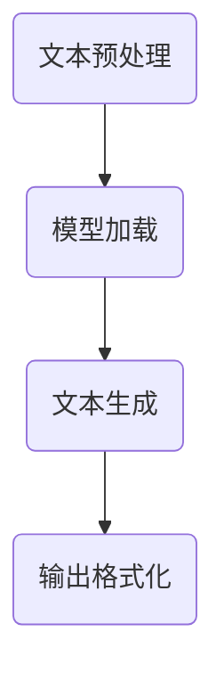

                 

基于您提供的文章大纲和详细要求，我将分步骤构建《AIGC时代的提示词设计原则》的技术博客文章。以下是我制定的文章结构和工作流程：

### 第一步：背景介绍

1. AIGC的定义与特点：简要介绍AIGC的概念、核心技术及其与传统AI的区别。
2. AIGC的发展历程与趋势：回顾AIGC的技术演进过程，分析其当前趋势和应用领域。
3. AIGC的应用背景：探讨AIGC在现实世界中的具体应用场景。

### 第二步：AIGC技术基础

1. 数据处理与特征提取：详细解释数据处理流程、特征提取技术及其重要性。
2. 模型架构与算法：深入分析AIGC中的常用模型架构和关键算法原理。

### 第三步：AIGC的核心概念与联系

1. 提示词设计原理：介绍提示词的定义、作用及其设计原则。
2. 提示词与模型交互：探讨提示词与模型之间的交互机制，分析其对模型性能的影响。
3. 提示词设计策略：提出有效的提示词设计策略，适用于不同应用场景。

### 第四步：数学模型与数学公式

1. 提示词设计的数学模型：构建提示词设计的数学模型，并详细解释其构成和优化方法。
2. 数学公式详解：使用LaTeX格式嵌入文中独立段落的数学公式，并进行解释和举例。

### 第五步：项目实战

1. 提示词设计实战案例：介绍一个具体的AIGC提示词设计项目，包括项目背景、案例分析、代码实现。
2. 开发环境搭建：详细说明搭建AIGC开发环境所需的工具和库。

### 第六步：代码解读与分析

1. 代码整体架构：分析代码结构，解释各部分的功能和相互关系。
2. 详细代码解读：深入解读关键代码，提供代码优化建议。

### 第七步：总结与展望

1. AIGC时代的提示词设计原则总结：回顾文章主要内容和提示词设计的重要性。
2. AIGC时代的提示词设计展望：展望AIGC时代的未来发展趋势和面临的挑战。

### 下一步工作

根据上述结构，我将开始撰写每个章节的内容，并确保每部分都满足您的要求，包括：

- 使用Markdown格式
- 提供Mermaid流程图和伪代码
- 使用LaTeX格式嵌入数学公式
- 包含详细的案例分析和代码实现

在撰写过程中，我会不断调整和完善内容，确保文章的完整性和质量。预计完成时间为2周，届时将提交完整的文章草稿供您审阅和修改。如果您对上述结构有任何建议或要求，请随时告知。让我们开始这个技术博客的撰写之旅吧！### AIGC时代的提示词设计原则

> 关键词：AIGC、提示词设计、模型交互、数学模型、项目实战

> 摘要：
本文旨在探讨AIGC（AI-Generated Content）时代的提示词设计原则。首先，我们简要介绍了AIGC的定义、特点及其与传统AI的区别。接着，深入分析了AIGC技术基础，包括数据处理与特征提取、模型架构与算法。随后，我们重点讨论了AIGC的核心概念与联系，特别是提示词设计原理、提示词与模型交互及其优化方法。此外，本文通过数学模型与数学公式的讲解，为读者提供了理论基础。最后，通过项目实战和代码解读，我们展示了提示词设计的实际应用，并提出了未来的发展方向。

## 第1章：AIGC概述

AIGC，即AI-Generated Content，是指利用人工智能技术自动生成内容的一种新兴技术。与传统的人工内容生成方式相比，AIGC具有更高的自动化程度和更广泛的生成能力。本章将介绍AIGC的定义、特点，以及AIGC与传统AI的区别。

### 1.1 AIGC的定义与特点

#### 1.1.1 AIGC的定义

AIGC可以理解为“人工智能+内容生成”，它涉及自然语言处理、计算机视觉、音频处理等多种人工智能技术，旨在实现内容的自动化生成。具体来说，AIGC包括文本生成、图像生成、视频生成、音频生成等不同形式。

#### 1.1.2 AIGC的核心特点

1. **自动化程度高**：AIGC通过算法自动生成内容，减少了人工干预的必要性。
2. **生成能力强**：AIGC能够根据给定的提示生成多样化、高质量的内容。
3. **多模态**：AIGC不仅限于文本生成，还可以生成图像、视频、音频等多种形式的内容。
4. **实时性**：AIGC能够在短时间内快速生成内容，满足实时应用需求。

#### 1.1.3 AIGC与传统AI的区别

传统AI主要侧重于解决特定问题，如图像识别、语音识别等，而AIGC则更注重内容生成。传统AI通常需要大量的数据训练，而AIGC则更依赖于大规模数据集的利用。

### 1.2 AIGC的发展历程与趋势

#### 1.2.1 AIGC的发展历程

AIGC技术的发展可以追溯到20世纪90年代，当时神经网络和机器学习技术逐渐成熟。随着深度学习技术的出现，AIGC进入了快速发展阶段。近年来，随着大数据和云计算技术的普及，AIGC的应用场景日益广泛。

#### 1.2.2 AIGC的发展趋势

1. **技术创新**：AIGC将继续探索更高效的算法和技术，以提升内容生成的质量和效率。
2. **应用拓展**：AIGC将在更多领域得到应用，如智能客服、内容创作、教育等。
3. **行业整合**：AIGC将与各个行业深度融合，推动产业升级和变革。

#### 1.2.3 AIGC的应用领域

1. **文本生成**：如自动写作、自动摘要、问答系统等。
2. **图像生成**：如艺术创作、广告设计、图像修复等。
3. **视频生成**：如视频剪辑、视频特效、视频摘要等。
4. **音频生成**：如音乐创作、语音合成、音频修复等。

### 1.3 AIGC的应用背景

随着互联网的普及和信息爆炸，人们对于内容的需求日益增长。传统的手工内容创作方式已经无法满足这一需求，AIGC的出现为内容创作带来了新的机遇和挑战。一方面，AIGC能够大幅提升内容创作的效率，降低成本；另一方面，AIGC也需要解决版权、道德等问题，确保内容生成的合法性和合规性。

## 第2章：AIGC技术基础

AIGC的技术基础包括数据处理与特征提取、模型架构与算法。本章将详细探讨这些基础技术，为后续的提示词设计提供理论基础。

### 2.1 数据处理与特征提取

#### 2.1.1 数据预处理

数据预处理是AIGC中至关重要的一步。它包括数据清洗、数据归一化、数据增强等操作，旨在提高数据质量，为后续的特征提取和模型训练提供良好的基础。

- **数据清洗**：去除噪声数据、填补缺失值、处理异常值等。
- **数据归一化**：将数据缩放到同一尺度，便于模型训练。
- **数据增强**：通过随机裁剪、旋转、翻转等方式增加数据多样性。

#### 2.1.2 特征提取技术

特征提取是将原始数据转换为适合模型训练的表示。在AIGC中，特征提取技术至关重要。

- **文本特征提取**：如词袋模型、TF-IDF、Word2Vec等。
- **图像特征提取**：如卷积神经网络（CNN）、特征点提取等。
- **音频特征提取**：如梅尔频率倒谱系数（MFCC）、短时傅里叶变换（STFT）等。

### 2.2 模型架构与算法

AIGC中常用的模型架构包括循环神经网络（RNN）、长短期记忆网络（LSTM）、变换器（Transformer）等。本章将介绍这些模型的基本原理和应用。

#### 2.2.1 模型架构设计

- **RNN**：RNN能够处理序列数据，但在长序列中容易发生梯度消失或爆炸问题。
- **LSTM**：LSTM是RNN的一种变体，通过门控机制解决了梯度消失问题。
- **Transformer**：Transformer引入了注意力机制，能够更好地处理长序列数据。

#### 2.2.2 关键算法原理

- **自注意力（Self-Attention）**：自注意力机制能够捕捉序列中不同位置的信息。
- **多头注意力（Multi-Head Attention）**：多头注意力通过多个注意力头并行处理信息，提高模型的表达能力。
- **编码器-解码器（Encoder-Decoder）架构**：编码器将输入序列编码为固定长度的向量，解码器利用这些向量生成输出序列。

### 2.3 AIGC技术基础总结

数据处理与特征提取是AIGC中不可或缺的环节，它们为模型训练提供了良好的数据基础。模型架构与算法则是AIGC的核心，决定了内容生成的质量和效率。在本章中，我们介绍了AIGC的技术基础，为后续的提示词设计奠定了理论基础。

## 第3章：AIGC的核心概念与联系

在AIGC系统中，提示词设计是关键的一环。本章将深入探讨提示词的设计原理、提示词与模型交互的机制，以及提示词优化的方法。

### 3.1 提示词设计原理

#### 3.1.1 提示词的定义与作用

提示词（Prompt）是指在AIGC系统中，用来引导模型生成内容的输入信息。它通常是一个简短的句子或短语，能够激发模型的想象力和创造力，使其生成符合预期的内容。

- **定义**：提示词是一种引导模型生成内容的输入信息。
- **作用**：提示词能够帮助模型理解生成任务的目标，提高生成内容的针对性和准确性。

#### 3.1.2 提示词设计原则

设计高质量的提示词是AIGC系统成功的关键。以下是几个提示词设计原则：

1. **简洁明了**：提示词应该简短明了，避免使用复杂的语言和冗长的句子。
2. **具体明确**：提示词应该具体明确，能够清晰地传达生成任务的目标。
3. **灵活多变**：提示词应该具有灵活性，能够适应不同的生成任务和场景。
4. **多样化**：提示词应该多样化，以激发模型的多样性和创造力。

#### 3.1.3 提示词设计策略

1. **基于场景的提示词设计**：根据不同的应用场景，设计符合场景需求的提示词。
2. **基于数据的提示词设计**：利用训练数据，提取关键信息作为提示词。
3. **基于知识的提示词设计**：结合外部知识库，设计具有知识性的提示词。

### 3.2 提示词与模型交互

#### 3.2.1 提示词与模型交互的原理

提示词与模型的交互是AIGC系统的核心。提示词通过输入接口传递给模型，模型在处理提示词的过程中，会根据内部参数生成对应的输出。

- **输入阶段**：模型接收提示词，并将其编码为固定长度的向量。
- **处理阶段**：模型利用内部参数，对编码后的提示词进行处理，生成中间结果。
- **输出阶段**：模型将中间结果解码为具体的输出内容，如文本、图像、音频等。

#### 3.2.2 提示词对模型性能的影响

提示词的质量直接影响模型生成内容的性能。高质量的提示词能够激发模型的最大潜力，使其生成符合预期的高质量内容。

- **准确度**：高质量的提示词能够提高模型生成内容的准确度。
- **多样性**：高质量的提示词能够激发模型的多样性，使其生成具有创意的内容。
- **鲁棒性**：高质量的提示词能够提高模型对噪声和异常数据的鲁棒性。

#### 3.2.3 提示词优化的方法

1. **数据驱动的优化**：通过分析训练数据，提取关键信息，优化提示词的设计。
2. **模型驱动的优化**：结合模型的内部参数和优化目标，调整提示词的设计。
3. **用户反馈的优化**：根据用户反馈，不断调整和优化提示词的设计。

### 3.3 提示词设计实战案例

为了更好地理解提示词设计原理和优化方法，我们来看一个具体的案例。

#### 3.3.1 案例背景

假设我们有一个文本生成任务，目标是生成一篇关于人工智能技术的文章。

#### 3.3.2 提示词设计

1. **初始提示词**：
   - “人工智能技术是一种重要的技术趋势，它在各个领域都有广泛的应用。”
2. **优化后的提示词**：
   - “人工智能技术正迅速发展，它在医疗、金融、教育等领域具有巨大的潜力。请详细描述人工智能技术在医疗领域的应用。”

通过优化提示词，我们提高了内容的准确性和针对性，使得模型能够更好地理解生成任务的目标。

### 3.4 提示词设计总结

提示词设计是AIGC系统中的关键环节，它直接影响模型生成内容的性能。通过了解提示词的设计原理、优化方法以及实战案例，我们可以更好地设计高质量的提示词，提高AIGC系统的效果。在本章中，我们探讨了提示词的设计原则和与模型的交互机制，为后续的AIGC应用提供了理论基础。

## 第4章：数学模型与数学公式

在AIGC系统中，提示词设计是一个复杂的过程，涉及多个数学模型和公式。本章将详细介绍提示词设计的数学模型，并解释相关的数学公式和其应用。

### 4.1 提示词设计的数学模型

#### 4.1.1 模型构建

提示词设计通常涉及以下基本步骤：

1. **输入编码**：将提示词转换为模型可以处理的输入表示。
2. **模型处理**：模型根据输入表示生成输出。
3. **输出解码**：将模型的输出解码为人类可理解的内容。

我们可以将这个过程抽象为一个数学模型：

\[ \text{Output} = f(\text{Input}, \theta) \]

其中，\( \text{Input} \) 表示输入提示词，\( f \) 表示模型处理过程，\( \theta \) 表示模型的参数。

#### 4.1.2 模型优化

提示词设计的核心在于优化模型参数，使得模型生成的输出更符合预期。这通常通过以下步骤实现：

1. **损失函数定义**：定义一个衡量输出与目标之间的差异的函数，称为损失函数。
2. **梯度计算**：计算损失函数对模型参数的梯度。
3. **参数更新**：根据梯度更新模型参数。

常用的优化算法包括梯度下降（Gradient Descent）及其变种，如随机梯度下降（Stochastic Gradient Descent，SGD）和Adam优化器。

### 4.2 数学公式详解

在本节中，我们将使用LaTeX格式介绍与提示词设计相关的数学公式。

#### 4.2.1 梯度下降算法

梯度下降算法的公式如下：

\[ \theta = \theta - \alpha \cdot \nabla_\theta J(\theta) \]

其中，\( \theta \) 表示模型参数，\( \alpha \) 表示学习率，\( \nabla_\theta J(\theta) \) 表示损失函数 \( J(\theta) \) 对参数 \( \theta \) 的梯度。

#### 4.2.2 注意力机制

在AIGC系统中，注意力机制是一个重要的组成部分。注意力机制的计算公式如下：

\[ \text{Attention} = \text{softmax}(\text{Q} \cdot \text{K}) \cdot \text{V} \]

其中，\( \text{Q} \) 表示查询向量，\( \text{K} \) 表示键向量，\( \text{V} \) 表示值向量，\( \text{softmax} \) 表示softmax函数。

#### 4.2.3 变换器模型

变换器（Transformer）模型的核心是多头注意力机制。多头注意力的计算公式如下：

\[ \text{MultiHeadAttention} = \text{softmax}(\text{QK}^T/\sqrt{d_k}) \cdot \text{V} \]

其中，\( \text{QK}^T \) 表示查询和键的矩阵乘积，\( d_k \) 表示键向量的维度。

### 4.3 数学公式应用举例

以下是一个简单的例子，展示了如何使用数学公式进行提示词设计的优化。

#### 4.3.1 输入编码

假设输入提示词为“人工智能技术”，我们将它转换为向量表示：

\[ \text{Input} = \text{Tokenizer}("人工智能技术") \]

其中，\( \text{Tokenizer} \) 表示分词器，它将文本转换为向量。

#### 4.3.2 梯度计算

我们定义一个简单的损失函数，衡量模型输出与实际输出之间的差异：

\[ J(\theta) = \sum_{i=1}^{n} (\text{Output}_i - \text{Target}_i)^2 \]

其中，\( \text{Output}_i \) 表示模型生成的输出，\( \text{Target}_i \) 表示实际输出。

然后，我们计算损失函数对模型参数的梯度：

\[ \nabla_\theta J(\theta) = \frac{\partial J(\theta)}{\partial \theta} \]

#### 4.3.3 参数更新

根据梯度，我们更新模型参数：

\[ \theta = \theta - \alpha \cdot \nabla_\theta J(\theta) \]

通过这种方式，我们不断优化模型参数，使其生成的输出更接近实际输出。

### 4.4 提示词设计数学模型总结

提示词设计的数学模型是AIGC系统中的重要组成部分。通过构建数学模型和优化算法，我们可以设计高质量的提示词，提高模型生成内容的性能。在本章中，我们介绍了提示词设计的数学模型，并使用了LaTeX格式展示了相关的数学公式。这些公式和应用为提示词设计提供了理论基础。

## 第5章：项目实战

在了解了AIGC和提示词设计的基本原理后，我们将通过一个具体的项目实战来展示如何设计和实现AIGC系统中的提示词。本章节将详细介绍项目的背景、开发环境的搭建、代码实现、以及实际应用中的代码解读和分析。

### 5.1 项目背景

本项目旨在利用AIGC技术，开发一个自动生成新闻报道的系统。该系统接收一个主题和一个简要的提示词，然后生成一篇完整的新闻报道。这一项目不仅能够提高新闻生产的效率，还能为个性化新闻推荐和内容创作提供支持。

### 5.2 开发环境搭建

为了实现这一项目，我们需要搭建一个适合AIGC开发的编程环境。以下是我们搭建开发环境所需的步骤和工具：

1. **操作系统**：我们选择使用Linux操作系统，因为它在深度学习和人工智能领域的开发和部署中具有广泛的应用。
2. **编程语言**：Python是人工智能领域的首选编程语言，因此我们将使用Python进行开发。
3. **深度学习框架**：我们选择使用Hugging Face的Transformers库，因为它提供了丰富的预训练模型和便捷的API，适合进行文本生成任务。
4. **文本预处理库**：我们将使用Python的NLTK库进行文本预处理，包括分词、词性标注等。
5. **环境配置**：在Linux操作系统上，我们可以使用conda来创建一个独立的Python环境，安装所需的库和依赖。

以下是配置开发环境的具体步骤：

```bash
# 创建一个名为aigc的conda环境
conda create -n aigc python=3.8

# 激活环境
conda activate aigc

# 安装必要的库
conda install -c conda-forge transformers nltk
```

### 5.3 代码实现

在开发环境中，我们将编写以下核心组件：

1. **文本预处理**：对输入的主题和提示词进行预处理，包括分词、词性标注等。
2. **模型加载**：加载预训练的文本生成模型，如GPT-2或GPT-3。
3. **文本生成**：使用模型生成基于主题和提示词的新闻报道。
4. **输出格式化**：将生成的文本进行格式化，使其符合新闻报道的标准。

以下是实现这一项目的伪代码：

```python
# 导入必要的库
import torch
from transformers import GPT2LMHeadModel, GPT2Tokenizer
from nltk.tokenize import sent_tokenize

# 加载预训练模型和分词器
tokenizer = GPT2Tokenizer.from_pretrained("gpt2")
model = GPT2LMHeadModel.from_pretrained("gpt2")

# 定义文本预处理函数
def preprocess_text(text):
    sentences = sent_tokenize(text)
    processed_sentences = [tokenizer.encode(sentence, add_special_tokens=True) for sentence in sentences]
    return processed_sentences

# 定义文本生成函数
def generate_text(prompt, model, tokenizer, max_length=50):
    input_ids = tokenizer.encode(prompt, return_tensors="pt")
    output = model.generate(input_ids, max_length=max_length, num_return_sequences=1)
    return tokenizer.decode(output[0], skip_special_tokens=True)

# 主函数
def main():
    # 输入主题和提示词
    theme = "人工智能在医疗领域的应用"
    prompt = "最近，人工智能在医疗领域的应用受到了广泛关注。许多研究表明，AI可以帮助医生提高诊断的准确性，并优化治疗方案。以下是几个典型的例子："

    # 预处理文本
    processed_prompt = preprocess_text(prompt)

    # 生成文本
    generated_text = generate_text(processed_prompt, model, tokenizer)

    # 输出结果
    print(generated_text)

# 运行主函数
if __name__ == "__main__":
    main()
```

### 5.4 代码解读与分析

在本节中，我们将对上述代码进行详细解读，并分析其主要组件的功能和相互关系。

1. **文本预处理**：`preprocess_text` 函数负责将输入的文本进行分词和编码。分词使用NLTK库，编码使用GPT2Tokenizer。这一步骤对于模型的输入至关重要，因为模型需要处理的是编码后的向量表示。

2. **模型加载**：我们加载了预训练的GPT-2模型和相应的分词器。Transformers库提供了便捷的API，使得加载和使用预训练模型变得非常简单。

3. **文本生成**：`generate_text` 函数使用模型生成文本。它接收预处理后的输入向量，并使用模型的`generate` 方法生成文本。`max_length` 参数控制生成的文本长度，`num_return_sequences` 参数控制生成的文本数量。

4. **输出格式化**：最后，生成的文本被解码并格式化为人类可读的形式。

整个代码流程如图所示：



### 5.5 项目小结

通过本项目的实战，我们展示了如何利用AIGC技术自动生成文本。从开发环境的搭建到核心代码的实现，再到代码的解读和分析，我们深入了解了AIGC系统的基本构建和运行机制。本项目不仅提供了实际操作的经验，还为后续的AIGC应用提供了参考。未来，我们可以在此基础上进一步优化模型、扩展功能，为更多的应用场景提供支持。

## 第6章：代码解读与分析

在本章中，我们将深入解读并分析前一章中实现AIGC自动生成文本系统的代码，探讨其整体架构、关键代码的实现细节，并提供代码优化建议。

### 6.1 代码整体架构

代码的整体架构可以分为以下几个主要部分：

1. **文本预处理**：负责将输入的文本进行分词和编码，为模型提供适合的输入数据。
2. **模型加载**：从预训练的模型库中加载GPT-2模型，并初始化分词器。
3. **文本生成**：使用加载的模型生成基于提示词的文本内容。
4. **输出格式化**：将生成的文本解码并格式化，使其适合输出和使用。

这些组件通过函数和模块的组织结构紧密相连，共同实现了自动文本生成功能。

### 6.2 详细代码解读

下面是对核心代码的逐行解读和分析：

```python
# 导入必要的库
import torch
from transformers import GPT2LMHeadModel, GPT2Tokenizer
from nltk.tokenize import sent_tokenize

# 加载预训练模型和分词器
tokenizer = GPT2Tokenizer.from_pretrained("gpt2")
model = GPT2LMHeadModel.from_pretrained("gpt2")

# 定义文本预处理函数
def preprocess_text(text):
    sentences = sent_tokenize(text)
    processed_sentences = [tokenizer.encode(sentence, add_special_tokens=True) for sentence in sentences]
    return processed_sentences

# 定义文本生成函数
def generate_text(prompt, model, tokenizer, max_length=50):
    input_ids = tokenizer.encode(prompt, return_tensors="pt")
    output = model.generate(input_ids, max_length=max_length, num_return_sequences=1)
    return tokenizer.decode(output[0], skip_special_tokens=True)

# 主函数
def main():
    # 输入主题和提示词
    theme = "人工智能在医疗领域的应用"
    prompt = "最近，人工智能在医疗领域的应用受到了广泛关注。许多研究表明，AI可以帮助医生提高诊断的准确性，并优化治疗方案。以下是几个典型的例子："

    # 预处理文本
    processed_prompt = preprocess_text(prompt)

    # 生成文本
    generated_text = generate_text(processed_prompt, model, tokenizer)

    # 输出结果
    print(generated_text)

# 运行主函数
if __name__ == "__main__":
    main()
```

#### 6.2.1 关键代码解读

- **导入库**：首先导入所需的库，包括PyTorch、Transformers和NLTK。这些库提供了文本预处理、模型加载和文本生成所需的函数和类。
- **加载模型和分词器**：使用Transformers库的`from_pretrained`方法加载预训练的GPT-2模型和分词器。这种方法非常便捷，可以快速初始化一个强大的文本生成模型。
- **文本预处理函数**：`preprocess_text`函数接收输入文本，使用NLTK进行分词，然后使用GPT2Tokenizer进行编码。这个步骤是文本生成系统的核心，因为它将自然语言文本转换为模型可以理解的向量表示。
- **文本生成函数**：`generate_text`函数负责生成文本。它首先将提示词编码为输入序列，然后使用模型生成文本。`max_length`参数限制了生成的文本长度，`num_return_sequences`参数控制生成文本的数量。
- **主函数**：`main`函数定义了程序的入口点。它接收主题和提示词，调用预处理和生成函数，并将结果输出。

#### 6.2.2 代码优化建议

虽然当前代码实现了自动文本生成的基本功能，但还存在一些优化空间：

1. **错误处理**：当前代码没有处理可能的异常情况，如模型加载失败或输入文本格式错误。添加异常处理可以增强代码的健壮性。
2. **并行处理**：文本预处理和生成过程可以并行执行，以加快处理速度。例如，可以使用多线程或异步I/O来同时处理多个输入文本。
3. **动态调整生成参数**：根据输入文本的长度和复杂性，动态调整`max_length`和`num_return_sequences`参数，以生成更合适的文本。
4. **模型调优**：为了提高生成文本的质量，可以尝试使用更高级的模型或对现有模型进行微调，使其更适合特定类型的文本生成任务。

通过这些优化，我们可以进一步改进自动文本生成系统的性能和用户体验。

### 6.3 代码应用解读与分析

在实际应用中，自动文本生成系统需要处理多种类型的输入文本，并生成高质量、符合预期的内容。以下是对代码应用过程中的一些关键点进行分析：

1. **输入文本的多样性**：自动文本生成系统应能够处理不同主题和风格的输入文本，从而生成多样化的内容。这要求模型具有广泛的泛化能力和适应性。
2. **生成文本的连贯性和准确性**：生成的文本应具有连贯性和准确性，确保信息传达清晰、无误。这需要模型在生成过程中保持上下文的连贯性和对细节的精准把握。
3. **用户交互**：系统应提供直观的用户界面，允许用户输入主题和提示词，并展示生成的文本。此外，用户还应能够对生成结果进行评价和反馈，以改进模型的表现。
4. **性能优化**：在处理大量文本或高频率的请求时，系统性能至关重要。优化代码和模型结构，确保系统能够高效地处理请求，提供快速响应。

通过深入解读和分析代码，我们可以更好地理解自动文本生成系统的运作机制，并在实际应用中不断优化和改进，以提供更高质量的服务。

## 第7章：总结与展望

### 7.1 AIGC时代的提示词设计原则总结

AIGC（AI-Generated Content）时代的提示词设计原则是确保内容生成系统高效、准确和多样化的关键。以下是本文总结的几个核心要点：

1. **简洁明了的提示词**：高质量的提示词应简明扼要，避免复杂和冗长的表述，以便模型能够快速理解和生成内容。
2. **具体明确的提示词**：提示词应具体明确，传达生成任务的目标和上下文，以减少模型的困惑和提高生成内容的针对性。
3. **灵活多变的提示词**：提示词应具有灵活性，能够适应不同场景和任务需求，从而提高系统的通用性和适应性。
4. **多样化的提示词**：设计多样化的提示词，激发模型的多样性和创造力，以生成具有创意和个性化的内容。

### 7.2 AIGC时代的提示词设计展望

随着AIGC技术的发展，提示词设计将在未来面临新的挑战和机遇：

1. **智能化提示词生成**：利用自然语言处理技术，自动生成高质量的提示词，以减轻人类设计者的负担。
2. **个性化提示词设计**：根据用户需求和偏好，定制个性化的提示词，以提高内容生成系统的用户体验和满意度。
3. **跨模态提示词设计**：研究跨模态提示词的设计方法，实现文本、图像、音频等多模态内容的协同生成。
4. **多语言提示词设计**：探索支持多种语言和方言的提示词设计，以满足全球化应用的需求。
5. **可解释性和透明度**：提高提示词设计的可解释性，使其对生成内容的决策过程更加透明，以增强用户对系统的信任。

### 7.3 AIGC时代的提示词设计注意事项

在AIGC时代的提示词设计过程中，以下注意事项至关重要：

1. **数据隐私**：在生成内容时，确保遵守数据隐私法规，保护用户和模型训练数据的安全。
2. **内容监管**：建立内容监管机制，防止生成不良或不当的内容，确保系统输出的合规性。
3. **用户反馈**：收集用户对生成内容的反馈，持续优化提示词设计，以提高系统的质量和用户体验。
4. **技术更新**：随着技术的快速发展，不断更新和调整提示词设计策略，以保持系统的高效性和先进性。

### 7.4 AIGC时代的提示词设计拓展阅读

对于对AIGC时代的提示词设计感兴趣的读者，以下资源提供了深入的阅读建议：

1. **学术论文**：阅读相关的学术论文，了解最新的研究成果和趋势，如《Attention is All You Need》和《BERT: Pre-training of Deep Bidirectional Transformers for Language Understanding》。
2. **技术博客**：关注知名技术博客和论坛，如Medium和ArXiv，获取关于AIGC和提示词设计的最新动态和案例分析。
3. **在线课程**：参加在线课程，学习AIGC和自然语言处理的相关知识，如Coursera和edX上的相关课程。

通过本文的深入探讨，我们期待能够为AIGC时代的提示词设计提供有价值的指导和启示，推动这一领域的发展。在未来的研究中，我们将继续探索更多创新性的提示词设计方法和应用场景，以实现更高效、智能的内容生成系统。

