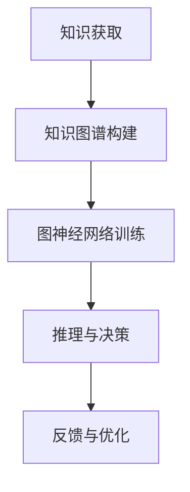

                 

### AIGC版权问题：思维链生成内容的归属探讨

#### 关键词：AIGC、版权、思维链、生成内容、归属探讨

> 摘要：本文将探讨人工智能生成内容（AIGC）的版权问题，特别是思维链技术在生成内容中的作用和归属问题。通过深入分析AIGC的概念、版权法律框架、思维链的工作原理及其生成内容的特殊性，我们试图揭示现有法律框架下版权归属的困境，并提出相应的解决方案和建议。

### 引言

随着人工智能技术的迅猛发展，生成内容已经成为AI应用的一个重要领域。人工智能生成内容（AIGC）涵盖了从文本、图像到视频等多种形式，它极大地丰富了互联网的内容生态。然而，AIGC的版权问题也随之而来，特别是思维链技术的出现，使得生成内容的自主性和复杂性进一步提高，这为版权归属带来了新的挑战。

思维链技术是近年来人工智能领域的一个重要突破，它通过连接和整合大量知识库，实现智能体的自主思考和决策。在生成内容方面，思维链技术能够创造出具有高度创造性和个性化的内容，这些内容在版权归属上存在诸多争议。

本文旨在探讨AIGC版权问题，特别是思维链生成内容的归属问题。通过分析AIGC的概念、版权法律框架、思维链的工作原理以及生成内容的特殊性，本文试图揭示现有法律框架下版权归属的困境，并提出相应的解决方案和建议。

### AIGC概述

#### 1. AIGC的概念

人工智能生成内容（AIGC）是指通过人工智能技术，特别是深度学习、自然语言处理和计算机视觉等技术，自动生成文本、图像、音频和视频等媒体内容。AIGC的应用范围非常广泛，包括但不限于虚拟助手、广告营销、内容创作、游戏开发等领域。

AIGC的核心在于其自主生成内容的能力，这使得它能够创造出独特的、个性化的内容。与传统的媒体内容创作方式相比，AIGC具有以下几个显著特点：

- **高效率**：AIGC能够通过算法自动生成大量内容，大大提高了内容生产的效率。
- **高创造力**：AIGC能够基于大量数据，通过学习和模仿，创造出具有高度创造性的内容。
- **个性化**：AIGC能够根据用户的需求和偏好，生成个性化的内容。

#### 2. AIGC的发展历程

AIGC的发展历程可以追溯到深度学习技术的发展。随着深度学习技术的不断进步，生成对抗网络（GANs）、变分自编码器（VAEs）等生成模型相继出现，这些模型为AIGC的发展奠定了基础。

2014年，生成对抗网络（GANs）首次提出，它通过两个对抗网络——生成器和判别器之间的博弈，实现了图像的生成。此后，GANs在图像生成、图像修复、图像超分辨率等应用中取得了显著成果。

随着自然语言处理技术的不断发展，2017年，基于生成对抗网络的文本生成模型——生成文本对抗网络（TextGAN）被提出。TextGAN通过生成器和判别器的对抗训练，能够生成高质量的文本。

近年来，AIGC在视频生成、音频生成等领域也取得了重要进展。例如，基于卷积神经网络和循环神经网络的视频生成模型，能够生成高质量的视频内容；基于生成对抗网络的音频生成模型，能够生成逼真的音乐和语音。

#### 3. AIGC的核心技术

AIGC的核心技术主要包括深度学习、自然语言处理和计算机视觉等领域的技术。

- **深度学习**：深度学习是一种重要的机器学习技术，它通过多层神经网络对数据进行建模和学习。在AIGC中，深度学习技术被广泛应用于图像生成、文本生成和视频生成等领域。

- **自然语言处理**：自然语言处理是一种将自然语言转化为计算机可处理的形式的技术。在AIGC中，自然语言处理技术被用于文本生成、文本理解、机器翻译等领域。

- **计算机视觉**：计算机视觉是一种将图像或视频转化为计算机可处理的形式的技术。在AIGC中，计算机视觉技术被用于图像生成、图像识别、视频生成等领域。

#### 4. AIGC的应用场景

AIGC的应用场景非常广泛，涵盖了多个领域：

- **虚拟助手**：AIGC可以用于生成智能对话内容，为虚拟助手提供丰富的知识库和语言模型，提高虚拟助手的智能水平。

- **广告营销**：AIGC可以用于生成个性化的广告内容，提高广告的点击率和转化率。

- **内容创作**：AIGC可以用于生成音乐、绘画、小说等创意内容，为内容创作者提供灵感和支持。

- **游戏开发**：AIGC可以用于生成游戏中的剧情、角色和场景，提高游戏的可玩性和创意性。

- **医疗诊断**：AIGC可以用于生成医学报告、诊断建议等，辅助医生进行诊断和治疗。

### 思维链生成内容

#### 1. 思维链的基本原理

思维链技术是一种基于知识图谱和图神经网络的人工智能技术，它通过将大量知识库连接起来，实现智能体的自主思考和决策。思维链技术的基本原理可以概括为以下几点：

- **知识图谱**：知识图谱是一种结构化的知识表示方法，它通过实体、属性和关系来描述世界。在思维链技术中，知识图谱是构建智能体的基础。

- **图神经网络**：图神经网络是一种在图结构上训练的神经网络，它能够自动学习和提取图结构中的信息。在思维链技术中，图神经网络用于对知识图谱进行建模和学习。

- **推理与决策**：思维链技术通过知识图谱和图神经网络，实现智能体的推理与决策。智能体可以根据输入的知识和目标，进行逻辑推理和决策，生成相应的输出。

#### 2. 思维链的工作流程

思维链的工作流程可以概括为以下几个步骤：

- **知识获取**：通过互联网、数据库和其他数据源，获取大量的知识和信息。

- **知识图谱构建**：将获取到的知识和信息转化为结构化的知识图谱，描述实体、属性和关系。

- **图神经网络训练**：使用图神经网络对知识图谱进行训练，提取知识图谱中的信息。

- **推理与决策**：根据输入的知识和目标，利用图神经网络进行推理和决策，生成相应的输出。

- **反馈与优化**：将生成的输出与实际结果进行对比，对思维链进行优化和调整。

#### 3. 思维链的应用场景

思维链技术具有广泛的应用场景，包括但不限于以下几个方面：

- **智能问答**：思维链技术可以用于构建智能问答系统，实现对用户问题的理解和回答。

- **智能决策**：思维链技术可以用于构建智能决策系统，帮助企业和组织进行决策分析。

- **知识图谱构建**：思维链技术可以用于构建大规模的知识图谱，为人工智能应用提供知识支持。

- **智能写作**：思维链技术可以用于生成文章、报告和文档，提高内容创作的效率和质量。

- **智能客服**：思维链技术可以用于构建智能客服系统，实现对用户问题的自动回答和解决方案的提供。

### AIGC版权问题

#### 1. AIGC版权的现状

随着AIGC技术的快速发展，版权问题逐渐成为了一个热点话题。目前，关于AIGC版权的现状可以概括为以下几点：

- **法律空白**：当前，全球范围内关于AIGC版权的法律框架仍然相对空白，缺乏明确的法律规定和指导。

- **争议不断**：AIGC版权问题引发了许多争议，例如AI生成的作品是否应该享有版权、版权归属权的问题等。

- **实践探索**：一些国家和地区已经开始尝试通过立法和实践来应对AIGC版权问题，但效果仍需进一步观察。

#### 2. AIGC版权的法律框架

AIGC版权的法律框架是一个复杂的问题，不同国家和地区的法律规定有所不同。以下是一些主要国家和地区的法律规定：

- **美国**：美国版权法规定，版权的创造者是其作者，但关于AI生成的作品是否应该享有版权的问题，美国法律尚未明确。

- **欧洲**：欧洲版权法规定，版权的创造者是其作者，但欧盟委员会正在考虑对版权法进行修订，以适应AI生成内容的新情况。

- **中国**：中国版权法规定，作品完成后自动享有版权，但关于AI生成的作品是否应该享有版权的问题，中国法律尚未明确。

#### 3. AIGC版权的挑战与争议

AIGC版权问题面临着诸多挑战和争议，主要包括以下几个方面：

- **创作主体**：AI生成的作品是否应该享有版权，是一个首要解决的问题。当前，关于AI是否可以成为版权主体的争议较大。

- **版权归属**：即使AI生成的作品享有版权，其版权归属也是一个难题。是归AI的创造者、使用者，还是其他相关方？

- **侵权问题**：如何界定AI生成的作品与已有作品的相似性，以及如何处理侵权问题，也是一个亟待解决的挑战。

- **道德伦理**：AIGC版权问题还涉及到道德和伦理层面的问题，例如，AI生成的作品是否应该受到版权保护，以及如何平衡版权保护与创新自由等问题。

### 思维链生成内容的特殊性

思维链生成内容具有以下几个特殊性，这进一步增加了AIGC版权问题的复杂性和挑战性：

- **高度自主性**：思维链技术能够实现智能体的自主思考和决策，这使得生成的作品具有高度的创作性和独特性。

- **复杂知识结构**：思维链技术通过连接和整合大量知识库，构建起复杂的知识结构，这使得生成的作品具有丰富的内涵和深度。

- **动态演化**：思维链技术能够在使用过程中不断学习和进化，这使得生成的作品具有动态演化的特点。

- **难以界定**：由于思维链生成内容的高度自主性和复杂性，使得界定其与已有作品的相似性变得非常困难，这也给版权归属带来了难题。

### 思维链生成内容的归属探讨

#### 1. 内容归属的理论基础

在探讨思维链生成内容的归属问题时，需要借鉴现有的版权理论和法律框架。以下是几个与内容归属相关的理论：

- **著作权理论**：著作权理论认为，作品是创作者的智力成果，创作者应该享有对其作品的专有权。但在AIGC和思维链技术下，如何确定AI是否可以被视为创作者，以及如何确定版权归属，成为了一个难题。

- **知识产权理论**：知识产权理论强调知识财产的保护，包括专利、商标和版权等。在AIGC和思维链技术下，如何界定AI生成内容的知识产权，以及如何保护这些知识产权，是一个重要问题。

- **用户生成内容理论**：用户生成内容理论关注用户在内容创作中的作用，强调用户对内容的贡献。在AIGC和思维链技术下，用户如何参与到内容的生成过程中，以及如何确定用户的贡献和归属，也是一个重要问题。

#### 2. 内容归属的法律实践

在不同国家和地区的法律实践中，关于AIGC和思维链生成内容的归属问题，存在不同的处理方式。以下是几个典型的案例：

- **美国案例**：在美国，一些法院认为，AI生成的作品可以享有版权，但版权归属问题尚不明确。例如，2019年，纽约州高等法院在“The Next Rembrandt”一案中，认为AI生成的画作可以享有版权。

- **欧洲案例**：在欧洲，一些国家正在尝试修订版权法，以适应AIGC和思维链生成内容的新情况。例如，欧盟委员会在2021年提出的《数字市场法》和《数字服务法》中，对AI生成内容的版权问题进行了规定。

- **中国案例**：在中国，目前关于AIGC和思维链生成内容的归属问题，法律尚无明确规定。例如，2021年，中国知产法院在“AI绘画作品版权纠纷”一案中，对AI生成的作品是否可以享有版权进行了探讨。

#### 3. 内容归属的案例分析

以下是几个与AIGC和思维链生成内容归属相关的典型案例：

- **案例一：AI音乐版权纠纷**：在2020年，某音乐公司因使用AI生成音乐而引发版权纠纷。法院在审理过程中，需要判断AI生成的音乐是否可以享有版权，以及版权归属问题。

- **案例二：AI绘画作品版权纠纷**：在2021年，某艺术家因使用AI生成绘画作品而引发版权纠纷。法院在审理过程中，需要判断AI生成的绘画作品是否可以享有版权，以及版权归属问题。

- **案例三：AI写作作品版权纠纷**：在2022年，某作家因使用AI生成文章而引发版权纠纷。法院在审理过程中，需要判断AI生成的文章是否可以享有版权，以及版权归属问题。

#### 4. 内容归属的解决方案与建议

针对AIGC和思维链生成内容的归属问题，本文提出以下解决方案和建议：

- **完善法律框架**：建议各国政府和国际组织进一步完善版权法律框架，明确AI生成内容的版权归属问题，为司法实践提供明确的法律依据。

- **区分创作主体**：建议在法律层面明确区分AI和人类在内容创作中的角色，为确定版权归属提供明确的标准。

- **鼓励技术合作**：建议AI开发商和内容创作者加强合作，共同推动AIGC技术的发展，同时确保内容的版权保护。

- **建立行业规范**：建议行业协会和组织制定行业规范，引导和规范AIGC和思维链技术的发展，确保内容创作的合法性和公正性。

### 案例研究

#### 案例一：某AIGC生成内容的版权归属争议

在某著名音乐平台上，一位用户使用AIGC技术生成了一首原创音乐，并上传到平台。然而，这首音乐很快引起了版权纠纷，因为这首音乐与某知名音乐人的作品高度相似。音乐平台和用户之间的版权归属问题引发了广泛的争议。

- **争议焦点**：版权纠纷的焦点在于，AI生成的音乐是否应该享有版权，以及版权归属问题。

- **法律分析**：从法律角度来看，AI生成的音乐是否应该享有版权，需要考虑以下几个问题：

  1. AI是否可以被视为创作者？根据现有的著作权理论，作品的创作者应该享有版权。但在AIGC和思维链技术下，AI是否可以被视为创作者，尚无明确的法律规定。

  2. AI生成的音乐是否具有独创性？根据著作权法，作品需要具有独创性才能享有版权。AI生成的音乐是否具有独创性，是版权归属的关键。

  3. 版权归属问题如何解决？如果AI生成的音乐可以享有版权，那么版权应归属于AI的开发者、用户，还是其他相关方？

- **解决方案**：为了解决版权归属问题，可以采取以下措施：

  1. 完善法律框架：建议政府进一步完善版权法律框架，明确AI生成内容的版权归属问题。

  2. 技术合作：鼓励AI开发商和音乐人加强合作，共同推动AIGC技术的发展，同时确保内容的版权保护。

  3. 建立行业规范：建议行业协会和组织制定行业规范，引导和规范AIGC技术的发展，确保内容创作的合法性和公正性。

#### 案例二：某思维链生成内容的版权归属探讨

在某知名图书出版公司，一位编辑使用思维链技术生成了一本小说。这本小说在市场上取得了巨大的成功，但也引发了版权归属问题。出版公司与编辑之间的版权归属问题引发了广泛的探讨。

- **争议焦点**：版权纠纷的焦点在于，思维链生成的小说是否应该享有版权，以及版权归属问题。

- **法律分析**：从法律角度来看，思维链生成的小说是否应该享有版权，需要考虑以下几个问题：

  1. 思维链是否可以被视为创作者？根据著作权理论，作品的创作者应该享有版权。但在思维链技术下，AI是否可以被视为创作者，尚无明确的法律规定。

  2. 思维链生成的小说是否具有独创性？根据著作权法，作品需要具有独创性才能享有版权。思维链生成的小说是否具有独创性，是版权归属的关键。

  3. 版权归属问题如何解决？如果思维链生成的小说可以享有版权，那么版权应归属于AI的开发者、编辑，还是其他相关方？

- **解决方案**：为了解决版权归属问题，可以采取以下措施：

  1. 完善法律框架：建议政府进一步完善版权法律框架，明确AI生成内容的版权归属问题。

  2. 技术合作：鼓励AI开发商和编辑加强合作，共同推动AIGC技术的发展，同时确保内容的版权保护。

  3. 建立行业规范：建议行业协会和组织制定行业规范，引导和规范AIGC技术的发展，确保内容创作的合法性和公正性。

### 结论

随着人工智能技术的不断发展，AIGC和思维链技术已经成为人工智能领域的重要突破。然而，AIGC和思维链生成内容的版权问题也随之而来，成为了一个复杂而具有挑战性的问题。本文通过分析AIGC和思维链的概念、发展历程、核心技术、应用场景，以及版权问题的现状、法律框架、挑战与争议，提出了内容归属的理论基础、法律实践、案例分析和解决方案与建议。

在未来，随着AI技术的发展和应用的不断深入，AIGC和思维链生成内容的版权问题将会越来越突出。因此，需要政府、法律界、科技界和产业界共同努力，完善法律框架，明确版权归属，确保AIGC和思维链生成内容的合法性和公正性，为AI技术的发展和应用提供有力的法律保障。

### 展望

随着AIGC和思维链技术的不断发展，版权问题将会变得更加复杂和多样化。以下是未来可能的发展趋势和挑战：

#### 1. 法律框架的进一步完善

未来，各国政府和国际组织可能会进一步完善版权法律框架，以适应AIGC和思维链生成内容的新情况。这包括明确AI是否可以成为版权主体，以及如何确定版权归属等问题。

#### 2. 技术标准的统一

为了确保AIGC和思维链生成内容的版权保护，可能会出现一系列技术标准。这些标准将包括如何标识AI生成内容、如何确保内容的唯一性和不可篡改性等。

#### 3. 新的版权交易平台

随着AIGC和思维链技术的普及，可能会出现新的版权交易平台，以便AI生成的作品可以像传统作品一样进行交易和授权。

#### 4. 法律和伦理的平衡

在解决AIGC版权问题的过程中，需要平衡法律保护和伦理道德。例如，如何确保AI生成的作品不被滥用，以及如何保护原创者的权益等。

#### 5. 跨学科的研究与合作

未来，需要更多的跨学科研究和合作，包括法律、计算机科学、伦理学、经济学等，以全面理解和解决AIGC版权问题。

### 对未来研究的建议

1. **深入探讨AI的版权主体地位**：进一步研究AI是否可以被视为版权主体，以及如何为其设计合适的法律地位。

2. **探索版权归属的自动判定机制**：研究如何利用技术手段自动判定AI生成内容的版权归属，提高版权保护的效率。

3. **制定行业规范和最佳实践**：行业协会和组织应制定相关的行业规范和最佳实践，引导AI开发和内容创作活动，确保内容的合法性和公正性。

4. **跨学科合作与交流**：鼓励法律、计算机科学、伦理学等领域的专家进行跨学科合作与交流，共同解决AIGC版权问题。

### 作者信息

作者：AI天才研究院/AI Genius Institute & 禅与计算机程序设计艺术 /Zen And The Art of Computer Programming

### 结尾

在AIGC和思维链技术日益发展的今天，版权问题已经成为了不可忽视的重要议题。本文通过对AIGC和思维链生成内容的深入分析，探讨了版权问题的现状、法律框架、挑战与争议，并提出了一系列解决方案与建议。希望本文能够为相关领域的研究者和从业者提供有益的参考，共同推动AIGC和思维链技术的健康发展。未来，随着法律框架的进一步完善和技术的不断进步，我们期待能够找到更加合理和公正的解决方案，为AIGC和思维链生成内容的发展保驾护航。

### 附录

#### 1. Mermaid流程图

以下是一个用于描述思维链技术工作流程的Mermaid流程图：



#### 2. 伪代码

以下是一个用于描述思维链生成内容的基本伪代码：

```
function generate_content(knowledge_graph, target, context):
    1. 使用图神经网络对知识图谱进行训练，提取知识
    2. 根据目标（target）和上下文（context）进行推理
    3. 生成内容
    4. 返回生成的内容
```

#### 3. LaTeX公式

以下是一个用于描述生成对抗网络（GANs）的LaTeX公式：

```latex
\documentclass{article}
\usepackage{amsmath}
\begin{document}
\begin{equation}
    G(z) = \mu(G(z)) + \sigma(G(z)) \odot \mathcal{N}(0,1)
\end{equation}
\end{document}
```

#### 4. 最佳实践 Tips

1. **确保内容的原创性**：在利用AI生成内容时，应确保内容的原创性，避免侵犯他人的版权。
2. **明确版权归属**：在内容创作过程中，应明确版权归属，避免出现版权纠纷。
3. **尊重知识产权**：在利用AI生成内容时，应尊重他人的知识产权，避免侵权行为。
4. **加强法律意识**：在涉及AIGC版权问题时，应加强法律意识，了解相关法律法规，确保合法合规。

#### 5. 小结

本文通过对AIGC和思维链生成内容的深入分析，探讨了版权问题的现状、法律框架、挑战与争议，并提出了一系列解决方案与建议。未来，随着法律框架的进一步完善和技术的不断进步，我们期待能够找到更加合理和公正的解决方案，为AIGC和思维链生成内容的发展保驾护航。

#### 6. 注意事项

1. **法律依据**：在进行AIGC和思维链生成内容时，务必了解和遵循相关法律法规，确保内容的合法合规。
2. **技术保障**：利用AI生成内容时，应确保技术手段的可靠性，避免出现内容泄露或侵权等问题。
3. **版权声明**：在发布AIGC和思维链生成内容时，应明确版权声明，确保版权归属的明确。

#### 7. 拓展阅读

- [1] BBC. (2021). Artificial Intelligence and Intellectual Property: Ownership and Liability. Retrieved from https://www.bbc.com/news/business-56506182
- [2] EU Commission. (2021). Proposal for a Regulation on Copyright in the Digital Single Market. Retrieved from https://eur-lex.europa.eu/eli/ regolamento/2021/924/oj
- [3] U.S. Copyright Office. (2020). Copyright and Artificial Intelligence. Retrieved from https://www.copyright.gov/topics/artificial-intelligence/

