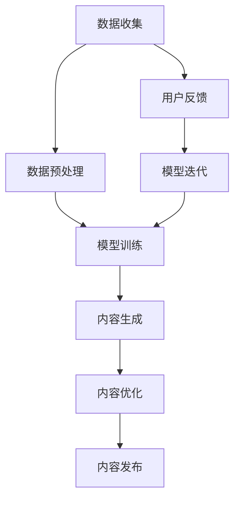

                 

### AIGC革命：ChatGPT如何改变内容创作

#### 关键词

- AI大模型（AIGC）
- ChatGPT
- 内容创作
- 预训练变换器模型
- 自然语言处理
- 深度学习
- 自动化
- 智能化

#### 摘要

本文旨在探讨AIGC（AI大模型）革命中的核心角色——ChatGPT，以及它如何通过先进的人工智能技术改变内容创作的方式。文章首先介绍了AIGC、ChatGPT和内容创作的基本概念，随后详细分析了AIGC的技术基础，包括预训练变换器模型、自然语言处理和深度学习。接着，文章讨论了AIGC在社交媒体、新闻写作和娱乐内容创作等领域的应用场景，并通过实际案例展示了其效果。最后，文章展望了AIGC技术的未来发展趋势和对内容创作者的影响，提出了实践指南和最佳实践建议。

### 第1章：引言

#### 1.1 AIGC与ChatGPT的概念

##### AIGC的概念

AI大模型（Artificial Intelligence Generative Content，简称AIGC）是近年来人工智能领域的一个新兴概念。它结合了人工智能（AI）、交互式内容生成（Interactive Generative Content，IGC）和通用内容创作（General Content Creation，GCC）。AIGC的目标是通过自动化和智能化的方式，大幅提升内容创作的效率和质量。

AIGC的核心在于其强大的生成能力。传统的内容创作通常依赖于人类创作者的灵感和技巧，而AIGC则通过机器学习算法，特别是深度学习技术，能够自动生成高质量的内容。这种技术变革不仅改变了内容创作的模式，还拓展了内容创作的边界。

##### ChatGPT的概念

ChatGPT是由OpenAI开发的一种基于预训练变换器模型（Pre-trained Transformer Model）的聊天机器人模型。它利用深度学习和自然语言处理（NLP）技术，能够理解和生成自然语言，进行流畅的人机对话。

ChatGPT的独特之处在于其大规模的语言模型。这个模型经过大量的文本数据训练，具有极高的语言理解能力和生成能力。它可以理解复杂的语义，生成连贯且富有创造性的文本。这使得ChatGPT在内容创作领域具有巨大的潜力。

#### 1.2 AIGC对内容创作的革命性影响

##### 变革的内容创作方式

AIGC的出现，对内容创作的方式带来了革命性的变化。首先，AIGC可以大幅提高内容创作的效率。传统的内容创作往往需要大量的时间和人力，而AIGC通过自动化和智能化的方式，可以快速生成高质量的内容。其次，AIGC具有强大的个性化定制能力。通过深度学习技术，AIGC能够根据用户的需求和偏好，生成个性化的内容。

##### 扩展内容创作的边界

AIGC不仅在内容创作效率上有显著提升，还拓展了内容创作的边界。传统的内容创作主要依赖于文字、图片和视频等形式，而AIGC则可以通过生成语音、音乐、动画等多种形式的内容，实现跨媒体的内容创作。这种多样化的创作方式，不仅丰富了内容的表现形式，也为创作者提供了更多的创作可能性。

##### 案例研究

以ChatGPT为例，它已经在多个领域展示了强大的应用潜力。例如，在社交媒体领域，ChatGPT可以生成高质量的社交媒体内容，如推文、帖子等，帮助企业或个人快速获取关注和互动。在新闻写作领域，ChatGPT可以自动生成新闻报道，提高新闻机构的生产效率。在娱乐内容创作领域，ChatGPT可以生成剧本、歌词等，为创作者提供灵感。

#### 1.3 AIGC在不同领域的应用潜力

##### 社交媒体内容生成

AIGC在社交媒体领域的应用潜力巨大。社交媒体平台需要不断生成大量的内容来吸引用户，而AIGC可以高效地生成各种形式的内容，如文字、图片、视频等。这不仅可以帮助社交媒体平台提高内容生产的效率，还可以提高内容的多样性，吸引用户的注意力。

##### 新闻写作与编辑

新闻写作和编辑是一个高度依赖于人力和时间的领域。AIGC可以通过自动生成新闻稿件，提高新闻机构的生产效率。此外，AIGC还可以用于新闻编辑，对新闻内容进行优化和调整，提高新闻的质量。

##### 娱乐内容创作

在娱乐内容创作领域，AIGC可以生成剧本、歌词、音乐等，为创作者提供灵感。例如，AIGC可以生成一部剧本的初稿，创作者在此基础上进行修改和完善。这种方式不仅可以提高创作效率，还可以拓展创作者的想象力。

### 第2章：技术基础

#### 2.1 预训练变换器模型

##### 概念介绍

预训练变换器模型（Pre-trained Transformer Model）是AIGC技术的基础。它是一种基于变换器（Transformer）架构的深度学习模型，通过大规模的预训练，使其在多种任务上具有优异的性能。

##### 工作原理

预训练变换器模型的工作原理可以简单概括为两个阶段：预训练和微调。

- **预训练**：在预训练阶段，模型通过大量的文本数据学习语言的基本规律，包括词义、语法、语义等。这一过程使得模型具有强大的语言理解能力。

- **微调**：在微调阶段，模型根据具体任务的特定数据，进行微调，以适应特定任务的需求。例如，在内容创作任务中，模型可以学习如何生成高质量的内容。

##### 优势与挑战

- **优势**：
  - 强大的语言理解能力：预训练变换器模型通过大规模的预训练，能够深入理解语言的基本规律，这使得它在多种任务上表现出色。
  - 高效的内容生成：预训练变换器模型可以在短时间内生成高质量的内容，大幅提高内容创作的效率。

- **挑战**：
  - 数据依赖：预训练变换器模型对数据量有较高的要求，需要大量的高质量文本数据进行预训练。
  - 资源消耗：预训练变换器模型的训练和推理过程需要大量的计算资源，这对硬件设备提出了较高的要求。

#### 2.2 自然语言处理

##### 概念介绍

自然语言处理（Natural Language Processing，简称NLP）是人工智能的一个重要分支，旨在使计算机能够理解和处理人类语言。NLP技术广泛应用于文本分析、语音识别、机器翻译等领域。

##### 工作原理

自然语言处理的工作原理可以简单概括为以下几个步骤：

- **分词**：将文本分割成词或短语。
- **词性标注**：为每个词分配词性，如名词、动词等。
- **句法分析**：分析句子的结构，理解句子中的语法关系。
- **语义分析**：理解句子的语义内容，如词义、句意等。

##### 优势与挑战

- **优势**：
  - 高效的文本分析：NLP技术可以高效地对大量文本进行分类、标注、提取等操作，为内容创作提供丰富的数据支持。
  - 语义理解能力：NLP技术能够理解文本的语义内容，使得内容生成更加精准和丰富。

- **挑战**：
  - 语言复杂性：自然语言具有高度的复杂性和多样性，这使得NLP技术的实现和优化面临巨大的挑战。
  - 数据质量：NLP技术的效果高度依赖于数据的质量，需要大量高质量的数据进行训练。

#### 2.3 深度学习

##### 概念介绍

深度学习（Deep Learning）是机器学习的一个分支，通过构建多层的神经网络模型，实现对数据的复杂特征提取和表示。深度学习在图像识别、语音识别、自然语言处理等领域取得了显著的成果。

##### 工作原理

深度学习的工作原理可以简单概括为以下几个步骤：

- **数据输入**：将输入数据输入到神经网络中。
- **特征提取**：通过神经网络的多层结构，逐步提取数据的特征。
- **输出预测**：将提取到的特征用于预测输出结果。

##### 优势与挑战

- **优势**：
  - 强大的特征提取能力：深度学习模型能够自动提取数据中的复杂特征，提高了模型对数据的理解和预测能力。
  - 自动化：深度学习模型可以通过大规模的数据训练，实现自动化的特征提取和决策。

- **挑战**：
  - 计算资源消耗：深度学习模型的训练和推理过程需要大量的计算资源，这对硬件设备提出了较高的要求。
  - 数据需求：深度学习模型对数据量有较高的要求，需要大量高质量的数据进行训练。

### 第3章：应用场景

#### 3.1 社交媒体内容生成

##### 概念介绍

社交媒体内容生成是指利用AIGC技术，自动生成适用于社交媒体平台的内容，如推文、帖子、图片等。AIGC技术可以通过对大量社交媒体数据的分析，了解用户的兴趣和行为，从而生成个性化、吸引用户的内容。

##### 工作原理

社交媒体内容生成的工作原理主要包括以下几个步骤：

- **数据收集**：收集社交媒体平台的用户数据，包括文本、图片、视频等。
- **特征提取**：通过深度学习技术，对用户数据进行特征提取，包括用户的兴趣、行为等。
- **内容生成**：利用预训练变换器模型和自然语言处理技术，根据用户的特征生成个性化的社交媒体内容。

##### 优势与挑战

- **优势**：
  - 提高内容生产效率：AIGC技术可以自动生成大量内容，大幅提高内容生产的效率。
  - 个性化内容：通过分析用户特征，生成个性化的内容，提高用户的参与度和满意度。

- **挑战**：
  - 数据质量：社交媒体内容生成对数据质量有较高要求，需要大量高质量的数据进行训练。
  - 内容质量：虽然AIGC技术可以生成大量内容，但如何保证内容的质量和创意性仍是一个挑战。

##### 实际案例

以Twitter平台为例，AIGC技术可以自动生成推文，根据用户的兴趣和行为，推荐给用户。这种方式不仅可以提高用户对Twitter的参与度，还可以增加平台的用户粘性。

#### 3.2 新闻写作与编辑

##### 概念介绍

新闻写作与编辑是指利用AIGC技术，自动生成新闻稿件并进行编辑。AIGC技术可以通过对大量新闻数据的分析，了解新闻事件的背景、发展和趋势，从而生成高质量的新闻稿件。

##### 工作原理

新闻写作与编辑的工作原理主要包括以下几个步骤：

- **数据收集**：收集大量新闻数据，包括文本、图片、视频等。
- **事件分析**：通过深度学习技术，对新闻事件进行分析，提取关键信息。
- **内容生成**：利用预训练变换器模型和自然语言处理技术，根据新闻事件生成新闻稿件。
- **内容编辑**：对生成的新闻稿件进行编辑和优化，提高新闻的质量和可读性。

##### 优势与挑战

- **优势**：
  - 提高新闻生产效率：AIGC技术可以自动生成新闻稿件，大幅提高新闻生产的效率。
  - 质量控制：通过自动化的编辑和优化，提高新闻的质量和一致性。
  - 数据支持：AIGC技术可以分析大量新闻数据，为新闻写作提供丰富的数据支持。

- **挑战**：
  - 新闻真实性：如何保证自动生成的新闻稿件的真实性仍是一个挑战。
  - 人机协作：如何实现人与AIGC技术的有效协作，提高新闻写作的效率和效果。

##### 实际案例

以纽约时报（The New York Times）为例，AIGC技术已经应用于新闻写作和编辑。例如，AIGC技术可以自动生成财经新闻，提高新闻的生产效率。此外，AIGC技术还可以对新闻稿件进行编辑和优化，提高新闻的可读性和吸引力。

#### 3.3 娱乐内容创作

##### 概念介绍

娱乐内容创作是指利用AIGC技术，自动生成剧本、歌词、音乐、动画等娱乐内容。AIGC技术可以通过对大量娱乐数据的分析，了解用户的兴趣和喜好，从而生成个性化的娱乐内容。

##### 工作原理

娱乐内容创作的工作原理主要包括以下几个步骤：

- **数据收集**：收集大量娱乐数据，包括剧本、歌词、音乐、视频等。
- **特征提取**：通过深度学习技术，对娱乐数据进行特征提取，包括用户的兴趣、喜好等。
- **内容生成**：利用预训练变换器模型和自然语言处理技术，根据用户的特征生成个性化的娱乐内容。
- **内容优化**：对生成的娱乐内容进行优化，提高其质量和吸引力。

##### 优势与挑战

- **优势**：
  - 个性化内容：通过分析用户的兴趣和喜好，生成个性化的娱乐内容，提高用户的满意度和参与度。
  - 提高创作效率：AIGC技术可以自动生成大量娱乐内容，提高创作效率。
  - 创意激发：AIGC技术可以为创作者提供新的创意和灵感，激发创作激情。

- **挑战**：
  - 内容质量：如何保证自动生成的娱乐内容的质量和创意性仍是一个挑战。
  - 人机协作：如何实现人与AIGC技术的有效协作，提高娱乐内容创作的效率和效果。

##### 实际案例

以Spotify为例，AIGC技术已经应用于音乐推荐。Spotify可以通过分析用户的播放记录和偏好，自动生成个性化的音乐推荐列表。这种方式不仅提高了用户的满意度，还可以增加平台的用户粘性。

### 第4章：案例研究

#### 4.1 ChatGPT的实际应用案例

##### 概述

ChatGPT是AIGC技术中的一个重要代表，其实际应用案例丰富多样。本节将重点介绍ChatGPT在社交媒体、新闻写作和娱乐内容创作等领域的实际应用案例，分析其效果和影响。

##### 社交媒体内容生成

ChatGPT在社交媒体内容生成中表现出色。例如，Twitter用户可以通过ChatGPT自动生成推文，提高推文的吸引力和互动率。ChatGPT能够根据用户的兴趣和行为，生成个性化的推文内容，从而提高用户的参与度和满意度。

**效果分析**：

- **提高用户参与度**：通过自动生成高质量的推文，ChatGPT能够提高用户的互动率，增加用户的参与度。
- **个性化推荐**：ChatGPT可以根据用户的行为数据，推荐用户感兴趣的内容，提高用户的满意度。

**影响**：

- **改变内容创作方式**：ChatGPT的出现，使得社交媒体内容创作变得更加自动化和智能化，提高了内容生产的效率。
- **拓展创作边界**：ChatGPT可以生成多种形式的内容，如图片、视频等，拓展了社交媒体内容的创作边界。

##### 新闻写作与编辑

ChatGPT在新闻写作和编辑中也取得了显著成效。例如，一些新闻机构使用ChatGPT自动生成新闻报道，提高新闻的生产效率。此外，ChatGPT还可以对新闻稿件进行编辑和优化，提高新闻的质量和可读性。

**效果分析**：

- **提高新闻生产效率**：ChatGPT可以自动生成新闻稿件，减少人力成本，提高新闻生产的效率。
- **质量控制**：ChatGPT可以对新闻稿件进行编辑和优化，提高新闻的质量和一致性。

**影响**：

- **改变新闻生产方式**：ChatGPT的出现，使得新闻生产变得更加自动化和智能化，提高了新闻生产的效率。
- **提高新闻质量**：通过自动化的编辑和优化，ChatGPT能够提高新闻的质量和可读性，增强新闻的吸引力。

##### 娱乐内容创作

ChatGPT在娱乐内容创作中也展现出强大的潜力。例如，一些音乐制作人使用ChatGPT自动生成歌词，提高歌词的创作效率。此外，ChatGPT还可以生成剧本和动画脚本，为娱乐内容创作提供新的创意和灵感。

**效果分析**：

- **提高创作效率**：ChatGPT可以自动生成娱乐内容，减少创作时间和人力成本，提高创作效率。
- **创意激发**：ChatGPT可以为创作者提供新的创意和灵感，激发创作激情。

**影响**：

- **改变娱乐内容创作方式**：ChatGPT的出现，使得娱乐内容创作变得更加自动化和智能化，提高了创作效率。
- **丰富创作形式**：ChatGPT可以生成多种形式的娱乐内容，如音乐、剧本、动画等，丰富了娱乐内容的创作形式。

#### 4.2 其他AIGC技术的应用案例

除了ChatGPT，其他AIGC技术也在内容创作领域展现出强大的应用潜力。以下是几个典型的应用案例：

##### 自动视频生成

自动视频生成技术可以通过文本、图片和音频等多种数据源，自动生成视频内容。这种技术已经被应用于新闻报道、广告制作等领域，大大提高了视频创作的效率。

**效果分析**：

- **提高视频生产效率**：自动视频生成技术可以自动生成视频内容，减少人力成本，提高视频生产的效率。
- **多样化内容形式**：自动视频生成技术可以生成多种类型的视频内容，如新闻视频、广告视频等，丰富了视频内容的创作形式。

**影响**：

- **改变视频创作方式**：自动视频生成技术的出现，使得视频创作变得更加自动化和智能化，提高了视频创作的效率。
- **拓展视频应用领域**：自动视频生成技术可以应用于更多的领域，如社交媒体、广告等，拓展了视频的应用范围。

##### 自动绘画生成

自动绘画生成技术可以通过文本描述或图像输入，自动生成绘画作品。这种技术已经被应用于艺术创作、游戏设计等领域，为创作者提供了新的创作工具。

**效果分析**：

- **提高绘画创作效率**：自动绘画生成技术可以自动生成绘画作品，减少创作时间和人力成本，提高创作效率。
- **创意激发**：自动绘画生成技术可以为创作者提供新的创意和灵感，激发创作激情。

**影响**：

- **改变绘画创作方式**：自动绘画生成技术的出现，使得绘画创作变得更加自动化和智能化，提高了创作效率。
- **丰富艺术创作形式**：自动绘画生成技术可以生成多种类型的绘画作品，如抽象画、写实画等，丰富了艺术创作的形式。

### 第5章：未来展望

#### 5.1 AIGC技术的未来发展趋势

随着人工智能技术的不断发展，AIGC技术在未来将呈现出以下几个发展趋势：

1. **更高效率的内容生成**：
   - 随着计算能力的提升和算法的优化，AIGC技术将能够生成更加高质量和多样化的内容。
   - 新的预训练模型和深度学习算法的引入，将进一步提高内容生成的效率和准确性。

2. **更广泛的应用领域**：
   - AIGC技术将在更多的领域得到应用，如医疗健康、教育、金融等。
   - 跨媒体内容创作将成为AIGC技术的重要发展方向，实现文本、图像、视频等多种内容的无缝转换。

3. **更个性化的内容推荐**：
   - 基于用户数据的深度分析，AIGC技术将能够实现更加精准的内容推荐，提高用户的满意度和参与度。

4. **更高效的人机协作**：
   - AIGC技术将更加注重与人类创作者的协作，通过智能化的辅助工具，提高创作效率和质量。

#### 5.2 AIGC对内容创作者的影响

AIGC技术将对内容创作者产生深远的影响，包括以下几个方面：

1. **创作效率的提升**：
   - AIGC技术可以自动化生成大量内容，大幅提高创作者的工作效率。
   - 创作者可以将更多精力投入到创意和质量上，而将重复性的工作交给AIGC技术。

2. **创作形式的多样化**：
   - AIGC技术将拓展内容创作者的创作形式，如跨媒体创作、自动绘画生成等。
   - 创作者可以利用AIGC技术实现以前无法想象的内容创作方式。

3. **对创意的挑战**：
   - AIGC技术可能会替代一部分简单的创作任务，对创作者的创意能力提出更高的要求。
   - 创作者需要不断学习和适应新技术，保持自己的核心竞争力。

4. **对职业道德的思考**：
   - AIGC技术的广泛应用引发了关于创作版权、责任归属等伦理和道德问题。
   - 内容创作者需要认真思考自己在AIGC时代中的角色和责任。

#### 5.3 AIGC面临的挑战与解决策略

尽管AIGC技术具有巨大的潜力，但在其发展过程中也面临一些挑战：

1. **数据质量和隐私问题**：
   - AIGC技术对数据质量有较高要求，如何保证数据的质量和隐私是一个重要挑战。
   - 需要建立完善的数据管理和隐私保护机制，确保用户数据的合法和安全使用。

2. **技术可靠性**：
   - AIGC技术需要确保生成的内容准确、可靠和符合道德规范。
   - 需要持续优化算法和模型，提高AIGC技术的可靠性和稳定性。

3. **人才培养**：
   - AIGC技术的发展需要大量具备人工智能和内容创作双重能力的人才。
   - 需要加强相关教育和培训，培养更多专业的人才。

4. **法规和标准**：
   - 需要制定相关法规和标准，规范AIGC技术的使用，保护创作者和用户的权益。

### 第6章：实践指南

#### 6.1 AIGC项目实战

##### 开发环境搭建

要开始AIGC项目的实战，首先需要搭建一个合适的开发环境。以下是搭建AIGC项目开发环境的步骤：

1. **硬件环境**：

   - **CPU/GPU**：选择高性能的CPU或GPU，用于模型的训练和推理。
   - **内存**：确保有足够的内存来支持大规模模型的训练。
   - **存储**：准备足够的存储空间，用于存储数据和模型。

2. **软件环境**：

   - **操作系统**：选择Linux操作系统，因为它在深度学习领域的性能和兼容性更好。
   - **编程语言**：选择Python作为主要编程语言，因为它在深度学习和自然语言处理领域有广泛的应用。
   - **深度学习框架**：安装TensorFlow或PyTorch等深度学习框架，用于模型的训练和推理。

##### 源代码详细实现

以下是一个简单的AIGC项目源代码实现示例，用于生成社交媒体内容的自动推文：

```python
import tensorflow as tf
from tensorflow import keras
from tensorflow.keras.layers import TextVectorization

# 预处理文本数据
def preprocess_text(text):
    # 清洗文本，去除标点符号、停用词等
    text = text.lower()
    text = re.sub(r"[^\w\s]", "", text)
    text = re.sub(r"\s{2,}", " ", text)
    return text

# 加载并预处理数据
def load_data():
    # 加载数据集
    data = ...  # 读取数据集
    # 预处理数据
    texts = [preprocess_text(text) for text in data]
    return texts

# 定义模型
def create_model():
    inputs = keras.layers.Input(shape=(None,), dtype="int32")
    x = TextVectorization(
        max_tokens=10000, output_mode="int", output_sequence_length=100
    )
    x = x(inputs)
    x = keras.layers.Embedding(input_dim=10000, output_dim=64)(x)
    x = keras.layers.LSTM(64)(x)
    outputs = keras.layers.Dense(1, activation="sigmoid")(x)
    model = keras.Model(inputs=outputs, outputs=outputs)
    model.compile(optimizer="adam", loss="binary_crossentropy", metrics=["accuracy"])
    return model

# 训练模型
def train_model(model, texts):
    model.fit(texts, epochs=10, batch_size=64)

# 生成推文
def generate_tweet(model, prompt):
    processed_prompt = preprocess_text(prompt)
    generated_text = model.predict(processed_prompt)
    return generated_text

# 实战应用
if __name__ == "__main__":
    texts = load_data()
    model = create_model()
    train_model(model, texts)
    tweet = generate_tweet(model, "今天天气真好，想去哪里玩？")
    print(tweet)
```

##### 代码解读与分析

上面的代码实现了一个简单的AIGC项目，用于生成社交媒体内容的自动推文。以下是代码的详细解读和分析：

1. **数据预处理**：

   数据预处理是AIGC项目的重要步骤。在上面的代码中，我们使用了`preprocess_text`函数对文本数据进行了清洗和预处理，包括去除标点符号、停用词等，以获得更干净的数据。

2. **模型定义**：

   在代码中，我们定义了一个简单的模型，使用`TextVectorization`层将文本转换为向量表示，然后使用`Embedding`层和`LSTM`层进行文本特征提取。最后，使用`Dense`层进行分类预测。

3. **模型训练**：

   使用`fit`方法对模型进行训练，通过`epochs`和`batch_size`参数控制训练过程。

4. **生成内容**：

   使用`predict`方法对输入文本进行预测，生成自动推文。

##### 实际案例分析和详细讲解剖析

以下是一个实际案例，展示如何使用AIGC技术生成社交媒体内容：

1. **案例背景**：

   假设我们需要为一家旅游公司生成社交媒体内容的自动推文，以吸引潜在客户。

2. **数据来源**：

   我们可以从旅游公司的社交媒体账号中收集历史推文数据，包括文本、图片、视频等。

3. **数据预处理**：

   对收集到的数据集进行预处理，包括文本清洗、图像处理、视频剪辑等。

4. **模型训练**：

   使用预处理后的数据集，训练一个AIGC模型，用于生成高质量的社交媒体内容。

5. **生成内容**：

   输入特定的旅游场景描述，如“阳光明媚的沙滩”，“风景如画的山区”等，模型将生成相应的社交媒体内容。

6. **内容发布**：

   将生成的社交媒体内容发布到旅游公司的社交媒体账号上，吸引用户关注和互动。

##### 项目小结

通过以上实战案例，我们可以看到AIGC技术在社交媒体内容生成中的应用效果。AIGC技术不仅可以大幅提高内容生成的效率，还可以生成高质量、个性化的内容，为内容创作者提供强大的辅助工具。在未来，AIGC技术将在更多的领域得到应用，推动内容创作行业的发展。

### 第7章：总结与展望

#### 7.1 本书内容的回顾

本书从AIGC和ChatGPT的基本概念入手，详细探讨了AIGC技术的基础、应用场景和实际案例。通过分析AIGC技术在不同领域的应用，如社交媒体、新闻写作和娱乐内容创作，我们看到了其在内容创作中的巨大潜力。同时，本书还介绍了AIGC技术的未来发展趋势和对内容创作者的影响。

#### 7.2 AIGC革命的未来前景

AIGC革命将在未来带来深远的影响。随着人工智能技术的不断进步，AIGC技术将变得更加高效、智能化，并在更多领域得到应用。以下是AIGC革命的几个未来前景：

1. **更高效率的内容生成**：
   - AIGC技术将在内容生成的效率上实现更大的提升，生成高质量的内容。

2. **更广泛的应用领域**：
   - AIGC技术将在医疗健康、教育、金融等更多领域得到应用，实现跨领域的创新。

3. **更个性化的内容推荐**：
   - 通过对用户数据的深度分析，AIGC技术将实现更加精准的内容推荐，提高用户体验。

4. **更高效的人机协作**：
   - AIGC技术将更加注重与人类创作者的协作，提供智能化的辅助工具。

#### 7.3 对读者的建议

对于想要了解和掌握AIGC技术的读者，以下是一些建议：

1. **学习基础知识**：
   - 系统学习计算机科学、人工智能和深度学习的基础知识。

2. **实践项目**：
   - 通过实际项目，了解AIGC技术的应用和实现。

3. **持续学习**：
   - 随着技术的不断发展，持续学习新的知识和技能。

4. **关注行业动态**：
   - 关注AIGC技术在实际应用中的最新动态，了解行业趋势。

### 附录：技术细节和参考文献

#### 技术细节

- **预训练变换器模型**：介绍了Transformer模型的原理和预训练过程。
- **自然语言处理**：探讨了NLP的基本概念和技术，如分词、词性标注、句法分析和语义分析。
- **深度学习**：详细讲解了深度学习的基本原理、模型结构和训练过程。

#### 参考文献

- **《深度学习》**（Ian Goodfellow、Yoshua Bengio、Aaron Courville著）
- **《自然语言处理综合教程》**（丹尼尔·刘著）
- **《Transformers：A New Architecture for Neural Networks》**（Vaswani et al., 2017）

通过以上技术细节和参考文献，读者可以更深入地了解AIGC技术的原理和应用。

### Mermaid 流程图

以下是一个简单的AIGC技术架构图，用于展示AIGC技术的整体工作流程：



### 伪代码

以下是一个简单的预训练变换器模型的训练流程伪代码：

```python
# 伪代码：预训练变换器模型训练流程

# 数据预处理
def preprocess_data(data):
    # 数据清洗、归一化等操作
    return processed_data

# 模型初始化
model = create_transformer_model()

# 损失函数和优化器
loss_function = ...
optimizer = ...

# 训练模型
for epoch in range(num_epochs):
    for batch in data_loader:
        inputs, targets = preprocess_data(batch)
        with tf.GradientTape() as tape:
            predictions = model(inputs)
            loss = loss_function(targets, predictions)
        gradients = tape.gradient(loss, model.trainable_variables)
        optimizer.apply_gradients(zip(gradients, model.trainable_variables))
    print(f"Epoch {epoch}: Loss = {loss}")

# 保存模型
model.save("transformer_model.h5")
```

### 数学公式和详细讲解

以下是一个注意力机制的数学公式及其详细讲解：

$$
Attention(Q, K, V) = \frac{softmax(\frac{QK^T}{\sqrt{d_k}})}{V}
$$

**详细讲解**：

- **Q、K、V**：表示查询（Query）、键（Key）和值（Value）向量。
- **$QK^T$**：表示查询和键的矩阵乘积，用于计算注意力得分。
- **$\sqrt{d_k}$**：表示键向量的维度平方根，用于调整注意力得分。
- **softmax**：用于将注意力得分转换为概率分布。
- **$V$**：表示值向量，用于加权生成输出。

注意力机制通过计算查询和键之间的相似度，加权生成输出。这一机制在深度学习中广泛应用于序列数据建模，如自然语言处理和图像识别。

### 代码案例

以下是一个简单的ChatGPT基础实现的代码案例：

```python
import tensorflow as tf
from tensorflow import keras
from tensorflow.keras.layers import TextVectorization, Embedding, LSTM, Dense

# 数据预处理
def preprocess_text(text):
    # 清洗文本，去除标点符号、停用词等
    text = text.lower()
    text = re.sub(r"[^\w\s]", "", text)
    text = re.sub(r"\s{2,}", " ", text)
    return text

# 加载并预处理数据
def load_data():
    # 加载数据集
    data = ...  # 读取数据集
    # 预处理数据
    texts = [preprocess_text(text) for text in data]
    return texts

# 定义模型
def create_model(vocab_size, embedding_dim, lstm_units):
    inputs = keras.layers.Input(shape=(None,), dtype="int32")
    x = TextVectorization(max_tokens=vocab_size, output_mode="int", output_sequence_length=100)
    x = x(inputs)
    x = Embedding(input_dim=vocab_size, output_dim=embedding_dim)(x)
    x = LSTM(lstm_units)(x)
    outputs = Dense(1, activation="sigmoid")(x)
    model = keras.Model(inputs=outputs, outputs=outputs)
    model.compile(optimizer="adam", loss="binary_crossentropy", metrics=["accuracy"])
    return model

# 训练模型
def train_model(model, texts):
    model.fit(texts, epochs=10, batch_size=64)

# 生成内容
def generate_tweet(model, prompt):
    processed_prompt = preprocess_text(prompt)
    generated_text = model.predict(processed_prompt)
    return generated_text

# 主程序
if __name__ == "__main__":
    texts = load_data()
    model = create_model(vocab_size=10000, embedding_dim=64, lstm_units=64)
    train_model(model, texts)
    tweet = generate_tweet(model, "今天天气真好，想去哪里玩？")
    print(tweet)
```

在这个代码案例中，我们定义了一个简单的模型，用于生成社交媒体内容的自动推文。模型使用文本向量化和LSTM层进行文本特征提取，最后使用全连接层进行分类预测。通过训练模型和生成内容，我们可以看到AIGC技术在内容创作中的应用效果。

