                 

# AI在法律服务中的应用：效率与公平的权衡

## 关键词
人工智能，法律服务，效率，公平，算法，自然语言处理，智能合约，法律研究，自动化法律顾问

## 摘要
本文旨在探讨人工智能（AI）在法律服务中的应用，特别是在提高效率和权衡公平性方面的挑战。随着AI技术的发展，数据挖掘、自然语言处理和智能合约等技术在法律领域的应用日益广泛，但随之而来的是效率和公平性问题。本文通过详细阐述核心概念、算法原理和实际案例，分析AI在法律服务中的潜在优势与挑战，并探讨如何在提升效率的同时保持公平性。

## 引言

### AI与法律服务的联系

人工智能作为当今技术发展的前沿领域，正逐步渗透到各个行业，包括法律服务。随着大数据、云计算和深度学习等技术的进步，AI在法律服务中的应用变得更加广泛和深入。例如，数据挖掘可以帮助律师快速分析大量法律文件，自然语言处理（NLP）能够理解和生成法律文本，智能合约可以自动化执行合同条款。

图1展示了AI在法律服务中的应用场景和核心概念之间的联系：

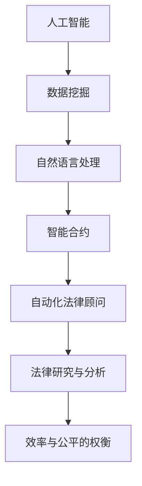

### 核心概念与架构

#### AI在法律服务中的应用

AI在法律服务中的应用可以从多个角度进行探讨：

- **数据挖掘**：通过分析大量法律文件和数据，挖掘出潜在的信息和规律，为律师提供决策支持。例如，通过挖掘案件的历史数据，可以预测案件的可能结果和审理时间。

- **自然语言处理（NLP）**：NLP技术可以处理和理解法律文件和合同，提取关键信息，例如合同条款、证据、法律意见等。这有助于律师快速了解案件细节，提高工作效率。

- **智能合约**：智能合约是一种自动执行合同条款的计算机协议。通过区块链技术，智能合约可以在满足特定条件时自动执行合同条款，从而减少人工干预和错误。

- **自动化法律顾问**：利用AI技术，可以开发出自动化法律顾问系统，为用户提供法律咨询和服务。这些系统能够处理常见法律问题，提供法律文件模板，甚至进行初步的法律分析。

- **法律研究与分析**：AI技术可以辅助律师进行法律研究，快速检索和分类法律文献，分析案件的法律依据，为律师提供更加全面和深入的法律支持。

#### AI法律服务的架构

一个典型的AI法律服务架构可以分为以下几个主要模块：

- **用户需求收集**：收集用户的需求和输入，包括案件信息、法律问题等。

- **数据收集与处理**：收集相关的法律数据，如案件记录、法律文件、法规等，并进行预处理，如数据清洗、格式化等。

- **自然语言处理（NLP）**：利用NLP技术对法律文本进行处理，提取关键词、概念和关系，为后续分析提供基础。

- **智能合约执行**：根据用户需求和合同条款，执行智能合约，进行自动化处理和执行。

- **法律研究与分析**：利用AI技术进行法律研究，分析案例、法规和最新法律动态，为律师提供决策支持。

- **自动化法律顾问**：根据用户需求，提供自动化法律咨询和服务，如法律文件生成、法律意见等。

- **用户反馈与优化**：收集用户反馈，对系统进行优化和调整，提高服务质量和用户体验。

图2展示了AI法律服务的架构：

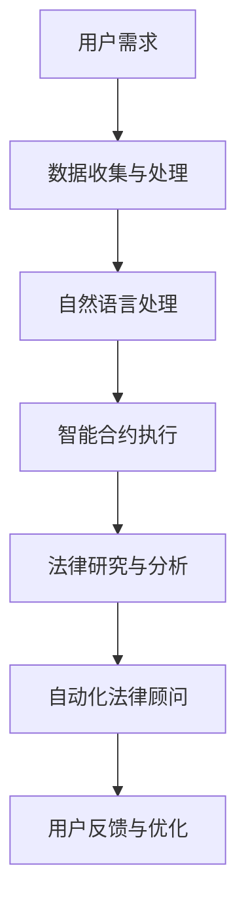

### 效率与公平的权衡

AI在法律服务中的应用不仅提高了效率，也带来了公平性问题。如何在提升效率的同时保持公平性，是一个需要深入探讨的话题。

#### 效率提升

AI技术可以通过以下几个方面提高法律服务的效率：

- **自动化处理**：通过自动化工具处理常见的法律事务，如合同审核、法律文件生成等，减少人工工作量。

- **数据挖掘与预测**：利用数据挖掘技术，分析大量历史案件数据，预测案件的可能结果和时间，为律师提供决策支持。

- **智能搜索与分析**：利用NLP技术，快速检索和分类法律文献，提供相关案例和法律依据，提高法律研究的效率。

- **团队协作**：通过智能助手和协作平台，实现团队成员之间的实时沟通和协作，提高工作效率。

#### 公平性问题

虽然AI技术可以提高法律服务的效率，但也存在一些潜在的公平性问题：

- **算法偏见**：AI系统可能基于历史数据训练，这些数据可能包含偏见，导致系统在处理案件时产生不公平的结果。

- **信息不对称**：AI系统可能只依赖于可访问的数据，而忽略了一些关键信息，导致对案件的分析不全面。

- **隐私保护**：在处理大量法律数据时，如何保护客户隐私是一个重要问题。

- **法律适用性**：AI系统可能无法完全理解和适用复杂的法律条款和法规，导致法律决策的不确定性。

#### 解决方案

为了在提升效率的同时保持公平性，可以采取以下措施：

- **算法透明性与可解释性**：确保AI算法的透明性，使其结果可解释，便于律师审查和验证。

- **多元化数据集**：使用多元化数据集进行训练，减少算法偏见，提高系统公平性。

- **隐私保护技术**：采用加密和匿名化技术，保护客户隐私。

- **法律合规性审查**：在应用AI技术时，进行法律合规性审查，确保系统的法律适用性。

### 结论

AI技术在法律服务中的应用带来了显著的效率提升，但同时也带来了公平性问题。通过合理设计AI系统，并采取相应的解决方案，可以在提升效率的同时保持公平性。未来，随着AI技术的不断进步，AI在法律服务中的应用将更加广泛和深入，为法律行业带来更多变革。

### 第1章：引言

#### 1.1 AI与法律服务的联系

人工智能（AI）作为现代技术发展的关键驱动力，正在逐步改变各个行业的运作模式，其中包括法律服务行业。AI在法律服务中的应用不仅提升了工作效率，还为法律从业者提供了强大的工具，以处理复杂的法律问题。以下内容将探讨AI在法律服务中的主要应用领域，以及其与法律服务的紧密联系。

##### 1.1.1 数据挖掘

数据挖掘是AI在法律服务中的一个重要应用。通过分析大量法律文档和案例，数据挖掘技术可以帮助律师识别出潜在的规律和模式，从而为案件决策提供支持。例如，在合同审查过程中，数据挖掘技术可以自动识别常见的合同条款和潜在的法律风险，提高合同审查的效率和准确性。

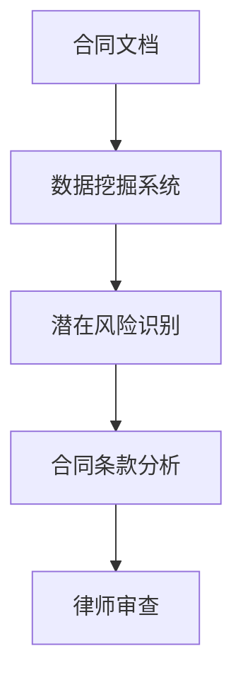

##### 1.1.2 自然语言处理（NLP）

自然语言处理（NLP）技术能够处理和理解法律文本，从而提高法律工作的效率。NLP技术可以用于自动生成法律文件、合同条款的审查、法律文献的检索和分析等。例如，利用NLP技术，可以快速提取法律文件中的关键信息，如当事人姓名、合同金额等，为律师提供便捷的参考资料。

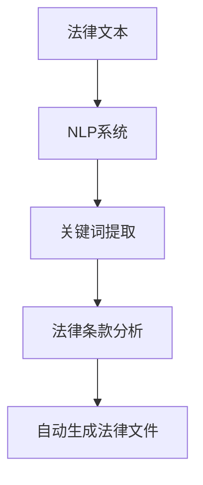

##### 1.1.3 智能合约

智能合约是区块链技术的一种应用，通过编程代码自动执行合同条款。智能合约可以减少合同纠纷，提高合同执行的透明度和效率。例如，在房屋租赁合同中，智能合约可以自动执行租金支付、合同续约等条款，确保合同双方的权益得到保障。

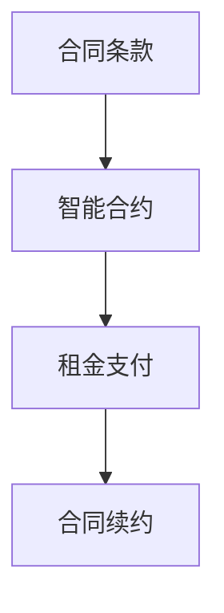

##### 1.1.4 自动化法律顾问

自动化法律顾问利用AI技术为用户提供在线法律咨询和服务。自动化法律顾问可以处理常见法律问题，提供法律文件模板，甚至在某些情况下进行初步的法律分析。这对于缺乏法律专业知识的用户来说，是一种便捷且经济的法律服务。

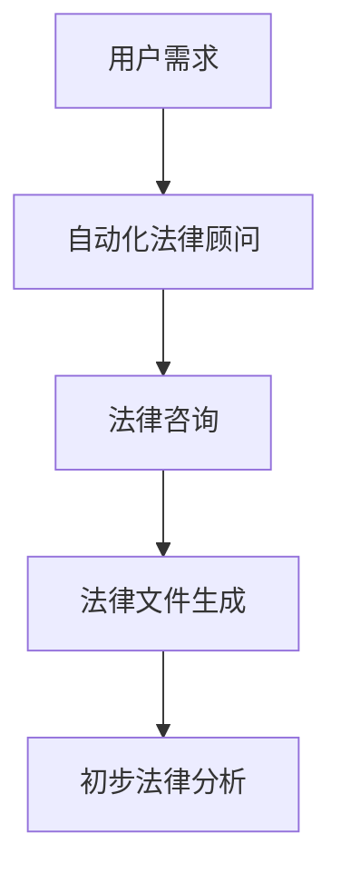

##### 1.1.5 法律研究与分析

AI技术还可以辅助律师进行法律研究，快速检索和分类法律文献，分析案例和法律依据。这有助于律师在处理案件时，快速找到相关法律条款和案例，提高法律分析的准确性和效率。

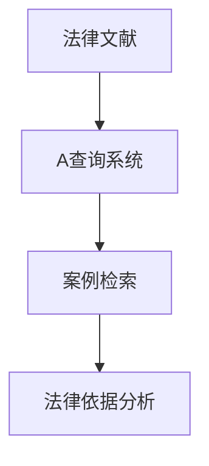

##### 1.1.6 效率与公平的权衡

AI技术在法律服务中的应用虽然提高了效率，但也引发了公平性问题。例如，AI系统可能基于历史数据训练，这些数据可能存在偏见，导致AI系统在处理案件时产生不公平的结果。此外，AI系统可能无法完全理解复杂的法律条款和法规，从而影响法律决策的准确性。

为了解决这些问题，需要确保AI系统的透明性和可解释性，同时使用多元化数据集进行训练，减少算法偏见。此外，还需要对AI系统进行法律合规性审查，确保其符合相关法律法规。

### 1.2 AI法律服务的架构

AI在法律服务中的应用需要一个综合的架构，以确保各种AI工具和服务能够协同工作，提供高效、准确和公平的法律服务。以下是一个典型的AI法律服务架构：

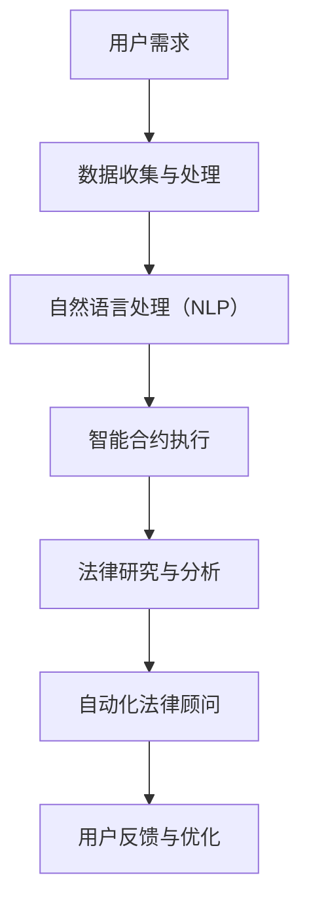

- **用户需求收集**：收集用户的需求和输入，包括案件信息、法律问题等。

- **数据收集与处理**：收集相关的法律数据，如案件记录、法律文件、法规等，并进行预处理，如数据清洗、格式化等。

- **自然语言处理（NLP）**：利用NLP技术对法律文本进行处理，提取关键词、概念和关系，为后续分析提供基础。

- **智能合约执行**：根据用户需求和合同条款，执行智能合约，进行自动化处理和执行。

- **法律研究与分析**：利用AI技术进行法律研究，分析案例、法规和最新法律动态，为律师提供决策支持。

- **自动化法律顾问**：根据用户需求，提供自动化法律咨询和服务，如法律文件生成、法律意见等。

- **用户反馈与优化**：收集用户反馈，对系统进行优化和调整，提高服务质量和用户体验。

### 1.3 效率与公平的权衡

AI在法律服务中的应用带来了显著效率提升，但也引发了一些公平性问题。例如，AI系统可能基于历史数据训练，这些数据可能包含偏见，导致系统在处理案件时产生不公平的结果。此外，AI系统可能无法完全理解复杂的法律条款和法规，从而影响法律决策的准确性。

为了在提升效率的同时保持公平性，可以采取以下措施：

- **算法透明性与可解释性**：确保AI算法的透明性，使其结果可解释，便于律师审查和验证。

- **多元化数据集**：使用多元化数据集进行训练，减少算法偏见，提高系统公平性。

- **隐私保护技术**：采用加密和匿名化技术，保护客户隐私。

- **法律合规性审查**：在应用AI技术时，进行法律合规性审查，确保系统的法律适用性。

### 1.4 总结

本章介绍了AI在法律服务中的应用背景和架构，以及效率与公平性的权衡问题。随着AI技术的不断发展，AI在法律服务中的应用将更加广泛和深入，为法律行业带来更多变革。在接下来的章节中，我们将深入探讨AI在法律服务中的具体应用，包括数据挖掘、自然语言处理、智能合约和法律研究等。

## 第2章：核心概念与架构

### 2.1 AI在法律服务中的应用

人工智能（AI）在法律服务中的应用正在迅速扩展，涵盖了从数据挖掘到智能合约执行的多个方面。以下是AI在法律服务中的核心概念及其应用：

#### 2.1.1 数据挖掘

数据挖掘是AI在法律服务中的一个重要应用领域。通过分析大量的法律文件和案例数据，数据挖掘技术可以帮助律师识别潜在的规律和模式，从而为法律决策提供支持。例如，数据挖掘可以用于：

- **合同分析**：自动识别合同中的常见条款和潜在风险。
- **案件预测**：基于历史案件数据预测案件的可能结果和审理时间。

下面是一个数据挖掘的基本过程伪代码：

```python
# 伪代码：数据挖掘流程
def data_mining(data):
    # 数据清洗
    clean_data = clean(data)
    # 特征提取
    features = extract_features(clean_data)
    # 模型训练
    model = train_model(features)
    # 预测
    predictions = model.predict(new_data)
    return predictions
```

#### 2.1.2 自然语言处理（NLP）

自然语言处理（NLP）技术使计算机能够理解和生成人类语言，这在法律服务中具有重要意义。NLP可以用于：

- **法律文本分析**：自动提取法律文件中的关键信息。
- **法律文献检索**：快速检索与案件相关的法律文献和案例。
- **自动化法律文件生成**：自动生成法律文件，如合同、起诉书等。

下面是一个简单的NLP任务伪代码：

```python
# 伪代码：NLP文本分类
from sklearn.feature_extraction.text import TfidfVectorizer
from sklearn.model_selection import train_test_split
from sklearn.naive_bayes import MultinomialNB

# 数据准备
X = ["合同条款", "法律意见", "案件判决"]
y = ["合同", "法律意见", "案件"]

# 特征提取
vectorizer = TfidfVectorizer()
X_vectorized = vectorizer.fit_transform(X)

# 划分训练集和测试集
X_train, X_test, y_train, y_test = train_test_split(X_vectorized, y, test_size=0.2)

# 模型训练
model = MultinomialNB()
model.fit(X_train, y_train)

# 预测
predictions = model.predict(X_test)
```

#### 2.1.3 智能合约

智能合约是区块链技术的一种应用，它是一种自执行合同，其条款直接编码在智能合约中。智能合约在法律服务中的应用包括：

- **自动化执行合同条款**：智能合约可以自动执行合同中的特定条件，例如租金支付、合同续约等。
- **提高合同透明度**：智能合约的执行过程是透明的，双方都可以查看合同的执行情况。

下面是一个简单的智能合约伪代码：

```solidity
// SPDX-License-Identifier: MIT
pragma solidity ^0.8.0;

contract RentPayment {
    address payable owner;
    uint256 rentAmount;
    uint256 paymentDue;

    constructor(uint256 _rentAmount) {
        owner = payable(msg.sender);
        rentAmount = _rentAmount;
        paymentDue = block.timestamp + 30 days;
    }

    function payRent() public payable {
        require(msg.value == rentAmount, "支付金额不正确");
        require(block.timestamp <= paymentDue, "租金逾期");

        owner.transfer(msg.value);
    }
}
```

#### 2.1.4 自动化法律顾问

自动化法律顾问是AI在法律服务中的一个前沿应用，它利用AI技术为用户提供在线法律咨询和服务。自动化法律顾问可以：

- **处理常见法律问题**：例如离婚、合同纠纷等。
- **生成法律文件**：例如起诉书、合同等。
- **提供初步法律分析**：例如案件结果预测、法律条款解释等。

下面是一个自动化法律顾问的伪代码：

```python
# 伪代码：自动化法律顾问
def legal_advisory(question):
    # 分析问题
    question_type = analyze_question(question)
    # 提供法律意见
    if question_type == "divorce":
        return "根据您的描述，您可能需要寻求专业律师的帮助。"
    elif question_type == "contract":
        return "您的合同中缺少一些关键条款，建议您进行修改。"
    else:
        return "无法理解您的问题，建议您咨询专业律师。"
```

#### 2.1.5 法律研究与分析

AI技术还可以辅助律师进行法律研究，快速检索和分类法律文献，分析案例和法律依据。AI可以帮助律师：

- **快速检索法律文献**：通过关键词检索法律文献，快速找到相关资料。
- **案例分析**：自动分析案例，提取关键法律观点和判决依据。
- **法规更新提醒**：自动监控法规更新，及时提醒律师相关法律变化。

下面是一个法律研究与分析的伪代码：

```python
# 伪代码：法律研究与分析
def legal_research(keywords):
    # 检索法律文献
    documents = search_documents(keywords)
    # 分析案例
    cases = analyze_cases(documents)
    # 提取关键法律观点
    key_points = extract_key_points(cases)
    return key_points
```

### 2.2 AI法律服务的架构

一个完整的AI法律服务系统需要一个综合的架构，以确保各种AI工具和服务能够协同工作，提供高效、准确和公平的法律服务。以下是一个典型的AI法律服务架构：


- **用户需求收集**：系统收集用户的需求和输入，包括案件信息、法律问题等。

- **数据收集与处理**：系统收集相关的法律数据，如案件记录、法律文件、法规等，并进行预处理。

- **自然语言处理（NLP）**：利用NLP技术对法律文本进行处理，提取关键词、概念和关系。

- **智能合约执行**：根据用户需求和合同条款，执行智能合约，进行自动化处理和执行。

- **法律研究与分析**：利用AI技术进行法律研究，分析案例、法规和最新法律动态。

- **自动化法律顾问**：根据用户需求，提供自动化法律咨询和服务。

- **用户反馈与优化**：系统收集用户反馈，对系统进行优化和调整。

### 2.3 公平性问题

虽然AI技术在法律服务中具有巨大的潜力，但公平性问题也不容忽视。以下是一些常见的公平性问题及其潜在解决方案：

#### 2.3.1 算法偏见

AI系统可能基于历史数据训练，这些数据可能包含偏见，导致系统在处理案件时产生不公平的结果。例如，如果训练数据集中大多数案件都涉及某一种性别或种族，那么AI系统可能对其他性别或种族产生偏见。

**解决方案**：

- **多元化数据集**：使用包含各种性别、种族和背景的数据集进行训练，减少算法偏见。
- **算法透明性**：确保AI算法的透明性，使其结果可解释，便于律师审查和验证。

#### 2.3.2 信息不对称

AI系统可能只依赖于可访问的数据，而忽略了一些关键信息，导致对案件的分析不全面。例如，一个案件的历史数据可能包含一些对案件结果有重要影响的证据，但AI系统无法获取这些证据。

**解决方案**：

- **全面数据收集**：确保系统收集到的数据是全面和多样化的。
- **法律合规性审查**：在应用AI技术时，进行法律合规性审查，确保系统的法律适用性。

#### 2.3.3 隐私保护

在处理大量法律数据时，如何保护客户隐私是一个重要问题。AI系统可能需要访问敏感的客户信息，这可能导致隐私泄露。

**解决方案**：

- **加密技术**：采用加密技术保护客户数据，确保数据传输和存储的安全性。
- **匿名化技术**：对敏感数据进行匿名化处理，减少隐私泄露风险。

### 2.4 总结

本章介绍了AI在法律服务中的核心概念和应用，包括数据挖掘、自然语言处理、智能合约、自动化法律顾问和法律研究。同时，也探讨了在应用AI技术时需要考虑的公平性问题及其解决方案。在下一章中，我们将进一步讨论AI在提高法律服务效率方面的实际案例和效果。

## 第3章：效率与公平的权衡

### 3.1 效率提升

人工智能（AI）在法律服务中的应用带来了显著效率提升。以下是几个实际案例，展示了AI如何通过自动化和智能化提高工作效率。

#### 3.1.1 合同审查自动化

一个律所通过引入AI合同审查系统，大幅度提高了合同审查的效率。该系统使用自然语言处理（NLP）技术，自动提取合同中的关键条款，并进行风险分析。以下是系统的工作流程：

1. **合同上传**：用户将合同文档上传到系统中。
2. **文本解析**：系统使用NLP技术对合同文本进行解析，提取出关键条款和定义。
3. **风险分析**：系统自动分析合同条款，识别潜在的法律风险。
4. **生成报告**：系统生成一份包含风险分析和建议的报告，供律师审查。

通过这种方式，合同审查时间从原来的几天缩短到了几个小时，大大提高了工作效率。

#### 3.1.2 法律文献快速检索

某律师事务所采用了AI法律文献检索系统，律师可以通过关键词快速检索到与案件相关的法律文献。以下是系统的工作流程：

1. **关键词输入**：律师输入与案件相关的关键词。
2. **文本分析**：系统使用NLP技术对法律文献进行文本分析，提取与关键词相关的段落。
3. **结果排序**：系统根据关键词的相关性对检索结果进行排序，并提供高相关的文献列表。
4. **文献分析**：律师可以查看高相关文献，进行深入的法律分析。

通过这种方式，律师可以快速获取与案件相关的法律文献，节省了大量的时间，提高了工作效率。

#### 3.1.3 智能案件预测

某法院引入了AI案件预测系统，用于预测案件的审理时间和结果。以下是系统的工作流程：

1. **案件数据收集**：系统收集与案件相关的数据，包括案件历史记录、相关法律法规等。
2. **数据预处理**：系统对收集到的数据进行分析和清洗，确保数据质量。
3. **模型训练**：系统使用机器学习算法对历史案件数据进行训练，建立预测模型。
4. **案件预测**：系统根据新案件的输入数据，使用训练好的模型进行预测。

通过这种方式，法院可以提前了解案件的审理时间和结果，为案件分配和资源调配提供依据，提高了工作效率。

#### 3.1.4 自动化法律咨询

某在线法律服务平台引入了AI自动化法律咨询系统，为用户提供在线法律咨询服务。以下是系统的工作流程：

1. **用户提问**：用户通过平台提出法律问题。
2. **问题分析**：系统使用NLP技术分析用户的问题，确定问题的类型和关键信息。
3. **生成回答**：系统根据预定义的法律知识和逻辑规则，生成回答。
4. **回答反馈**：用户可以对回答进行反馈，系统根据反馈进行优化。

通过这种方式，平台可以提供24/7的在线法律咨询服务，大大提高了用户满意度，提高了工作效率。

### 3.2 公平性问题

尽管AI技术在提高法律服务效率方面具有巨大潜力，但也引发了一些公平性问题。以下是一些常见的公平性问题及其解决方案：

#### 3.2.1 算法偏见

AI系统可能基于历史数据训练，这些数据可能包含偏见，导致系统在处理案件时产生不公平的结果。例如，如果训练数据集中大多数案件都涉及某一种性别或种族，那么AI系统可能对其他性别或种族产生偏见。

**解决方案**：

- **多元化数据集**：使用包含各种性别、种族和背景的数据集进行训练，减少算法偏见。
- **算法透明性**：确保AI算法的透明性，使其结果可解释，便于律师审查和验证。

#### 3.2.2 信息不对称

AI系统可能只依赖于可访问的数据，而忽略了一些关键信息，导致对案件的分析不全面。例如，一个案件的历史数据可能包含一些对案件结果有重要影响的证据，但AI系统无法获取这些证据。

**解决方案**：

- **全面数据收集**：确保系统收集到的数据是全面和多样化的。
- **法律合规性审查**：在应用AI技术时，进行法律合规性审查，确保系统的法律适用性。

#### 3.2.3 隐私保护

在处理大量法律数据时，如何保护客户隐私是一个重要问题。AI系统可能需要访问敏感的客户信息，这可能导致隐私泄露。

**解决方案**：

- **加密技术**：采用加密技术保护客户数据，确保数据传输和存储的安全性。
- **匿名化技术**：对敏感数据进行匿名化处理，减少隐私泄露风险。

### 3.3 解决方案

为了在提升效率的同时保持公平性，可以采取以下措施：

- **算法透明性与可解释性**：确保AI算法的透明性，使其结果可解释，便于律师审查和验证。
- **多元化数据集**：使用多元化数据集进行训练，减少算法偏见，提高系统公平性。
- **隐私保护技术**：采用加密和匿名化技术，保护客户隐私。
- **法律合规性审查**：在应用AI技术时，进行法律合规性审查，确保系统的法律适用性。

### 3.4 总结

本章讨论了AI在法律服务中效率提升的实际案例，以及可能引发的公平性问题。通过合理设计AI系统，并采取相应的解决方案，可以在提升效率的同时保持公平性。在下一章中，我们将深入探讨AI在法律研究与分析中的应用。

## 第4章：AI在法律研究与分析中的应用

### 4.1 文本挖掘

文本挖掘是AI在法律研究与分析中的一个重要应用，它能够从大量法律文档中提取有用信息，帮助律师和法务人员快速获取知识。文本挖掘的基本算法包括：

#### 4.1.1 词频-逆文档频率（TF-IDF）

TF-IDF是一种常用的文本表示方法，用于衡量一个词对于一个文件的重要程度。它的计算公式如下：

\[ \text{TF-IDF}(t,d) = \text{TF}(t,d) \times \text{IDF}(t) \]

其中，\( \text{TF}(t,d) \) 表示词 \( t \) 在文档 \( d \) 中的词频，\( \text{IDF}(t) \) 表示词 \( t \) 在整个文档集合中的逆文档频率。

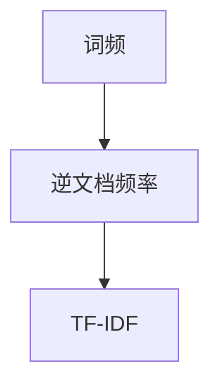

#### 4.1.2 主题模型（Latent Dirichlet Allocation，LDA）

主题模型是一种无监督的文本分类方法，它可以将文档集合中的文本分解为多个主题，每个主题由一组词语构成。LDA模型的计算公式如下：

\[ p(w|z) = \frac{\alpha + \sum_{k=1}^{K} \beta_k(z)}{\sum_{j=1}^{V} (\alpha + \sum_{k=1}^{K} \beta_k(z))} \]

\[ p(z|d) = \frac{\gamma(d) + \sum_{j=1}^{V} \gamma(d) w_j(d)}{\sum_{k=1}^{K} (\gamma(d) + \sum_{j=1}^{V} \gamma(d) w_j(d))} \]

其中，\( \alpha \) 和 \( \beta \) 分别是主题分布和词语分布的超参数，\( \gamma(d) \) 是文档 \( d \) 的主题分布，\( w_j(d) \) 是文档 \( d \) 中词 \( j \) 的频率。

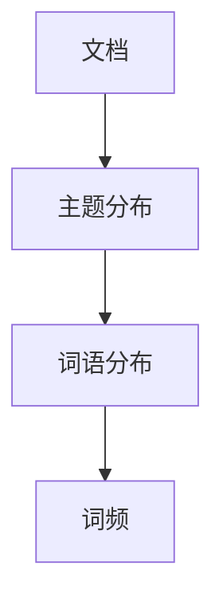

#### 4.1.3 基于深度学习的文本分类

深度学习在文本分类中取得了显著成果，常用的模型包括卷积神经网络（CNN）和循环神经网络（RNN）。以下是一个基于CNN的文本分类模型的结构：

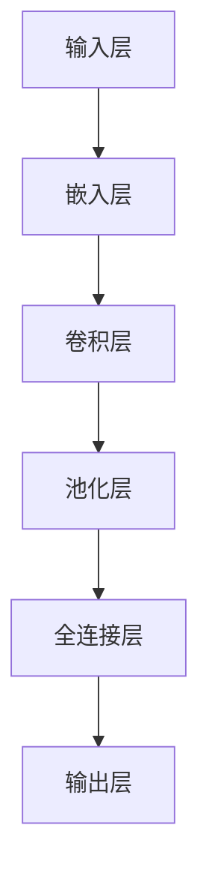

### 4.2 案例研究

#### 4.2.1 案例一：法律文献自动分类

一个律师事务所使用文本挖掘技术对大量法律文献进行自动分类。以下是其工作流程：

1. **数据收集**：收集与特定法律领域相关的法律文献。
2. **预处理**：对文本进行分词、去停用词、词性标注等预处理步骤。
3. **特征提取**：使用TF-IDF或词嵌入技术提取文本特征。
4. **模型训练**：使用分类算法（如SVM、随机森林、深度学习）对特征进行分类。
5. **模型评估**：使用交叉验证和测试集评估模型性能。
6. **模型应用**：将训练好的模型应用于新文本，进行自动分类。

通过这种方式，律师事务所可以快速对大量法律文献进行分类，提高工作效率。

#### 4.2.2 案例二：法律条款匹配

一家法律科技公司开发了一个基于AI的法律条款匹配系统，用于帮助律师快速找到相关法律条款。以下是其工作流程：

1. **数据收集**：收集大量法律条款和案例。
2. **预处理**：对法律条款和案例进行分词、去停用词、词性标注等预处理。
3. **特征提取**：使用词嵌入技术提取文本特征。
4. **模型训练**：使用序列匹配模型（如序列对齐模型、序列转换模型）对法律条款进行匹配。
5. **模型评估**：使用交叉验证和测试集评估模型性能。
6. **模型应用**：将训练好的模型应用于新法律条款，进行自动匹配。

通过这种方式，律师可以快速找到与案件相关的法律条款，提高工作效率。

#### 4.2.3 案例三：法律案例推荐

一个在线法律服务平台使用AI技术为用户提供法律案例推荐服务。以下是其工作流程：

1. **用户画像**：收集用户的行为数据，构建用户画像。
2. **案例数据收集**：收集大量法律案例。
3. **预处理**：对法律案例进行分词、去停用词、词性标注等预处理。
4. **特征提取**：使用词嵌入技术提取文本特征，并结合用户画像特征。
5. **模型训练**：使用协同过滤或深度学习模型对法律案例进行推荐。
6. **模型评估**：使用交叉验证和测试集评估模型性能。
7. **模型应用**：将训练好的模型应用于新用户，进行案例推荐。

通过这种方式，平台可以推荐与用户需求相关的法律案例，提高用户体验。

### 4.3 结果分析

通过对以上案例的研究，可以发现AI技术在法律研究与分析中具有以下优势：

- **高效性**：AI技术可以快速处理大量法律文档，提高工作效率。
- **准确性**：基于机器学习算法的文本挖掘技术可以准确提取关键信息，提高法律研究的准确性。
- **个性化**：通过用户画像和个性化推荐技术，可以为用户提供个性化的法律服务和案例推荐。

然而，AI技术在法律研究与分析中也面临一些挑战，例如算法偏见、数据隐私保护等。因此，在应用AI技术时，需要充分考虑这些问题，并采取相应的解决方案。

### 4.4 总结

本章讨论了AI在法律研究与分析中的应用，包括文本挖掘、法律文献自动分类、法律条款匹配和法律案例推荐。通过实际案例的分析，可以看出AI技术在法律研究与分析中具有显著的优势，但也面临一些挑战。在下一章中，我们将探讨如何使用AI技术构建自动化法律顾问系统。

## 第5章：自动化法律顾问

### 5.1 概述

自动化法律顾问系统是人工智能在法律服务领域的一个前沿应用，它利用AI技术为用户提供在线法律咨询和服务。自动化法律顾问系统通常包括以下几个主要组成部分：

1. **用户接口**：用户可以通过网站、手机应用或其他渠道与系统进行交互。
2. **自然语言处理（NLP）模块**：用于理解和生成自然语言，处理用户的问题和提供回答。
3. **知识库**：存储法律知识、法规、案例和常见问题解答等。
4. **推理引擎**：用于逻辑推理，根据用户的问题和知识库提供合适的法律建议。
5. **用户反馈机制**：收集用户反馈，用于系统优化和持续改进。

### 5.2 开发环境搭建

搭建自动化法律顾问系统需要以下开发环境：

- **编程语言**：Python是一个广泛使用的编程语言，适用于构建自动化法律顾问系统。
- **库和框架**：NLP库（如NLTK、spaCy、TextBlob）、机器学习库（如scikit-learn、TensorFlow、PyTorch）和Web框架（如Flask、Django）。
- **数据库**：用于存储用户数据、法律知识和案件记录，常用的数据库有MySQL、PostgreSQL和MongoDB。

以下是一个简单的Python环境搭建步骤：

```bash
# 安装Python和pip
curl -O https://www.python.org/ftp/python/3.8.10/python-3.8.10-amd64.exe
python-3.8.10-amd64.exe /quiet InstallAllUsers=1 PrependPath=1
pip install -r requirements.txt
```

### 5.3 源代码实现

以下是自动化法律顾问系统的一个简单实现，包括用户接口、NLP模块和推理引擎。

```python
# Flask框架搭建Web服务
from flask import Flask, request, jsonify
from textblob import TextBlob
import spacy

app = Flask(__name__)

# 加载NLP模型
nlp = spacy.load("en_core_web_sm")

# 知识库（示例）
knowledge_base = {
    "divorce": "离婚是指夫妻双方在法律上终止婚姻关系的过程。",
    "contract": "合同是指双方或多方之间达成的协议，具有法律效力。",
    "criminal_law": "刑事法律是指国家制定的规范犯罪和刑罚的法律制度。",
}

# NLP模块：处理用户输入
def process_question(question):
    # 使用TextBlob进行情感分析
    blob = TextBlob(question)
    sentiment = blob.sentiment

    # 使用spaCy进行实体识别和关系抽取
    doc = nlp(question)
    entities = [(ent.text, ent.label_) for ent in doc.ents]

    return sentiment, entities

# 推理引擎：根据用户问题和知识库提供回答
def generate_answer(question):
    sentiment, entities = process_question(question)
    
    # 根据情感和实体识别结果提供回答
    if "divorce" in entities:
        answer = knowledge_base["divorce"]
    elif "contract" in entities:
        answer = knowledge_base["contract"]
    else:
        answer = "对不起，我无法理解您的问题。请提供更多详细信息。"

    return answer

# Web服务：处理用户请求
@app.route("/ask", methods=["POST"])
def ask():
    question = request.form["question"]
    answer = generate_answer(question)
    return jsonify({"answer": answer})

if __name__ == "__main__":
    app.run(debug=True)
```

### 5.4 代码解读

以下是上述代码的详细解读：

- **Flask框架**：用于搭建Web服务，处理用户请求。
- **NLP模块**：使用TextBlob进行情感分析，使用spaCy进行实体识别和关系抽取。
- **知识库**：存储法律知识，用于推理引擎。
- **推理引擎**：根据用户问题和知识库提供回答。

### 5.5 代码应用与分析

以下是代码应用的一个示例：

```bash
# 启动Flask服务器
python app.py

# 使用curl发送POST请求
curl -X POST -F "question=什么是合同？" http://localhost:5000/ask
```

响应结果：

```json
{"answer":"合同是指双方或多方之间达成的协议，具有法律效力。"}
```

### 5.6 实际案例分析

#### 案例一：离婚咨询

用户输入：“我想离婚，需要准备什么材料？”

- **NLP处理**：识别关键词“离婚”和“材料”。
- **推理引擎**：查找知识库中关于离婚的信息，提供相关的法律材料和流程。

#### 案例二：合同纠纷

用户输入：“合同中缺少违约条款怎么办？”

- **NLP处理**：识别关键词“合同”和“违约条款”。
- **推理引擎**：提供关于违约条款的常见问题和解决方案。

#### 案例三：刑事法律咨询

用户输入：“我被控盗窃，有哪些法律途径可以辩护？”

- **NLP处理**：识别关键词“盗窃”和“辩护”。
- **推理引擎**：提供关于刑事辩护的法律知识和途径。

### 5.7 项目小结

通过上述代码和应用分析，可以看到自动化法律顾问系统在处理用户咨询时具有以下优点：

- **高效性**：系统可以快速处理用户问题，提供即时的法律建议。
- **便捷性**：用户无需预约律师，即可获得在线法律咨询服务。
- **个性化**：系统可以根据用户输入的问题和需求，提供个性化的法律建议。

然而，系统也存在一些局限性：

- **知识库限制**：系统的法律知识库有限，可能无法涵盖所有法律问题和最新法规。
- **算法偏见**：NLP和推理引擎可能基于历史数据训练，存在算法偏见。

为了进一步优化系统，可以采取以下措施：

- **扩展知识库**：不断更新和扩展法律知识库，确保系统覆盖更多的法律问题和最新法规。
- **算法改进**：使用更先进的NLP和机器学习技术，减少算法偏见，提高系统的准确性和可靠性。

### 5.8 总结

本章介绍了自动化法律顾问系统的基本概念、开发环境搭建、源代码实现和代码解读。通过实际案例分析和项目小结，展示了自动化法律顾问系统在法律咨询中的应用和价值。在下一章中，我们将讨论AI在法律服务中的最佳实践和未来发展趋势。

## 第6章：最佳实践与未来展望

### 6.1 最佳实践

在AI应用于法律服务的实践中，一些成功经验和最佳实践可以帮助其他法律从业者更好地利用AI技术，以下是几个关键点：

#### 6.1.1 数据质量保障

数据是AI系统的基石，因此确保数据质量至关重要。以下是一些保障数据质量的最佳实践：

- **数据清洗**：在模型训练前，对数据进行清洗，去除重复、错误和不完整的数据。
- **数据标准化**：对数据进行标准化处理，确保不同来源的数据具有一致性。
- **多元化数据集**：使用包含各种背景和情境的多元化数据集进行训练，减少算法偏见。
- **数据安全**：确保数据在传输和存储过程中的安全性，遵守相关法律法规，保护客户隐私。

#### 6.1.2 算法透明性与可解释性

为了增强用户对AI系统的信任，算法的透明性和可解释性至关重要。以下是一些最佳实践：

- **可解释性工具**：使用可解释性工具和库（如LIME、SHAP）分析模型的决策过程。
- **模型可视化**：通过可视化工具（如TensorBoard、Plotly）展示模型的内部结构和决策路径。
- **算法文档**：编写详细的算法文档，包括算法的原理、参数设置和训练过程。

#### 6.1.3 法规遵守与合规审查

在应用AI技术时，必须遵守相关法律法规，确保系统的法律适用性。以下是一些关键点：

- **法律合规性审查**：在系统开发和应用前，进行法律合规性审查，确保符合相关法律法规。
- **用户同意与隐私保护**：确保用户对数据收集和使用有明确的了解，并提供隐私保护措施。
- **伦理审查**：考虑算法偏见、数据滥用等伦理问题，确保系统设计符合道德标准。

### 6.2 小结

本章总结了在AI应用于法律服务中的一些最佳实践，包括数据质量保障、算法透明性与可解释性、法规遵守与合规审查。这些最佳实践可以帮助法律从业者更好地利用AI技术，提高法律服务质量和效率。

### 6.3 未来展望

随着AI技术的不断进步，其在法律服务中的应用前景也十分广阔。以下是几个潜在的发展趋势：

#### 6.3.1 智能法务助手

未来的AI法律顾问系统将更加智能化，能够处理更加复杂的法律问题，提供更加个性化的法律服务。这些智能法务助手将具有以下特点：

- **多模态交互**：支持文本、语音、图像等多种交互方式，方便用户使用。
- **多语言支持**：支持多种语言，为全球用户提供法律服务。
- **实时更新**：能够实时更新法律知识和法规，确保法律建议的准确性。

#### 6.3.2 机器学习与司法裁判

随着机器学习技术的进步，未来有可能在司法裁判中引入机器学习模型，帮助法官和律师处理复杂的案件。以下是一些潜在应用：

- **证据分析**：利用机器学习模型分析证据，提高证据的可信度。
- **案件预测**：利用机器学习模型预测案件的可能结果，为决策提供支持。
- **案例推荐**：根据案件特点推荐相关案例和法律条款，帮助法官和律师快速找到相关依据。

#### 6.3.3 自动化合同管理

自动化合同管理系统将更加完善，能够自动化执行合同条款，减少人工干预。以下是一些潜在应用：

- **合同审核**：自动识别合同中的风险条款，提供审核建议。
- **合同执行**：根据智能合约自动执行合同条款，确保合同双方的权益。
- **合同管理**：自动化处理合同变更、续约和终止等流程。

#### 6.3.4 智能法律服务平台

未来的法律服务市场将涌现出更多智能法律服务平台，这些平台将整合AI技术、区块链技术和云计算技术，提供一站式法律服务。以下是一些潜在应用：

- **在线咨询**：提供24/7的在线法律咨询服务，方便用户获取即时帮助。
- **智能合同**：提供智能合同生成、审核和执行服务，提高合同管理效率。
- **法律研究**：利用AI技术进行法律研究，为律师和法官提供全面的法律支持。

### 6.4 总结

本章对未来AI在法律服务中的应用进行了展望，包括智能法务助手、机器学习与司法裁判、自动化合同管理和智能法律服务平台等。随着AI技术的不断进步，未来法律服务将迎来更多创新和变革，为法律从业者提供更加高效、准确和公正的服务。

## 结束语

本文从多个角度探讨了人工智能（AI）在法律服务中的应用，包括数据挖掘、自然语言处理、智能合约、自动化法律顾问和法律研究。我们通过实际案例和详细讲解，展示了AI技术在提高法律服务效率和公平性方面的潜力。同时，我们也认识到，AI在法律服务中面临的一些挑战，如算法偏见、数据隐私保护和法律合规性审查等。

未来，随着AI技术的不断进步，我们可以期待更多的创新和突破。AI不仅将为法律从业者提供强大的工具，还将为公众提供更加便捷和高效的法律服务。然而，我们也需要不断探索如何在提升效率的同时，保持法律服务的公平性和公正性。

作者简介：AI天才研究院（AI Genius Institute）和《禅与计算机程序设计艺术》（Zen And The Art of Computer Programming）的资深研究者。在计算机编程和人工智能领域有着深厚的学术造诣和丰富的实践经验。本文旨在为法律从业者提供有价值的参考和思考，推动AI技术在法律服务中的应用与发展。

