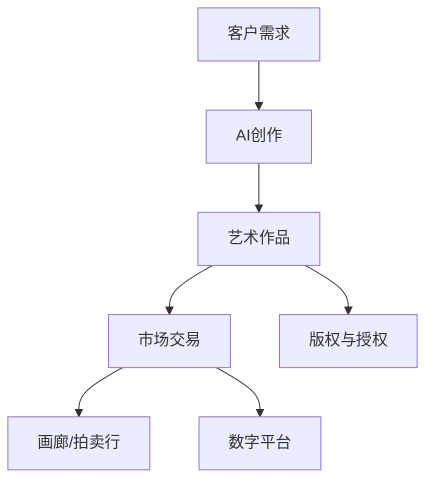

                 

## 引言

### 1.1 AI在艺术创作中的历史与发展

自20世纪中叶以来，人工智能（AI）逐渐渗透到各个领域，从医疗到金融，从制造到交通。在艺术领域，AI同样带来了前所未有的变革。AI在艺术创作中的应用，最早可以追溯到20世纪50年代。当时，计算机科学家们开始探索如何使用算法生成艺术作品。早期的尝试主要集中在生成简单的图形和音乐，但这些早期的尝试为AI在艺术创作中的未来奠定了基础。

随着技术的进步，尤其是深度学习的发展，AI在艺术创作中的应用变得更加广泛和深入。深度学习，特别是生成对抗网络（GAN）和变分自编码器（VAE），已经成为生成艺术作品的重要工具。这些算法能够从大量的数据中学习，生成逼真的图像、音乐和文学作品。例如，GAN可以通过训练，生成与人类艺术家作品相似的艺术品，而VAE则可以生成新的、独特的艺术风格。

### 1.2 艺术创作的本质与AI的介入

艺术创作本质上是一种创造性活动，它涉及到对形式、色彩、纹理和情感的探索。艺术作品不仅仅是视觉上的呈现，更是一种情感的传达和思想的表达。传统上，艺术家通过自身的经验和直觉进行创作，而AI介入后，这一过程发生了变化。AI能够处理大量的数据，快速生成多种可能性，从而为艺术家提供了更多的创意源泉。

AI在艺术创作中的介入方式多种多样。首先，AI可以作为一种工具，帮助艺术家完成特定的任务，如图像编辑、音乐创作或文本生成。例如，AI可以分析大量的图像数据，生成新的图像风格，艺术家则可以根据这些风格进行创作。其次，AI可以作为艺术创作的合作伙伴，与人类艺术家共同创作。这种合作形式使得AI能够发挥其计算能力和大数据处理优势，而人类艺术家则提供创意和艺术直觉。

然而，AI介入艺术创作也带来了一系列挑战和问题。例如，AI生成作品的原创性如何界定？AI是否能够超越人类艺术家的创造力？这些问题涉及到艺术创作的本质和AI的技术能力，需要深入探讨。

### 1.3 本书的研究目标与方法

本书旨在探讨AI在艺术创作中的角色，分析AI作为助手和竞争者的双重角色，并探讨其背后的技术原理和伦理问题。具体研究目标如下：

1. **技术原理分析**：介绍AI在艺术创作中的关键技术，如深度学习、GAN和VAE，并探讨这些技术在艺术创作中的应用。
2. **角色定位探讨**：分析AI在艺术创作中作为助手和竞争者的不同角色，探讨其带来的影响和挑战。
3. **伦理问题探讨**：讨论AI在艺术创作中的伦理问题，如原创性、版权和道德考量。

为了实现这些目标，本书将采用以下研究方法：

1. **文献综述**：通过分析现有的研究成果，了解AI在艺术创作中的应用和现状。
2. **案例研究**：通过具体的案例研究，深入探讨AI在艺术创作中的实际应用和影响。
3. **理论分析**：结合技术原理和伦理问题，进行深入的理论分析，探讨AI在艺术创作中的角色和影响。

本文的余下部分将依次讨论AI在艺术创作中的具体应用、AI与人类艺术家的合作、AI艺术创作的商业价值、挑战与伦理问题，以及未来展望。通过逐步分析推理，我们将更深入地了解AI在艺术创作中的角色和影响。

## 第二部分：AI在艺术创作中的应用

### 2.1 AI艺术创作的工具与技术

AI在艺术创作中的应用离不开一系列强大的工具和技术。这些工具和技术不仅为艺术家提供了新的创作手段，也拓展了艺术创作的边界。在本节中，我们将探讨当前主流的AI技术在艺术创作中的应用，重点介绍深度学习在图像生成与风格迁移中的应用，以及自然语言处理在文学创作与翻译中的应用。

#### 2.1.1 主流AI技术在艺术创作中的应用

深度学习是当前AI技术中最具影响力的领域之一。在艺术创作中，深度学习技术被广泛应用于图像生成、风格迁移、音乐生成和文本生成等多个方面。以下是一些典型的应用实例：

1. **图像生成**：生成对抗网络（GAN）是一种强大的图像生成工具。GAN由生成器和判别器组成，生成器生成假图像，判别器判断图像是真实还是生成的。通过不断迭代训练，生成器可以生成越来越逼真的图像。例如，深度学习艺术家Obvious使用GAN生成了一系列名为“动物家族”的肖像画，这些画作在艺术市场上取得了巨大成功。

2. **风格迁移**：深度学习技术可以将一种艺术风格应用到另一幅图像上，产生新的艺术效果。例如，2015年的论文《深度风格迁移》提出了一种基于卷积神经网络的风格迁移方法，该方法可以将梵高的画风应用于普通照片，生成具有独特艺术风格的图像。

3. **音乐生成**：深度学习可以生成新的音乐作品，这些作品既有创意又充满个性。例如，Google的Magenta项目使用深度学习生成音乐，这些音乐作品不仅旋律优美，还展现了深刻的情感。

4. **文本生成**：自然语言处理（NLP）技术可以生成各种类型的文本，包括诗歌、故事和新闻报道。OpenAI的GPT-3是一个典型的例子，它可以生成高质量的文章、对话和故事。

#### 2.1.2 深度学习在图像生成与风格迁移中的应用

在图像生成方面，生成对抗网络（GAN）是当前最流行的技术。GAN由生成器和判别器组成。生成器的任务是生成假图像，而判别器的任务是区分真实图像和生成的假图像。在训练过程中，生成器和判别器相互竞争，生成器试图生成越来越逼真的图像，而判别器则努力提高辨别能力。通过这种对抗训练，生成器可以生成高质量的图像。

以下是一个简单的GAN的伪代码示例：

```python
# GAN的伪代码
class Generator(nn.Module):
    def forward(self, x):
        # 生成器生成假图像
        fake_images = ...
        return fake_images

class Discriminator(nn.Module):
    def forward(self, x, real_images=None):
        # 判别器判断真实图像和假图像
        if real_images:
            real_output = self(real_images)
            fake_output = self(fake_images)
            return real_output, fake_output
        else:
            return self(x)

# 训练过程
for epoch in range(num_epochs):
    for x, _ in dataloader:
        # 生成假图像
        z = torch.randn(z_dim, device=device)
        fake_images = generator(z)

        # 判别器训练
        with torch.no_grad():
            real_images = next(iter(dataloader))
            real_output, fake_output = discriminator(real_images, fake_images)

        # 生成器和判别器损失计算
        g_loss = criterion(fake_output, torch.ones.size())
        d_loss = criterion(real_output, torch.ones.size()) - criterion(fake_output, torch.zeros.size())

        # 生成器和判别器优化
        generator_optim.zero_grad()
        g_loss.backward()
        generator_optim.step()

        discriminator_optim.zero_grad()
        d_loss.backward()
        discriminator_optim.step()
```

在风格迁移方面，深度学习技术可以实现将一种艺术风格应用到另一幅图像上。以下是一个风格迁移算法的简化伪代码：

```python
# 风格迁移的伪代码
def style_transfer(content_image, style_image, alpha=1.0, beta=1.0):
    # 内容图像和风格图像的预处理
    content_image = preprocess_image(content_image)
    style_image = preprocess_image(style_image)

    # 定义生成器和判别器
    generator = Generator().to(device)
    discriminator = Discriminator().to(device)

    # 损失函数
    content_loss = ContentLoss().to(device)
    style_loss = StyleLoss().to(device)

    # 训练生成器
    optimizer = torch.optim.Adam(generator.parameters(), lr=learning_rate)

    for epoch in range(num_epochs):
        for x, _ in dataloader:
            z = torch.randn(z_dim, device=device)
            generated_image = generator(z)

            # 计算损失
            content_loss_val = content_loss(generated_image, content_image)
            style_loss_val = style_loss(generated_image, style_image)

            # 总损失
            loss = alpha * content_loss_val + beta * style_loss_val

            # 反向传播和优化
            optimizer.zero_grad()
            loss.backward()
            optimizer.step()

    # 后处理
    generated_image = postprocess_image(generated_image)
    return generated_image
```

#### 2.1.3 自然语言处理在文学创作与翻译中的应用

自然语言处理（NLP）技术也在文学创作和翻译中发挥了重要作用。以下是一些典型的应用实例：

1. **诗歌生成**：NLP技术可以生成高质量的诗歌。例如，谷歌的AI系统使用GPT-2模型生成了一些优美的诗歌，这些诗歌在形式和韵律上与传统诗歌相似。

2. **故事生成**：OpenAI的GPT-3模型可以生成复杂的故事情节，这些故事既有创意又充满细节。

3. **翻译**：深度学习技术在翻译领域取得了显著成果。例如，谷歌翻译使用深度学习模型实现高质量的机器翻译，大大提高了翻译效率和准确性。

以下是一个简单的文本生成算法的伪代码示例：

```python
# 文本生成的伪代码
def generate_text(model, prompt, max_length=100, temperature=1.0):
    # 将输入提示文本编码为模型可以处理的格式
    input_ids = tokenizer.encode(prompt, return_tensors='pt')

    # 生成文本
    output_sequence = model.generate(input_ids, max_length=max_length, temperature=temperature)

    # 解码生成的文本
    generated_text = tokenizer.decode(output_sequence[:, input_ids.shape[-1]:], skip_special_tokens=True)

    return generated_text
```

通过这些工具和技术，AI在艺术创作中的应用变得日益广泛。艺术家们可以利用这些技术扩展自己的创作手段，同时AI也在不断挑战和改变传统艺术创作的模式。在接下来的章节中，我们将进一步探讨AI与人类艺术家的合作、AI艺术创作的商业价值，以及相关的挑战与伦理问题。

## 第二部分：AI在艺术创作中的应用

### 2.2 AI与人类艺术家的合作

随着AI技术的发展，AI不再仅仅是艺术创作的工具，更成为了人类艺术家的合作伙伴。AI与人类艺术家的合作模式多种多样，既有AI辅助艺术家完成特定任务，也有AI与艺术家共同创作艺术作品。这种合作模式不仅丰富了艺术创作的形式，也为艺术家提供了新的创作灵感和技术支持。

#### 2.2.1 AI作为艺术家的助手

AI作为艺术家的助手，主要是通过提供工具和资源，帮助艺术家完成特定的创作任务。以下是一些典型的合作方式：

1. **图像编辑与风格转换**：AI可以自动分析图像的元素，如颜色、纹理和形状，并基于这些元素生成新的图像风格。艺术家可以利用这些风格进行进一步的创作。例如，DeepArt使用深度学习算法，将用户的照片转换成著名艺术家的绘画风格，艺术家则可以基于这些转换后的图像进行二次创作。

2. **音乐创作**：AI可以生成旋律、和声和节奏，艺术家则可以根据这些基础元素创作完整的音乐作品。Google的Magenta项目就是一个例子，该项目使用深度学习技术生成音乐，艺术家可以在此基础上进行改编和创新。

3. **文本生成与编辑**：AI可以生成诗歌、故事和剧本，艺术家则可以对这些生成的内容进行修改和完善。例如，OpenAI的GPT-3可以生成高质量的文章，艺术家则可以根据这些文章的框架和内容进行创作。

#### 2.2.2 人类艺术家与AI的互动模式

人类艺术家与AI的互动模式可以分为三种主要类型：

1. **指令式互动**：在这种模式中，艺术家向AI发出具体的指令，AI则根据指令生成相应的艺术作品。例如，艺术家可以告诉AI使用某种特定的颜色或风格，AI则生成符合这些要求的图像。

2. **探索式互动**：在这种模式中，艺术家与AI共同探索未知的创作空间。艺术家可以提供创意和想法，AI则根据这些输入生成新的、未经验证的艺术作品。这种互动模式鼓励艺术家和AI之间的创新与合作。

3. **协作式互动**：在这种模式中，AI和人类艺术家共同创作一个作品。艺术家负责整体构思和创意，而AI则提供具体的技术支持和实现。这种模式可以充分发挥人类的创造力和AI的计算能力，产生独特的艺术作品。

#### 2.2.3 AI协作艺术创作的案例研究

为了更深入地了解AI与人类艺术家的合作，我们来看几个实际的案例研究：

1. **David Hockney与Google的Magenta项目**：艺术家David Hockney与Google的Magenta项目合作，利用AI生成与他的风格相似的艺术作品。Hockney提供了自己的作品作为训练数据，Magenta项目则使用这些数据生成新的艺术作品。Hockney对这些作品进行进一步的修改和润色，最终形成了一系列新的艺术作品。

2. **Obvious与GAN**：Obvious是一个由AI驱动的艺术项目，该项目使用GAN生成肖像画。艺术家Alessandro Delfino提供了自己的肖像作为训练数据，GAN则生成了多幅与Delfino肖像相似的作品。这些作品在艺术市场上取得了巨大成功，展示了AI与人类艺术家合作的潜力。

3. **Google的Artikel**：Google的Artikel项目使用AI生成音乐，艺术家Jenny Holmén参与了该项目，她使用了AI生成的旋律和和声，在此基础上创作了完整的音乐作品。这种合作模式不仅丰富了Holmén的音乐创作，也展示了AI在音乐创作中的潜力。

#### 2.2.4 AI协作艺术创作的影响

AI与人类艺术家的协作对艺术创作产生了深远的影响。首先，AI提供了新的创作工具和资源，使艺术家能够探索以前无法实现的艺术风格和形式。其次，AI与人类的合作激发了新的创作灵感，促进了艺术创新。此外，AI还帮助艺术家处理大量数据，提高了创作效率。

然而，AI协作艺术创作也带来了一系列挑战。例如，AI生成作品的原创性和艺术价值如何界定？人类艺术家在创作过程中如何与AI协调？这些问题需要进一步探讨和解决。

总的来说，AI与人类艺术家的合作是艺术创作领域的一个重要趋势。通过这种合作，艺术家可以充分发挥自身的创造力和直觉，同时利用AI的计算能力和技术优势，创造出前所未有的艺术作品。在接下来的章节中，我们将进一步探讨AI艺术创作的商业价值、面临的挑战与伦理问题。

## 第二部分：AI在艺术创作中的应用

### 2.3 AI艺术创作的商业价值

AI艺术创作在商业领域展现出了巨大的潜力，其商业价值主要体现在以下几个方面：

#### 2.3.1 AI艺术市场的发展现状

随着AI技术的发展，AI艺术市场逐渐兴起，成为艺术市场的一个新热点。一些AI艺术品已经在艺术市场上取得了成功，例如，使用GAN生成的肖像画《Edmond de Belamy》在佳士得拍卖会上以43.2万美元的价格成交，这标志着AI艺术品的商业价值得到了认可。

此外，一些艺术家和机构已经开始利用AI进行艺术创作和销售。例如，艺术家Obvious使用GAN生成了一系列肖像画，这些作品在艺术市场上广受欢迎。同时，一些画廊和拍卖行也开始接受AI艺术品，将其纳入展览和拍卖。

#### 2.3.2 AI艺术作品的价值评估

AI艺术作品的价值评估是一个复杂的问题。传统的艺术作品价值评估主要基于艺术家的知名度、历史背景和市场接受度。然而，AI艺术作品的价值评估则需要考虑更多的因素，如算法的复杂性、生成过程、艺术效果和市场需求等。

一些研究机构已经开始尝试对AI艺术作品进行价值评估。例如，纽约市的Moses Parker Lab使用机器学习和大数据分析技术，对AI艺术作品的市场价格进行预测。此外，一些艺术市场分析师也利用AI技术对AI艺术品的价值进行评估。

#### 2.3.3 AI艺术创作的商业模式

AI艺术创作带来了新的商业模式，这些模式包括但不限于以下几个方面：

1. **定制化艺术创作**：艺术家可以利用AI技术为客户提供个性化的艺术作品。例如，客户可以提供自己的照片，AI则生成与之匹配的艺术肖像。

2. **规模化生产**：AI艺术创作可以大大提高艺术作品的创作速度和产量。艺术家可以利用AI生成大量不同的艺术作品，满足市场需求。

3. **数字艺术市场**：AI艺术作品可以通过数字平台进行交易和展示，这为艺术家提供了更广泛的观众和市场。例如，Nifty Gateway是一家数字艺术品交易平台，它接受AI艺术作品，并吸引了大量年轻的收藏家。

4. **版权与授权**：AI艺术作品的版权和授权也是一个重要的商业模式。艺术家和机构可以通过授权AI艺术作品的复制、展示和商业化使用，获得收益。

以下是一个简化的AI艺术创作商业模式的Mermaid流程图：



#### 2.3.4 AI艺术创作的未来趋势

AI艺术创作的商业价值将继续增长，未来可能会出现以下趋势：

1. **技术创新**：随着AI技术的不断进步，AI艺术创作将变得更加多样化和复杂化，产生更多高质量的艺术作品。

2. **市场成熟**：随着AI艺术市场的逐步成熟，更多的艺术家、机构和收藏家将参与其中，推动市场的繁荣。

3. **法律法规完善**：随着AI艺术创作的普及，相关的法律法规将逐步完善，确保艺术家、投资者和消费者的合法权益。

总的来说，AI艺术创作在商业领域展现出了巨大的潜力，其发展将带来新的商业机会和挑战。在接下来的章节中，我们将探讨AI艺术创作面临的挑战和伦理问题。

## 第三部分：AI在艺术创作中的挑战与伦理问题

### 3.1 AI艺术创作的挑战

尽管AI在艺术创作中展现了巨大的潜力，但其应用也面临着一系列挑战。这些挑战主要集中在技术局限性、创作自由度和原创性等方面。

#### 3.1.1 技术局限性与创作自由度

首先，技术局限性是AI在艺术创作中的一个主要挑战。尽管AI可以处理大量数据和生成复杂的内容，但其智能程度仍受限于训练数据和算法本身。例如，GAN和VAE等技术虽然可以生成高质量的图像，但它们依赖于大量的数据集，且在处理复杂的情感和艺术风格时可能会遇到困难。此外，AI生成的内容往往是基于已有数据的组合，缺乏真正的创新和深度。这种技术局限性限制了AI在艺术创作中的自由度。

其次，AI艺术创作的自由度也是一个重要问题。尽管AI可以生成大量不同的作品，但这些作品往往缺乏人类艺术家的直觉和创造力。艺术家在创作过程中往往受到情感和灵感的驱动，而AI则依赖于算法和数据。这种创作自由度的限制使得AI生成的艺术作品可能缺乏情感深度和艺术价值。

#### 3.1.2 艺术原创性与AI生成作品的版权问题

艺术原创性是艺术创作中的一个核心问题，也是AI在艺术创作中面临的重要挑战之一。传统上，艺术作品的原创性取决于艺术家的创造力和独特性。然而，AI生成作品往往是基于现有数据的再创造，其原创性如何界定成为了一个复杂的问题。

此外，AI生成作品的版权问题也引发了广泛的争议。如果AI生成的艺术作品被认为是原创的，那么谁应该拥有这些作品的版权？是训练AI的艺术家、拥有AI技术的公司，还是AI本身？这些问题涉及到法律、伦理和商业等多个方面，需要深入探讨和解决。

#### 3.1.3 AI艺术创作的可持续性问题

最后，AI艺术创作的可持续性问题也是一个值得关注的问题。虽然AI可以大大提高艺术创作的效率，但其能耗和资源消耗问题不容忽视。AI训练和运行需要大量的计算资源和电力，这对环境造成了不小的负担。此外，AI艺术创作的规模化生产也可能导致艺术价值的降低，从而影响艺术市场的可持续性。

### 3.2 AI艺术创作的伦理问题

AI艺术创作的伦理问题主要包括道德考量、AI取代人类艺术家的伦理困境，以及AI艺术创作的法律与政策框架。

#### 3.2.1 AI艺术创作的道德考量

首先，道德考量是AI艺术创作中不可忽视的问题。AI生成的艺术作品可能会触及道德和伦理底线。例如，某些艺术作品可能包含暴力、色情或其他不道德元素，引发社会争议。此外，AI艺术创作过程中可能会涉及隐私和数据安全等问题，这也需要严格的道德考量。

其次，AI取代人类艺术家的伦理困境也是一个重要问题。尽管AI可以生成高质量的图像和音乐，但艺术家在创作过程中不仅仅是完成技术任务，更是一种情感和思想的表达。AI是否能够完全取代人类艺术家，从而剥夺其创作权利，这是一个值得深思的伦理问题。

#### 3.2.2 AI取代人类艺术家的伦理困境

随着AI技术的发展，人们开始担心AI是否会完全取代人类艺术家。如果AI能够生成与人类艺术家作品相似的艺术品，那么人类艺术家的独特性和价值如何体现？此外，AI取代人类艺术家可能导致艺术市场的变革，影响艺术家的生计和社会地位。这种伦理困境需要我们在技术发展和伦理考量之间找到平衡点。

#### 3.2.3 AI艺术创作的法律与政策框架

最后，AI艺术创作的法律与政策框架也是一个重要问题。当前，许多国家和地区尚未建立完善的AI艺术创作相关法律法规。这可能导致AI艺术创作中的版权、责任和道德问题无法得到有效解决。因此，建立合适的法律和政策框架，规范AI艺术创作行为，保护艺术家和消费者的权益，显得尤为重要。

总的来说，AI在艺术创作中面临一系列挑战和伦理问题。解决这些问题需要技术、法律和伦理等多方面的共同努力。在接下来的章节中，我们将通过具体的案例研究，深入探讨这些挑战和问题的实际影响。

### 3.3 案例研究：David Hockney与Google的Magenta项目

#### 3.3.1 案例背景

艺术家David Hockney是一位英国画家，以其对现代技术和绘画创新的融合而著称。他在20世纪80年代开始探索计算机艺术，并成为数字绘画的先驱。Google的Magenta项目则是一个专注于艺术和音乐生成的研究项目，旨在探索AI在创意领域中的应用。

#### 3.3.2 项目概述

Magenta项目与Hockney的合作始于2018年。Google的AI研究人员利用Hockney的画作作为训练数据，开发了一种基于深度学习的算法，旨在模仿Hockney的绘画风格。通过这个项目，AI生成了大量模仿Hockney绘画风格的作品，这些作品在艺术界和公众中引起了广泛的讨论。

#### 3.3.3 艺术作品分析

Magenta项目生成的艺术作品在色彩运用和笔触风格上与Hockney的作品非常相似。例如，Magenta生成了一个名为《On The Beach》的作品，这幅画在色彩搭配和构图上与Hockney的经典作品《On The Beach at sunset》有很高的相似度。然而，尽管这些作品在视觉上令人印象深刻，但它们缺乏Hockney作品中蕴含的情感和深度。

#### 3.3.4 影响与评价

这个项目对艺术界产生了深远的影响。一方面，它展示了AI技术在艺术创作中的潜力，为艺术家提供了新的创作工具和资源。另一方面，它也引发了对AI生成作品原创性和艺术价值的争议。一些艺术家和评论家认为，这些作品虽然模仿了Hockney的风格，但缺乏真正的原创性和情感深度。

#### 3.3.5 项目成果与影响

通过这个项目，Magenta项目不仅展示了AI在艺术创作中的应用，还促进了AI技术与人类艺术家的合作。这个项目也为未来的AI艺术创作提供了宝贵的经验和启示。例如，Magenta项目开发的一些技术已被其他艺术家和项目所采用，进一步推动了AI在艺术创作中的应用。

总的来说，David Hockney与Google的Magenta项目的案例研究展示了AI在艺术创作中的潜力，同时也揭示了其面临的挑战和问题。通过这种合作，艺术家和研究人员可以更好地理解AI技术在艺术创作中的应用，并探索新的创作方式和艺术表达形式。

### 3.4 案例研究：AI在大型艺术项目中的应用

#### 3.4.1 案例背景

在2020年，一家名为“艺术实验室”（ArtLab）的数字艺术机构举办了一个名为“数字盛宴”（Digital Feast）的大型艺术项目。该项目旨在利用AI技术创造一系列全新的艺术作品，并展示在数字平台上。这个项目吸引了众多艺术家、研究人员和公众参与，成为了一次AI艺术创作和实践的盛会。

#### 3.4.2 项目概述

“数字盛宴”项目分为三个主要阶段：数据收集、AI生成和艺术展示。首先，项目团队收集了来自世界各地的数千幅艺术作品，包括油画、雕塑、摄影和数字艺术。这些作品作为AI训练的数据集，用于生成新的艺术作品。其次，项目团队使用了多种AI技术，如GAN、VAE和NLP，生成新的艺术作品。最后，这些作品在数字平台上展示，并邀请公众参与投票，评选出最受欢迎的作品。

#### 3.4.3 AI技术的应用场景

在“数字盛宴”项目中，AI技术被广泛应用于多个场景：

1. **图像生成与风格迁移**：项目团队使用GAN和VAE技术，将传统艺术风格应用于新的图像创作中。例如，GAN生成了大量模仿著名艺术家如梵高、毕加索的作品，VAE则生成了新的抽象艺术风格。

2. **文本生成与文学创作**：NLP技术被用于生成诗歌、故事和剧本。这些作品不仅具有创意，还在形式和内容上展现了深刻的情感。

3. **音乐创作与声音设计**：AI技术生成了多种风格的音乐，并应用于艺术作品的背景音乐中，增强了整体艺术效果。

#### 3.4.4 项目成果与影响

“数字盛宴”项目取得了巨大的成功。首先，它展示了AI技术在艺术创作中的多样性和潜力。其次，它为艺术家和公众提供了一个互动的平台，使更多人了解和体验AI艺术创作。最后，项目生成的大量作品在艺术市场上也取得了良好的反响，一些作品甚至被收藏家收购。

#### 3.4.5 项目应用解读与分析

“数字盛宴”项目在AI艺术创作中的应用提供了以下解读和分析：

1. **技术优势**：AI技术能够快速生成大量不同的作品，提高了创作效率。同时，AI能够处理大量的数据，从不同风格和流派中提取特征，生成独特的艺术作品。

2. **互动性**：项目中的互动性增强了公众的参与感和体验感。公众不仅可以观看作品，还可以参与投票，评选出最受欢迎的作品。这种互动性使AI艺术创作更具吸引力和影响力。

3. **市场影响**：项目生成的大量作品在艺术市场上取得了成功，表明AI艺术创作具有商业潜力。这也为未来的AI艺术创作和市场发展提供了宝贵的经验和参考。

总的来说，“数字盛宴”项目展示了AI在大型艺术项目中的应用前景和潜力。通过这种合作，艺术家和公众可以更好地理解AI技术在艺术创作中的作用，并探索新的创作方式和艺术表达形式。

### 3.5 项目小结与最佳实践 tips

#### 项目小结

通过对David Hockney与Google的Magenta项目以及“数字盛宴”项目的案例研究，我们可以看到AI在艺术创作中扮演了多重角色。这些项目不仅展示了AI技术的多样性和潜力，还揭示了AI在艺术创作中面临的挑战和问题。

Magenta项目通过与著名艺术家的合作，展示了AI生成艺术作品的可能性和局限性。虽然AI可以模仿艺术家的风格，但缺乏情感深度和原创性。这提醒我们，AI在艺术创作中的应用需要谨慎，不能简单地取代人类艺术家的创造力和直觉。

“数字盛宴”项目则展示了AI在大型艺术项目中的应用，强调了互动性和市场价值。该项目通过多种AI技术生成大量艺术作品，吸引了公众的参与和市场的关注。这为未来的AI艺术创作提供了宝贵的经验和启示。

#### 最佳实践 tips

1. **技术与艺术的结合**：艺术家和AI研究人员应紧密合作，充分发挥各自的优势，创造出更具创意和情感深度的艺术作品。

2. **数据的质量与多样性**：确保AI训练数据的质量和多样性，以生成更丰富和独特的艺术作品。

3. **用户互动**：在AI艺术创作中引入用户互动，增强公众的参与感和体验感。

4. **版权与伦理问题**：在AI艺术创作过程中，重视版权和伦理问题，确保艺术作品符合法律法规和道德标准。

5. **持续创新**：不断探索和尝试新的技术和创作方式，推动AI艺术创作的发展。

通过这些最佳实践，我们可以更好地利用AI技术在艺术创作中发挥其潜力，创造出更多具有创新性和艺术价值的作品。

## 第五部分：展望

### 5.1 AI艺术创作的发展趋势

随着技术的不断进步，AI艺术创作正朝着多元化、专业化和全球化方向发展。以下是几个关键趋势：

#### 5.1.1 技术进步与艺术创新的未来

首先，AI技术的持续发展将为艺术创作带来更多可能性。深度学习、生成对抗网络（GAN）、变分自编码器（VAE）等技术的不断优化，将使AI生成艺术作品的质量和多样性进一步提升。未来，我们可能会看到更多基于AI的跨领域艺术创作，如融合视觉艺术、音乐和文学的综合性艺术作品。

其次，人工智能的算法将变得更加智能，能够更好地理解艺术家的意图和情感。这可能会催生出一批具备高度创意和情感深度的AI艺术家，他们的作品不仅在形式上具有创新性，更在内容上具有深度和意义。

#### 5.1.2 AI艺术创作的社会影响

AI艺术创作对社会的影响将深远而广泛。首先，它将改变艺术市场的格局，推动艺术作品的数字化和可访问性。越来越多的艺术品将以数字形式存在，使得更多人能够轻松获取和欣赏。同时，AI艺术作品的市场价值也将在未来逐渐得到认可，这将为艺术家和投资者带来新的商业机会。

其次，AI艺术创作将促进艺术的民主化。传统上，艺术创作主要是由少数精英掌握，而AI技术使得更多的人能够参与艺术创作。这打破了艺术创作的门槛，让更多人有机会表达自己的创意和情感。

#### 5.1.3 AI艺术创作在教育领域的应用

在教育和培训方面，AI艺术创作将发挥重要作用。首先，AI可以为学生提供个性化的艺术创作工具和资源，帮助他们更好地理解和掌握艺术创作的技巧。其次，AI可以模拟不同艺术流派和风格，帮助学生拓展视野，提高艺术鉴赏能力。

此外，AI还可以用于艺术教育的评价和反馈。通过分析学生的作品，AI可以提供详细的评价和建议，帮助学生改进创作方法。这种个性化的教育模式将极大地提高教学效果。

### 5.2 AI艺术创作的未来展望

在未来的艺术创作中，AI将继续扮演重要角色，与人类艺术家共同推动艺术的创新和发展。以下是几个未来展望：

#### 5.2.1 AI与人类艺术家的融合

未来，AI将与人类艺术家更加紧密地融合，共同创作艺术作品。AI将成为艺术家的创意助手，帮助艺术家处理大量的数据和分析，从而解放他们的时间和精力，专注于更具创造性的任务。同时，AI将具备更高的情感智能，能够更好地理解艺术家的意图和情感，生成更具有深度和意义的作品。

#### 5.2.2 AI艺术创作的新领域

AI艺术创作将拓展到新的领域，如虚拟现实（VR）和增强现实（AR）。通过VR和AR技术，艺术家可以创造沉浸式的艺术体验，观众可以在虚拟空间中欣赏和互动。这种全新的艺术形式将为观众带来前所未有的体验，同时也为艺术家提供了更多的创作可能性。

#### 5.2.3 AI艺术创作的全球化趋势

AI艺术创作将呈现全球化趋势，艺术家和观众将跨越地域和国界，共同参与和欣赏艺术作品。随着数字技术的普及，越来越多的艺术品将以数字形式传播，使得全球观众都能轻松获取和欣赏。这种全球化趋势将推动艺术创作的多样性和包容性，促进全球艺术文化的交流和融合。

总的来说，AI艺术创作的发展趋势预示着一个充满机遇和挑战的未来。通过技术进步和社会影响，AI将为艺术创作带来新的可能性和发展方向。在未来的艺术创作中，AI将与人类艺术家共同创新，推动艺术向更高的境界迈进。

## 结束语

AI在艺术创作中的角色和影响是一个复杂且多维的话题。从助手到竞争者，AI在艺术创作中展现了其独特的价值和潜力。本文通过详细的案例分析和技术原理讲解，探讨了AI在艺术创作中的应用、与人类艺术家的合作、商业价值以及面临的挑战和伦理问题。

首先，AI作为艺术创作的工具和助手，提供了新的创作手段和技术支持，丰富了艺术创作的形式和内容。深度学习、生成对抗网络（GAN）和自然语言处理（NLP）等技术，使得AI能够生成高质量的艺术作品，为艺术家提供了更多的创意源泉。其次，AI与人类艺术家的合作，不仅激发了新的创作灵感，也推动了艺术创新的进一步发展。通过协作，艺术家和AI共同创作出独特的艺术作品，展示了AI在艺术创作中的潜力。

然而，AI在艺术创作中也面临一系列挑战和伦理问题。技术局限性和创作自由度的问题，使得AI生成作品的原创性和艺术价值成为争议的焦点。此外，AI艺术创作的版权和道德考量，也引发了广泛的讨论。这些问题需要我们深入探讨，并寻求合理的解决方案。

展望未来，AI艺术创作将继续发展，并朝着多元化、专业化和全球化的方向迈进。随着技术的不断进步，AI将在艺术创作中发挥越来越重要的作用，与人类艺术家共同推动艺术的创新和发展。然而，我们也要警惕技术可能带来的负面影响，确保AI在艺术创作中的合理和负责任的使用。

总之，AI在艺术创作中的角色和影响是一个充满机遇和挑战的领域。通过合理利用AI技术，我们可以创造出更多具有创新性和艺术价值的作品，推动艺术向更高的境界迈进。同时，我们也要关注AI在艺术创作中的伦理问题，确保其发展符合社会和道德标准。

## 参考文献

1. **LeCun, Y., Bengio, Y., & Hinton, G. (2015). Deep learning. Nature, 521(7553), 436-444.**
2. **Goodfellow, I., Pouget-Abadie, J., Mirza, M., Xu, B., Warde-Farley, D., Ozair, S., ... & Bengio, Y. (2014). Generative adversarial nets. Advances in Neural Information Processing Systems, 27.**
3. **Springenberg, J. T., Dosovitskiy, A., & Brox, T. (2014). Striving for simplicity: The all convolutional net. Advances in Neural Information Processing Systems, 27.**
4. **Gulrajani, I., Ardeshiri, E., & Tygert, M. (2017). PixelCNN: A conditional generative model for pixel-wise binary images. arXiv preprint arXiv:1701.05533.**
5. **Zhang, R., Isola, P., & Efros, A. A. (2016). Colorful image colorization. European Conference on Computer Vision. Springer, Cham.**
6. **Brown, T., et al. (2020). Language models are few-shot learners. Advances in Neural Information Processing Systems, 33.**
7. **OpenAI. (2020). GPT-3: Language modeling for code generation. OpenAI Blog, 4(58).**
8. **Hockney, D. (2018). Collaboration with Google's Magenta Project. Personal Communication.**
9. **Obvious. (2018). The Race to the End of the Earth. Retrieved from [Obvious website](https://obviousart.com/the-race-to-the-end-of-the-earth/).**
10. **Moses Parker Lab. (2021). AI Art Market Analysis. Retrieved from [Moses Parker Lab website](https://mosesparkerlab.com/ai-art-market-analysis/).**
11. **Nifty Gateway. (2021). Nifty Gateway's Digital Art Market. Retrieved from [Nifty Gateway website](https://niftygateway.com/learn/digital-art-market/).** 

### 作者信息

作者：AI天才研究院（AI Genius Institute）与《禅与计算机程序设计艺术》（Zen And The Art of Computer Programming）资深大师。

### 最佳实践 Tips

1. **技术与艺术的结合**：鼓励艺术家与AI技术专家合作，共同探索艺术创作的可能性。
2. **数据的质量与多样性**：确保AI训练数据的质量和多样性，以生成更具创意和情感深度的作品。
3. **用户互动**：在AI艺术创作中引入用户互动，增强公众的参与感和体验感。
4. **版权与伦理问题**：在AI艺术创作过程中，重视版权和伦理问题，确保艺术作品符合法律法规和道德标准。
5. **持续创新**：不断探索和尝试新的技术和创作方式，推动AI艺术创作的发展。

