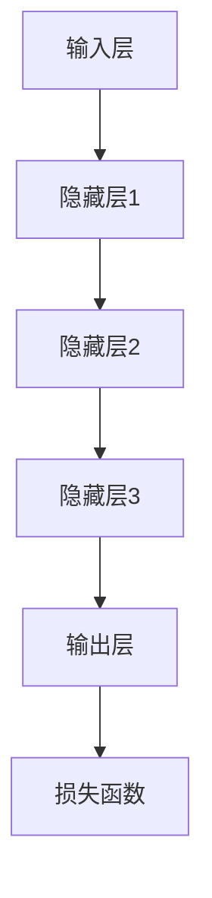

                 


## AI大模型与人类程序员的协作模式

### 关键词

- AI大模型
- 人类程序员
- 协作模式
- 技术演进
- 安全性
- 未来发展

### 摘要

本文将深入探讨AI大模型与人类程序员的协作模式。首先，我们将介绍AI大模型的基础知识，包括其概念、演进历程和技术特点。接着，我们将探讨人类程序员在AI时代面临的技能挑战和角色转变。然后，本文将详细分析AI大模型与程序员的协作模式，包括开发环境搭建、项目实战和安全策略。最后，我们将展望AI大模型与程序员的未来发展趋势，并总结本文的主要观点。

### 1. AI大模型基础

#### 1.1 AI大模型的概念与演进

AI大模型（Large-scale Artificial Intelligence Models）是人工智能领域的一个重要研究方向，其核心思想是通过训练大规模的神经网络模型，使其具备强大的表示能力和泛化能力。AI大模型的概念起源于20世纪80年代，当时研究者开始尝试使用大规模神经网络进行图像识别和自然语言处理。随着计算能力的提升和大数据时代的到来，AI大模型得到了快速发展。

#### 1.1.1 AI大模型的概念

AI大模型是指使用大量数据训练的神经网络模型，其参数规模通常在数十亿到千亿级别。这些模型具有强大的特征提取和表示能力，可以处理复杂的任务，如文本生成、图像识别、语音识别等。

#### 1.1.2 AI大模型的发展历程

AI大模型的发展历程可以分为几个阶段：

1. **初期探索**（1980年代）：研究者开始尝试使用神经网络进行图像识别和自然语言处理。
2. **深度学习崛起**（2006年）：Geoffrey Hinton提出了深度信念网络（DBN），标志着深度学习时代的到来。
3. **大数据时代**（2010年至今）：随着计算能力和存储能力的提升，研究者开始训练大规模神经网络模型，如GPT、BERT等。

#### 1.1.3 AI大模型的技术特点

AI大模型具有以下技术特点：

1. **大规模参数**：AI大模型的参数规模通常在数十亿到千亿级别，这使其具备强大的特征提取和表示能力。
2. **深度神经网络**：AI大模型通常采用深度神经网络结构，这有助于提高模型的表示能力和泛化能力。
3. **端到端训练**：AI大模型采用端到端训练的方式，从原始数据直接学习特征表示，避免了传统机器学习中的特征工程步骤。

#### 1.2 AI大模型的核心架构

AI大模型的核心架构主要包括以下几个部分：

1. **输入层**：接收原始数据，如文本、图像或音频。
2. **隐藏层**：对输入数据进行特征提取和变换。
3. **输出层**：根据隐藏层的特征输出预测结果。
4. **训练算法**：如梯度下降、随机梯度下降等，用于优化模型参数。
5. **评估指标**：如准确率、召回率、F1值等，用于评估模型性能。

#### 1.2.1 神经网络结构

神经网络结构是指由多个神经元组成的计算模型，其核心思想是通过层次化的特征提取和变换来表示复杂的数据。神经网络结构可以分为以下几个层次：

1. **输入层**：接收外部输入，如文本、图像或音频。
2. **隐藏层**：对输入数据进行特征提取和变换，隐藏层可以有一个或多个。
3. **输出层**：根据隐藏层的特征输出预测结果。

#### 1.2.2 训练与优化算法

AI大模型的训练与优化算法是模型开发中的关键环节，主要包括以下几个步骤：

1. **数据预处理**：对原始数据进行清洗、归一化等预处理操作。
2. **模型初始化**：初始化模型参数，常用的方法包括随机初始化、零初始化等。
3. **前向传播**：将输入数据通过神经网络结构进行前向传播，计算输出结果。
4. **反向传播**：计算输出结果与实际标签之间的误差，并反向传播误差信息，更新模型参数。
5. **评估与调整**：使用评估指标（如准确率、召回率、F1值等）评估模型性能，并根据评估结果调整模型参数。

#### 1.2.3 大模型的存储与计算

AI大模型的存储与计算是模型开发中的另一个重要问题。由于AI大模型的参数规模庞大，通常需要使用分布式计算和高效存储技术来提高模型训练和推理的效率。

1. **分布式计算**：通过将计算任务分布在多个计算节点上，可以提高模型训练和推理的并行度。
2. **高效存储**：使用高效的存储技术（如稀疏存储、量化存储等）可以减少存储空间占用，提高存储效率。

### 2. 人类程序员的技能与角色

#### 2.1 程序员的角色变迁

随着人工智能技术的发展，程序员的角色也在不断变迁。在传统编程模式中，程序员主要负责编写代码、调试程序和优化性能。然而，在人工智能时代，程序员需要面对更多的挑战和机遇。

#### 2.1.1 传统的编程模式

传统的编程模式主要基于以下原则：

1. **自下而上**：程序员从底层开始编写代码，逐步构建上层应用。
2. **重复劳动**：程序员需要编写大量重复的代码来完成任务。
3. **手动调试**：程序员需要手动调试程序，寻找并修复错误。

#### 2.1.2 人工智能时代的需求

人工智能时代对程序员提出了新的需求：

1. **大规模数据处理**：程序员需要处理海量的数据，进行数据预处理、特征提取和模型训练。
2. **自动化编程**：程序员需要开发自动化工具，提高编程效率和代码质量。
3. **人机协作**：程序员需要与AI大模型协作，共同完成复杂任务。

#### 2.1.3 程序员的新技能

在人工智能时代，程序员需要掌握以下新技能：

1. **机器学习**：了解机器学习算法原理，能够编写和优化机器学习模型。
2. **深度学习**：掌握深度学习框架和模型，能够开发深度学习应用。
3. **数据工程**：掌握数据工程技能，能够进行数据处理、特征提取和模型训练。
4. **自动化工具开发**：掌握自动化工具开发技能，能够提高编程效率和代码质量。

#### 2.2 程序员与AI大模型的协作模式

在人工智能时代，程序员与AI大模型的协作模式发生了显著变化。程序员不再只是编写代码，而是与AI大模型共同完成复杂任务。

#### 2.2.1 人机协作的原理

人机协作的原理如下：

1. **知识共享**：程序员和AI大模型共享知识，程序员提供领域知识和经验，AI大模型提供强大的计算能力和特征提取能力。
2. **分工合作**：程序员负责编写代码、调试程序和优化性能，AI大模型负责数据处理、模型训练和预测。
3. **交互反馈**：程序员与AI大模型进行交互，根据AI大模型的反馈进行模型调整和优化。

#### 2.2.2 人机协作的实践

人机协作在实践中具有以下特点：

1. **高效性**：AI大模型能够快速处理大量数据，提高编程效率。
2. **准确性**：AI大模型具备强大的特征提取和表示能力，提高编程准确性。
3. **灵活性**：程序员可以根据需求调整AI大模型，实现个性化编程。

#### 2.2.3 人机协作的挑战与机遇

人机协作带来了以下挑战和机遇：

1. **挑战**：
   - **技能转型**：程序员需要学习新技能，适应人工智能时代的需求。
   - **数据隐私**：在数据共享的过程中，需要保护用户隐私。
   - **安全风险**：AI大模型可能存在安全漏洞，需要加强安全防护。

2. **机遇**：
   - **创新应用**：人机协作可以推动人工智能技术在各领域的创新应用。
   - **产业升级**：人工智能时代为程序员提供了更多的发展机遇，推动产业升级。

### 3. AI大模型与程序员的协作实践

在实际项目中，AI大模型与程序员的协作模式具有以下特点：

1. **项目需求分析**：程序员与AI大模型共同分析项目需求，确定数据处理、模型训练和预测的具体目标。
2. **开发环境搭建**：程序员负责搭建开发环境，包括硬件设备、软件框架和工具集。
3. **数据处理**：程序员与AI大模型共同完成数据处理工作，包括数据清洗、归一化和特征提取。
4. **模型训练**：程序员使用AI大模型进行模型训练，根据评估结果调整模型参数。
5. **预测与评估**：程序员与AI大模型共同进行预测和评估，优化模型性能。
6. **项目部署**：程序员负责将模型部署到生产环境中，进行实时预测和在线服务。

#### 3.1 AI大模型的开发环境搭建

在AI大模型的开发过程中，搭建一个高效、稳定的开发环境至关重要。以下是一个典型的开发环境搭建步骤：

1. **硬件设备**：选择适合的硬件设备，如高性能CPU、GPU和存储设备。
2. **操作系统**：安装Linux操作系统，如Ubuntu或CentOS，以提高系统稳定性和性能。
3. **开发工具**：安装Python、Jupyter Notebook、TensorFlow等开发工具，用于编写和调试代码。
4. **深度学习框架**：选择合适的深度学习框架，如TensorFlow、PyTorch等，以提高开发效率和性能。
5. **数据存储与管理**：使用分布式存储系统（如HDFS）和管理工具（如Hadoop）进行大规模数据处理和管理。

#### 3.2 AI大模型的项目实战

以下是一个典型的AI大模型项目实战案例：

1. **项目背景**：某电商平台希望通过AI大模型预测用户购买行为，提高销售业绩。
2. **数据收集**：收集用户购买行为数据，包括用户ID、购买时间、购买物品、价格等。
3. **数据预处理**：对数据进行清洗、归一化和特征提取，提高模型训练和预测的准确性。
4. **模型训练**：使用深度学习框架训练AI大模型，选择合适的模型结构、损失函数和优化器。
5. **模型评估**：使用交叉验证、ROC曲线等评估指标评估模型性能，根据评估结果调整模型参数。
6. **预测与部署**：将训练好的模型部署到生产环境中，进行实时预测和在线服务。

#### 3.3 代码解读与分析

以下是对一个AI大模型项目中的关键代码进行解读与分析：

```python
import tensorflow as tf
from tensorflow.keras.models import Sequential
from tensorflow.keras.layers import Dense, Dropout, Embedding, LSTM

# 模型定义
model = Sequential([
    Embedding(input_dim=vocab_size, output_dim=embedding_dim, input_length=max_sequence_length),
    LSTM(units=128, dropout=0.2, recurrent_dropout=0.2),
    Dropout(0.5),
    Dense(units=num_classes, activation='softmax')
])

# 模型编译
model.compile(optimizer='adam', loss='categorical_crossentropy', metrics=['accuracy'])

# 模型训练
model.fit(x_train, y_train, epochs=10, batch_size=64, validation_data=(x_val, y_val))
```

上述代码实现了以下功能：

1. **模型定义**：使用Keras框架定义一个序列模型，包括嵌入层、LSTM层和全连接层。
2. **模型编译**：设置优化器、损失函数和评估指标。
3. **模型训练**：使用训练数据训练模型，并设置训练轮数、批次大小和验证数据。

#### 3.4 实际案例分析与详细讲解剖析

以下是一个实际案例分析与详细讲解剖析：

**案例背景**：某金融公司希望通过AI大模型预测股票价格，以指导投资决策。

**案例分析**：

1. **数据收集**：收集历史股票价格数据，包括开盘价、最高价、最低价、收盘价等。
2. **数据预处理**：对数据进行归一化处理，将数据缩放到[0, 1]范围内。
3. **特征提取**：使用LSTM模型提取时间序列特征，包括过去若干个时间点的价格变化。
4. **模型训练**：使用TensorFlow框架训练AI大模型，并使用交叉验证评估模型性能。
5. **预测与评估**：使用训练好的模型预测未来股票价格，并与实际价格进行比较，评估模型性能。

**详细讲解剖析**：

1. **数据收集**：通过互联网获取历史股票价格数据，包括开盘价、最高价、最低价、收盘价等。
2. **数据预处理**：使用归一化方法将数据进行归一化处理，将数据缩放到[0, 1]范围内，以消除数据量级差异。
3. **特征提取**：使用LSTM模型提取时间序列特征，包括过去若干个时间点的价格变化。这有助于模型学习时间序列数据的趋势和周期性。
4. **模型训练**：使用TensorFlow框架训练AI大模型，并使用交叉验证评估模型性能。交叉验证是一种评估模型性能的常用方法，通过将训练数据分为多个子集，轮流训练和验证模型。
5. **预测与评估**：使用训练好的模型预测未来股票价格，并与实际价格进行比较，评估模型性能。评估指标包括准确率、召回率、F1值等。

### 4. AI大模型的安全性

AI大模型的安全性是当前研究的一个热点问题。随着AI大模型在各个领域的广泛应用，其安全性问题也越来越受到关注。

#### 4.1 AI大模型的安全挑战

AI大模型面临以下安全挑战：

1. **数据隐私保护**：AI大模型需要处理大量敏感数据，如个人信息、医疗记录等，这些数据需要得到有效保护。
2. **模型鲁棒性**：AI大模型容易受到攻击，如对抗攻击、输入扰动等，这可能导致模型性能下降或产生错误预测。
3. **防止恶意攻击**：AI大模型可能受到恶意攻击，如黑盒攻击、白盒攻击等，这可能导致模型被篡改或破坏。

#### 4.2 AI大模型的安全策略

为了保障AI大模型的安全性，可以采取以下安全策略：

1. **数据加密与传输**：对敏感数据进行加密处理，并在传输过程中进行加密传输，以防止数据泄露。
2. **模型加密与隔离**：对AI大模型进行加密处理，将其与外部环境隔离，以防止恶意攻击。
3. **对抗训练与防护**：通过对抗训练提高模型的鲁棒性，对输入数据进行扰动处理，增强模型的鲁棒性。
4. **安全监控与预警**：建立安全监控系统，对AI大模型进行实时监控和预警，及时发现并应对安全威胁。

### 5. AI大模型的未来发展趋势

随着AI大模型技术的不断进步，其在各个领域的应用也在不断拓展。以下是对AI大模型未来发展趋势的展望：

1. **计算能力提升**：随着计算能力的提升，AI大模型的参数规模和计算复杂度将不断增加，这将有助于实现更复杂的任务。
2. **数据资源整合**：随着大数据技术的进步，AI大模型将能够更好地利用海量数据，提高模型的准确性和泛化能力。
3. **跨领域应用**：AI大模型将在更多领域得到应用，如医疗、金融、教育等，实现跨领域的智能化。
4. **人机协作**：AI大模型将与人类程序员实现更深层次的人机协作，提高工作效率和准确性。

### 6. 案例分析与启示

在本节中，我们将分析一些成功的AI大模型应用案例，并探讨其中的启示。

#### 6.1 成功案例

**案例1：自然语言处理**

自然语言处理（NLP）是AI大模型的一个重要应用领域。近年来，Google的BERT模型、OpenAI的GPT-3等模型在NLP任务中取得了显著成绩。

**案例分析**：

- **BERT模型**：BERT模型通过预训练和微调技术，在多种NLP任务上取得了超越之前模型的性能。其成功得益于大规模数据、深度神经网络和端到端训练。
- **GPT-3模型**：GPT-3模型具有前所未有的参数规模和语言理解能力，可以生成高质量的文本，实现对话生成、文本摘要等任务。

**启示**：

- **大规模数据与深度神经网络**：大规模数据和深度神经网络是实现高性能AI大模型的关键。
- **端到端训练**：端到端训练可以简化模型开发过程，提高模型性能。

**案例2：图像识别**

图像识别是AI大模型的另一个重要应用领域。近年来，Google的Inception模型、Facebook的ResNet等模型在图像识别任务中取得了突破性进展。

**案例分析**：

- **Inception模型**：Inception模型采用多层次、多尺度的特征提取方式，提高了图像识别的准确性。
- **ResNet模型**：ResNet模型采用残差连接技术，解决了深层网络训练中的梯度消失问题，实现了更高的准确率。

**启示**：

- **多层次、多尺度的特征提取**：多层次、多尺度的特征提取可以提高图像识别的准确性。
- **残差连接**：残差连接技术可以有效缓解深层网络训练中的梯度消失问题。

#### 6.2 失败案例

**案例1：自动驾驶**

自动驾驶是AI大模型在交通领域的一个重要应用。然而，一些自动驾驶项目在现实中遇到了挑战。

**案例分析**：

- **特斯拉自动驾驶事故**：特斯拉的自动驾驶系统在多次事故中暴露出安全漏洞，引起了广泛关注。
- **Waymo自动驾驶挑战**：Waymo自动驾驶挑战中的部分项目未能达到预期效果，暴露出AI大模型在复杂环境下的局限性。

**启示**：

- **安全风险评估**：在自动驾驶等高风险领域，需要进行严格的安全风险评估，确保系统的安全性。
- **复杂环境下的鲁棒性**：AI大模型需要在复杂环境下具有足够的鲁棒性，以应对各种不确定因素。

### 7. 总结与展望

本文从多个角度探讨了AI大模型与人类程序员的协作模式。首先，我们介绍了AI大模型的基础知识，包括其概念、演进历程和技术特点。接着，我们探讨了人类程序员在AI时代面临的技能挑战和角色转变。然后，我们分析了AI大模型与程序员的协作模式，包括开发环境搭建、项目实战和安全策略。最后，我们展望了AI大模型与程序员的未来发展趋势。

在未来，AI大模型与人类程序员的协作模式将不断演进，推动人工智能技术的发展。程序员需要不断学习新技能，适应人工智能时代的需求。同时，我们还需要关注AI大模型的安全性、伦理道德和社会影响，确保其在各个领域的健康发展。

### 附录: Mermaid流程图与数学公式

**A.1 AI大模型核心架构的Mermaid流程图**



**A.2 AI大模型训练优化算法的伪代码**

```python
for epoch in range(num_epochs):
    for batch in dataset:
        # 前向传播
        output = model(batch.input)
        loss = compute_loss(output, batch.label)
        
        # 反向传播
        model.backward(loss)
        
        # 更新参数
        model.update_params()
        
    # 评估模型
    evaluate(model, validation_dataset)
```

**A.3 AI大模型安全防护措施的latex数学公式**

$$
\begin{aligned}
&\text{数据加密：} \\
&x_{\text{加密}} = E(x, \text{密钥}) \\
&\text{数据解密：} \\
&x_{\text{解密}} = D(x_{\text{加密}}, \text{密钥}) \\
&\text{对抗训练：} \\
&x_{\text{对抗}} = x + \alpha \cdot \text{噪声}
\end{aligned}
$$

### 作者信息

- 作者：AI天才研究院/AI Genius Institute & 禅与计算机程序设计艺术 /Zen And The Art of Computer Programming

