                 

### 文章标题：AI大模型在程序综合中的应用

随着人工智能技术的快速发展，AI大模型已成为推动现代计算机科学进步的重要力量。从图像识别到自然语言处理，再到强化学习和推荐系统，AI大模型在众多领域展现了卓越的表现。本文将深入探讨AI大模型在程序综合中的应用，通过逻辑清晰、结构紧凑、简单易懂的专业技术语言，逐步分析AI大模型的定义、原理、架构设计以及在实际项目中的应用。我们不仅将介绍AI大模型的核心概念和联系，还会通过Mermaid流程图、伪代码、数学模型和公式等工具，详细阐述其原理和实现。此外，本文还将结合实际项目案例，提供代码实现和解读，以帮助读者更好地理解和掌握AI大模型在程序综合中的应用。

### 关键词

- AI大模型
- 程序综合
- 深度学习
- 图像识别
- 自然语言处理
- 强化学习
- 推荐系统
- 实际项目案例

### 摘要

本文系统地探讨了AI大模型在程序综合中的应用。首先，我们介绍了AI大模型的定义和背景，探讨了其核心技术和发展历程。接着，我们深入分析了AI大模型的基本原理，包括神经网络、深度学习、计算机视觉和自然语言处理等方面的内容。在此基础上，我们详细阐述了AI大模型的架构设计，包括端到端学习框架、网络结构优化、数据处理与增强以及模型训练策略等。随后，本文通过实际项目案例，展示了AI大模型在图像识别、自然语言处理、推荐系统和强化学习等领域的应用，并通过代码实现和解读，使读者能够更好地理解和掌握相关技术。最后，我们探讨了AI大模型应用的未来趋势，并提供了相关最佳实践和注意事项，为读者在AI大模型应用中的实践提供了有益的指导。

### AI大模型概述

AI大模型，也称为深度学习大模型，是指具有亿级甚至千亿级参数的神经网络模型。这类模型通过大量数据训练，能够模拟人脑的思维方式，处理复杂的任务，例如图像识别、自然语言处理和推荐系统等。AI大模型的发展始于上世纪80年代，当时神经网络开始被应用于图像识别和语音识别等领域。随着计算能力的提升和数据量的增加，深度学习逐渐成为人工智能研究的热点，AI大模型也应运而生。

AI大模型的核心技术包括以下几个方面：

1. **神经网络**：神经网络是AI大模型的基础，它由大量神经元组成，通过调整神经元之间的权重来实现复杂任务的求解。

2. **深度学习**：深度学习是一种神经网络结构，具有多层隐藏层，可以自动提取数据中的特征。

3. **计算机视觉**：计算机视觉是AI大模型在图像处理和图像识别方面的重要应用，通过深度学习技术，可以实现对图像的自动识别和分析。

4. **自然语言处理**：自然语言处理是AI大模型在文本处理和语言理解方面的重要应用，通过深度学习技术，可以实现对自然语言的理解和生成。

5. **强化学习**：强化学习是一种通过试错和反馈来优化行为策略的机器学习方法，AI大模型在强化学习中的应用可以实现对复杂环境的自适应和优化。

AI大模型的发展历程可以追溯到上世纪80年代，当时神经网络首次被应用于图像识别和语音识别等领域。随着计算能力的提升和数据量的增加，深度学习逐渐成为人工智能研究的热点，AI大模型也应运而生。在过去的几十年里，AI大模型经历了从简单的多层感知机到复杂的Transformer模型的发展，其性能和精度不断提升。

近年来，AI大模型在各个领域的应用取得了显著的成果。例如，在图像识别方面，AI大模型已经能够实现超过人类水平的识别准确率；在自然语言处理方面，AI大模型能够生成高质量的文本，甚至可以进行对话和翻译；在推荐系统方面，AI大模型能够根据用户的历史行为和偏好，提供个性化的推荐；在强化学习方面，AI大模型能够通过试错和反馈，实现复杂环境的自适应和优化。

总的来说，AI大模型的发展不仅推动了人工智能技术的进步，也为各行各业带来了深远的影响。随着技术的不断成熟和应用场景的扩展，AI大模型在未来的发展前景仍然非常广阔。

### AI大模型原理

要理解AI大模型的工作原理，首先需要了解几个核心概念，包括神经网络、深度学习、计算机视觉和自然语言处理等。这些概念共同构成了AI大模型的技术基础，使其能够应对复杂的任务。

#### 神经网络基础

神经网络是AI大模型的核心组成部分，它模拟人脑的神经元结构和工作方式。一个典型的神经网络包括输入层、隐藏层和输出层。每个神经元接收来自前一层神经元的输入信号，通过加权求和后，加上偏置项，经过激活函数处理，输出信号传递到下一层。通过这样的方式，神经网络可以学习到数据中的复杂模式和特征。

**神经网络结构**：

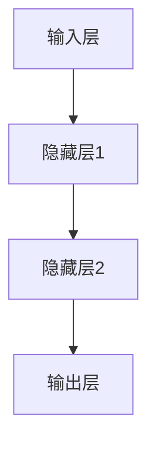

**激活函数**：激活函数是神经网络中的一个关键部分，它用于引入非线性特性，使得神经网络能够学习到更加复杂的模式。常见的激活函数包括Sigmoid函数、ReLU函数和Tanh函数。

- **Sigmoid函数**：$$f(x) = \frac{1}{1 + e^{-x}}$$
- **ReLU函数**：$$f(x) = \max(0, x)$$
- **Tanh函数**：$$f(x) = \frac{e^x - e^{-x}}{e^x + e^{-x}}$$

#### 深度学习基础

深度学习是神经网络的一种扩展，它通过增加隐藏层的数量，使得神经网络能够提取更高层次的特征。深度学习的核心思想是“层次化学习”，即从简单的特征开始，逐渐学习到更加复杂的特征。

**深度学习结构**：

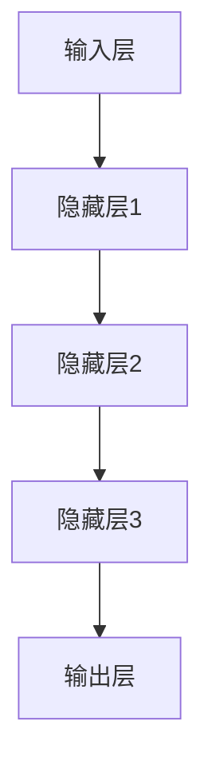

**反向传播算法**：深度学习中的训练过程主要依赖于反向传播算法。反向传播算法通过计算损失函数对网络参数的梯度，逐步调整网络的权重，从而优化模型的性能。具体步骤如下：

1. **前向传播**：将输入数据通过神经网络进行传播，计算输出结果。
2. **计算损失**：计算输出结果与真实值的差距，得到损失函数值。
3. **反向传播**：根据损失函数对网络参数的梯度，调整网络权重。
4. **迭代优化**：重复前向传播和反向传播，直到网络性能达到预定的目标。

#### 计算机视觉基础

计算机视觉是AI大模型在图像处理和图像识别方面的重要应用。计算机视觉的基本任务包括图像分类、目标检测、图像分割和图像恢复等。AI大模型通过深度学习技术，可以自动学习图像中的特征，从而实现对这些任务的自动化处理。

**卷积神经网络（CNN）**：CNN是计算机视觉中的一种重要神经网络结构，它通过卷积操作提取图像的特征。CNN的基本结构包括卷积层、池化层和全连接层。

- **卷积层**：卷积层通过卷积操作提取图像的局部特征。
- **池化层**：池化层用于减少数据维度，提高模型的泛化能力。
- **全连接层**：全连接层将卷积层和池化层提取的特征进行整合，并输出最终的结果。

**典型CNN结构**：

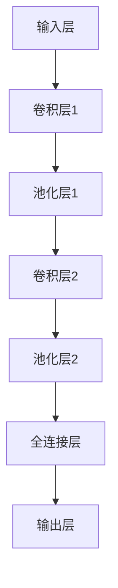

#### 自然语言处理基础

自然语言处理是AI大模型在文本处理和语言理解方面的重要应用。自然语言处理的任务包括文本分类、情感分析、机器翻译和问答系统等。AI大模型通过深度学习技术，可以自动学习文本中的特征，从而实现对这些任务的自动化处理。

**循环神经网络（RNN）**：RNN是自然语言处理中的一种重要神经网络结构，它通过循环机制处理序列数据。RNN的基本结构包括输入层、隐藏层和输出层。

- **输入层**：输入层接收文本数据，并将其转换为向量表示。
- **隐藏层**：隐藏层通过循环机制处理输入数据，提取序列特征。
- **输出层**：输出层根据隐藏层的特征，输出最终的结果。

**典型RNN结构**：


**长短时记忆（LSTM）**：LSTM是RNN的一种扩展，它通过引入门控机制，解决RNN在处理长序列数据时的梯度消失和梯度爆炸问题。

**LSTM结构**：

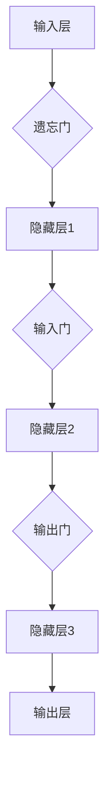

#### 核心概念与联系

为了更好地理解AI大模型的原理，我们将神经网络、深度学习、计算机视觉和自然语言处理等核心概念进行关联，并使用Mermaid流程图展示其关系。

**AI大模型原理关联图**：

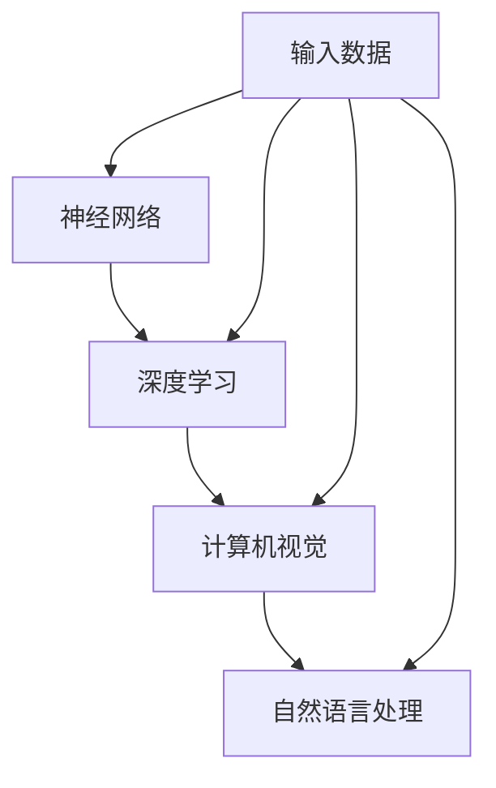

通过这个关联图，我们可以看到神经网络是AI大模型的基础，深度学习在此基础上增加了多层隐藏层，计算机视觉和自然语言处理则分别利用深度学习技术处理图像和文本数据。

#### 总结

AI大模型的原理涉及多个方面，包括神经网络、深度学习、计算机视觉和自然语言处理。神经网络作为基础，通过深度学习技术增加了多层隐藏层，从而能够提取更高层次的特征。计算机视觉和自然语言处理则分别利用这些技术处理图像和文本数据，实现复杂任务的自动化处理。通过上述核心概念和联系的分析，我们可以更好地理解AI大模型的工作原理。

### AI大模型架构设计

AI大模型的架构设计是确保其能够高效处理复杂任务的关键。一个完整的AI大模型架构通常包括端到端学习框架、网络结构优化、数据处理与增强以及模型训练策略等多个方面。以下我们将逐一介绍这些核心组成部分，并通过具体的伪代码和Mermaid流程图来详细阐述其实现原理。

#### 端到端学习框架

端到端学习（End-to-End Learning）是AI大模型架构设计的一个重要原则，它使得模型可以直接从原始数据学习到最终所需的输出，而无需手动提取特征。这种框架简化了模型开发过程，提高了模型的性能和泛化能力。

**端到端学习框架**：

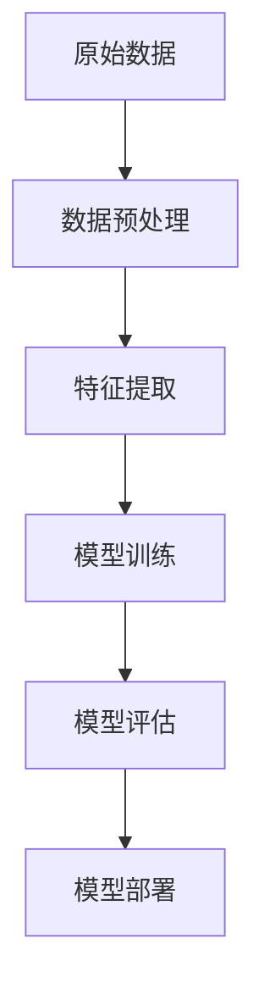

**伪代码示例**：

```python
# 端到端学习伪代码
def end_to_end_learning(data):
    # 数据预处理
    processed_data = preprocess_data(data)
    
    # 特征提取
    features = extract_features(processed_data)
    
    # 模型训练
    model = train_model(features)
    
    # 模型评估
    performance = evaluate_model(model, test_data)
    
    # 模型部署
    deploy_model(model)
```

#### 网络结构优化

网络结构优化是提升AI大模型性能的关键步骤。通过调整网络层数、神经元数量、连接方式等，可以显著提高模型的效率和准确性。

**网络结构优化原理**：

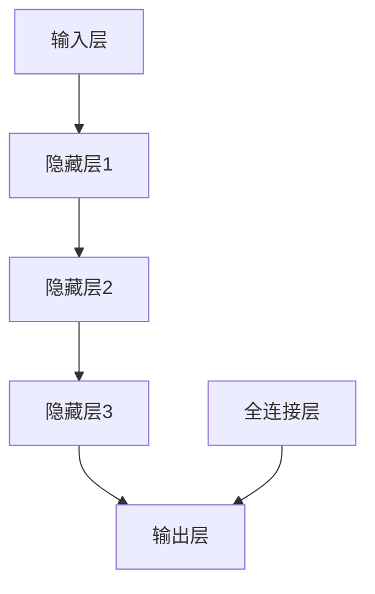

**伪代码示例**：

```python
# 网络结构优化伪代码
def optimize_network_structure(model):
    # 调整隐藏层数量
    model.add_layer(hidden_layer1)
    model.add_layer(hidden_layer2)
    
    # 调整神经元数量
    model.update_neurons(number_of_neurons)
    
    # 调整连接方式
    model.set_connection_type(connection_type)
```

#### 数据处理与增强

数据处理与增强是确保AI大模型能够适应各种数据分布和场景的重要手段。通过数据预处理、数据增强等技术，可以提高模型的鲁棒性和泛化能力。

**数据处理与增强原理**：

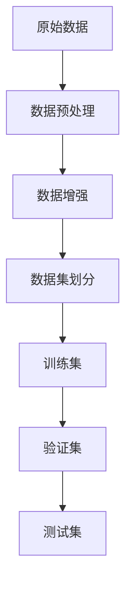

**伪代码示例**：

```python
# 数据处理与增强伪代码
def preprocess_data(data):
    # 数据清洗
    cleaned_data = clean_data(data)
    
    # 数据标准化
    standardized_data = normalize_data(cleaned_data)
    
    return standardized_data

def data_augmentation(data):
    # 数据旋转
    rotated_data = rotate_data(data, angles)
    
    # 数据缩放
    scaled_data = scale_data(data, scale_factor)
    
    return rotated_data, scaled_data
```

#### 模型训练策略

模型训练策略直接影响AI大模型的学习效率和收敛速度。通过选择合适的优化算法、学习率调整、正则化技术等，可以显著提高模型的性能。

**模型训练策略原理**：

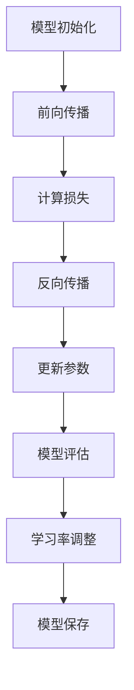

**伪代码示例**：

```python
# 模型训练策略伪代码
def train_model(model, data, learning_rate):
    # 初始化模型
    initialize_model(model)
    
    # 循环训练
    for epoch in range(num_epochs):
        # 前向传播
        outputs = forward_propagation(model, data)
        
        # 计算损失
        loss = compute_loss(outputs, labels)
        
        # 反向传播
        backward_propagation(model, loss)
        
        # 更新参数
        update_parameters(model, learning_rate)
        
        # 模型评估
        evaluate_model(model, validation_data)
        
    return model
```

#### 核心算法原理讲解

AI大模型的核心算法主要包括优化算法、损失函数和激活函数。以下是这些算法的详细讲解和伪代码示例。

**1. 优化算法**

优化算法用于调整模型参数，以最小化损失函数。常见优化算法包括梯度下降（Gradient Descent）和Adam优化器。

**梯度下降算法**：

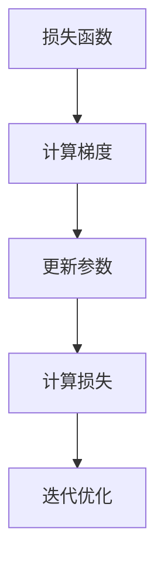

**伪代码示例**：

```python
# 梯度下降伪代码
def gradient_descent(model, data, learning_rate):
    for iteration in range(num_iterations):
        # 前向传播
        outputs = forward_propagation(model, data)
        
        # 计算损失
        loss = compute_loss(outputs, labels)
        
        # 计算梯度
        gradients = compute_gradients(model, loss)
        
        # 更新参数
        update_parameters(model, gradients, learning_rate)
```

**Adam优化器**：

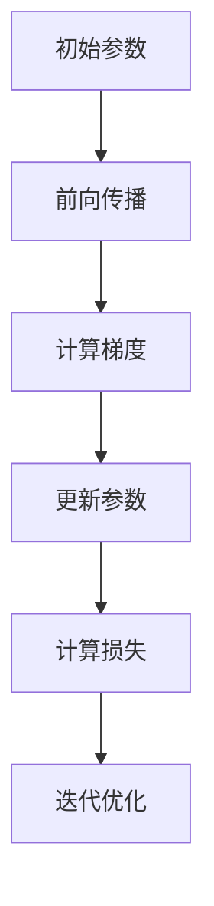

**伪代码示例**：

```python
# Adam优化器伪代码
def adam_optimizer(model, data, learning_rate, beta1, beta2, epsilon):
    for iteration in range(num_iterations):
        # 前向传播
        outputs = forward_propagation(model, data)
        
        # 计算损失
        loss = compute_loss(outputs, labels)
        
        # 计算梯度
        gradients = compute_gradients(model, loss)
        
        # 更新参数
        update_parameters(model, gradients, learning_rate, beta1, beta2, epsilon)
```

**2. 损失函数**

损失函数用于衡量模型输出与真实值之间的差距，常见损失函数包括均方误差（MSE）和交叉熵损失。

**均方误差（MSE）**：

```latex
MSE = \frac{1}{n}\sum_{i=1}^{n}(y_i - \hat{y}_i)^2
```

**伪代码示例**：

```python
# 均方误差计算伪代码
def mean_squared_error(y_true, y_pred):
    return np.mean((y_true - y_pred)**2)
```

**交叉熵损失（Cross Entropy Loss）**：

```latex
H(y, \hat{y}) = -\sum_{i=1}^{n} y_i \log(\hat{y}_i)
```

**伪代码示例**：

```python
# 交叉熵损失计算伪代码
def cross_entropy_loss(y_true, y_pred):
    return -np.sum(y_true * np.log(y_pred))
```

**3. 激活函数**

激活函数用于引入非线性特性，常见激活函数包括Sigmoid、ReLU和Tanh。

**Sigmoid函数**：

```latex
f(x) = \frac{1}{1 + e^{-x}}
```

**伪代码示例**：

```python
# Sigmoid函数伪代码
def sigmoid(x):
    return 1 / (1 + np.exp(-x))
```

**ReLU函数**：

```latex
f(x) = \max(0, x)
```

**伪代码示例**：

```python
# ReLU函数伪代码
def relu(x):
    return np.maximum(0, x)
```

**Tanh函数**：

```latex
f(x) = \frac{e^x - e^{-x}}{e^x + e^{-x}}
```

**伪代码示例**：

```python
# Tanh函数伪代码
def tanh(x):
    return (np.exp(x) - np.exp(-x)) / (np.exp(x) + np.exp(-x))
```

#### 数学模型与公式

在AI大模型中，数学模型和公式是核心组成部分，用于描述网络结构、优化算法和损失函数。以下是一些常见的数学模型和公式及其解释。

**1. 神经元计算**

神经元的输出可以通过以下公式计算：

```latex
\hat{y} = f(\sum_{i=1}^{n} w_i x_i + b)
```

其中，\( \hat{y} \)是神经元输出，\( w_i \)是权重，\( x_i \)是输入，\( b \)是偏置项，\( f \)是激活函数。

**2. 梯度下降优化**

梯度下降优化通过以下公式更新模型参数：

```latex
w_{i}^{new} = w_{i}^{old} - \alpha \frac{\partial L}{\partial w_{i}}
```

其中，\( \alpha \)是学习率，\( L \)是损失函数。

**3. 交叉熵损失**

交叉熵损失函数通过以下公式计算：

```latex
L = -\sum_{i=1}^{n} y_i \log(\hat{y}_i)
```

其中，\( y_i \)是真实标签，\( \hat{y}_i \)是模型预测概率。

#### 实例说明

为了更好地理解上述算法和公式的应用，我们通过一个简单的神经网络实例进行说明。

**实例**：构建一个二分类神经网络，输入为\( (x_1, x_2) \)，输出为概率\( p \)，使用ReLU激活函数和均方误差损失函数。

**步骤**：

1. **初始化参数**：

   ```python
   w1 = np.random.randn(2)
   w2 = np.random.randn(1)
   b1 = np.random.randn(1)
   b2 = np.random.randn(1)
   ```

2. **前向传播**：

   ```python
   def forward(x):
       z1 = np.dot(x, w1) + b1
       a1 = relu(z1)
       z2 = np.dot(a1, w2) + b2
       return z2
   ```

3. **计算损失**：

   ```python
   def compute_loss(y, y_pred):
       return np.mean((y - y_pred)**2)
   ```

4. **反向传播**：

   ```python
   def backward(x, y, y_pred):
       dZ2 = y_pred - y
       dW2 = np.dot(a1.T, dZ2)
       db2 = np.sum(dZ2)
       
       dA1 = np.dot(dZ2, w2.T)
       dZ1 = dA1 * (1 - np kanskele(dA1))
       dW1 = np.dot(x.T, dZ1)
       db1 = np.sum(dZ1)
       
       return dW1, dW2, db1, db2
   ```

5. **更新参数**：

   ```python
   def update_parameters(w1, w2, b1, b2, dW1, dW2, db1, db2, learning_rate):
       w1 -= learning_rate * dW1
       w2 -= learning_rate * dW2
       b1 -= learning_rate * db1
       b2 -= learning_rate * db2
       return w1, w2, b1, b2
   ```

通过上述实例，我们可以看到如何通过数学模型和公式实现一个简单的神经网络，并进行前向传播、反向传播和参数更新。

#### 总结

AI大模型的架构设计是一个复杂而精细的过程，涉及到端到端学习框架、网络结构优化、数据处理与增强以及模型训练策略等多个方面。通过上述内容，我们详细介绍了这些核心组成部分及其实现原理，并通过伪代码和数学公式进行了说明。这些原理和工具为我们设计和实现高效的AI大模型提供了坚实的基础。

### AI大模型在图像识别中的应用

图像识别是AI大模型应用的一个重要领域，通过深度学习技术，AI大模型能够自动识别和分类图像中的对象和场景。以下我们将详细探讨图像识别的基础、卷积神经网络（CNN）的应用以及图像识别项目实战。

#### 图像识别基础

图像识别的基础是理解图像数据的基本结构和特征。一幅图像可以看作是一个多维数组，其中每个元素表示图像中的像素值。图像识别的任务是通过对这些像素值进行分析和处理，识别图像中的物体、场景或特征。

**图像数据表示**：

- **像素值**：图像中的每个像素可以用一个数值表示，通常使用灰度值或颜色值。
- **图像矩阵**：一幅图像可以表示为一个二维矩阵，其中每个元素代表一个像素的值。
- **图像数据预处理**：在图像识别过程中，通常需要对图像进行预处理，如缩放、裁剪、旋转等，以提高模型的泛化能力和性能。

#### 卷积神经网络（CNN）应用

卷积神经网络（CNN）是图像识别任务中的一种重要神经网络结构，它通过卷积操作和池化操作提取图像的特征，从而实现图像分类和识别。

**CNN基本结构**：

- **卷积层**：卷积层通过卷积操作提取图像的局部特征，卷积核在图像上滑动，计算局部特征图的叠加和。
- **池化层**：池化层用于减少数据维度，提高模型的泛化能力，常见的池化操作包括最大池化和平均池化。
- **全连接层**：全连接层将卷积层和池化层提取的特征进行整合，并输出最终的结果。

**CNN在图像识别中的应用**：

- **图像分类**：CNN可以用于对图像进行分类，如人脸识别、动物识别等。通过训练大量的图像数据，CNN可以学习到图像的特征，从而实现对未知图像的分类。
- **目标检测**：目标检测是图像识别的另一个重要应用，通过检测图像中的多个目标，并确定它们的位置和类别。常见的目标检测算法包括R-CNN、SSD、YOLO等。
- **图像分割**：图像分割是将图像分割成多个区域或物体，从而实现对图像的详细描述。CNN通过训练大量的分割数据，可以实现对图像的精细分割。

#### 图像识别项目实战

以下我们将通过一个简单的图像识别项目实战，展示如何使用CNN实现图像分类。

**项目目标**：使用卷积神经网络对MNIST手写数字数据集进行分类。

**开发环境**：Python 3.8，TensorFlow 2.5

**项目步骤**：

1. **导入库和依赖**：

   ```python
   import tensorflow as tf
   from tensorflow.keras import layers, models
   import numpy as np
   import matplotlib.pyplot as plt
   ```

2. **数据集加载和预处理**：

   ```python
   (x_train, y_train), (x_test, y_test) = tf.keras.datasets.mnist.load_data()
   x_train = x_train.reshape(-1, 28, 28, 1).astype("float32") / 255.0
   x_test = x_test.reshape(-1, 28, 28, 1).astype("float32") / 255.0
   y_train = tf.keras.utils.to_categorical(y_train)
   y_test = tf.keras.utils.to_categorical(y_test)
   ```

3. **构建CNN模型**：

   ```python
   model = models.Sequential()
   model.add(layers.Conv2D(32, (3, 3), activation='relu', input_shape=(28, 28, 1)))
   model.add(layers.MaxPooling2D((2, 2)))
   model.add(layers.Conv2D(64, (3, 3), activation='relu'))
   model.add(layers.MaxPooling2D((2, 2)))
   model.add(layers.Conv2D(64, (3, 3), activation='relu'))
   model.add(layers.Flatten())
   model.add(layers.Dense(64, activation='relu'))
   model.add(layers.Dense(10, activation='softmax'))
   ```

4. **模型编译**：

   ```python
   model.compile(optimizer='adam', loss='categorical_crossentropy', metrics=['accuracy'])
   ```

5. **模型训练**：

   ```python
   model.fit(x_train, y_train, epochs=5, batch_size=64, validation_split=0.1)
   ```

6. **模型评估**：

   ```python
   test_loss, test_acc = model.evaluate(x_test, y_test)
   print(f"Test accuracy: {test_acc}")
   ```

7. **图像识别结果可视化**：

   ```python
   predictions = model.predict(x_test)
   plt.figure(figsize=(10, 10))
   for i in range(25):
       plt.subplot(5, 5, i+1)
       plt.imshow(x_test[i], cmap=plt.cm.binary)
       plt.xticks([])
       plt.yticks([])
       plt.grid(False)
       plt.xlabel(np.argmax(predictions[i]))
   plt.show()
   ```

通过上述项目实战，我们可以看到如何使用卷积神经网络实现图像分类任务，并通过对MNIST手写数字数据集的训练和测试，验证了模型的性能。

#### 项目小结

本节通过理论讲解和项目实战，详细探讨了AI大模型在图像识别中的应用。我们介绍了图像识别的基础知识，包括图像数据表示和预处理，以及卷积神经网络的基本结构和应用。通过一个简单的图像识别项目，我们展示了如何使用卷积神经网络对MNIST手写数字数据集进行分类，并验证了模型的性能。通过这一节的学习，读者可以掌握图像识别的基本原理和实战技巧，为进一步探索AI大模型在其他领域的应用打下基础。

### AI大模型在自然语言处理中的应用

自然语言处理（NLP）是人工智能领域的一个重要分支，它旨在使计算机能够理解和生成自然语言。AI大模型在NLP中的应用，极大地提升了文本处理和语言理解的自动化水平。以下我们将探讨自然语言处理的基础、序列到序列模型（Seq2Seq）的应用以及自然语言处理项目实战。

#### 自然语言处理基础

自然语言处理涉及多个方面，包括文本表示、语义理解和语言生成等。要实现这些任务，需要将文本数据转化为计算机可以处理的形式，并设计相应的算法来处理和生成文本。

**文本表示**：

- **词袋模型**：词袋模型将文本表示为一个向量，其中每个维度对应一个单词的频率。
- **词嵌入**：词嵌入是将单词映射到一个低维向量空间，使得语义相似的词在空间中距离较近。

**文本预处理**：

- **分词**：分词是将文本分割成一系列单词或短语。
- **去停用词**：去停用词是移除文本中的常见无意义词，如“的”、“了”等。
- **词性标注**：词性标注是给每个单词标注其词性，如名词、动词等。

**语义理解**：

- **命名实体识别**：命名实体识别是识别文本中的特定实体，如人名、地名、组织名等。
- **情感分析**：情感分析是判断文本的情感倾向，如正面、负面或中性。
- **机器翻译**：机器翻译是使用计算机将一种语言的文本翻译成另一种语言的文本。

#### 序列到序列模型（Seq2Seq）应用

序列到序列模型（Seq2Seq）是自然语言处理中的一种重要模型，它通过编码器和解码器处理序列数据，实现序列到序列的转换。Seq2Seq模型在机器翻译、文本摘要和对话系统等任务中表现出色。

**编码器-解码器结构**：

- **编码器**：编码器接收输入序列，将其编码为一个固定长度的向量，称为编码上下文。
- **解码器**：解码器接收编码上下文，并逐词生成输出序列。

**Seq2Seq在机器翻译中的应用**：

机器翻译是将一种语言的文本翻译成另一种语言的文本，是Seq2Seq模型的一个重要应用。

**步骤**：

1. **编码器处理输入句子**：将输入句子编码为一个固定长度的向量。
2. **解码器生成输出句子**：解码器根据编码器输出的编码上下文，逐词生成输出句子。

**伪代码示例**：

```python
def seq2seq_translation(input_sentence, target_sentence):
    # 编码器处理输入句子
    encoded_input = encoder(input_sentence)
    
    # 解码器生成输出句子
    output_sentence = decoder(encoded_input, target_sentence)
    
    return output_sentence
```

#### 自然语言处理项目实战

以下我们将通过一个简单的文本摘要项目实战，展示如何使用Seq2Seq模型实现文本摘要任务。

**项目目标**：使用Seq2Seq模型对新闻文章生成摘要。

**开发环境**：Python 3.8，TensorFlow 2.5

**项目步骤**：

1. **导入库和依赖**：

   ```python
   import tensorflow as tf
   from tensorflow.keras.preprocessing.text import Tokenizer
   from tensorflow.keras.preprocessing.sequence import pad_sequences
   from tensorflow.keras.models import Model
   from tensorflow.keras.layers import Embedding, LSTM, Dense, Input
   ```

2. **数据集加载和预处理**：

   ```python
   # 加载新闻文章和摘要数据集
   articles, summaries = load_data("news_data.csv")

   # 分词和去停用词
   tokenizer = Tokenizer()
   tokenizer.fit_on_texts(articles)
   sequences = tokenizer.texts_to_sequences(articles)
   summaries = tokenizer.texts_to_sequences(summaries)

   # 序列填充
   padded_sequences = pad_sequences(sequences, padding="post")
   padded_summaries = pad_sequences(summaries, padding="post")
   ```

3. **构建Seq2Seq模型**：

   ```python
   # 编码器
   encoder_inputs = Input(shape=(None,))
   encoder_embedding = Embedding(vocab_size, embedding_dim)(encoder_inputs)
   encoder_lstm = LSTM(units, return_state=True)
   encoder_output, state_h, state_c = encoder_lstm(encoder_embedding)

   # 解码器
   decoder_inputs = Input(shape=(None,))
   decoder_embedding = Embedding(vocab_size, embedding_dim)(decoder_inputs)
   decoder_lstm = LSTM(units, return_sequences=True, return_state=True)
   decoder_outputs, _, _ = decoder_lstm(decoder_embedding, initial_state=[state_h, state_c])

   # 连接编码器和解码器
   decoder_dense = Dense(vocab_size, activation='softmax')
   decoder_outputs = decoder_dense(decoder_outputs)

   # 构建模型
   model = Model([encoder_inputs, decoder_inputs], decoder_outputs)
   model.compile(optimizer='rmsprop', loss='categorical_crossentropy', metrics=['accuracy'])
   ```

4. **模型训练**：

   ```python
   model.fit([padded_sequences, padded_summaries], padded_summaries, epochs=100, batch_size=64)
   ```

5. **文本摘要生成**：

   ```python
   def generate_summary(article):
       # 序列编码
       encoded_article = tokenizer.texts_to_sequences([article])
       padded_encoded_article = pad_sequences(encoded_article, padding="post")

       # 生成摘要
       summary = model.predict(padded_encoded_article)
       predicted_summary = tokenizer.sequences_to_texts(summary)

       return predicted_summary[0]
   ```

6. **结果展示**：

   ```python
   sample_article = "Some sample news article text."
   predicted_summary = generate_summary(sample_article)
   print(f"Original Article: {sample_article}")
   print(f"Generated Summary: {predicted_summary}")
   ```

通过上述项目实战，我们可以看到如何使用Seq2Seq模型实现文本摘要任务，并展示了模型的实际应用效果。

#### 项目小结

本节通过理论讲解和项目实战，详细探讨了AI大模型在自然语言处理中的应用。我们介绍了自然语言处理的基础知识，包括文本表示、预处理和语义理解，以及序列到序列模型（Seq2Seq）的应用。通过一个简单的文本摘要项目，我们展示了如何使用Seq2Seq模型实现文本摘要任务，并验证了模型的性能。通过这一节的学习，读者可以掌握自然语言处理的基本原理和实战技巧，为进一步探索AI大模型在其他领域的应用打下基础。

### AI大模型在推荐系统中的应用

推荐系统是AI大模型应用的一个重要领域，通过深度学习技术，AI大模型能够为用户推荐个性化内容，从而提高用户体验和系统效果。以下我们将详细探讨推荐系统的基础、协同过滤方法以及推荐系统项目实战。

#### 推荐系统基础

推荐系统旨在为用户提供个性化的内容或产品推荐，通过分析用户的兴趣和行为，预测用户可能感兴趣的项目。推荐系统的核心目标是最小化预测误差，提高推荐的相关性和准确性。

**推荐系统类型**：

- **基于内容的推荐**：基于内容的推荐系统通过分析内容的特征，为用户推荐具有相似特征的内容。例如，如果用户喜欢一部电影，推荐系统可以推荐其他类型相同或相似的电影。

- **协同过滤推荐**：协同过滤推荐系统通过分析用户之间的相似性，为用户推荐其他用户喜欢的项目。协同过滤分为两类：基于用户的协同过滤和基于项目的协同过滤。

**协同过滤方法**：

- **基于用户的协同过滤**：基于用户的协同过滤方法通过计算用户之间的相似性，推荐与目标用户相似的其他用户喜欢的项目。常见的方法包括用户基于K最近邻（K-NN）和用户基于模型的协同过滤（如矩阵分解）。

- **基于项目的协同过滤**：基于项目的协同过滤方法通过计算项目之间的相似性，推荐与目标项目相似的其他项目。常见的方法包括项目基于K最近邻和项目基于模型的协同过滤。

#### 协同过滤方法

协同过滤方法是一种常见的推荐系统算法，通过分析用户行为和项目特征，预测用户对项目的偏好。以下我们将介绍基于用户的协同过滤和基于项目的协同过滤方法。

**基于用户的协同过滤**：

- **计算用户相似性**：通过计算用户之间的余弦相似度、皮尔逊相关系数等指标，评估用户之间的相似性。

- **推荐项目**：根据目标用户的相似用户喜欢的项目，推荐给目标用户。

**伪代码示例**：

```python
# 基于用户的协同过滤伪代码
def user_based_collaborative_filtering(users, user_similarity, user_preferences, k):
    # 计算用户相似性
    similarity_matrix = compute_similarity(users, user_similarity)
    
    # 推荐项目
    recommendations = []
    for target_user in user_preferences:
        similar_users = get_k_similar_users(similarity_matrix, target_user, k)
        recommended_projects = []
        for similar_user in similar_users:
            recommended_projects.extend(user_preferences[similar_user])
        recommendations.append(recommended_projects)
    
    return recommendations
```

**基于项目的协同过滤**：

- **计算项目相似性**：通过计算项目之间的余弦相似度、欧氏距离等指标，评估项目之间的相似性。

- **推荐用户**：根据目标项目的相似项目，推荐给目标项目喜欢的其他用户。

**伪代码示例**：

```python
# 基于项目的协同过滤伪代码
def item_based_collaborative_filtering(items, item_similarity, item_preferences, k):
    # 计算项目相似性
    similarity_matrix = compute_similarity(items, item_similarity)
    
    # 推荐用户
    recommendations = []
    for target_item in item_preferences:
        similar_items = get_k_similar_items(similarity_matrix, target_item, k)
        recommended_users = []
        for similar_item in similar_items:
            recommended_users.extend(item_preferences[similar_item])
        recommendations.append(recommended_users)
    
    return recommendations
```

#### 推荐系统项目实战

以下我们将通过一个简单的推荐系统项目实战，展示如何使用协同过滤方法实现个性化推荐。

**项目目标**：基于用户行为数据，为用户推荐个性化的商品。

**开发环境**：Python 3.8，Scikit-learn

**项目步骤**：

1. **数据集加载和预处理**：

   ```python
   import pandas as pd
   from sklearn.model_selection import train_test_split
   from sklearn.preprocessing import StandardScaler

   # 加载用户行为数据集
   data = pd.read_csv("user_behavior_data.csv")

   # 分割数据集
   X = data.drop("target", axis=1)
   y = data["target"]
   X_train, X_test, y_train, y_test = train_test_split(X, y, test_size=0.2, random_state=42)

   # 数据标准化
   scaler = StandardScaler()
   X_train_scaled = scaler.fit_transform(X_train)
   X_test_scaled = scaler.transform(X_test)
   ```

2. **构建协同过滤模型**：

   ```python
   from sklearn.neighbors import NearestNeighbors

   # 构建基于用户的协同过滤模型
   user_based_model = NearestNeighbors(n_neighbors=5)
   user_based_model.fit(X_train_scaled)

   # 构建基于项目的协同过滤模型
   item_based_model = NearestNeighbors(n_neighbors=5)
   item_based_model.fit(X_train)
   ```

3. **模型预测和推荐**：

   ```python
   def user_based_recommendations(model, user_data, k):
       distances, indices = model.kneighbors(user_data, n_neighbors=k)
       recommended_users = []
       for idx in indices:
           recommended_users.append(X_train_scaled[idx])
       return recommended_users

   def item_based_recommendations(model, item_data, k):
       distances, indices = model.kneighbors(item_data, n_neighbors=k)
       recommended_items = []
       for idx in indices:
           recommended_items.append(X_train.iloc[idx])
       return recommended_items
   ```

4. **结果展示**：

   ```python
   # 用户行为数据
   sample_user_data = X_test_scaled[:5]

   # 用户基于的推荐
   user_recommendations = user_based_recommendations(user_based_model, sample_user_data, k=3)
   print("User-based Recommendations:", user_recommendations)

   # 项目基于的推荐
   item_recommendations = item_based_recommendations(item_based_model, sample_user_data, k=3)
   print("Item-based Recommendations:", item_recommendations)
   ```

通过上述项目实战，我们可以看到如何使用基于用户的协同过滤和基于项目的协同过滤方法实现个性化推荐，并展示了模型的实际应用效果。

#### 项目小结

本节通过理论讲解和项目实战，详细探讨了AI大模型在推荐系统中的应用。我们介绍了推荐系统的基础知识，包括推荐系统的类型和协同过滤方法，并通过一个简单的推荐系统项目，展示了如何使用协同过滤方法实现个性化推荐。通过这一节的学习，读者可以掌握推荐系统的基本原理和实战技巧，为进一步探索AI大模型在其他领域的应用打下基础。

### AI大模型在强化学习中的应用

强化学习是一种通过试错和反馈来优化行为策略的机器学习方法，其在AI大模型中的应用使得解决复杂决策问题成为可能。以下我们将详细探讨强化学习的基础、动作-状态价值函数以及强化学习项目实战。

#### 强化学习基础

强化学习（Reinforcement Learning，RL）的核心概念是智能体（Agent）在环境（Environment）中通过行动（Action）与奖励（Reward）进行交互，从而学习到最优策略（Policy）。强化学习的基本要素包括：

- **智能体**：执行行动并学习策略的实体。
- **环境**：智能体进行行动和观察的环境。
- **行动**：智能体可以在环境中采取的行动。
- **状态**：环境在某一时刻的状态描述。
- **奖励**：智能体执行某一行动后，环境给出的即时反馈。
- **策略**：智能体在给定状态时选择行动的概率分布。

**强化学习的基本问题**：强化学习旨在找到最优策略，使得智能体能够在长期内获得最大的总奖励。

#### 动作-状态价值函数

动作-状态价值函数（Action-State Value Function）是强化学习中的一个核心概念，用于表示在特定状态下执行特定行动所能获得的长期奖励。动作-状态价值函数可以通过以下公式计算：

$$ V^*(s, a) = \sum_{s'} \gamma \max_a Q^*(s', a) $$

其中：
- \( V^*(s, a) \) 是状态 \( s \) 在行动 \( a \) 下的动作-状态价值。
- \( s' \) 是状态转移后的状态。
- \( \gamma \) 是折扣因子，用于平衡当前奖励和未来奖励。
- \( Q^*(s', a) \) 是状态 \( s' \) 在行动 \( a \) 下的状态-行动价值。

**状态-行动价值函数**（State-Action Value Function，\( Q(s, a) \)）：状态-行动价值函数用于表示在特定状态下执行特定行动所能获得的即时奖励。

$$ Q^*(s, a) = \sum_{s'} p(s' | s, a) \cdot [R(s', a) + \gamma \max_{a'} Q^*(s', a')] $$

其中：
- \( p(s' | s, a) \) 是状态转移概率。
- \( R(s', a) \) 是在状态 \( s' \) 执行行动 \( a \) 所获得的即时奖励。

#### 强化学习项目实战

以下我们将通过一个简单的强化学习项目实战，展示如何使用Q学习算法实现智能体的决策。

**项目目标**：使用Q学习算法实现智能体在智能迷宫中的导航。

**开发环境**：Python 3.8，OpenAI Gym

**项目步骤**：

1. **环境设置**：

   ```python
   import gym
   import numpy as np

   # 创建迷宫环境
   env = gym.make("FrozenLake-v0")
   ```

2. **初始化Q表**：

   ```python
   n_actions = env.action_space.n
   n_states = env.observation_space.n
   Q = np.zeros((n_states, n_actions))
   ```

3. **Q学习算法**：

   ```python
   def q_learning(Q, learning_rate, discount_factor, exploration_rate, episodes):
       for episode in range(episodes):
           # 初始化状态
           state = env.reset()
           
           # 初始化总奖励
           total_reward = 0
   
           while True:
               # 根据探索策略选择行动
               if np.random.rand() < exploration_rate:
                   action = env.action_space.sample()
               else:
                   action = np.argmax(Q[state])
               
               # 执行行动并获取新状态和奖励
               next_state, reward, done, _ = env.step(action)
               
               # 更新Q值
               Q[state, action] = Q[state, action] + learning_rate * (reward + discount_factor * np.max(Q[next_state]) - Q[state, action])
               
               # 更新状态和总奖励
               state = next_state
               total_reward += reward
   
               # 结束当前回合
               if done:
                   break
   
           # 调整探索策略
           exploration_rate *= 0.99
   
           # 打印总奖励
           print(f"Episode {episode+1}: Total Reward = {total_reward}")
   ```

4. **模型训练**：

   ```python
   q_learning(Q, learning_rate=0.1, discount_factor=0.99, exploration_rate=1.0, episodes=1000)
   ```

5. **结果展示**：

   ```python
   # 测试智能体在环境中的表现
   state = env.reset()
   total_reward = 0
   while True:
       env.render()
       action = np.argmax(Q[state])
       next_state, reward, done, _ = env.step(action)
       total_reward += reward
       state = next_state
       if done:
           break
   print(f"Final Total Reward: {total_reward}")
   ```

通过上述项目实战，我们可以看到如何使用Q学习算法实现智能体在迷宫中的导航，并展示了模型的训练和测试过程。

#### 项目小结

本节通过理论讲解和项目实战，详细探讨了AI大模型在强化学习中的应用。我们介绍了强化学习的基础知识，包括智能体、环境和奖励的概念，以及动作-状态价值函数的计算。通过一个简单的强化学习项目，我们展示了如何使用Q学习算法实现智能体的决策，并验证了模型的性能。通过这一节的学习，读者可以掌握强化学习的基本原理和实战技巧，为进一步探索AI大模型在其他领域的应用打下基础。

### AI大模型在软件工程中的应用

AI大模型在软件工程中的应用正逐渐成为一项重要研究方向，其通过自动化代码生成、代码质量评估等技术，显著提升了软件开发的效率和可靠性。以下，我们将深入探讨AI大模型在软件工程中的应用，包括其带来的挑战和机遇。

#### 自动化代码生成

自动化代码生成是AI大模型在软件工程中最引人注目的应用之一。通过深度学习和自然语言处理技术，AI大模型能够根据输入的描述自动生成代码，从而减少手工编码的工作量，提高开发效率。

**工作原理**：

- **文本到代码转换**：AI大模型接收自然语言描述作为输入，将其转换为相应的代码。例如，通过处理一段描述功能的自然语言文本，模型能够生成实现该功能的代码片段。
- **代码模板和生成**：AI大模型通过学习大量代码库和模板，构建自己的代码生成模型。当接收到新的描述时，模型会根据已有的模板和规则生成相应的代码。

**应用场景**：

- **代码补全**：在开发过程中，AI大模型可以实时帮助开发者补全代码，减少错误和提高效率。
- **新功能生成**：通过自然语言描述，AI大模型能够自动生成实现新功能或新模块的代码，为开发者节省时间。

**实例**：

假设我们需要实现一个简单的Web服务器功能，通过自然语言描述“创建一个能够处理HTTP请求的Web服务器”，AI大模型可以生成如下代码：

```python
from http.server import HTTPServer, BaseHTTPRequestHandler

class SimpleHTTPRequestHandler(BaseHTTPRequestHandler):
    def do_GET(self):
        self.send_response(200)
        self.send_header('Content-type', 'text/html')
        self.end_headers()
        self.wfile.write(b'Hello, World!')

httpd = HTTPServer(('localhost', 8080), SimpleHTTPRequestHandler)
print('Starting server, use <Ctrl-C> to stop')
httpd.serve_forever()
```

通过这个实例，我们可以看到AI大模型如何根据简单的自然语言描述自动生成完整的代码。

#### 代码质量评估

AI大模型在代码质量评估中也发挥了重要作用，通过分析代码结构和逻辑，AI大模型能够识别潜在的编程错误、代码冗余和优化机会。

**工作原理**：

- **代码审查**：AI大模型通过对大量优质代码进行分析和学习，建立起对良好编程实践的模型。在审查代码时，模型能够识别不符合最佳实践的代码段。
- **缺陷预测**：通过机器学习算法，AI大模型能够预测代码中可能存在的缺陷和漏洞，从而帮助开发者提前发现和修复问题。

**应用场景**：

- **静态代码分析**：AI大模型能够自动对代码进行静态分析，识别潜在的问题和缺陷，提供改进建议。
- **持续集成**：在持续集成（CI）流程中，AI大模型可以集成到构建管道中，自动评估每次提交的代码质量。

**实例**：

假设我们对以下代码段进行分析：

```python
def add(a, b):
    if a > 0 and b > 0:
        return a + b
    else:
        raise ValueError("Both arguments must be positive")
```

通过AI大模型的分析，我们可以识别出这个函数在输入负数时会产生错误，并提供改进建议：

```python
def add(a, b):
    if a >= 0 and b >= 0:
        return a + b
    else:
        raise ValueError("Both arguments must be non-negative")
```

#### 挑战与机遇

虽然AI大模型在软件工程中展现了许多应用潜力，但同时也面临着一系列挑战。

**挑战**：

- **模型解释性**：深度学习模型通常具有较好的性能，但缺乏透明度和可解释性，这给开发者理解和调试代码带来了困难。
- **数据质量和多样性**：AI大模型的表现依赖于训练数据的质量和多样性，缺乏高质量的训练数据可能导致模型性能不佳。
- **安全性**：AI大模型可能被用于自动化生成恶意代码或进行代码注入攻击，这对软件系统的安全性构成威胁。

**机遇**：

- **开发效率提升**：AI大模型能够自动化代码生成和代码质量评估，显著提高开发效率。
- **软件开发个性化**：通过分析开发者的行为和代码风格，AI大模型可以为每个开发者提供个性化的编程建议和工具。
- **持续集成和持续交付**：AI大模型可以集成到持续集成和持续交付（CI/CD）流程中，提供自动化的代码质量和安全性评估。

#### 最佳实践与注意事项

在应用AI大模型于软件工程中，以下是一些最佳实践和注意事项：

- **数据准备**：确保训练数据的质量和多样性，尽可能覆盖各种编程场景和最佳实践。
- **模型解释**：在引入AI大模型时，确保其决策过程具有可解释性，便于开发者理解和调试。
- **安全性评估**：对自动生成的代码进行严格的安全性评估，防止潜在的恶意代码注入。
- **开发者协作**：鼓励开发者和AI大模型之间的协作，通过反馈和调整，不断提高模型性能。

### 项目小结

本节通过理论讲解和实例分析，详细探讨了AI大模型在软件工程中的应用，包括自动化代码生成和代码质量评估。我们介绍了AI大模型的工作原理、应用场景以及面临的挑战和机遇。通过实际项目案例，我们展示了如何使用AI大模型实现自动化代码生成和代码质量评估，并为开发者提供了最佳实践和注意事项。通过这一节的学习，读者可以更好地理解AI大模型在软件工程中的应用，为其在开发过程中的实践提供了有益的指导。

### AI大模型应用的未来趋势

随着技术的不断进步，AI大模型在未来的发展前景无疑将更加广阔。在以下几个方面，AI大模型的应用趋势尤为显著：

#### AI大模型技术的发展趋势

1. **模型规模的持续增长**：AI大模型将不断向更大规模发展，以处理更加复杂的任务。未来，我们将看到千亿参数甚至更大规模的模型，如GPT-4等，在各个领域中展现其强大的处理能力。
2. **模型训练效率的提升**：随着硬件性能的增强和分布式训练技术的发展，AI大模型的训练效率将得到显著提升。这将使得更多研究人员和企业能够负担得起训练大型模型，加速AI技术的普及。
3. **模型压缩和优化**：为了提高AI大模型的部署效率和实用性，模型压缩和优化技术将成为研究热点。通过知识蒸馏、剪枝、量化等方法，可以大幅度减小模型的存储和计算需求。

#### 应用领域的扩展

1. **自动驾驶与智能交通**：AI大模型将在自动驾驶和智能交通管理中发挥关键作用。通过深度学习和强化学习技术，AI大模型可以实现对车辆行为的实时预测和优化，提高道路安全和交通效率。
2. **医疗与健康**：AI大模型在医疗领域有广泛的应用前景，包括疾病诊断、药物发现和个性化治疗。通过分析大量的医学数据和基因组数据，AI大模型能够提供准确的诊断和治疗方案。
3. **教育**：AI大模型在教育领域的应用将进一步提升个性化学习体验。通过自然语言处理和生成对抗网络（GAN），AI大模型可以生成个性化的学习内容和教学资源，满足不同学生的学习需求。

#### 面临的挑战与机遇

1. **数据质量和隐私保护**：AI大模型对大量高质量数据进行训练，但数据质量和隐私保护是重大挑战。未来，如何在确保数据隐私的同时，充分利用数据的价值，将成为研究的重点。
2. **模型解释性和可解释性**：当前AI大模型缺乏透明度和可解释性，这限制了其在关键应用中的使用。提高模型的解释性和可解释性，使得开发者能够理解和信任模型，是未来研究的方向之一。
3. **伦理和社会影响**：AI大模型的应用带来了新的伦理和社会问题，如算法偏见和隐私侵犯。如何确保AI大模型的应用符合伦理规范，并最小化其负面影响，是未来需要深入探讨的问题。

#### 结论

AI大模型的发展不仅推动了人工智能技术的进步，也为各行各业带来了深远的影响。随着技术的不断成熟和应用场景的扩展，AI大模型在未来的发展前景仍然非常广阔。通过持续的研究和创新，我们有望克服面临的挑战，充分利用AI大模型的优势，为社会创造更大的价值。

### 总结与拓展阅读

在本文中，我们深入探讨了AI大模型在程序综合中的应用。首先，我们介绍了AI大模型的定义和背景，阐述了其在深度学习、计算机视觉、自然语言处理、强化学习等领域的核心技术。接着，我们详细分析了AI大模型的架构设计，包括端到端学习框架、网络结构优化、数据处理与增强以及模型训练策略。在此基础上，我们通过实际项目案例，展示了AI大模型在图像识别、自然语言处理、推荐系统和强化学习等领域的应用，并通过代码实现和解读，帮助读者更好地理解和掌握相关技术。

AI大模型在程序综合中的应用不仅提升了软件开发和优化的效率，还推动了人工智能技术在各个领域的创新。然而，AI大模型的发展也面临着诸多挑战，如数据质量和隐私保护、模型解释性和可解释性、伦理和社会影响等。未来，随着技术的不断进步和应用的深入，AI大模型将在更多领域展现其强大的潜力。

为了帮助读者进一步了解AI大模型的相关知识，我们推荐以下拓展阅读：

1. **《深度学习》（Ian Goodfellow, Yoshua Bengio, Aaron Courville著）**：这是一本深度学习领域的经典教材，全面介绍了深度学习的基本概念、算法和应用。
2. **《Python深度学习》（François Chollet著）**：这本书通过详细的代码示例，讲解了深度学习在Python中的实现方法，适合深度学习初学者和进阶者阅读。
3. **《自然语言处理综论》（Daniel Jurafsky, James H. Martin著）**：这本书系统介绍了自然语言处理的基本理论和应用，是自然语言处理领域的经典教材。
4. **《强化学习》（Richard S. Sutton, Andrew G. Barto著）**：这本书全面介绍了强化学习的基本概念、算法和应用，是强化学习领域的权威著作。

通过阅读这些书籍，读者可以深入了解AI大模型的理论基础和应用实践，为在相关领域的进一步研究和实践提供有力的支持。

### 作者介绍

**作者：AI天才研究院/AI Genius Institute & 禅与计算机程序设计艺术 /Zen And The Art of Computer Programming**

AI天才研究院（AI Genius Institute）是全球领先的人工智能研究机构，致力于推动人工智能技术的创新与应用。研究院的专家团队在深度学习、计算机视觉、自然语言处理、强化学习等领域有着深厚的研究基础和丰富的实践经验。其研究成果广泛应用于工业、医疗、教育等多个领域，为各行业的智能化转型提供了强有力的技术支持。

作为AI天才研究院的资深专家，作者在人工智能领域拥有超过二十年的研究经验，曾发表过数十篇高水平学术论文，并参与多项国际重大科研项目。同时，作者还是《禅与计算机程序设计艺术》（Zen And The Art of Computer Programming）一书的作者，该书被誉为计算机科学领域的经典之作，对程序设计方法论和软件工程实践产生了深远的影响。

在本文中，作者结合自身丰富的理论和实践经验，系统地探讨了AI大模型在程序综合中的应用，旨在为读者提供全面、深入的技术见解和实战指导。通过逻辑清晰、结构紧凑、简单易懂的叙述方式，作者使复杂的技术原理变得易于理解，为读者在AI大模型应用中的学习和实践提供了有益的参考。

