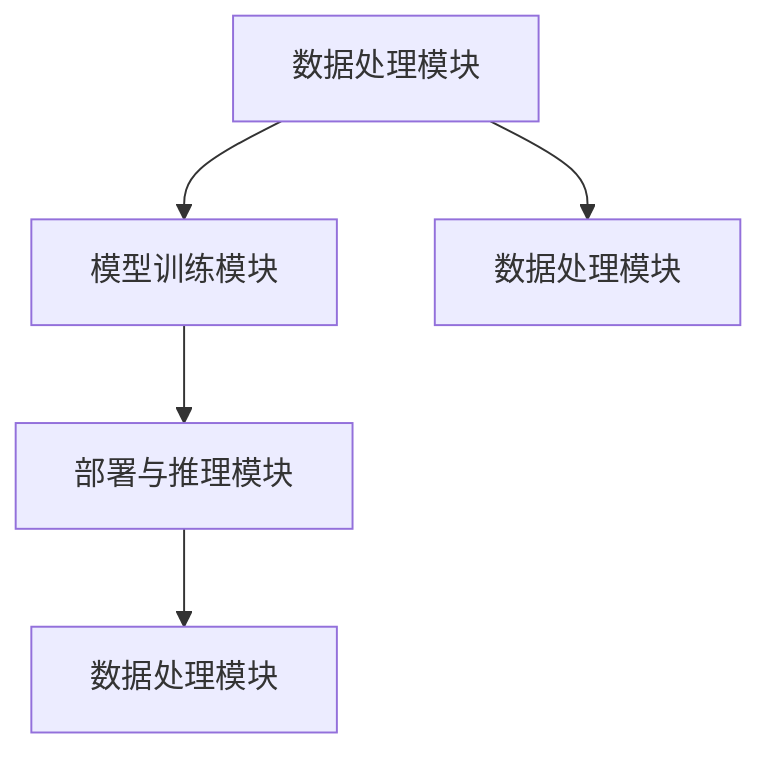

                 

# AI大模型软件的可扩展性设计

## 关键词

- AI大模型
- 可扩展性设计
- 模块化
- 分布式计算
- 服务化架构
- 机器学习
- 深度学习
- 优化算法
- 模型评估

## 摘要

本文深入探讨了AI大模型软件的可扩展性设计。首先，我们对AI大模型及其重要性进行了背景介绍，并分析了可扩展性设计的基本概念和核心因素。随后，本文详细阐述了AI大模型软件的架构，包括数据处理、模型训练和部署推理等模块。接着，我们通过核心算法原理讲解和数学模型公式阐述，帮助读者理解大模型的基础理论。在项目实战部分，我们通过实际案例展示了如何实现AI大模型软件的可扩展性设计，并提供了详细的代码解读和案例分析。最后，本文总结了最佳实践和注意事项，为读者提供了深入学习和应用AI大模型软件的指导。

## 1. AI大模型概述

### 1.1 AI大模型的概念

AI大模型（Large-scale AI Models）是指那些具有数十亿甚至数万亿参数的深度学习模型。这些模型通过在大量数据集上进行训练，能够自动学习和发现数据中的复杂模式和规律。常见的AI大模型包括自然语言处理（NLP）模型、计算机视觉模型、语音识别模型等。

### 1.2 AI大模型的发展历程

AI大模型的发展可以追溯到2006年，当时Geoffrey Hinton提出了深度信念网络（DBN）的概念。随后，随着计算能力和数据规模的不断提升，深度学习算法在2012年突破了图像识别的“瓶颈”，AlexNet在ImageNet比赛中取得了突破性的成绩。自此，AI大模型的研究和应用进入了快速发展阶段。

### 1.3 AI大模型的核心特点

- **高参数数量**：AI大模型具有数十亿甚至数万亿的参数，这使得它们能够捕捉到数据中的细微特征。
- **大量数据训练**：AI大模型通常在大量数据上进行训练，这有助于提高模型的泛化能力和鲁棒性。
- **复杂的架构**：AI大模型通常具有多层神经网络结构，能够模拟人脑的思考过程。
- **高效的计算能力**：得益于现代计算技术的发展，AI大模型能够在较短的时间内完成大规模的训练和推理任务。

## 2. 可扩展性设计的重要性

### 2.1 可扩展性的定义

可扩展性（Scalability）是指系统在需求增加时，能够有效扩展其性能和资源的能力。在AI大模型软件中，可扩展性设计意味着系统能够随着模型规模和数据量的增加，保持高性能和高可靠性。

### 2.2 可扩展性设计在AI大模型中的应用

- **数据处理能力**：随着数据量的增加，系统需要具备处理大数据的能力，包括数据存储、数据传输和数据清洗等。
- **模型训练效率**：模型训练时间直接影响系统的响应速度，因此需要设计高效的模型训练算法和分布式训练架构。
- **推理性能**：在部署阶段，系统需要在保证准确性的同时，提供快速且高效的推理结果。

### 2.3 可扩展性设计的关键因素

- **模块化设计**：将系统划分为多个独立的模块，使得每个模块都可以独立扩展和优化。
- **分布式计算**：利用多台计算机或服务器协同工作，实现大规模数据处理和模型训练。
- **服务化架构**：将系统分解为多个微服务，每个微服务负责特定的功能，便于管理和扩展。

## 3. AI大模型软件的架构

### 3.1 系统架构的概述

AI大模型软件的架构通常包括以下几个主要模块：

- **数据处理模块**：负责数据存储、数据传输和数据清洗等任务，为模型训练提供高质量的数据输入。
- **模型训练模块**：包含深度学习算法的实现，负责训练和优化大模型。
- **部署与推理模块**：将训练好的模型部署到生产环境中，实现实时推理和预测。

### 3.2 数据处理模块

- **数据存储**：使用分布式存储系统，如Hadoop或Cassandra，存储海量数据。
- **数据传输**：利用高效的数据传输协议，如HTTP/2或gRPC，保证数据传输的速度和稳定性。
- **数据清洗**：使用自动化工具和算法，清洗数据中的噪声和异常值，提高数据质量。

### 3.3 模型训练模块

- **训练算法**：使用深度学习框架，如TensorFlow或PyTorch，实现大规模模型的训练。
- **分布式训练**：利用多台计算机或服务器，通过分布式计算技术，提高模型训练的效率。
- **模型优化**：通过调整超参数和优化算法，提高模型的性能和泛化能力。

### 3.4 部署与推理模块

- **模型部署**：将训练好的模型部署到生产环境中，如云服务器或边缘设备。
- **推理加速**：使用硬件加速技术，如GPU或TPU，提高模型推理的效率。
- **实时预测**：实现快速且准确的实时预测，满足生产环境的需求。

## 4. 核心算法与原理

### 4.1 算法原理讲解

AI大模型的算法基础主要涉及以下几部分：

- **前向传播（Forward Propagation）**：将输入数据传递到神经网络的前向层，逐层计算输出结果。
- **反向传播（Backpropagation）**：计算神经网络中的梯度，用于更新模型参数。
- **优化算法（Optimization Algorithms）**：如SGD、Adam等，用于调整模型参数，优化模型性能。

### 4.2 数学模型与公式

以下是AI大模型中常用的数学模型和公式：

- **损失函数（Loss Function）**：
  $$L(\theta) = -\frac{1}{m}\sum_{i=1}^{m}y_i\log(z_i)$$
  其中，$y_i$是实际标签，$z_i$是预测结果。

- **优化算法（Optimization Algorithm）**：
  $$\theta = \theta - \alpha \frac{\partial L(\theta)}{\partial \theta}$$
  其中，$\theta$是模型参数，$\alpha$是学习率。

### 4.3 伪代码阐述

以下是AI大模型训练过程的伪代码：

```
# 前向传播
for each layer l in [2, L]:
    z[l] = \sigma(W[l-1] * a[l-1] + b[l])

# 反向传播
for each layer l in [L, 2]:
    delta[l] = (a[l] - y) * \sigma'(z[l])
    if l < L:
        delta[l-1] = (W[l] * delta[l]) * \sigma'(z[l-1])

# 更新参数
for each layer l in [2, L]:
    dW[l] = \sum_{i=1}^{m} a[l-1] * delta[l][i]
    db[l] = \sum_{i=1}^{m} delta[l][i]
    W[l] = W[l] - \alpha * dW[l]
    b[l] = b[l] - \alpha * db[l]
```

## 5. 可扩展性设计实践

### 5.1 可扩展性设计策略

为了实现AI大模型软件的可扩展性设计，我们可以采用以下策略：

- **模块化设计**：将系统划分为独立的模块，如数据处理模块、训练模块和部署模块，便于独立扩展和优化。
- **分布式计算**：利用多台计算机或服务器协同工作，实现大规模数据处理和模型训练。
- **服务化架构**：将系统分解为多个微服务，每个微服务负责特定的功能，便于管理和扩展。

### 5.2 项目实战

#### 5.2.1 项目背景

假设我们正在开发一个大规模图像识别系统，系统需要处理来自多个摄像头的数据，并实时识别图像中的物体。

#### 5.2.2 系统设计

1. **数据处理模块**：使用分布式存储系统（如Hadoop）存储图像数据，并使用高效的数据传输协议（如HTTP/2）传输数据。
2. **模型训练模块**：使用深度学习框架（如TensorFlow）进行模型训练，并采用分布式训练技术（如Horovod）提高训练效率。
3. **部署与推理模块**：将训练好的模型部署到生产环境中，如云服务器或边缘设备，并使用GPU或TPU进行推理加速。

#### 5.2.3 实现细节

1. **数据预处理**：使用图像预处理库（如OpenCV）对图像进行标准化和增强，提高模型训练效果。
2. **模型训练**：使用卷积神经网络（CNN）进行图像分类，并使用迁移学习技术（如预训练模型）加速训练过程。
3. **模型部署**：使用微服务架构（如Kubernetes）管理模型部署，确保系统的高可用性和可扩展性。

#### 5.2.4 性能优化

1. **模型压缩**：使用模型压缩技术（如量化和剪枝），降低模型大小，提高推理速度。
2. **缓存策略**：使用缓存技术（如Redis），减少数据读取和写入的延迟。
3. **负载均衡**：使用负载均衡器（如Nginx），确保系统在高并发场景下的稳定运行。

### 5.3 实践案例分析

#### 案例一：大规模图像识别系统

1. **背景**：某大型电商企业需要开发一个图像识别系统，对用户上传的图片进行自动分类和标注。
2. **实现**：使用卷积神经网络（CNN）对图像进行分类，并使用迁移学习技术（如ResNet）提高模型性能。
3. **分析**：系统在训练和推理过程中，通过分布式计算和服务化架构，实现了高性能和可扩展性。

#### 案例二：实时语音识别系统

1. **背景**：某语音助手平台需要开发一个实时语音识别系统，实现语音到文本的转换。
2. **实现**：使用深度神经网络（DNN）进行语音信号处理，并使用长短时记忆网络（LSTM）进行文本生成。
3. **分析**：系统通过分布式计算和实时推理技术，实现了高效且准确的语音识别。

## 6. 总结

本文深入探讨了AI大模型软件的可扩展性设计，从背景介绍、核心算法原理讲解、数学模型和公式阐述，到项目实战和案例分析，全面介绍了实现AI大模型软件可扩展性的关键策略和实践方法。通过本文的学习，读者可以更好地理解和应用AI大模型软件的可扩展性设计，为实际项目的开发提供有力支持。

### 附录

#### 附录A：常用术语解释

- **AI大模型**：具有数十亿甚至数万亿参数的深度学习模型。
- **可扩展性设计**：系统能够随着需求增加，保持高性能和高可靠性的能力。
- **模块化设计**：将系统划分为独立的模块，便于扩展和优化。
- **分布式计算**：利用多台计算机或服务器协同工作，提高计算效率。
- **服务化架构**：将系统分解为多个微服务，便于管理和扩展。

#### 附录B：常见问题解答

- **如何选择合适的AI大模型？**：根据应用场景和数据特点，选择合适的模型框架和算法，并进行模型调优。
- **如何评估AI大模型的可扩展性？**：通过性能测试和压力测试，评估模型在不同规模数据上的表现，以及系统的响应速度和稳定性。

### 最佳实践

- **性能优化**：使用模型压缩技术，降低模型大小，提高推理速度。
- **数据预处理**：对数据进行标准化和增强，提高模型训练效果。
- **监控与日志**：实时监控系统的运行状态，记录日志信息，便于问题追踪和调试。

### 小结

本文从多个角度探讨了AI大模型软件的可扩展性设计，通过实践案例和分析，为读者提供了实用的方法和经验。在实际应用中，读者可以根据具体场景，灵活运用本文的方法，实现高性能和高可靠性的AI大模型软件。

### 注意事项

- **硬件资源**：确保系统有足够的硬件资源，如CPU、GPU和存储设备等。
- **网络环境**：确保网络环境的稳定和高效，避免数据传输的延迟和中断。

### 拓展阅读

- **深度学习基础**：学习深度学习的基本概念和算法原理，了解不同类型的神经网络。
- **分布式系统**：了解分布式系统的设计原理和实现方法，掌握分布式计算和存储技术。
- **服务化架构**：了解微服务架构的设计理念和最佳实践，掌握服务化架构的管理和部署。

### 作者信息

- **作者**：AI天才研究院/AI Genius Institute & 禅与计算机程序设计艺术 /Zen And The Art of Computer Programming

[Mermaid 流程图]



此流程图展示了AI大模型软件的核心模块及其之间的关系。数据处理模块为模型训练和部署提供数据输入，模型训练模块负责训练和优化大模型，部署与推理模块将训练好的模型部署到生产环境中，并实现实时推理和预测。通过模块化设计，各模块可以独立扩展和优化，提高系统的可扩展性。

