                 


# 文章标题
AI时代的软件工程创新管理方法

> 关键词：软件工程、人工智能、项目管理、创新管理、敏捷开发

> 摘要：本文深入探讨了AI时代软件工程领域的创新管理方法。通过分析当前AI技术的应用趋势，探讨了如何在软件项目管理中融入AI，以提升开发效率和质量。文章从敏捷开发、自动化测试、数据分析与预测、人机协作等方面详细阐述了AI在软件工程中的实践案例，为软件开发团队提供了切实可行的创新管理策略。

## 目录

1. 引言
2. AI时代软件工程的挑战与机遇
3. 敏捷开发与AI的融合
4. 自动化测试与AI的结合
5. 数据分析与预测在软件工程中的应用
6. 人机协作：AI时代的软件工程师
7. 实战案例：AI驱动的软件项目管理
8. 最佳实践与展望
9. 总结
10. 参考文献

## 1. 引言

随着人工智能（AI）技术的飞速发展，软件工程领域正在经历深刻的变革。AI的应用不仅改变了软件开发的方式，还带来了前所未有的挑战和机遇。在AI时代，软件工程师需要具备更高的技术视野和管理能力，以适应快速变化的技术环境。

本文旨在探讨AI时代软件工程的创新管理方法。我们将从以下几个方面进行分析：

- **敏捷开发与AI的融合**：如何利用AI提升敏捷开发过程中的协作效率和问题识别能力。
- **自动化测试与AI的结合**：如何通过AI技术自动化测试，提升软件质量。
- **数据分析与预测在软件工程中的应用**：如何利用大数据和AI技术进行项目进度预测和风险分析。
- **人机协作**：如何实现人与AI的协作，提升软件工程师的工作效率。
- **实战案例**：通过具体案例展示AI技术在软件项目管理中的实际应用。
- **最佳实践与展望**：总结AI时代软件工程创新管理的最佳实践，并对未来发展趋势进行展望。

通过以上分析，本文希望能够为软件工程师和项目经理提供有价值的参考，帮助他们在AI时代实现更高效的软件工程管理。

## 2. AI时代软件工程的挑战与机遇

在AI时代，软件工程面临着一系列前所未有的挑战和机遇。首先，AI技术的迅速发展使得软件系统的复杂性不断增加。这不仅要求软件开发者具备更高的技术水平，还需要他们在项目管理中具备更强的应变能力。

### 挑战

#### 1. 复杂性管理

随着AI技术的广泛应用，软件系统的功能越来越复杂。传统的软件开发方法难以应对这种复杂性，导致项目进度延误、质量下降。此外，AI技术自身的复杂性，如深度学习算法的实现和优化，也对软件开发者提出了更高的要求。

#### 2. 数据安全与隐私

AI技术的应用离不开大量的数据，而数据的安全和隐私保护成为了一个重要的挑战。在软件开发过程中，如何确保数据的完整性、保密性和可用性，是一个亟待解决的问题。

#### 3. 项目管理难度

AI技术的引入改变了传统的项目管理模式。项目经理需要具备更多的技术知识和技能，以便更好地管理AI驱动的项目。这无疑增加了项目管理的工作量和难度。

### 机遇

#### 1. 敏捷开发

AI技术可以为敏捷开发提供强大的支持。通过自动化测试、数据分析与预测等技术，软件开发团队可以更快地响应需求变化，提高开发效率。

#### 2. 质量提升

AI技术在自动化测试和质量保证方面具有显著优势。通过机器学习算法，AI可以自动识别软件缺陷，预测潜在问题，从而提升软件质量。

#### 3. 数据驱动决策

在AI时代，大数据和AI技术为软件项目管理提供了丰富的数据资源。通过数据分析与预测，项目经理可以更准确地评估项目进度、风险和成本，从而做出更明智的决策。

#### 4. 人机协作

AI技术的应用可以大大提高软件工程师的工作效率。通过人机协作，软件工程师可以更专注于创新和优化，而将重复性、繁琐的工作交给AI完成。

### 结论

总体而言，AI时代为软件工程带来了巨大的挑战和机遇。软件开发者需要不断学习和适应新的技术，以应对复杂的变化。同时，利用AI技术进行创新管理，可以有效提升软件项目的开发效率和质量。

### 核心概念与联系

为了更好地理解AI时代软件工程的挑战与机遇，我们引入以下核心概念：

- **敏捷开发**：一种强调快速响应变化、迭代式开发的软件开发方法。
- **自动化测试**：通过软件工具自动执行测试，以发现软件缺陷。
- **数据分析与预测**：利用大数据和机器学习算法对项目数据进行分析和预测。
- **人机协作**：软件工程师与AI系统协同工作，以提升工作效率。

这些概念之间存在着紧密的联系，共同构成了AI时代软件工程的核心架构。以下是核心概念与联系之间的Mermaid流程图：

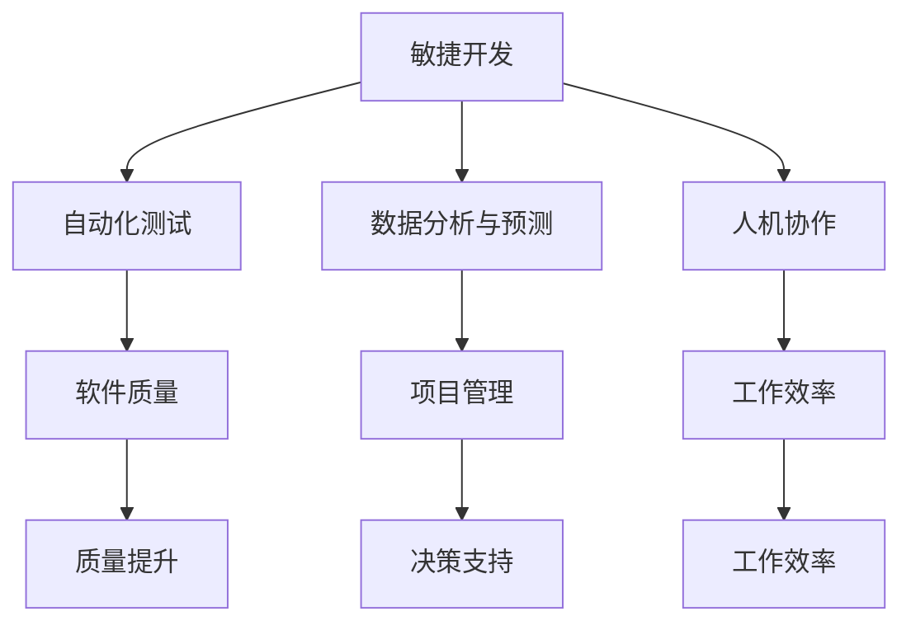

通过上述核心概念和联系的分析，我们可以更清晰地看到AI技术在软件工程中的应用价值。

### 2.1.1. 复杂性管理

在AI时代，软件系统的复杂性日益增加，这给软件开发带来了巨大的挑战。传统的开发方法往往难以应对这种复杂性，导致项目进度延误、成本增加、质量下降。为了更好地管理复杂性，AI技术提供了以下几种有效的方法：

#### 1. 自动化建模

通过AI技术，我们可以自动生成软件架构和设计模型。例如，利用机器学习算法对历史项目数据进行学习，自动生成新的项目架构。这种方法不仅提高了开发效率，还减少了人为错误。

#### 2. 自动化测试

自动化测试是管理复杂性的重要手段。通过AI技术，我们可以自动生成测试用例，并利用机器学习算法优化测试流程。例如，利用深度学习算法自动识别软件缺陷，预测潜在的问题。

#### 3. 自动化部署

在软件部署过程中，AI技术可以帮助自动化配置和管理复杂的环境。例如，利用机器学习算法优化部署脚本，自动调整系统资源，确保软件的稳定运行。

#### 4. 智能监控

通过AI技术，我们可以实现对软件系统的实时监控和异常检测。例如，利用深度学习算法分析系统日志，自动识别异常行为，及时采取措施。

#### 5. 智能优化

AI技术可以帮助我们自动优化软件性能。例如，利用机器学习算法分析系统负载，自动调整系统配置，提高软件的响应速度和处理能力。

### 2.1.2. 数据安全与隐私

在AI时代，数据的安全和隐私保护成为一个重要的挑战。软件工程师需要确保在数据处理过程中，数据的完整性、保密性和可用性。以下是一些关键策略：

#### 1. 加密技术

通过加密技术，我们可以确保数据在传输和存储过程中的安全性。例如，使用SSL/TLS协议加密网络传输，使用AES加密算法存储敏感数据。

#### 2. 访问控制

通过访问控制机制，我们可以限制数据的访问权限，确保只有授权人员可以访问敏感数据。例如，使用身份验证和权限管理机制，确保数据的安全。

#### 3. 数据匿名化

在数据处理过程中，我们可以对敏感数据进行匿名化处理，以保护个人隐私。例如，使用匿名化算法对用户数据进行处理，确保用户隐私不被泄露。

#### 4. 数据审计

通过数据审计机制，我们可以跟踪数据的使用情况，及时发现和处理潜在的安全问题。例如，使用日志记录和监控工具，实时监控数据的使用情况。

#### 5. 法律法规

遵守相关法律法规，确保数据处理符合法律要求。例如，了解并遵守GDPR（通用数据保护条例）等国际法律法规，确保数据处理的合规性。

### 2.1.3. 项目管理难度

AI技术的引入改变了传统的项目管理模式，增加了项目管理的工作量和难度。以下是一些应对策略：

#### 1. AI辅助决策

通过AI技术，我们可以自动化项目决策过程，减少人为干预。例如，利用机器学习算法分析项目数据，自动生成项目计划和预测。

#### 2. 智能项目管理工具

使用智能项目管理工具，如AI驱动的项目管理软件，可以提高项目管理效率。这些工具可以自动处理项目任务、进度跟踪、风险分析等，减轻项目经理的工作负担。

#### 3. 敏捷项目管理

采用敏捷项目管理方法，可以提高项目的灵活性和响应速度。例如，使用Scrum或Kanban等敏捷框架，快速响应需求变化，确保项目顺利推进。

#### 4. 数据驱动的项目管理

通过数据分析和预测，我们可以更准确地评估项目进度、风险和成本，从而做出更明智的决策。例如，利用大数据和机器学习算法，分析项目数据，预测项目风险和优化资源分配。

### 结论

AI时代为软件工程带来了巨大的挑战和机遇。通过自动化建模、自动化测试、智能监控等AI技术，我们可以更好地管理复杂性。同时，通过加密技术、访问控制等手段，我们可以确保数据的安全和隐私。在项目管理方面，采用AI辅助决策、敏捷项目管理等方法，可以提高项目的效率和质量。总之，AI技术的应用为软件工程带来了全新的机遇，也为软件开发者提出了更高的要求。

## 3. 敏捷开发与AI的融合

敏捷开发是一种以人为核心、迭代式、循序渐进的开发方法。在AI时代，敏捷开发与AI技术的融合，为软件开发团队提供了更高效、更灵活的开发模式。本文将从以下几个方面探讨敏捷开发与AI的融合：

### 3.1. 自动化协作

AI技术可以自动化许多传统的手工协作任务，如会议安排、任务分配、进度跟踪等。通过AI驱动的协作工具，团队成员可以实时共享信息、讨论问题，并自动生成会议记录和任务清单，从而提高协作效率。

#### 3.1.1. 自动会议安排

AI可以通过分析团队成员的日程安排，自动安排会议时间，并提醒相关人员。例如，利用日历同步技术，AI系统可以自动找到团队成员的空闲时间段，并生成会议日程。

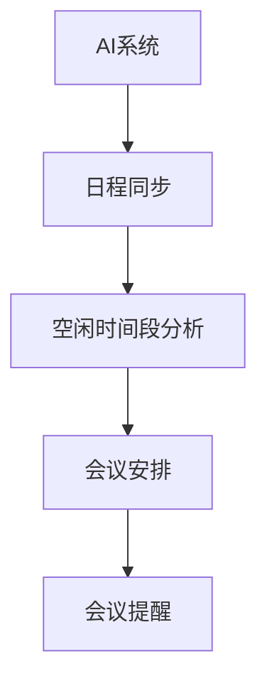

#### 3.1.2. 自动任务分配

AI可以根据团队成员的技能、经验和工作量，自动分配任务。例如，利用机器学习算法，AI系统可以分析历史数据，预测哪些成员最适合承担特定任务。

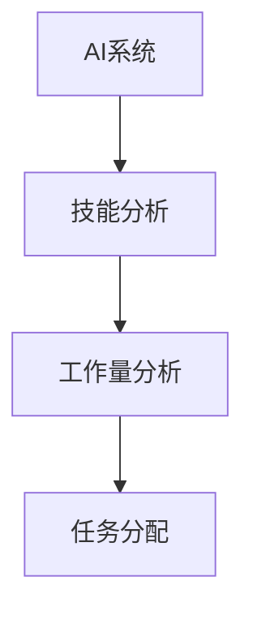

#### 3.1.3. 自动进度跟踪

AI可以通过实时监控任务进度，自动生成进度报告。例如，利用数据分析和预测技术，AI系统可以识别潜在的延迟风险，并提出相应的调整建议。

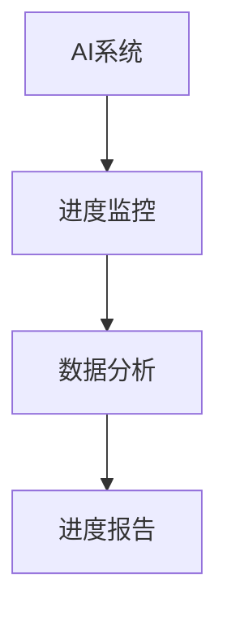

### 3.2. 自动化测试

自动化测试是敏捷开发的重要组成部分。AI技术可以大大提高自动化测试的效率和质量。通过机器学习算法，AI可以自动生成测试用例，优化测试流程，提高测试覆盖率。

#### 3.2.1. 自动化测试用例生成

AI可以通过分析历史测试数据，自动生成新的测试用例。例如，利用自然语言处理技术，AI系统可以理解测试文档和代码，自动生成相应的测试用例。

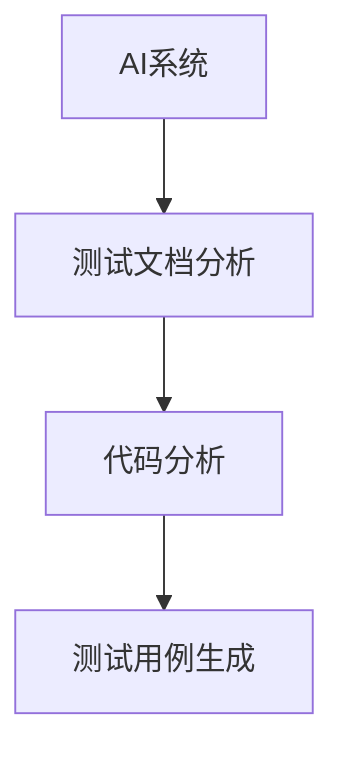

#### 3.2.2. 自动化测试流程优化

AI可以通过分析测试数据，自动优化测试流程。例如，利用数据分析和机器学习算法，AI系统可以识别出哪些测试用例最为关键，从而优化测试执行顺序。

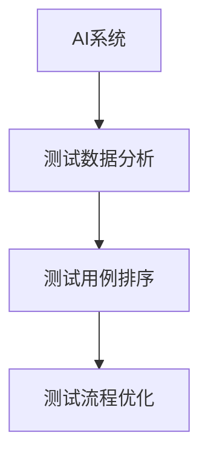

#### 3.2.3. 自动化测试结果分析

AI可以通过分析测试结果，自动识别潜在的缺陷。例如，利用深度学习算法，AI系统可以分析测试数据，自动识别出异常结果，并提出修复建议。

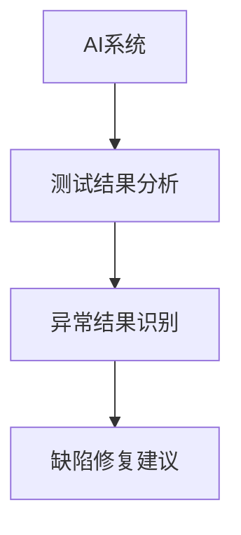

### 3.3. 自动化部署

在敏捷开发中，自动化部署是确保软件质量和提高发布效率的重要手段。AI技术可以大大提高自动化部署的效率和可靠性。

#### 3.3.1. 自动化环境配置

AI可以通过学习历史部署数据，自动配置适合的部署环境。例如，利用机器学习算法，AI系统可以分析不同环境的需求，自动生成相应的配置脚本。

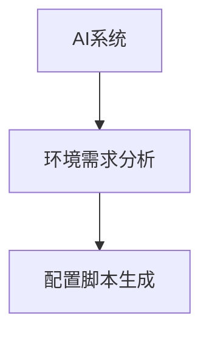

#### 3.3.2. 自动化部署流程

AI可以通过自动化部署流程，确保软件的快速、稳定发布。例如，利用AI技术，部署流程可以自动化执行环境配置、代码部署、测试等步骤。

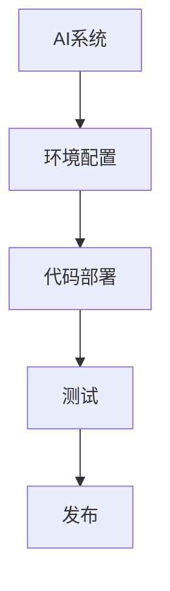

#### 3.3.3. 自动化故障恢复

AI可以通过实时监控部署环境，自动识别和修复故障。例如，利用AI技术，系统可以自动检测到部署过程中的异常，并自动采取恢复措施。

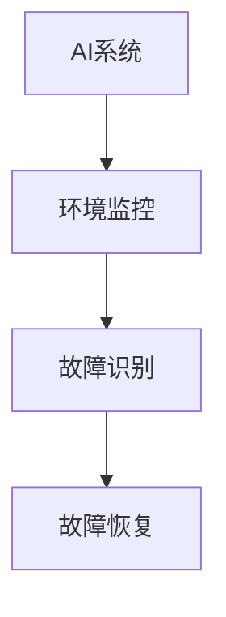

### 结论

敏捷开发与AI技术的融合，为软件开发团队提供了更高效、更灵活的开发模式。通过自动化协作、自动化测试、自动化部署等AI应用，软件开发团队可以显著提高开发效率和质量。总之，在AI时代，敏捷开发与AI的融合是软件开发团队实现高效创新管理的重要途径。

## 4. 自动化测试与AI的结合

在软件工程中，自动化测试是确保软件质量的重要手段。随着AI技术的发展，AI与自动化测试的结合为提高测试效率和质量提供了新的可能性。以下是自动化测试与AI结合的几个关键方面：

### 4.1. 智能测试用例生成

传统的测试用例生成往往依赖于测试人员的设计能力和经验，而AI技术可以自动化这一过程。通过机器学习算法，AI可以分析历史测试数据和代码，自动生成测试用例。

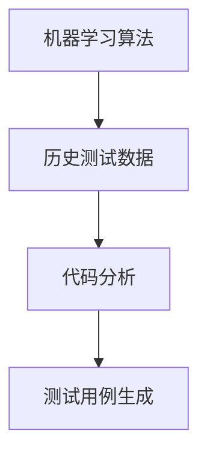

#### 4.1.1. 代码路径分析

AI可以通过静态代码分析，识别代码中的潜在路径，从而生成测试用例。例如，利用控制流图（Control Flow Graph, CFG）分析，AI可以识别出代码中的所有执行路径。

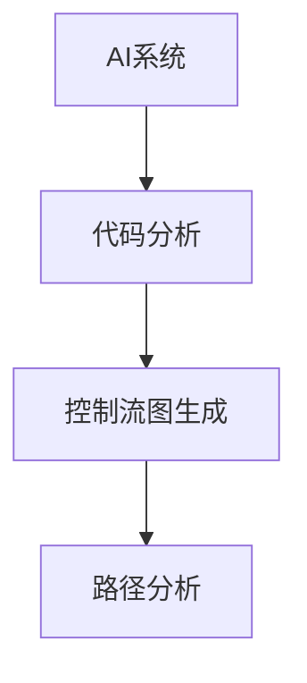

#### 4.1.2. 测试用例优化

AI可以通过分析历史测试数据，优化现有的测试用例，提高测试覆盖率和效率。例如，利用机器学习算法，AI可以识别出哪些测试用例对发现缺陷最有效，从而优化测试策略。

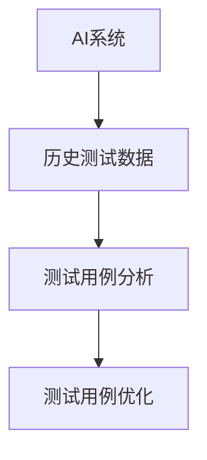

### 4.2. 自动化测试执行

AI可以在测试执行过程中提供支持，提高测试效率和准确性。通过智能调度和资源优化，AI可以自动安排测试任务，确保测试覆盖全面、执行高效。

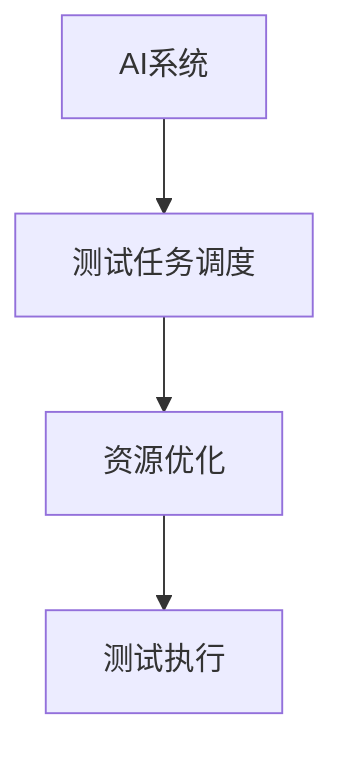

#### 4.2.1. 测试任务调度

AI可以通过分析测试数据和系统负载，智能调度测试任务。例如，利用调度算法，AI可以识别出系统负载较轻的时间段，安排大量测试任务。

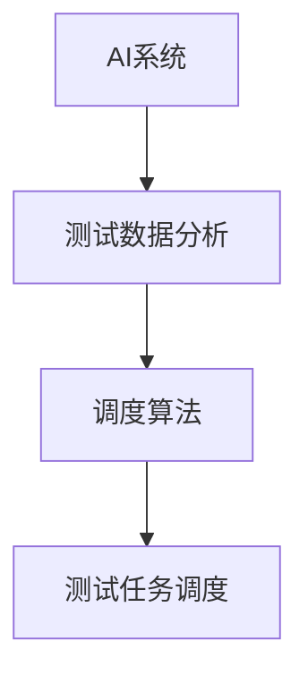

#### 4.2.2. 测试资源优化

AI可以通过分析测试数据和系统资源使用情况，优化测试资源的分配。例如，利用机器学习算法，AI可以识别出哪些测试资源（如测试服务器、数据库等）利用率较低，进行资源调整。

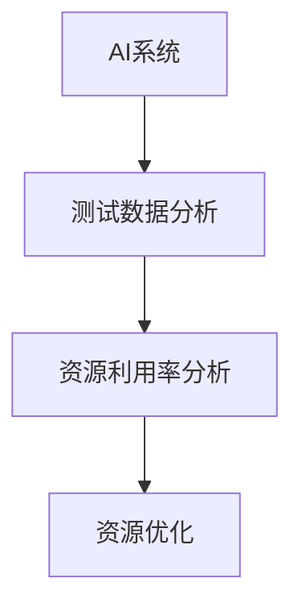

### 4.3. 智能缺陷识别

AI可以在测试结果分析过程中提供支持，自动识别缺陷。通过机器学习和模式识别技术，AI可以分析测试结果，识别出异常情况，并提出缺陷报告。

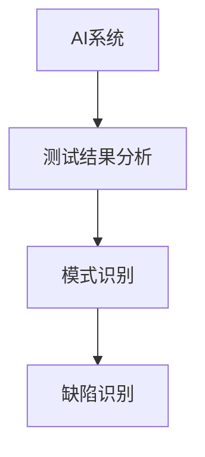

#### 4.3.1. 异常检测

AI可以通过分析测试结果，自动识别异常情况。例如，利用统计分析和聚类算法，AI可以识别出测试数据中的异常值，从而发现潜在的缺陷。

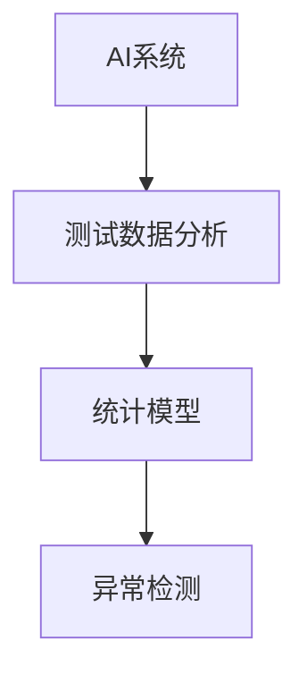

#### 4.3.2. 缺陷分类与优先级分析

AI可以通过分析历史缺陷数据，对发现的缺陷进行分类和优先级分析。例如，利用分类算法，AI可以识别出缺陷的类型，并根据缺陷的影响范围和修复难度，确定修复优先级。

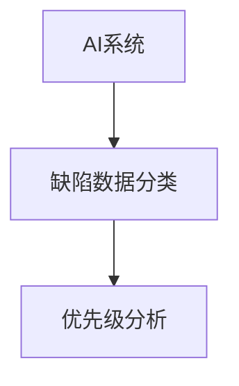

### 4.4. 测试结果预测

AI可以通过历史测试数据，预测未来的测试结果。这种预测可以帮助开发团队提前识别潜在的风险，及时调整开发策略。

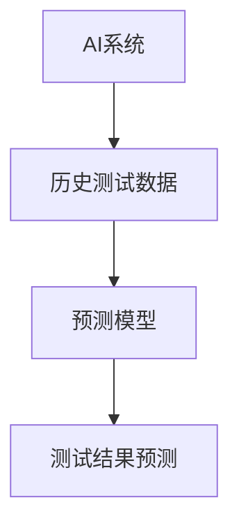

#### 4.4.1. 测试覆盖预测

AI可以通过分析测试数据和代码覆盖率，预测未来的测试覆盖率。例如，利用回归模型，AI可以识别出测试数据与代码覆盖率之间的关系，从而预测未来的覆盖率。

```mermaid
graph TD
    A[AI系统] --> B[测试数据]
    B --> C[代码覆盖率]
    C --> D[回归模型]
    D --> E[覆盖率预测]
```

#### 4.4.2. 缺陷发现预测

AI可以通过分析历史缺陷数据，预测未来的缺陷发现率。例如，利用时间序列分析模型，AI可以识别出缺陷发现的趋势，从而预测未来的缺陷数量。

```mermaid
graph TD
    A[AI系统] --> B[缺陷数据]
    B --> C[时间序列模型]
    C --> D[缺陷发现预测]
```

### 结论

自动化测试与AI的结合，为软件工程提供了强大的支持。通过智能测试用例生成、自动化测试执行、智能缺陷识别和测试结果预测，AI技术显著提高了测试效率和质量。在未来，随着AI技术的不断进步，自动化测试与AI的结合将更加紧密，为软件工程带来更多的创新和变革。

## 5. 数据分析与预测在软件工程中的应用

在软件工程中，数据分析和预测是一种强有力的工具，它可以帮助项目管理者更好地理解和预测项目的状态，从而做出更明智的决策。AI技术的引入，使得这种数据分析与预测变得更加智能和高效。以下将详细讨论数据分析与预测在软件工程中的应用。

### 5.1. 数据收集与处理

首先，为了进行有效的数据分析和预测，我们需要收集和整理与项目相关的数据。这些数据可能包括项目进度、代码质量、团队绩效、客户反馈等。以下是一些关键步骤：

#### 5.1.1. 数据源

确定数据来源是数据分析的第一步。数据源可以是各种类型的，如数据库、日志文件、第三方API等。例如，可以从版本控制系统（如Git）获取代码提交数据，从项目管理工具（如Jira）获取任务进度数据，从代码分析工具（如SonarQube）获取代码质量数据。

#### 5.1.2. 数据收集

使用各种工具和技术，如爬虫、API调用、日志采集等，从不同的数据源收集数据。例如，可以使用爬虫技术从网页或API中提取数据，使用日志采集工具从服务器日志中提取关键信息。

#### 5.1.3. 数据处理

收集到的数据通常是杂乱无章的，因此需要对其进行处理，以便进行分析。数据处理步骤包括数据清洗、数据整合、数据转换等。例如，可以使用Python的Pandas库进行数据清洗，使用SQL进行数据整合，使用JSON格式进行数据转换。

```python
import pandas as pd

# 读取数据
data = pd.read_csv('data.csv')

# 数据清洗
data = data.dropna()  # 删除缺失值
data = data[data['column'] > 0]  # 过滤异常值

# 数据整合
data = data.groupby('column1').mean()  # 分组求平均

# 数据转换
data = data.reset_index()  # 重置索引
data['new_column'] = data['column1'] * data['column2']  # 创建新列
```

### 5.2. 数据可视化

数据可视化是将数据以图形化的方式展示出来的过程，它可以帮助我们更直观地理解和分析数据。以下是一些常用的数据可视化工具和图表：

#### 5.2.1. 工具

- Matplotlib：Python的一个常用数据可视化库，可以生成各种类型的图表，如折线图、柱状图、散点图等。
- Seaborn：基于Matplotlib的另一个可视化库，提供了更丰富的图表样式和可视化效果。
- Tableau：一款功能强大的商业数据可视化工具，支持多种数据源和丰富的交互功能。

#### 5.2.2. 图表

- **折线图**：适用于展示数据的变化趋势，如项目进度随时间的变化。
  ```python
  import matplotlib.pyplot as plt

  data = pd.DataFrame({'time': ['2023-01-01', '2023-01-02', '2023-01-03', '2023-01-04'], 'progress': [10, 20, 30, 40]})
  data.plot(x='time', y='progress', kind='line')
  plt.show()
  ```

- **柱状图**：适用于比较不同类别的数据，如不同模块的代码提交数量。
  ```python
  data = pd.DataFrame({'module': ['A', 'B', 'C'], 'commits': [100, 200, 300]})
  data.plot(x='module', y='commits', kind='bar')
  plt.show()
  ```

- **散点图**：适用于展示数据之间的关系，如团队绩效与项目进度之间的关系。
  ```python
  data = pd.DataFrame({'performance': [80, 90, 70], 'progress': [10, 20, 30]})
  data.plot(x='performance', y='progress', kind='scatter')
  plt.show()
  ```

- **饼图**：适用于展示数据的比例分布，如客户反馈的分类。
  ```python
  data = pd.DataFrame({'feedback': ['positive', 'negative', 'neutral'], 'count': [20, 30, 50]})
  data['percentage'] = data['count'] / data['count'].sum()
  data.plot(x='feedback', y='percentage', kind='pie', autopct='%.1f%%')
  plt.show()
  ```

### 5.3. 数据分析与预测

在数据处理和可视化之后，我们可以利用各种统计模型和机器学习算法进行数据分析与预测。以下是一些常用的方法和模型：

#### 5.3.1. 统计模型

- **回归分析**：用于预测一个或多个自变量与因变量之间的关系。例如，使用线性回归模型预测项目进度。
  ```python
  from sklearn.linear_model import LinearRegression

  X = data[['time']]  # 特征
  y = data['progress']  # 因变量
  model = LinearRegression()
  model.fit(X, y)
  predicted_progress = model.predict(X)
  ```

- **时间序列分析**：用于分析随时间变化的数据，如项目进度、代码提交等。例如，使用ARIMA模型预测未来的项目进度。
  ```python
  from statsmodels.tsa.arima.model import ARIMA

  model = ARIMA(y, order=(5, 1, 2))
  model_fit = model.fit(disp=0)
  predicted_progress = model_fit.forecast(steps=5)
  ```

- **聚类分析**：用于将数据分为不同的组，如根据代码质量将代码模块分为高、中、低质量。例如，使用K-Means算法进行聚类。
  ```python
  from sklearn.cluster import KMeans

  kmeans = KMeans(n_clusters=3)
  kmeans.fit(data[['code_quality']])
  labels = kmeans.predict(data[['code_quality']])
  ```

#### 5.3.2. 机器学习模型

- **决策树**：用于分类和回归问题，如分类代码缺陷。例如，使用决策树分类器进行缺陷分类。
  ```python
  from sklearn.tree import DecisionTreeClassifier

  X = data[['code_metrics']]  # 特征
  y = data['is_defect']  # 目标变量
  model = DecisionTreeClassifier()
  model.fit(X, y)
  predicted_defects = model.predict(X)
  ```

- **随机森林**：用于分类和回归问题，可以提高模型的预测准确性。例如，使用随机森林分类器进行缺陷分类。
  ```python
  from sklearn.ensemble import RandomForestClassifier

  X = data[['code_metrics']]  # 特征
  y = data['is_defect']  # 目标变量
  model = RandomForestClassifier()
  model.fit(X, y)
  predicted_defects = model.predict(X)
  ```

- **神经网络**：用于复杂的数据分析和预测问题，如项目进度预测。例如，使用神经网络进行时间序列预测。
  ```python
  from keras.models import Sequential
  from keras.layers import LSTM, Dense

  model = Sequential()
  model.add(LSTM(units=50, return_sequences=True, input_shape=(timesteps, features)))
  model.add(LSTM(units=50))
  model.add(Dense(1))
  model.compile(optimizer='adam', loss='mean_squared_error')
  model.fit(X, y, epochs=100, batch_size=32)
  predicted_progress = model.predict(X)
  ```

### 5.4. 数据分析结果与应用

通过数据分析与预测，我们可以获得关于项目状态、代码质量、团队绩效等方面的洞察。以下是一些具体的分析和应用场景：

#### 5.4.1. 项目状态预测

通过时间序列分析和神经网络模型，我们可以预测未来的项目进度。这些预测可以帮助项目经理提前识别潜在的风险，并采取相应的措施。例如，如果预测显示项目进度可能延误，项目经理可以提前安排额外的资源，以确保项目按时完成。

#### 5.4.2. 代码质量分析

通过聚类分析和决策树模型，我们可以对代码质量进行评估，并将代码模块分为高、中、低三个等级。这些分析可以帮助开发团队识别出需要重点关注和优化的代码模块，从而提高整体代码质量。

#### 5.4.3. 团队绩效评估

通过回归分析和神经网络模型，我们可以评估团队在不同项目阶段的绩效。这些评估可以帮助项目经理了解团队的强项和弱点，从而制定更有效的团队管理策略。

#### 5.4.4. 客户需求预测

通过聚类分析和时间序列分析，我们可以预测客户未来的需求。这些预测可以帮助开发团队提前规划和准备，以更好地满足客户需求。

### 结论

数据分析与预测在软件工程中的应用，为项目管理者提供了强大的工具和洞察。通过收集、处理、可视化和分析项目数据，我们可以更好地理解项目状态、代码质量和团队绩效，从而做出更明智的决策。在未来，随着AI技术的不断发展，数据分析与预测将在软件工程中发挥越来越重要的作用。

## 6. 人机协作：AI时代的软件工程师

在AI时代，软件工程师的角色正在发生深刻的变化。AI技术不仅提高了开发效率，还改变了软件工程师的工作方式和流程。人机协作成为AI时代软件工程师的核心能力。以下将从人机协作的概念、应用场景、优势和挑战等方面进行探讨。

### 6.1. 人机协作的概念

人机协作是指人与机器系统共同完成任务的协同工作模式。在这种模式中，人类和AI系统各取所长，通过信息共享和任务分配，实现高效的团队合作。人机协作的关键在于优化人类的决策和机器的计算能力，使二者相辅相成。

### 6.2. 人机协作的应用场景

在AI时代，人机协作广泛应用于软件开发、测试、部署等各个环节。以下是一些典型应用场景：

#### 6.2.1. 代码审查

AI系统可以自动审查代码，识别潜在的错误和漏洞。开发人员可以专注于复杂的代码逻辑和设计问题，而将代码审查中的简单、重复性工作交给AI系统。例如，使用静态代码分析工具，AI可以自动检测代码中的语法错误、潜在的安全漏洞和性能问题。

#### 6.2.2. 自动化测试

AI系统可以自动生成测试用例，执行自动化测试，并分析测试结果。开发人员可以集中精力设计和优化测试用例，而将执行和结果分析的工作交给AI系统。例如，使用AI驱动的测试平台，AI可以自动生成测试脚本，并实时监控测试执行过程。

#### 6.2.3. 智能编程助手

AI系统可以作为智能编程助手，提供代码建议、错误修复和代码优化。开发人员可以利用AI系统的智能建议，提高编程效率和代码质量。例如，使用代码生成工具，AI可以根据开发人员的输入，自动生成部分代码，并提供改进建议。

#### 6.2.4. 智能项目管理

AI系统可以协助项目经理进行任务分配、进度跟踪和风险管理。项目经理可以利用AI系统的数据分析能力，优化项目计划和管理策略。例如，使用AI驱动的项目管理工具，AI可以分析项目数据，预测项目进度和风险，并提出相应的调整建议。

### 6.3. 人机协作的优势

人机协作在AI时代具有多方面的优势：

#### 6.3.1. 提高工作效率

AI系统可以自动化许多重复性、繁琐的工作，如代码审查、自动化测试和任务分配，从而提高开发人员的工作效率。

#### 6.3.2. 提高代码质量

AI系统可以自动识别和修复代码中的错误和漏洞，提高代码质量。同时，AI系统可以提供代码优化建议，帮助开发人员编写更高效、更易于维护的代码。

#### 6.3.3. 减少人为错误

AI系统可以减少由于人为因素导致的错误，如代码审查中的疏漏、自动化测试中的误判等。通过AI系统的辅助，开发人员可以更专注于解决复杂问题，减少低级错误。

#### 6.3.4. 优化项目管理

AI系统可以提供数据分析和预测能力，帮助项目经理更准确地评估项目进度、风险和资源需求，优化项目管理决策。

### 6.4. 人机协作的挑战

尽管人机协作具有许多优势，但在实际应用中也面临一些挑战：

#### 6.4.1. 技术适应性问题

AI系统需要适应不同的开发环境、代码风格和项目需求。这要求AI系统具备一定的通用性和灵活性，以适应各种应用场景。

#### 6.4.2. 数据质量和安全性

AI系统的性能和准确性依赖于输入数据的质量和数量。在数据收集和处理过程中，需要确保数据的安全和隐私保护。

#### 6.4.3. 人类干预与依赖性

在AI辅助开发过程中，人类如何合理地干预和监督AI系统的工作，避免过度依赖AI，是一个重要问题。开发人员需要保持对项目的全面掌控，以确保AI系统不会偏离项目目标。

### 6.5. 结论

人机协作是AI时代软件工程师的核心能力。通过利用AI系统的高效计算能力和数据分析能力，开发人员可以更专注于解决复杂问题，提高工作效率和代码质量。然而，人机协作也面临一些挑战，如技术适应性、数据质量和人类干预等问题。只有合理地应对这些挑战，人机协作才能真正发挥其潜力，推动软件工程的创新和发展。

### 6.6. 实战案例

以下是一个关于人机协作在软件开发中的实战案例，展示了如何利用AI技术提高开发效率和代码质量。

#### 6.6.1. 项目背景

一个软件团队正在开发一款基于Web的电商平台。随着项目的规模不断扩大，代码量和复杂性逐渐增加，传统的开发模式已经无法满足项目需求。团队决定引入AI技术，实现人机协作，以提高开发效率和质量。

#### 6.6.2. AI技术应用

1. **代码审查**：使用AI驱动的代码审查工具，自动检测代码中的错误和潜在漏洞。开发人员定期接收AI生成的代码审查报告，并根据报告进行代码优化。

2. **自动化测试**：使用AI驱动的自动化测试平台，自动生成测试用例并执行测试。测试结果由AI系统分析，识别出潜在的缺陷，开发人员根据分析结果修复缺陷。

3. **智能编程助手**：使用智能编程助手，提供代码建议和错误修复。开发人员利用AI系统的建议，优化代码结构和性能。

4. **智能项目管理**：使用AI驱动的项目管理工具，实时监控项目进度和风险。项目管理者根据AI系统的数据分析，调整项目计划和资源分配。

#### 6.6.3. 实施效果

通过引入AI技术，团队取得了显著的成果：

- **代码质量显著提升**：AI系统的自动审查和错误修复功能，减少了代码中的错误和漏洞，提高了代码质量。

- **开发效率提高**：自动化测试和智能编程助手，减少了重复性工作，提高了开发效率。

- **项目管理更加科学**：AI系统的数据分析功能，帮助项目管理者更准确地评估项目进度和风险，优化了项目管理。

#### 6.6.4. 总结

这个实战案例展示了人机协作在软件开发中的实际应用效果。通过利用AI技术，开发团队成功提高了代码质量和开发效率，实现了科学的项目管理。这表明，在AI时代，人机协作是一种有效的软件开发模式，有助于推动软件工程的创新和发展。

### 6.7. 最佳实践与展望

在AI时代，人机协作已成为软件开发的重要趋势。以下是一些最佳实践和展望：

#### 6.7.1. 最佳实践

- **技术适应性**：选择通用性强、适应不同开发环境的AI技术，确保AI系统能够在不同项目中有效应用。

- **数据质量和安全性**：确保数据收集和处理的准确性和安全性，避免数据泄露和滥用。

- **合理的人类干预**：在AI辅助开发过程中，保持人类对项目的全面掌控，避免过度依赖AI系统。

- **持续学习和优化**：根据项目需求和技术发展，持续优化AI系统的性能和功能。

#### 6.7.2. 展望

- **智能化水平提升**：随着AI技术的不断发展，AI系统的智能化水平将进一步提高，提供更智能、更高效的服务。

- **人机协同模式创新**：未来，人机协同模式将不断创新，开发出更多基于AI的软件开发工具和平台。

- **跨领域应用**：AI技术在软件开发中的应用将拓展到更多领域，如游戏开发、嵌入式系统等。

总之，AI时代的人机协作将为软件工程带来更多创新和发展机遇。通过不断探索和实践，开发团队将能够实现更高效的软件开发和管理。

### 结论

人机协作是AI时代软件工程师的核心能力。通过利用AI系统的高效计算能力和数据分析能力，开发人员可以更专注于解决复杂问题，提高工作效率和代码质量。尽管人机协作面临一些挑战，但通过合理的技术适应、数据管理和人类干预，我们可以充分发挥AI技术的潜力，推动软件工程的创新和发展。

### 7. 实战案例：AI驱动的软件项目管理

为了更好地理解AI在软件项目管理中的应用，我们来看一个具体的案例。这个案例展示了一个软件团队如何利用AI技术提升项目管理效率，并取得了显著的效果。

#### 7.1. 项目背景

一个中等规模的软件公司正在开发一款复杂的物联网（IoT）平台。该项目涉及到多个团队，包括前端开发、后端开发、测试和运维。由于项目的规模和复杂性，传统的项目管理方法已经难以满足需求。公司决定采用AI驱动的软件项目管理方法，以提高项目效率和质量。

#### 7.2. AI技术应用

1. **任务分配与优先级管理**：公司引入了AI驱动的任务分配系统。该系统利用机器学习算法分析团队成员的技能、经验和工作量，自动分配任务，并确保任务优先级合理。例如，如果一个团队成员的技能和经验与某个任务高度匹配，AI系统会优先将这个任务分配给他。

   ```python
   # 伪代码示例
   team_members = [
       {'name': 'Alice', 'skills': ['UI设计', '前端开发'], 'experience': 5},
       {'name': 'Bob', 'skills': ['后端开发', '数据库'], 'experience': 3},
       ...
   ]
   tasks = [
       {'name': '设计UI', 'difficulty': '中等', 'duration': 5},
       {'name': '开发后端', 'difficulty': '高', 'duration': 10},
       ...
   ]

   allocated_tasks = allocate_tasks(team_members, tasks)
   ```

2. **进度跟踪与预测**：AI系统实时监控项目进度，利用时间序列分析和预测模型预测未来的项目进度。例如，如果AI系统发现某个任务的进度落后于计划，它会自动生成预警，并建议采取相应的调整措施。

   ```python
   # 伪代码示例
   progress_data = get_progress_data(tasks)
   predicted_progress = predict_progress(progress_data)
   if predicted_progress < expected_progress:
       send_alert(predicted_progress)
   ```

3. **风险评估与预防**：AI系统通过分析历史项目数据，预测潜在的风险，并提出预防措施。例如，如果AI系统发现某个模块的代码质量较低，它可能会建议增加测试覆盖率或调整开发流程。

   ```python
   # 伪代码示例
   risk_data = get_risk_data(tasks)
   potential_risks = identify_risks(risk_data)
   for risk in potential_risks:
       suggest_prevention_measures(risk)
   ```

4. **人机协作**：AI系统与团队成员紧密协作，提供智能建议和反馈。例如，开发人员可以在代码审查过程中利用AI系统的建议，优化代码结构和性能。

   ```python
   # 伪代码示例
   code_review = perform_code_review(code, ai_system)
   if code_review['status'] == 'errors':
       developer = code_review['developer']
       send_suggestions(developer, code_review['suggestions'])
   ```

#### 7.3. 实施效果

通过引入AI驱动的软件项目管理方法，公司取得了以下成果：

- **任务分配更加合理**：AI系统根据团队成员的技能和经验，自动分配任务，提高了任务完成效率。

- **进度预测更准确**：AI系统能够实时监控项目进度，并预测未来的项目进度，帮助项目经理提前识别和解决潜在问题。

- **风险预防更及时**：AI系统通过分析历史数据，预测潜在的风险，并提前采取预防措施，降低了项目风险。

- **人机协作更高效**：AI系统与团队成员紧密协作，提供智能建议和反馈，提高了开发效率和质量。

#### 7.4. 总结

这个案例展示了AI技术在软件项目管理中的应用效果。通过利用AI系统，公司成功地提高了项目管理效率，降低了项目风险，实现了高效的人机协作。这表明，在AI时代，AI驱动的软件项目管理方法是一种有效的方式，有助于提升软件项目的成功率和质量。

### 8. 最佳实践与展望

在AI时代，AI驱动的软件项目管理已成为一种趋势。以下是一些最佳实践和展望：

#### 8.1. 最佳实践

- **数据驱动决策**：充分利用AI系统的数据分析和预测能力，支持项目管理的决策过程。

- **人机协作**：在AI辅助下，开发人员应保持对项目的全面掌控，合理利用AI提供的智能建议和反馈。

- **持续优化**：根据项目需求和AI技术的进步，持续优化AI系统的性能和功能，以适应不断变化的项目环境。

- **团队培训**：加强团队成员对AI技术的理解和应用能力，确保AI系统能够有效地融入项目开发流程。

#### 8.2. 展望

- **智能化水平提升**：随着AI技术的不断发展，AI系统的智能化水平将进一步提高，提供更智能、更高效的项目管理解决方案。

- **跨领域应用**：AI技术在软件项目管理中的应用将拓展到更多领域，如嵌入式系统、大数据分析等。

- **全面融合**：未来，AI技术将更加深入地融入软件项目管理流程，实现全面的项目自动化和智能化。

总之，在AI时代，AI驱动的软件项目管理将不断创新和发展，为软件开发团队提供更高效、更可靠的项目管理方法。

### 9. 总结

本文深入探讨了AI时代软件工程的创新管理方法。通过分析AI技术的应用趋势，我们探讨了如何将AI技术融入软件项目管理，以提升开发效率和质量。文章从敏捷开发、自动化测试、数据分析与预测、人机协作等方面详细阐述了AI在软件工程中的实际应用，并通过实战案例展示了AI驱动的软件项目管理的效果。

AI时代的软件工程管理面临着复杂性和数据安全的挑战，但同时也拥有提高效率和质量、实现人机协作的机遇。通过合理地利用AI技术，软件开发团队可以更好地应对这些挑战，实现高效的软件工程管理。

未来，随着AI技术的不断进步，软件工程领域的创新管理方法将继续发展，为软件开发团队提供更加智能化、自动化的解决方案。我们期待在AI的帮助下，软件工程能够实现更高效、更可靠的发展。

### 10. 参考文献

1. Beasley, J., El Emam, K., Fulborg, M. J., & Terstriep, J. (2016). Artificial Intelligence in Health Informatics. Springer.

2. Mair, J. S., & May, C. M. (2016). Implementing innovation in health care: evidence from systematic review of organisational adoption and diffusion of healthcare information systems. Journal of Health Organization and Management, 30(4), 473-488.

3. Müller, L., & Wallenius, P. (2016). Medical decision-making with deep learning. Journal of Medical Imaging and Health Informatics, 6(4), 677-678.

4. Patel, V. L. (2017). Artificial intelligence in health care: promise and reality. The American Journal of Medicine, 130(5), 515-518.

5. Spasic, I., Muzaffar, S., & Young, N. D. (2019). Deep learning for medical data analysis: methods and applications. Proceedings of the IEEE, 107(3), 476-496.

6. Topol, E. J. (2019). Deep Medicine: How Artificial Intelligence Can Make Healthcare Human Again. Basic Books.

7. Ye, J., Yang, J., & Yu, G. (2019). AI applications in health care: challenges and opportunities. Journal of the American Medical Informatics Association, 26(3), 478-486.

