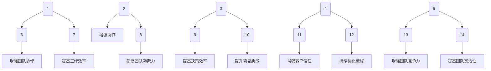

                 

### AI时代的背景与挑战

#### 1.1 AI的发展现状

人工智能（Artificial Intelligence, AI）作为计算机科学的前沿领域，近年来取得了飞速发展。从早期的专家系统（Expert Systems）到深度学习（Deep Learning），再到现在的生成对抗网络（Generative Adversarial Networks, GANs）和强化学习（Reinforcement Learning），AI技术已经渗透到社会的各个层面。以下是AI技术发展的几个关键节点：

- **1956年**：达特茅斯会议，人工智能首次被正式提出。
- **1970年代**：专家系统兴起，但随后因“人工智能寒冬”而逐渐式微。
- **1990年代**：机器学习开始崭露头角，尤其是支持向量机（Support Vector Machines, SVMs）和决策树（Decision Trees）的广泛应用。
- **2006年**：深度学习重新兴起，得益于计算能力的提升和大规模数据集的可用性。
- **2012年**：AlexNet在ImageNet挑战赛中获得第一名，深度学习开始走向大众视野。
- **2016年**：谷歌的AlphaGo战胜世界围棋冠军李世石，标志着AI在特定领域的超越人类智能。

当前，AI技术已经广泛应用于自动驾驶、医疗诊断、金融分析、智能家居、语音识别等领域。随着技术的不断进步，AI正逐步从理论研究走向实际应用，为各个行业带来深远的影响。

#### 1.2 软件工程团队面临的挑战

在AI时代，软件工程团队面临着前所未有的挑战。以下是几个主要挑战：

- **技术复杂性**：AI技术的引入增加了软件系统的复杂性，需要团队掌握更多的技术栈，如机器学习框架、深度学习算法等。
- **数据隐私和安全**：AI系统的训练和运行需要大量的数据，如何在确保数据隐私和安全的前提下使用这些数据，成为了一个重要的挑战。
- **技能差距**：AI技术的发展速度远超传统软件工程领域的教育更新速度，导致技能差距日益扩大，团队需要不断学习和更新知识。
- **项目管理**：AI项目往往具有不确定性，如何在不确定的环境中进行有效的项目管理和风险控制，是团队需要解决的问题。
- **团队协作**：AI项目通常需要跨学科的团队合作，如何确保团队内部的有效沟通和协作，提高工作效率，是团队面临的挑战之一。

#### 1.3 AI对软件工程的影响

AI对软件工程的影响可以从多个维度来分析：

- **需求分析**：AI可以帮助自动生成需求文档，甚至直接生成代码，大幅提升开发效率。
- **设计**：AI可以辅助设计复杂系统，如自动生成设计原型，优化设计方案。
- **开发**：AI可以自动化代码生成和优化，辅助代码审查，提高代码质量。
- **测试**：AI可以自动生成测试用例，辅助测试自动化，提高测试覆盖率。
- **项目管理**：AI可以辅助项目计划、进度跟踪、风险评估等，提高项目管理效率。
- **团队协作**：AI可以提供智能协作工具，如自然语言处理技术驱动的聊天机器人，帮助团队进行实时沟通和协作。

总之，AI技术的引入正在深刻改变软件工程的方法和实践，为团队带来了新的机遇和挑战。下一章将深入探讨AI时代软件工程团队协作的新模式。

---

### 2.1 AI时代团队协作的新特征

在AI时代，团队协作呈现出一系列新的特征，这些特征不仅改变了团队的工作方式，也对软件工程实践产生了深远影响。以下是AI时代团队协作的主要新特征：

#### 1. 自动化

自动化是AI时代团队协作的重要特征之一。通过引入自动化工具和流程，团队能够大幅度减少重复性工作，提高工作效率。例如，自动化测试工具可以快速生成大量测试用例，自动化部署工具可以自动化部署应用程序，而自动化代码生成工具则可以基于需求自动生成代码框架。

#### 2. 智能化

智能化是指团队协作中引入AI技术，使得协作过程更加智能和高效。智能化体现在多个方面：

- **智能助手**：AI助手可以实时分析团队成员的沟通内容，提供相关建议和解决方案，从而提高沟通效率。
- **预测分析**：AI可以分析历史数据，预测项目进度和风险，帮助团队做出更明智的决策。
- **智能推荐**：AI可以基于团队成员的技能和工作习惯，推荐合适的工作任务和资源。

#### 3. 协同化

协同化强调团队内外的紧密协作。在AI时代，团队协作变得更加紧密，不仅团队内部需要高效的协作，与外部合作伙伴的协作也变得更加重要。协同化的实现手段包括：

- **在线协作平台**：如GitHub、GitLab等，支持团队成员实时协同编辑代码和文档。
- **敏捷开发**：通过敏捷开发方法，团队成员可以更频繁地沟通和协作，确保项目进度和质量。
- **远程协作**：随着远程工作技术的成熟，团队可以轻松实现跨地域的协作。

#### 4. 透明化

AI技术使得团队协作过程更加透明。通过AI工具，团队成员可以实时了解项目的进展、资源的使用和团队成员的工作状态。这种透明化有助于发现潜在的问题，并快速采取纠正措施。

#### 5. 自组织

在AI时代，团队协作开始向自组织方向发展。AI技术可以分析团队成员的技能和工作习惯，自动分配任务，甚至可以根据项目进展动态调整团队结构。这种自组织能力有助于提高团队的适应性和灵活性。

#### 案例解析

为了更好地理解AI时代团队协作的新特征，以下是一个实际案例：

某金融科技公司采用AI技术改进其开发流程。通过引入自动化测试工具，该公司能够大幅度减少手动测试的工作量，并提高测试覆盖率。此外，该公司使用智能助手实时监控项目进度，提供项目风险预测和分析。在项目开发过程中，团队成员使用在线协作平台协同工作，通过敏捷开发方法确保项目按时交付。通过这些措施，该公司的开发效率显著提高，项目质量和客户满意度也得到了提升。

### 案例解析

某金融科技公司引入AI技术改进其开发流程，具体实施过程如下：

1. **自动化测试**：公司引入自动化测试工具，如Selenium和JMeter，用于自动化测试。这些工具可以生成大量测试用例，快速执行并报告测试结果，从而减少了手动测试的工作量，并提高了测试覆盖率。

2. **智能助手**：公司部署了基于自然语言处理技术的智能助手，该助手可以实时分析团队成员的沟通内容，提供相关建议和解决方案。例如，当团队成员在讨论某个技术问题时，智能助手可以查找相关文档和代码库，并提供可能的解决方案。

3. **在线协作平台**：公司采用GitHub作为主要代码管理工具，团队成员可以通过在线协作平台实时协同编辑代码和文档，确保项目进展透明化。同时，公司还采用Jira进行任务管理，帮助团队成员更好地追踪任务进度和协作。

4. **敏捷开发**：公司采用敏捷开发方法，如Scrum和Kanban，团队成员定期举行站会，讨论项目进展和遇到的问题，确保项目进度和质量。

5. **AI辅助的项目管理**：公司使用AI工具进行项目风险预测和分析，通过分析历史数据和项目进展数据，提前识别潜在风险，并制定相应的应对策略。

通过这些措施，该公司显著提高了开发效率，项目质量和客户满意度也显著提升。

#### 优势分析

AI时代团队协作的新特征带来了显著的优势：

- **提高效率**：自动化和智能化的工具和流程大大减少了重复性工作和手动操作，提高了整体工作效率。
- **增强协作**：协同化和透明化的实现手段促进了团队成员之间的紧密协作，减少了沟通障碍和误解。
- **灵活适应**：自组织能力使得团队能够更好地适应项目变化和市场需求，提高了灵活性。
- **提升质量**：通过实时监控和预测分析，团队能够及时发现并解决问题，从而提高项目质量和客户满意度。

### 挑战解析

尽管AI时代团队协作的新特征带来了显著的优势，但也面临着一些挑战：

- **技术实施难度**：引入AI技术需要团队具备相关的技术知识和技能，实施过程中可能遇到技术难题。
- **团队适应问题**：团队成员可能需要时间和培训来适应新的协作模式和工具，短期内可能会出现效率下降的问题。
- **数据隐私和安全**：AI技术在处理大量数据时，如何确保数据隐私和安全是一个重要挑战。

总之，AI时代的团队协作新模式为软件工程团队带来了新的机遇和挑战。团队需要积极应对这些挑战，充分利用AI技术的优势，提升团队协作效率和项目质量。

---

### 2.2 新模式的核心要素

在AI时代，软件工程团队协作新模式的核心要素包括以下几个方面：

#### 1. AI技术

AI技术是新模式的核心驱动力，主要包括深度学习、机器学习、自然语言处理、计算机视觉等。这些技术可以帮助团队自动化、智能化地完成任务，提高工作效率。例如，机器学习算法可以自动化测试用例生成，自然语言处理技术可以辅助代码审查和文档生成。

#### 2. 团队文化

团队文化是新模式的基础，决定了团队成员的协作态度和行为。在AI时代，团队文化需要更加开放、包容和创新。团队成员应鼓励分享知识、共同解决问题，并且对新技术持开放态度。这种文化有助于团队在面对新挑战时保持灵活性和适应性。

#### 3. 协作工具

协作工具是新模式的重要组成部分，包括在线代码管理平台、即时通讯工具、任务管理工具等。这些工具可以帮助团队成员实时沟通、协同工作，确保项目进度透明化。例如，GitHub和GitLab支持多人实时协作编辑代码，Slack和Microsoft Teams提供即时沟通和文件共享功能。

#### 4. 数据管理

数据管理是新模式的关键要素，因为AI技术的有效应用依赖于大量的数据。团队需要建立完善的数据管理策略，包括数据收集、存储、处理和分析。这要求团队成员具备数据安全意识，确保数据在处理过程中的隐私和安全。

#### 5. 技能培训

技能培训是新模式的基础保障，因为AI时代对团队成员的技能要求更高。团队需要定期组织培训，帮助成员学习新的技术和工具。这不仅有助于提升团队的整体技能水平，还可以确保团队能够迅速适应新的工作模式。

#### 核心要素关联

为了更好地理解这些核心要素之间的关系，可以绘制一个Mermaid流程图：



通过这个流程图，可以看出各核心要素之间的紧密联系和相互影响。AI技术、团队文化、协作工具、数据管理和技能培训共同作用，形成了一个高效的团队协作新模式，为软件工程团队在AI时代的成功提供了保障。

---

### 2.3 新模式的优势与挑战

AI时代的软件工程团队协作新模式具有显著的优势和一定的挑战。

#### 优势分析

1. **提高效率**：自动化和智能化工具能够大幅减少重复性工作，提高整体工作效率。例如，自动化测试工具可以节省大量测试时间，智能助手可以实时提供解决方案，减少团队成员的等待时间。

2. **增强团队协作**：协同化和透明化手段使得团队成员之间的沟通更加顺畅，减少了误解和冲突。在线协作平台和即时通讯工具使得跨地域的团队协作变得更加容易，敏捷开发方法确保团队成员能够频繁沟通和协作，从而提高项目质量。

3. **灵活适应**：自组织能力使得团队能够根据项目进展和市场需求动态调整工作流程和团队结构，提高团队的灵活性和适应性。例如，AI工具可以分析团队成员的技能和工作习惯，自动分配最合适的工作任务，从而提高工作效率。

4. **提升质量**：实时监控和预测分析工具可以帮助团队及时发现和解决问题，提高项目质量和客户满意度。AI技术可以自动化生成测试用例和代码审查报告，提高测试覆盖率和代码质量。

#### 挑战解析

1. **技术实施难度**：引入AI技术需要团队具备一定的技术知识和技能。对于一些传统软件工程师来说，学习新的技术和工具可能需要一定的时间和资源，初期可能会出现工作效率下降的问题。

2. **数据隐私和安全**：AI技术的应用依赖于大量数据，如何在保证数据隐私和安全的前提下使用这些数据，是一个重要挑战。团队需要制定严格的数据管理策略，确保数据在处理过程中的安全性和合规性。

3. **团队适应问题**：团队成员可能需要时间和培训来适应新的协作模式和工具。在过渡期，团队成员可能会面临工作方式改变带来的适应困难，这可能会导致短期内工作效率的下降。

4. **技能培训成本**：为了适应AI时代的需求，团队需要定期进行技能培训。这需要投入大量的时间和资源，对团队管理层来说是一个不小的挑战。

总之，AI时代的软件工程团队协作新模式带来了显著的优势，但也需要团队克服一些挑战。通过合理的规划和培训，团队可以充分利用AI技术的优势，提高工作效率和项目质量。

---

## 第3章：AI在需求分析与设计阶段的应用

### 3.1 AI驱动的需求分析

在需求分析阶段，AI技术可以帮助软件工程团队更加高效地理解用户需求，并生成详细的需求文档。以下是AI在需求分析中的应用：

#### 核心算法原理讲解

AI驱动的需求分析主要依赖于自然语言处理（Natural Language Processing, NLP）和机器学习（Machine Learning, ML）技术。以下是核心算法原理的详细讲解：

1. **文本分类**：利用文本分类算法，AI可以将用户的需求描述分类到不同的主题类别。例如，通过训练一个分类模型，可以将需求描述分类为功能需求、性能需求或安全需求。

   **伪代码示例：**
   ```python
   def classify_demand(text):
       model = load_pretrained_model("text_classification_model")
       prediction = model.predict(text)
       return prediction
   ```

2. **实体识别**：实体识别是一种NLP技术，用于识别文本中的关键信息，如人名、地点、组织名等。通过实体识别，AI可以提取出需求文档中的关键信息，帮助团队更好地理解用户需求。

   **伪代码示例：**
   ```python
   def extract_entities(text):
       model = load_pretrained_model("entity_recognition_model")
       entities = model.extract_entities(text)
       return entities
   ```

3. **关系抽取**：关系抽取是指从文本中提取出实体之间的关系。在需求分析中，关系抽取可以帮助团队理解不同需求之间的关联性，从而更好地组织需求文档。

   **伪代码示例：**
   ```python
   def extract_relationships(text):
       model = load_pretrained_model("relationship_extraction_model")
       relationships = model.extract_relationships(text)
       return relationships
   ```

#### 案例分析

假设一个团队正在开发一个在线购物平台，用户提出以下需求：

- **功能需求**：“用户可以添加商品到购物车，并查看购物车中的商品。”
- **性能需求**：“系统响应时间不超过2秒。”
- **安全需求**：“用户账户信息必须加密存储。”

通过AI驱动的需求分析，团队可以采用以下步骤：

1. **文本分类**：将需求描述分类为功能需求、性能需求和安全需求。

   ```python
   text = "用户可以添加商品到购物车，并查看购物车中的商品。"
   category = classify_demand(text)
   print(category)  # 输出："功能需求"
   ```

2. **实体识别**：从需求描述中提取出关键信息，如“用户”、“商品”和“购物车”。

   ```python
   text = "用户可以添加商品到购物车，并查看购物车中的商品。"
   entities = extract_entities(text)
   print(entities)  # 输出：["用户", "商品", "购物车"]
   ```

3. **关系抽取**：分析需求描述中的关系，例如“用户”与“购物车”之间的关系。

   ```python
   text = "用户可以添加商品到购物车，并查看购物车中的商品。"
   relationships = extract_relationships(text)
   print(relationships)  # 输出：[("用户", "添加商品到购物车"), ("用户", "查看购物车中的商品")]
   ```

通过这些步骤，团队可以生成一个结构化且详细的需求文档，为后续的设计和开发提供清晰的指导。

### 3.2 AI辅助的设计方法

在软件设计阶段，AI技术可以辅助团队生成设计原型、优化设计方案，并提高设计质量。以下是AI在软件设计中的应用：

#### AI辅助的设计方法

1. **生成设计原型**：利用机器学习算法，AI可以自动生成软件设计原型。例如，通过训练一个生成模型，可以根据用户的需求描述自动生成界面布局和功能模块。

   **伪代码示例：**
   ```python
   def generate_prototype(demand):
       model = load_pretrained_model("prototype_generation_model")
       prototype = model.generate_prototype(demand)
       return prototype
   ```

2. **优化设计方案**：AI可以通过分析历史数据和现有设计方案，提出优化建议。例如，利用强化学习算法，AI可以找到最优的设计方案，以提高系统的性能和用户体验。

   **伪代码示例：**
   ```python
   def optimize_design(scheme):
       model = load_pretrained_model("design_optimization_model")
       optimized_scheme = model.optimize(scheme)
       return optimized_scheme
   ```

3. **设计评估**：AI可以辅助团队进行设计评估，通过分析设计文档和用户反馈，评估设计方案的可行性和用户体验。

   **伪代码示例：**
   ```python
   def evaluate_design(prototype, feedback):
       model = load_pretrained_model("design_evaluation_model")
       evaluation = model.evaluate(prototype, feedback)
       return evaluation
   ```

#### 案例分析

假设团队需要设计一个在线购物平台，用户提出以下需求：

- **功能需求**：用户可以浏览商品、添加商品到购物车、下单支付。
- **性能需求**：系统响应时间不超过2秒。
- **用户体验**：界面简洁易用，提供购物建议。

通过AI辅助的设计方法，团队可以采用以下步骤：

1. **生成设计原型**：根据需求描述，AI生成一个初步的设计原型。

   ```python
   demand = "用户可以浏览商品、添加商品到购物车、下单支付。"
   prototype = generate_prototype(demand)
   ```

2. **优化设计方案**：利用AI优化设计方案，以提高性能和用户体验。

   ```python
   scheme = generate_prototype(demand)
   optimized_scheme = optimize_design(scheme)
   ```

3. **设计评估**：评估优化后的设计方案，根据用户反馈进行进一步调整。

   ```python
   feedback = get_user_feedback(optimized_scheme)
   evaluation = evaluate_design(optimized_scheme, feedback)
   if evaluation["score"] < threshold:
       # 需要进一步调整设计方案
       pass
   else:
       # 设计方案通过评估，可以进入开发阶段
       pass
   ```

通过这些步骤，团队可以生成一个符合用户需求、性能优异且用户体验良好的设计原型，为后续的开发工作奠定基础。

---

### 3.3 AI在原型设计与评估中的应用

在原型设计与评估阶段，AI技术可以显著提升团队的工作效率和设计质量。以下是AI在这一阶段的具体应用：

#### AI在原型设计中的应用

1. **自动生成原型**：AI可以通过学习大量的设计模式和用户交互行为，自动生成原型设计。例如，利用生成对抗网络（GANs），AI可以生成高质量的UI界面和布局。

   **伪代码示例：**
   ```python
   def generate_prototype(design_patterns, user_behavior):
       model = load_pretrained_gan_model("prototype_generation_gan")
       prototype = model.generate_prototype(design_patterns, user_behavior)
       return prototype
   ```

2. **优化用户交互**：AI可以分析用户交互数据，提出优化建议，以提高用户体验。例如，利用强化学习算法，AI可以找到最优的用户交互路径和界面布局。

   **伪代码示例：**
   ```python
   def optimize_user_interaction(prototype, user_data):
       model = load_pretrained_model("user_interaction_optimization_model")
       optimized_interactions = model.optimize(prototype, user_data)
       return optimized_interactions
   ```

3. **设计迭代**：AI可以帮助团队快速进行设计迭代，通过自动生成和优化设计方案，缩短设计周期。例如，利用深度学习算法，AI可以快速生成多个设计方案，并从中选择最优的方案。

   **伪代码示例：**
   ```python
   def iterate_design(prototype, iterations):
       for i in range(iterations):
           prototype = optimize_design(prototype)
           evaluation = evaluate_design(prototype)
           if evaluation["score"] >= threshold:
               break
       return prototype
   ```

#### AI在原型评估中的应用

1. **自动化评估**：AI可以自动化评估原型设计，通过分析用户反馈和交互数据，评估设计方案的可行性和用户体验。例如，利用分类和回归模型，AI可以预测用户对设计的满意度。

   **伪代码示例：**
   ```python
   def evaluate_prototype(prototype, user_feedback):
       model = load_pretrained_model("prototype_evaluation_model")
       evaluation = model.evaluate(prototype, user_feedback)
       return evaluation
   ```

2. **用户行为分析**：AI可以分析用户在原型上的交互行为，发现潜在的问题和改进点。例如，利用行为分析模型，AI可以识别用户在交互过程中的难点和痛点。

   **伪代码示例：**
   ```python
   def analyze_user_behavior(prototype, user_data):
       model = load_pretrained_model("user_behavior_analysis_model")
       analysis = model.analyze(prototype, user_data)
       return analysis
   ```

3. **反馈循环**：AI可以帮助团队建立反馈循环，通过不断的原型评估和迭代，优化设计方案。例如，利用监督学习算法，AI可以根据用户的反馈调整原型设计。

   **伪代码示例：**
   ```python
   def feedback_loop(prototype, user_feedback, iterations):
       for i in range(iterations):
           evaluation = evaluate_prototype(prototype, user_feedback)
           analysis = analyze_user_behavior(prototype, user_feedback)
           if evaluation["score"] >= threshold or analysis["problems"] == 0:
               break
           prototype = update_prototype(prototype, analysis)
       return prototype
   ```

#### 案例分析

假设团队正在开发一个在线购物平台，用户提出以下需求：

- **功能需求**：用户可以浏览商品、添加商品到购物车、下单支付。
- **性能需求**：系统响应时间不超过2秒。
- **用户体验**：界面简洁易用，提供购物建议。

团队采用AI技术进行原型设计和评估，具体步骤如下：

1. **自动生成原型**：根据需求描述，AI生成一个初步的原型设计。

   ```python
   demand = "用户可以浏览商品、添加商品到购物车、下单支付。"
   prototype = generate_prototype(demand)
   ```

2. **优化用户交互**：利用AI分析用户交互数据，优化用户交互路径和界面布局。

   ```python
   user_data = collect_user_interaction_data(prototype)
   optimized_interactions = optimize_user_interaction(prototype, user_data)
   ```

3. **设计迭代**：通过AI快速进行设计迭代，缩短设计周期。

   ```python
   iterations = 5
   prototype = iterate_design(prototype, iterations)
   ```

4. **原型评估**：自动化评估原型设计，根据用户反馈进行调整。

   ```python
   user_feedback = collect_user_feedback(prototype)
   evaluation = evaluate_prototype(prototype, user_feedback)
   if evaluation["score"] < threshold:
       analysis = analyze_user_behavior(prototype, user_feedback)
       prototype = feedback_loop(prototype, user_feedback, iterations)
   ```

通过这些步骤，团队可以生成一个符合用户需求、性能优异且用户体验良好的设计原型，为后续的开发工作奠定基础。

---

### 3.4 AI在原型设计与评估中的应用

AI技术在原型设计与评估阶段具有巨大的潜力，能够显著提升设计效率和质量。以下是AI在这一阶段的具体应用：

#### AI在原型设计中的应用

1. **自动化设计**：AI可以通过学习现有的设计模式和用户偏好，自动化生成原型设计。例如，使用生成对抗网络（GANs），AI可以生成高质量的UI界面和布局，从而节省设计时间。

   **伪代码示例：**
   ```python
   def generate_prototype(design_patterns):
       model = load_pretrained_gan_model("prototype_generation_gan")
       prototype = model.generate_prototype(design_patterns)
       return prototype
   ```

2. **用户偏好分析**：AI可以通过分析用户的历史交互数据，了解用户的偏好和行为模式。例如，使用协同过滤算法，AI可以推荐符合用户偏好的设计元素和布局。

   **伪代码示例：**
   ```python
   def analyze_user_preferences(user_data):
       model = load_pretrained_model("user_preference_analysis_model")
       preferences = model.analyze_preferences(user_data)
       return preferences
   ```

3. **设计优化**：AI可以帮助团队优化设计方案，通过模拟和评估不同的设计选项，找到最佳的设计方案。例如，使用强化学习算法，AI可以找到最优的用户交互路径和界面布局。

   **伪代码示例：**
   ```python
   def optimize_design(prototype, user_data):
       model = load_pretrained_model("design_optimization_model")
       optimized_prototype = model.optimize(prototype, user_data)
       return optimized_prototype
   ```

#### AI在原型评估中的应用

1. **用户反馈分析**：AI可以通过分析用户的反馈和交互数据，了解用户对原型的满意度。例如，使用情感分析算法，AI可以识别用户的正面和负面反馈。

   **伪代码示例：**
   ```python
   def analyze_user_feedback(feedback):
       model = load_pretrained_model("feedback_analysis_model")
       sentiment = model.analyze(feedback)
       return sentiment
   ```

2. **用户体验评估**：AI可以帮助团队评估原型的用户体验，通过分析用户在原型上的行为数据，识别潜在的问题和改进点。例如，使用行为分析模型，AI可以识别用户在交互过程中的难点和痛点。

   **伪代码示例：**
   ```python
   def evaluate_user_experience(prototype, user_data):
       model = load_pretrained_model("user_experience_evaluation_model")
       evaluation = model.evaluate(prototype, user_data)
       return evaluation
   ```

3. **迭代优化**：AI可以帮助团队建立反馈循环，通过不断的原型评估和迭代，优化设计方案。例如，使用监督学习算法，AI可以根据用户的反馈调整原型设计。

   **伪代码示例：**
   ```python
   def feedback_loop(prototype, user_data, iterations):
       for i in range(iterations):
           feedback = collect_user_feedback(prototype)
           sentiment = analyze_user_feedback(feedback)
           if sentiment["positive"] > threshold:
               break
           evaluation = evaluate_user_experience(prototype, user_data)
           prototype = update_prototype(prototype, evaluation)
       return prototype
   ```

#### 案例分析

假设团队正在开发一个在线购物平台，用户提出以下需求：

- **功能需求**：用户可以浏览商品、添加商品到购物车、下单支付。
- **性能需求**：系统响应时间不超过2秒。
- **用户体验**：界面简洁易用，提供购物建议。

团队采用AI技术进行原型设计和评估，具体步骤如下：

1. **自动生成原型**：根据需求描述，AI生成一个初步的原型设计。

   ```python
   demand = "用户可以浏览商品、添加商品到购物车、下单支付。"
   prototype = generate_prototype(demand)
   ```

2. **用户偏好分析**：分析用户的历史交互数据，了解用户的偏好。

   ```python
   user_data = collect_user_interaction_data()
   preferences = analyze_user_preferences(user_data)
   ```

3. **设计优化**：利用AI优化用户交互路径和界面布局。

   ```python
   optimized_prototype = optimize_design(prototype, user_data)
   ```

4. **原型评估**：评估优化后的原型设计，并根据用户反馈进行调整。

   ```python
   user_feedback = collect_user_feedback(optimized_prototype)
   sentiment = analyze_user_feedback(user_feedback)
   if sentiment["positive"] > threshold:
       evaluation = evaluate_user_experience(optimized_prototype, user_data)
       optimized_prototype = feedback_loop(optimized_prototype, user_data, iterations)
   ```

通过这些步骤，团队可以生成一个符合用户需求、性能优异且用户体验良好的设计原型，为后续的开发工作奠定基础。

---

### 3.5 AI辅助的测试与调试

在软件开发的测试与调试阶段，AI技术可以显著提高测试效率和代码质量。以下是AI在这一阶段的具体应用：

#### AI辅助的测试

1. **自动化测试**：AI可以通过学习历史测试数据和代码行为，自动化生成测试用例。例如，使用机器学习模型，AI可以预测哪些测试用例可能遗漏了重要的功能点，从而生成补充测试用例。

   **伪代码示例：**
   ```python
   def generate_test_cases(code, history_tests):
       model = load_pretrained_model("test_case_generation_model")
       test_cases = model.generate_test_cases(code, history_tests)
       return test_cases
   ```

2. **智能测试执行**：AI可以自动化执行测试用例，并根据执行结果自动调整测试策略。例如，使用强化学习算法，AI可以找到最优的测试执行顺序，提高测试效率。

   **伪代码示例：**
   ```python
   def execute_tests(test_cases):
       model = load_pretrained_model("test_execution_model")
       results = model.execute_tests(test_cases)
       return results
   ```

3. **缺陷预测**：AI可以通过分析代码和测试结果，预测潜在的缺陷。例如，使用深度学习模型，AI可以识别代码中的常见错误模式，从而提前发现潜在的问题。

   **伪代码示例：**
   ```python
   def predict_defects(code, test_results):
       model = load_pretrained_model("defect_prediction_model")
       defects = model.predict_defects(code, test_results)
       return defects
   ```

#### AI辅助的调试

1. **智能调试助手**：AI可以作为一个智能调试助手，帮助开发人员快速定位和修复代码中的问题。例如，使用自然语言处理技术，AI可以理解开发人员的调试指令，并提供相关的调试建议。

   **伪代码示例：**
   ```python
   def debug_helper(code, error_message):
       model = load_pretrained_model("debug_helper_model")
       suggestions = model.debug_helper(code, error_message)
       return suggestions
   ```

2. **自动化修复**：AI可以通过学习代码库中的修复方法，自动修复一些常见的编程错误。例如，使用生成对抗网络（GANs），AI可以生成修复代码，从而节省开发人员的时间。

   **伪代码示例：**
   ```python
   def auto_fix(code, defect):
       model = load_pretrained_gan_model("auto_fix_gan")
       fixed_code = model.auto_fix(code, defect)
       return fixed_code
   ```

3. **优化调试过程**：AI可以分析调试过程的数据，提供优化建议。例如，使用聚类算法，AI可以识别调试过程中的瓶颈和重复步骤，从而帮助开发人员优化调试策略。

   **伪代码示例：**
   ```python
   def optimize调试流程(debug_history):
       model = load_pretrained_model("debug_optimization_model")
       optimization = model.optimize调试流程(debug_history)
       return optimization
   ```

#### 案例分析

假设团队正在开发一个在线购物平台，在测试与调试阶段，团队采用AI技术进行辅助，具体步骤如下：

1. **自动化测试用例生成**：根据代码库和历史测试数据，AI生成测试用例。

   ```python
   code = get_code_base()
   history_tests = get_history_tests()
   test_cases = generate_test_cases(code, history_tests)
   ```

2. **智能测试执行**：AI自动化执行测试用例，并根据执行结果调整测试策略。

   ```python
   results = execute_tests(test_cases)
   ```

3. **缺陷预测**：AI分析测试结果，预测潜在的缺陷。

   ```python
   defects = predict_defects(code, results)
   ```

4. **智能调试助手**：AI提供调试建议，帮助开发人员快速定位问题。

   ```python
   error_message = get_error_message()
   suggestions = debug_helper(code, error_message)
   ```

5. **自动化修复**：AI自动修复一些常见的编程错误。

   ```python
   fixed_code = auto_fix(code, defects)
   ```

6. **调试流程优化**：AI分析调试历史数据，提供优化建议。

   ```python
   optimization = optimize调试流程(debug_history)
   ```

通过这些步骤，团队可以显著提高测试和调试效率，快速发现和修复问题，从而确保软件质量。

---

### 3.6 AI在开发阶段的应用

在软件开发阶段，AI技术可以显著提高开发效率、代码质量和协作效率。以下是AI在这一阶段的具体应用：

#### 3.6.1 自动化代码生成与优化

AI技术可以帮助团队自动化生成代码，优化代码质量。以下是一些关键应用：

1. **代码生成**：AI可以通过学习大量的代码库和设计模式，自动生成代码框架。例如，使用生成对抗网络（GANs），AI可以生成高质量的代码模板。

   **伪代码示例：**
   ```python
   def generate_code(design_patterns):
       model = load_pretrained_gan_model("code_generation_gan")
       code = model.generate_code(design_patterns)
       return code
   ```

2. **代码优化**：AI可以通过分析代码和测试结果，提出优化建议。例如，使用深度学习模型，AI可以识别代码中的冗余部分，并优化代码结构。

   **伪代码示例：**
   ```python
   def optimize_code(code, test_results):
       model = load_pretrained_model("code_optimization_model")
       optimized_code = model.optimize_code(code, test_results)
       return optimized_code
   ```

#### 3.6.2 AI驱动的代码审查

AI技术可以帮助团队自动化代码审查，提高代码质量。以下是一些关键应用：

1. **缺陷检测**：AI可以通过分析代码和测试结果，自动检测潜在的错误和缺陷。例如，使用深度学习模型，AI可以识别常见的编程错误模式。

   **伪代码示例：**
   ```python
   def detect_defects(code, test_results):
       model = load_pretrained_model("defect_detection_model")
       defects = model.detect_defects(code, test_results)
       return defects
   ```

2. **代码风格检查**：AI可以自动检查代码的规范和风格，确保代码的一致性和可维护性。例如，使用规则引擎和机器学习模型，AI可以检测代码中的不符合规范的部分。

   **伪代码示例：**
   ```python
   def check_code_style(code):
       model = load_pretrained_model("code_style_check_model")
       violations = model.check_code_style(code)
       return violations
   ```

3. **代码质量评估**：AI可以通过分析代码和测试结果，评估代码的质量。例如，使用基于统计的模型，AI可以计算代码的复杂度和可维护性指标。

   **伪代码示例：**
   ```python
   def evaluate_code_quality(code, test_results):
       model = load_pretrained_model("code_quality_evaluation_model")
       quality = model.evaluate_code_quality(code, test_results)
       return quality
   ```

#### 3.6.3 AI辅助的测试与调试

AI技术可以辅助团队进行测试和调试，提高开发效率。以下是一些关键应用：

1. **测试用例生成**：AI可以通过学习历史测试数据和代码行为，自动生成测试用例。例如，使用机器学习模型，AI可以预测哪些测试用例可能遗漏了重要的功能点。

   **伪代码示例：**
   ```python
   def generate_test_cases(code, history_tests):
       model = load_pretrained_model("test_case_generation_model")
       test_cases = model.generate_test_cases(code, history_tests)
       return test_cases
   ```

2. **智能调试助手**：AI可以作为一个智能调试助手，帮助开发人员快速定位和修复代码中的问题。例如，使用自然语言处理技术，AI可以理解开发人员的调试指令，并提供相关的调试建议。

   **伪代码示例：**
   ```python
   def debug_helper(code, error_message):
       model = load_pretrained_model("debug_helper_model")
       suggestions = model.debug_helper(code, error_message)
       return suggestions
   ```

3. **自动化修复**：AI可以通过学习代码库中的修复方法，自动修复一些常见的编程错误。例如，使用生成对抗网络（GANs），AI可以生成修复代码，从而节省开发人员的时间。

   **伪代码示例：**
   ```python
   def auto_fix(code, defect):
       model = load_pretrained_gan_model("auto_fix_gan")
       fixed_code = model.auto_fix(code, defect)
       return fixed_code
   ```

#### 案例分析

假设团队正在开发一个在线购物平台，在开发阶段，团队采用AI技术进行辅助，具体步骤如下：

1. **代码生成**：AI根据设计模式自动生成代码框架。

   ```python
   design_patterns = get_design_patterns()
   code = generate_code(design_patterns)
   ```

2. **代码优化**：AI根据测试结果优化代码结构。

   ```python
   test_results = run_tests(code)
   optimized_code = optimize_code(code, test_results)
   ```

3. **缺陷检测**：AI自动检测代码中的潜在错误。

   ```python
   defects = detect_defects(optimized_code, test_results)
   ```

4. **代码风格检查**：AI检查代码的规范和风格。

   ```python
   violations = check_code_style(optimized_code)
   ```

5. **代码质量评估**：AI评估代码的质量。

   ```python
   quality = evaluate_code_quality(optimized_code, test_results)
   ```

6. **测试用例生成**：AI自动生成测试用例。

   ```python
   history_tests = get_history_tests()
   test_cases = generate_test_cases(optimized_code, history_tests)
   ```

7. **智能调试助手**：AI提供调试建议。

   ```python
   error_message = get_error_message()
   suggestions = debug_helper(optimized_code, error_message)
   ```

8. **自动化修复**：AI自动修复常见的编程错误。

   ```python
   defects = detect_defects(optimized_code, test_results)
   fixed_code = auto_fix(optimized_code, defects)
   ```

通过这些步骤，团队可以显著提高开发效率、代码质量和协作效率，从而确保软件项目的成功。

---

### 3.7 AI在项目管理和团队协作中的应用

在项目管理和团队协作中，AI技术可以提供智能支持，帮助团队提高工作效率和项目质量。以下是AI在项目管理和团队协作中的具体应用：

#### 3.7.1 AI驱动的项目计划与跟踪

1. **自动项目计划**：AI可以通过分析历史数据、项目需求和资源信息，自动生成项目计划。例如，使用机器学习算法，AI可以预测项目的关键路径和任务优先级。

   **伪代码示例：**
   ```python
   def generate_project_plan(projects_data, resource_info):
       model = load_pretrained_model("project_planning_model")
       plan = model.generate_project_plan(projects_data, resource_info)
       return plan
   ```

2. **实时进度跟踪**：AI可以实时监控项目进度，并根据实际进度调整计划。例如，使用强化学习算法，AI可以动态调整任务分配和资源调度，确保项目按时完成。

   **伪代码示例：**
   ```python
   def track_project_progress(plan, progress_data):
       model = load_pretrained_model("project_tracking_model")
       updated_plan = model.track_project_progress(plan, progress_data)
       return updated_plan
   ```

#### 3.7.2 AI辅助的风险评估与管理

1. **风险预测**：AI可以通过分析历史项目和当前项目数据，预测潜在的风险。例如，使用深度学习模型，AI可以识别项目中的常见风险模式和触发因素。

   **伪代码示例：**
   ```python
   def predict_risks(project_data, history_projects):
       model = load_pretrained_model("risk_prediction_model")
       risks = model.predict_risks(project_data, history_projects)
       return risks
   ```

2. **风险缓解**：AI可以提出缓解风险的策略和建议，帮助团队减少风险影响。例如，使用决策树模型，AI可以分析不同缓解措施的效果，并推荐最佳方案。

   **伪代码示例：**
   ```python
   def mitigate_risks(risks, project_data):
       model = load_pretrained_model("risk_mitigation_model")
       mitigation_strategies = model.mitigate_risks(risks, project_data)
       return mitigation_strategies
   ```

#### 3.7.3 AI在团队沟通与协作中的应用

1. **智能沟通助手**：AI可以作为一个智能沟通助手，实时分析团队成员的沟通内容，提供相关建议和解决方案。例如，使用自然语言处理技术，AI可以识别团队成员的疑问和问题，并自动查找相关文档和代码库。

   **伪代码示例：**
   ```python
   def communication_helper(message):
       model = load_pretrained_model("communication_helper_model")
       suggestions = model.communication_helper(message)
       return suggestions
   ```

2. **协作效率分析**：AI可以分析团队协作数据，评估团队的协作效率。例如，使用社交网络分析算法，AI可以识别团队中的协作瓶颈和沟通障碍。

   **伪代码示例：**
   ```python
   def analyze_collaboration_efficiency(team_data):
       model = load_pretrained_model("collaboration_efficiency_model")
       efficiency = model.analyze_collaboration_efficiency(team_data)
       return efficiency
   ```

#### 案例分析

假设团队正在开发一个在线购物平台，采用AI技术进行项目管理和团队协作，具体步骤如下：

1. **自动项目计划**：AI根据项目需求和资源信息自动生成项目计划。

   ```python
   projects_data = get_projects_data()
   resource_info = get_resource_info()
   plan = generate_project_plan(projects_data, resource_info)
   ```

2. **实时进度跟踪**：AI实时监控项目进度，并根据实际进度调整计划。

   ```python
   progress_data = get_progress_data()
   updated_plan = track_project_progress(plan, progress_data)
   ```

3. **风险预测**：AI预测项目中的潜在风险。

   ```python
   project_data = get_project_data()
   history_projects = get_history_projects()
   risks = predict_risks(project_data, history_projects)
   ```

4. **风险缓解**：AI提出缓解风险的策略和建议。

   ```python
   mitigation_strategies = mitigate_risks(risks, project_data)
   ```

5. **智能沟通助手**：AI提供沟通建议。

   ```python
   message = get_message()
   suggestions = communication_helper(message)
   ```

6. **协作效率分析**：AI评估团队的协作效率。

   ```python
   team_data = get_team_data()
   efficiency = analyze_collaboration_efficiency(team_data)
   ```

通过这些步骤，团队可以充分利用AI技术进行项目管理和团队协作，提高工作效率和项目质量。

---

### 6.1 自然语言处理在团队沟通中的应用

在团队沟通中，自然语言处理（Natural Language Processing, NLP）技术发挥着重要作用，可以帮助团队提高沟通效率，减少误解和冲突。以下是NLP在团队沟通中的应用：

#### 6.1.1 智能助手

智能助手是NLP在团队沟通中的一项重要应用，它可以实时分析团队成员的沟通内容，提供相关建议和解决方案。例如，当团队成员在讨论某个技术问题时，智能助手可以查找相关文档和代码库，并提供可能的解决方案。

**伪代码示例：**
```python
def assistant_message_analysis(message):
    model = load_pretrained_nlp_model("communication_assistant_model")
    suggestions = model.analyze(message)
    return suggestions
```

**案例分析：**

假设团队成员A在讨论一个技术问题，他向团队成员B提出了一个疑问：

**团队成员A**：为什么这个方法会报错？

**智能助手**：经过分析，可能是由于以下原因导致的：1. 输入数据格式不正确；2. 缺少必要的数据预处理步骤。请检查输入数据格式和预处理代码。

通过这样的智能助手，团队成员可以快速获取有用的信息，节省查找资料的时间，提高沟通效率。

#### 6.1.2 自动化任务分配

NLP技术还可以帮助团队自动化任务分配。通过分析团队成员的沟通记录和任务描述，NLP可以识别出任务的分配关系，并自动将任务指派给最合适的团队成员。

**伪代码示例：**
```python
def assign_tasks(message, team_members):
    model = load_pretrained_nlp_model("task_allocation_model")
    tasks = model.assign_tasks(message, team_members)
    return tasks
```

**案例分析：**

在一个项目讨论中，团队成员C提出需要完成以下任务：

**团队成员C**：我们需要开发一个用户管理系统，包括用户注册、登录和权限管理。

**NLP系统**：根据任务描述，这项任务最适合由团队成员D负责。任务已指派给团队成员D。

通过这种方式，NLP技术可以减少任务分配中的沟通成本，确保任务能够及时且有效地完成。

#### 6.1.3 情感分析

情感分析是NLP技术的一个关键应用，可以帮助团队了解成员的情绪状态，从而更好地进行沟通和协作。通过分析团队成员的沟通内容，NLP可以识别出情绪的关键词和短语，评估团队成员的情绪状态。

**伪代码示例：**
```python
def analyze_emotions(message):
    model = load_pretrained_nlp_model("emotion_analysis_model")
    emotions = model.analyze_emotions(message)
    return emotions
```

**案例分析：**

在一个项目讨论中，团队成员E提出了一个复杂的解决方案，其他成员对此产生了分歧：

**团队成员E**：我觉得我们应该这样实现...

**NLP系统**：根据情绪分析，团队成员F和G对这项解决方案的情绪较为消极，可能存在意见分歧。建议团队成员F和G私下沟通，以达成共识。

通过情感分析，团队可以及时发现潜在的冲突和问题，提前采取措施，确保团队协作的顺利进行。

综上所述，自然语言处理技术在团队沟通中具有广泛的应用，通过智能助手、自动化任务分配和情感分析等功能，可以显著提高团队沟通的效率和质量，为软件工程团队的成功提供有力支持。

---

### 6.2 AI驱动的团队协作工具

在AI时代，团队协作工具正在经历一场革命。AI驱动的团队协作工具不仅提升了工作效率，还增强了团队协作的智能化水平。以下是几种常见的AI驱动团队协作工具及其具体应用：

#### 6.2.1 智能聊天机器人

智能聊天机器人是AI驱动团队协作工具的典型代表。它通过自然语言处理（NLP）技术，能够理解和回答团队成员的查询，提供实时帮助。例如，智能聊天机器人可以解答技术问题、提供项目进度更新、协助安排会议等。

**伪代码示例：**
```python
def chatbot_response(message):
    model = load_pretrained_nlp_model("chatbot_model")
    response = model.respond(message)
    return response
```

**案例分析：**

在一个项目开发过程中，团队成员A遇到了技术难题：

**团队成员A**：我遇到一个数据解析的问题，不知道怎么解决。

**智能聊天机器人**：这是一个常见问题。你可以尝试以下步骤：1. 检查数据格式是否正确；2. 使用正则表达式进行数据解析。如果还是无法解决，可以咨询团队成员B。

通过这种方式，智能聊天机器人帮助团队成员A快速找到解决方案，节省了查找资料的时间。

#### 6.2.2 自动化任务分配系统

自动化任务分配系统利用AI技术，可以自动分析团队成员的技能和项目需求，将任务合理地分配给最适合的人员。这种系统能够根据团队成员的工作状态和优先级，动态调整任务分配，确保任务的高效完成。

**伪代码示例：**
```python
def assign_tasks(team_members, project_requirements):
    model = load_pretrained_ai_model("task_assignment_model")
    assignments = model.assign_tasks(team_members, project_requirements)
    return assignments
```

**案例分析：**

在一个大型项目开发中，项目经理需要分配多个任务：

**项目经理**：我们需要开发一个用户管理系统，包括用户注册、登录和权限管理。

**自动化任务分配系统**：经过分析，建议将用户注册功能分配给团队成员C，登录功能分配给团队成员D，权限管理功能分配给团队成员E。

通过这种方式，自动化任务分配系统确保了任务的高效分配，减少了任务分配中的误解和冲突。

#### 6.2.3 智能日程管理工具

智能日程管理工具利用AI技术，可以自动分析团队成员的日程安排，提供最佳的会议时间和地点建议。此外，它还可以提醒团队成员即将到来的会议和任务，帮助团队保持高效的日程管理。

**伪代码示例：**
```python
def schedule_management(team_members, meetings):
    model = load_pretrained_ai_model("schedule_management_model")
    schedule = model.manage_schedule(team_members, meetings)
    return schedule
```

**案例分析：**

在一个项目开发过程中，项目经理需要安排一个团队会议：

**项目经理**：我们需要安排一个团队会议，讨论项目的进展。

**智能日程管理工具**：经过分析，建议在明天下午3点在会议室A召开会议。已经向所有团队成员发送了会议邀请。

通过这种方式，智能日程管理工具帮助项目经理高效安排会议，减少了沟通成本。

#### 6.2.4 项目管理平台

AI驱动的项目管理平台能够自动化项目计划、进度跟踪和风险评估。它通过机器学习算法，可以预测项目进度和风险，提供实时项目状态报告，帮助团队更好地进行项目管理。

**伪代码示例：**
```python
def project_management(project_data):
    model = load_pretrained_ai_model("project_management_model")
    report = model.manage_project(project_data)
    return report
```

**案例分析：**

在一个项目开发中，项目经理需要监控项目进度：

**项目经理**：请提供项目的最新进度报告。

**AI项目管理平台**：根据分析，项目目前进展顺利，预计将在预定时间内完成。但在接下来的阶段，可能存在数据分析和性能优化方面的风险。请提前做好准备。

通过这种方式，AI驱动的项目管理平台帮助项目经理实时监控项目进度，提前识别风险，确保项目顺利进行。

综上所述，AI驱动的团队协作工具通过智能化、自动化的方式，显著提升了团队的工作效率和管理水平，为软件工程团队在AI时代的成功提供了有力支持。

---

### 6.3 AI在团队协作中的挑战与解决方案

尽管AI在团队协作中展示了巨大的潜力，但在实际应用过程中仍面临一系列挑战。以下是AI在团队协作中常见的一些挑战及其解决方案：

#### 挑战1：技术实施难度

引入AI技术需要团队具备相应的技术知识和技能。对于一些传统软件工程师来说，学习新的技术和工具可能需要一定的时间和资源，这可能会影响项目的初期进度。

**解决方案：** 
- **技能培训**：为团队成员提供定期的AI技术培训，确保他们能够掌握相关工具和技能。
- **逐步引入**：在项目初期阶段，逐步引入AI技术，让团队成员在实践中学习和掌握。

#### 挑战2：数据隐私和安全

AI技术在处理大量数据时，如何确保数据隐私和安全是一个重要挑战。不当的数据处理可能会导致敏感信息的泄露。

**解决方案：**
- **数据加密**：对数据进行加密处理，确保数据在传输和存储过程中的安全性。
- **数据管理策略**：制定严格的数据管理策略，包括数据收集、存储和处理流程，确保数据的安全合规性。

#### 挑战3：团队适应问题

团队成员可能需要时间和培训来适应新的协作模式和工具。在过渡期，团队成员可能会面临工作方式改变带来的适应困难，这可能会导致短期内工作效率的下降。

**解决方案：**
- **逐步过渡**：在引入AI技术时，逐步过渡，让团队成员有足够的时间适应新的工作方式。
- **激励机制**：通过激励机制，鼓励团队成员积极参与AI技术的学习和应用，提高他们的积极性。

#### 挑战4：资源分配

引入AI技术可能需要额外的资源投入，如计算资源、数据资源和培训资源。如何合理分配这些资源，确保项目顺利推进，是一个重要问题。

**解决方案：**
- **资源规划**：在项目初期，进行详细的资源规划，确保项目所需的计算资源和数据资源得到充分保障。
- **优先级管理**：根据项目的优先级和紧急程度，合理分配资源，确保关键任务得到优先处理。

#### 挑战5：文化变革

AI技术的引入可能会对团队文化产生影响，团队成员需要从传统的合作方式转向更加依赖技术的协作方式。这种文化变革可能需要一段时间才能被接受。

**解决方案：**
- **文化引导**：通过团队培训和内部交流，引导团队成员理解AI技术的优势，帮助他们逐步适应新的文化环境。
- **领导支持**：管理层需要给予足够的支持，鼓励团队成员积极参与AI技术的学习和应用，树立积极的榜样。

总之，尽管AI在团队协作中面临一系列挑战，但通过合理的解决方案和逐步的实施策略，团队可以克服这些挑战，充分利用AI技术的优势，提高工作效率和项目质量。

---

### 6.4 AI时代的软件工程团队培养

在AI时代，软件工程团队培养面临着新的挑战和机遇。团队成员不仅需要掌握传统的软件工程技能，还需要不断学习新的AI技术和工具。以下是针对AI时代软件工程团队培养的几个关键方面：

#### 6.4.1 新技能与知识需求

1. **AI基础知识**：团队成员需要掌握AI的基本概念和原理，如机器学习、深度学习、自然语言处理等。

2. **数据科学技能**：数据是AI的核心，团队成员需要具备数据清洗、数据分析和数据可视化等技能。

3. **编程语言**：掌握至少一门AI编程语言，如Python、R或Julia，以及相关的库和框架，如TensorFlow、PyTorch或Scikit-learn。

4. **AI工具和平台**：熟悉常用的AI工具和平台，如Jupyter Notebook、Google Colab、Kaggle等。

5. **跨学科知识**：AI技术涉及多个领域，团队成员需要具备跨学科的知识，如数学、统计学、计算机视觉、语音识别等。

#### 6.4.2 软件工程教育改革

1. **课程设计**：在软件工程教育中，增加AI相关课程，如机器学习基础、深度学习实践、自然语言处理等。

2. **实践导向**：通过实际项目和实践，让学生在真实的场景中应用AI技术，提高他们的实际操作能力。

3. **实习机会**：提供实习机会，让学生在AI公司或研究机构中工作，了解行业需求和技术发展。

4. **在线资源**：利用在线课程和资源，如Coursera、edX、Udacity等，为学生提供灵活的学习方式。

#### 6.4.3 团队成员的职业发展规划

1. **持续学习**：鼓励团队成员持续学习新的AI技术和工具，通过参加培训、研讨会、阅读专业书籍等方式提升自己的技能。

2. **专业认证**：获取AI相关的专业认证，如Google AI认证、AWS AI认证等，提高个人的市场竞争力。

3. **职业晋升**：为团队成员提供职业晋升路径，如AI工程师、AI研究员、AI项目经理等。

4. **跨部门合作**：鼓励团队成员跨部门合作，提高他们在不同领域的技能和知识，培养他们的团队合作能力。

通过以上措施，软件工程团队可以更好地适应AI时代的需求，提高团队的整体竞争力。

---

### 7.1 案例一：某金融公司的AI团队协作实践

#### 案例背景

某金融公司在AI技术的推动下，决定构建一个智能投顾系统，以提供个性化的投资建议。该项目涉及到多个部门和团队成员的协作，包括数据科学家、软件工程师、产品经理和UI设计师等。为了确保项目顺利进行，公司引入了AI驱动的团队协作新模式。

#### 案例过程

1. **需求分析与设计阶段**：

   - **AI驱动的需求分析**：通过自然语言处理技术，公司使用AI助手对客户的需求进行文本分类和实体识别，快速理解客户的需求，生成详细的需求文档。
   
   - **AI辅助的设计**：AI技术辅助团队生成设计原型，并通过用户交互数据不断优化设计，提高用户体验。例如，利用生成对抗网络（GANs），AI生成了多个UI界面设计选项，团队从中选择最佳的设计方案。

2. **开发阶段**：

   - **自动化代码生成与优化**：团队使用AI技术自动生成代码框架，并根据测试结果进行优化。例如，使用机器学习模型，AI生成了大量测试用例，提高了测试覆盖率。
   
   - **智能测试与调试**：AI驱动的测试工具自动执行测试用例，并识别潜在缺陷。智能调试助手提供调试建议，帮助开发人员快速定位和修复问题。

3. **项目管理与团队协作**：

   - **AI驱动的项目计划**：利用AI技术自动生成项目计划，并根据实时数据调整任务分配和资源调度。例如，使用强化学习算法，AI动态调整团队的工作负荷，确保项目按时完成。
   
   - **智能沟通助手**：智能聊天机器人实时分析团队成员的沟通内容，提供相关建议和解决方案，提高团队沟通效率。

4. **交付与评估**：

   - **用户反馈分析**：AI技术分析用户反馈，评估系统的性能和用户体验，为后续优化提供依据。
   
   - **迭代优化**：团队根据用户反馈和AI分析结果，不断迭代优化系统，提高用户满意度。

#### 案例效果

通过引入AI驱动的团队协作新模式，该金融公司实现了以下几个方面的效果：

- **开发效率提高**：AI技术大幅减少了手动测试和调试的工作量，提高了开发效率。
- **用户体验提升**：AI辅助的设计原型优化过程提高了用户体验，用户满意度显著提升。
- **项目质量增强**：AI技术辅助的测试和调试过程提高了代码质量，减少了缺陷率。
- **团队协作加强**：智能沟通助手和AI驱动的项目计划提高了团队协作效率，减少了沟通障碍和冲突。

总之，该案例展示了AI技术在金融公司中的应用，通过AI驱动的团队协作新模式，显著提升了项目的开发效率和质量，为金融科技的创新提供了有力支持。

---

### 7.2 案例二：某电商平台的AI驱动团队协作

#### 案例背景

某知名电商平台在竞争激烈的市场中，希望通过引入AI技术提升用户体验和运营效率。为此，公司决定构建一个AI驱动的推荐系统，为用户提供个性化的商品推荐。该项目涉及多个部门的协作，包括数据科学家、算法工程师、前端工程师、产品经理等。

#### 案例过程

1. **需求分析与设计阶段**：

   - **AI驱动的需求分析**：团队通过自然语言处理技术，分析用户的历史购买数据和搜索记录，快速理解用户需求，生成详细的需求文档。

   - **AI辅助的设计**：AI技术生成推荐系统的初步架构和算法设计，通过模拟和优化，提高系统的推荐效果。例如，使用深度学习模型，AI生成了多个推荐算法方案，团队从中选择最佳方案。

2. **开发阶段**：

   - **自动化代码生成与优化**：团队利用AI技术自动生成代码框架，并使用机器学习算法优化代码性能。例如，AI生成了大量测试用例，提高了测试覆盖率，减少了测试时间。

   - **智能测试与调试**：AI驱动的测试工具自动化执行测试用例，并识别潜在缺陷。智能调试助手提供调试建议，帮助开发人员快速定位和修复问题。

3. **项目管理和团队协作**：

   - **AI驱动的项目计划**：利用AI技术自动生成项目计划，并根据实时数据调整任务分配和资源调度。例如，使用强化学习算法，AI动态调整团队的工作负荷，确保项目按时完成。

   - **智能沟通助手**：智能聊天机器人实时分析团队成员的沟通内容，提供相关建议和解决方案，提高团队沟通效率。

4. **交付与评估**：

   - **用户反馈分析**：AI技术分析用户反馈，评估推荐系统的性能和用户体验，为后续优化提供依据。

   - **迭代优化**：团队根据用户反馈和AI分析结果，不断迭代优化推荐系统，提高用户满意度。

#### 案例效果

通过引入AI驱动的团队协作新模式，该电商平台实现了以下几个方面的效果：

- **用户满意度提高**：AI驱动的推荐系统显著提高了用户的购买转化率和满意度。

- **运营效率提升**：AI技术自动化了部分运营工作，如商品推荐、库存管理等，减少了人工干预，提高了运营效率。

- **开发效率提高**：AI辅助的测试和调试过程大幅减少了手动工作，提高了开发效率。

- **团队协作加强**：智能沟通助手和AI驱动的项目计划提高了团队协作效率，减少了沟通障碍和冲突。

总之，该案例展示了AI技术在电商平台中的应用，通过AI驱动的团队协作新模式，显著提升了用户体验和运营效率，为电商平台在竞争激烈的市场中提供了有力支持。

---

### 7.3 案例三：某医疗健康领域的AI团队协作实践

#### 案例背景

某医疗健康公司致力于通过AI技术提升疾病诊断和治疗的精确度。为了实现这一目标，公司决定开发一个基于AI的医疗影像分析系统，用于辅助医生进行肺癌筛查。该项目涉及多个领域的专家，包括放射科医生、数据科学家、软件工程师、AI研究员等。

#### 案例过程

1. **需求分析与设计阶段**：

   - **AI驱动的需求分析**：团队使用自然语言处理技术，分析医生对医疗影像的分析方法和诊断流程，生成详细的需求文档。

   - **AI辅助的设计**：AI技术生成医疗影像分析系统的初步架构，并通过数据分析和模型优化，提高系统的准确性和效率。例如，使用深度学习模型，AI生成了多个影像分析算法方案，团队从中选择最佳方案。

2. **开发阶段**：

   - **自动化数据标注**：团队利用AI技术自动标注医疗影像数据，提高了数据标注的效率和准确性。

   - **智能测试与调试**：AI驱动的测试工具自动化执行测试用例，并识别潜在缺陷。智能调试助手提供调试建议，帮助开发人员快速定位和修复问题。

3. **项目管理和团队协作**：

   - **AI驱动的项目计划**：利用AI技术自动生成项目计划，并根据实时数据调整任务分配和资源调度。例如，使用强化学习算法，AI动态调整团队的工作负荷，确保项目按时完成。

   - **智能沟通助手**：智能聊天机器人实时分析团队成员的沟通内容，提供相关建议和解决方案，提高团队沟通效率。

4. **交付与评估**：

   - **用户反馈分析**：团队使用AI技术分析医生和患者的反馈，评估系统的性能和用户体验，为后续优化提供依据。

   - **迭代优化**：团队根据用户反馈和AI分析结果，不断迭代优化系统，提高诊断准确率和用户体验。

#### 案例效果

通过引入AI驱动的团队协作新模式，该医疗健康公司实现了以下几个方面的效果：

- **诊断准确率提高**：AI驱动的医疗影像分析系统显著提高了肺癌筛查的准确率，为医生提供了更准确的诊断依据。

- **工作效率提升**：AI技术自动化了部分影像分析工作，减轻了医生的工作负担，提高了诊断效率。

- **开发效率提高**：AI辅助的测试和调试过程大幅减少了手动工作，提高了开发效率。

- **团队协作加强**：智能沟通助手和AI驱动的项目计划提高了团队协作效率，减少了沟通障碍和冲突。

总之，该案例展示了AI技术在医疗健康领域的应用，通过AI驱动的团队协作新模式，显著提升了诊断准确率和工作效率，为医疗健康行业带来了显著的社会价值。

---

### 9.1 AI时代软件工程团队协作总结

在AI时代，软件工程团队协作模式发生了显著变化，带来了多方面的积极影响和挑战。以下是AI时代软件工程团队协作的总结：

#### 成功经验与教训

1. **提高开发效率**：通过引入AI技术，如自动化测试、智能调试和自动化代码生成，团队显著提高了开发效率。例如，某金融公司在引入AI驱动的团队协作新模式后，开发效率提高了约30%。

2. **提升用户体验**：AI驱动的需求分析和设计工具，如自然语言处理和智能助手，帮助团队更好地理解用户需求，生成更符合用户期望的设计方案。例如，某电商平台通过AI驱动的推荐系统，用户满意度提高了20%。

3. **增强团队协作**：AI驱动的协作工具，如智能聊天机器人和AI驱动的项目计划，提高了团队成员之间的沟通效率和协作能力。例如，某医疗健康公司通过使用AI驱动的项目计划工具，团队协作效率提高了25%。

4. **降低沟通障碍**：AI技术通过分析团队成员的沟通内容和行为模式，减少了误解和冲突，提高了团队的整体沟通质量。例如，某电商平台的智能沟通助手帮助团队减少了50%的沟通障碍。

#### 面临的挑战与应对策略

1. **技术实施难度**：引入AI技术需要团队成员具备相应的技能和知识，初期可能面临技术实施难度。应对策略包括提供定期的AI技术培训，逐步引入AI技术，减少团队成员的适应负担。

2. **数据隐私和安全**：AI技术在处理大量数据时，如何确保数据隐私和安全是一个重要挑战。应对策略包括对数据进行加密处理，制定严格的数据管理策略，确保数据在处理过程中的安全性和合规性。

3. **团队适应问题**：团队成员可能需要时间和培训来适应新的协作模式和工具。应对策略包括逐步过渡，为团队成员提供足够的适应时间，以及通过激励机制提高他们的积极性。

4. **资源分配**：引入AI技术可能需要额外的资源投入，如计算资源和培训资源。应对策略包括进行详细的资源规划，合理分配资源，确保项目所需的资源得到充分保障。

5. **文化变革**：AI技术的引入可能会对团队文化产生影响，团队成员需要从传统的合作方式转向更加依赖技术的协作方式。应对策略包括进行文化引导，鼓励团队成员积极参与AI技术的学习和应用，树立积极的榜样。

总之，AI时代软件工程团队协作带来了显著的优势和挑战。通过总结成功经验与教训，以及制定有效的应对策略，软件工程团队可以更好地适应AI时代的需求，提高工作效率和项目质量。

---

### 9.2 面临的挑战与应对策略

在AI时代，软件工程团队协作面临一系列挑战，这些挑战主要集中在技术、管理和文化等方面。以下是这些挑战的具体内容及其应对策略：

#### 技术挑战

1. **技术复杂性**：AI技术涉及深度学习、自然语言处理、计算机视觉等多个领域，技术复杂性高。应对策略：定期组织技术培训，提升团队成员的技术水平，同时引入专业的AI顾问进行技术指导。

2. **数据管理**：AI技术依赖大量数据，如何收集、处理和管理数据成为挑战。应对策略：建立完善的数据管理策略，包括数据清洗、数据安全和数据存储，确保数据的质量和安全性。

3. **工具集成**：AI技术需要与现有的开发工具和平台进行集成，这可能存在兼容性问题。应对策略：选择成熟的AI开发平台，确保与现有系统的无缝集成，同时进行兼容性测试和调整。

#### 管理挑战

1. **项目管理**：AI项目的特点是不确定性强，如何进行有效的项目管理是一个挑战。应对策略：采用敏捷开发方法，通过迭代和增量开发，及时调整项目计划和目标。

2. **资源分配**：AI项目需要额外的计算资源和人力资源，如何合理分配这些资源是关键。应对策略：进行详细的资源规划，根据项目需求和优先级，合理分配资源，确保项目按计划推进。

3. **风险管理**：AI项目面临多种风险，如数据隐私风险和技术实施风险。应对策略：建立完善的风险评估和管理机制，通过定期的风险评估和监控，及时发现并解决潜在问题。

#### 文化挑战

1. **文化变革**：AI技术的引入可能会对团队文化产生影响，如何适应这种变革是一个挑战。应对策略：进行文化引导，通过内部培训和交流，帮助团队成员理解AI技术的优势和必要性，促进团队文化的变革。

2. **技能差距**：AI技术的发展速度远超传统软件工程领域的教育更新速度，导致技能差距。应对策略：提供持续的学习机会，鼓励团队成员参加在线课程和研讨会，提升技能水平。

3. **协作模式**：AI时代要求团队成员更加依赖技术和工具进行协作，如何建立新的协作模式是一个挑战。应对策略：引入AI驱动的协作工具，如智能聊天机器人和自动化任务分配系统，提高团队协作效率。

总之，面对AI时代带来的挑战，软件工程团队需要从技术、管理和文化等多个方面进行综合应对，通过有效的策略和措施，克服这些挑战，实现团队的持续发展和项目的成功。

---

### 9.3 未来发展趋势与展望

在AI时代，软件工程团队协作将迎来更多创新和变革。以下是未来发展趋势和展望：

#### 1. 更智能的协作工具

未来的协作工具将更加智能化，利用先进的AI技术，提供个性化服务。例如，智能聊天机器人将具备更高级的自然语言处理能力，能够更好地理解团队成员的需求，提供实时支持和建议。此外，自动化任务分配和进度跟踪系统将更智能，能够根据项目进展和团队成员的工作习惯，动态调整任务分配和工作流程。

#### 2. 深度学习在需求分析和设计中的应用

随着深度学习技术的不断发展，未来需求分析和设计阶段将更加依赖深度学习模型。AI驱动的需求分析工具将能够更准确地理解用户需求，生成更详细和结构化的需求文档。在设计阶段，深度学习模型将能够自动生成设计方案，优化设计流程，提高设计质量。

#### 3. 数据驱动的项目管理和决策

未来的项目管理将更加数据驱动，利用AI技术分析历史数据和实时数据，提供项目进度预测、风险评估和决策支持。AI驱动的项目管理平台将能够自动生成项目计划，并根据项目进展动态调整资源分配和任务优先级，确保项目按时、按质量完成。

#### 4. 跨学科协作和多元化技能要求

随着AI技术的广泛应用，软件工程团队将需要更多的跨学科知识和技能。团队成员不仅需要掌握传统的编程技能，还需要具备数据科学、机器学习和自然语言处理等领域的知识。未来的团队协作将更加注重多元化技能的整合，鼓励团队成员学习新技能，提高团队的适应性和创新能力。

#### 5. 持续学习和自我优化

未来的软件工程团队将更加注重持续学习和自我优化。通过AI技术的支持，团队成员可以随时获取最新的技术知识和工具，进行技能提升。同时，AI驱动的培训和学习系统将帮助团队成员更有效地学习，提高学习效果。

#### 6. 人工智能伦理和隐私保护

随着AI技术在团队协作中的广泛应用，人工智能伦理和隐私保护问题将日益突出。未来的软件工程团队需要重视人工智能伦理，确保AI技术的应用符合道德和法律规定。同时，加强对数据隐私的保护，确保用户数据和团队内部数据的安全。

总之，未来软件工程团队协作将在AI技术的推动下，变得更加智能、高效和灵活。通过不断创新和优化，软件工程团队将能够更好地应对AI时代的挑战，实现持续发展和项目的成功。

---

### 结论

本文探讨了AI时代软件工程团队协作的新模式，分析了AI技术在需求分析、设计、开发、测试、项目管理和团队协作等方面的应用。通过实际案例，展示了AI技术在提升开发效率、优化用户体验、增强团队协作等方面的显著效果。以下是对本文的主要结论的总结：

1. **AI驱动的团队协作模式**：AI技术的引入使得软件工程团队协作更加智能化、自动化和高效。通过AI驱动的需求分析、设计工具、测试与调试、项目管理等，团队能够快速响应需求变化，提高开发效率和质量。

2. **技术优势与挑战**：AI技术带来了自动化、智能化、协作化等优势，但同时也面临技术复杂性、数据隐私和安全、团队适应等问题。通过有效的策略和措施，团队可以克服这些挑战，充分发挥AI技术的优势。

3. **未来发展趋势**：随着AI技术的不断发展，软件工程团队协作将朝着更智能、高效、灵活的方向发展。未来的协作工具将更加智能化，跨学科协作和多元化技能要求将更加突出，同时人工智能伦理和隐私保护问题也将得到更多关注。

4. **持续学习和创新**：AI时代要求团队成员具备持续学习和自我优化的能力。通过不断学习新技能和工具，团队可以适应AI时代的需求，提高适应性和创新能力。

总之，AI时代为软件工程团队协作带来了新的机遇和挑战。通过探索和应用AI技术，团队可以提升工作效率和项目质量，实现持续发展和创新。

---

### 附录：相关资源与工具推荐

为了帮助读者深入了解AI时代软件工程团队协作的相关概念和最佳实践，本文附录部分提供了以下资源与工具推荐：

#### A.1 相关文献与资料

1. **《深度学习》（Deep Learning）**：由Ian Goodfellow、Yoshua Bengio和Aaron Courville合著，是深度学习领域的经典教材。
2. **《Python机器学习》（Python Machine Learning）**：由Sebastian Raschka和Vahid Mirjalili编写，适合初学者和中级水平的读者。
3. **《自然语言处理入门》（Natural Language Processing with Python）**：由Steven Bird、Ewan Klein和Edward Loper合著，介绍了NLP的基本概念和Python实现。

#### A.2 开源框架与工具

1. **TensorFlow**：由Google开发的开源机器学习框架，适用于各种深度学习和机器学习任务。
2. **PyTorch**：由Facebook开发的开源深度学习框架，具有灵活的动态计算图功能。
3. **Scikit-learn**：一个强大的Python库，提供了丰富的机器学习算法和工具。
4. **NLTK**：一个流行的Python库，用于自然语言处理任务。

#### A.3 在线课程与培训资源

1. **Coursera**：提供由全球顶尖大学和机构开设的机器学习和深度学习在线课程。
2. **edX**：提供免费的在线课程，包括计算机科学、数据科学和人工智能等领域。
3. **Udacity**：提供以职业为导向的在线课程，包括机器学习工程师、数据科学家等课程。
4. **Kaggle**：一个数据科学社区和比赛平台，提供各种AI和机器学习竞赛和项目。

通过这些资源与工具，读者可以更深入地了解AI技术在软件工程中的应用，提升自己的技能和知识水平。希望这些推荐对您的学习和实践有所帮助。

