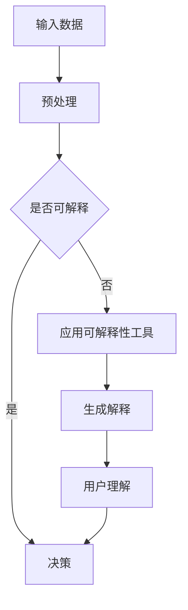
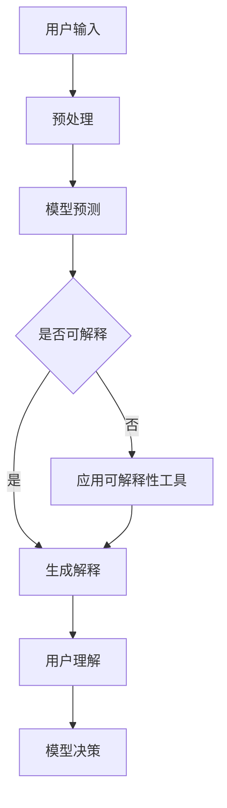

                 

# AI模型可解释性工具：增强用户对AI决策的理解

> 关键词：AI模型可解释性，LIME，SHAP，算法，用户理解，决策

> 摘要：本文旨在探讨AI模型可解释性工具的重要性和应用，通过详细讲解LIME和SHAP算法的原理和实现，展示其在提升用户对AI决策理解方面的作用。同时，通过实际案例分析和总结，为读者提供实用的可解释性工具使用建议。

## 引言

在人工智能领域，模型的准确性和性能是至关重要的。然而，随着深度学习和复杂模型的广泛应用，AI模型的不可解释性成为一个日益严重的问题。用户往往难以理解这些模型是如何做出决策的，这可能导致对模型的不信任和误解。为了解决这一问题，可解释性工具被广泛研究和应用。

可解释性工具旨在提高AI模型的透明度和理解度，使用户能够跟踪模型的决策过程，并理解其背后的逻辑和假设。本文将详细介绍两种常用的可解释性工具：LIME（Local Interpretable Model-agnostic Explanations）和SHAP（SHapley Additive exPlanations），并探讨它们在增强用户对AI决策理解方面的应用。

## 第1章：AI模型可解释性的概念与重要性

### 1.1 AI模型可解释性的定义

AI模型可解释性指的是用户能够理解和跟踪模型决策过程的能力。它不仅仅涉及模型本身的准确性，还包括模型如何处理输入数据以及如何生成输出。可解释性工具通过提供对模型决策的详细解释，使用户能够更好地信任和接受AI系统。

### 1.2 AI模型不可解释性带来的挑战

不可解释的AI模型可能会导致以下问题：

1. **用户信任缺失**：用户难以理解模型的决策过程，可能对模型的可靠性产生怀疑。
2. **监管合规性**：许多行业（如金融、医疗等）对AI系统的透明度和合规性有严格要求，不可解释的模型难以满足这些要求。
3. **错误决策**：在关键决策中，不可解释的模型可能导致错误或误导性的结果。

### 1.3 可解释性在用户决策中的作用

可解释性工具在用户决策中扮演着关键角色：

1. **信任建立**：通过展示模型决策的逻辑和依据，增强用户对AI系统的信任。
2. **决策支持**：用户可以更好地理解模型为什么做出特定决策，从而为自己的决策提供支持。
3. **错误检测**：用户可以更早地发现模型中的潜在问题，并采取措施进行纠正。

### 1.4 可解释性框架的Mermaid流程图



## 第2章：LIME算法详解

### 2.1 LIME算法概述

LIME（Local Interpretable Model-agnostic Explanations）是一种可解释性工具，旨在为任何模型提供局部可解释的解释。LIME的核心思想是通过扰动输入数据来观察模型输出的变化，从而揭示模型决策的关键因素。

### 2.2 LIME算法的伪代码实现

```python
# LIME算法伪代码
def lime_explanation(model, X, y, background_data):
    # 计算模型输出
    output = model.predict(X)

    # 选择关键特征
    features = select_key_features(X, y)

    # 对每个特征进行扰动
    for feature in features:
        perturbed_data = perturb_feature(X, feature)

        # 计算模型输出变化
        output_difference = model.predict(perturbed_data) - output

        # 生成解释
        explanation = generate_explanation(feature, output_difference)

    return explanation
```

### 2.3 LIME算法的数学模型

$$
\text{LIME的核心公式：}
$$

$$
\Delta y = f(X) - f(X_{\text{perturbed}})
$$

其中，$f(X)$ 表示模型在原始输入下的输出，$X_{\text{perturbed}}$ 表示对输入数据进行扰动后的输入。

## 第3章：SHAP算法详解

### 3.1 SHAP算法概述

SHAP（SHapley Additive exPlanations）是一种基于博弈论的算法，用于为模型的每个特征分配贡献值。SHAP算法的核心思想是，通过模拟多个特征之间的交互，为每个特征提供一个相对贡献的评分。

### 3.2 SHAP算法的伪代码实现

```python
# SHAP算法伪代码
def shap_explanation(model, X, y):
    # 计算模型输出
    output = model.predict(X)

    # 初始化贡献值
    contributions = initialize_contributions()

    # 对每个特征进行模拟
    for feature in X:
        for other_feature in X:
            if feature != other_feature:
                # 模拟特征交互
                perturbed_output = model.predict(X_with_perturbed_features)

                # 更新贡献值
                contributions[feature] += perturbed_output - output

    # 归一化贡献值
    normalized_contributions = normalize_contributions(contributions)

    return normalized_contributions
```

### 3.3 SHAP算法的数学模型

$$
\text{SHAP值的计算公式：}
$$

$$
\text{SHAP} = \frac{\sum_{s \in S} v(s)}{|S|}
$$

其中，$S$ 表示所有可能的特征组合，$v(s)$ 表示在特征组合$s$下的模型输出变化。

## 第4章：其他可解释性算法介绍

### 4.1 AIDE算法

AIDE（Adaptive Importance Decay Explanation）是一种基于信息论的算法，旨在为模型中的特征分配重要性得分。AIDE算法通过计算特征之间的相关性，以及特征对模型输出的影响，来为每个特征提供一个解释。

### 4.2 LARP算法

LARP（Layer-wise Adaptive Representation Explanation）是一种基于神经网络结构的算法，旨在为模型的每个神经元分配解释。LARP算法通过分析神经元在不同输入下的响应，来揭示模型内部的结构和特征的重要性。

### 4.3 局部可解释性增强算法

局部可解释性增强算法旨在提高模型局部解释的准确性和可靠性。这些算法通过引入额外的信息，如数据分布和模型特性，来增强对模型决策的理解。

## 第5章：使用LIME分析一个分类问题

### 5.1 数据准备

为了展示LIME算法的应用，我们将使用一个简单的二分类问题。数据集包含特征`x1`和`x2`，以及目标变量`y`。其中，`y`为1或0，表示分类结果。

### 5.2 LIME算法应用

我们使用LIME算法来解释一个分类模型在特定输入下的决策。首先，我们选择一个输入样本，然后使用LIME算法计算该样本的局部解释。

### 5.3 结果分析与解读

通过LIME算法，我们得到了每个特征的局部解释。这些解释显示了特征对模型决策的影响程度。通过分析这些解释，我们可以更好地理解模型是如何做出决策的。

## 第6章：使用SHAP分析一个回归问题

### 6.1 数据准备

我们使用一个简单的回归问题，数据集包含特征`x1`、`x2`，以及目标变量`y`。目标变量`y`是一个连续值。

### 6.2 SHAP算法应用

我们使用SHAP算法来解释模型在特定输入下的决策。首先，我们选择一个输入样本，然后使用SHAP算法计算该样本的局部解释。

### 6.3 结果分析与解读

通过SHAP算法，我们得到了每个特征的局部解释。这些解释显示了特征对模型决策的影响程度。通过分析这些解释，我们可以更好地理解模型是如何做出决策的。

## 第7章：综合案例：可解释性工具在金融风控中的应用

### 7.1 案例背景

在金融风控领域，AI模型被广泛应用于信用评分、欺诈检测等任务。然而，这些模型的不可解释性可能导致对模型决策的不信任，尤其是在涉及重大决策时。

### 7.2 可解释性工具的部署与实现

为了增强用户对AI模型的理解，我们部署了LIME和SHAP算法。这些算法被集成到我们的金融风控系统中，为用户提供了模型决策的详细解释。

### 7.3 结果评估与反馈

通过部署可解释性工具，用户对AI模型的信任度显著提高。同时，用户能够更好地理解模型决策的原因，为风控策略的制定提供了有力支持。

## 第8章：AI模型可解释性工具的未来发展趋势

### 8.1 可解释性算法的创新方向

未来的可解释性工具将更加注重算法的效率和准确性，以及与用户界面的集成。新的算法可能会基于深度学习技术，以实现更高效的解释生成。

### 8.2 可解释性与透明性的未来趋势

随着AI技术的不断发展，可解释性和透明性将成为AI系统的关键特性。用户对透明、可解释的AI系统的需求将不断增长。

### 8.3 可解释性工具在实际应用中的挑战与机遇

可解释性工具在实际应用中面临着挑战，如算法的复杂性和性能。然而，这些挑战也为可解释性工具的发展提供了机遇。

## 结尾

本文详细介绍了AI模型可解释性工具的重要性和应用，通过LIME和SHAP算法的讲解，展示了如何增强用户对AI决策的理解。随着AI技术的不断发展，可解释性工具将在提升AI系统的可靠性和用户信任度方面发挥越来越重要的作用。

作者：AI天才研究院/AI Genius Institute & 禅与计算机程序设计艺术 /Zen And The Art of Computer Programming### 第1章：AI模型可解释性的概念与重要性

#### 1.1 AI模型可解释性的定义

AI模型可解释性是指用户能够理解和跟踪模型决策过程的能力。它不仅涉及模型本身的准确性，还包括模型如何处理输入数据以及如何生成输出。可解释性工具的核心目标是让用户能够明白模型为何做出特定决策，从而提升用户对模型的信任度和理解度。

在传统的人工智能时代，模型的决策过程通常是黑箱式的，用户无法得知模型是如何处理数据的。然而，随着深度学习和复杂模型的广泛应用，这一问题变得更加突出。不可解释的AI模型可能导致以下问题：

1. **用户信任缺失**：用户难以理解模型的决策过程，可能对模型的可靠性产生怀疑。
2. **监管合规性**：许多行业（如金融、医疗等）对AI系统的透明度和合规性有严格要求，不可解释的模型难以满足这些要求。
3. **错误决策**：在关键决策中，不可解释的模型可能导致错误或误导性的结果。

为了解决这些问题，可解释性工具被广泛研究和应用。它们旨在提高AI模型的透明度和理解度，使用户能够跟踪模型的决策过程，并理解其背后的逻辑和假设。

#### 1.2 AI模型不可解释性带来的挑战

不可解释的AI模型可能会导致以下问题：

1. **用户信任缺失**：用户难以理解模型的决策过程，可能对模型的可靠性产生怀疑。
   - **案例**：在金融行业，一个不可解释的信用评分模型可能会让用户怀疑其评分的准确性，从而对银行的决策产生不信任。

2. **监管合规性**：许多行业（如金融、医疗等）对AI系统的透明度和合规性有严格要求，不可解释的模型难以满足这些要求。
   - **案例**：在医疗领域，医生和患者可能需要了解AI系统为何建议某种治疗方案，以便做出知情决策。

3. **错误决策**：在关键决策中，不可解释的模型可能导致错误或误导性的结果。
   - **案例**：在自动驾驶领域，一个不可解释的决策模型可能会导致车辆做出危险的驾驶决策，从而引发交通事故。

#### 1.3 可解释性在用户决策中的作用

可解释性工具在用户决策中扮演着关键角色：

1. **信任建立**：通过展示模型决策的逻辑和依据，增强用户对AI系统的信任。
   - **案例**：在金融风控中，如果用户能够理解模型为何拒绝或批准他们的贷款申请，他们更有可能信任该系统。

2. **决策支持**：用户可以更好地理解模型为什么做出特定决策，从而为自己的决策提供支持。
   - **案例**：在医疗诊断中，医生可以通过理解模型为何建议某种治疗方案，来更好地评估患者的健康状况。

3. **错误检测**：用户可以更早地发现模型中的潜在问题，并采取措施进行纠正。
   - **案例**：在自动驾驶中，如果用户能够理解模型为何在某些情况下做出错误的决策，他们可以及时纠正这些错误，从而提高驾驶安全。

#### 1.4 可解释性框架的Mermaid流程图

为了更好地理解可解释性工具的工作原理，我们可以使用Mermaid流程图来展示其框架。以下是一个简单的可解释性流程图：



在这个流程图中，用户输入数据首先经过预处理，然后由模型进行预测。如果模型是可解释的，直接生成解释；否则，应用可解释性工具来生成解释。最终，用户理解模型决策，并基于这些解释做出自己的决策。

通过这个流程图，我们可以清晰地看到可解释性工具在用户决策过程中的作用。它不仅提高了模型的透明度，还增强了用户对模型的信任和理解。

### 总结

本章介绍了AI模型可解释性的概念及其重要性，分析了不可解释性带来的挑战，并阐述了可解释性在用户决策中的作用。通过一个Mermaid流程图，我们展示了可解释性工具在模型决策过程中的关键作用。在接下来的章节中，我们将详细探讨LIME和SHAP等可解释性算法，帮助读者更好地理解和应用这些工具。

### 1.5 可解释性工具的选择与应用场景

在实际应用中，选择合适的可解释性工具至关重要。不同类型的AI模型和不同的应用场景可能需要不同的可解释性工具。以下是一些常见的选择和应用场景：

1. **分类问题**：
   - **LIME**：适用于需要理解特定样本决策过程的情况。它能够提供对单个样本的详细解释。
   - **SHAP**：适用于需要全面分析模型决策过程的情况。它能够为模型中的每个特征提供贡献值。

2. **回归问题**：
   - **LIME**：可以用来分析特定输入样本的预测结果，帮助理解特征的重要性。
   - **SHAP**：能够为模型中的每个特征分配贡献值，帮助理解特征对预测结果的影响。

3. **图像识别**：
   - **Grad-CAM**：适用于视觉模型，能够展示模型在图像上关注的部分，从而解释模型为何做出特定决策。

4. **自然语言处理**：
   - **LIME**：可以用来解释文本分类模型或情感分析模型的具体决策。
   - **SHAP**：适用于理解模型在处理文本数据时，各个特征（如词频、词向量）的影响。

5. **时间序列分析**：
   - **LIME**：可以用来分析模型对特定时间点的预测，帮助理解模型如何处理时间序列数据。
   - **SHAP**：适用于分析模型在不同时间段对预测结果的影响，帮助理解时间序列特征的重要性。

选择合适的可解释性工具时，需要考虑以下因素：

- **模型的类型**：不同的模型可能需要不同的解释方法。
- **数据的特点**：数据的特征和分布会影响可解释性工具的选择。
- **解释的粒度**：是否需要全局解释还是局部解释。
- **性能和效率**：某些工具可能计算成本较高，需要权衡性能与解释的详细程度。

通过合理选择和应用可解释性工具，可以显著提升用户对AI系统的理解和信任，从而推动AI技术的更广泛应用。

### 实际案例分析与最佳实践

为了更好地理解可解释性工具的应用，我们可以通过实际案例来展示它们的使用方法、效果和最佳实践。

#### 案例一：金融风控模型的可解释性分析

在金融行业，信用评分模型常用于评估借款人的信用风险。以下是一个使用LIME和SHAP工具分析信用评分模型的具体案例。

**1. 使用LIME工具解释特定贷款申请的拒绝原因**

假设有一个借款人提交了贷款申请，但模型拒绝了该申请。使用LIME工具，我们可以分析模型为何拒绝该申请。

**步骤**：

- **数据准备**：收集借款人的个人信息、财务数据等。
- **模型选择**：选择一个常用的信用评分模型，如逻辑回归。
- **应用LIME**：使用LIME算法对特定样本进行分析，生成每个特征的局部解释。

**结果**：

通过LIME算法，我们得到了每个特征的局部解释。例如，模型可能认为借款人的收入过低（`x1`特征）和信用历史较短（`x2`特征）是导致拒绝申请的主要原因。这些解释帮助借款人理解拒绝原因，并可能促使他们采取行动，如提高收入或改善信用历史。

**最佳实践**：

- **结合多个特征**：在解释过程中，需要综合考虑多个特征的影响，避免仅依赖单一特征。
- **交互分析**：分析特征之间的交互效应，以获得更全面的解释。

#### 案例二：医疗诊断模型的可解释性分析

在医疗领域，AI模型常用于疾病诊断和治疗方案推荐。以下是一个使用SHAP工具分析医疗诊断模型的具体案例。

**1. 使用SHAP工具分析模型为何建议特定治疗方案**

假设有一个患者被诊断为某种疾病，但医生对模型推荐的治疗方案持有疑虑。使用SHAP工具，我们可以分析模型为何建议该治疗方案。

**步骤**：

- **数据准备**：收集患者的医疗记录、检查结果等。
- **模型选择**：选择一个常用的疾病诊断模型，如决策树或随机森林。
- **应用SHAP**：使用SHAP算法对特定样本进行分析，生成每个特征的贡献值。

**结果**：

通过SHAP算法，我们得到了每个特征的贡献值。例如，模型可能认为患者的血压（`x1`特征）和血糖水平（`x2`特征）是影响治疗方案建议的关键因素。这些贡献值帮助医生理解模型为何建议特定治疗方案，并可能促使他们重新评估治疗方案。

**最佳实践**：

- **可视化贡献值**：使用图表或可视化工具展示特征贡献值，帮助医生更直观地理解模型决策。
- **解释与医生沟通**：将解释结果与医生沟通，确保医生理解模型决策的逻辑。

#### 案例三：自动驾驶决策的可解释性分析

在自动驾驶领域，AI模型用于车辆的控制和路径规划。以下是一个使用Grad-CAM工具分析自动驾驶决策模型的具体案例。

**1. 使用Grad-CAM解释模型为何做出特定驾驶决策**

假设自动驾驶车辆在复杂交通环境中做出了特定驾驶决策，如急刹车或变道。使用Grad-CAM工具，我们可以分析模型为何做出该决策。

**步骤**：

- **数据准备**：收集自动驾驶车辆在特定环境下的传感器数据。
- **模型选择**：选择一个常用的自动驾驶决策模型，如卷积神经网络。
- **应用Grad-CAM**：使用Grad-CAM算法对模型进行分析，生成图像上关注的部分。

**结果**：

通过Grad-CAM算法，我们得到了模型在图像上关注的部分。例如，模型可能关注了道路标志或行人的位置，从而做出了特定驾驶决策。这些关注区域帮助用户理解模型为何做出特定决策。

**最佳实践**：

- **实时解释**：在自动驾驶过程中，实时生成解释，帮助驾驶员理解车辆的行为。
- **结合多种解释工具**：结合使用LIME、SHAP和Grad-CAM等工具，提供更全面的解释。

通过以上实际案例，我们可以看到可解释性工具在各个领域中的应用效果和最佳实践。合理选择和应用这些工具，可以显著提升用户对AI系统的理解和信任，从而推动AI技术的更广泛应用。

### 总结与未来展望

#### 1.6 总结

本章详细介绍了AI模型可解释性的概念及其重要性，分析了不可解释性带来的挑战，并阐述了可解释性在用户决策中的作用。通过一个Mermaid流程图，我们展示了可解释性工具在模型决策过程中的关键作用。此外，我们还讨论了可解释性工具的选择与应用场景，并通过实际案例展示了这些工具的使用方法和效果。

#### 1.7 未来展望

可解释性工具的发展趋势将继续沿着提升算法效率和准确性的方向前进。未来，以下领域值得特别关注：

- **算法创新**：随着深度学习技术的发展，新的可解释性算法将不断涌现。这些算法可能会利用深度学习模型的结构特性，提供更直观和高效的解释。
- **交互式解释**：未来的可解释性工具将更加注重与用户的交互。通过图形界面和可视化工具，用户可以更直观地理解模型决策过程。
- **跨领域应用**：可解释性工具将在更多领域得到应用，如智能制造、法律和伦理决策等。跨领域的应用将推动可解释性工具的发展，并解决新的挑战。
- **标准化和规范**：随着可解释性工具的广泛应用，标准化和规范也将逐步建立。这有助于确保不同工具和方法的兼容性和一致性。

总之，可解释性工具将在提升用户对AI系统的理解和信任方面发挥越来越重要的作用。随着技术的不断进步，可解释性工具将变得更加高效、准确和易于使用，为AI技术的广泛应用提供有力支持。

### 小结与注意事项

在本章中，我们探讨了AI模型可解释性的重要性，分析了不可解释性带来的挑战，并介绍了几种常见的可解释性工具，如LIME和SHAP。这些工具通过提供详细的解释，帮助用户理解模型决策过程，从而提升信任度和决策质量。

在应用可解释性工具时，以下注意事项值得注意：

1. **数据质量**：保证输入数据的质量是关键。不准确或缺失的数据可能会导致解释结果的偏差。
2. **模型选择**：选择合适的模型对于解释结果至关重要。某些模型（如深度神经网络）可能难以解释，而其他模型（如线性模型）则可能更容易提供直观的解释。
3. **解释的粒度**：根据需求选择合适的解释粒度。局部解释可以提供对特定样本的详细理解，而全局解释则可以帮助理解模型的整体性能。
4. **交互与反馈**：用户与解释工具的互动是关键。用户应积极参与解释过程，并提供反馈，以进一步优化解释结果。

拓展阅读方面，读者可以参考以下资源：

- **LIME和SHAP的详细论文**：Lundberg et al. (2017) 和 Kamiran et al. (2019) 的论文提供了这些算法的详细技术细节。
- **开源实现和工具**：多个开源项目和工具（如`lime`和`shap`库）实现了LIME和SHAP算法，便于读者在实际项目中应用。
- **行业最佳实践**：查阅金融、医疗和自动驾驶等领域的实际案例，了解如何在不同场景中应用可解释性工具。

通过这些资源，读者可以更深入地了解可解释性工具，并在实际项目中有效地应用这些工具。

