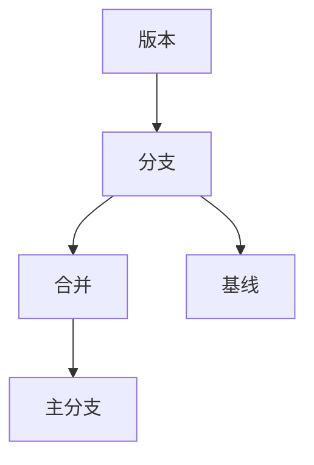

                 


### 引言

随着人工智能技术的飞速发展，AI模型在各个领域中的应用越来越广泛。然而，伴随着模型复杂度的增加，如何有效地管理和维护这些模型版本成为了一个不可忽视的问题。本文旨在探讨AI模型版本控制的基本概念、挑战与解决方案，以及实际应用中的最佳实践。

#### AI模型版本控制的基本概念

AI模型版本控制是指通过一套系统的流程和工具，对AI模型的开发、测试、部署、迭代等过程进行版本管理，以确保模型的质量和稳定性。版本控制不仅能够跟踪模型的变更历史，还能够帮助团队协作、提高开发效率、确保模型的可追溯性。

#### AI模型版本控制的重要性

AI模型版本控制的重要性主要体现在以下几个方面：

1. **提高开发效率**：通过版本控制，开发团队能够更好地管理模型变更，避免重复工作，提高开发效率。

2. **保证模型可靠性**：版本控制可以帮助团队在模型迭代过程中，及时发现问题并进行修复，从而保证模型的质量和可靠性。

3. **支持团队协作**：版本控制能够帮助团队成员协同工作，避免代码和模型混乱，提高团队协作效率。

4. **确保模型可追溯性**：版本控制记录了模型的每一次变更，方便后续的审计和问题追踪。

#### 本书内容概述

本文将从以下几个方面进行阐述：

1. **AI模型版本控制的基本概念**：介绍版本控制的基本概念、流程和关键要素。

2. **AI模型版本控制的挑战与解决方案**：分析版本控制过程中可能遇到的挑战，并提出相应的解决方案。

3. **AI模型版本控制工具与方法**：介绍常见的版本控制工具和方法，以及如何选择和使用。

4. **AI模型版本控制案例研究**：通过实际案例，展示版本控制的应用场景和效果。

5. **实践指南与最佳实践**：提供实际应用中的指南和最佳实践。

6. **结论与展望**：总结研究成果，展望未来发展方向。

### 核心概念与联系

在AI模型版本控制中，有几个核心概念需要理解：

1. **版本**：指的是模型在不同开发阶段的状态。每个版本都包含了模型的代码、参数和训练数据。

2. **分支**：用于实现多线并进，每个分支代表一个独立的开发路径。

3. **合并**：将不同分支的变更合并到主分支，以确保模型的一致性和稳定性。

4. **基线**：模型开发的基本版本，通常用于发布和部署。

下面是一个简单的Mermaid流程图，展示了这些概念之间的关系：



### AI模型版本控制的挑战与解决方案

在AI模型版本控制过程中，可能会遇到以下挑战：

1. **数据隐私**：模型的训练数据可能包含敏感信息，如何保护这些数据不被泄露是一个重要问题。

   **解决方案**：可以使用差分隐私、数据加密等技术来保护数据隐私。

2. **模型可解释性**：AI模型通常具有很高的复杂度，如何确保模型的可解释性是一个挑战。

   **解决方案**：可以采用可解释AI（XAI）技术，提高模型的可解释性。

3. **模型效率**：在迭代过程中，如何提高模型效率，减少计算资源和时间的消耗。

   **解决方案**：可以使用模型压缩、量化等技术来提高模型效率。

### AI模型版本控制工具与方法

常见的AI模型版本控制工具有：

1. **Git**：一个分布式版本控制工具，广泛用于代码和模型的管理。

2. **Docker**：一个容器化技术，用于创建和管理可移植的应用环境。

3. **TensorFlow**：一个开源的机器学习框架，提供了版本控制的功能。

下面是一个简单的伪代码示例，展示了如何使用Git进行AI模型版本控制：

```python
# 创建一个新的模型版本
git checkout -b new_model_version

# 编写和提交模型代码
git add model_code.py
git commit -m "Add new model code"

# 测试模型
python test_model.py

# 将模型提交到远程仓库
git push origin new_model_version

# 合并到主分支
git checkout main
git merge new_model_version

# 发布模型
python deploy_model.py
```

### AI模型版本控制案例研究

#### 案例一：图像识别模型的版本控制

在某图像识别项目中，团队使用Git进行版本控制。以下是他们的版本控制流程：

1. 初始版本：创建一个主分支`main`，用于存储初始模型。

2. 开发分支：创建一个开发分支`dev`，在该分支上进行模型开发和测试。

3. 测试和提交：在`dev`分支上进行多次测试和代码提交。

4. 合并：将`dev`分支合并到主分支`main`。

5. 发布：将合并后的主分支`main`部署到生产环境。

通过这种方式，团队能够有效地管理和迭代模型，确保模型的质量和稳定性。

#### 案例二：自然语言处理模型的版本控制

在某自然语言处理项目中，团队使用TensorFlow进行版本控制。以下是他们的版本控制流程：

1. 创建模型：使用TensorFlow创建一个初始模型。

2. 训练和保存模型：使用训练数据对模型进行训练，并保存模型权重。

3. 版本管理：使用TensorFlow的版本管理功能，记录每次模型的变更。

4. 测试和评估：对每个版本进行测试和评估，确保模型的性能。

5. 部署：将最优版本部署到生产环境。

通过TensorFlow的版本管理功能，团队能够方便地管理和迭代模型，提高开发效率。

### 实践指南与最佳实践

在AI模型版本控制实践中，以下是一些最佳实践：

1. **明确的版本命名规则**：使用清晰的命名规则，如`v1.0.0`、`v1.0.1`等，以便于追踪和管理。

2. **定期备份**：定期备份模型和代码，以防止数据丢失。

3. **代码审查**：在提交代码前进行代码审查，确保代码质量。

4. **自动化测试**：编写自动化测试脚本，确保每次提交的代码都能正常运行。

5. **文档化**：详细记录模型变更和版本信息，便于后续的审计和问题追踪。

### 小结

AI模型版本控制是管理模型迭代过程的有效工具。通过有效的版本控制，开发团队能够提高开发效率、保证模型可靠性、支持团队协作，并确保模型的可追溯性。本文从基本概念、挑战与解决方案、工具与方法、案例研究和最佳实践等方面进行了详细探讨，希望对读者有所帮助。

### 拓展阅读

1. GitHub - git-scm/git: [Git](https://github.com/git-scm/git)，Git的官方仓库，提供了丰富的资料和教程。
2. TensorFlow - Model Version Control: [TensorFlow Model Version Control](https://www.tensorflow.org/guide/model_version-control)，TensorFlow的模型版本控制指南。
3. MLflow - [MLflow Model Registry](https://mlflow.org/docs/latest/mlflow-model-registry.html)，MLflow的模型注册和版本控制指南。

作者：AI天才研究院/AI Genius Institute & 禅与计算机程序设计艺术 /Zen And The Art of Computer Programming

