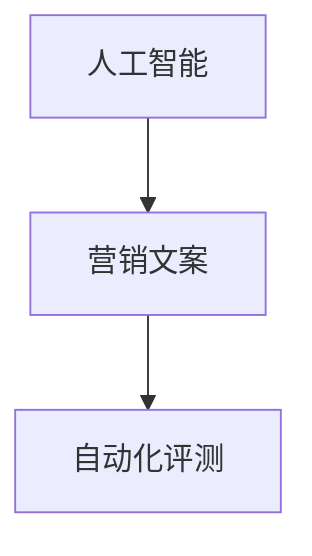
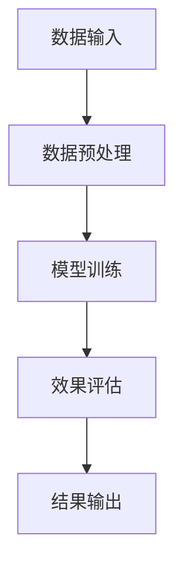
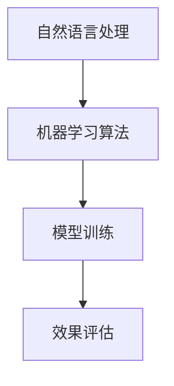

                 


### 文章标题: AI营销文案效果自动化评测系统

#### 关键词:
- AI营销
- 文案效果
- 自动化评测
- 自然语言处理
- 机器学习算法

#### 摘要:
本文将深入探讨AI营销文案效果自动化评测系统，从背景介绍、核心概念与联系、算法原理讲解、数学模型与公式、项目实战等多个方面，全面剖析该系统的构建与应用。文章旨在为读者提供一个清晰、系统、实用的指导，帮助他们在实际项目中实现高效的AI营销文案评测。

## 第一部分：AI营销文案自动化评测基础

### 1.1 AI与营销文案的关系

#### 背景介绍
随着人工智能技术的飞速发展，AI在营销领域的应用日益广泛。AI营销文案作为其重要组成部分，已逐渐成为企业提升营销效果的关键手段。

#### 核心概念与联系
- **AI**：人工智能（Artificial Intelligence），模拟人类智能的技术和方法。
- **营销文案**：用于推广产品或服务的文字材料。
- **自动化评测**：利用技术手段对营销文案效果进行评估和优化。

#### Mermaid 流程图


### 1.2 自动化评测系统的基本原理

#### 核心概念与联系
- **系统架构**：数据输入、数据预处理、模型训练、效果评估和结果输出。
- **评测指标**：点击率、转化率、用户满意度等。

#### Mermaid 流程图


### 1.3 营销文案自动评测的关键技术

#### 核心概念与联系
- **自然语言处理（NLP）**：文本分析、语义理解等。
- **机器学习算法**：用于模型训练和效果评估。

#### Mermaid 流程图


### 1.4 营销文案自动评测系统的发展趋势

#### 核心概念与联系
- **个性化**：根据用户特征生成个性化文案。
- **智能化**：利用机器学习算法不断优化文案生成效果。
- **实时性**：实现实时文案生成和效果评估，提高营销效率。

## 第二部分：AI营销文案自动评测系统构建

### 2.1 数据准备与预处理

#### 核心算法原理讲解
- **数据收集方法**：爬取、API调用等。
- **数据质量评估**：数据完整性、一致性、准确性等。

#### 数学模型和数学公式
- **数据清洗**：去除无效、重复数据。
- **数据标准化**：归一化、标准化等。

#### 举例说明
假设我们有以下数据集：
$$
\begin{aligned}
\text{文案1} &= \text{“新款手机，拍照更美!”} \\
\text{文案2} &= \text{“限时优惠，抢购新款手机！”}
\end{aligned}
$$
经过数据清洗后，去除文案2中的重复词汇，得到：
$$
\text{文案2'} = \text{“限时优惠，抢购新款！”}
$$

### 2.2 模型选择与训练

#### 核心算法原理讲解
- **模型选择策略**：基于任务特点选择合适的模型。
- **训练流程**：数据准备、模型训练、模型评估等。

#### 数学模型和数学公式
- **损失函数**：用于评估模型性能，如交叉熵损失函数。
- **优化算法**：如梯度下降算法。

#### 伪代码
```python
# 数据准备
X_train, y_train = ...

# 模型初始化
model = ...

# 模型训练
for epoch in range(num_epochs):
    for x, y in zip(X_train, y_train):
        model.train_one_example(x, y)

# 模型评估
accuracy = model.evaluate(X_test, y_test)
```

### 2.3 自动化评测系统实现

#### 核心算法原理讲解
- **系统架构设计**：前端界面、后端逻辑、数据库等。
- **系统功能实现**：文案生成、效果评估等。

#### 数学模型和数学公式
- **效果评估**：如A/B测试、多变量测试等。

#### 伪代码
```python
# 系统启动
system.start()

# 文案生成
text = system.generate_text(input)

# 文案评估
evaluation = system.evaluate_text(text)
```

### 第三部分：实战案例分析

### 3.1 案例一：电商产品文案评测

#### 核心算法原理讲解
- **案例背景**：电商产品营销。
- **数据准备与预处理**：收集电商产品文案，进行数据清洗和标准化。

#### 数学模型和数学公式
- **模型训练**：使用机器学习算法训练模型，如文本分类模型。

#### 项目实战
- **开发环境搭建**：配置Python环境、安装NLP库等。
- **源代码实现与解读**：编写数据预处理、模型训练、效果评估等代码。
- **代码应用解读与分析**：分析代码实现，讨论应用场景。

#### 实际案例分析和详细讲解剖析
- **案例背景**：某电商平台的手机产品营销。
- **效果分析**：使用AI营销文案效果自动化评测系统，分析不同文案的效果。

### 3.2 案例二：社交媒体文案评测

#### 核心算法原理讲解
- **案例背景**：社交媒体营销。
- **数据准备与预处理**：收集社交媒体文案，进行数据清洗和标准化。

#### 数学模型和数学公式
- **模型训练**：使用机器学习算法训练模型，如情感分析模型。

#### 项目实战
- **开发环境搭建**：配置Python环境、安装NLP库等。
- **源代码实现与解读**：编写数据预处理、模型训练、效果评估等代码。
- **代码应用解读与分析**：分析代码实现，讨论应用场景。

#### 实际案例分析和详细讲解剖析
- **案例背景**：某社交媒体平台的品牌推广。
- **效果分析**：使用AI营销文案效果自动化评测系统，分析不同文案的效果。

## 附录

### 附录A：常用工具和框架

### 附录B：参考文献

### 附录C：相关术语解释

## 总结

### 最佳实践 tips
1. 确保数据质量，数据是模型的基础。
2. 选择合适的模型和算法，根据任务特点。
3. 实时监控和优化系统，提高营销效果。

### 小结
本文从背景介绍、核心概念与联系、算法原理讲解、数学模型与公式、项目实战等多个方面，全面探讨了AI营销文案效果自动化评测系统的构建与应用。

### 注意事项
1. 系统的实时性和稳定性是关键。
2. 营销文案的个性化是提高效果的关键。

### 拓展阅读
- 相关书籍：《深度学习》、《自然语言处理综合教程》
- 研究论文：相关领域的最新研究成果

作者：AI天才研究院/AI Genius Institute & 禅与计算机程序设计艺术 /Zen And The Art of Computer Programming

