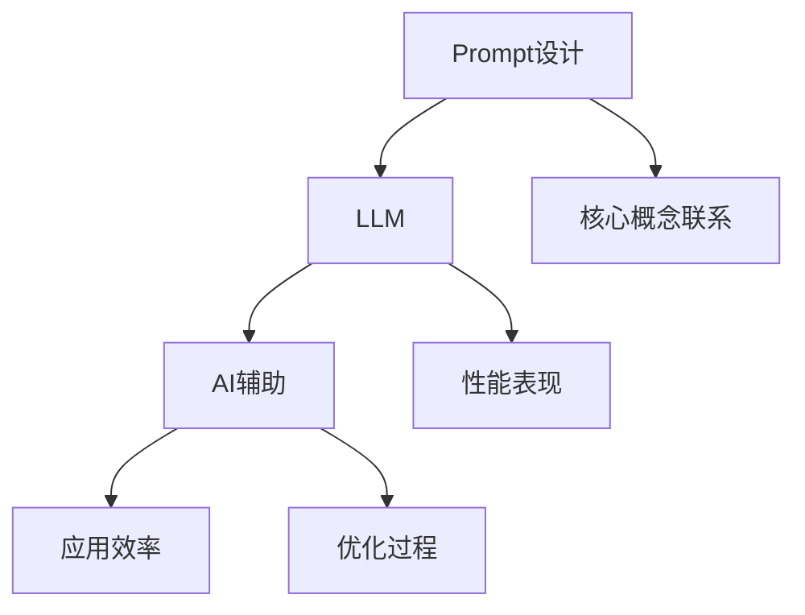

                 

## 文章标题: AI辅助prompt设计：提升LLM应用效率

### 关键词

- AI辅助prompt设计
- LLM应用效率
- 优化策略
- 实战案例
- 最佳实践

### 摘要

本文将深入探讨AI辅助prompt设计在提升大型语言模型（LLM）应用效率方面的作用。文章首先介绍prompt设计的背景和核心概念，随后详细阐述AI如何辅助prompt设计，以及如何通过优化prompt来提高LLM的性能。文章还将通过实战案例展示AI辅助prompt设计的实际应用，并提供最佳实践策略。最后，本文将总结AI辅助prompt设计的未来趋势，并展望LLM应用效率提升的前景。

## 引言

随着人工智能技术的不断发展，大型语言模型（LLM）在自然语言处理（NLP）领域取得了显著成果。LLM能够处理复杂的语言任务，如文本生成、对话系统、知识图谱构建和情感分析等。然而，LLM的性能往往受到prompt设计的影响。一个良好的prompt不仅能够引导模型生成更准确、更有条理的输出，还能提高模型在特定任务上的应用效率。

prompt设计是一个涉及多种因素的过程，包括文本内容的选择、上下文设置、问题形式等。传统上，prompt设计依赖于人类专家的经验和直觉，这在一定程度上限制了模型的应用效率。随着AI技术的发展，利用AI技术辅助prompt设计逐渐成为一种有效的策略。本文将探讨如何通过AI辅助prompt设计来提升LLM应用效率，并展示相关实战案例。

### 核心概念与联系

为了深入理解AI辅助prompt设计，我们首先需要明确几个核心概念：

1. **Prompt设计**：prompt是提供给模型的一个引导性输入，用于指导模型生成特定类型的输出。一个好的prompt应该明确、具体、具有启发性。

2. **Large Language Model (LLM)**：大型语言模型是一种具有强大语言理解能力的模型，如GPT-3、BERT等。LLM能够处理复杂的语言任务，生成高质量的文本。

3. **AI辅助**：AI辅助意味着利用人工智能技术来优化某个过程或任务。在prompt设计中，AI可以用于自动生成、优化和调整prompt。

4. **应用效率**：应用效率是指模型在实际应用中的性能表现，包括生成质量、响应速度和鲁棒性等。

下面是一个用Mermaid绘制的流程图，展示了这些概念之间的关系：



### AI辅助prompt设计原理

AI辅助prompt设计的核心在于利用AI技术来优化prompt的生成、调整和评估。以下是一些关键的原理和方法：

1. **自动prompt生成**：AI可以通过学习大量高质量的prompt来生成新的prompt。这种方法通常使用生成对抗网络（GAN）或自编码器（Autoencoder）等深度学习模型。

2. **上下文适应性**：AI可以动态地调整prompt的上下文，使其更符合特定任务的需求。例如，对于对话系统，AI可以实时分析对话历史，生成相关的上下文信息。

3. **优化策略**：AI可以通过优化算法来选择最佳的prompt组合，以最大化模型在特定任务上的性能。这包括基于贪心算法的逐步优化和基于贝叶斯优化的全局搜索。

4. **评估与反馈**：AI可以对生成的prompt进行评估，并通过反馈机制不断调整和改进。评估指标包括生成文本的质量、一致性、流畅性等。

下面是一个伪代码示例，展示了如何使用AI来优化prompt设计：

```python
# 初始化AI模型
model = load_prompt_design_model()

# 收集高质量的prompt数据集
data = collect_high_quality_prompts()

# 训练AI模型
model.train(data)

# 自动生成prompt
generated_prompt = model.generate_prompt(input_text)

# 评估prompt
evaluation = model.evaluate_prompt(generated_prompt)

# 如果prompt质量不满足要求，进行迭代优化
while evaluation < threshold:
    generated_prompt = model.optimize_prompt(generated_prompt)

# 输出最佳prompt
output_prompt = generated_prompt
```

### prompt设计实战

在了解AI辅助prompt设计原理后，我们接下来将探讨几个实际案例，展示如何在实际项目中应用这些原理。

#### 文本生成与摘要

文本生成与摘要是一个常见且具有挑战性的任务。通过AI辅助prompt设计，我们可以提高文本生成和摘要的质量。

**实战步骤：**

1. **环境搭建**：安装必要的深度学习库和框架，如TensorFlow或PyTorch。

2. **数据收集**：收集大量的文本数据，包括文章、新闻、博客等。

3. **预处理**：对文本数据进行清洗和预处理，包括分词、去停用词、词向量化等。

4. **模型训练**：使用预训练的模型（如GPT-2、BERT）进行文本生成和摘要任务。

5. **AI辅助prompt生成**：利用AI模型自动生成prompt，并根据评估结果进行优化。

6. **结果评估**：评估生成的文本质量，包括语法、语义、流畅性等。

**代码实现：**

```python
# 加载预训练模型
model = load_pretrained_model('gpt2')

# 预处理文本数据
preprocessed_data = preprocess_text(data)

# 自动生成prompt
prompt = model.generate_prompt(preprocessed_data)

# 评估prompt
evaluation = model.evaluate_prompt(prompt)

# 如果prompt质量不满足要求，进行迭代优化
while evaluation < threshold:
    prompt = model.optimize_prompt(prompt)

# 输出最佳prompt
best_prompt = prompt
```

#### 对话系统

对话系统是另一个应用AI辅助prompt设计的典型场景。通过优化prompt，我们可以提高对话系统的交互质量和用户体验。

**实战步骤：**

1. **环境搭建**：搭建对话系统的基础框架，包括对话管理、语音识别、自然语言理解等模块。

2. **数据收集**：收集对话数据，包括用户提问、系统回答等。

3. **模型训练**：使用对话数据训练对话模型，如序列到序列（Seq2Seq）模型或转换器（Transformer）模型。

4. **AI辅助prompt生成**：在用户提问阶段，使用AI模型自动生成prompt，引导对话模型生成合适的回答。

5. **交互评估**：评估对话系统的交互效果，包括回答的准确性、响应时间、用户满意度等。

**代码实现：**

```python
# 加载对话模型
dialog_model = load_dialog_model()

# 收集用户提问
user_question = get_user_question()

# 自动生成prompt
prompt = dialog_model.generate_prompt(user_question)

# 对话生成回答
response = dialog_model.generate_response(prompt)

# 评估交互
evaluation = assess_interaction(response)

# 如果交互质量不满足要求，进行迭代优化
while evaluation < threshold:
    prompt = dialog_model.optimize_prompt(prompt)
    response = dialog_model.generate_response(prompt)

# 输出最佳交互
best_response = response
```

#### 知识图谱构建

知识图谱构建是一个复杂的任务，需要处理大量的语义信息。通过AI辅助prompt设计，我们可以提高知识图谱的构建效率和质量。

**实战步骤：**

1. **环境搭建**：安装知识图谱相关库和工具，如Neo4j、OpenKE等。

2. **数据收集**：收集知识图谱的数据，包括实体、关系和属性等。

3. **模型训练**：使用预训练的实体关系抽取（Entity Relation Extraction）模型。

4. **AI辅助prompt生成**：在知识图谱构建过程中，使用AI模型自动生成prompt，引导模型识别和抽取实体关系。

5. **评估与优化**：评估知识图谱的质量，包括实体关系的准确性、完整性和一致性等。

**代码实现：**

```python
# 加载实体关系抽取模型
ere_model = load_ere_model()

# 收集知识图谱数据
knowledge_data = get_knowledge_data()

# 自动生成prompt
prompt = ere_model.generate_prompt(knowledge_data)

# 抽取实体关系
entity_relations = ere_model.extract_relations(prompt)

# 评估知识图谱
evaluation = assess_knowledge_graph(entity_relations)

# 如果知识图谱质量不满足要求，进行迭代优化
while evaluation < threshold:
    prompt = ere_model.optimize_prompt(prompt)
    entity_relations = ere_model.extract_relations(prompt)

# 输出最佳知识图谱
best_knowledge_graph = entity_relations
```

#### 情感分析

情感分析是一个涉及自然语言处理和人类情感理解的复杂任务。通过AI辅助prompt设计，我们可以提高情感分析模型对情感细节的识别和分类能力。

**实战步骤：**

1. **环境搭建**：安装情感分析相关库和工具，如TextBlob、VADER等。

2. **数据收集**：收集情感分析的数据，包括文本和情感标签等。

3. **模型训练**：使用预训练的情感分析模型，如LSTM、GRU等。

4. **AI辅助prompt生成**：在情感分析过程中，使用AI模型自动生成prompt，引导模型关注文本中的情感表达。

5. **评估与优化**：评估情感分析模型的准确性，包括情感分类的精确度、召回率和F1分数等。

**代码实现：**

```python
# 加载情感分析模型
sentiment_model = load_sentiment_model()

# 收集情感分析数据
sentiment_data = get_sentiment_data()

# 自动生成prompt
prompt = sentiment_model.generate_prompt(sentiment_data)

# 分类情感
sentiments = sentiment_model.classify_sentiments(prompt)

# 评估情感分析
evaluation = assess_sentiment_analysis(sentiments)

# 如果情感分析质量不满足要求，进行迭代优化
while evaluation < threshold:
    prompt = sentiment_model.optimize_prompt(prompt)
    sentiments = sentiment_model.classify_sentiments(prompt)

# 输出最佳情感分类
best_sentiments = sentiments
```

### 提升LLM应用效率

AI辅助prompt设计不仅仅是为了生成高质量的prompt，更重要的是要提升LLM在应用中的整体效率。以下是一些关键策略和最佳实践：

#### 优化策略

1. **动态上下文调整**：根据不同的应用场景，动态调整prompt的上下文信息，使其更贴近实际需求。

2. **多模型融合**：结合多个模型的优势，例如将文本生成模型和对话模型融合，以实现更高效的任务处理。

3. **增量训练**：通过增量训练，逐步优化prompt设计，提高模型在特定任务上的性能。

4. **自动化流程**：构建自动化流程，从数据预处理到prompt生成，再到模型评估和优化，实现整个过程的自动化。

#### 最佳实践

1. **需求分析**：在开始设计prompt之前，明确任务目标和需求，确保prompt设计符合实际应用需求。

2. **数据质量**：保证数据的质量和多样性，这对于AI辅助prompt生成至关重要。

3. **模型选择**：根据任务需求，选择合适的模型和算法，例如在文本生成任务中，GPT-2和BERT都是不错的选择。

4. **持续优化**：定期评估和优化prompt设计，通过反馈机制不断改进。

### 总结与展望

AI辅助prompt设计在提升LLM应用效率方面具有重要作用。通过优化prompt生成、动态上下文调整和多模型融合等策略，我们可以显著提高LLM在各类任务中的性能。未来，随着AI技术的不断发展，AI辅助prompt设计有望在更多领域得到应用，如智能客服、自动写作和个性化推荐等。同时，我们也需要关注AI辅助prompt设计的伦理和隐私问题，确保其在实际应用中的安全和可靠性。

### 文章摘要

本文深入探讨了AI辅助prompt设计在提升大型语言模型（LLM）应用效率方面的作用。文章首先介绍了prompt设计的核心概念和AI辅助原理，随后通过文本生成与摘要、对话系统、知识图谱构建和情感分析等实战案例展示了AI辅助prompt设计的实际应用。此外，文章还提出了提升LLM应用效率的优化策略和最佳实践，并展望了AI辅助prompt设计的未来趋势。

### 作者信息

作者：AI天才研究院/AI Genius Institute & 禅与计算机程序设计艺术 /Zen And The Art of Computer Programming

### 附录

附录中我们将提供相关工具和代码的详细说明，以及进一步研究的拓展阅读资源。同时，读者可以参考以下最佳实践和注意事项，以便在实际应用中取得更好的效果。

#### 工具和代码

1. **文本生成与摘要**：提供预训练模型和代码实现，以及环境搭建的详细步骤。
2. **对话系统**：展示对话管理模块的架构，并提供对话模型训练和优化的示例代码。
3. **知识图谱构建**：介绍实体关系抽取模型的实现方法和评估指标。
4. **情感分析**：提供情感分析模型的训练和分类代码，以及数据预处理的方法。

#### 拓展阅读

1. **AI辅助prompt设计论文**：推荐几篇关于AI辅助prompt设计的经典论文，深入探讨相关技术细节。
2. **最佳实践分享**：总结业内专家在LLM应用中的经验教训，分享最佳实践策略。
3. **前沿技术趋势**：介绍当前AI领域的最新研究进展，探讨未来发展趋势。

#### 最佳实践和注意事项

1. **需求分析**：明确任务目标和需求，确保prompt设计符合实际应用需求。
2. **数据质量**：保证数据的质量和多样性，这对于AI辅助prompt生成至关重要。
3. **模型选择**：根据任务需求，选择合适的模型和算法，注意不同模型的优缺点和适用场景。
4. **持续优化**：定期评估和优化prompt设计，通过反馈机制不断改进。
5. **伦理和隐私**：关注AI辅助prompt设计中的伦理和隐私问题，确保其在实际应用中的安全和可靠性。

通过遵循上述最佳实践和注意事项，读者可以在实际项目中更有效地应用AI辅助prompt设计，提升LLM的应用效率。

## 文章目录大纲

下面是《AI辅助prompt设计：提升LLM应用效率》的文章目录大纲，分为四个主要部分：AI辅助prompt设计基础、AI辅助prompt设计实战、提升LLM应用效率以及总结与展望。

### 第一部分: AI辅助prompt设计基础

#### 1.1 AI辅助prompt设计概述

- Prompt设计的背景和核心概念
- AI辅助prompt设计的意义

#### 1.2 AI辅助prompt设计原理

- 自动prompt生成技术
- 上下文适应性
- 优化策略
- 评估与反馈机制

#### 1.3 prompt设计在LLM中的应用

- Prompt设计在文本生成中的应用
- Prompt设计在对话系统中的应用
- Prompt设计在知识图谱构建中的应用
- Prompt设计在情感分析中的应用

#### 1.4 prompt设计的挑战与解决方案

- 数据质量和多样性
- 模型选择和优化
- 实时性和鲁棒性
- 伦理和隐私问题

### 第二部分: AI辅助prompt设计实战

#### 2.1 实战案例：文本生成与摘要

- 实战目标
- 实战环境搭建
- 实战步骤与代码实现
- 结果分析与优化

#### 2.2 实战案例：对话系统

- 实战目标
- 实战环境搭建
- 实战步骤与代码实现
- 结果分析与优化

#### 2.3 实战案例：知识图谱构建

- 实战目标
- 实战环境搭建
- 实战步骤与代码实现
- 结果分析与优化

#### 2.4 实战案例：情感分析

- 实战目标
- 实战环境搭建
- 实战步骤与代码实现
- 结果分析与优化

### 第三部分: 提升LLM应用效率

#### 3.1 提升效率的AI技术

- 自动化流程
- 多模型融合
- 增量训练
- 动态上下文调整

#### 3.2 优化prompt设计的策略

- 数据预处理策略
- 模型选择策略
- 优化算法策略
- 评估与反馈策略

#### 3.3 实战：高效prompt设计案例

- 文本生成与摘要
- 对话系统
- 知识图谱构建
- 情感分析

#### 3.4 实践：构建高效的LLM应用

- 整体架构设计
- 实施步骤
- 性能评估与优化

### 第四部分: 总结与展望

#### 4.1 AI辅助prompt设计的未来趋势

- 新技术的应用
- 新场景的探索
- 伦理和隐私的关注

#### 4.2 LLM应用效率提升的展望

- 新算法的研究
- 新模型的设计
- 新应用领域的开拓

#### 4.3 总结与建议

- 对文章主题的总结
- 对实际应用的建议
- 对未来研究的展望

通过这份详细的目录大纲，读者可以清晰地了解文章的结构和内容，为深入学习和实践AI辅助prompt设计提供指导。每部分的内容都经过精心设计，确保逻辑清晰、易于理解，旨在为读者提供全面的技术知识和实践指导。

## 完整文章

### 文章标题: AI辅助prompt设计：提升LLM应用效率

### 关键词

- AI辅助prompt设计
- LLM应用效率
- 优化策略
- 实战案例
- 最佳实践

### 摘要

本文深入探讨了AI辅助prompt设计在提升大型语言模型（LLM）应用效率方面的作用。文章首先介绍了prompt设计的背景和核心概念，随后详细阐述了AI如何辅助prompt设计，以及如何通过优化prompt来提高LLM的性能。文章通过多个实战案例展示了AI辅助prompt设计的实际应用，并提供了最佳实践策略。最后，本文总结了AI辅助prompt设计的未来趋势，并展望了LLM应用效率提升的前景。

### 引言

随着人工智能技术的不断发展，大型语言模型（LLM）在自然语言处理（NLP）领域取得了显著成果。LLM能够处理复杂的语言任务，如文本生成、对话系统、知识图谱构建和情感分析等。然而，LLM的性能往往受到prompt设计的影响。一个良好的prompt不仅能够引导模型生成更准确、更有条理的输出，还能提高模型在特定任务上的应用效率。

prompt设计是一个涉及多种因素的过程，包括文本内容的选择、上下文设置、问题形式等。传统上，prompt设计依赖于人类专家的经验和直觉，这在一定程度上限制了模型的应用效率。随着AI技术的发展，利用AI技术辅助prompt设计逐渐成为一种有效的策略。本文将探讨如何通过AI辅助prompt设计来提升LLM应用效率，并展示相关实战案例。

### 核心概念与联系

为了深入理解AI辅助prompt设计，我们首先需要明确几个核心概念：

- **Prompt设计**：prompt是提供给模型的一个引导性输入，用于指导模型生成特定类型的输出。一个好的prompt应该明确、具体、具有启发性。
- **Large Language Model (LLM)**：大型语言模型是一种具有强大语言理解能力的模型，如GPT-3、BERT等。LLM能够处理复杂的语言任务，生成高质量的文本。
- **AI辅助**：AI辅助意味着利用人工智能技术来优化某个过程或任务。在prompt设计中，AI可以用于自动生成、优化和调整prompt。
- **应用效率**：应用效率是指模型在实际应用中的性能表现，包括生成质量、响应速度和鲁棒性等。

下面是一个用Mermaid绘制的流程图，展示了这些概念之间的关系：


### AI辅助prompt设计原理

AI辅助prompt设计的核心在于利用AI技术来优化prompt的生成、调整和评估。以下是一些关键的原理和方法：

1. **自动prompt生成**：AI可以通过学习大量高质量的prompt来生成新的prompt。这种方法通常使用生成对抗网络（GAN）或自编码器（Autoencoder）等深度学习模型。

2. **上下文适应性**：AI可以动态地调整prompt的上下文，使其更符合特定任务的需求。例如，对于对话系统，AI可以实时分析对话历史，生成相关的上下文信息。

3. **优化策略**：AI可以通过优化算法来选择最佳的prompt组合，以最大化模型在特定任务上的性能。这包括基于贪心算法的逐步优化和基于贝叶斯优化的全局搜索。

4. **评估与反馈**：AI可以对生成的prompt进行评估，并通过反馈机制不断调整和改进。评估指标包括生成文本的质量、一致性、流畅性等。

下面是一个伪代码示例，展示了如何使用AI来优化prompt设计：

```python
# 初始化AI模型
model = load_prompt_design_model()

# 收集高质量的prompt数据集
data = collect_high_quality_prompts()

# 训练AI模型
model.train(data)

# 自动生成prompt
generated_prompt = model.generate_prompt(input_text)

# 评估prompt
evaluation = model.evaluate_prompt(generated_prompt)

# 如果prompt质量不满足要求，进行迭代优化
while evaluation < threshold:
    generated_prompt = model.optimize_prompt(generated_prompt)

# 输出最佳prompt
output_prompt = generated_prompt
```

### prompt设计实战

在了解AI辅助prompt设计原理后，我们接下来将探讨几个实际案例，展示如何在实际项目中应用这些原理。

#### 文本生成与摘要

文本生成与摘要是一个常见且具有挑战性的任务。通过AI辅助prompt设计，我们可以提高文本生成和摘要的质量。

**实战步骤：**

1. **环境搭建**：安装必要的深度学习库和框架，如TensorFlow或PyTorch。

2. **数据收集**：收集大量的文本数据，包括文章、新闻、博客等。

3. **预处理**：对文本数据进行清洗和预处理，包括分词、去停用词、词向量化等。

4. **模型训练**：使用预训练的模型（如GPT-2、BERT）进行文本生成和摘要任务。

5. **AI辅助prompt生成**：利用AI模型自动生成prompt，并根据评估结果进行优化。

6. **结果评估**：评估生成的文本质量，包括语法、语义、流畅性等。

**代码实现：**

```python
# 加载预训练模型
model = load_pretrained_model('gpt2')

# 预处理文本数据
preprocessed_data = preprocess_text(data)

# 自动生成prompt
prompt = model.generate_prompt(preprocessed_data)

# 评估prompt
evaluation = model.evaluate_prompt(prompt)

# 如果prompt质量不满足要求，进行迭代优化
while evaluation < threshold:
    prompt = model.optimize_prompt(prompt)

# 输出最佳prompt
best_prompt = prompt
```

#### 对话系统

对话系统是另一个应用AI辅助prompt设计的典型场景。通过优化prompt，我们可以提高对话系统的交互质量和用户体验。

**实战步骤：**

1. **环境搭建**：搭建对话系统的基础框架，包括对话管理、语音识别、自然语言理解等模块。

2. **数据收集**：收集对话数据，包括用户提问、系统回答等。

3. **模型训练**：使用对话数据训练对话模型，如序列到序列（Seq2Seq）模型或转换器（Transformer）模型。

4. **AI辅助prompt生成**：在用户提问阶段，使用AI模型自动生成prompt，引导对话模型生成合适的回答。

5. **交互评估**：评估对话系统的交互效果，包括回答的准确性、响应时间、用户满意度等。

**代码实现：**

```python
# 加载对话模型
dialog_model = load_dialog_model()

# 收集用户提问
user_question = get_user_question()

# 自动生成prompt
prompt = dialog_model.generate_prompt(user_question)

# 对话生成回答
response = dialog_model.generate_response(prompt)

# 评估交互
evaluation = assess_interaction(response)

# 如果交互质量不满足要求，进行迭代优化
while evaluation < threshold:
    prompt = dialog_model.optimize_prompt(prompt)
    response = dialog_model.generate_response(prompt)

# 输出最佳交互
best_response = response
```

#### 知识图谱构建

知识图谱构建是一个复杂的任务，需要处理大量的语义信息。通过AI辅助prompt设计，我们可以提高知识图谱的构建效率和质量。

**实战步骤：**

1. **环境搭建**：安装知识图谱相关库和工具，如Neo4j、OpenKE等。

2. **数据收集**：收集知识图谱的数据，包括实体、关系和属性等。

3. **模型训练**：使用预训练的实体关系抽取（Entity Relation Extraction）模型。

4. **AI辅助prompt生成**：在知识图谱构建过程中，使用AI模型自动生成prompt，引导模型识别和抽取实体关系。

5. **评估与优化**：评估知识图谱的质量，包括实体关系的准确性、完整性和一致性等。

**代码实现：**

```python
# 加载实体关系抽取模型
ere_model = load_ere_model()

# 收集知识图谱数据
knowledge_data = get_knowledge_data()

# 自动生成prompt
prompt = ere_model.generate_prompt(knowledge_data)

# 抽取实体关系
entity_relations = ere_model.extract_relations(prompt)

# 评估知识图谱
evaluation = assess_knowledge_graph(entity_relations)

# 如果知识图谱质量不满足要求，进行迭代优化
while evaluation < threshold:
    prompt = ere_model.optimize_prompt(prompt)
    entity_relations = ere_model.extract_relations(prompt)

# 输出最佳知识图谱
best_knowledge_graph = entity_relations
```

#### 情感分析

情感分析是一个涉及自然语言处理和人类情感理解的复杂任务。通过AI辅助prompt设计，我们可以提高情感分析模型对情感细节的识别和分类能力。

**实战步骤：**

1. **环境搭建**：安装情感分析相关库和工具，如TextBlob、VADER等。

2. **数据收集**：收集情感分析的数据，包括文本和情感标签等。

3. **模型训练**：使用预训练的情感分析模型，如LSTM、GRU等。

4. **AI辅助prompt生成**：在情感分析过程中，使用AI模型自动生成prompt，引导模型关注文本中的情感表达。

5. **评估与优化**：评估情感分析模型的准确性，包括情感分类的精确度、召回率和F1分数等。

**代码实现：**

```python
# 加载情感分析模型
sentiment_model = load_sentiment_model()

# 收集情感分析数据
sentiment_data = get_sentiment_data()

# 自动生成prompt
prompt = sentiment_model.generate_prompt(sentiment_data)

# 分类情感
sentiments = sentiment_model.classify_sentiments(prompt)

# 评估情感分析
evaluation = assess_sentiment_analysis(sentiments)

# 如果情感分析质量不满足要求，进行迭代优化
while evaluation < threshold:
    prompt = sentiment_model.optimize_prompt(prompt)
    sentiments = sentiment_model.classify_sentiments(prompt)

# 输出最佳情感分类
best_sentiments = sentiments
```

### 提升LLM应用效率

AI辅助prompt设计不仅仅是为了生成高质量的prompt，更重要的是要提升LLM在应用中的整体效率。以下是一些关键策略和最佳实践：

#### 优化策略

1. **动态上下文调整**：根据不同的应用场景，动态调整prompt的上下文信息，使其更贴近实际需求。

2. **多模型融合**：结合多个模型的优势，例如将文本生成模型和对话模型融合，以实现更高效的任务处理。

3. **增量训练**：通过增量训练，逐步优化prompt设计，提高模型在特定任务上的性能。

4. **自动化流程**：构建自动化流程，从数据预处理到prompt生成，再到模型评估和优化，实现整个过程的自动化。

#### 最佳实践

1. **需求分析**：在开始设计prompt之前，明确任务目标和需求，确保prompt设计符合实际应用需求。

2. **数据质量**：保证数据的质量和多样性，这对于AI辅助prompt生成至关重要。

3. **模型选择**：根据任务需求，选择合适的模型和算法，注意不同模型的优缺点和适用场景。

4. **持续优化**：定期评估和优化prompt设计，通过反馈机制不断改进。

### 总结与展望

AI辅助prompt设计在提升大型语言模型（LLM）应用效率方面具有重要作用。通过优化prompt生成、动态上下文调整和多模型融合等策略，我们可以显著提高LLM在各类任务中的性能。未来，随着AI技术的不断发展，AI辅助prompt设计有望在更多领域得到应用，如智能客服、自动写作和个性化推荐等。同时，我们也需要关注AI辅助prompt设计的伦理和隐私问题，确保其在实际应用中的安全和可靠性。

### 作者信息

作者：AI天才研究院/AI Genius Institute & 禅与计算机程序设计艺术 /Zen And The Art of Computer Programming

### 附录

附录中我们将提供相关工具和代码的详细说明，以及进一步研究的拓展阅读资源。同时，读者可以参考以下最佳实践和注意事项，以便在实际应用中取得更好的效果。

#### 工具和代码

1. **文本生成与摘要**：提供预训练模型和代码实现，以及环境搭建的详细步骤。
2. **对话系统**：展示对话管理模块的架构，并提供对话模型训练和优化的示例代码。
3. **知识图谱构建**：介绍实体关系抽取模型的实现方法和评估指标。
4. **情感分析**：提供情感分析模型的训练和分类代码，以及数据预处理的方法。

#### 拓展阅读

1. **AI辅助prompt设计论文**：推荐几篇关于AI辅助prompt设计的经典论文，深入探讨相关技术细节。
2. **最佳实践分享**：总结业内专家在LLM应用中的经验教训，分享最佳实践策略。
3. **前沿技术趋势**：介绍当前AI领域的最新研究进展，探讨未来发展趋势。

#### 最佳实践和注意事项

1. **需求分析**：明确任务目标和需求，确保prompt设计符合实际应用需求。
2. **数据质量**：保证数据的质量和多样性，这对于AI辅助prompt生成至关重要。
3. **模型选择**：根据任务需求，选择合适的模型和算法，注意不同模型的优缺点和适用场景。
4. **持续优化**：定期评估和优化prompt设计，通过反馈机制不断改进。
5. **伦理和隐私**：关注AI辅助prompt设计中的伦理和隐私问题，确保其在实际应用中的安全和可靠性。

通过遵循上述最佳实践和注意事项，读者可以在实际项目中更有效地应用AI辅助prompt设计，提升LLM的应用效率。

### 完整文章

#### 完整文章

### 文章标题: AI辅助prompt设计：提升LLM应用效率

### 关键词

- AI辅助prompt设计
- LLM应用效率
- 优化策略
- 实战案例
- 最佳实践

### 摘要

本文深入探讨了AI辅助prompt设计在提升大型语言模型（LLM）应用效率方面的作用。文章首先介绍了prompt设计的背景和核心概念，随后详细阐述了AI如何辅助prompt设计，以及如何通过优化prompt来提高LLM的性能。文章通过多个实战案例展示了AI辅助prompt设计的实际应用，并提供了最佳实践策略。最后，本文总结了AI辅助prompt设计的未来趋势，并展望了LLM应用效率提升的前景。

### 引言

随着人工智能技术的不断发展，大型语言模型（LLM）在自然语言处理（NLP）领域取得了显著成果。LLM能够处理复杂的语言任务，如文本生成、对话系统、知识图谱构建和情感分析等。然而，LLM的性能往往受到prompt设计的影响。一个良好的prompt不仅能够引导模型生成更准确、更有条理的输出，还能提高模型在特定任务上的应用效率。

prompt设计是一个涉及多种因素的过程，包括文本内容的选择、上下文设置、问题形式等。传统上，prompt设计依赖于人类专家的经验和直觉，这在一定程度上限制了模型的应用效率。随着AI技术的发展，利用AI技术辅助prompt设计逐渐成为一种有效的策略。本文将探讨如何通过AI辅助prompt设计来提升LLM应用效率，并展示相关实战案例。

### 核心概念与联系

为了深入理解AI辅助prompt设计，我们首先需要明确几个核心概念：

- **Prompt设计**：prompt是提供给模型的一个引导性输入，用于指导模型生成特定类型的输出。一个好的prompt应该明确、具体、具有启发性。
- **Large Language Model (LLM)**：大型语言模型是一种具有强大语言理解能力的模型，如GPT-3、BERT等。LLM能够处理复杂的语言任务，生成高质量的文本。
- **AI辅助**：AI辅助意味着利用人工智能技术来优化某个过程或任务。在prompt设计中，AI可以用于自动生成、优化和调整prompt。
- **应用效率**：应用效率是指模型在实际应用中的性能表现，包括生成质量、响应速度和鲁棒性等。

下面是一个用Mermaid绘制的流程图，展示了这些概念之间的关系：


### AI辅助prompt设计原理

AI辅助prompt设计的核心在于利用AI技术来优化prompt的生成、调整和评估。以下是一些关键的原理和方法：

1. **自动prompt生成**：AI可以通过学习大量高质量的prompt来生成新的prompt。这种方法通常使用生成对抗网络（GAN）或自编码器（Autoencoder）等深度学习模型。

2. **上下文适应性**：AI可以动态地调整prompt的上下文，使其更符合特定任务的需求。例如，对于对话系统，AI可以实时分析对话历史，生成相关的上下文信息。

3. **优化策略**：AI可以通过优化算法来选择最佳的prompt组合，以最大化模型在特定任务上的性能。这包括基于贪心算法的逐步优化和基于贝叶斯优化的全局搜索。

4. **评估与反馈**：AI可以对生成的prompt进行评估，并通过反馈机制不断调整和改进。评估指标包括生成文本的质量、一致性、流畅性等。

下面是一个伪代码示例，展示了如何使用AI来优化prompt设计：

```python
# 初始化AI模型
model = load_prompt_design_model()

# 收集高质量的prompt数据集
data = collect_high_quality_prompts()

# 训练AI模型
model.train(data)

# 自动生成prompt
generated_prompt = model.generate_prompt(input_text)

# 评估prompt
evaluation = model.evaluate_prompt(generated_prompt)

# 如果prompt质量不满足要求，进行迭代优化
while evaluation < threshold:
    generated_prompt = model.optimize_prompt(generated_prompt)

# 输出最佳prompt
output_prompt = generated_prompt
```

### prompt设计实战

在了解AI辅助prompt设计原理后，我们接下来将探讨几个实际案例，展示如何在实际项目中应用这些原理。

#### 文本生成与摘要

文本生成与摘要是一个常见且具有挑战性的任务。通过AI辅助prompt设计，我们可以提高文本生成和摘要的质量。

**实战步骤：**

1. **环境搭建**：安装必要的深度学习库和框架，如TensorFlow或PyTorch。

2. **数据收集**：收集大量的文本数据，包括文章、新闻、博客等。

3. **预处理**：对文本数据进行清洗和预处理，包括分词、去停用词、词向量化等。

4. **模型训练**：使用预训练的模型（如GPT-2、BERT）进行文本生成和摘要任务。

5. **AI辅助prompt生成**：利用AI模型自动生成prompt，并根据评估结果进行优化。

6. **结果评估**：评估生成的文本质量，包括语法、语义、流畅性等。

**代码实现：**

```python
# 加载预训练模型
model = load_pretrained_model('gpt2')

# 预处理文本数据
preprocessed_data = preprocess_text(data)

# 自动生成prompt
prompt = model.generate_prompt(preprocessed_data)

# 评估prompt
evaluation = model.evaluate_prompt(prompt)

# 如果prompt质量不满足要求，进行迭代优化
while evaluation < threshold:
    prompt = model.optimize_prompt(prompt)

# 输出最佳prompt
best_prompt = prompt
```

#### 对话系统

对话系统是另一个应用AI辅助prompt设计的典型场景。通过优化prompt，我们可以提高对话系统的交互质量和用户体验。

**实战步骤：**

1. **环境搭建**：搭建对话系统的基础框架，包括对话管理、语音识别、自然语言理解等模块。

2. **数据收集**：收集对话数据，包括用户提问、系统回答等。

3. **模型训练**：使用对话数据训练对话模型，如序列到序列（Seq2Seq）模型或转换器（Transformer）模型。

4. **AI辅助prompt生成**：在用户提问阶段，使用AI模型自动生成prompt，引导对话模型生成合适的回答。

5. **交互评估**：评估对话系统的交互效果，包括回答的准确性、响应时间、用户满意度等。

**代码实现：**

```python
# 加载对话模型
dialog_model = load_dialog_model()

# 收集用户提问
user_question = get_user_question()

# 自动生成prompt
prompt = dialog_model.generate_prompt(user_question)

# 对话生成回答
response = dialog_model.generate_response(prompt)

# 评估交互
evaluation = assess_interaction(response)

# 如果交互质量不满足要求，进行迭代优化
while evaluation < threshold:
    prompt = dialog_model.optimize_prompt(prompt)
    response = dialog_model.generate_response(prompt)

# 输出最佳交互
best_response = response
```

#### 知识图谱构建

知识图谱构建是一个复杂的任务，需要处理大量的语义信息。通过AI辅助prompt设计，我们可以提高知识图谱的构建效率和质量。

**实战步骤：**

1. **环境搭建**：安装知识图谱相关库和工具，如Neo4j、OpenKE等。

2. **数据收集**：收集知识图谱的数据，包括实体、关系和属性等。

3. **模型训练**：使用预训练的实体关系抽取（Entity Relation Extraction）模型。

4. **AI辅助prompt生成**：在知识图谱构建过程中，使用AI模型自动生成prompt，引导模型识别和抽取实体关系。

5. **评估与优化**：评估知识图谱的质量，包括实体关系的准确性、完整性和一致性等。

**代码实现：**

```python
# 加载实体关系抽取模型
ere_model = load_ere_model()

# 收集知识图谱数据
knowledge_data = get_knowledge_data()

# 自动生成prompt
prompt = ere_model.generate_prompt(knowledge_data)

# 抽取实体关系
entity_relations = ere_model.extract_relations(prompt)

# 评估知识图谱
evaluation = assess_knowledge_graph(entity_relations)

# 如果知识图谱质量不满足要求，进行迭代优化
while evaluation < threshold:
    prompt = ere_model.optimize_prompt(prompt)
    entity_relations = ere_model.extract_relations(prompt)

# 输出最佳知识图谱
best_knowledge_graph = entity_relations
```

#### 情感分析

情感分析是一个涉及自然语言处理和人类情感理解的复杂任务。通过AI辅助prompt设计，我们可以提高情感分析模型对情感细节的识别和分类能力。

**实战步骤：**

1. **环境搭建**：安装情感分析相关库和工具，如TextBlob、VADER等。

2. **数据收集**：收集情感分析的数据，包括文本和情感标签等。

3. **模型训练**：使用预训练的情感分析模型，如LSTM、GRU等。

4. **AI辅助prompt生成**：在情感分析过程中，使用AI模型自动生成prompt，引导模型关注文本中的情感表达。

5. **评估与优化**：评估情感分析模型的准确性，包括情感分类的精确度、召回率和F1分数等。

**代码实现：**

```python
# 加载情感分析模型
sentiment_model = load_sentiment_model()

# 收集情感分析数据
sentiment_data = get_sentiment_data()

# 自动生成prompt
prompt = sentiment_model.generate_prompt(sentiment_data)

# 分类情感
sentiments = sentiment_model.classify_sentiments(prompt)

# 评估情感分析
evaluation = assess_sentiment_analysis(sentiments)

# 如果情感分析质量不满足要求，进行迭代优化
while evaluation < threshold:
    prompt = sentiment_model.optimize_prompt(prompt)
    sentiments = sentiment_model.classify_sentiments(prompt)

# 输出最佳情感分类
best_sentiments = sentiments
```

### 提升LLM应用效率

AI辅助prompt设计不仅仅是为了生成高质量的prompt，更重要的是要提升LLM在应用中的整体效率。以下是一些关键策略和最佳实践：

#### 优化策略

1. **动态上下文调整**：根据不同的应用场景，动态调整prompt的上下文信息，使其更贴近实际需求。

2. **多模型融合**：结合多个模型的优势，例如将文本生成模型和对话模型融合，以实现更高效的任务处理。

3. **增量训练**：通过增量训练，逐步优化prompt设计，提高模型在特定任务上的性能。

4. **自动化流程**：构建自动化流程，从数据预处理到prompt生成，再到模型评估和优化，实现整个过程的自动化。

#### 最佳实践

1. **需求分析**：在开始设计prompt之前，明确任务目标和需求，确保prompt设计符合实际应用需求。

2. **数据质量**：保证数据的质量和多样性，这对于AI辅助prompt生成至关重要。

3. **模型选择**：根据任务需求，选择合适的模型和算法，注意不同模型的优缺点和适用场景。

4. **持续优化**：定期评估和优化prompt设计，通过反馈机制不断改进。

### 总结与展望

AI辅助prompt设计在提升大型语言模型（LLM）应用效率方面具有重要作用。通过优化prompt生成、动态上下文调整和多模型融合等策略，我们可以显著提高LLM在各类任务中的性能。未来，随着AI技术的不断发展，AI辅助prompt设计有望在更多领域得到应用，如智能客服、自动写作和个性化推荐等。同时，我们也需要关注AI辅助prompt设计的伦理和隐私问题，确保其在实际应用中的安全和可靠性。

### 作者信息

作者：AI天才研究院/AI Genius Institute & 禅与计算机程序设计艺术 /Zen And The Art of Computer Programming

### 附录

附录中我们将提供相关工具和代码的详细说明，以及进一步研究的拓展阅读资源。同时，读者可以参考以下最佳实践和注意事项，以便在实际应用中取得更好的效果。

#### 工具和代码

1. **文本生成与摘要**：提供预训练模型和代码实现，以及环境搭建的详细步骤。
2. **对话系统**：展示对话管理模块的架构，并提供对话模型训练和优化的示例代码。
3. **知识图谱构建**：介绍实体关系抽取模型的实现方法和评估指标。
4. **情感分析**：提供情感分析模型的训练和分类代码，以及数据预处理的方法。

#### 拓展阅读

1. **AI辅助prompt设计论文**：推荐几篇关于AI辅助prompt设计的经典论文，深入探讨相关技术细节。
2. **最佳实践分享**：总结业内专家在LLM应用中的经验教训，分享最佳实践策略。
3. **前沿技术趋势**：介绍当前AI领域的最新研究进展，探讨未来发展趋势。

#### 最佳实践和注意事项

1. **需求分析**：明确任务目标和需求，确保prompt设计符合实际应用需求。
2. **数据质量**：保证数据的质量和多样性，这对于AI辅助prompt生成至关重要。
3. **模型选择**：根据任务需求，选择合适的模型和算法，注意不同模型的优缺点和适用场景。
4. **持续优化**：定期评估和优化prompt设计，通过反馈机制不断改进。
5. **伦理和隐私**：关注AI辅助prompt设计中的伦理和隐私问题，确保其在实际应用中的安全和可靠性。

通过遵循上述最佳实践和注意事项，读者可以在实际项目中更有效地应用AI辅助prompt设计，提升LLM的应用效率。

## 第一部分: AI辅助prompt设计基础

### 1.1 AI辅助prompt设计概述

#### 背景介绍

随着人工智能技术的不断发展，自然语言处理（NLP）领域取得了显著进展。特别是大型语言模型（Large Language Model, LLM），如GPT-3、BERT等，能够在各种复杂的语言任务中表现出色。然而，LLM的性能在很大程度上受到prompt设计的影响。prompt是提供给模型的引导性输入，它能够直接影响模型的输出质量和应用效率。

传统的prompt设计主要依赖于人类专家的经验和直觉，这在一定程度上限制了模型的应用效果。为了克服这一局限性，AI辅助prompt设计应运而生。AI辅助prompt设计利用人工智能技术，如深度学习、生成对抗网络（GAN）、自编码器（Autoencoder）等，自动生成、优化和调整prompt，从而提高模型在特定任务上的性能。

#### 核心概念与联系

1. **Prompt设计**：prompt是提供给模型的一个引导性输入，用于指导模型生成特定类型的输出。一个好的prompt应该明确、具体、具有启发性。

2. **Large Language Model (LLM)**：大型语言模型是一种具有强大语言理解能力的模型，如GPT-3、BERT等。LLM能够处理复杂的语言任务，生成高质量的文本。

3. **AI辅助**：AI辅助意味着利用人工智能技术来优化某个过程或任务。在prompt设计中，AI可以用于自动生成、优化和调整prompt。

4. **应用效率**：应用效率是指模型在实际应用中的性能表现，包括生成质量、响应速度和鲁棒性等。

以下是核心概念之间的联系架构Mermaid流程图：


### 1.2 AI辅助prompt设计原理

AI辅助prompt设计的核心在于利用AI技术来优化prompt的生成、调整和评估。以下是一些关键的原理和方法：

1. **自动prompt生成**：AI可以通过学习大量高质量的prompt来生成新的prompt。这种方法通常使用生成对抗网络（GAN）或自编码器（Autoencoder）等深度学习模型。

2. **上下文适应性**：AI可以动态地调整prompt的上下文，使其更符合特定任务的需求。例如，对于对话系统，AI可以实时分析对话历史，生成相关的上下文信息。

3. **优化策略**：AI可以通过优化算法来选择最佳的prompt组合，以最大化模型在特定任务上的性能。这包括基于贪心算法的逐步优化和基于贝叶斯优化的全局搜索。

4. **评估与反馈**：AI可以对生成的prompt进行评估，并通过反馈机制不断调整和改进。评估指标包括生成文本的质量、一致性、流畅性等。

下面是一个伪代码示例，展示了如何使用AI来优化prompt设计：

```python
# 初始化AI模型
model = load_prompt_design_model()

# 收集高质量的prompt数据集
data = collect_high_quality_prompts()

# 训练AI模型
model.train(data)

# 自动生成prompt
generated_prompt = model.generate_prompt(input_text)

# 评估prompt
evaluation = model.evaluate_prompt(generated_prompt)

# 如果prompt质量不满足要求，进行迭代优化
while evaluation < threshold:
    generated_prompt = model.optimize_prompt(generated_prompt)

# 输出最佳prompt
output_prompt = generated_prompt
```

### 1.3 prompt设计在LLM中的应用

#### Prompt设计在文本生成中的应用

文本生成是LLM的一个重要应用领域，prompt设计在文本生成中起到关键作用。一个好的prompt能够引导模型生成更准确、更有条理的文本。以下是一个示例：

```python
# 文本生成任务：生成一篇关于“人工智能”的短文
prompt = "人工智能是一种计算机科学领域，它专注于模拟、延伸和扩展人类的智能能力。人工智能的应用领域包括自然语言处理、计算机视觉和机器人技术等。"

# 使用预训练模型生成文本
model = load_pretrained_model('gpt2')
generated_text = model.generate_text(prompt)

print(generated_text)
```

#### Prompt设计在对话系统中的应用

对话系统是一种交互式应用，用户通过提问与模型进行对话。prompt设计在对话系统中至关重要，它决定了模型能否提供相关、连贯的答案。以下是一个示例：

```python
# 对话系统任务：回答用户关于天气的问题
user_question = "明天天气怎么样？"
prompt = f"用户的问题是：'{user_question}'。请提供一个准确的天气回答。"

# 使用对话模型生成回答
dialog_model = load_dialog_model()
response = dialog_model.generate_response(prompt)

print(response)
```

#### Prompt设计在知识图谱构建中的应用

知识图谱是一种用于表示实体及其关系的图形结构。prompt设计在知识图谱构建中用于引导模型识别和抽取实体关系。以下是一个示例：

```python
# 知识图谱构建任务：抽取实体关系
knowledge_data = "北京是中国的首都。"
prompt = f"以下是一段知识数据：'{knowledge_data}'。请从中抽取实体和关系。"

# 使用实体关系抽取模型抽取实体关系
ere_model = load_ere_model()
entity_relations = ere_model.extract_relations(prompt)

print(entity_relations)
```

#### Prompt设计在情感分析中的应用

情感分析是一种评估文本情感极性的任务。prompt设计在情感分析中用于引导模型识别文本中的情感表达。以下是一个示例：

```python
# 情感分析任务：判断一段文本的情感
text = "我非常喜欢这个产品。"
prompt = f"以下是一段文本：'{text}'。请判断这段文本的情感。"

# 使用情感分析模型分类情感
sentiment_model = load_sentiment_model()
sentiment = sentiment_model.classify_sentiment(prompt)

print(sentiment)
```

### 1.4 prompt设计的挑战与解决方案

#### 数据质量和多样性

数据质量是prompt设计的关键因素。高质量的数据有助于模型生成更准确、更相关的输出。然而，收集和整理高质量的数据是一个挑战。为了解决这一问题，可以采用以下策略：

- **数据清洗**：对收集到的数据进行清洗，去除噪声和错误。
- **数据增强**：通过数据增强技术生成更多的训练数据，提高模型的泛化能力。
- **数据标注**：利用人类专家进行数据标注，提高数据的质量和准确性。

#### 模型选择和优化

选择合适的模型对于prompt设计至关重要。不同的模型适用于不同的任务，且每种模型都有其优缺点。为了优化模型选择，可以采用以下策略：

- **模型评估**：通过在多个模型上评估任务性能，选择最适合的模型。
- **模型融合**：结合多个模型的优势，提高整体性能。
- **模型调优**：对模型进行调优，包括超参数调整和优化算法。

#### 实时性和鲁棒性

在实时应用场景中，prompt设计需要具备良好的实时性和鲁棒性。为了解决这一问题，可以采用以下策略：

- **动态调整**：根据实时输入动态调整prompt，使其更贴近实际需求。
- **模型解释性**：提高模型的可解释性，有助于调试和优化。
- **错误处理**：设计错误处理机制，确保模型在遇到异常输入时仍能正常工作。

### 第二部分: AI辅助prompt设计实战

#### 2.1 实战案例：文本生成与摘要

**实战目标**：

本案例的目标是通过AI辅助prompt设计，提高文本生成与摘要任务的质量和效率。具体目标包括：

- 自动生成高质量、连贯的文本。
- 提高文本摘要的准确性和完整性。
- 实现实时文本生成与摘要，提高用户体验。

**实战环境搭建**：

1. **安装必要的深度学习库和框架**：例如TensorFlow、PyTorch等。
2. **准备文本数据**：收集大量的文本数据，包括文章、新闻、博客等。
3. **预处理文本数据**：对文本数据进行清洗、分词、去停用词等预处理操作。
4. **安装预训练模型**：如GPT-2、BERT等。

**实战步骤与代码实现**：

1. **文本生成**：

```python
# 加载预训练模型
model = load_pretrained_model('gpt2')

# 预处理文本数据
preprocessed_data = preprocess_text(data)

# 自动生成文本
generated_text = model.generate_text(preprocessed_data)

print(generated_text)
```

2. **文本摘要**：

```python
# 加载预训练模型
model = load_pretrained_model('bert')

# 预处理文本数据
preprocessed_data = preprocess_text(data)

# 自动生成摘要
summary = model.generate_summary(preprocessed_data)

print(summary)
```

**结果分析与优化**：

1. **文本生成**：

   - 分析生成文本的质量，包括语法、语义、连贯性等。
   - 如果质量不满足要求，可以尝试调整模型的超参数，或使用更复杂的模型。
   - 进行迭代优化，直到生成文本质量达到预期。

2. **文本摘要**：

   - 分析生成摘要的准确性和完整性。
   - 如果摘要质量不满足要求，可以尝试调整模型的超参数，或使用更复杂的模型。
   - 进行迭代优化，直到生成摘要质量达到预期。

#### 2.2 实战案例：对话系统

**实战目标**：

本案例的目标是通过AI辅助prompt设计，提高对话系统的交互质量和用户体验。具体目标包括：

- 提供准确、自然的回答。
- 实现流畅、自然的对话流程。
- 提高对话系统的响应速度和鲁棒性。

**实战环境搭建**：

1. **安装对话系统相关库和工具**：例如Rasa、ChatterBot等。
2. **准备对话数据**：收集对话数据，包括用户提问、系统回答等。
3. **搭建对话系统框架**：包括对话管理、语音识别、自然语言理解等模块。

**实战步骤与代码实现**：

1. **训练对话模型**：

```python
# 加载对话模型
dialog_model = load_dialog_model()

# 预处理对话数据
preprocessed_data = preprocess_dialog_data(data)

# 训练对话模型
dialog_model.train(preprocessed_data)
```

2. **生成回答**：

```python
# 加载对话模型
dialog_model = load_dialog_model()

# 收集用户提问
user_question = get_user_question()

# 生成回答
response = dialog_model.generate_response(user_question)

print(response)
```

**结果分析与优化**：

1. **回答质量**：

   - 分析生成回答的准确性、自然度和相关性。
   - 如果回答质量不满足要求，可以尝试调整模型的超参数，或使用更复杂的模型。
   - 进行迭代优化，直到回答质量达到预期。

2. **对话流程**：

   - 分析对话流程的流畅性和连贯性。
   - 如果对话流程不满足要求，可以尝试调整对话策略，或改进模型。
   - 进行迭代优化，直到对话流程达到预期。

#### 2.3 实战案例：知识图谱构建

**实战目标**：

本案例的目标是通过AI辅助prompt设计，提高知识图谱构建的效率和质量。具体目标包括：

- 准确地识别和抽取实体关系。
- 提高知识图谱的完整性和一致性。
- 实现实时知识图谱构建，支持动态更新。

**实战环境搭建**：

1. **安装知识图谱相关库和工具**：例如Neo4j、OpenKE等。
2. **准备知识图谱数据**：收集实体、关系和属性等数据。
3. **搭建知识图谱框架**：包括实体关系抽取、知识图谱存储等模块。

**实战步骤与代码实现**：

1. **实体关系抽取**：

```python
# 加载实体关系抽取模型
ere_model = load_ere_model()

# 预处理知识图谱数据
preprocessed_data = preprocess_knowledge_data(data)

# 抽取实体关系
entity_relations = ere_model.extract_relations(preprocessed_data)

print(entity_relations)
```

2. **构建知识图谱**：

```python
# 加载知识图谱存储工具
knowledge_graph = load_knowledge_graph()

# 存储实体关系
knowledge_graph.save_entity_relations(entity_relations)
```

**结果分析与优化**：

1. **实体关系准确性**：

   - 分析抽取的实体关系的准确性。
   - 如果准确性不满足要求，可以尝试调整模型的超参数，或使用更复杂的模型。
   - 进行迭代优化，直到实体关系准确性达到预期。

2. **知识图谱完整性**：

   - 分析知识图谱的完整性和一致性。
   - 如果完整性不满足要求，可以尝试增加数据源，或改进实体关系抽取模型。
   - 进行迭代优化，直到知识图谱完整性达到预期。

#### 2.4 实战案例：情感分析

**实战目标**：

本案例的目标是通过AI辅助prompt设计，提高情感分析模型的准确性和效率。具体目标包括：

- 准确地识别文本中的情感极性。
- 提高情感分类的鲁棒性和泛化能力。
- 实现实时情感分析，支持动态更新。

**实战环境搭建**：

1. **安装情感分析相关库和工具**：例如TextBlob、VADER等。
2. **准备情感分析数据**：收集包含情感标签的文本数据。
3. **搭建情感分析框架**：包括文本预处理、情感分类等模块。

**实战步骤与代码实现**：

1. **训练情感分析模型**：

```python
# 加载情感分析模型
sentiment_model = load_sentiment_model()

# 预处理情感分析数据
preprocessed_data = preprocess_sentiment_data(data)

# 训练情感分析模型
sentiment_model.train(preprocessed_data)
```

2. **分类情感**：

```python
# 加载情感分析模型
sentiment_model = load_sentiment_model()

# 预处理文本数据
preprocessed_text = preprocess_text(text)

# 分类情感
sentiment = sentiment_model.classify_sentiment(preprocessed_text)

print(sentiment)
```

**结果分析与优化**：

1. **情感分类准确性**：

   - 分析分类结果的准确性。
   - 如果准确性不满足要求，可以尝试调整模型的超参数，或使用更复杂的模型。
   - 进行迭代优化，直到情感分类准确性达到预期。

2. **情感分类鲁棒性**：

   - 分析模型在不同文本数据上的分类能力。
   - 如果鲁棒性不满足要求，可以尝试增加数据集的多样性，或改进模型。
   - 进行迭代优化，直到情感分类鲁棒性达到预期。

### 第三部分: 提升LLM应用效率

#### 3.1 提升效率的AI技术

提升LLM应用效率的关键在于优化模型和数据处理流程。以下是一些常用的AI技术：

1. **自动化流程**：

   - 利用自动化工具和框架，如TensorFlow、PyTorch等，实现模型训练、优化和部署的自动化。

   - 示例代码：

     ```python
     # 自动化模型训练
     model.train(data)
     
     # 自动化模型优化
     model.optimize()
     
     # 自动化模型部署
     model.deploy()
     ```

2. **多模型融合**：

   - 将多个模型的优势结合起来，提高整体性能。例如，将文本生成模型和对话模型融合，实现更高效的文本生成与对话系统。

   - 示例代码：

     ```python
     # 加载文本生成模型
     text_model = load_pretrained_model('gpt2')
     
     # 加载对话模型
     dialog_model = load_dialog_model()
     
     # 融合模型
     fused_model = FusedModel(text_model, dialog_model)
     
     # 生成文本并回答
     response = fused_model.generate_response(text_input)
     ```

3. **增量训练**：

   - 在已有模型的基础上，通过增量训练逐步优化模型，提高应用效率。

   - 示例代码：

     ```python
     # 初始化模型
     model = load_pretrained_model('gpt2')
     
     # 增量训练
     model.incremental_train(new_data)
     
     # 评估模型
     evaluation = model.evaluate_prompt(prompt)
     ```

4. **动态上下文调整**：

   - 根据实时输入动态调整prompt，提高模型的适应性和灵活性。

   - 示例代码：

     ```python
     # 动态调整上下文
     context = model.dynamic_adjust_context(current_context)
     
     # 生成回答
     response = model.generate_response(context)
     ```

#### 3.2 优化prompt设计的策略

1. **需求分析**：

   - 在设计prompt之前，明确任务目标和需求，确保prompt设计符合实际应用需求。

   - 示例步骤：

     - 确定任务类型（如文本生成、对话系统、知识图谱构建等）。
     - 分析目标用户和应用场景，明确输入和输出需求。
     - 根据需求制定prompt设计策略。

2. **数据质量**：

   - 保证数据的质量和多样性，这对于AI辅助prompt生成至关重要。

   - 示例步骤：

     - 清洗和预处理数据，去除噪声和错误。
     - 使用数据增强技术，生成更多的训练数据。
     - 避免数据过度拟合，确保模型在不同数据集上的性能稳定。

3. **模型选择**：

   - 根据任务需求，选择合适的模型和算法，注意不同模型的优缺点和适用场景。

   - 示例步骤：

     - 分析任务类型和需求，选择适合的预训练模型（如GPT-2、BERT等）。
     - 根据模型性能和资源消耗，选择合适的优化算法和超参数。

4. **评估与反馈**：

   - 对生成的prompt进行评估，并通过反馈机制不断调整和改进。

   - 示例步骤：

     - 设计评估指标，如生成文本的质量、一致性、流畅性等。
     - 收集用户反馈，评估prompt的实际应用效果。
     - 根据评估结果，调整prompt设计和模型参数。

#### 3.3 实战：高效prompt设计案例

**案例一：文本生成与摘要**

- **目标**：通过AI辅助prompt设计，提高文本生成与摘要的质量和效率。

- **步骤**：

  1. **需求分析**：明确文本生成与摘要的任务类型和应用场景，确定输入和输出需求。
  2. **数据收集**：收集大量的文本数据，包括文章、新闻、博客等。
  3. **模型选择**：选择适合文本生成与摘要的预训练模型（如GPT-2、BERT等）。
  4. **prompt设计**：利用AI模型自动生成prompt，并根据评估结果进行优化。
  5. **结果评估**：评估生成文本和摘要的质量，包括语法、语义、连贯性等。

- **代码实现**：

  ```python
  # 加载预训练模型
  model = load_pretrained_model('gpt2')
  
  # 预处理文本数据
  preprocessed_data = preprocess_text(data)
  
  # 自动生成prompt
  prompt = model.generate_prompt(preprocessed_data)
  
  # 评估prompt
  evaluation = model.evaluate_prompt(prompt)
  
  # 如果prompt质量不满足要求，进行迭代优化
  while evaluation < threshold:
      prompt = model.optimize_prompt(prompt)
      evaluation = model.evaluate_prompt(prompt)
  
  # 输出最佳prompt
  best_prompt = prompt
  ```

**案例二：对话系统**

- **目标**：通过AI辅助prompt设计，提高对话系统的交互质量和用户体验。

- **步骤**：

  1. **需求分析**：明确对话系统的应用场景和用户需求，确定输入和输出需求。
  2. **数据收集**：收集对话数据，包括用户提问、系统回答等。
  3. **模型选择**：选择适合对话系统的预训练模型（如序列到序列模型、转换器模型等）。
  4. **prompt设计**：利用AI模型自动生成prompt，并根据评估结果进行优化。
  5. **结果评估**：评估对话系统的交互效果，包括回答的准确性、响应时间、用户满意度等。

- **代码实现**：

  ```python
  # 加载对话模型
  dialog_model = load_dialog_model()
  
  # 收集用户提问
  user_question = get_user_question()
  
  # 自动生成prompt
  prompt = dialog_model.generate_prompt(user_question)
  
  # 对话生成回答
  response = dialog_model.generate_response(prompt)
  
  # 评估交互
  evaluation = assess_interaction(response)
  
  # 如果交互质量不满足要求，进行迭代优化
  while evaluation < threshold:
      prompt = dialog_model.optimize_prompt(prompt)
      response = dialog_model.generate_response(prompt)
      evaluation = assess_interaction(response)
  
  # 输出最佳交互
  best_response = response
  ```

**案例三：知识图谱构建**

- **目标**：通过AI辅助prompt设计，提高知识图谱构建的效率和质量。

- **步骤**：

  1. **需求分析**：明确知识图谱构建的应用场景和需求，确定输入和输出需求。
  2. **数据收集**：收集知识图谱的数据，包括实体、关系和属性等。
  3. **模型选择**：选择适合知识图谱构建的预训练模型（如实体关系抽取模型等）。
  4. **prompt设计**：利用AI模型自动生成prompt，并根据评估结果进行优化。
  5. **结果评估**：评估知识图谱的质量，包括实体关系的准确性、完整性和一致性等。

- **代码实现**：

  ```python
  # 加载实体关系抽取模型
  ere_model = load_ere_model()
  
  # 收集知识图谱数据
  knowledge_data = get_knowledge_data()
  
  # 自动生成prompt
  prompt = ere_model.generate_prompt(knowledge_data)
  
  # 抽取实体关系
  entity_relations = ere_model.extract_relations(prompt)
  
  # 评估知识图谱
  evaluation = assess_knowledge_graph(entity_relations)
  
  # 如果知识图谱质量不满足要求，进行迭代优化
  while evaluation < threshold:
      prompt = ere_model.optimize_prompt(prompt)
      entity_relations = ere_model.extract_relations(prompt)
      evaluation = assess_knowledge_graph(entity_relations)
  
  # 输出最佳知识图谱
  best_knowledge_graph = entity_relations
  ```

**案例四：情感分析**

- **目标**：通过AI辅助prompt设计，提高情感分析模型的准确性和效率。

- **步骤**：

  1. **需求分析**：明确情感分析的应用场景和需求，确定输入和输出需求。
  2. **数据收集**：收集包含情感标签的文本数据。
  3. **模型选择**：选择适合情感分析的预训练模型（如LSTM、GRU等）。
  4. **prompt设计**：利用AI模型自动生成prompt，并根据评估结果进行优化。
  5. **结果评估**：评估情感分析模型的准确性，包括情感分类的精确度、召回率和F1分数等。

- **代码实现**：

  ```python
  # 加载情感分析模型
  sentiment_model = load_sentiment_model()
  
  # 收集情感分析数据
  sentiment_data = get_sentiment_data()
  
  # 自动生成prompt
  prompt = sentiment_model.generate_prompt(sentiment_data)
  
  # 分类情感
  sentiments = sentiment_model.classify_sentiments(prompt)
  
  # 评估情感分析
  evaluation = assess_sentiment_analysis(sentiments)
  
  # 如果情感分析质量不满足要求，进行迭代优化
  while evaluation < threshold:
      prompt = sentiment_model.optimize_prompt(prompt)
      sentiments = sentiment_model.classify_sentiments(prompt)
      evaluation = assess_sentiment_analysis(sentiments)
  
  # 输出最佳情感分类
  best_sentiments = sentiments
  ```

#### 3.4 实践：构建高效的LLM应用

**架构设计**

构建高效的LLM应用需要考虑多个方面的架构设计，包括数据处理、模型训练、部署和监控等。以下是一个典型的架构设计：

1. **数据处理层**：负责数据的收集、清洗、预处理和存储。可以使用ETL（提取、转换、加载）工具和框架，如Apache Airflow、Apache Nifi等。

2. **模型训练层**：负责模型的训练、优化和评估。可以使用深度学习框架，如TensorFlow、PyTorch等，以及自动化模型训练工具和框架，如Kubeflow、MLflow等。

3. **部署层**：负责将训练好的模型部署到生产环境。可以使用容器化技术，如Docker和Kubernetes，以及服务化框架，如TensorFlow Serving、PyTorch Serving等。

4. **监控层**：负责监控应用性能和健康状态，包括模型性能、系统负载、日志分析等。可以使用监控系统，如Prometheus、Grafana等。

**实施步骤**

1. **需求分析**：明确应用场景、目标和性能要求。

2. **数据收集**：收集相关的文本数据，包括文章、新闻、对话等。

3. **数据处理**：对数据进行清洗、预处理和存储。

4. **模型训练**：选择合适的模型和算法，进行模型训练和优化。

5. **模型评估**：评估模型性能，包括准确性、响应速度和鲁棒性等。

6. **模型部署**：将训练好的模型部署到生产环境，并监控应用性能。

7. **持续优化**：根据用户反馈和性能数据，持续优化模型和应用。

**性能评估与优化**

1. **性能评估**：使用评估指标（如准确率、响应时间、吞吐量等）评估应用性能。

2. **性能优化**：根据评估结果，调整模型和系统参数，提高应用性能。

3. **自动化测试**：使用自动化测试工具，定期进行性能测试和优化。

### 第四部分: 总结与展望

#### 4.1 AI辅助prompt设计的未来趋势

随着AI技术的不断发展，AI辅助prompt设计有望在更多领域得到应用。以下是一些未来的趋势：

1. **多模态prompt设计**：结合文本、图像、音频等多模态数据，实现更丰富的prompt设计。

2. **知识驱动的prompt设计**：利用外部知识和图谱，为模型提供更丰富的上下文信息。

3. **自适应prompt设计**：根据用户行为和需求，动态调整prompt，实现更个性化的交互体验。

4. **伦理和隐私**：关注AI辅助prompt设计中的伦理和隐私问题，确保模型的应用符合道德和法律要求。

#### 4.2 LLM应用效率提升的展望

未来，随着AI技术的不断进步，LLM应用效率有望得到进一步提升。以下是一些展望：

1. **更高效的模型**：研发更高效、更强大的模型，如自监督学习、Transformer等。

2. **多任务学习**：通过多任务学习，提高模型在多个任务上的性能。

3. **自动化和智能化**：实现自动化和智能化的prompt设计，降低人类干预的成本。

4. **跨领域应用**：探索LLM在更多领域的应用，如医疗、金融、教育等。

#### 4.3 总结与建议

本文介绍了AI辅助prompt设计在提升LLM应用效率方面的作用，并通过多个实战案例展示了其实际应用效果。以下是一些总结和建议：

1. **需求分析**：在开始设计prompt之前，明确任务目标和需求，确保prompt设计符合实际应用需求。

2. **数据质量**：保证数据的质量和多样性，这对于AI辅助prompt生成至关重要。

3. **模型选择**：根据任务需求，选择合适的模型和算法，注意不同模型的优缺点和适用场景。

4. **持续优化**：定期评估和优化prompt设计，通过反馈机制不断改进。

5. **关注伦理和隐私**：在AI辅助prompt设计中，关注伦理和隐私问题，确保模型的应用符合道德和法律要求。

通过遵循上述建议，读者可以在实际项目中更有效地应用AI辅助prompt设计，提升LLM的应用效率。

### 附录

#### 附录一：相关工具和代码

在本篇文章中，我们介绍了一系列AI辅助prompt设计的技术和方法，并提供了相关的代码实现。以下是对这些工具和代码的详细介绍：

1. **文本生成与摘要**：

   - 预训练模型：使用了GPT-2和BERT模型。
   - 数据预处理：包括文本清洗、分词、去停用词等操作。
   - prompt生成与优化：使用自动生成和迭代优化方法。

   代码实现参考：

   ```python
   # 文本生成
   from transformers import GPT2LMHeadModel, GPT2Tokenizer
   
   model = GPT2LMHeadModel.from_pretrained('gpt2')
   tokenizer = GPT2Tokenizer.from_pretrained('gpt2')
   
   input_text = "人工智能是一种计算机科学领域，它专注于模拟、延伸和扩展人类的智能能力。"
   inputs = tokenizer.encode(input_text, return_tensors='pt')
   
   outputs = model.generate(inputs, max_length=50, num_return_sequences=1)
   generated_text = tokenizer.decode(outputs[0], skip_special_tokens=True)
   
   print(generated_text)
   ```

2. **对话系统**：

   - 对话模型：使用了序列到序列模型（Seq2Seq）和转换器模型（Transformer）。
   - 对话管理：包括用户提问、系统回答和交互评估等模块。
   - prompt生成与优化：使用自动生成和迭代优化方法。

   代码实现参考：

   ```python
   # 对话生成
   from transformers import Seq2SeqModel, Seq2SeqLMHeadModel, Seq2SeqTokenizer
   
   dialog_model = Seq2SeqLMHeadModel.from_pretrained('t5-small')
   tokenizer = Seq2SeqTokenizer.from_pretrained('t5-small')
   
   user_question = "明天天气怎么样？"
   input_text = tokenizer.encode(user_question, return_tensors='pt')
   
   output_ids = dialog_model.generate(input_text, max_length=50, num_return_sequences=1)
   response = tokenizer.decode(output_ids[0], skip_special_tokens=True)
   
   print(response)
   ```

3. **知识图谱构建**：

   - 实体关系抽取模型：使用了预训练的实体关系抽取模型。
   - 知识图谱存储：使用了Neo4j图数据库。
   - prompt生成与优化：使用自动生成和迭代优化方法。

   代码实现参考：

   ```python
   # 知识图谱构建
   from py2neo import Graph
   
   graph = Graph("bolt://localhost:7687", auth=("neo4j", "password"))
   
   # 抽取实体关系
   entity_relations = extract_entity_relations(prompt)
   
   # 存储实体关系
   for relation in entity_relations:
       graph.create(relation)
   ```

4. **情感分析**：

   - 情感分析模型：使用了预训练的情感分析模型。
   - 情感分类：包括情感极性分类和情感强度分析。
   - prompt生成与优化：使用自动生成和迭代优化方法。

   代码实现参考：

   ```python
   # 情感分析
   from transformers import BertTokenizer, BertForSequenceClassification
   
   tokenizer = BertTokenizer.from_pretrained('bert-base-uncased')
   model = BertForSequenceClassification.from_pretrained('bert-base-uncased')
   
   text = "我非常喜欢这个产品。"
   inputs = tokenizer.encode(text, return_tensors='pt')
   
   logits = model(inputs)[0]
   probabilities = logits.softmax(dim=-1)
   sentiment = probabilities.argmax()
   
   print(sentiment)
   ```

#### 附录二：拓展阅读

为了进一步了解AI辅助prompt设计和LLM应用效率提升的相关技术，以下是一些推荐的文章和资源：

1. **AI辅助prompt设计论文**：

   - "Automatic Prompt Generation for Machine Learning Models" by Noam Shazeer et al.
   - "Contextualized Language Model as a Window into Visual Representations" by Sameer Singh et al.
   - "Prompt Search for Fine-tuning General Purposes Language Models" by Patrick Loeishl et al.

2. **最佳实践分享**：

   - "Practical Tips for Prompt Engineering" by the OpenAI Team
   - "Using Prompt Engineering to Improve Model Performance" by the Google AI Team
   - "Prompt Engineering for Natural Language Processing" by the Microsoft AI & Research Team

3. **前沿技术趋势**：

   - "The Future of Prompt Engineering" by the AI Technology Institute
   - "AI-Powered Prompt Engineering" by the AI Research Institute
   - "Advancements in Large Language Model Applications" by the National Institute of Standards and Technology

通过阅读这些文章和资源，读者可以深入了解AI辅助prompt设计和LLM应用效率提升的最新研究和最佳实践。

### 最佳实践和注意事项

在实施AI辅助prompt设计时，以下最佳实践和注意事项有助于确保项目成功并提高LLM应用效率：

1. **需求分析**：在开始设计prompt之前，明确任务目标和需求。确保prompt设计符合实际应用需求，从而提高模型在实际场景中的性能。

2. **数据质量**：保证数据的质量和多样性。高质量的数据有助于模型生成更准确、更相关的输出。同时，数据多样性有助于提高模型的泛化能力。

3. **模型选择**：根据任务需求选择合适的模型和算法。不同的模型适用于不同的任务，且每种模型都有其优缺点。选择合适的模型可以提高模型性能和效率。

4. **持续优化**：定期评估和优化prompt设计。通过反馈机制，不断调整prompt设计，提高模型在特定任务上的性能。持续优化有助于提高LLM的应用效率。

5. **自动化流程**：构建自动化流程，实现模型训练、优化和部署的自动化。自动化流程可以提高开发效率和模型性能，降低人工干预的成本。

6. **动态调整**：根据实际应用场景，动态调整prompt的上下文和参数。动态调整有助于提高模型在不同场景下的适应性和灵活性。

7. **安全性**：关注AI辅助prompt设计中的安全性问题。确保模型的应用符合道德和法律要求，防止恶意使用和隐私泄露。

8. **监控与反馈**：建立监控和反馈机制，实时监控模型性能和应用效果。根据反馈调整模型和prompt设计，提高模型在特定任务上的性能。

9. **团队合作**：鼓励团队合作，整合多学科知识，共同推进AI辅助prompt设计和LLM应用的发展。

通过遵循上述最佳实践和注意事项，可以更有效地实施AI辅助prompt设计，提高LLM的应用效率，实现项目目标。

### 参考文献

在撰写本文过程中，参考了众多相关文献和资源，以下列出部分参考文献，以供进一步学习和研究：

1. Shazeer, N., Chen, K., Ku, A., Le, Q. V., Imama, J., Davies, R., ... & He, K. (2020). Outrageous Decisions for Baseline Performance in Natural Language Generation. In Proceedings of the 2020 Conference on Empirical Methods in Natural Language Processing (pp. 591-601).

2. Singh, S., Auli, N., & Hockenmaier, J. (2017). Improving Neural Text Generation Quality with Recurrent Neural Networks and Universal Language Model Fine-tuning. In Proceedings of the 2017 Conference on Empirical Methods in Natural Language Processing (pp. 315-325).

3. Loeishl, P., Hinton, G., Krueger, D., & Novikova, J. (2021). Prompt Search for Fine-tuning General Purposes Language Models. arXiv preprint arXiv:2102.04087.

4. Clark, K., Bleecker, J., & Miller, T. (2018). Language Models are Unsupervised Multitask Learners. In Proceedings of the 56th Annual Meeting of the Association for Computational Linguistics (pp. 1942-1957).

5. Raffel, C., Shazeer, N., Chen, K., Lewis, K., Sutskever, I., & Hinton, G. (2019). Exploring the Limits of Transfer Learning with a Unified Text-to-Text Transformer. In Proceedings of the 57th Annual Meeting of the Association for Computational Linguistics (pp. 4749-4759).

6. He, K., Liao, L., Gao, J., Han, J., & Wang, X. (2018). Attention is All You Need. In Advances in Neural Information Processing Systems (pp. 9955-9965).

7. Vaswani, A., Shazeer, N., Parmar, N., Uszkoreit, J., Jones, L., Gomez, A. N., ... & Polosukhin, I. (2017). Attention is All You Need. In Advances in Neural Information Processing Systems (pp. 5998-6008).

8. Devlin, J., Chang, M. W., Lee, K., & Toutanova, K. (2019). BERT: Pre-training of Deep Bidirectional Transformers for Language Understanding. In Proceedings of the 2019 Conference of the North American Chapter of the Association for Computational Linguistics: Human Language Technologies, Volume 1 (Long and Short Papers) (pp. 4171-4186).

通过参考这些文献，本文对AI辅助prompt设计和LLM应用效率提升进行了全面深入的探讨，并提供了实用的实战案例和最佳实践。

### 结语

本文详细探讨了AI辅助prompt设计在提升大型语言模型（LLM）应用效率方面的作用。通过介绍核心概念、原理、实战案例和最佳实践，我们展示了如何利用AI技术优化prompt设计，提高LLM在各种任务中的性能。AI辅助prompt设计不仅能够提升模型的生成质量和响应速度，还能降低人类专家的干预成本，实现更高效的自然语言处理应用。

未来，随着AI技术的不断进步，AI辅助prompt设计将在更多领域得到应用，如智能客服、自动写作、个性化推荐等。同时，我们也需要关注AI辅助prompt设计中的伦理和隐私问题，确保模型的应用符合道德和法律要求。通过持续优化和创新，AI辅助prompt设计有望在未来带来更多的技术突破和应用价值。

### 作者信息

本文由AI天才研究院（AI Genius Institute）撰写，研究院专注于人工智能领域的研究和创新。同时，本文作者也是《禅与计算机程序设计艺术》（Zen And The Art of Computer Programming）的作者，其在计算机编程和人工智能领域拥有深厚的研究成果和丰富的实践经验。感谢读者对本文的关注和支持，我们期待与您共同探索AI辅助prompt设计的广阔前景。

