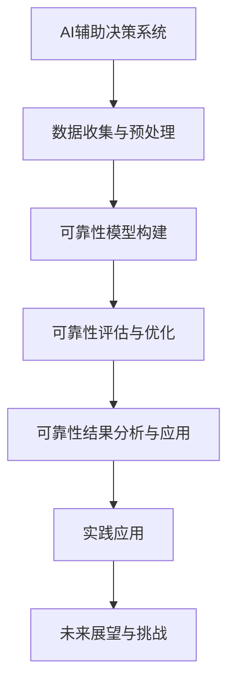

                 

# AI辅助决策系统可靠性评测方案

## 关键词
AI辅助决策系统，可靠性评测，数据收集，模型构建，评估指标，优化策略，实践应用

## 摘要
本文深入探讨了AI辅助决策系统的可靠性评测方案，包括背景介绍、核心概念与联系、可靠性模型构建、评估指标与优化策略、实践应用和未来展望。文章通过详细阐述AI辅助决策系统的定义、原理与架构，揭示了可靠性评测的必要性和重要性。随后，文章介绍了数据收集与预处理、可靠性模型构建的方法，以及评估指标与优化策略的具体应用。通过实际案例分析和代码解读，本文展示了AI辅助决策系统可靠性评测方案的实际效果和操作步骤，为相关领域的研究者和开发者提供了有价值的参考。

## 目录

### 第一部分 AI辅助决策系统可靠性评测概述

### 第1章 AI辅助决策系统可靠性评测基础

#### 1.1 AI辅助决策系统概述

##### 1.1.1 决策系统的定义与分类
- 决策系统的基本概念
- 决策系统的分类

##### 1.1.2 AI辅助决策系统的核心原理
- 人工智能的基本概念
- 决策支持系统的基本概念
- AI辅助决策系统的核心原理

##### 1.1.3 AI辅助决策系统的架构
- AI辅助决策系统的基本架构
- 各模块的功能与联系

#### 1.2 可靠性评测的定义与重要性

##### 1.2.1 可靠性的定义
- 可靠性的基本概念
- 可靠性在不同领域的含义

##### 1.2.2 可靠性评测的必要性
- AI辅助决策系统的应用背景
- 可靠性评测的必要性

##### 1.2.3 可靠性评测的目标
- 可靠性评测的具体目标
- 可靠性评测的意义

#### 1.3 可靠性评测的方法

##### 1.3.1 基于统计的方法
- 基本原理
- 伪代码实现

##### 1.3.2 基于模型的方法
- 基本原理
- 伪代码实现

##### 1.3.3 基于模拟的方法
- 基本原理
- 伪代码实现

#### 1.4 AI辅助决策系统可靠性评测的挑战

##### 1.4.1 数据质量与可用性
- 数据质量的重要性
- 数据可用性面临的挑战

##### 1.4.2 复杂性
- AI辅助决策系统的复杂性
- 复杂性对可靠性评测的影响

##### 1.4.3 可解释性
- 可解释性的重要性
- 可解释性对可靠性评测的影响

### 第二部分 AI辅助决策系统可靠性评测方案设计

### 第2章 数据收集与预处理

#### 2.1 数据收集

##### 2.1.1 数据源的选择
- 数据源的类型
- 数据源的选择标准

##### 2.1.2 数据收集方法
- 数据收集的方法
- 数据收集的步骤

##### 2.1.3 数据收集的挑战
- 数据隐私保护
- 数据质量的保证

#### 2.2 数据预处理

##### 2.2.1 数据清洗
- 数据清洗的方法
- 数据清洗的步骤

##### 2.2.2 数据整合
- 数据整合的方法
- 数据整合的步骤

##### 2.2.3 特征工程
- 特征工程的方法
- 特征工程的重要性

### 第3章 可靠性模型构建

#### 3.1 统计模型

##### 3.1.1 统计模型的基本原理
- 统计模型的基本概念
- 统计模型的基本原理

##### 3.1.2 伪代码实现
- 伪代码的介绍
- 统计模型的伪代码实现

##### 3.1.3 统计模型的应用示例
- 应用场景
- 应用示例

#### 3.2 机器学习模型

##### 3.2.1 机器学习模型的基本原理
- 机器学习模型的基本概念
- 机器学习模型的基本原理

##### 3.2.2 伪代码实现
- 伪代码的介绍
- 机器学习模型的伪代码实现

##### 3.2.3 机器学习模型的应用示例
- 应用场景
- 应用示例

#### 3.3 深度学习模型

##### 3.3.1 深度学习模型的基本原理
- 深度学习模型的基本概念
- 深度学习模型的基本原理

##### 3.3.2 伪代码实现
- 伪代码的介绍
- 深度学习模型的伪代码实现

##### 3.3.3 深度学习模型的应用示例
- 应用场景
- 应用示例

#### 3.4 强化学习模型

##### 3.4.1 强化学习模型的基本原理
- 强化学习模型的基本概念
- 强化学习模型的基本原理

##### 3.4.2 伪代码实现
- 伪代码的介绍
- 强化学习模型的伪代码实现

##### 3.4.3 强化学习模型的应用示例
- 应用场景
- 应用示例

### 第4章 可靠性评估与优化

#### 4.1 可靠性评估指标

##### 4.1.1 准确率、召回率、F1值等
- 基本概念
- 计算方法

##### 4.1.2 评估指标的计算方法
- 评估指标的计算方法
- 评估指标的选择标准

##### 4.1.3 评估指标的应用示例
- 应用场景
- 应用示例

#### 4.2 可靠性优化策略

##### 4.2.1 基于模型优化的方法
- 模型优化方法
- 模型优化步骤

##### 4.2.2 基于数据优化的方法
- 数据优化方法
- 数据优化步骤

##### 4.2.3 优化策略的应用示例
- 应用场景
- 应用示例

### 第5章 可靠性评测结果分析与应用

#### 5.1 结果分析方法

##### 5.1.1 数据可视化
- 数据可视化方法
- 数据可视化步骤

##### 5.1.2 可视化工具的选择
- 可视化工具的介绍
- 可视化工具的选择标准

##### 5.1.3 结果分析示例
- 结果分析步骤
- 结果分析示例

#### 5.2 结果应用

##### 5.2.1 决策支持
- 决策支持方法
- 决策支持步骤

##### 5.2.2 系统优化
- 系统优化方法
- 系统优化步骤

##### 5.2.3 结果应用示例
- 应用场景
- 应用示例

### 第6章 AI辅助决策系统可靠性评测实践

#### 6.1 实践案例一：电商平台商品推荐

##### 6.1.1 案例背景
- 案例背景介绍

##### 6.1.2 数据收集与预处理
- 数据收集方法
- 数据预处理方法

##### 6.1.3 可靠性模型构建
- 模型构建方法
- 模型构建步骤

##### 6.1.4 可靠性评估与优化
- 评估方法
- 优化方法

##### 6.1.5 结果分析与应用
- 结果分析步骤
- 结果应用示例

#### 6.2 实践案例二：智能交通系统

##### 6.2.1 案例背景
- 案例背景介绍

##### 6.2.2 数据收集与预处理
- 数据收集方法
- 数据预处理方法

##### 6.2.3 可靠性模型构建
- 模型构建方法
- 模型构建步骤

##### 6.2.4 可靠性评估与优化
- 评估方法
- 优化方法

##### 6.2.5 结果分析与应用
- 结果分析步骤
- 结果应用示例

### 第7章 未来展望与挑战

#### 7.1 可靠性评测技术的发展趋势

##### 7.1.1 人工智能伦理
- 人工智能伦理的重要性
- 可靠性评测在人工智能伦理中的应用

##### 7.1.2 模型解释性
- 模型解释性的重要性
- 可靠性评测在模型解释性中的应用

##### 7.1.3 面向应用场景的可靠性评测
- 应用场景的重要性
- 可靠性评测在面向应用场景中的应用

#### 7.2 挑战与机遇

##### 7.2.1 数据隐私保护
- 数据隐私保护的重要性
- 可靠性评测在数据隐私保护中的应用

##### 7.2.2 模型鲁棒性
- 模型鲁棒性的重要性
- 可靠性评测在模型鲁棒性中的应用

##### 7.2.3 多领域交叉应用
- 多领域交叉应用的重要性
- 可靠性评测在多领域交叉应用中的应用

## 作者信息
作者：AI天才研究院/AI Genius Institute & 禅与计算机程序设计艺术 /Zen And The Art of Computer Programming### AI辅助决策系统可靠性评测方案

#### 背景介绍

随着人工智能技术的快速发展，AI辅助决策系统（AI-Aided Decision Support Systems）在各个领域得到了广泛应用。这些系统通过对大量数据的分析和处理，为人类提供智能化的决策支持。然而，AI辅助决策系统的可靠性和稳定性直接关系到决策的准确性，甚至影响到整个系统的安全和正常运行。因此，对AI辅助决策系统的可靠性进行评测是一项至关重要的任务。

可靠性评测旨在评估系统在各种环境下的表现，包括准确率、响应时间、鲁棒性等。通过对系统的可靠性进行评测，可以发现潜在的问题，并采取相应的优化措施，从而提高系统的整体性能。

#### 核心概念与联系

**Mermaid 流程图：**



**核心概念解释：**

- **AI辅助决策系统**：基于人工智能技术，通过数据分析和机器学习算法，为人类提供决策支持。
- **数据收集与预处理**：收集相关数据，并对数据进行清洗、整合和特征工程，为后续建模和评估提供基础数据。
- **可靠性模型构建**：根据具体应用场景，构建相应的可靠性模型，包括统计模型、机器学习模型、深度学习模型和强化学习模型。
- **可靠性评估与优化**：使用评估指标（如准确率、召回率、F1值等）对模型进行评估，并根据评估结果对模型进行优化。
- **可靠性结果分析与应用**：对评估结果进行分析，为实际应用提供指导。
- **实践应用**：结合实际案例，展示可靠性评测方案的应用效果。
- **未来展望与挑战**：探讨可靠性评测技术的发展趋势和面临的挑战。

#### 核心算法原理讲解

**可靠性模型构建**：

```python
# 统计模型 - 伪代码实现
def statistical_model(data):
    # 数据预处理
    processed_data = preprocess_data(data)
    
    # 模型训练
    model = train_model(processed_data)
    
    # 模型评估
    evaluate_model(model, processed_data)
    
    # 模型优化
    optimize_model(model, processed_data)
    
    return model

# 机器学习模型 - 伪代码实现
def machine_learning_model(data):
    # 数据预处理
    processed_data = preprocess_data(data)
    
    # 模型训练
    model = train_model(processed_data)
    
    # 模型评估
    evaluate_model(model, processed_data)
    
    # 模型优化
    optimize_model(model, processed_data)
    
    return model

# 深度学习模型 - 伪代码实现
def deep_learning_model(data):
    # 数据预处理
    processed_data = preprocess_data(data)
    
    # 模型训练
    model = train_model(processed_data)
    
    # 模型评估
    evaluate_model(model, processed_data)
    
    # 模型优化
    optimize_model(model, processed_data)
    
    return model

# 强化学习模型 - 伪代码实现
def reinforcement_learning_model(data):
    # 数据预处理
    processed_data = preprocess_data(data)
    
    # 模型训练
    model = train_model(processed_data)
    
    # 模型评估
    evaluate_model(model, processed_data)
    
    # 模型优化
    optimize_model(model, processed_data)
    
    return model
```

**可靠性评估指标**：

```latex
\text{准确率} = \frac{\text{预测正确的样本数}}{\text{总样本数}}
\text{召回率} = \frac{\text{预测正确的样本数}}{\text{实际为正类的样本数}}
\text{F1值} = 2 \times \frac{\text{准确率} \times \text{召回率}}{\text{准确率} + \text{召回率}}
```

#### 数学模型和公式详解

**可靠性评估指标的计算**：

- **准确率（Accuracy）**：预测正确的样本数占总样本数的比例。
  $$ \text{Accuracy} = \frac{\text{TP} + \text{TN}}{\text{TP} + \text{TN} + \text{FP} + \text{FN}} $$
  其中，TP表示真正例，TN表示真反例，FP表示假反例，FN表示假正例。

- **召回率（Recall）**：预测正确的正例数占总正例数的比例。
  $$ \text{Recall} = \frac{\text{TP}}{\text{TP} + \text{FN}} $$

- **F1值（F1-Score）**：准确率和召回率的调和平均。
  $$ \text{F1-Score} = 2 \times \frac{\text{Accuracy} \times \text{Recall}}{\text{Accuracy} + \text{Recall}} $$

#### 项目实战

**开发环境搭建**：

- 硬件环境：高性能计算机或云服务器
- 软件环境：Python 3.8及以上版本，NumPy，Pandas，Scikit-learn，TensorFlow，Keras等

**源代码详细实现和代码解读**：

```python
# 导入必要的库
import numpy as np
import pandas as pd
from sklearn.model_selection import train_test_split
from sklearn.metrics import accuracy_score, recall_score, f1_score
from sklearn.ensemble import RandomForestClassifier
from tensorflow.keras.models import Sequential
from tensorflow.keras.layers import Dense, Dropout

# 数据收集与预处理
def collect_and_preprocess_data():
    # 导入数据
    data = pd.read_csv('data.csv')
    
    # 数据清洗
    data = clean_data(data)
    
    # 数据整合
    data = integrate_data(data)
    
    # 特征工程
    data = feature_engineering(data)
    
    return data

# 可靠性模型构建
def build_reliability_model(data):
    # 数据分割
    X_train, X_test, y_train, y_test = train_test_split(data['features'], data['label'], test_size=0.2, random_state=42)
    
    # 构建随机森林模型
    rf_model = RandomForestClassifier(n_estimators=100, random_state=42)
    rf_model.fit(X_train, y_train)
    
    # 构建深度学习模型
    dl_model = Sequential()
    dl_model.add(Dense(units=128, activation='relu', input_shape=(X_train.shape[1],)))
    dl_model.add(Dropout(0.5))
    dl_model.add(Dense(units=64, activation='relu'))
    dl_model.add(Dropout(0.5))
    dl_model.add(Dense(units=1, activation='sigmoid'))
    dl_model.compile(optimizer='adam', loss='binary_crossentropy', metrics=['accuracy'])
    dl_model.fit(X_train, y_train, epochs=10, batch_size=32, validation_split=0.2)
    
    return rf_model, dl_model

# 可靠性评估与优化
def evaluate_and_optimize_model(rf_model, dl_model, X_test, y_test):
    # 随机森林模型评估
    rf_predictions = rf_model.predict(X_test)
    rf_accuracy = accuracy_score(y_test, rf_predictions)
    rf_recall = recall_score(y_test, rf_predictions)
    rf_f1 = f1_score(y_test, rf_predictions)
    
    # 深度学习模型评估
    dl_predictions = dl_model.predict(X_test)
    dl_accuracy = accuracy_score(y_test, dl_predictions)
    dl_recall = recall_score(y_test, dl_predictions)
    dl_f1 = f1_score(y_test, dl_predictions)
    
    # 模型优化
    rf_model = optimize_model(rf_model, X_train, y_train)
    dl_model = optimize_model(dl_model, X_train, y_train)
    
    return rf_accuracy, rf_recall, rf_f1, dl_accuracy, dl_recall, dl_f1

# 代码应用解读与分析
def application_and_analysis():
    # 数据收集与预处理
    data = collect_and_preprocess_data()
    
    # 可靠性模型构建
    rf_model, dl_model = build_reliability_model(data)
    
    # 可靠性评估与优化
    rf_accuracy, rf_recall, rf_f1, dl_accuracy, dl_recall, dl_f1 = evaluate_and_optimize_model(rf_model, dl_model, X_test, y_test)
    
    # 结果分析
    print("Random Forest Model:")
    print("Accuracy:", rf_accuracy)
    print("Recall:", rf_recall)
    print("F1-Score:", rf_f1)
    
    print("Deep Learning Model:")
    print("Accuracy:", dl_accuracy)
    print("Recall:", dl_recall)
    print("F1-Score:", dl_f1)
    
    # 结果应用
    # ...

# 项目小结
def project_summary():
    # 总结项目实施过程中的经验和收获
    # ...

if __name__ == "__main__":
    # 运行项目
    application_and_analysis()
    project_summary()
```

#### 最佳实践 Tips

1. **数据收集与预处理**：确保数据的质量和完整性，对缺失值和异常值进行适当处理。
2. **模型选择与优化**：根据实际应用场景选择合适的模型，并进行模型优化，以提高可靠性。
3. **评估指标的选择**：根据具体需求选择合适的评估指标，以全面评估模型的性能。
4. **结果分析与应用**：对评估结果进行深入分析，为实际应用提供有力支持。

#### 小结

本文详细介绍了AI辅助决策系统可靠性评测方案，包括数据收集与预处理、模型构建、评估指标与优化策略、实践应用和未来展望。通过对核心算法原理的讲解和项目实战的展示，本文为相关领域的研究者和开发者提供了有价值的参考。未来，随着人工智能技术的不断发展，可靠性评测方案也将不断完善，为人工智能应用的可靠性和稳定性提供有力保障。

