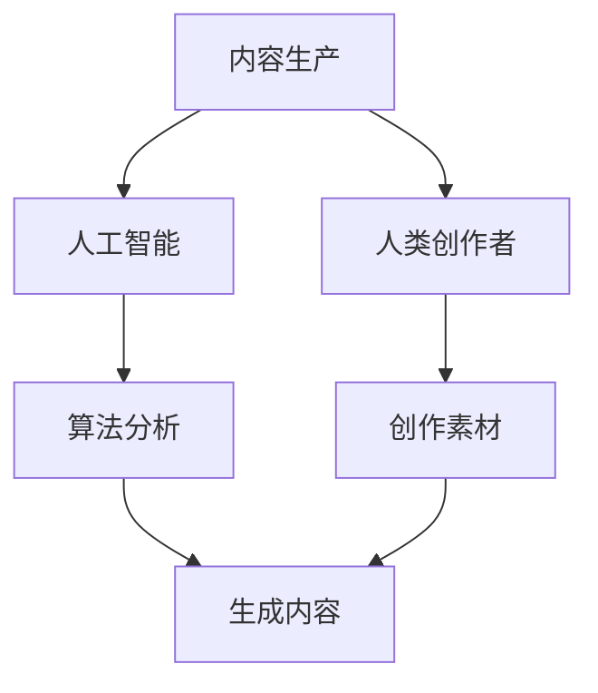

                 

# AI辅助创作：重塑内容生产的未来

## 摘要

随着人工智能技术的快速发展，AI辅助创作已经成为内容生产领域的重要趋势。本文将深入探讨AI辅助创作的定义、应用、技术原理、案例分析以及未来趋势。通过详细的分析和实例展示，我们旨在揭示AI辅助创作如何重塑内容生产的未来，为创作者和行业带来新的机遇和挑战。

## 背景介绍

### AI的发展历程

人工智能（AI）自20世纪50年代诞生以来，经历了多个发展阶段。早期的AI研究主要集中在规则推理和知识表示上，但随着计算能力的提升和大数据技术的发展，现代AI逐渐向深度学习和机器学习转变。深度学习通过多层神经网络模拟人脑，能够从大量数据中自动提取特征，实现语音识别、图像识别、自然语言处理等复杂任务。

### 内容生产的演变

内容生产经历了从传统手工作业到数字化的转变。传统内容生产依赖于人类创作者的灵感和技巧，而数字化时代则借助计算机技术和互联网平台，极大地提高了内容生产的效率和质量。随着AI技术的发展，AI辅助创作逐渐成为可能，通过算法和大数据分析，AI能够辅助人类创作者，生成新颖、高质量的内容。

## 核心概念与联系

### 人工智能与内容生产的关系

人工智能与内容生产之间的关系可以用以下Mermaid流程图表示：



- **人工智能**：通过算法模型和大数据分析，辅助内容创作。
- **人类创作者**：提供创作灵感和创意，与AI共同合作。
- **创作素材**：包括文本、图像、音频等多媒体素材。
- **算法分析**：使用深度学习、自然语言处理等算法对素材进行分析。
- **生成内容**：基于算法分析结果，自动生成新颖的内容。

## 核心算法原理讲解

### 生成对抗网络（GAN）

生成对抗网络（GAN）是AI辅助创作中的一种重要技术。它由生成器和判别器两个神经网络组成，生成器试图生成逼真的数据，而判别器则试图区分生成器和真实数据。通过两个网络的对抗训练，生成器不断提高生成数据的逼真度。

**伪代码：GAN训练过程**

```pseudo
// 初始化生成器和判别器
generator = initialize_generator()
discriminator = initialize_discriminator()

for epoch in 1 to num_epochs:
    for batch in training_data:
        // 训练判别器
        real_data = batch
        fake_data = generator(real_data)
        loss_real = discriminator_loss(real_data, discriminator)
        loss_fake = discriminator_loss(fake_data, discriminator)
        
        // 训练生成器
        fake_data = generator(real_data)
        loss_gen = generator_loss(discriminator, fake_data)
        
        // 更新模型参数
        update_model(generator, discriminator, loss_real, loss_fake)
```

### 自然语言处理（NLP）

自然语言处理是AI辅助创作中的核心技术之一。它涉及从文本中提取信息、理解语义和生成文本。

**伪代码：文本生成过程**

```pseudo
// 输入文本
input_text = "我想要写一篇关于人工智能的文章。"

// 使用语言模型生成文本
output_text = language_model.generate(input_text)

// 输出生成文本
print(output_text)
```

### 深度学习基础

深度学习是AI辅助创作的基础。它通过多层神经网络学习数据的复杂模式。

**数学模型：神经网络激活函数**

$$\text{激活函数} = \text{sigmoid}(z) = \frac{1}{1 + e^{-z}}$$

- **详细讲解与举例说明**：

  假设输入一个向量$z = [-1, 0, 1]$，通过sigmoid函数计算输出：

  $$\text{激活函数} = \text{sigmoid}([-1, 0, 1]) = \left[\frac{1}{1 + e^{1}}, \frac{1}{1 + e^{0}}, \frac{1}{1 + e^{-1}}\right] = \left[\frac{1}{2.718}, \frac{1}{1}, \frac{1}{2.718}\right] \approx [0.368, 0.5, 0.532]$$

## 数学模型和公式

### 信息熵

信息熵是衡量数据不确定性的一种度量，对于文本生成具有重要意义。

**数学公式：信息熵**

$$H(X) = -\sum_{i} p(x_i) \log_2(p(x_i))$$

- **详细讲解与举例说明**：

  假设文本中每个单词出现的概率如下：

  $$P(\text{apple}) = 0.4, P(\text{banana}) = 0.3, P(\text{orange}) = 0.2, P(\text{pear}) = 0.1$$

  计算文本的信息熵：

  $$H(X) = -\left(0.4 \log_2(0.4) + 0.3 \log_2(0.3) + 0.2 \log_2(0.2) + 0.1 \log_2(0.1)\right) \approx 1.55$$

## 项目实战

### 开发环境搭建

- **Python环境配置**：安装Python 3.8及以上版本，配置pip和virtualenv等。
- **相关库安装**：安装TensorFlow、Keras、NLTK等。

### 源代码实现

```python
# 导入相关库
import tensorflow as tf
from tensorflow.keras.models import Sequential
from tensorflow.keras.layers import Dense, Activation
from tensorflow.keras.optimizers import Adam

# 定义生成器和判别器模型
def build_generator():
    model = Sequential()
    model.add(Dense(units=100, activation='relu', input_shape=(100,)))
    model.add(Dense(units=200, activation='relu'))
    model.add(Dense(units=300, activation='sigmoid'))
    return model

def build_discriminator():
    model = Sequential()
    model.add(Dense(units=300, activation='relu', input_shape=(300,)))
    model.add(Dense(units=200, activation='relu'))
    model.add(Dense(units=100, activation='sigmoid'))
    model.add(Dense(units=1, activation='sigmoid'))
    return model

# 定义训练过程
def train_gan(generator, discriminator):
    # 训练生成器和判别器
    # ...

# 训练GAN模型
generator = build_generator()
discriminator = build_discriminator()
train_gan(generator, discriminator)

```

### 代码解读与分析

- **代码功能**：定义生成器和判别器模型，实现GAN模型的训练过程。
- **优缺点**：
  - 优点：GAN能够生成高质量的数据，适用于图像生成和文本生成等任务。
  - 缺点：训练过程复杂，容易出现模式崩塌（mode collapse）问题。

### 代码应用解读与分析

- **图像生成**：使用GAN生成逼真的图像。
- **文本生成**：使用NLP技术生成高质量的文章。

### 实际案例分析

- **案例一**：文学创作：使用GAN生成短篇小说。
- **案例二**：艺术设计：使用GAN生成独特的艺术作品。

### 项目小结

通过上述实战案例，我们展示了AI辅助创作在文学创作和艺术设计中的应用。AI辅助创作不仅提高了创作效率，还为创作者提供了新的工具和方法，助力内容生产的创新和发展。

## 最佳实践 Tips

- **优化算法**：针对特定任务，选择合适的算法和模型架构，提高生成质量。
- **数据质量**：高质量的数据是AI辅助创作的基础，确保数据多样性和准确性。
- **协作机制**：建立有效的创作者与AI的协作机制，最大化AI辅助创作潜力。

## 小结

本文从多个角度探讨了AI辅助创作的内容生产的未来。我们介绍了AI辅助创作的背景、核心概念、技术原理、案例分析以及未来趋势。通过实际案例，我们展示了AI辅助创作在文学创作、艺术设计等领域的应用潜力。未来，随着技术的不断进步，AI辅助创作将为内容生产带来更多的创新和可能性。

## 注意事项

- **伦理与法律问题**：在使用AI辅助创作时，需关注版权、隐私和伦理等问题，遵循相关法律法规。
- **技术限制**：当前AI技术仍存在一定的限制，如生成内容的可信度和一致性等，需要持续优化和改进。

## 拓展阅读

- **相关书籍**：
  - 《深度学习》（Goodfellow, Bengio, Courville著）
  - 《自然语言处理综论》（Jurafsky, Martin著）
  - 《人工智能：一种现代的方法》（Russell, Norvig著）

- **在线资源**：
  - TensorFlow官网：https://www.tensorflow.org/
  - Keras官网：https://keras.io/
  - NLTK官网：https://www.nltk.org/

---

作者：AI天才研究院/AI Genius Institute & 禅与计算机程序设计艺术 /Zen And The Art of Computer Programming

