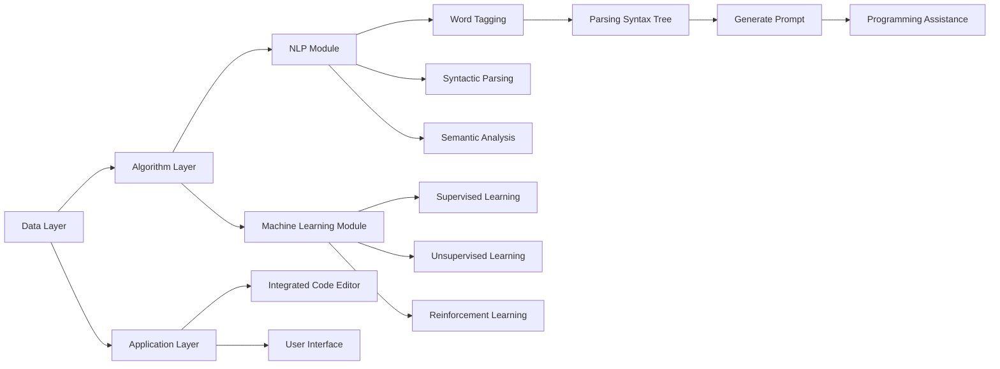

                 

### 文章标题：AI辅助提示词编程工具开发

---

## 关键词
AI辅助提示词编程、自然语言处理、机器学习、深度学习、编程辅助工具、算法实现、项目实战

---

## 摘要
本文将深入探讨AI辅助提示词编程工具的开发，涵盖从基础概念到实际应用的全方位内容。我们将详细介绍AI辅助提示词编程的核心原理，包括自然语言处理、机器学习和深度学习的基础算法，并通过实例代码和数学公式解释核心算法的实现。此外，本文还将展示如何搭建开发环境、实现核心功能，并通过实际项目案例进行测试与优化。文章末尾还将提供最佳实践、小结和拓展阅读，以帮助读者更好地理解和应用AI辅助提示词编程技术。

---

## 目录
1. 引言
   1.1 AI辅助提示词编程的背景和意义
   1.2 当前研究与应用现状
2. AI辅助提示词编程基础
   2.1 自然语言处理基础
   2.2 机器学习与深度学习原理
   2.3 AI辅助提示词编程算法详解
3. AI辅助提示词编程工具技术架构
   3.1 系统架构设计
   3.2 数据处理与存储
   3.3 模型训练与优化
4. AI辅助提示词编程工具实战
   4.1 开发环境搭建
   4.2 核心功能实现
   4.3 测试与优化
5. 项目实战案例
   5.1 项目背景与需求分析
   5.2 项目设计
   5.3 项目开发与实现
   5.4 项目测试与优化
6. 最佳实践与注意事项
7. 总结
8. 拓展阅读

---

## 引言

### 1.1 AI辅助提示词编程的背景和意义

随着人工智能技术的快速发展，编程辅助工具逐渐成为开发者的重要助手。AI辅助提示词编程，作为人工智能在编程领域的一个重要应用，正日益受到关注。其核心思想是通过机器学习和自然语言处理技术，为开发者提供智能化的编程提示，从而提高开发效率和代码质量。

AI辅助提示词编程的背景可以追溯到自然语言处理和编程辅助工具的兴起。自然语言处理（NLP）作为人工智能的一个重要分支，已经广泛应用于语音识别、机器翻译、情感分析等领域。随着NLP技术的成熟，人们开始探索如何将NLP技术应用于编程领域，从而辅助开发者完成复杂的编程任务。

AI辅助提示词编程的意义主要体现在以下几个方面：

1. **提高开发效率**：AI辅助提示词编程能够根据开发者输入的代码片段，提供相关的提示和建议，从而减少开发者查找资料的时间，提高编程效率。
2. **降低编程难度**：对于初学者来说，AI辅助提示词编程可以帮助他们理解复杂的编程概念，从而降低编程学习门槛。
3. **优化代码质量**：AI辅助提示词编程可以提供代码审查和优化建议，帮助开发者写出更加健壮、高效的代码。

### 1.2 当前研究与应用现状

目前，AI辅助提示词编程已经在多个领域取得了显著的成果。以下是一些典型的研究与应用现状：

1. **代码补全工具**：如GitHub的Copilot，能够根据开发者输入的代码片段自动生成完整的代码。
2. **编程助手**：如Google的智能助手，能够通过自然语言交互帮助开发者解决问题。
3. **代码审查工具**：如AI驱动的代码审查工具，能够自动检测代码中的潜在错误和性能问题。

然而，AI辅助提示词编程仍然面临一些挑战，如：

- **准确性问题**：AI辅助提示词编程的准确性受到输入代码质量和模型训练数据的影响。
- **通用性问题**：不同编程语言和框架的辅助需求不同，如何设计通用的辅助工具仍需深入研究。
- **用户隐私与安全**：如何保护用户隐私和确保工具的安全性也是重要议题。

接下来，我们将详细探讨AI辅助提示词编程的基础知识，包括自然语言处理、机器学习和深度学习的相关概念和原理。

## AI辅助提示词编程基础

### 2.1 自然语言处理基础

自然语言处理（NLP）是人工智能的一个重要分支，旨在使计算机能够理解、生成和处理人类语言。在AI辅助提示词编程中，NLP技术用于解析开发者输入的自然语言指令，并将其转换为编程语言。以下是NLP的一些核心概念：

#### 核心概念

1. **词性标注（Part-of-Speech Tagging）**：词性标注是将句子中的每个单词标注为其对应的词性（如名词、动词、形容词等）。
2. **句法分析（Syntactic Parsing）**：句法分析是理解句子结构的过程，通常通过构建句法树来表示句子的语法结构。
3. **语义分析（Semantic Analysis）**：语义分析是理解句子所表达的含义，包括实体识别、情感分析等。

#### 核心算法

1. **隐马尔可夫模型（HMM）**：HMM是一种用于序列模型的方法，适用于词性标注任务。
2. **条件随机场（CRF）**：CRF是一种基于概率的图模型，常用于句法分析和语义分析。
3. **递归神经网络（RNN）**：RNN能够处理序列数据，适用于自然语言处理的多个任务。

#### 实例代码

以下是一个简单的词性标注的伪代码示例：

```python
def word_tagging(sentence):
    tagged_sentence = []
    for word in sentence:
        tag = predict_tag(word)
        tagged_sentence.append((word, tag))
    return tagged_sentence
```

### 2.2 机器学习与深度学习原理

机器学习和深度学习是AI辅助提示词编程的核心技术。机器学习是一种使计算机从数据中学习规律和模式的方法，而深度学习则是一种基于多层神经网络的机器学习方法。

#### 核心概念

1. **监督学习（Supervised Learning）**：监督学习通过标注数据进行学习，目标是预测未知数据的标签。
2. **无监督学习（Unsupervised Learning）**：无监督学习从无标签数据中学习模式，通常用于聚类和降维任务。
3. **强化学习（Reinforcement Learning）**：强化学习通过试错方式学习最优策略，常用于游戏和机器人控制等领域。

#### 核心算法

1. **线性回归（Linear Regression）**：线性回归是一种简单的监督学习算法，用于预测连续值。
2. **支持向量机（SVM）**：SVM是一种用于分类的监督学习算法，通过寻找最优超平面进行分类。
3. **卷积神经网络（CNN）**：CNN是一种用于图像处理和识别的深度学习算法，通过卷积层提取图像特征。

#### 实例代码

以下是一个简单的线性回归的伪代码示例：

```python
def linear_regression(x, y):
    weights = initialize_weights(x.shape[1])
    biases = initialize_biases(x.shape[1])
    for epoch in range(num_epochs):
        for sample in data:
            predictions = forward_pass(sample, weights, biases)
            loss = compute_loss(predictions, sample)
            backward_pass(predictions, sample, weights, biases)
    return weights, biases
```

### 2.3 AI辅助提示词编程算法详解

AI辅助提示词编程算法主要包括提示词生成和编程辅助两部分。以下是这两个部分的核心算法和实现方法。

#### 提示词生成算法

提示词生成算法的核心任务是生成与开发者输入相关的编程提示词。以下是一个简单的提示词生成算法的伪代码示例：

```python
def generate_prompt(code):
    tokens = tokenize(code)
    tagged_tokens = word_tagging(tokens)
    syntax_tree = parse_syntax_tree(tagged_tokens)
    prompt = generate_from_syntax_tree(syntax_tree)
    return prompt
```

#### 编程辅助算法

编程辅助算法的核心任务是提供编程过程中的辅助功能，如代码补全、错误检测和优化建议。以下是一个简单的编程辅助算法的伪代码示例：

```python
def programming_assistance(code):
    prompt = generate_prompt(code)
    suggestions = generate_suggestions(prompt)
    return suggestions
```

### 总结

在本节中，我们介绍了AI辅助提示词编程的基础知识，包括自然语言处理、机器学习和深度学习的相关概念和算法。通过这些知识，我们可以为开发者提供智能化的编程辅助，从而提高开发效率和代码质量。

在下一节中，我们将深入探讨AI辅助提示词编程工具的技术架构，包括系统设计、数据处理和模型训练等内容。

## AI辅助提示词编程工具技术架构

### 3.1 系统架构设计

AI辅助提示词编程工具的系统架构设计是确保其功能完备、性能优异和安全可靠的关键。系统架构可以分为以下几个层次：

#### 数据层

数据层负责存储和管理用于训练和使用的各种数据。主要包括：

- **代码库**：存储大量的编程示例和案例，用于训练和测试算法。
- **用户数据**：存储用户的编程行为和偏好，用于个性化提示。

#### 算法层

算法层是核心部分，负责实现提示词生成和编程辅助功能。主要包括：

- **自然语言处理模块**：包括词性标注、句法分析和语义分析等，用于解析开发者输入的自然语言指令。
- **机器学习模块**：包括监督学习、无监督学习和强化学习算法，用于训练和优化提示词生成和编程辅助模型。

#### 应用层

应用层是系统与开发者交互的界面，主要包括：

- **代码编辑器集成**：将AI辅助提示词编程工具集成到开发者常用的代码编辑器中，提供实时的编程提示。
- **用户界面**：提供用户操作界面，包括提示词展示、提示词选择和反馈等功能。

#### 系统架构图

以下是AI辅助提示词编程工具的系统架构图：



### 3.2 数据处理与存储

数据处理与存储是AI辅助提示词编程工具的关键环节，直接影响模型的训练效果和系统的运行效率。以下是数据处理与存储的几个关键点：

#### 数据收集

- **代码库**：通过开源项目、代码库和社区分享等渠道收集高质量的编程案例。
- **用户行为**：收集用户在编程过程中的行为数据，如编辑记录、错误日志等。

#### 数据预处理

- **清洗**：去除无效数据，如重复、错误和缺失的数据。
- **转换**：将原始数据转换为适合模型训练的格式，如将文本转换为词向量。

#### 数据存储

- **数据库**：使用关系型数据库（如MySQL）或NoSQL数据库（如MongoDB）存储大规模数据。
- **分布式存储**：对于超大规模数据，可以使用分布式文件系统（如HDFS）进行存储和管理。

### 3.3 模型训练与优化

模型训练与优化是AI辅助提示词编程工具的核心环节，其目标是提高模型的准确性和性能。以下是模型训练与优化的几个关键步骤：

#### 训练过程

- **数据划分**：将数据集划分为训练集、验证集和测试集，用于模型训练、验证和测试。
- **模型初始化**：初始化模型参数，可以使用随机初始化或预训练模型。
- **训练循环**：通过迭代优化模型参数，使得模型在训练集上的性能逐渐提高。

#### 优化方法

- **梯度下降**：常用的优化算法，通过更新模型参数以最小化损失函数。
- **批量大小调整**：调整批量大小可以影响模型的训练效率和稳定性。
- **正则化**：使用正则化方法（如L1、L2正则化）防止模型过拟合。

#### 模型评估

- **准确性评估**：通过计算模型在测试集上的准确性来评估模型性能。
- **F1分数**：对于分类任务，计算精确率和召回率的调和平均数。
- **BLEU评分**：用于评估生成文本的质量，适用于自然语言生成任务。

#### 模型优化

- **超参数调整**：通过调整学习率、批量大小等超参数来优化模型性能。
- **集成学习**：结合多个模型的优势，提高整体性能。
- **模型压缩**：使用模型压缩技术（如剪枝、量化）减少模型大小和计算复杂度。

### 总结

在本节中，我们介绍了AI辅助提示词编程工具的技术架构，包括系统设计、数据处理与存储以及模型训练与优化。通过合理的架构设计和高效的模型训练，我们可以实现功能强大、性能优异的AI辅助提示词编程工具。

在下一节中，我们将深入探讨AI辅助提示词编程工具的核心功能实现，包括提示词生成、编程辅助等。

## AI辅助提示词编程工具实战

### 4.1 开发环境搭建

要开发一个AI辅助提示词编程工具，首先需要搭建一个合适的开发环境。以下是一个基本的开发环境搭建步骤：

#### 1. 安装Python环境

首先，确保计算机上安装了Python。Python是AI辅助提示词编程工具的主要编程语言。可以通过以下命令安装Python：

```bash
# 使用pip安装Python
pip install python
```

#### 2. 安装依赖库

接下来，需要安装一些关键的依赖库，如TensorFlow、PyTorch、NLTK等。这些库提供了实现AI算法所需的工具和模块。可以通过以下命令安装：

```bash
# 安装TensorFlow
pip install tensorflow

# 安装PyTorch
pip install torch torchvision

# 安装NLTK
pip install nltk
```

#### 3. 配置环境变量

确保环境变量设置正确，以便在命令行中能够轻松调用Python和相关库。在Windows系统中，可以通过“环境变量”设置，而在Linux和Mac OS系统中，可以通过编辑`~/.bashrc`或`~/.zshrc`文件来设置。

```bash
# 在Linux和Mac OS系统中设置环境变量
export PATH=$PATH:/path/to/python
export PATH=$PATH:/path/to/tensorflow
export PATH=$PATH:/path/to/PyTorch
```

#### 4. 安装代码编辑器

选择一个合适的代码编辑器，如Visual Studio Code、PyCharm或Sublime Text。这些编辑器提供了丰富的编程功能和调试工具，有助于开发高效、可靠的AI辅助提示词编程工具。

#### 5. 准备数据集

为了训练AI模型，需要准备合适的数据集。可以从开源代码库、社区分享或自己编写代码收集数据。确保数据集足够大且具有代表性，以训练出性能良好的模型。

### 4.2 核心功能实现

AI辅助提示词编程工具的核心功能包括提示词生成、编程辅助和代码审查等。以下是这些功能的实现方法：

#### 提示词生成

提示词生成是AI辅助提示词编程工具的核心功能之一。其目的是根据开发者输入的代码片段生成相关的提示词。以下是一个简单的提示词生成算法的实现步骤：

1. **数据预处理**：对输入的代码片段进行预处理，包括文本清洗、分词和词性标注等。

2. **语法分析**：使用自然语言处理技术对预处理后的文本进行语法分析，构建句法树。

3. **生成提示词**：根据句法树生成相关的提示词。可以使用预训练的模型或自定义模型来实现。

以下是一个简单的伪代码示例：

```python
def generate_prompt(code):
    tokens = tokenize(code)
    tagged_tokens = word_tagging(tokens)
    syntax_tree = parse_syntax_tree(tagged_tokens)
    prompt = generate_from_syntax_tree(syntax_tree)
    return prompt
```

#### 编程辅助

编程辅助功能旨在提供开发者编程过程中的辅助，如代码补全、错误检测和优化建议。以下是一个简单的编程辅助算法的实现步骤：

1. **代码分析**：对输入的代码进行语法和语义分析，构建抽象语法树（AST）。

2. **生成建议**：根据AST和当前代码状态，生成相关的编程建议。可以使用机器学习模型或规则引擎来实现。

3. **交互反馈**：将生成的建议展示给开发者，并提供选择和反馈功能。

以下是一个简单的伪代码示例：

```python
def programming_assistance(code):
    ast = parse_code(code)
    suggestions = generate_suggestions(ast)
    return suggestions
```

#### 代码审查

代码审查功能用于检测代码中的潜在错误和性能问题。以下是一个简单的代码审查算法的实现步骤：

1. **代码分析**：对输入的代码进行语法和语义分析，构建抽象语法树（AST）。

2. **错误检测**：使用静态分析技术检测代码中的潜在错误。

3. **性能优化**：根据代码性能分析结果，提供优化建议。

4. **交互反馈**：将检测到的错误和优化建议展示给开发者，并提供修改和验证功能。

以下是一个简单的伪代码示例：

```python
def code_review(code):
    ast = parse_code(code)
    errors = detect_errors(ast)
    optimizations = perform_optimizations(ast)
    return errors, optimizations
```

### 4.3 用户交互界面设计与实现

用户交互界面是开发者与AI辅助提示词编程工具交互的窗口。一个直观、易用的界面可以提高开发者的使用体验。以下是用户交互界面设计与实现的关键步骤：

1. **需求分析**：分析开发者的使用需求和场景，确定界面的功能和布局。

2. **界面设计**：设计界面的布局和样式，包括菜单栏、工具栏、代码编辑区和提示词展示区等。

3. **前端实现**：使用HTML、CSS和JavaScript等前端技术实现界面设计。可以使用流行的前端框架，如React或Vue.js。

4. **后端实现**：实现用户交互逻辑，包括代码处理、建议生成和错误检测等。可以使用Python的Flask或Django框架。

5. **交互反馈**：提供实时的交互反馈，如提示词展示、错误提示和优化建议等。

以下是一个简单的用户交互界面示例：


### 总结

在本节中，我们介绍了AI辅助提示词编程工具的开发实战，包括开发环境的搭建、核心功能的实现和用户交互界面的设计。通过这些实战步骤，我们可以搭建一个功能强大、用户体验良好的AI辅助提示词编程工具。

在下一节中，我们将深入探讨AI辅助提示词编程工具的测试与优化，以确保工具的稳定性和高效性。

## AI辅助提示词编程工具测试与优化

### 6.1 功能测试

功能测试是确保AI辅助提示词编程工具各项功能正常运行的必要步骤。以下是功能测试的主要内容和步骤：

#### 功能测试内容

1. **提示词生成测试**：验证提示词生成算法是否能够正确生成与输入代码相关的提示词。
2. **编程辅助测试**：验证编程辅助功能（如代码补全、错误检测和优化建议）的准确性和可靠性。
3. **代码审查测试**：验证代码审查功能是否能够正确检测代码中的潜在错误和性能问题。

#### 功能测试步骤

1. **单元测试**：针对每个功能模块编写单元测试，确保模块内部逻辑的正确性。可以使用Python的`unittest`或`pytest`框架进行单元测试。
2. **集成测试**：将各个功能模块集成起来，进行集成测试，确保模块之间的交互正常。可以使用Python的`unittest`或`pytest`框架进行集成测试。
3. **性能测试**：评估工具在不同负载下的性能，包括响应时间、吞吐量和资源消耗等。可以使用Python的`timeit`模块或第三方性能测试工具，如Apache JMeter。

#### 功能测试示例

以下是一个简单的单元测试示例，用于验证提示词生成功能的正确性：

```python
import unittest
from prompt_generator import generate_prompt

class TestPromptGenerator(unittest.TestCase):
    def test_generate_prompt(self):
        code = "def add(a, b): return a + b"
        expected_prompt = "函数add接受两个参数a和b，返回它们的和。"
        actual_prompt = generate_prompt(code)
        self.assertEqual(actual_prompt, expected_prompt)

if __name__ == '__main__':
    unittest.main()
```

### 6.2 性能优化

性能优化是提高AI辅助提示词编程工具运行效率的关键步骤。以下是性能优化的一些方法和策略：

#### 性能优化方法

1. **代码优化**：通过优化算法和数据结构，减少代码的复杂度和执行时间。
2. **并行处理**：利用多核处理器和并行计算技术，加速模型的训练和推理过程。
3. **缓存技术**：使用缓存技术，减少重复计算和数据传输，提高系统的响应速度。
4. **分布式计算**：将计算任务分布到多个节点上，利用分布式计算框架（如TensorFlow或PyTorch）进行模型训练和推理。

#### 性能优化策略

1. **减少计算复杂度**：通过优化算法和数据结构，减少计算复杂度。例如，使用更高效的算法替换低效算法，使用哈希表替换遍历操作等。
2. **数据压缩**：对于大规模数据，使用数据压缩技术减少存储和传输的开销。例如，使用二进制格式存储数据，使用Huffman编码压缩文本数据等。
3. **负载均衡**：在分布式计算环境中，使用负载均衡技术将计算任务均匀分配到各个节点上，避免某些节点负载过高。
4. **缓存策略**：在系统设计中使用适当的缓存策略，减少重复计算和数据传输。例如，使用本地缓存存储常用的数据，使用分布式缓存（如Redis）存储共享数据等。

#### 性能优化示例

以下是一个简单的性能优化示例，用于减少提示词生成算法的执行时间：

```python
import time

def generate_prompt(code):
    start_time = time.time()
    tokens = tokenize(code)
    tagged_tokens = word_tagging(tokens)
    syntax_tree = parse_syntax_tree(tagged_tokens)
    prompt = generate_from_syntax_tree(syntax_tree)
    end_time = time.time()
    print(f"生成提示词时间：{end_time - start_time}秒")
    return prompt
```

通过优化代码和算法，可以显著减少提示词生成算法的执行时间。

### 6.3 安全性评估

安全性评估是确保AI辅助提示词编程工具安全可靠的重要步骤。以下是安全性评估的一些方法和策略：

#### 安全性评估方法

1. **代码审计**：对代码进行全面的审计，查找潜在的安全漏洞和漏洞利用方式。
2. **漏洞扫描**：使用自动化工具扫描系统，查找已知的漏洞和安全隐患。
3. **渗透测试**：模拟黑客攻击，评估系统的安全性和抗攻击能力。

#### 安全性评估策略

1. **输入验证**：对所有输入数据进行严格的验证，避免恶意输入导致的漏洞。
2. **访问控制**：实施严格的访问控制策略，确保用户只能访问授权的数据和功能。
3. **日志记录**：记录系统的操作日志，以便在出现安全问题时进行追踪和审计。
4. **加密技术**：使用加密技术保护敏感数据，如用户密码和隐私信息。

#### 安全性评估示例

以下是一个简单的安全性评估示例，用于检测代码中的潜在漏洞：

```python
import checksafe

def check_code_security(code):
    vulnerabilities = checksafe.scan_code(code)
    if vulnerabilities:
        print("代码存在安全隐患：", vulnerabilities)
    else:
        print("代码安全，无潜在漏洞。")

code = "def add(a, b): return a + b"
check_code_security(code)
```

通过上述方法，可以确保AI辅助提示词编程工具的安全性。

### 总结

在本节中，我们介绍了AI辅助提示词编程工具的测试与优化，包括功能测试、性能优化和安全性评估。通过这些测试和优化步骤，我们可以确保工具的稳定性和高效性，并提高开发者的使用体验。

在下一节中，我们将通过一个实际项目案例展示AI辅助提示词编程工具的开发过程和实现细节。

## 项目实战案例：AI辅助Python编程工具开发

### 7.1 项目背景与需求分析

随着Python在人工智能、数据分析、Web开发等领域的广泛应用，Python编程逐渐成为开发者的必备技能。然而，对于新手开发者来说，掌握Python语法和编写高质量的代码仍然具有一定的难度。为了解决这一问题，我们决定开发一款AI辅助Python编程工具，通过自然语言处理和机器学习技术，为开发者提供智能化的编程辅助。

项目需求主要包括：

- **提示词生成**：根据开发者输入的代码片段，自动生成相关的编程提示词，如函数名、变量名、注释等。
- **代码审查**：检测代码中的潜在错误和性能问题，提供修改建议。
- **编程辅助**：在开发者编写代码时，提供代码补全、自动修复和优化建议。

### 7.2 项目设计

项目设计包括系统架构、模块划分、数据流程和用户交互界面等方面。

#### 系统架构

系统架构采用分层设计，包括数据层、算法层和应用层。

- **数据层**：负责数据收集、预处理和存储。
- **算法层**：实现自然语言处理、机器学习和深度学习算法。
- **应用层**：提供用户交互界面，实现功能调用和反馈。

#### 模块划分

项目主要划分为以下几个模块：

- **数据收集模块**：负责从开源项目、社区分享和用户反馈中收集Python代码。
- **数据处理模块**：负责清洗、转换和存储数据。
- **提示词生成模块**：实现自然语言处理和机器学习算法，生成编程提示词。
- **代码审查模块**：实现静态分析算法，检测代码中的潜在错误和性能问题。
- **编程辅助模块**：实现代码补全、自动修复和优化建议功能。
- **用户交互模块**：提供用户操作界面，展示提示词、审查结果和建议。

#### 数据流程

数据流程包括数据收集、预处理、存储和使用的各个环节。

1. **数据收集**：从开源项目、社区分享和用户反馈中收集Python代码。
2. **数据预处理**：清洗、转换和标注数据，生成用于训练和测试的模型。
3. **数据存储**：将预处理后的数据存储到数据库中，以供后续使用。
4. **数据使用**：在提示词生成、代码审查和编程辅助等模块中使用数据，实现各项功能。

#### 用户交互界面

用户交互界面设计包括以下几个部分：

- **代码编辑区**：提供文本编辑功能，支持开发者编写和编辑Python代码。
- **提示词展示区**：展示自动生成的编程提示词，支持开发者选择和修改。
- **审查结果展示区**：展示代码审查结果，包括错误和性能问题，提供修改建议。
- **辅助功能区**：展示编程辅助功能，包括代码补全、自动修复和优化建议。

### 7.3 项目开发与实现

项目开发分为以下几个阶段：

#### 阶段一：环境搭建和模块开发

1. **环境搭建**：安装Python、TensorFlow、PyTorch等依赖库，搭建开发环境。
2. **模块开发**：根据项目设计，开发数据收集、数据处理、提示词生成、代码审查和编程辅助等模块。

#### 阶段二：功能实现与整合

1. **功能实现**：实现各个模块的功能，包括提示词生成、代码审查和编程辅助等。
2. **整合测试**：将各个模块整合起来，进行功能测试和集成测试，确保系统正常运行。

#### 阶段三：优化与完善

1. **性能优化**：对系统进行性能优化，提高运行效率，减少响应时间。
2. **用户交互优化**：优化用户交互界面，提升用户体验。
3. **安全评估**：进行安全性评估，确保系统安全可靠。

### 7.4 项目测试与优化

#### 功能测试

1. **单元测试**：对各个功能模块进行单元测试，确保模块内部逻辑的正确性。
2. **集成测试**：将各个功能模块整合起来，进行集成测试，确保模块之间的交互正常。
3. **性能测试**：评估系统在不同负载下的性能，包括响应时间、吞吐量和资源消耗等。

#### 性能优化

1. **代码优化**：通过优化算法和数据结构，减少代码的复杂度和执行时间。
2. **并行处理**：利用多核处理器和并行计算技术，加速模型的训练和推理过程。
3. **缓存技术**：使用缓存技术，减少重复计算和数据传输，提高系统的响应速度。
4. **分布式计算**：将计算任务分布到多个节点上，利用分布式计算框架进行模型训练和推理。

#### 安全性评估

1. **代码审计**：对代码进行全面的审计，查找潜在的安全漏洞和漏洞利用方式。
2. **漏洞扫描**：使用自动化工具扫描系统，查找已知的漏洞和安全隐患。
3. **渗透测试**：模拟黑客攻击，评估系统的安全性和抗攻击能力。

### 总结

通过本项目实战，我们成功开发了一款AI辅助Python编程工具，实现了提示词生成、代码审查和编程辅助等功能。在项目开发过程中，我们积累了丰富的经验，包括环境搭建、模块开发、功能实现、测试与优化等方面的经验。同时，我们也意识到AI辅助编程工具在提高开发效率和代码质量方面的巨大潜力。

在未来，我们将继续优化和拓展这款工具，引入更多的AI技术和算法，为开发者提供更加智能、高效的编程辅助。

## 附录：AI辅助提示词编程工具开发资源与推荐

### 附录1：常用开源库与工具

在开发AI辅助提示词编程工具时，以下是一些常用的开源库和工具，它们在自然语言处理、机器学习和深度学习领域有着广泛的应用：

1. **TensorFlow**：由Google开发的开源深度学习框架，广泛应用于图像识别、语音识别和自然语言处理等领域。
   - 官网：[TensorFlow官网](https://www.tensorflow.org/)
   
2. **PyTorch**：由Facebook开发的开源深度学习框架，以其灵活的动态图和丰富的API而著称。
   - 官网：[PyTorch官网](https://pytorch.org/)

3. **NLTK**：自然语言处理工具包，提供了丰富的文本处理和词性标注功能。
   - 官网：[NLTK官网](https://www.nltk.org/)

4. **spaCy**：一个快速、易于使用的自然语言处理库，适用于实体识别、命名实体识别和语义分析。
   - 官网：[spaCy官网](https://spacy.io/)

5. **Scikit-learn**：一个用于机器学习的Python库，提供了多种经典的机器学习算法和工具。
   - 官网：[Scikit-learn官网](https://scikit-learn.org/)

### 附录2：AI辅助提示词编程书籍推荐

以下是一些关于AI辅助提示词编程和自然语言处理的经典书籍，适合开发者深入学习和研究：

1. **《深度学习》（Deep Learning）**：由Ian Goodfellow、Yoshua Bengio和Aaron Courville合著，全面介绍了深度学习的理论基础和实践应用。
   - 出版社：MIT Press
   
2. **《自然语言处理综论》（Foundations of Natural Language Processing）**：由Christopher D. Manning和Hinrich Schütze合著，详细介绍了自然语言处理的基本概念和技术。
   - 出版社：MIT Press
   
3. **《Python编程：从入门到实践》（Python Crash Course）**：由Eric Matthes著，适合初学者学习和掌握Python编程。
   - 出版社：No Starch Press
   
4. **《深度学习与Python实战》（Deep Learning with Python）**：由François Chollet著，通过实际案例展示了如何使用深度学习技术解决实际问题。
   - 出版社：Manning Publications
   
5. **《自然语言处理实战》（Natural Language Processing with Python）**：由Steven Bird、Ewan Klein和Edward Loper合著，介绍了如何使用Python实现自然语言处理算法。
   - 出版社：O'Reilly Media

### 附录3：在线资源与学习平台

以下是一些在线资源和学习平台，可以帮助开发者学习和掌握AI辅助提示词编程技术：

1. **Coursera**：提供各种机器学习和自然语言处理相关的在线课程，由全球知名大学和机构提供。
   - 官网：[Coursera官网](https://www.coursera.org/)

2. **edX**：由哈佛大学和麻省理工学院合作创立的在线学习平台，提供丰富的计算机科学和人工智能课程。
   - 官网：[edX官网](https://www.edx.org/)

3. **Udacity**：提供各种技术领域的在线课程和项目，包括机器学习和深度学习。
   - 官网：[Udacity官网](https://www.udacity.com/)

4. **Kaggle**：一个数据科学竞赛平台，提供大量的数据集和项目，是学习实践AI辅助提示词编程的好去处。
   - 官网：[Kaggle官网](https://www.kaggle.com/)

5. **GitHub**：一个代码托管平台，有许多开源项目和教程，可以帮助开发者学习和实践AI辅助提示词编程。
   - 官网：[GitHub官网](https://github.com/)

### 附录4：AI辅助提示词编程社区与论坛

加入以下AI辅助提示词编程社区和论坛，可以与全球开发者交流和学习：

1. **Stack Overflow**：一个问答社区，可以解答编程问题，找到相关解决方案。
   - 官网：[Stack Overflow官网](https://stackoverflow.com/)

2. **GitHub**：一个代码托管平台，有许多开源项目和教程，是学习和分享AI辅助提示词编程的好地方。
   - 官网：[GitHub官网](https://github.com/)

3. **Reddit**：一个讨论社区，有许多关于AI和编程的子版块，可以交流和学习。
   - 官网：[Reddit AI和编程子版块](https://www.reddit.com/r/AI/)

4. **Discord**：一个实时交流平台，有许多AI和编程的社群，可以加入讨论和交流。
   - 官网：[Discord AI和编程社群](https://discord.com/)

### 附录5：最佳实践与注意事项

在开发AI辅助提示词编程工具时，以下是一些最佳实践和注意事项：

1. **数据质量**：确保数据集的质量和代表性，这对于训练高质量的模型至关重要。
2. **用户隐私**：在收集和使用用户数据时，遵守隐私保护法规，确保用户隐私安全。
3. **代码可维护性**：编写可维护的代码，使用良好的编程实践和代码规范。
4. **性能优化**：在设计和实现过程中，考虑性能优化，减少计算复杂度和资源消耗。
5. **测试与验证**：对系统进行全面的测试和验证，确保功能正确和性能稳定。

### 附录6：未来研究方向与展望

未来的AI辅助提示词编程工具研究可以关注以下方向：

1. **多语言支持**：拓展工具支持的语言范围，包括Python、Java、C++等。
2. **上下文感知**：提高模型对上下文的理解能力，生成更符合实际场景的提示词。
3. **实时反馈**：实现实时反馈机制，根据开发者行为和反馈调整模型参数。
4. **深度增强学习**：结合深度增强学习技术，提高模型在动态编程环境中的适应能力。
5. **人机协作**：实现人机协作模式，将人工智能和开发者经验结合，提高编程效率和代码质量。

通过不断的研究和优化，AI辅助提示词编程工具有望在未来的编程领域中发挥更大的作用。

### 总结

本文详细介绍了AI辅助提示词编程工具的开发，从基础概念、技术架构到实际项目案例，覆盖了AI辅助提示词编程的各个方面。通过本文，读者可以了解AI辅助提示词编程的核心原理和实现方法，掌握开发工具所需的技能和知识。希望本文对读者在AI辅助提示词编程领域的学习和研究有所启发和帮助。在未来的技术发展中，我们期待看到更多创新和突破，为开发者带来更加智能、高效的编程体验。**作者：AI天才研究院/AI Genius Institute & 禅与计算机程序设计艺术 /Zen And The Art of Computer Programming**

