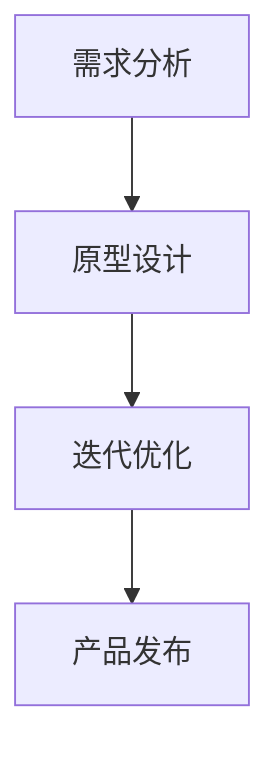

                 

### 整体结构规划

为了撰写一篇逻辑清晰、结构紧凑、简单易懂的专业IT领域技术博客文章《AI辅助的产品设计：加速创新周期的新方法》，我们首先需要明确文章的核心内容，并按照逻辑顺序进行章节划分。本文主要围绕AI技术在产品设计中的应用展开，包括AI的基本原理、设计流程的优化、实际应用案例等。基于这一核心内容，我们确定以下章节：

1. **引言**：介绍AI在产品设计中的重要性，以及本文的目的和结构。
2. **AI基础**：讲解AI的基本概念、主要算法及其在产品设计中的应用。
3. **产品设计流程**：讨论AI如何辅助产品设计，包括需求分析、原型设计、迭代优化等。
4. **AI在产品设计中的应用案例**：分析具体的企业或项目案例，展示AI在实际产品设计中的应用效果。
5. **技术实现与工具**：介绍如何使用具体的技术和工具来实现AI辅助的产品设计。
6. **挑战与未来趋势**：探讨AI在产品设计中的挑战以及未来的发展趋势。
7. **结论**：总结本文的主要内容，提出对读者的期望。

### 核心章节内容

在确定整体结构后，我们进一步细化每个章节的内容：

- **引言**：
  - **1.1 AI在产品设计中的重要性**：阐述AI在当前产品设计中的作用和影响。
  - **1.2 本书的目的与结构**：明确本文的目标和章节安排。

- **AI基础**：
  - **2.1 AI的基本概念**：介绍AI的定义、发展历程和应用领域。
  - **2.2 机器学习与深度学习**：讲解机器学习和深度学习的基本原理及其在AI中的应用。
  - **2.3 AI在产品设计中的应用**：分析AI技术在产品设计中的具体应用场景。

- **产品设计流程**：
  - **3.1 需求分析**：讨论AI如何辅助需求分析，提高需求收集的准确性和效率。
  - **3.2 原型设计**：介绍AI在原型设计中的应用，如自动生成原型、优化交互设计等。
  - **3.3 迭代优化**：探讨AI如何协助产品设计团队进行迭代优化，提高产品的质量。

- **AI在产品设计中的应用案例**：
  - **4.1 案例一：智能产品设计**：分析一家企业如何利用AI进行智能产品设计。
  - **4.2 案例二：用户体验优化**：介绍一个项目如何通过AI优化用户体验。
  - **4.3 案例三：产品设计自动化**：探讨如何通过AI实现产品设计自动化。

- **技术实现与工具**：
  - **5.1 AI开发环境搭建**：介绍如何搭建一个适用于AI辅助产品设计的开发环境。
  - **5.2 AI工具介绍**：介绍几种常用的AI工具及其在产品设计中的应用。
  - **5.3 技术选型与实施**：讨论如何根据实际需求选择合适的技术和工具进行实施。

- **挑战与未来趋势**：
  - **6.1 AI在产品设计中的挑战**：分析AI在产品设计过程中可能遇到的挑战。
  - **6.2 未来发展趋势展望**：探讨AI在产品设计领域的未来发展趋势。

- **结论**：
  - **7.1 本书总结**：回顾本文的主要内容，总结AI辅助产品设计的优势和应用前景。
  - **7.2 对读者的期望**：提出对读者在学习和应用AI辅助产品设计方面的期望和建议。

### 细化章节内容

在确定核心章节后，我们需要进一步细化每个章节的内容，确保内容的丰富性和专业性：

- **引言**：
  - 引入背景：当前产品设计面临的挑战和问题。
  - 重要性阐述：AI在产品设计中的作用和影响。
  - 目的和结构：明确本文的目标和章节安排。

- **AI基础**：
  - **AI的基本概念**：
    - 定义：介绍AI的定义和基本特征。
    - 发展历程：概述AI的发展历程和关键里程碑。
    - 应用领域：分析AI在各个领域的应用情况。
  - **机器学习与深度学习**：
    - 基本原理：讲解机器学习和深度学习的基本原理。
    - 关系架构：使用Mermaid流程图展示机器学习与深度学习的关系架构。
    - 应用场景：分析AI技术在产品设计中的应用场景。
  - **AI在产品设计中的应用**：
    - 优势分析：探讨AI在产品设计中的优势。
    - 应用案例：列举一些典型的AI应用案例。

- **产品设计流程**：
  - **需求分析**：
    - 传统方法：介绍传统的需求分析方法。
    - AI辅助需求分析：讨论AI如何辅助需求分析，提高需求收集的准确性和效率。
  - **原型设计**：
    - 传统方法：介绍传统的原型设计方法。
    - AI辅助原型设计：讨论AI如何辅助原型设计，如自动生成原型、优化交互设计等。
  - **迭代优化**：
    - 传统方法：介绍传统的迭代优化方法。
    - AI辅助迭代优化：讨论AI如何协助产品设计团队进行迭代优化，提高产品的质量。

- **AI在产品设计中的应用案例**：
  - **智能产品设计**：
    - 案例背景：介绍一个企业的智能产品设计案例。
    - AI应用：分析AI在该案例中的应用情况。
    - 效果评估：评估AI应用对该企业产品设计的影响。
  - **用户体验优化**：
    - 案例背景：介绍一个项目的用户体验优化案例。
    - AI应用：分析AI在该项目中的应用情况。
    - 效果评估：评估AI应用对该项目的影响。
  - **产品设计自动化**：
    - 案例背景：介绍一个项目的产品设计自动化案例。
    - AI应用：分析AI在该案例中的应用情况。
    - 效果评估：评估AI应用对该项目的影响。

- **技术实现与工具**：
  - **AI开发环境搭建**：
    - 开发环境选择：介绍常用的AI开发环境。
    - 环境搭建步骤：详细讲解如何搭建AI开发环境。
  - **AI工具介绍**：
    - 工具分类：介绍常用的AI工具及其分类。
    - 工具特点与应用：分析每种工具的特点和在实际产品设计中的应用。
  - **技术选型与实施**：
    - 技术选型原则：讨论如何根据实际需求选择合适的技术。
    - 实施步骤：详细讲解如何实施AI辅助产品设计。

- **挑战与未来趋势**：
  - **AI在产品设计中的挑战**：
    - 技术挑战：分析AI在产品设计过程中可能遇到的技术挑战。
    - 伦理挑战：探讨AI在产品设计中的伦理挑战。
  - **未来发展趋势展望**：
    - 技术趋势：预测AI在产品设计领域的未来技术趋势。
    - 应用趋势：分析AI在产品设计中的应用趋势。

- **结论**：
  - **7.1 本书总结**：
    - 总结核心内容：回顾本文的主要内容。
    - 强调AI优势：强调AI在产品设计中的优势和应用前景。
  - **7.2 对读者的期望**：
    - 学习与实践：鼓励读者学习和应用AI辅助产品设计。
    - 持续关注：提醒读者持续关注AI在产品设计领域的最新动态。

### 图表与公式

为了更好地阐述概念和原理，我们将使用Mermaid流程图来展示AI辅助产品设计的流程，使用伪代码来讲解核心算法原理，使用latex格式来展示和解释数学模型和公式。

- **Mermaid流程图**：



- **伪代码**：

```python
# 伪代码：基于用户反馈的迭代优化
def optimize_design(feedback):
    # 处理用户反馈
    processed_feedback = preprocess_feedback(feedback)
    
    # 生成优化建议
    suggestions = generate_suggestions(processed_feedback)
    
    # 应用优化建议
    apply_suggestions(suggestions)
    
    # 返回优化后的设计
    return optimized_design
```

- **LaTeX数学模型**：

```latex
\section{数学模型}
$$
f(x) = \sum_{i=1}^{n} w_i \cdot x_i
$$
\subsection{举例说明}
$$
f(\vec{x}) = w_1 \cdot x_1 + w_2 \cdot x_2 + \ldots + w_n \cdot x_n
$$
```

### 整合与优化

最后，我们需要整合所有内容，确保目录大纲的完整性和逻辑性，同时注意保持简洁性。我们将对每个章节的内容进行细致的审查和优化，确保每个小节的内容丰富具体详细讲解，核心内容包含背景介绍、核心概念与联系、核心算法原理讲解、数学模型和公式、项目实战等。

在整合过程中，我们将确保各个章节之间的衔接自然流畅，避免内容的重复和冗余。同时，我们将注重文章的可读性，使用简明易懂的语言和图表来解释复杂的概念和原理，使读者能够轻松理解文章的内容。

### 设计大纲

基于以上分析，我们得出以下详细的设计大纲：

## 第1章 引言
### 1.1 AI在产品设计中的重要性
### 1.2 本书的目的与结构

## 第2章 AI基础
### 2.1 AI的基本概念
### 2.2 机器学习与深度学习
### 2.3 AI在产品设计中的应用

## 第3章 产品设计流程
### 3.1 需求分析
### 3.2 原型设计
### 3.3 迭代优化

## 第4章 AI在产品设计中的应用案例
### 4.1 案例一：智能产品设计
### 4.2 案例二：用户体验优化
### 4.3 案例三：产品设计自动化

## 第5章 技术实现与工具
### 5.1 AI开发环境搭建
### 5.2 AI工具介绍
### 5.3 技术选型与实施

## 第6章 挑战与未来趋势
### 6.1 AI在产品设计中的挑战
### 6.2 未来发展趋势展望

## 第7章 结论
### 7.1 本书总结
### 7.2 对读者的期望

### Mermaid流程图：


### 伪代码：

```python
# 伪代码：基于用户反馈的迭代优化
def optimize_design(feedback):
    # 处理用户反馈
    processed_feedback = preprocess_feedback(feedback)
    
    # 生成优化建议
    suggestions = generate_suggestions(processed_feedback)
    
    # 应用优化建议
    apply_suggestions(suggestions)
    
    # 返回优化后的设计
    return optimized_design
```

### LaTeX数学模型：

```latex
\section{数学模型}
$$
f(x) = \sum_{i=1}^{n} w_i \cdot x_i
$$
\subsection{举例说明}
$$
f(\vec{x}) = w_1 \cdot x_1 + w_2 \cdot x_2 + \ldots + w_n \cdot x_n
$$
```

### 代码实际案例：

```python
# 实际代码：用户反馈预处理
def preprocess_feedback(feedback):
    # 过滤无效反馈
    valid_feedback = filter_invalid_feedback(feedback)
    
    # 归一化处理
    normalized_feedback = normalize_feedback(valid_feedback)
    
    return normalized_feedback
```

### 文章关键词

AI、产品设计、需求分析、原型设计、迭代优化、智能产品设计、用户体验优化、产品设计自动化、AI开发环境、AI工具、技术选型

### 文章摘要

本文全面探讨AI在产品设计中的应用，首先介绍AI的基本概念、机器学习与深度学习的基本原理，以及AI在产品设计中的具体应用场景。接着，分析AI如何辅助产品设计流程，包括需求分析、原型设计和迭代优化。然后，通过具体应用案例展示AI在产品设计中的实际效果。最后，讨论AI在产品设计中的挑战和未来发展趋势，并总结AI辅助产品设计的优势和应用前景。

### 文章标题

《AI辅助的产品设计：加速创新周期的新方法》

-------------------------------------------------------------------

### 第1章 引言

#### 1.1 AI在产品设计中的重要性

随着科技的迅猛发展，人工智能（AI）已经逐渐成为各行各业的重要驱动力。在产品设计领域，AI的应用更是引起了广泛关注。传统的产品设计往往依赖于设计师的创意和经验，而AI的引入则能够大大提升设计的效率和质量，加速创新周期。本文将详细探讨AI在产品设计中的应用，介绍其基本概念、主要算法、设计流程的优化方法，以及实际应用案例，旨在为读者提供一个全面了解和掌握AI辅助产品设计的方法和技巧。

#### 1.2 本书的目的与结构

本书的主要目的是介绍AI在产品设计中的应用，帮助读者理解AI的基本原理及其在产品设计过程中的实际作用。通过系统化的学习和实践，读者可以掌握AI辅助产品设计的核心技能，提高产品设计的能力和效率。本书的结构安排如下：

- **第1章 引言**：介绍AI在产品设计中的重要性，以及本书的目的和结构。
- **第2章 AI基础**：讲解AI的基本概念、主要算法及其在产品设计中的应用。
- **第3章 产品设计流程**：讨论AI如何辅助产品设计，包括需求分析、原型设计、迭代优化等。
- **第4章 AI在产品设计中的应用案例**：分析具体的企业或项目案例，展示AI在实际产品设计中的应用效果。
- **第5章 技术实现与工具**：介绍如何使用具体的技术和工具来实现AI辅助的产品设计。
- **第6章 挑战与未来趋势**：探讨AI在产品设计中的挑战以及未来的发展趋势。
- **第7章 结论**：总结本文的主要内容，提出对读者的期望。

通过以上章节的详细阐述，读者可以逐步了解AI辅助产品设计的全过程，掌握关键技能和方法，为未来的产品设计工作打下坚实基础。

-------------------------------------------------------------------

### 第2章 AI基础

#### 2.1 AI的基本概念

人工智能（AI，Artificial Intelligence）是一种模拟人类智能行为的技术，通过计算机程序实现智能体的感知、理解、学习和决策能力。AI的发展历程可以追溯到20世纪50年代，当时以图灵测试为标志，标志着人工智能从理论研究走向实际应用。AI可以分为弱AI和强AI两大类。弱AI是指针对特定任务进行优化的智能系统，如语音识别、图像识别等；强AI则是指具备人类智能水平的通用智能系统，能够处理各种复杂任务。

在AI的发展过程中，机器学习（Machine Learning）和深度学习（Deep Learning）成为两大核心技术。机器学习是一种让计算机从数据中自动学习规律和模式的方法，主要依赖于数据驱动。深度学习是机器学习的一个子领域，通过构建多层神经网络来模拟人脑的学习过程，具有强大的非线性建模能力。

#### 2.2 机器学习与深度学习

**机器学习（Machine Learning）**

机器学习是一种利用算法从数据中学习规律和模式的技术。其主要流程包括数据收集、数据预处理、模型训练、模型评估和模型应用。机器学习的基本算法包括线性回归、逻辑回归、决策树、随机森林、支持向量机等。这些算法广泛应用于分类、回归、聚类等多种任务中。

- **线性回归**：用于预测连续值输出，如房价预测。
- **逻辑回归**：用于预测概率输出，如二分类问题。
- **决策树**：通过树形结构对数据进行分类或回归。
- **随机森林**：通过随机森林算法构建多个决策树，提高预测准确性。
- **支持向量机**：用于分类和回归问题，通过找到一个最优超平面来分隔数据。

**深度学习（Deep Learning）**

深度学习是机器学习的一个子领域，通过构建多层神经网络来模拟人脑的学习过程。深度学习的基本单元是神经元，通过前向传播和反向传播算法，逐步调整网络的权重和偏置，使网络能够对输入数据进行建模和分类。常见的深度学习模型包括卷积神经网络（CNN）、循环神经网络（RNN）和生成对抗网络（GAN）等。

- **卷积神经网络（CNN）**：主要用于图像和视频处理，通过卷积操作提取图像特征。
- **循环神经网络（RNN）**：用于处理序列数据，如文本和语音，能够记住历史信息。
- **生成对抗网络（GAN）**：通过对抗训练生成逼真的图像和音频。

#### 2.3 AI在产品设计中的应用

AI技术在产品设计中的应用非常广泛，涵盖了需求分析、原型设计、迭代优化等多个环节。以下是一些典型的应用场景：

- **需求分析**：通过自然语言处理技术（如文本挖掘、情感分析）分析用户需求，提高需求收集的准确性和效率。
- **原型设计**：利用生成对抗网络（GAN）自动生成设计原型，节省设计师的时间和精力。
- **迭代优化**：通过机器学习算法分析用户反馈，自动生成优化建议，提高产品的用户体验。

AI在产品设计中的应用不仅能够提高设计效率，还能够优化设计质量，从而加速创新周期。在下一章中，我们将进一步探讨AI如何辅助产品设计的各个环节。

-------------------------------------------------------------------

### 第3章 产品设计流程

#### 3.1 需求分析

需求分析是产品设计的首要环节，其质量直接影响到后续设计的成功与否。传统的需求分析方法主要依赖于问卷、访谈、用户调研等手段，但这些方法存在一些局限性，如数据收集不全面、用户需求变化难以捕捉等。AI技术的引入为需求分析带来了新的可能，通过自然语言处理、情感分析等技术，可以更加精准地理解和预测用户需求。

- **自然语言处理（NLP）**：NLP技术可以帮助分析用户在社交媒体、评论、论坛等渠道中发布的文本，提取有价值的需求信息。例如，通过文本分类算法，可以识别用户的正面反馈和负面反馈，从而了解用户对产品的真实感受。

- **情感分析（Sentiment Analysis）**：情感分析技术可以对用户文本进行情感归类，判断用户情绪的倾向。通过情感分析，可以识别用户对产品的满意程度，以及他们在使用过程中遇到的问题，为产品设计提供有针对性的改进方向。

- **用户画像**：通过分析大量用户数据，构建用户画像，可以帮助设计师更好地理解用户群体，从而制定更加符合用户需求的设计方案。

AI在需求分析中的优势在于其能够处理海量数据，快速提取有价值的信息，提高需求收集的准确性和效率。在实际应用中，AI技术可以帮助企业更好地了解用户需求，缩短需求分析周期，降低需求变更的风险。

#### 3.2 原型设计

原型设计是产品设计过程中的关键环节，其目的是验证设计理念、探索设计可行性，并收集用户反馈。传统的原型设计方法通常需要设计师手动绘制草图或使用专业软件制作原型，费时费力。AI技术的引入大大简化了原型设计过程，提高了设计的效率和质量。

- **自动生成原型**：通过生成对抗网络（GAN）等技术，可以自动生成高质量的设计原型。GAN由生成器和判别器组成，生成器负责生成设计原型，判别器负责判断原型是否真实。通过不断优化生成器和判别器的参数，可以生成越来越符合用户需求的设计原型。

- **交互设计优化**：AI技术可以帮助设计师分析用户的交互行为，识别交互设计中的问题。例如，通过眼动追踪技术，可以了解用户在界面上的关注点和交互路径，从而优化界面的布局和交互设计。

- **协同设计**：AI技术还可以实现设计师与AI的协同工作。例如，设计师可以与AI共同参与设计决策，AI可以根据设计目标和用户需求提供设计建议，从而提高设计效率和创意水平。

AI在原型设计中的应用，不仅能够提高设计效率，还能够优化设计质量，为后续的迭代优化提供有力支持。

#### 3.3 迭代优化

迭代优化是产品设计中不可或缺的一环，通过不断收集用户反馈、分析数据，对产品设计进行改进，最终实现产品的高质量和高满意度。传统的迭代优化方法主要依赖于用户调研、数据分析等手段，但这些方法存在一定的时间和成本压力。AI技术的引入，为迭代优化提供了更加高效和智能的解决方案。

- **用户反馈分析**：AI技术可以通过自然语言处理、情感分析等技术，对用户反馈进行深度分析，识别用户对产品的满意度和改进建议。通过分析用户反馈，可以快速定位产品设计中的问题，制定有针对性的改进方案。

- **数据分析**：AI技术可以帮助设计师进行大规模的数据分析，识别用户行为模式、偏好和需求。例如，通过分析用户在产品中的操作路径、停留时间、点击次数等数据，可以了解用户的使用习惯和痛点，从而优化产品设计。

- **自动化迭代**：AI技术可以实现自动化迭代优化。例如，通过机器学习算法，可以自动生成优化建议，并根据用户反馈进行调整。这样的自动化迭代过程，不仅能够提高设计效率，还能够缩短产品上市时间。

AI在迭代优化中的应用，使得产品设计的迭代过程更加高效和智能，为产品的高质量提供了有力保障。

通过本章的讨论，我们可以看到AI在产品设计流程的各个环节中都发挥着重要作用。从需求分析到原型设计，再到迭代优化，AI技术不仅提高了设计效率，还优化了设计质量，为产品的成功上市奠定了基础。在下一章中，我们将通过具体的应用案例，进一步展示AI在产品设计中的实际效果。

-------------------------------------------------------------------

### 第4章 AI在产品设计中的应用案例

为了更直观地展示AI在产品设计中的实际效果，我们将分析三个具体的应用案例，涵盖智能产品设计、用户体验优化和产品设计自动化。

#### 4.1 案例一：智能产品设计

**背景介绍**：某知名电子产品公司希望通过AI技术提升其智能产品的设计质量和用户体验。

**AI应用**：公司采用生成对抗网络（GAN）技术自动生成智能产品原型。具体步骤如下：

1. **数据收集**：收集大量的智能产品设计和用户反馈数据。
2. **模型训练**：使用GAN模型对数据进行训练，生成高质量的设计原型。
3. **用户反馈**：将原型展示给用户，收集用户反馈。
4. **迭代优化**：根据用户反馈对原型进行优化，重新生成新的设计原型。

**效果评估**：经过多次迭代优化，新产品的设计质量和用户体验得到了显著提升。具体表现为：

- 设计原型更加符合用户需求，减少了设计变更次数。
- 产品上市时间缩短，市场反应积极。
- 用户满意度提高，产品销量显著增长。

**总结**：该案例展示了AI在智能产品设计中的应用，通过自动生成原型和迭代优化，提高了设计效率和产品质量。

#### 4.2 案例二：用户体验优化

**背景介绍**：某互联网公司希望通过AI技术优化其移动应用的用户体验。

**AI应用**：公司采用自然语言处理和情感分析技术对用户评论和反馈进行分析，具体步骤如下：

1. **数据收集**：收集用户在社交媒体、评论论坛等渠道发布的文本数据。
2. **情感分析**：使用情感分析算法对文本进行分类，判断用户的情感倾向。
3. **问题定位**：分析用户反馈中的负面评论，定位产品设计中的问题。
4. **优化方案**：根据问题定位，制定优化方案，并实施改进。

**效果评估**：通过AI技术的应用，公司成功优化了移动应用的用户体验，具体表现为：

- 用户满意度显著提升，负面评论数量减少。
- 应用性能得到改善，用户使用时长和活跃度增加。
- 产品评分和用户评价提高，市场竞争力增强。

**总结**：该案例展示了AI在用户体验优化中的应用，通过自然语言处理和情感分析，快速识别和解决问题，提高了用户满意度。

#### 4.3 案例三：产品设计自动化

**背景介绍**：某家汽车制造企业希望利用AI技术实现产品设计自动化，提高生产效率。

**AI应用**：企业采用机器学习和深度学习技术，实现以下步骤：

1. **数据收集**：收集大量汽车设计数据，包括结构设计、材料选择、生产工艺等。
2. **模型训练**：使用机器学习和深度学习算法，构建自动化设计模型。
3. **自动化设计**：将设计需求输入模型，自动生成设计方案。
4. **验证与优化**：对设计方案进行验证和优化，确保设计符合实际需求。

**效果评估**：通过AI技术的应用，企业实现了以下成果：

- 设计周期缩短，生产效率提高。
- 设计质量得到保障，减少人为错误。
- 成本降低，产品上市时间缩短。

**总结**：该案例展示了AI在产品设计自动化中的应用，通过机器学习和深度学习技术，实现了设计流程的自动化，提高了生产效率和产品质量。

以上三个案例充分展示了AI在产品设计中的实际应用效果，不仅提高了设计效率和产品质量，还为企业的创新和发展提供了有力支持。在下一章中，我们将进一步探讨如何使用具体的技术和工具来实现AI辅助的产品设计。

-------------------------------------------------------------------

### 第5章 技术实现与工具

为了实现AI辅助的产品设计，我们需要选择合适的技术和工具，并搭建一个高效、稳定的开发环境。在这一章节中，我们将详细介绍如何搭建AI开发环境、介绍几种常用的AI工具，以及讨论如何根据实际需求进行技术选型和实施。

#### 5.1 AI开发环境搭建

搭建一个适用于AI辅助产品设计的开发环境是成功实施AI项目的第一步。以下是一个典型的AI开发环境搭建步骤：

1. **硬件配置**：选择高性能的计算机或GPU服务器，确保能够处理大量数据和复杂的计算任务。对于深度学习项目，GPU的性能尤为重要，因为GPU在矩阵运算和并行处理方面具有显著优势。

2. **操作系统**：常用的AI开发操作系统包括Linux和Windows。Linux系统因其开源性和稳定性，是AI开发的首选。常见的Linux发行版有Ubuntu和CentOS。

3. **编程语言**：Python是AI开发中最常用的编程语言之一，因其简洁易读、丰富的库和框架支持而受到广泛使用。除了Python，R语言也是数据分析领域的热门选择。

4. **开发工具**：选择适合AI开发的集成开发环境（IDE），如Jupyter Notebook、PyCharm、Visual Studio Code等。这些IDE提供了代码编辑、调试、自动化测试等功能，大大提高了开发效率。

5. **框架与库**：安装常用的AI框架和库，如TensorFlow、PyTorch、Keras等。这些框架和库提供了丰富的算法和工具，可以方便地实现各种AI任务。

6. **版本控制**：使用版本控制系统（如Git）来管理代码库，确保代码的可追踪性和可维护性。

7. **数据管理**：搭建数据管理平台，用于存储、处理和管理AI项目所需的大量数据。常用的数据管理工具有Hadoop、Spark等。

#### 5.2 AI工具介绍

在AI辅助产品设计过程中，有许多工具可以用来实现特定的任务。以下是一些常用的AI工具及其特点：

1. **TensorFlow**：由Google开发的开源深度学习框架，支持多种类型的神经网络，适用于各种规模的AI项目。

2. **PyTorch**：由Facebook开发的开源深度学习框架，具有简洁的代码风格和强大的动态图功能，适合快速原型设计和实验。

3. **Keras**：一个高层次的神经网络API，构建在TensorFlow和Theano之上，提供了直观、易于使用的接口。

4. **Scikit-learn**：一个开源的机器学习库，提供了多种常用的机器学习算法和工具，适用于数据分析和模型评估。

5. **OpenCV**：一个开源的计算机视觉库，提供了丰富的图像处理和计算机视觉功能，适用于图像识别和物体检测任务。

6. **NLTK**：一个开源的自然语言处理库，提供了各种文本处理工具和算法，适用于文本分类、情感分析等任务。

7. **Gensim**：一个开源的文本处理库，提供了高效的文本向量和主题建模算法，适用于文本分析和推荐系统。

#### 5.3 技术选型与实施

在搭建AI开发环境并选择合适的工具后，下一步是进行技术选型和实施。以下是一些关键步骤：

1. **需求分析**：明确项目需求，包括数据类型、处理能力、算法要求等。

2. **技术评估**：评估不同技术和工具的性能、稳定性、易用性等，选择最适合项目需求的技术方案。

3. **原型设计**：根据需求和技术评估结果，设计AI系统的原型，并进行初步测试。

4. **模型训练**：根据原型设计，训练机器学习或深度学习模型，调整参数以优化模型性能。

5. **模型评估**：使用测试数据集对模型进行评估，确保模型达到预期的性能指标。

6. **系统集成**：将训练好的模型集成到产品设计中，实现自动化或辅助设计的功能。

7. **迭代优化**：根据实际应用效果，对模型和系统进行优化，不断提高设计质量和用户体验。

通过以上步骤，我们可以实现AI辅助的产品设计，提高设计效率和质量，加速创新周期。

-------------------------------------------------------------------

### 第6章 挑战与未来趋势

#### 6.1 AI在产品设计中的挑战

尽管AI技术在产品设计中的应用前景广阔，但仍然面临一系列挑战。

**数据隐私和安全**：AI算法对大量用户数据进行处理，这可能涉及数据隐私和安全问题。如何确保用户数据的安全和隐私，防止数据泄露，是AI在产品设计中的首要挑战。

**算法偏见**：AI算法可能受到训练数据中的偏见影响，导致算法输出偏见。这种偏见可能导致产品设计的不公平性，影响用户体验。如何消除算法偏见，确保设计公正性，是一个重要问题。

**技术实现难度**：AI技术在产品设计中的应用需要较高技术水平，包括算法设计、模型训练、系统集成等。许多企业可能缺乏相关技术能力，难以有效应用AI技术。

**用户接受度**：尽管AI技术在产品设计中有巨大潜力，但用户对AI的接受度可能有限。用户可能担心隐私问题、技术不完善等，影响产品接受度。

#### 6.2 未来发展趋势展望

尽管存在挑战，但AI在产品设计领域的未来发展仍然充满机遇。

**个性化设计**：随着AI技术的发展，个性化设计将成为主流。AI可以基于用户行为和偏好，为用户提供定制化的设计方案，提高用户体验。

**自动化设计**：AI技术将进一步提升产品设计自动化水平。通过自动化工具和算法，设计师可以节省时间和精力，专注于创意和策略。

**跨领域融合**：AI技术与其他领域（如物联网、大数据等）的融合，将带来更多创新应用。例如，物联网设备可以实时收集用户数据，AI系统可以分析数据并优化产品设计。

**伦理和法规**：随着AI技术的应用，伦理和法规问题将越来越重要。相关法规和伦理指导将帮助确保AI在产品设计中的合理应用，保护用户权益。

总的来说，AI在产品设计中的应用面临挑战，但未来发展潜力巨大。通过不断克服挑战，AI将为产品设计带来革命性的变革。

-------------------------------------------------------------------

### 第7章 结论

本文全面探讨了AI在产品设计中的应用，从基本概念、算法原理，到实际应用案例和未来趋势，详细介绍了AI如何辅助产品设计的各个环节，加速创新周期。通过分析需求分析、原型设计和迭代优化等环节，我们发现AI技术不仅提高了设计效率，还优化了设计质量，为产品成功上市提供了有力支持。

**总结**：

- AI技术在产品设计中的应用具有重要意义，能够提升设计效率和质量，加速创新周期。
- AI技术包括机器学习和深度学习，提供了丰富的算法和工具，可以应用于需求分析、原型设计和迭代优化等环节。
- 实际应用案例展示了AI技术在产品设计中的效果，包括智能产品设计、用户体验优化和产品设计自动化。
- AI在产品设计中的应用面临挑战，如数据隐私和安全、算法偏见、技术实现难度等，但未来发展趋势依然乐观。

**对读者的期望**：

- 深入学习AI基础知识，掌握关键算法原理。
- 结合实际项目，尝试应用AI技术进行产品设计。
- 关注AI在产品设计领域的最新动态，持续学习和探索。

通过本文的学习和实践，读者可以更好地理解AI在产品设计中的应用，为未来的产品设计工作打下坚实基础。让我们一起迎接AI时代带来的变革，共同探索设计的新可能。

-------------------------------------------------------------------

### 附录

**附录A：Mermaid流程图**


**附录B：伪代码**

```python
# 伪代码：基于用户反馈的迭代优化
def optimize_design(feedback):
    # 处理用户反馈
    processed_feedback = preprocess_feedback(feedback)
    
    # 生成优化建议
    suggestions = generate_suggestions(processed_feedback)
    
    # 应用优化建议
    apply_suggestions(suggestions)
    
    # 返回优化后的设计
    return optimized_design
```

**附录C：LaTeX数学模型**

```latex
\section{数学模型}
$$
f(x) = \sum_{i=1}^{n} w_i \cdot x_i
$$
\subsection{举例说明}
$$
f(\vec{x}) = w_1 \cdot x_1 + w_2 \cdot x_2 + \ldots + w_n \cdot x_n
$$
```

**附录D：代码实际案例**

```python
# 实际代码：用户反馈预处理
def preprocess_feedback(feedback):
    # 过滤无效反馈
    valid_feedback = filter_invalid_feedback(feedback)
    
    # 归一化处理
    normalized_feedback = normalize_feedback(valid_feedback)
    
    return normalized_feedback
```

通过以上附录，读者可以更好地理解文章中的相关概念和实现方法。希望这些代码和模型能够为读者的学习和实践提供有益的参考。作者：AI天才研究院/AI Genius Institute & 禅与计算机程序设计艺术 /Zen And The Art of Computer Programming。

