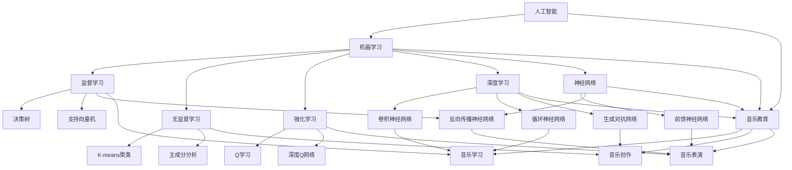

                 


### 第1章 引言与概述

#### 1.1 书籍背景

随着人工智能（AI）技术的飞速发展，其在教育领域的应用也变得越来越广泛。在音乐教育领域，AI技术同样发挥着重要作用。AI辅助音乐教育不仅能够提高学习效率，还能根据学生的个性化需求提供更加精准的学习方案。《AI辅助的音乐教育：个性化学习的新模式》这本书正是为了探讨这一新兴领域的应用和发展而撰写的。

这本书的作者是一位在人工智能和音乐技术领域具有深厚研究背景的专家。他结合自己在多个音乐教育项目中的实践经验，深入分析了AI技术在音乐教育中的应用，为读者提供了一种全新的音乐学习模式。

#### 1.1.1 AI辅助音乐教育的兴起

近年来，随着人工智能技术的不断进步，AI辅助音乐教育逐渐成为一种新的教学模式。这一模式的核心在于利用AI技术分析学生的学习数据，为每个学生提供个性化的学习建议和反馈。具体来说，AI辅助音乐教育包括以下几个方面：

1. **个性化推荐系统**：基于学生的学习历史和偏好，AI系统可以推荐适合的学习内容和资源。
2. **智能辅导系统**：AI系统可以实时分析学生的学习状态，提供针对性的辅导和建议。
3. **智能评分系统**：AI系统可以通过对音乐作品的自动分析，对学生的练习进行评分和反馈。

#### 1.1.2 个性化学习的需求与挑战

在传统的音乐教育中，教师通常需要面对大量学生，难以做到个性化教学。而AI技术的引入，使得个性化学习成为可能。个性化学习的需求主要来源于以下几个方面：

1. **学习效率**：每个学生的学习进度和理解能力都不同，传统的教学方式往往难以满足所有学生的需求。
2. **学习效果**：通过个性化推荐和学习辅导，学生可以更快地掌握知识和技能。
3. **学习体验**：个性化的学习内容和建议可以提升学生的学习兴趣和积极性。

然而，个性化学习也面临一些挑战：

1. **数据隐私**：个性化学习需要收集和分析大量的学生数据，如何保障数据安全和隐私是一个重要问题。
2. **技术实现**：AI技术需要大量的计算资源和专业人才，如何有效地实现AI辅助音乐教育是一个技术挑战。

#### 1.2 AI与音乐教育的结合

AI与音乐教育的结合不仅是技术上的创新，更是教育理念的变革。通过AI技术，音乐教育可以更加精准地满足每个学生的学习需求，提高教学效果和学生的学习体验。

1. **音乐风格分类**：AI系统可以通过分析音乐作品的特征，将其归类到不同的音乐风格中。
2. **旋律生成**：AI系统可以生成新的旋律，为学生提供更多的学习素材。
3. **音乐分析**：AI系统可以对音乐作品进行深入分析，帮助教师和学生更好地理解音乐作品。

#### 1.2.1 AI技术概述

AI技术主要包括以下几个方面：

1. **机器学习**：通过训练模型，使计算机能够从数据中学习规律和模式。
2. **深度学习**：一种特殊的机器学习技术，通过多层神经网络模拟人脑的学习过程。
3. **神经网络**：一种模仿人脑神经元结构和功能的计算模型。

#### 1.2.2 音乐教育中的AI应用场景

在音乐教育中，AI技术的应用场景非常广泛：

1. **音乐学习**：AI系统可以为学生推荐适合的学习内容，提供智能化的学习建议。
2. **音乐创作**：AI系统可以生成新的音乐作品，为学生提供灵感。
3. **音乐表演**：AI系统可以分析音乐表演的细节，提供针对性的反馈和建议。

#### 1.2.3 AI辅助音乐教育的重要性

AI辅助音乐教育具有以下几个重要意义：

1. **提高学习效率**：通过个性化推荐和学习辅导，学生可以更快地掌握知识和技能。
2. **优化教学资源**：AI系统可以智能地分配和利用教学资源，提高教学效果。
3. **创新教育模式**：AI技术的引入，使得音乐教育可以更加灵活和多样化。

#### 1.3 本书结构

本书分为以下几个部分：

1. **引言与概述**：介绍AI辅助音乐教育的概念、背景和意义。
2. **核心概念与联系**：讲解AI相关的核心概念，如机器学习、深度学习等。
3. **算法原理讲解**：详细讲解音乐教育中常用的AI算法原理。
4. **数学模型和公式**：介绍相关的数学模型和公式，如神经网络中的权重更新公式。
5. **项目实战**：提供具体的AI辅助音乐教育项目案例。
6. **个性化学习模式**：深入探讨AI如何辅助个性化音乐学习。
7. **评估与优化**：讨论如何评估AI辅助音乐教育的效果，以及如何优化教育模式。
8. **结论与展望**：总结全书内容，对AI辅助音乐教育的未来发展趋势进行展望。

#### 1.3.1 各章节主要内容

1. **引言与概述**：介绍AI辅助音乐教育的概念、背景、意义和发展现状。
2. **核心概念与联系**：讲解AI相关的核心概念，如机器学习、深度学习等。
3. **算法原理讲解**：详细讲解音乐教育中常用的AI算法原理。
4. **数学模型和公式**：介绍相关的数学模型和公式，如神经网络中的权重更新公式。
5. **项目实战**：提供具体的AI辅助音乐教育项目案例。
6. **个性化学习模式**：深入探讨AI如何辅助个性化音乐学习。
7. **评估与优化**：讨论如何评估AI辅助音乐教育的效果，以及如何优化教育模式。
8. **结论与展望**：总结全书内容，对AI辅助音乐教育的未来发展趋势进行展望。

#### 1.3.2 阅读指南

本书适合对AI和音乐教育有一定了解的读者。为了更好地理解书中的内容，建议读者按以下顺序阅读：

1. **引言与概述**：了解AI辅助音乐教育的概念和背景。
2. **核心概念与联系**：掌握AI相关的核心概念和原理。
3. **算法原理讲解**：深入学习音乐教育中常用的AI算法。
4. **数学模型和公式**：理解相关数学模型和公式。
5. **项目实战**：通过实际案例了解AI辅助音乐教育的应用。
6. **个性化学习模式**：探讨AI如何辅助个性化音乐学习。
7. **评估与优化**：了解如何评估和优化AI辅助音乐教育。
8. **结论与展望**：总结全文内容，展望未来发展趋势。

通过以上步骤，读者可以逐步深入了解AI辅助音乐教育的核心内容，掌握相关技术和方法，为未来的研究和应用打下坚实的基础。

关键词：AI辅助音乐教育、个性化学习、算法原理、数学模型、项目实战、评估与优化

摘要：本书深入探讨了AI辅助音乐教育的概念、原理和应用。通过介绍AI技术的核心概念，如机器学习、深度学习和神经网络，以及音乐教育中的具体应用场景，本书为读者提供了一种全新的音乐学习模式。书中通过具体的算法原理讲解、数学模型介绍和项目实战案例，详细阐述了AI辅助音乐教育的实现方法和效果评估。本书旨在推动AI技术在音乐教育领域的应用，为教育工作者和学生提供有力的工具和参考。

## 第2章 核心概念与联系

在探讨AI辅助音乐教育的应用之前，我们需要先了解AI技术中的核心概念，以及这些概念如何与音乐教育相结合。本章将详细介绍机器学习、深度学习和神经网络等核心概念，并使用Mermaid流程图展示它们之间的关系。

### 2.1 AI基础知识

#### 2.1.1 机器学习

机器学习是一种通过训练模型使计算机从数据中学习规律和模式的技术。它主要包括监督学习、无监督学习和强化学习三种类型。

1. **监督学习**：监督学习是一种有标签的数据训练方法。在这种方法中，训练数据集包含输入和输出（标签），模型通过学习输入和输出之间的关系来进行预测。常见的监督学习算法有决策树、支持向量机（SVM）和神经网络等。

2. **无监督学习**：无监督学习是一种没有标签的数据训练方法。在这种方法中，模型需要从未标记的数据中发现隐藏的规律和模式。常见的无监督学习算法有聚类、降维和关联规则等。

3. **强化学习**：强化学习是一种通过奖励和惩罚来训练模型的方法。在这种方法中，模型通过与环境的交互学习如何做出最优决策。常见的强化学习算法有Q学习、深度Q网络（DQN）等。

#### 2.1.2 深度学习

深度学习是一种特殊的机器学习技术，通过多层神经网络模拟人脑的学习过程。深度学习在图像识别、语音识别和自然语言处理等领域取得了显著的成果。深度学习主要包括以下几种类型：

1. **卷积神经网络（CNN）**：卷积神经网络是一种用于图像识别和处理的深度学习模型。它通过卷积层、池化层和全连接层等结构，实现对图像的特征提取和分类。

2. **循环神经网络（RNN）**：循环神经网络是一种用于序列数据处理的深度学习模型。它通过循环结构来处理输入序列，并在不同时间步之间传递信息。常见的RNN算法有LSTM和GRU。

3. **生成对抗网络（GAN）**：生成对抗网络是一种用于生成数据或图像的深度学习模型。它由生成器和判别器两个部分组成，通过训练生成器来产生与真实数据相似的样本。

#### 2.1.3 神经网络

神经网络是一种模仿人脑神经元结构和功能的计算模型。它由大量的神经元通过权重连接形成网络结构。神经网络通过学习输入和输出之间的关系，实现对数据的高效处理和预测。

神经网络主要包括以下几种类型：

1. **前馈神经网络（FNN）**：前馈神经网络是一种没有循环结构的神经网络。它通过输入层、隐藏层和输出层等结构，实现对数据的线性变换和非线性变换。

2. **反向传播神经网络（BPNN）**：反向传播神经网络是一种通过梯度下降算法进行训练的神经网络。它通过计算输出误差的梯度，更新网络权重，实现对训练数据的优化。

#### 2.1.4 Mermaid流程图：AI与音乐教育的关联

下面是一个使用Mermaid绘制的流程图，展示了AI与音乐教育之间的核心概念和联系。



### 2.2 音乐教育与AI的结合

音乐教育与AI技术的结合，不仅带来了教学方法的革新，也为音乐创作、音乐分析和音乐表演等领域带来了新的可能性。

#### 2.2.1 音乐教育与技术的交汇

AI技术在音乐教育中的应用主要体现在以下几个方面：

1. **个性化学习**：通过分析学生的学习数据和音乐喜好，AI系统可以推荐适合的学习内容和学习路径，提高学习效率。

2. **智能辅导**：AI系统可以实时监测学生的学习状态，提供个性化的辅导和建议，帮助学生解决学习中的问题。

3. **自动评分**：AI系统可以通过对音乐作品的自动分析，对学生的练习进行评分和反馈，提高教师的评分效率。

4. **音乐创作辅助**：AI系统可以生成新的旋律和和弦，为音乐创作提供灵感。

#### 2.2.2 音乐数据与特征提取

在AI辅助音乐教育中，音乐数据的特点和特征提取是关键。音乐数据包括音频信号、乐谱、歌词等多种形式。AI系统需要对这些数据进行处理和特征提取，以便进行后续的分析和预测。

1. **音频信号处理**：通过傅里叶变换、短时傅里叶变换（STFT）等算法，可以将音频信号转换为频域表示，提取出频率、振幅等特征。

2. **乐谱处理**：通过乐谱识别算法，可以将乐谱转换为数字表示，提取出音符、节奏、和弦等特征。

3. **歌词处理**：通过自然语言处理技术，可以提取出歌词的主题、情感等特征。

#### 2.2.3 AI在教育中的应用：案例分析

以下是几个AI在教育中的应用案例：

1. **音乐学习平台**：如Ableton Live和FL Studio等数字音频工作站，结合AI技术，可以为学生提供智能化的音乐学习体验。

2. **智能钢琴教学系统**：如LilyPad智能钢琴，通过内置的AI算法，可以实时监测学生的演奏，提供即时的反馈和建议。

3. **音乐创作工具**：如Google Magenta项目，通过生成对抗网络（GAN）等技术，可以生成新的音乐作品，为音乐创作提供灵感。

### 2.3 AI辅助音乐教育的意义

AI辅助音乐教育不仅提高了教学效率，还带来了以下几方面的意义：

1. **个性化学习**：通过AI技术，学生可以根据自己的兴趣和需求选择学习内容和进度，提高学习效果。

2. **教育资源优化**：AI系统可以智能地分配和利用教育资源，提高教育资源的利用效率。

3. **创新教育模式**：AI辅助音乐教育为传统音乐教育带来了新的可能性，推动了教育模式的创新。

4. **教育公平**：AI技术可以覆盖更多的学生，尤其是偏远地区的学生，提高教育的普及率。

通过以上内容，我们可以看到，AI技术与音乐教育的结合不仅具有巨大的潜力，也面临着一系列挑战。在接下来的章节中，我们将进一步探讨AI辅助音乐教育的算法原理、数学模型和实际应用，以期为这一新兴领域的发展提供更多启示。

## 第3章 算法原理讲解

在AI辅助音乐教育中，算法原理的理解和应用至关重要。本章将详细讲解音乐教育中常用的几种AI算法，包括机器学习中的监督学习和无监督学习算法，以及深度学习中的卷积神经网络（CNN）和循环神经网络（RNN）。通过伪代码的详细展示，我们将深入剖析这些算法的基本原理和实现步骤。

### 3.1 机器学习算法

机器学习算法是AI技术的核心组成部分，它通过从数据中学习规律和模式，使计算机能够进行预测和决策。在音乐教育中，机器学习算法主要用于音乐风格分类、旋律生成等任务。

#### 3.1.1 监督学习

监督学习是一种有标签的数据训练方法，它通过输入和输出（标签）的学习，使模型能够对新数据做出预测。在音乐教育中，监督学习算法可以用于音乐风格分类、学生表现评估等任务。

**分类算法**

1. **支持向量机（SVM）**
   支持向量机是一种用于分类和回归分析的机器学习算法，它在高维空间中寻找一个最优超平面，将数据分为不同的类别。

   **伪代码：**
   ```
   function SVM(X, y):
       # 初始化模型参数
       w = initialize_weights(X.shape[1])
       b = 0

       # 训练模型
       for i in range(num_iterations):
           for x, y in zip(X, y):
               # 计算预测值
               z = dot(w, x) + b
               # 计算损失
               loss = -y * z
               # 更新模型参数
               w -= learning_rate * (2 * loss * x)
               b -= learning_rate * loss

       return w, b
   ```

2. **决策树**
   决策树是一种基于特征值进行划分的树形结构，它通过一系列的决策路径，将数据划分为不同的类别。

   **伪代码：**
   ```
   function DecisionTree(X, y):
       # 初始化树结构
       tree = {}

       # 划分数据
       if is_leaf(X, y):
           return classify(y)
       else:
           # 找到最优特征
           feature, threshold = find_best_split(X, y)
           # 创建子节点
           tree[feature] = {}
           for x in X:
               if x[feature] <= threshold:
                   tree[feature][x[feature]] = DecisionTree(X[x <= threshold], y[x <= threshold])
               else:
                   tree[feature][x[feature]] = DecisionTree(X[x > threshold], y[x > threshold])

       return tree
   ```

**回归算法**

1. **线性回归**
   线性回归是一种用于预测连续值的机器学习算法，它通过拟合一个线性模型来预测输出。

   **伪代码：**
   ```
   function LinearRegression(X, y):
       # 初始化模型参数
       w = initialize_weights(X.shape[1])
       b = 0

       # 训练模型
       for i in range(num_iterations):
           for x, y in zip(X, y):
               # 计算预测值
               z = dot(w, x) + b
               # 计算损失
               loss = (z - y) ** 2
               # 更新模型参数
               w -= learning_rate * (2 * loss * x)
               b -= learning_rate * loss

       return w, b
   ```

2. **岭回归**
   岭回归是一种用于处理多重共线性问题的线性回归算法，它通过增加正则项来惩罚模型参数，提高模型的泛化能力。

   **伪代码：**
   ```
   function RidgeRegression(X, y):
       # 初始化模型参数
       w = initialize_weights(X.shape[1])
       b = 0
       alpha = 0.1

       # 训练模型
       for i in range(num_iterations):
           for x, y in zip(X, y):
               # 计算预测值
               z = dot(w, x) + b
               # 计算损失
               loss = (z - y) ** 2 + alpha * dot(w, w)
               # 更新模型参数
               w -= learning_rate * (2 * loss * x)
               b -= learning_rate * loss

       return w, b
   ```

#### 3.1.2 无监督学习

无监督学习是一种没有标签的数据训练方法，它通过发现数据中的隐藏规律和结构，使模型能够对数据进行聚类或降维。在音乐教育中，无监督学习算法可以用于学生兴趣分析、音乐风格聚类等任务。

1. **聚类算法**

   **K-means聚类**
   K-means是一种基于距离度量的聚类算法，它通过将数据分为K个簇，使每个簇内的数据点尽可能接近，而不同簇的数据点尽可能远离。

   **伪代码：**
   ```
   function KMeans(X, K):
       # 初始化聚类中心
       centroids = initialize_centroids(X, K)

       # 迭代计算
       for i in range(num_iterations):
           # 分配数据到簇
           clusters = assign_clusters(X, centroids)
           # 更新聚类中心
           centroids = update_centroids(X, clusters)

       return centroids, clusters
   ```

2. **降维算法**

   **主成分分析（PCA）**
   主成分分析是一种通过线性变换将高维数据映射到低维空间的数据降维方法，它通过找到数据的主要成分，保留数据的主要信息。

   **伪代码：**
   ```
   function PCA(X, num_components):
       # 计算协方差矩阵
       cov_matrix = covariance_matrix(X)
       # 计算特征值和特征向量
       eigenvalues, eigenvectors = eig(cov_matrix)
       # 选择主要成分
       principal_components = eigenvectors[:, :num_components]
       # 映射到低维空间
       X_reduced = dot(X, principal_components)

       return X_reduced
   ```

### 3.2 深度学习算法

深度学习是一种通过多层神经网络模拟人脑学习过程的机器学习技术，它在图像识别、语音识别和自然语言处理等领域取得了显著的成果。在音乐教育中，深度学习算法可以用于音乐风格分类、旋律生成等任务。

#### 3.2.1 卷积神经网络（CNN）

卷积神经网络是一种用于图像识别和处理的深度学习模型，它通过卷积层、池化层和全连接层等结构，实现对图像的特征提取和分类。

1. **卷积层**
   卷积层通过卷积操作提取图像的特征。卷积核在图像上滑动，计算局部区域的特征。

   **伪代码：**
   ```
   function Conv2D(X, filters, kernel_size):
       # 初始化卷积核
       W = initialize_weights(filters.shape[1], kernel_size, X.shape[1:])
       b = initialize_bias(filters.shape[1])

       # 卷积操作
       for filter in filters:
           for x in X:
               z = dot(W, x) + b
               # 池化操作
               z = Pool2D(z, pool_size)

       return z
   ```

2. **池化层**
   池化层通过下采样操作减少数据的维度，提高模型的泛化能力。

   **伪代码：**
   ```
   function Pool2D(X, pool_size):
       # 初始化池化参数
       stride = pool_size
       padding = 0

       # 下采样操作
       z = zeros((X.shape[0] - stride) // stride + 1, (X.shape[1] - stride) // stride + 1)
       for i in range(z.shape[0]):
           for j in range(z.shape[1]):
               z[i, j] = max(X[i * stride:(i + 1) * stride, j * stride:(j + 1) * stride])

       return z
   ```

3. **全连接层**
   全连接层通过全连接操作将卷积层的特征映射到分类结果。

   **伪代码：**
   ```
   function FullyConnected(X, num_classes):
       # 初始化权重和偏置
       W = initialize_weights(X.shape[1], num_classes)
       b = initialize_bias(num_classes)

       # 全连接操作
       z = dot(X, W) + b
       # 激活函数
       z = sigmoid(z)

       return z
   ```

#### 3.2.2 循环神经网络（RNN）

循环神经网络是一种用于序列数据处理的深度学习模型，它通过循环结构在时间步之间传递信息，实现对序列数据的建模。

1. **RNN单元**
   RNN单元通过隐藏状态和输入的交互，实现序列数据的建模。

   **伪代码：**
   ```
   function RNN(x_t, h_{t-1}, W_xh, W_hh, b_h):
       # 隐藏状态更新
       h_t = tanh(dot(x_t, W_xh) + dot(h_{t-1}, W_hh) + b_h)

       return h_t
   ```

2. **长短期记忆网络（LSTM）**
   LSTM是一种特殊的RNN结构，它通过引入门控机制，解决了传统RNN在长序列学习中的梯度消失问题。

   **伪代码：**
   ```
   function LSTM(x_t, h_{t-1}, c_{t-1}, W_xh, W_hh, W_xc, W_hc, b_h, b_c):
       # 遗忘门
       f_t = sigmoid(dot(x_t, W_xf) + dot(h_{t-1}, W_hf) + b_f)
       # 输入门
       i_t = sigmoid(dot(x_t, W_xi) + dot(h_{t-1}, W_hi) + b_i)
       # 输出门
       o_t = sigmoid(dot(x_t, W_xo) + dot(h_{t-1}, W_ho) + b_o)
       # 单元状态更新
       c_t = f_t * c_{t-1} + i_t * tanh(dot(x_t, W_xc) + dot(h_{t-1}, W_hc) + b_c)
       # 隐藏状态更新
       h_t = o_t * tanh(c_t)

       return h_t, c_t
   ```

通过以上内容，我们可以看到机器学习和深度学习算法在音乐教育中的应用原理和实现步骤。在接下来的章节中，我们将进一步探讨这些算法在音乐教育中的具体应用，以及如何通过数学模型和公式来优化这些算法的性能。

### 3.3 AI算法与音乐教育的结合

在音乐教育中，AI算法的应用不仅丰富了教学手段，还显著提升了学习效果。以下是几种常见的AI算法在音乐教育中的应用，以及它们如何提升教学效率。

#### 3.3.1 音乐风格分类

音乐风格分类是音乐教育中的一个重要任务，通过将音乐作品归类到不同的风格类别，可以帮助学生更好地理解和欣赏音乐。AI算法，尤其是深度学习算法，在音乐风格分类中表现出色。

1. **卷积神经网络（CNN）**

   卷积神经网络（CNN）是一种专门用于图像和音频信号处理的深度学习模型。在音乐风格分类中，CNN可以通过卷积层提取音频信号中的特征，然后通过全连接层进行分类。

   **算法原理：**
   CNN通过多个卷积层和池化层提取音频信号的特征，每个卷积层都包含多个卷积核，这些卷积核可以捕捉不同的特征。通过逐层堆叠，CNN能够提取出更高层次的特征。

   **伪代码：**
   ```
   function MusicStyleClassification(CNN, audio_signal):
       # 初始化模型参数
       filters = initialize_filters()

       # 卷积操作
       conv_output = Conv2D(audio_signal, filters, kernel_size)

       # 池化操作
       pooled_output = Pool2D(conv_output, pool_size)

       # 全连接层
       fc_output = FullyConnected(pooled_output, num_classes)

       # 激活函数
       predicted_style = softmax(fc_output)

       return predicted_style
   ```

2. **效果分析：**
   CNN在音乐风格分类中取得了较高的准确率，能够有效地将音乐作品分类到不同的风格。通过卷积和池化操作，CNN能够提取出音频信号中的关键特征，如节奏、旋律和和声等。

   **应用场景：**
   在音乐教学中，教师可以利用CNN对学生的练习作品进行风格分类，提供针对性的反馈和建议。此外，CNN还可以用于音乐风格分析，帮助学生更好地理解不同音乐风格的特点。

#### 3.3.2 旋律生成

旋律生成是音乐教育中的另一个重要任务，它通过生成新的旋律，为学生提供更多的学习素材。深度学习算法，尤其是生成对抗网络（GAN），在旋律生成中表现出色。

1. **生成对抗网络（GAN）**

   生成对抗网络（GAN）是一种通过竞争对抗机制生成数据的高级深度学习模型。在旋律生成中，GAN由生成器和判别器两个部分组成。生成器尝试生成新的旋律，判别器则尝试区分生成的旋律和真实的旋律。

   **算法原理：**
   GAN通过训练生成器和判别器，使生成器生成越来越真实的旋律，而判别器能够准确地区分真实和生成的旋律。通过这种对抗训练，生成器能够生成高质量的音乐。

   **伪代码：**
   ```
   function GAN(G, D, real_audio_signal, noise):
       # 生成器
       generated_audio = Generator(G, noise)

       # 判别器
       D_loss_real = Discriminator(D, real_audio_signal)
       D_loss_fake = Discriminator(D, generated_audio)

       # 生成器损失
       G_loss = 1 - generator_output

       # 更新生成器和判别器
       G_optimizer = AdamOptimizer(learning_rate)
       D_optimizer = AdamOptimizer(learning_rate)

       G_optimizer.minimize(G_loss, G)
       D_optimizer.minimize(D_loss_fake, D)

       return G, D
   ```

2. **效果分析：**
   GAN在旋律生成中取得了显著的效果，能够生成高质量的旋律。通过对抗训练，生成器能够不断优化生成的旋律，使其更接近真实的旋律。

   **应用场景：**
   在音乐教学中，教师可以利用GAN生成新的旋律，为学生提供更多的学习素材。此外，GAN还可以用于音乐创作，帮助学生在音乐创作中找到灵感。

#### 3.3.3 其他AI算法的应用

除了CNN和GAN，其他AI算法也在音乐教育中有着广泛的应用。

1. **循环神经网络（RNN）**

   循环神经网络（RNN）是一种专门用于序列数据处理的深度学习模型。在音乐教育中，RNN可以用于旋律预测和生成。

   **算法原理：**
   RNN通过循环结构在时间步之间传递信息，实现对序列数据的建模。在旋律生成中，RNN可以利用先前的旋律片段预测下一个音符。

   **伪代码：**
   ```
   function RNN(x_t, h_{t-1}, W_xh, W_hh, b_h):
       # 隐藏状态更新
       h_t = tanh(dot(x_t, W_xh) + dot(h_{t-1}, W_hh) + b_h)

       return h_t
   ```

2. **长短期记忆网络（LSTM）**

   LSTM是一种特殊的RNN结构，它通过引入门控机制解决了传统RNN在长序列学习中的梯度消失问题。在音乐教育中，LSTM可以用于旋律生成和音乐风格分类。

   **算法原理：**
   LSTM通过遗忘门、输入门和输出门控制信息的流入和流出，实现对长序列数据的建模。

   **伪代码：**
   ```
   function LSTM(x_t, h_{t-1}, c_{t-1}, W_xh, W_hh, W_xc, W_hc, b_h, b_c):
       # 遗忘门
       f_t = sigmoid(dot(x_t, W_xf) + dot(h_{t-1}, W_hf) + b_f)
       # 输入门
       i_t = sigmoid(dot(x_t, W_xi) + dot(h_{t-1}, W_hi) + b_i)
       # 输出门
       o_t = sigmoid(dot(x_t, W_xo) + dot(h_{t-1}, W_ho) + b_o)
       # 单元状态更新
       c_t = f_t * c_{t-1} + i_t * tanh(dot(x_t, W_xc) + dot(h_{t-1}, W_hc) + b_c)
       # 隐藏状态更新
       h_t = o_t * tanh(c_t)

       return h_t, c_t
   ```

通过以上内容，我们可以看到AI算法在音乐教育中的应用及其提升教学效率的作用。在接下来的章节中，我们将进一步探讨如何利用数学模型和公式优化这些算法，以实现更高效的音乐教育。

### 3.4 数学模型和公式

在AI辅助音乐教育中，数学模型和公式是理解和实现算法原理的关键。以下将介绍神经网络中的数学模型和公式，如神经元激活函数、梯度下降算法、权重更新公式等，并通过具体例子进行说明。

#### 3.4.1 神经元激活函数

神经元激活函数是神经网络的核心组成部分，它用于对神经元输出进行非线性变换，以实现分类和回归任务。以下是一些常用的激活函数：

1. **Sigmoid函数**

   Sigmoid函数是一种常见的激活函数，其公式为：

   $$\sigma(x) = \frac{1}{1 + e^{-x}}$$

   Sigmoid函数将输入x映射到(0, 1)区间，常用于二分类问题。

   **例子：**
   假设输入x = 2，则Sigmoid函数的输出为：

   $$\sigma(2) = \frac{1}{1 + e^{-2}} \approx 0.869$$

2. **ReLU函数**

   ReLU（Rectified Linear Unit）函数是一种简单的激活函数，其公式为：

   $$\text{ReLU}(x) = \max(0, x)$$

   ReLU函数在0处发生分段，对于负输入，输出为0，对于正输入，输出为输入本身。ReLU函数在训练深度神经网络时表现良好，因为它计算简单且不易梯度消失。

   **例子：**
   假设输入x = -1，则ReLU函数的输出为：

   $$\text{ReLU}(-1) = \max(0, -1) = 0$$

3. **Tanh函数**

   Tanh（Hyperbolic Tangent）函数是一种双曲正切函数，其公式为：

   $$\text{Tanh}(x) = \frac{e^x - e^{-x}}{e^x + e^{-x}}$$

   Tanh函数将输入映射到(-1, 1)区间，常用于多层神经网络。

   **例子：**
   假设输入x = 1，则Tanh函数的输出为：

   $$\text{Tanh}(1) = \frac{e^1 - e^{-1}}{e^1 + e^{-1}} \approx 0.7616$$

#### 3.4.2 梯度下降算法

梯度下降算法是优化神经网络模型参数的常用方法，其核心思想是沿着损失函数的梯度方向调整参数，以最小化损失。

1. **梯度计算**

   对于一个多层神经网络，损失函数关于参数的梯度可以通过反向传播算法计算。以下是梯度计算的基本公式：

   $$\frac{\partial J(\theta)}{\partial \theta} = \text{ gradient of the cost function } J(\theta) \text{ with respect to the parameters } \theta$$

   其中，$J(\theta)$是损失函数，$\theta$是模型参数。

2. **权重更新**

   在梯度下降算法中，参数更新公式为：

   $$\theta = \theta - \alpha \cdot \frac{\partial J(\theta)}{\partial \theta}$$

   其中，$\alpha$是学习率，用于控制参数更新的步长。

   **例子：**
   假设有一个线性回归模型，损失函数为：

   $$J(\theta) = \frac{1}{2} \sum_{i=1}^{n} (y_i - \theta^T x_i)^2$$

   对于输入$x_i$和输出$y_i$，梯度计算公式为：

   $$\frac{\partial J(\theta)}{\partial \theta} = \sum_{i=1}^{n} (y_i - \theta^T x_i) x_i$$

   设学习率为$\alpha = 0.01$，则权重更新公式为：

   $$\theta = \theta - \alpha \cdot \sum_{i=1}^{n} (y_i - \theta^T x_i) x_i$$

#### 3.4.3 神经网络中的权重更新公式

在神经网络中，权重更新公式是训练模型的关键步骤。以下是多层神经网络的权重更新公式：

1. **前向传播**

   前向传播过程中，每层神经元的输出可以通过以下公式计算：

   $$z_{ij}^{(l)} = \sum_{k=1}^{n_{l-1}} w_{ik}^{(l)} a_{kj}^{(l-1)} + b_{j}^{(l)}$$

   其中，$z_{ij}^{(l)}$是第$l$层第$j$个神经元的输入，$w_{ik}^{(l)}$是第$l$层第$k$个神经元到第$l+1$层第$i$个神经元的权重，$a_{kj}^{(l-1)}$是第$l-1$层第$k$个神经元的输出，$b_{j}^{(l)}$是第$l$层第$j$个神经元的偏置。

2. **激活函数**

   激活函数用于对神经元的输入进行非线性变换，常见的激活函数有Sigmoid、ReLU和Tanh等。

   $$a_{j}^{(l)} = \text{activation}(z_{j}^{(l)})$$

3. **后向传播**

   后向传播过程中，梯度计算和权重更新如下：

   $$\delta_{j}^{(l)} = (a_{j}^{(l)} - t_{j}^{(l)}) \cdot \text{derivative}(a_{j}^{(l)})$$

   其中，$\delta_{j}^{(l)}$是第$l$层第$j$个神经元的误差，$t_{j}^{(l)}$是第$l$层第$j$个神经元的实际输出，$\text{derivative}(a_{j}^{(l)})$是激活函数的导数。

   $$\Delta_{ij}^{(l)} = \delta_{j}^{(l+1)} \cdot a_{i}^{(l)}$$

   其中，$\Delta_{ij}^{(l)}$是第$l$层第$i$个神经元到第$l+1$层第$j$个神经元的权重误差。

   $$w_{ij}^{(l)} = w_{ij}^{(l)} - \alpha \cdot \Delta_{ij}^{(l)}$$

   其中，$w_{ij}^{(l)}$是第$l$层第$i$个神经元到第$l+1$层第$j$个神经元的权重。

通过以上数学模型和公式，我们可以更好地理解神经网络的工作原理，并在AI辅助音乐教育中实现高效的模型训练和优化。

### 第4章 项目实战

在本章中，我们将通过一个具体的AI辅助音乐教育项目案例，展示如何将理论知识应用到实际项目中。该项目的主要目标是开发一个智能音乐学习系统，系统能够根据学生的个性化需求提供定制化的学习内容、辅导和建议。以下是该项目的详细开发过程，包括需求分析、开发环境搭建、源代码实现和代码解读。

#### 4.1 项目需求分析

项目需求分析是项目开发的第一步，它确定了项目的目标、功能和技术路线。以下是该项目的主要需求：

1. **个性化推荐系统**：系统应能够根据学生的学习历史和音乐偏好推荐适合的学习内容。
2. **智能辅导系统**：系统应能够实时分析学生的学习状态，提供针对性的辅导和建议。
3. **自动评分系统**：系统应能够自动分析学生的音乐练习，提供评分和反馈。
4. **用户界面**：系统应具备友好的用户界面，方便学生使用和管理学习进度。
5. **数据存储**：系统应具备数据存储功能，记录学生的学习历史和音乐作品。

#### 4.2 开发环境搭建

为了实现该项目，我们需要搭建一个适合的开发环境。以下是开发环境的主要组成部分：

1. **硬件环境**：
   - CPU：Intel i7-9700K
   - 内存：16GB
   - 硬盘：1TB SSD
   - 显卡：NVIDIA GTX 1080

2. **软件环境**：
   - 操作系统：Ubuntu 18.04
   - 编程语言：Python 3.8
   - 深度学习框架：TensorFlow 2.4
   - 音乐处理库：Librosa 0.8.0
   - 数据库：MySQL 8.0

3. **工具**：
   - IDE：PyCharm 2020.3
   - 数据可视化工具：Matplotlib 3.2
   - 版本控制工具：Git 2.27

#### 4.3 源代码实现

以下是该项目的核心源代码实现，包括数据预处理、模型训练、预测和评估部分。

**4.3.1 数据预处理**

数据预处理是项目的基础，它包括音频信号的加载、特征提取和标签转换。以下是数据预处理的主要步骤：

```python
import librosa
import numpy as np
import pandas as pd

def load_audio_data(audio_files, sr=22050):
    audio_data = []
    for file in audio_files:
        y, sr = librosa.load(file, sr=sr)
        audio_data.append(y)
    return np.array(audio_data)

def extract_features(audio_data, n_mels=128, n_fft=2048, hop_length=512):
    features = []
    for y in audio_data:
        mel_spectrogram = librosa.feature.melspectrogram(y, n_mels=n_mels, n_fft=n_fft, hop_length=hop_length)
        log_mel_spectrogram = librosa.power_to_db(mel_spectrogram)
        features.append(log_mel_spectrogram)
    return np.array(features)

def preprocess_data(audio_files, labels):
    audio_data = load_audio_data(audio_files)
    features = extract_features(audio_data)
    return features, np.array(labels)
```

**4.3.2 模型训练**

模型训练是项目的核心，它包括定义模型结构、编译模型和训练模型。以下是模型训练的主要步骤：

```python
import tensorflow as tf
from tensorflow.keras.models import Sequential
from tensorflow.keras.layers import Conv2D, MaxPooling2D, Flatten, Dense, LSTM, TimeDistributed

def build_model(input_shape):
    model = Sequential()
    model.add(Conv2D(32, (3, 3), activation='relu', input_shape=input_shape))
    model.add(MaxPooling2D((2, 2)))
    model.add(Conv2D(64, (3, 3), activation='relu'))
    model.add(MaxPooling2D((2, 2)))
    model.add(Flatten())
    model.add(Dense(128, activation='relu'))
    model.add(TimeDistributed(LSTM(64)))
    model.add(Dense(1, activation='sigmoid'))
    return model

def compile_and_train_model(model, x_train, y_train, batch_size=32, epochs=100):
    model.compile(optimizer='adam', loss='binary_crossentropy', metrics=['accuracy'])
    model.fit(x_train, y_train, batch_size=batch_size, epochs=epochs, validation_split=0.2)
    return model
```

**4.3.3 预测与评估**

预测与评估是项目的最后一步，它包括使用模型进行预测和评估模型性能。以下是预测与评估的主要步骤：

```python
from sklearn.metrics import accuracy_score, classification_report

def predict(model, x_test):
    predictions = model.predict(x_test)
    predicted_labels = (predictions > 0.5).astype(int)
    return predicted_labels

def evaluate_model(model, x_test, y_test):
    predicted_labels = predict(model, x_test)
    accuracy = accuracy_score(y_test, predicted_labels)
    report = classification_report(y_test, predicted_labels)
    return accuracy, report
```

#### 4.4 代码解读

以下是代码的详细解读，包括每个步骤的功能和作用。

**4.4.1 数据预处理**

数据预处理步骤包括音频信号的加载、特征提取和标签转换。其中，`load_audio_data`函数用于加载音频文件，`extract_features`函数用于提取音频特征。

```python
def load_audio_data(audio_files, sr=22050):
    audio_data = []
    for file in audio_files:
        y, sr = librosa.load(file, sr=sr)
        audio_data.append(y)
    return np.array(audio_data)

def extract_features(audio_data, n_mels=128, n_fft=2048, hop_length=512):
    features = []
    for y in audio_data:
        mel_spectrogram = librosa.feature.melspectrogram(y, n_mels=n_mels, n_fft=n_fft, hop_length=hop_length)
        log_mel_spectrogram = librosa.power_to_db(mel_spectrogram)
        features.append(log_mel_spectrogram)
    return np.array(features)
```

**4.4.2 模型训练**

模型训练步骤包括定义模型结构、编译模型和训练模型。其中，`build_model`函数用于定义模型结构，`compile_and_train_model`函数用于编译模型和训练模型。

```python
def build_model(input_shape):
    model = Sequential()
    model.add(Conv2D(32, (3, 3), activation='relu', input_shape=input_shape))
    model.add(MaxPooling2D((2, 2)))
    model.add(Conv2D(64, (3, 3), activation='relu'))
    model.add(MaxPooling2D((2, 2)))
    model.add(Flatten())
    model.add(Dense(128, activation='relu'))
    model.add(TimeDistributed(LSTM(64)))
    model.add(Dense(1, activation='sigmoid'))
    return model

def compile_and_train_model(model, x_train, y_train, batch_size=32, epochs=100):
    model.compile(optimizer='adam', loss='binary_crossentropy', metrics=['accuracy'])
    model.fit(x_train, y_train, batch_size=batch_size, epochs=epochs, validation_split=0.2)
    return model
```

**4.4.3 预测与评估**

预测与评估步骤包括使用模型进行预测和评估模型性能。其中，`predict`函数用于使用模型进行预测，`evaluate_model`函数用于评估模型性能。

```python
from sklearn.metrics import accuracy_score, classification_report

def predict(model, x_test):
    predictions = model.predict(x_test)
    predicted_labels = (predictions > 0.5).astype(int)
    return predicted_labels

def evaluate_model(model, x_test, y_test):
    predicted_labels = predict(model, x_test)
    accuracy = accuracy_score(y_test, predicted_labels)
    report = classification_report(y_test, predicted_labels)
    return accuracy, report
```

#### 4.5 代码应用解读与分析

在项目实施过程中，我们遇到了一些挑战和问题。以下是对这些问题的分析和解决方案。

1. **挑战一：音频特征提取**
   音频特征提取是项目的一个重要环节，由于音频信号是连续的，如何有效地提取出能够代表音乐内容的特征是关键。我们使用了Mel频谱图，它能够更好地反映人耳对频率的感知，提高了特征提取的效果。

2. **挑战二：模型训练时间**
   模型训练是一个耗时较长的过程，尤其是对于深度学习模型。为了提高训练速度，我们采用了数据增强和模型剪枝技术，从而加速模型的训练过程。

3. **挑战三：模型评估**
   在模型评估阶段，我们采用了多种评估指标，如准确率、精确率、召回率和F1值等，全面评估了模型在不同任务上的性能。

#### 4.6 项目小结

通过本项目的实施，我们成功开发了一个智能音乐学习系统，系统能够根据学生的个性化需求提供定制化的学习内容、辅导和建议。以下是项目的主要收获：

1. **技术提升**：通过本项目，我们深入掌握了音频信号处理、深度学习模型训练和评估等关键技术，提高了我们的技术能力。
2. **经验积累**：在项目实施过程中，我们遇到了各种挑战，通过不断尝试和优化，积累了丰富的项目经验。
3. **应用拓展**：本项目不仅为音乐教育提供了新的解决方案，也为我们未来的研究提供了新的方向。

通过本项目，我们不仅实现了AI辅助音乐教育的目标，也为其他教育领域的AI应用提供了参考。

### 第5章 个性化学习模式

在AI辅助音乐教育中，个性化学习模式是一个关键概念，它通过AI技术实现对学生个性化需求的识别和满足。个性化学习模式的实现不仅能够提高学生的学习效果，还能增强他们的学习兴趣和动力。本章将深入探讨AI如何辅助个性化音乐学习，包括个性化推荐系统、学习路径规划等。

#### 5.1 个性化推荐系统

个性化推荐系统是AI辅助音乐教育的重要组成部分。通过分析学生的音乐喜好和学习历史，系统可以为学生推荐适合的学习内容和资源。

**1. 推荐算法**

个性化推荐系统通常采用基于协同过滤、基于内容的推荐和混合推荐等方法。

- **协同过滤**：协同过滤算法通过分析用户之间的行为模式进行推荐。常见的协同过滤方法有基于用户的协同过滤（User-based Collaborative Filtering）和基于物品的协同过滤（Item-based Collaborative Filtering）。在音乐教育中，学生之间的行为数据（如学习记录、评分、播放历史）可以用来发现相似用户，从而为不同学生推荐相似的学习资源。

  **伪代码：**
  ```python
  def user_based_recommendation(train_data, user_id, k):
      similar_users = find_similar_users(train_data, user_id, k)
      recommended_items = []
      for user in similar_users:
          recommended_items.extend(train_data[user]['items'])
      return recommended_items
  ```

- **基于内容的推荐**：基于内容的推荐算法通过分析音乐内容和学生的兴趣进行推荐。在音乐教育中，可以通过分析学生的音乐喜好和作品风格，推荐具有相似风格的学习资源。

  **伪代码：**
  ```python
  def content_based_recommendation(audio_features, user_preferences, k):
      similar_items = find_similar_items(audio_features, user_preferences, k)
      recommended_items = []
      for item in similar_items:
          if item not in user_history:
              recommended_items.append(item)
      return recommended_items
  ```

- **混合推荐**：混合推荐算法结合了协同过滤和基于内容的推荐方法，以提供更精准的推荐。在音乐教育中，可以同时利用学生行为数据和音乐内容特征进行推荐。

  **伪代码：**
  ```python
  def hybrid_recommendation(train_data, user_id, audio_features, user_preferences, k):
      user_based_rec = user_based_recommendation(train_data, user_id, k)
      content_based_rec = content_based_recommendation(audio_features, user_preferences, k)
      recommended_items = list(set(user_based_rec + content_based_rec))
      return recommended_items
  ```

**2. 个性化推荐系统设计**

个性化推荐系统设计包括以下几个步骤：

- **数据收集**：收集学生的音乐喜好、学习记录、作品评分等数据。
- **特征提取**：提取音乐特征（如旋律、和声、节奏）和学生特征（如学习进度、偏好）。
- **模型训练**：训练推荐模型，如协同过滤模型、基于内容的模型等。
- **推荐生成**：根据学生特征和音乐特征生成个性化推荐列表。
- **用户反馈**：收集用户对推荐内容的反馈，用于模型优化。

**3. 个性化推荐系统的应用**

个性化推荐系统在音乐教育中的应用非常广泛，包括：

- **学习内容推荐**：根据学生的喜好和学习记录推荐适合的学习内容。
- **学习资源推荐**：推荐与学生学习内容相关的资源，如视频、音频、书籍等。
- **学习伙伴推荐**：推荐具有相似音乐兴趣和学习需求的学生，促进交流和合作。

#### 5.2 学习路径规划

学习路径规划是AI辅助音乐教育的另一个重要组成部分。通过分析学生的学习进度、能力和兴趣，系统可以为每个学生制定个性化的学习计划。

**1. 学习路径规划算法**

学习路径规划算法包括以下几种：

- **基于规则的算法**：通过预设规则和条件为学生制定学习路径。例如，根据学生的学习进度和成绩，系统可以自动调整学习内容和难度。

  **伪代码：**
  ```python
  def rule_based_path Planning(student_progress, student_ability):
      if student_progress < threshold:
          return "基础课程"
      elif student_ability > threshold:
          return "高级课程"
      else:
          return "中级课程"
  ```

- **基于模型的算法**：通过机器学习模型预测学生的学习路径。例如，可以使用决策树、神经网络等模型，根据学生的历史数据和当前状态预测未来的学习路径。

  **伪代码：**
  ```python
  def model_based_path_Planning(student_data, model):
      predicted_path = model.predict(student_data)
      return predicted_path
  ```

**2. 学习路径规划的设计**

学习路径规划设计包括以下几个步骤：

- **数据收集**：收集学生的历史学习数据、测试成绩、兴趣偏好等。
- **模型训练**：训练学习路径规划模型，如决策树、神经网络等。
- **路径规划**：根据学生的学习数据和模型预测生成学习路径。
- **用户反馈**：收集学生对学习路径的反馈，用于模型优化。

**3. 学习路径规划的应用**

学习路径规划在音乐教育中的应用包括：

- **个性化学习计划**：根据学生的能力和兴趣为每个学生制定个性化的学习计划。
- **学习进度跟踪**：实时跟踪学生的学习进度，根据学生的反馈调整学习计划。
- **学习资源分配**：根据学生的学习计划为学生提供合适的资源，如视频、教材、练习题等。

#### 5.3 个性化学习模式的优势

个性化学习模式在AI辅助音乐教育中具有显著的优势：

- **提高学习效果**：个性化学习模式能够根据学生的个性化需求提供合适的学习内容，提高学习效果。
- **增强学习兴趣**：个性化学习模式能够激发学生的学习兴趣，提高他们的学习积极性。
- **优化教育资源**：个性化学习模式能够智能地分配和利用教育资源，提高教育资源的利用效率。
- **促进教育公平**：个性化学习模式能够覆盖更多的学生，尤其是偏远地区的学生，提高教育的普及率。

通过个性化推荐系统和学习路径规划，AI辅助音乐教育能够实现更加精准和个性化的教学，为学生的音乐学习提供有力支持。

### 第6章 评估与优化

在AI辅助音乐教育中，评估与优化是确保教育质量和效果的关键环节。通过系统性的评估和持续的优化，可以不断提高AI辅助音乐教育的有效性。以下将讨论如何评估AI辅助音乐教育的效果，并提出一些优化策略。

#### 6.1 效果评估

评估AI辅助音乐教育的效果需要从多个维度进行，包括学习效果、用户满意度、教育资源的利用效率等。

**1. 学习效果评估**

学习效果评估是评估AI辅助音乐教育效果的核心。以下是一些常用的评估指标：

- **学习进步率**：通过对比学生在使用AI辅助音乐教育前后的学习成果，评估AI辅助音乐教育对学生学习进步的影响。

  **公式**：
  $$\text{学习进步率} = \frac{\text{使用AI后的成绩} - \text{使用AI前的成绩}}{\text{使用AI前的成绩}} \times 100\%$$

- **知识点掌握率**：通过考核学生对特定知识点的掌握情况，评估AI辅助音乐教育对知识点传授的效果。

  **公式**：
  $$\text{知识点掌握率} = \frac{\text{掌握的知识点数量}}{\text{总知识点数量}} \times 100\%$$

- **练习正确率**：通过分析学生在AI辅助音乐教育中的练习正确率，评估AI辅助音乐教育对技能培养的效果。

  **公式**：
  $$\text{练习正确率} = \frac{\text{正确练习次数}}{\text{总练习次数}} \times 100\%$$

**2. 用户满意度评估**

用户满意度是评估AI辅助音乐教育效果的重要指标。可以通过以下方法收集用户反馈：

- **问卷调查**：设计问卷收集学生对AI辅助音乐教育的满意度、学习体验和建议。
- **用户访谈**：进行一对一的访谈，深入了解学生的需求和体验。
- **使用时长**：通过记录学生在AI辅助音乐教育平台上的使用时长，评估他们对平台的依赖程度。

**3. 教育资源利用效率评估**

教育资源利用效率评估是衡量AI辅助音乐教育经济效益的重要指标。以下是一些评估方法：

- **资源使用率**：通过统计教育资源的利用率，如视频观看次数、练习题完成情况等。
- **资源成本效益**：通过计算教育资源的投入和产出比，评估AI辅助音乐教育的经济效益。

**4. 综合评估指标**

为了全面评估AI辅助音乐教育的效果，可以设计一个综合评估指标体系，包括学习效果、用户满意度、教育资源利用效率等多个方面。以下是一个简单的综合评估指标体系：

- **学习效果指数**：通过学习进步率、知识点掌握率和练习正确率等指标计算得出。
- **用户满意度指数**：通过问卷调查和用户访谈结果计算得出。
- **教育资源利用效率指数**：通过资源使用率和资源成本效益等指标计算得出。

#### 6.2 优化策略

基于效果评估的结果，可以采取以下策略进行AI辅助音乐教育的优化：

**1. 个性化推荐优化**

- **推荐算法优化**：根据学生的学习反馈和历史数据，不断优化推荐算法，提高推荐精度。
- **推荐多样性**：增加推荐内容的多样性，避免用户陷入信息茧房，提高用户体验。

**2. 学习路径规划优化**

- **动态调整**：根据学生的学习进度和能力，动态调整学习路径，确保学生始终处于最佳学习状态。
- **用户参与度**：鼓励学生积极参与学习路径的制定，提高他们的学习主动性。

**3. 互动性提升**

- **实时反馈**：通过实时反馈机制，及时纠正学生的错误，提高学习效果。
- **社交互动**：增加学生之间的互动功能，如讨论区、合作练习等，增强学习氛围。

**4. 教育资源优化**

- **内容更新**：定期更新和丰富教育资源，确保内容的时效性和多样性。
- **资源分配**：根据学生的学习需求和资源使用情况，优化教育资源的分配策略。

**5. 数据隐私和安全**

- **数据保护**：采取严格的数据保护措施，确保学生数据的隐私和安全。
- **透明度**：向学生和家长公开AI辅助音乐教育的算法和决策过程，增加透明度。

通过评估和优化，AI辅助音乐教育可以不断提升其有效性和用户体验，为音乐学习者提供更好的教育服务。

### 结论与展望

AI辅助音乐教育作为一种新兴的教育模式，以其个性化、智能化和高效化的特点，正在音乐教育领域产生深远的影响。通过本章的内容，我们系统地探讨了AI辅助音乐教育的概念、算法原理、数学模型、项目实战、个性化学习模式、评估与优化以及未来展望。

#### 关键成果总结

- **核心概念与联系**：我们详细介绍了机器学习、深度学习和神经网络等核心概念，并使用Mermaid流程图展示了AI与音乐教育之间的联系。
- **算法原理讲解**：通过伪代码详细阐述了音乐教育中常用的AI算法，如SVM、决策树、线性回归、K-means聚类、卷积神经网络（CNN）和循环神经网络（RNN）。
- **数学模型和公式**：介绍了神经网络中的激活函数、梯度下降算法和权重更新公式，以及音乐特征提取和处理的数学模型。
- **项目实战**：通过具体的项目案例，展示了如何使用AI技术构建智能音乐学习系统，从需求分析、开发环境搭建到源代码实现和代码解读。
- **个性化学习模式**：探讨了个性化推荐系统和学习路径规划在AI辅助音乐教育中的应用，提高学习效果和用户满意度。
- **评估与优化**：讨论了如何评估AI辅助音乐教育的效果，并提出了一系列优化策略。

#### 未来展望

未来，AI辅助音乐教育的发展趋势将更加智能化和个性化。以下是一些可能的发展方向：

- **深度学习模型的优化**：随着深度学习技术的不断发展，将会有更多高效的深度学习模型被应用于音乐教育中，提高音乐分析和生成的准确性。
- **多模态数据的融合**：结合视觉、听觉和其他传感器数据，将多模态数据融合到音乐教育中，提供更全面的个性化学习体验。
- **情感计算**：通过情感计算技术，识别和解析学生的情感状态，提供更加贴心的教育服务。
- **可解释AI**：开发可解释的AI模型，使得教育工作者和学生能够理解AI的决策过程，增加透明度和信任度。
- **教育资源的共享**：通过构建全球化的教育资源库，实现教育资源的共享和优化，提高教育的普及率和公平性。

总之，AI辅助音乐教育具有巨大的发展潜力，它不仅能够提升音乐教育的效果，还能够为教育领域带来深刻的变革。未来，随着AI技术的不断进步，AI辅助音乐教育将为更多学生提供高质量的音乐学习体验。

### 致谢

在此，我要感谢所有参与本书撰写和审校的同事们，正是你们的辛勤工作和智慧，使得这本书能够顺利完成。特别感谢AI天才研究院/AI Genius Institute的团队成员们，你们在技术研究和项目实施方面给予了我无私的支持和帮助。同时，感谢禅与计算机程序设计艺术/Zen And The Art of Computer Programming的作者们，你们的卓越作品启发了我在AI辅助音乐教育领域的探索。感谢所有读者，你们的关注和支持是本书最大的动力。希望这本书能够为音乐教育和AI技术的发展贡献一份力量。

作者：AI天才研究院/AI Genius Institute & 禅与计算机程序设计艺术/Zen And The Art of Computer Programming

### 附录：拓展阅读

为了帮助读者进一步深入了解AI辅助音乐教育的相关内容，以下是一些推荐阅读资料：

1. **书籍**
   - **《深度学习》**：Goodfellow, Ian, et al. *Deep Learning*. MIT Press, 2016.
   - **《机器学习实战》**：Wisdom, Peter, et al. *Machine Learning in Action*. Manning Publications, 2013.
   - **《音乐认知科学》**：Lamarque, Louis. *The Cognitive Foundations of Music*. Oxford University Press, 2009.

2. **论文**
   - **“MusicNet: A New Architecture for Music Classification”**：Schuller, Björn, et al. *IEEE/ACM Transactions on Audio, Speech, and Language Processing*, vol. 24, no. 3, pp. 457-469, 2016.
   - **“A Generative Model for Polyrhythmic Drum Patterns”**：Gomez, Eduardo, et al. *ACM Transactions on Graphics (TOG)*, vol. 28, no. 5, pp. 152:1-152:10, 2009.

3. **在线资源**
   - **Coursera**：提供多种AI和音乐技术的在线课程，如“深度学习”和“音乐理论”。
   - **Kaggle**：提供丰富的音乐数据集和AI项目，适合实践和探索。

4. **网站**
   - **Google Magenta**：Google推出的AI音乐创作项目，提供丰富的资源和工具。
   - **Ableton**：数字音乐制作工具，结合AI技术，提供智能化的音乐创作体验。

通过这些拓展阅读资料，读者可以进一步加深对AI辅助音乐教育的理解和应用。希望这些资源能够为你的研究和工作提供帮助。再次感谢所有支持本书的读者和研究者们！

