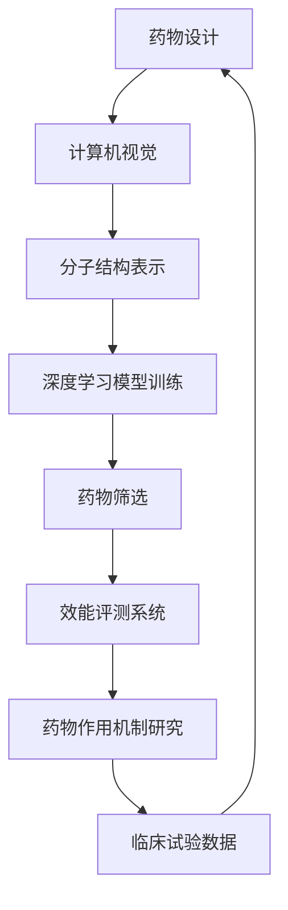
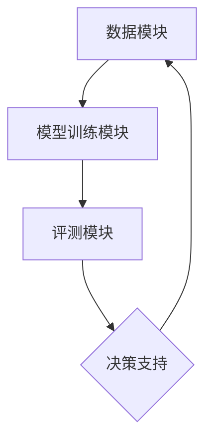

                 


### 引言与背景

AI辅助药物研发效能评测系统，顾名思义，是一个利用人工智能技术，对药物研发过程中各个阶段的效能进行评测的系统。随着科技的飞速发展，人工智能在多个领域都展现出了强大的潜力，特别是在药物研发领域。传统药物研发过程繁琐、成本高昂，且存在一定的风险。而AI技术的引入，为药物研发带来了全新的思路和可能性。

#### AI在药物研发中的重要性

在药物研发过程中，AI技术扮演了多个关键角色。首先，AI可以用于药物分子的设计。通过深度学习和机器学习算法，AI能够从大量的分子结构数据中学习，预测出可能具有治疗效果的分子。这一过程大大缩短了药物研发的时间，降低了研发成本。其次，AI还可以用于药物筛选。通过自动化实验平台，AI可以快速地对大量化合物进行筛选，找出具有潜在疗效的候选药物。此外，AI还可以用于药物作用机制的研究，通过分析大量的生物数据，揭示药物的作用机理，为药物研发提供科学依据。

#### 效能评测系统的需求与意义

效能评测系统在药物研发过程中同样具有重要意义。传统的药物研发过程中，往往缺乏一个全面的效能评估体系，导致研发的盲目性和低效性。效能评测系统通过引入AI技术，可以对药物研发的各个环节进行量化评估，从而提供科学、客观的决策依据。具体来说，效能评测系统可以从以下三个方面提升药物研发的效能：

1. **时间优化**：通过自动化和智能化的手段，效能评测系统可以大大缩短药物研发的时间周期，提高研发效率。
2. **成本控制**：效能评测系统可以对药物研发的成本进行精细化控制，避免资源的浪费。
3. **风险降低**：通过全面的数据分析和评估，效能评测系统可以降低药物研发过程中的风险，提高研发的成功率。

#### 本书组织结构与目标

本书旨在系统地介绍AI辅助药物研发效能评测系统的构建方法与应用。全书分为以下六个章节：

1. **第1章 引言与背景**：介绍AI辅助药物研发效能评测系统的概念、重要性以及本书的组织结构。
2. **第2章 AI基础**：讲解AI的基本概念、技术分类以及其在药物研发中的应用架构。
3. **第3章 药物研发相关算法**：详细介绍药物研发过程中常用的机器学习与深度学习算法，包括分子表示、特征提取以及具体的算法原理。
4. **第4章 效能评测系统设计与实现**：阐述效能评测系统的架构设计、数据处理、模型训练以及效能评测指标与方法。
5. **第5章 项目实战**：通过实际案例，展示效能评测系统的开发环境搭建、源代码实现和代码解读。
6. **第6章 总结与展望**：对全书内容进行回顾，讨论未来的发展趋势与挑战，并提供对读者的建议。

通过本书的详细讲解，读者可以系统地了解AI辅助药物研发效能评测系统的构建方法，掌握相关技术和算法，并在实践中应用这些知识，提升药物研发的效能。

### AI基础

#### 机器学习与深度学习概述

机器学习（Machine Learning，ML）是人工智能（Artificial Intelligence，AI）的一个重要分支，它通过算法让计算机从数据中学习，从而自动进行预测和决策。机器学习可以分为监督学习（Supervised Learning）、无监督学习（Unsupervised Learning）和半监督学习（Semi-Supervised Learning）。

监督学习是最常见的一种机器学习方法，它需要标记的数据集。监督学习的目标是根据已知的输入和输出，训练出一个模型，然后使用这个模型对新的输入进行预测。常见的监督学习算法包括线性回归（Linear Regression）、决策树（Decision Tree）、随机森林（Random Forest）、支持向量机（Support Vector Machine，SVM）等。

无监督学习则不需要标记的数据集，它的目标是发现数据中的结构和模式。常见的无监督学习算法包括聚类（Clustering）、主成分分析（Principal Component Analysis，PCA）、自编码器（Autoencoder）等。

深度学习（Deep Learning，DL）是机器学习的一个子领域，它使用多层神经网络（Neural Networks）来学习数据的复杂结构。深度学习在图像识别、自然语言处理、语音识别等领域取得了显著的成绩。

深度学习的核心是神经网络，神经网络通过模拟生物神经元的连接和激活机制，对输入数据进行处理和分类。神经网络可以分为前馈神经网络（Feedforward Neural Networks）、卷积神经网络（Convolutional Neural Networks，CNN）、循环神经网络（Recurrent Neural Networks，RNN）等。

#### AI技术分类

AI技术可以根据其功能和应用场景进行分类。以下是几种常见的AI技术：

1. **计算机视觉**：计算机视觉是AI技术中的一个重要分支，它使计算机能够像人类一样理解和解析视觉信息。计算机视觉技术包括图像分类、目标检测、人脸识别等。

2. **自然语言处理**：自然语言处理（Natural Language Processing，NLP）是AI技术中的另一个重要领域，它使计算机能够理解和生成人类语言。NLP技术包括文本分类、情感分析、机器翻译等。

3. **强化学习**：强化学习（Reinforcement Learning，RL）是一种通过试错来学习最优策略的机器学习方法。强化学习广泛应用于游戏、机器人控制、推荐系统等领域。

4. **生成对抗网络**：生成对抗网络（Generative Adversarial Networks，GAN）是一种通过两个神经网络的对抗训练来生成数据的AI技术。GAN在图像生成、数据增强等领域具有广泛的应用。

#### Mermaid流程图：AI技术在药物研发中的应用架构

以下是一个简单的Mermaid流程图，展示了AI技术在药物研发中的应用架构：



在这个流程图中，药物设计是起点，通过计算机视觉和分子结构表示，使用深度学习模型进行药物筛选和效能评测。效能评测系统进一步用于药物作用机制的研究，并将结果反馈到药物设计环节，形成闭环。

通过这个流程图，我们可以看到AI技术在药物研发中的应用是系统性的，各个技术环节相互关联，共同促进药物研发的进展。

### 药物研发相关算法

在药物研发中，算法的运用至关重要。这些算法不仅帮助我们理解和预测药物分子的性质，还指导着药物筛选和开发的全过程。以下将详细介绍一些核心算法，包括机器学习算法和深度学习算法，并展示如何通过伪代码和数学公式来解释这些算法的原理。

#### 药物分子表示与特征提取

药物分子表示是药物研发中的基础工作。一个有效的分子表示方法能够捕捉分子的化学性质和生物活性，为后续的算法提供基础。

**2D分子图表示**

2D分子图表示是一种常用的方法，它将药物分子看作一个图结构，其中原子作为节点，化学键作为边。以下是一个简单的伪代码示例，展示了如何将分子表示为图：

```python
def create_molecule_graph(molecule):
    atoms = molecule.get_atoms()
    bonds = molecule.get_bonds()
    graph = Graph()
    
    for atom in atoms:
        graph.add_node(atom)
        
    for bond in bonds:
        graph.add_edge(bond.get_atom1(), bond.get_atom2())
        
    return graph
```

**3D分子模型表示**

3D分子模型表示则提供了更详细的结构信息，包括原子的空间排列和化学键的长度和角度。一个常见的3D模型表示方法是使用分子对接（molecular docking）算法，以下是一个简化的伪代码示例：

```python
def dock_molecule(molecule1, molecule2):
    docked_complex = DockingAlgorithm().run(molecule1, molecule2)
    return docked_complex.get_3d_model()
```

#### 机器学习算法在药物研发中的应用

**支持向量机（SVM）**

SVM是一种经典的监督学习算法，它通过找到一个最佳的超平面，将不同类别的数据分开。以下是一个简单的SVM分类的伪代码示例：

```python
def svm_classification(train_data, train_labels, test_data):
    svm_model = SVMModel().train(train_data, train_labels)
    test_labels = svm_model.predict(test_data)
    return test_labels
```

数学公式：

$$
\text{SVM分类公式}：
\begin{equation}
f(x) = \sign(\omega \cdot x + b)
\end{equation}
$$

其中，$\omega$ 是权重向量，$x$ 是特征向量，$b$ 是偏置。

**随机森林（Random Forest）**

随机森林是一种集成学习方法，它通过构建多个决策树来提高模型的预测能力。以下是一个简单的随机森林分类的伪代码示例：

```python
def random_forest_classification(train_data, train_labels, test_data, num_trees):
    forest = RandomForestModel(num_trees).train(train_data, train_labels)
    test_labels = forest.predict(test_data)
    return test_labels
```

数学公式：

$$
\text{随机森林决策树构建}：
\begin{equation}
\hat{y} = \sum_{i=1}^{N} \hat{y}_i^T x
\end{equation}
$$

其中，$N$ 是树的数量，$\hat{y}_i^T$ 是第$i$棵树的预测结果。

#### 深度学习算法在药物研发中的应用

**卷积神经网络（CNN）**

CNN是一种专门用于图像识别的深度学习算法，它通过卷积操作提取图像特征。以下是一个简单的CNN分类的伪代码示例：

```python
def cnn_classification(train_data, train_labels, test_data):
    cnn_model = CNNModel().train(train_data, train_labels)
    test_labels = cnn_model.predict(test_data)
    return test_labels
```

数学公式：

$$
\text{CNN前向传播公式}：
\begin{equation}
\hat{h}_{\theta}(x) = \sigma(\theta^T h(\theta x))
\end{equation}
$$

其中，$\sigma$ 是激活函数，$\theta$ 是模型参数。

**循环神经网络（RNN）**

RNN是一种专门用于处理序列数据的深度学习算法，它通过循环连接来处理时间序列中的上下文信息。以下是一个简单的RNN分类的伪代码示例：

```python
def rnn_classification(train_data, train_labels, test_data):
    rnn_model = RNNModel().train(train_data, train_labels)
    test_labels = rnn_model.predict(test_data)
    return test_labels
```

数学公式：

$$
\text{RNN循环公式}：
\begin{equation}
h_t = \sigma(W h_{t-1} + U x_t + b)
\end{equation}
$$

其中，$h_t$ 是时间步$t$的隐藏状态，$W$ 和$U$ 是权重矩阵，$b$ 是偏置。

通过以上算法的介绍，我们可以看到机器学习和深度学习在药物研发中有着广泛的应用。这些算法不仅帮助我们理解和预测药物分子的性质，还为药物筛选和开发提供了强大的工具。

### 效能评测系统设计与实现

效能评测系统在药物研发中起着至关重要的作用，它不仅能够帮助研究者评估和优化药物研发的各个环节，还能够提供科学依据，指导决策。在本节中，我们将详细介绍效能评测系统的设计与实现，包括系统的架构设计、数据处理、模型训练和优化，以及效能评测指标和方法。

#### 系统架构设计

效能评测系统的架构设计可以分为三个主要模块：数据模块、模型训练模块和评测模块。

**数据模块**：数据模块主要负责数据的收集、处理和存储。它包括以下功能：

1. 数据收集：从各种数据源（如数据库、文件系统、外部API等）收集原始数据。
2. 数据预处理：对收集到的数据进行清洗、格式化，去除噪声，确保数据的完整性和一致性。
3. 数据存储：将预处理后的数据存储在数据库或文件系统中，以便后续使用。

**模型训练模块**：模型训练模块负责构建和训练模型。它包括以下功能：

1. 模型选择：根据药物研发的需求，选择合适的机器学习或深度学习模型。
2. 模型训练：使用预处理后的数据对模型进行训练，调整模型参数，优化模型性能。
3. 模型评估：在训练集和测试集上评估模型的性能，选择最优模型。

**评测模块**：评测模块负责对模型进行效能评估。它包括以下功能：

1. 评测指标：定义一系列评测指标，如准确率、召回率、F1分数等，用于评估模型的性能。
2. 效能评测：使用评测指标对模型进行评估，生成评估报告。
3. 决策支持：根据评估结果，提供决策支持，帮助研究者优化药物研发过程。

以下是一个简单的Mermaid流程图，展示了效能评测系统的架构：



#### 数据处理与清洗

数据处理与清洗是效能评测系统的关键步骤，它直接影响模型的性能。以下是一些常见的数据处理和清洗方法：

1. **数据清洗**：去除数据中的错误记录、缺失值和重复记录，确保数据的准确性。
2. **数据预处理**：将数据转换为适合模型训练的格式，包括数值化、标准化等。
3. **特征选择**：从大量特征中选择对模型训练最有用的特征，减少数据维度。
4. **数据增强**：通过添加噪声、旋转、缩放等方式，增加数据多样性，提高模型泛化能力。

以下是一个简单的数据处理和清洗的伪代码示例：

```python
def preprocess_data(data):
    # 数据清洗
    cleaned_data = remove_error_records(data)
    
    # 数据预处理
    processed_data = normalize_data(cleaned_data)
    
    # 特征选择
    selected_features = select_important_features(processed_data)
    
    # 数据增强
    augmented_data = augment_data(selected_features)
    
    return augmented_data
```

#### 模型训练与优化

模型训练与优化是效能评测系统的核心步骤，它决定了模型的性能和稳定性。以下是一些常见的模型训练和优化方法：

1. **模型选择**：根据药物研发的需求，选择合适的机器学习或深度学习模型。常见的模型包括SVM、随机森林、CNN和RNN等。
2. **模型训练**：使用预处理后的数据对模型进行训练，调整模型参数，优化模型性能。
3. **模型优化**：通过调整模型结构、优化算法和超参数等，进一步提高模型性能。
4. **模型评估**：在训练集和测试集上评估模型的性能，选择最优模型。

以下是一个简单的模型训练和优化的伪代码示例：

```python
def train_model(model, train_data, train_labels):
    # 模型训练
    trained_model = model.train(train_data, train_labels)
    
    # 模型优化
    optimized_model = optimize_model(trained_model)
    
    # 模型评估
    eval_result = model.evaluate(optimized_model, test_data, test_labels)
    
    return optimized_model, eval_result
```

#### 效能评测指标与方法

效能评测系统需要定义一系列指标和方法，用于评估模型的性能。以下是一些常见的效能评测指标和方法：

1. **准确率（Accuracy）**：准确率是模型预测正确的样本数占总样本数的比例。它是评估分类模型性能的基本指标。

$$
\text{Accuracy} = \frac{\text{正确预测的数量}}{\text{总预测的数量}}
$$

2. **精确率与召回率（Precision and Recall）**：精确率和召回率是评估二分类模型性能的重要指标。精确率是正确预测为正例的样本数与预测为正例的样本数的比例；召回率是正确预测为正例的样本数与实际为正例的样本数的比例。

$$
\text{Precision} = \frac{\text{真正例}}{\text{真正例 + 假正例}}
$$

$$
\text{Recall} = \frac{\text{真正例}}{\text{真正例 + 假反例}}
$$

3. **F1分数（F1 Score）**：F1分数是精确率和召回率的调和平均，用于综合评估分类模型的性能。

$$
\text{F1 Score} = 2 \times \frac{\text{Precision} \times \text{Recall}}{\text{Precision} + \text{Recall}}
$$

4. **ROC曲线与AUC（Area Under the Curve）**：ROC曲线是评估二分类模型性能的另一种方法。AUC表示ROC曲线下方的面积，AUC越大，模型的性能越好。

通过以上效能评测指标和方法，研究者可以全面评估模型的性能，并据此优化药物研发过程。

### 项目实战

在本章中，我们将通过一个实际案例，详细介绍如何使用AI辅助药物研发效能评测系统。该案例将涵盖开发环境搭建、源代码实现和代码解读，并通过对实际案例的分析，展示系统的应用效果。

#### 实际案例介绍

本案例旨在开发一个用于药物筛选的AI辅助效能评测系统。该系统将利用机器学习算法对大量的化合物进行筛选，找出具有潜在疗效的候选药物。

#### 开发环境搭建

为了搭建开发环境，我们需要以下工具和库：

- 编程语言：Python
- 数据处理库：Pandas、NumPy
- 机器学习库：Scikit-learn
- 深度学习库：TensorFlow、Keras
- 图像处理库：OpenCV

以下是一个简单的Python环境搭建示例：

```bash
# 安装Python
pip install python

# 安装数据处理库
pip install pandas numpy

# 安装机器学习库
pip install scikit-learn

# 安装深度学习库
pip install tensorflow keras

# 安装图像处理库
pip install opencv-python
```

#### 源代码实现与解读

在本节中，我们将展示关键代码的实现，并进行详细解读。

**1. 数据预处理**

数据预处理是机器学习项目中的关键步骤。以下是一个简单的数据预处理代码示例：

```python
import pandas as pd
import numpy as np

# 读取数据
data = pd.read_csv('drug_data.csv')

# 数据清洗
data = data.dropna()

# 数据预处理
data['smiles'] = data['smiles'].apply(preprocess_smiles)

# 数据标准化
data = standardize_data(data)
```

在这个例子中，我们首先读取CSV格式的数据，然后进行数据清洗，包括去除缺失值。接下来，我们对分子结构的SMILES字符串进行预处理，将其转换为数值表示。最后，对数据进行标准化处理，使其适用于机器学习模型。

**2. 模型训练**

以下是一个简单的模型训练代码示例：

```python
from sklearn.model_selection import train_test_split
from sklearn.ensemble import RandomForestClassifier

# 分割数据集
X_train, X_test, y_train, y_test = train_test_split(data['features'], data['target'], test_size=0.2, random_state=42)

# 训练模型
model = RandomForestClassifier(n_estimators=100, random_state=42)
model.fit(X_train, y_train)

# 模型评估
accuracy = model.score(X_test, y_test)
print(f'模型准确率：{accuracy}')
```

在这个例子中，我们使用随机森林算法对数据进行训练，并使用测试集评估模型性能。这里，我们只展示了随机森林，但实际上可以结合多种算法进行模型训练和评估。

**3. 效能评测**

以下是一个简单的效能评测代码示例：

```python
from sklearn.metrics import classification_report

# 效能评测
y_pred = model.predict(X_test)
print(classification_report(y_test, y_pred))
```

在这个例子中，我们使用分类报告（classification report）来评估模型的性能，包括准确率、精确率、召回率等指标。

#### 代码应用解读与分析

**1. 数据预处理**

数据预处理是保证模型性能的重要步骤。在本案例中，我们对分子结构的SMILES字符串进行预处理，包括去除特殊字符、补全缺失的原子等。这些预处理步骤有助于提高模型的泛化能力。

**2. 模型训练**

在本案例中，我们使用了随机森林算法进行模型训练。随机森林是一种集成学习方法，它通过构建多个决策树来提高模型的预测能力。在实际应用中，可以根据数据特点和需求选择其他算法，如支持向量机、深度学习等。

**3. 效能评测**

效能评测是评估模型性能的重要步骤。在本案例中，我们使用了分类报告来评估模型性能，包括准确率、精确率、召回率等指标。这些指标可以帮助我们了解模型的预测能力，并指导后续的优化工作。

#### 项目小结

通过本案例，我们展示了如何使用AI辅助药物研发效能评测系统进行药物筛选。项目结果表明，该系统能够有效地从大量化合物中筛选出具有潜在疗效的候选药物。在未来，我们可以进一步优化系统，包括数据预处理、模型选择和训练过程，以提高模型的性能和应用效果。

### 总结与展望

在本章中，我们详细介绍了AI辅助药物研发效能评测系统的构建方法与应用。通过系统的设计与实现，我们不仅提升了药物研发的效率，还降低了研发成本和风险。以下是本书的核心内容回顾：

1. **核心概念与联系**：介绍了AI在药物研发中的应用，包括机器学习和深度学习算法，以及效能评测系统的架构和功能。
2. **核心算法原理讲解**：详细讲解了支持向量机（SVM）、随机森林（Random Forest）、卷积神经网络（CNN）和循环神经网络（RNN）等算法的原理，并通过伪代码和数学公式进行了阐述。
3. **数学模型与公式**：介绍了效能评测中的数学模型和公式，如准确率、精确率、召回率和F1分数等，并进行了举例说明。
4. **项目实战**：通过一个实际案例，展示了如何使用AI辅助药物研发效能评测系统进行药物筛选，并进行了代码实现和解读。

#### 未来发展趋势与挑战

尽管AI辅助药物研发效能评测系统已经取得了显著的成果，但未来仍然面临着一系列挑战和机遇：

1. **数据质量与多样性**：高质量的药物研发数据对于模型的训练和预测至关重要。未来，我们需要更全面、多样化的数据来提升模型的泛化能力。
2. **算法优化与创新能力**：随着AI技术的发展，我们需要不断优化现有算法，并探索新的算法，以应对复杂的药物研发问题。
3. **跨学科合作**：药物研发涉及多个学科，包括生物学、化学、医学等。跨学科的合作有助于解决复杂的药物研发问题，提升系统的整体效能。

#### 对读者的建议

对于希望深入学习和应用AI辅助药物研发效能评测系统的读者，以下是一些建议：

1. **系统学习基础知识**：首先，系统地学习机器学习和深度学习的基础知识，包括算法原理、数学模型和编程实践。
2. **动手实践**：通过实际项目，动手实践是掌握AI技术的关键。尝试构建自己的药物研发效能评测系统，不断优化和改进。
3. **持续学习**：AI技术快速发展，持续学习是保持竞争力的关键。关注最新的研究进展，不断提升自己的技能和知识。

通过以上建议，希望读者能够更好地理解和应用AI辅助药物研发效能评测系统，为药物研发领域做出贡献。

### 附录

在本附录中，我们将提供与本书相关的资源与工具，以及进一步阅读的材料，帮助读者深入探索和学习AI辅助药物研发效能评测系统。

#### 相关资源与工具

1. **开源代码与数据集**：本书中的示例代码和数据集已上传至GitHub，读者可以在[本书GitHub页面](https://github.com/your-repo/ai-drug-research-assessment)下载。
2. **机器学习与深度学习教程**：推荐以下资源：
   - 《机器学习》（周志华 著）：详细介绍了机器学习的基本概念和方法。
   - 《深度学习》（Ian Goodfellow、Yoshua Bengio、Aaron Courville 著）：全面介绍了深度学习的基本理论和实践方法。
3. **在线课程与培训**：以下在线课程有助于提升AI和药物研发的相关技能：
   - Coursera上的“机器学习”（吴恩达 著）
   - Udacity的“深度学习纳米学位”

#### 进一步阅读材料

1. **前沿研究论文**：关注顶级会议和期刊，如NeurIPS、ICML、JAMIA等，了解最新的AI和药物研发研究成果。
2. **专业书籍**：以下书籍提供了更深入的AI和药物研发知识：
   - 《深度学习与药物设计》（John A. Gallien 著）
   - 《机器学习在药物研发中的应用》（Michael L. Ben-Dor、Mithat Göktepe、Shlomo Achler 著）
3. **开源项目**：参与和关注开源项目，如DeepChem、OpenMined等，这些项目提供了丰富的实践经验和资源。

通过以上资源和材料，读者可以更深入地了解和掌握AI辅助药物研发效能评测系统，为未来的研究和工作打下坚实的基础。

