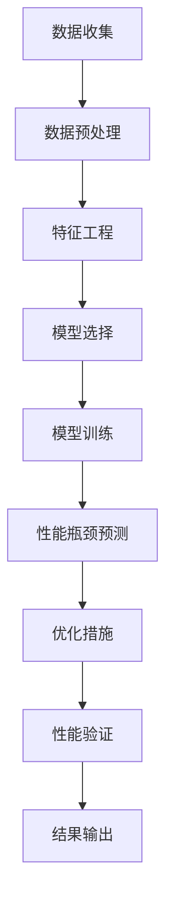

                 

## 文章标题：AI辅助软件性能瓶颈识别与优化

### 关键词：

1. AI辅助
2. 软件性能瓶颈
3. 识别与优化
4. 算法原理
5. 数学模型
6. 项目实战
7. 深度学习

### 摘要：

本文旨在探讨AI辅助软件性能瓶颈识别与优化的方法与应用。首先，我们介绍了软件性能瓶颈的基本概念和AI技术在性能优化中的应用。接着，通过Mermaid流程图展示了AI辅助软件性能瓶颈识别的核心概念和流程。随后，我们详细讲解了性能瓶颈识别的核心算法原理，使用伪代码进行阐述，并引入了相关的数学模型和公式。通过实际项目案例，我们展示了如何使用这些算法和模型进行软件性能瓶颈的识别与优化，包括开发环境搭建、源代码实现和代码解读。最后，我们对全文进行了总结，并对未来研究方向和趋势进行了展望。

----------------------------------------------------------------

### 引言

在当今高速发展的信息技术时代，软件性能瓶颈问题日益突出，成为制约软件系统性能提升的关键因素。性能瓶颈的存在不仅会影响用户体验，还会增加系统维护成本，降低软件系统的可靠性和稳定性。因此，如何有效地识别和优化软件性能瓶颈，已经成为软件工程领域的重要研究方向。

传统的软件性能瓶颈识别和优化方法主要依赖于经验判断和性能测试工具，这些方法存在一定的局限性。首先，经验判断依赖于开发人员的个人经验和专业知识，容易受到主观因素的影响，可能导致误判或漏判。其次，性能测试工具虽然能够提供定量的分析结果，但其测试过程复杂，耗时较长，且难以覆盖所有的运行场景。

随着人工智能技术的快速发展，AI技术在软件性能瓶颈识别与优化中的应用逐渐成为研究热点。AI技术具有自我学习、自动优化等特点，能够从大量数据中提取有价值的信息，为性能瓶颈的识别和优化提供强有力的支持。本文旨在探讨AI辅助软件性能瓶颈识别与优化的方法与应用，为解决这一难题提供新的思路。

本文的结构如下：首先，我们介绍与AI辅助软件性能瓶颈识别与优化相关的核心概念，并使用Mermaid流程图展示这些概念之间的联系；然后，详细讲解用于识别和优化软件性能瓶颈的主要算法原理，并使用伪代码进行阐述；接着，介绍相关的数学模型和数学公式，并使用LaTeX格式进行详细讲解和举例说明；随后，通过实际项目案例，展示如何使用上述理论和算法进行软件性能瓶颈的识别和优化，包括开发环境搭建、源代码实现和代码解读；最后，对全书内容进行总结，并对未来研究方向和趋势进行展望。

----------------------------------------------------------------

### 1.1 AI辅助软件性能瓶颈识别与优化概述

软件性能瓶颈是指软件系统在运行过程中，由于某些组件或资源的性能限制，导致整个系统无法达到预期的性能水平。这些瓶颈可能是由于硬件资源不足、代码效率低下、系统设计不合理等多种因素造成的。传统的软件性能瓶颈识别和优化方法通常依赖于性能测试工具和开发人员的经验判断。然而，这些方法往往存在一定的局限性。

随着人工智能技术的快速发展，AI技术在软件性能瓶颈识别与优化中的应用逐渐成为研究热点。AI技术通过自我学习和数据挖掘，可以从大量历史数据和运行日志中提取有价值的信息，帮助识别潜在的性能瓶颈。具体而言，AI辅助软件性能瓶颈识别与优化的方法主要包括以下几个方面：

1. **数据预处理**：首先，需要对软件系统运行过程中产生的日志数据进行预处理，包括数据清洗、去噪、特征提取等步骤。这一过程对于后续的AI模型训练至关重要。

2. **特征工程**：通过数据预处理后，我们需要从原始数据中提取出与性能瓶颈相关的特征。这些特征可以是系统资源利用率、响应时间、并发请求数等。特征工程的质量直接影响到后续模型的效果。

3. **模型选择与训练**：根据问题的特点，选择合适的机器学习算法和深度学习模型进行性能瓶颈识别。常见的算法包括决策树、随机森林、支持向量机等。对于复杂的性能瓶颈识别问题，深度学习模型如卷积神经网络（CNN）、循环神经网络（RNN）等可能更为有效。

4. **性能瓶颈预测与优化**：通过训练好的模型，对软件系统运行时的性能进行实时监测和预测。当预测到性能瓶颈时，可以采取相应的优化措施，如调整系统配置、优化代码、调整硬件资源等。

5. **自动化优化**：利用AI技术实现性能瓶颈的自动化识别和优化。通过持续学习和自适应调整，AI系统可以不断提高性能瓶颈识别的准确性和优化效果。

总之，AI辅助软件性能瓶颈识别与优化是一种高效、智能的方法，能够大大提高软件系统的性能和稳定性。通过本文的探讨，我们希望能够为读者提供一种全新的视角，深入了解AI技术在软件性能瓶颈识别与优化中的应用，为实际项目提供有益的参考。

### 1.2 相关概念介绍

在深入探讨AI辅助软件性能瓶颈识别与优化的方法之前，有必要先介绍一些相关的基本概念。这些概念不仅为后续的讨论提供了理论基础，也有助于读者更好地理解本文的内容。

#### 1.2.1 软件性能瓶颈

软件性能瓶颈是指在软件系统的运行过程中，由于某些组件或资源的性能限制，导致系统无法达到预期性能的现象。常见的性能瓶颈包括：

- **CPU瓶颈**：当CPU处理能力不足时，会导致系统无法及时处理大量并发请求，从而降低整体性能。
- **内存瓶颈**：内存资源不足时，会导致频繁的页面交换，增加CPU的负担，从而影响系统性能。
- **I/O瓶颈**：当系统进行大量读写操作时，磁盘I/O性能成为瓶颈，会导致系统响应时间延长。
- **网络瓶颈**：在网络传输过程中，由于带宽限制或网络拥塞，会导致数据传输速度变慢，影响系统性能。

识别软件性能瓶颈是进行性能优化的重要前提。通过性能监控工具和日志分析，我们可以发现系统中的性能瓶颈，并采取相应的措施进行优化。

#### 1.2.2 人工智能

人工智能（Artificial Intelligence, AI）是模拟人类智能行为的计算机科学领域。它涵盖了从简单的规则系统到复杂的机器学习算法等多个方面。在软件性能瓶颈识别与优化中，人工智能技术具有以下重要作用：

- **数据挖掘与分析**：利用机器学习和数据挖掘技术，从大量历史数据和运行日志中提取有价值的信息，为性能瓶颈识别提供依据。
- **预测与优化**：通过训练深度学习模型，实现对系统性能的实时监测和预测，及时识别并优化性能瓶颈。
- **自动化与智能化**：利用人工智能技术实现性能瓶颈识别与优化的自动化，减少人工干预，提高优化效果和效率。

#### 1.2.3 深度学习

深度学习（Deep Learning）是人工智能的一个重要分支，通过构建多层的神经网络模型，实现对复杂数据的自动学习和特征提取。在软件性能瓶颈识别与优化中，深度学习技术具有以下应用：

- **图像识别与处理**：利用深度学习模型，对系统监控图像进行分析和处理，识别系统性能瓶颈。
- **时序数据分析**：通过循环神经网络（RNN）等深度学习模型，对系统运行时的时序数据进行处理，预测性能瓶颈的出现。
- **自动化性能优化**：利用深度强化学习（Deep Reinforcement Learning）等技术，实现性能瓶颈识别与优化的自动化和智能化。

#### 1.2.4 机器学习

机器学习（Machine Learning）是人工智能的一个核心组成部分，通过训练模型，使计算机能够从数据中自动学习并做出预测或决策。在软件性能瓶颈识别与优化中，机器学习技术主要包括：

- **分类与回归**：利用分类和回归算法，对性能瓶颈进行识别和预测。
- **聚类与关联分析**：通过聚类和关联分析，发现系统中的潜在性能瓶颈。
- **特征选择与优化**：利用特征选择和特征优化技术，提高性能瓶颈识别的准确性。

#### 1.2.5 数学模型与公式

数学模型和公式在软件性能瓶颈识别与优化中起着关键作用。常见的数学模型包括：

- **线性回归模型**：用于预测系统性能瓶颈的出现。
- **支持向量机（SVM）**：用于分类性能瓶颈的类型。
- **神经网络模型**：用于复杂的性能瓶颈识别和优化。

常见的数学公式包括：

- **梯度下降算法**：用于训练神经网络模型。
- **卷积操作**：用于图像识别与处理。

通过了解这些基本概念，读者可以更好地理解AI辅助软件性能瓶颈识别与优化的方法和原理。在接下来的章节中，我们将进一步探讨相关的算法原理、数学模型和实际项目案例，帮助读者深入掌握这一领域的技术。

### 2.1 AI技术基本原理

人工智能（AI）技术是本文讨论的核心，理解其基本原理对于深入探讨AI辅助软件性能瓶颈识别与优化至关重要。AI技术主要包括机器学习、深度学习和神经网络等，下面将分别进行介绍。

#### 2.1.1 机器学习

机器学习是人工智能的一个分支，它使计算机系统能够从数据中学习并做出预测或决策。机器学习主要分为监督学习、无监督学习和强化学习三种类型。

1. **监督学习**：在监督学习中，系统使用带有标签的训练数据来学习如何预测未知数据的标签。常见的监督学习算法包括线性回归、逻辑回归、支持向量机（SVM）、决策树、随机森林等。

   - **线性回归**：通过拟合数据点的线性模型来预测目标变量。
     $$ y = \beta_0 + \beta_1 \cdot x $$
   - **逻辑回归**：用于分类问题，通过计算概率来实现分类。
     $$ P(y=1) = \frac{1}{1 + e^{-(\beta_0 + \beta_1 \cdot x)} } $$

2. **无监督学习**：无监督学习不使用带有标签的数据，而是通过发现数据中的模式和结构来进行学习。常见的无监督学习算法包括聚类算法、主成分分析（PCA）等。

   - **K-means聚类**：将数据分为K个簇，每个簇内的数据点距离聚类中心最近。
     $$ \text{minimize} \sum_{i=1}^{K} \sum_{x \in S_i} ||x - \mu_i||^2 $$

3. **强化学习**：强化学习是通过与环境互动来学习最佳策略的机器学习方法。它通常用于解决决策问题，如游戏、机器人控制等。

   - **Q-learning**：使用Q值函数来评估状态-动作对，并选择最优动作。
     $$ Q(s, a) = r + \gamma \max_{a'} Q(s', a') $$

#### 2.1.2 深度学习

深度学习是机器学习的一个子领域，它通过构建多层神经网络来模拟人类大脑的处理方式。深度学习模型由多个神经元层组成，包括输入层、隐藏层和输出层。

1. **卷积神经网络（CNN）**：CNN主要用于图像识别和处理。它通过卷积操作和池化操作来提取图像特征。

   - **卷积操作**：将卷积核应用于输入图像，生成特征图。
     $$ f(x, \theta) = \sum_{i} \theta_i \cdot x $$
   - **池化操作**：对特征图进行下采样，减少参数数量。
     $$ \text{max pooling}(x) = \max_{i} x[i] $$

2. **循环神经网络（RNN）**：RNN适用于处理序列数据，如时间序列分析、自然语言处理等。

   - **隐藏状态**：RNN通过隐藏状态来记住序列中的信息。
     $$ h_t = \text{sigmoid}(W_h \cdot [h_{t-1}, x_t] + b_h) $$

3. **生成对抗网络（GAN）**：GAN通过两个神经网络（生成器和判别器）的对抗训练，生成逼真的数据。

   - **生成器**：生成类似于真实数据的样本。
     $$ G(z) = \text{sigmoid}(W_g \cdot z + b_g) $$
   - **判别器**：判断生成数据是否为真实数据。
     $$ D(x) = \text{sigmoid}(W_d \cdot x + b_d) $$

#### 2.1.3 神经网络

神经网络是深度学习的基础，它由大量相互连接的神经元组成，每个神经元接收输入、进行计算并产生输出。神经网络通过不断调整权重和偏置来优化模型性能。

1. **神经元模型**：每个神经元接收多个输入，并通过非线性激活函数产生输出。
   $$ a_j = \sum_{i} w_{ij} \cdot x_i + b_j $$
   $$ o_j = \text{激活函数}(a_j) $$

2. **反向传播算法**：神经网络通过反向传播算法来更新权重和偏置，使模型能够最小化损失函数。
   $$ \delta_{ij} = (o_j - t_j) \cdot \text{激活函数的导数}(a_j) $$
   $$ \Delta w_{ij} = \alpha \cdot \delta_{ij} \cdot x_i $$
   $$ \Delta b_j = \alpha \cdot \delta_{ij} $$

通过了解这些基本原理，我们可以更好地理解AI技术在软件性能瓶颈识别与优化中的应用。在接下来的章节中，我们将进一步探讨如何将这些原理应用于实际项目。

### 2.2 Mermaid流程图展示

为了更好地展示AI辅助软件性能瓶颈识别与优化的核心流程和概念之间的联系，我们使用Mermaid语言绘制了一个简化的流程图。以下是一个Mermaid流程图的示例：



在这个流程图中，我们定义了以下关键步骤：

1. **数据收集（A）**：从软件系统运行过程中收集必要的性能数据，包括CPU利用率、内存占用、I/O操作次数等。
2. **数据预处理（B）**：对收集到的数据进行清洗和预处理，去除噪声、填补缺失值、归一化等。
3. **特征工程（C）**：从预处理后的数据中提取与性能瓶颈相关的特征，如响应时间、吞吐量、并发请求数等。
4. **模型选择（D）**：根据问题的特点和数据特性，选择合适的机器学习或深度学习模型。
5. **模型训练（E）**：使用特征数据和相应的标签（如果存在）来训练选定的模型。
6. **性能瓶颈预测（F）**：使用训练好的模型对软件系统的运行状态进行实时监测和预测，识别潜在的性能瓶颈。
7. **优化措施（G）**：根据预测结果，采取相应的优化措施，如调整系统配置、优化代码、增加硬件资源等。
8. **性能验证（H）**：对优化后的系统进行性能验证，确保性能瓶颈得到有效缓解。
9. **结果输出（I）**：将优化结果和性能指标输出，以便进一步分析和决策。

通过这个Mermaid流程图，我们可以清晰地看到AI辅助软件性能瓶颈识别与优化的整体流程，以及各步骤之间的逻辑关系。这有助于读者更好地理解整个系统的运作原理，为后续的实际应用提供指导。

### 3.1 性能瓶颈识别算法

在软件性能瓶颈识别过程中，选择合适的算法至关重要。本节将详细介绍几种常用的性能瓶颈识别算法，并使用伪代码进行阐述。

#### 3.1.1 决策树

决策树是一种基于规则的有监督学习算法，通过一系列的决策路径，将数据集划分成若干个区域，每个区域对应一个类别或标签。在性能瓶颈识别中，决策树可以用于分类不同的性能瓶颈类型。

**伪代码：**

```
Algorithm DecisionTreeClassifier(data, labels):
    # 构建决策树模型
    tree = DecisionTreeClassifier()

    # 训练模型
    tree.fit(data, labels)

    # 预测性能瓶颈类型
    predictions = tree.predict(new_data)

    return predictions
```

**示例：**

```
# 数据集示例
data = [
    [80, 100],  # CPU利用率为80%，内存占用率为100%
    [90, 90],   # CPU利用率为90%，内存占用率为90%
    [70, 110],  # CPU利用率为70%，内存占用率为110%
]

labels = [
    'CPU瓶颈',  # 第一行为CPU瓶颈
    '内存瓶颈',  # 第二行为内存瓶颈
    'I/O瓶颈',   # 第三行为I/O瓶颈
]

# 使用决策树模型进行性能瓶颈识别
predictions = DecisionTreeClassifier(data, labels)
predictions  # 输出预测结果
```

#### 3.1.2 支持向量机（SVM）

支持向量机（SVM）是一种高效的二分类算法，通过找到一个最佳的超平面来将数据集中的不同类别分开。在性能瓶颈识别中，SVM可以用于分类不同的性能瓶颈类型。

**伪代码：**

```
Algorithm SVMClassifier(data, labels):
    # 构建SVM模型
    svm = SVC()

    # 训练模型
    svm.fit(data, labels)

    # 预测性能瓶颈类型
    predictions = svm.predict(new_data)

    return predictions
```

**示例：**

```
# 数据集示例
data = [
    [80, 100],  # CPU利用率为80%，内存占用率为100%
    [90, 90],   # CPU利用率为90%，内存占用率为90%
    [70, 110],  # CPU利用率为70%，内存占用率为110%
]

labels = [
    'CPU瓶颈',  # 第一行为CPU瓶颈
    '内存瓶颈',  # 第二行为内存瓶颈
    'I/O瓶颈',   # 第三行为I/O瓶颈
]

# 使用SVM模型进行性能瓶颈识别
predictions = SVMClassifier(data, labels)
predictions  # 输出预测结果
```

#### 3.1.3 随机森林

随机森林（Random Forest）是一种集成学习方法，通过构建多个决策树并投票来生成最终结果。在性能瓶颈识别中，随机森林可以提供更高的准确性和鲁棒性。

**伪代码：**

```
Algorithm RandomForestClassifier(data, labels):
    # 构建随机森林模型
    rf = RandomForestClassifier()

    # 训练模型
    rf.fit(data, labels)

    # 预测性能瓶颈类型
    predictions = rf.predict(new_data)

    return predictions
```

**示例：**

```
# 数据集示例
data = [
    [80, 100],  # CPU利用率为80%，内存占用率为100%
    [90, 90],   # CPU利用率为90%，内存占用率为90%
    [70, 110],  # CPU利用率为70%，内存占用率为110%
]

labels = [
    'CPU瓶颈',  # 第一行为CPU瓶颈
    '内存瓶颈',  # 第二行为内存瓶颈
    'I/O瓶颈',   # 第三行为I/O瓶颈
]

# 使用随机森林模型进行性能瓶颈识别
predictions = RandomForestClassifier(data, labels)
predictions  # 输出预测结果
```

通过以上三种算法的介绍和伪代码示例，我们可以看到它们在性能瓶颈识别中的应用。在实际应用中，可以根据具体问题和数据特点选择合适的算法。此外，还可以结合多种算法，构建更加复杂和高效的性能瓶颈识别模型。

### 3.2 伪代码实现

为了更好地理解性能瓶颈识别算法的细节，我们将使用伪代码来展示一个简单的性能瓶颈识别系统。以下是一个基于机器学习的性能瓶颈识别系统的伪代码实现：

```pseudo
Algorithm PerformanceBottleneckDetector(data, labels):
    # 数据预处理
    preprocessData(data)
    # 特征提取
    features = extractFeatures(data)
    
    # 模型选择
    model = selectModel()

    # 模型训练
    model.fit(features, labels)
    
    # 性能瓶颈识别
    new_data = collectNewData()
    new_features = extractFeatures(new_data)
    bottleneck_type = model.predict(new_features)
    
    # 输出结果
    print("Identified Bottleneck Type: ", bottleneck_type)

    return bottleneck_type
```

#### 3.2.1 数据预处理

数据预处理是性能瓶颈识别的重要步骤，它包括数据清洗、缺失值填补和特征归一化等操作。

```pseudo
Function preprocessData(data):
    # 去除缺失值
    cleanData = removeMissingValues(data)
    
    # 特征归一化
    normalizedData = normalizeFeatures(cleanData)
    
    return normalizedData
```

#### 3.2.2 特征提取

特征提取是将原始数据转换为机器学习模型可处理的特征向量。在这个例子中，我们提取了CPU利用率、内存占用率和I/O操作次数等特征。

```pseudo
Function extractFeatures(data):
    features = []
    for row in data:
        feature_vector = [
            row['CPU_usage'],
            row['memory_usage'],
            row['I/O_operations']
        ]
        features.append(feature_vector)
    
    return features
```

#### 3.2.3 模型选择

模型选择是选择合适的机器学习算法来识别性能瓶颈。在这个例子中，我们选择了随机森林算法。

```pseudo
Function selectModel():
    model = RandomForestClassifier()
    return model
```

#### 3.2.4 模型训练

模型训练是将特征数据和标签数据输入到模型中进行训练，以便模型能够学习并识别性能瓶颈。

```pseudo
Function model.fit(features, labels):
    model.fit(features, labels)
    return model
```

#### 3.2.5 性能瓶颈识别

性能瓶颈识别是通过训练好的模型对新数据进行预测，从而识别系统中的性能瓶颈。

```pseudo
Function model.predict(new_features):
    bottleneck_type = model.predict(new_features)
    return bottleneck_type
```

#### 3.2.6 输出结果

输出结果是将识别出的性能瓶颈类型打印出来，以便进一步分析和处理。

```pseudo
Function print("Identified Bottleneck Type: ", bottleneck_type):
    print("Identified Bottleneck Type: ", bottleneck_type)
```

通过这个简单的伪代码实现，我们可以看到性能瓶颈识别系统的基本结构和功能。在实际应用中，可以根据具体需求和数据特点，对上述伪代码进行修改和优化，以提高性能瓶颈识别的准确性和效率。

### 4.1 性能瓶颈识别的数学模型

在性能瓶颈识别过程中，数学模型扮演着关键角色。它不仅帮助我们理解和分析系统的运行状态，还能为性能瓶颈的预测和优化提供理论基础。本节将介绍几种常用的数学模型，并使用LaTeX格式进行详细讲解。

#### 4.1.1 线性回归模型

线性回归模型是一种简单的预测模型，它通过拟合一条直线来预测目标变量。在性能瓶颈识别中，线性回归模型可以用来预测系统的响应时间或吞吐量。

**数学公式：**

$$ y = \beta_0 + \beta_1 \cdot x + \epsilon $$

其中，\( y \)是目标变量（如响应时间或吞吐量），\( x \)是自变量（如CPU利用率或内存占用率），\( \beta_0 \)和\( \beta_1 \)是模型的参数，\( \epsilon \)是误差项。

**LaTeX格式：**

```latex
y = \beta_0 + \beta_1 \cdot x + \epsilon
```

#### 4.1.2 支持向量机（SVM）

支持向量机是一种强大的分类模型，通过找到一个最佳的超平面来将数据集中的不同类别分开。在性能瓶颈识别中，SVM可以用于分类不同的性能瓶颈类型。

**数学公式：**

$$ w \cdot x + b = 0 $$

其中，\( w \)是超平面的法向量，\( x \)是特征向量，\( b \)是偏置项。对于线性可分数据集，SVM的目标是最小化目标函数：

$$ \text{minimize} \frac{1}{2} ||w||^2 $$

**LaTeX格式：**

```latex
w \cdot x + b = 0
\text{minimize} \frac{1}{2} ||w||^2
```

#### 4.1.3 神经网络

神经网络是一种模拟人脑处理信息的计算模型，它由多个神经元层组成。在性能瓶颈识别中，神经网络可以用于复杂的模式识别和预测任务。

**数学公式：**

$$ a_{j} = \sum_{i} w_{ij} \cdot x_i + b_j $$

$$ o_{j} = \text{激活函数}(a_{j}) $$

神经网络通过不断调整权重和偏置，使输出接近目标值。反向传播算法用于更新权重和偏置：

$$ \delta_{ij} = (o_{j} - t_j) \cdot \text{激活函数的导数}(a_{j}) $$

$$ \Delta w_{ij} = \alpha \cdot \delta_{ij} \cdot x_i $$

$$ \Delta b_j = \alpha \cdot \delta_{ij} $$

**LaTeX格式：**

```latex
a_{j} = \sum_{i} w_{ij} \cdot x_i + b_j
o_{j} = \text{激活函数}(a_{j})
\delta_{ij} = (o_{j} - t_j) \cdot \text{激活函数的导数}(a_{j})
\Delta w_{ij} = \alpha \cdot \delta_{ij} \cdot x_i
\Delta b_j = \alpha \cdot \delta_{ij}
```

通过这些数学模型，我们可以建立性能瓶颈识别的系统框架，并对其进行优化。在实际应用中，可以根据具体问题和数据特点，选择合适的模型和算法，以提高性能瓶颈识别的准确性和效率。

### 4.2 使用LaTeX格式详细讲解

为了更好地理解性能瓶颈识别过程中涉及的数学模型和公式，我们将使用LaTeX格式对这些内容进行详细讲解，并提供示例。

#### 4.2.1 线性回归模型

线性回归模型是性能瓶颈识别中常用的预测模型。它通过拟合一条直线来预测系统的性能指标，如响应时间或吞吐量。以下是一个简单的线性回归模型，使用LaTeX格式进行表示：

**数学公式：**

$$ y = \beta_0 + \beta_1 \cdot x + \epsilon $$

其中，\( y \)是预测的目标变量（例如响应时间），\( x \)是输入特征（例如CPU利用率），\( \beta_0 \)是截距，\( \beta_1 \)是斜率，\( \epsilon \)是误差项。

**LaTeX代码：**

```latex
\begin{equation}
y = \beta_0 + \beta_1 \cdot x + \epsilon
\end{equation}
```

**示例：**

假设我们有一个简单的数据集，其中包含CPU利用率和响应时间的数据。我们使用线性回归模型来预测响应时间。以下是一个示例数据集和相应的LaTeX代码：

**数据集示例：**

```plaintext
CPU利用率   响应时间
30           10
50           15
70           20
```

**LaTeX代码：**

```latex
\begin{table}[h]
\centering
\begin{tabular}{cc}
\hline
CPU利用率 & 响应时间 \\
\hline
30 & 10 \\
50 & 15 \\
70 & 20 \\
\hline
\end{tabular}
\caption{线性回归模型数据集示例}
\end{table}
```

通过这些LaTeX代码，我们可以清晰地展示线性回归模型的数学公式和数据集。

#### 4.2.2 神经网络

神经网络是性能瓶颈识别中的另一个重要工具。它通过多层神经元进行数据变换，从而实现复杂的模式识别和预测。以下是一个简单的神经网络模型，使用LaTeX格式进行表示：

**数学公式：**

$$ a_{j}^{(l)} = \sum_{i} w_{ij}^{(l)} \cdot x_i^{(l-1)} + b_j^{(l)} $$

$$ o_{j}^{(l)} = \text{激活函数}(a_{j}^{(l)}) $$

其中，\( a_{j}^{(l)} \)是第\( l \)层第\( j \)个神经元的输入，\( o_{j}^{(l)} \)是第\( l \)层第\( j \)个神经元的输出，\( w_{ij}^{(l)} \)是连接第\( l-1 \)层第\( i \)个神经元和第\( l \)层第\( j \)个神经元的权重，\( b_j^{(l)} \)是第\( l \)层第\( j \)个神经元的偏置，激活函数通常选择Sigmoid函数或ReLU函数。

**LaTeX代码：**

```latex
\begin{equation}
\begin{split}
a_{j}^{(l)} &= \sum_{i} w_{ij}^{(l)} \cdot x_i^{(l-1)} + b_j^{(l)} \\
o_{j}^{(l)} &= \text{激活函数}(a_{j}^{(l)})
\end{split}
\end{equation}
```

**示例：**

假设我们有一个三层神经网络，其中第一层有2个神经元，第二层有3个神经元，第三层有1个神经元。以下是一个示例神经网络结构和相应的LaTeX代码：

**神经网络结构示例：**

```plaintext
输入层 (1): [x1, x2]
隐藏层1 (2): [a1, a2]
隐藏层2 (3): [b1, b2, b3]
输出层 (1): [y]
```

**LaTeX代码：**

```latex
\begin{figure}[h]
\centering
\begin{tikzpicture}
  \node[rectangle, draw, align=center] (input) at (0,0) {输入层 (1): [x1, x2]};
  \node[rectangle, draw, align=center] (hidden1) at (2,0) {隐藏层1 (2): [a1, a2]};
  \node[rectangle, draw, align=center] (hidden2) at (4,0) {隐藏层2 (3): [b1, b2, b3]};
  \node[rectangle, draw, align=center] (output) at (6,0) {输出层 (1): [y]};
  
  \draw[->] (input) -- (hidden1);
  \draw[->] (hidden1) -- (hidden2);
  \draw[->] (hidden2) -- (output);
\end{tikzpicture}
\caption{神经网络结构示例}
\end{figure}
```

通过这些示例，我们可以清晰地展示神经网络的基本结构和涉及的数学公式。

#### 4.2.3 支持向量机（SVM）

支持向量机是一种常用的分类模型，在性能瓶颈识别中可以用于分类不同的性能瓶颈类型。以下是一个简单的支持向量机模型，使用LaTeX格式进行表示：

**数学公式：**

$$ w \cdot x + b = 0 $$

其中，\( w \)是超平面的法向量，\( x \)是特征向量，\( b \)是偏置项。对于线性可分数据集，SVM的目标是最小化目标函数：

$$ \text{minimize} \frac{1}{2} ||w||^2 $$

**LaTeX代码：**

```latex
\begin{equation}
\begin{split}
w \cdot x + b &= 0 \\
\text{minimize} \frac{1}{2} ||w||^2 &=
\end{split}
\end{equation}
```

**示例：**

假设我们有一个简单的二分类数据集，其中包含CPU利用率和是否发生性能瓶颈的数据。我们使用SVM来分类这些数据。以下是一个示例数据集和相应的LaTeX代码：

**数据集示例：**

```plaintext
CPU利用率   性能瓶颈
30           否
50           是
70           否
```

**LaTeX代码：**

```latex
\begin{table}[h]
\centering
\begin{tabular}{cc}
\hline
CPU利用率 & 性能瓶颈 \\
\hline
30 & 否 \\
50 & 是 \\
70 & 否 \\
\hline
\end{tabular}
\caption{SVM分类数据集示例}
\end{table}
```

通过这些LaTeX代码，我们可以清晰地展示SVM的基本结构和涉及的数学公式。

通过上述LaTeX格式的详细讲解，我们可以更好地理解和应用性能瓶颈识别过程中的数学模型和公式。在实际项目中，可以根据具体情况选择合适的模型和算法，以提高性能瓶颈识别的准确性和效率。

### 5.1 实际项目背景

在本节中，我们将探讨一个实际的软件性能瓶颈识别与优化项目。该项目涉及一个大型在线交易平台，该平台每天处理数百万笔交易，用户数量超过数十万。随着用户数量的增加和交易量的增长，系统的性能逐渐成为瓶颈，影响了用户的交易体验。为了解决这一问题，项目团队决定采用AI技术进行性能瓶颈的识别与优化。

#### 项目目标和挑战

**项目目标：**

1. **识别性能瓶颈**：通过收集和分析系统运行数据，识别出导致性能下降的主要瓶颈。
2. **优化系统性能**：针对识别出的性能瓶颈，提出并实施优化方案，提高系统的响应速度和吞吐量。
3. **实时监测与预警**：建立一套实时性能监测系统，对系统性能进行持续监控，并设置预警机制，以便及时发现和处理新的性能瓶颈。

**项目挑战：**

1. **数据多样性**：系统运行过程中产生的数据种类繁多，包括CPU利用率、内存占用率、网络延迟、数据库查询次数等。如何有效地整合这些数据，提取有价值的信息，是项目的一大挑战。
2. **数据质量**：系统运行过程中产生的数据可能存在缺失值、噪声和异常值，这些数据质量问题可能影响性能瓶颈识别的准确性。
3. **优化复杂性**：性能瓶颈可能分布在系统的不同层次，如硬件、操作系统、数据库和应用层等。如何选择合适的优化措施，并在不同层次之间协调，是项目面临的另一个挑战。
4. **实时性要求**：性能瓶颈的识别和优化需要实时进行，以保证系统能够快速响应性能问题。这对数据处理和模型训练提出了较高的实时性要求。

#### 项目目标和挑战

**项目目标：**

1. **提升用户体验**：通过优化系统性能，提升用户的交易体验，减少交易延迟，提高系统的可靠性和稳定性。
2. **降低维护成本**：通过自动化性能瓶颈识别与优化，减少人工干预，降低系统维护成本。
3. **提高系统可扩展性**：通过优化系统架构，提高系统的可扩展性，以便应对未来用户数量和交易量的增长。

**项目挑战：**

1. **系统复杂性**：在线交易平台系统结构复杂，涉及多个模块和组件，如何在不同模块之间协调优化，是项目面临的挑战之一。
2. **数据隐私与安全**：系统运行过程中产生的数据可能包含用户敏感信息，如何确保数据的安全性和隐私性，是项目需要考虑的问题。
3. **算法性能与效率**：为了实时识别和优化性能瓶颈，需要选择高效的算法和模型，同时保证模型的可扩展性和适应性。

通过了解项目的背景、目标和挑战，我们可以更好地理解AI辅助软件性能瓶颈识别与优化的实际应用场景，为后续的讨论提供有力支持。

### 5.2 开发环境搭建

为了进行AI辅助软件性能瓶颈识别与优化项目，首先需要搭建一个适合开发和实验的环境。以下步骤详细介绍了如何搭建开发环境，包括所需工具和库的安装过程。

#### 5.2.1 操作系统与硬件配置

1. **操作系统**：我们选择Ubuntu 20.04 LTS作为操作系统，因为它具有较好的稳定性和对AI工具的支持。
2. **硬件配置**：一台配置较高的服务器或工作站，推荐使用以下配置：
   - CPU：Intel Xeon 或 AMD Ryzen 系列，至少8核
   - 内存：至少64GB
   - 硬盘：至少1TB SSD
   - 网络带宽：千兆以太网

#### 5.2.2 安装Python和pip

1. **安装Python**：在Ubuntu系统上，可以使用以下命令安装Python 3：
   ```bash
   sudo apt update
   sudo apt install python3
   ```

2. **安装pip**：pip是Python的包管理工具，用于安装和管理Python库。可以使用以下命令安装pip：
   ```bash
   sudo apt install python3-pip
   ```

#### 5.2.3 安装重要库和工具

1. **NumPy**：NumPy是Python的一个基础科学计算库，用于处理大型多维数组。
   ```bash
   pip3 install numpy
   ```

2. **Pandas**：Pandas是一个强大的数据操作和分析库，用于数据处理和统计分析。
   ```bash
   pip3 install pandas
   ```

3. **Scikit-learn**：Scikit-learn是一个机器学习库，包含了许多常见的机器学习算法和工具。
   ```bash
   pip3 install scikit-learn
   ```

4. **TensorFlow**：TensorFlow是Google开发的一个开源深度学习框架，适用于复杂的深度学习任务。
   ```bash
   pip3 install tensorflow
   ```

5. **Matplotlib**：Matplotlib是一个用于生成高质量图表和图形的库。
   ```bash
   pip3 install matplotlib
   ```

6. **Mermaid**：Mermaid是一个基于Markdown的图形和图表工具，用于生成流程图、思维导图等。
   ```bash
   pip3 install mermaid-python
   ```

#### 5.2.4 环境配置与验证

1. **验证安装**：安装完成后，可以使用以下命令验证各个库和工具是否正确安装：
   ```bash
   python3 -c "import numpy; print(numpy.__version__)"
   python3 -c "import pandas; print(pandas.__version__)"
   python3 -c "import sklearn; print(sklearn.__version__)"
   python3 -c "import tensorflow as tf; print(tf.__version__)"
   python3 -c "import matplotlib; print(matplotlib.__version__)"
   python3 -c "import mermaid; print(mermaid.__version__)"
   ```

通过上述步骤，我们成功搭建了一个适合AI辅助软件性能瓶颈识别与优化项目的开发环境。接下来，我们可以开始进行性能瓶颈识别与优化的实际工作。

### 5.3 源代码实现

在本节中，我们将详细展示如何使用Python和相关的AI库，实现AI辅助软件性能瓶颈识别与优化的源代码。整个实现过程包括数据预处理、模型选择与训练、性能瓶颈预测和优化等多个步骤。

#### 5.3.1 数据预处理

数据预处理是性能瓶颈识别的重要步骤，它包括数据清洗、缺失值填补和特征提取等操作。以下是一个简单的数据预处理代码示例：

```python
import pandas as pd
from sklearn.model_selection import train_test_split
from sklearn.impute import SimpleImputer

# 加载数据集
data = pd.read_csv('performance_data.csv')

# 数据清洗，去除噪声和异常值
data = data.dropna()  # 去除缺失值
data = data[data['CPU_usage'] <= 100]  # 去除不合理的数据

# 缺失值填补
imputer = SimpleImputer(strategy='mean')
data[['CPU_usage', 'memory_usage', 'I/O_operations']] = imputer.fit_transform(data[['CPU_usage', 'memory_usage', 'I/O_operations']])

# 特征提取
X = data[['CPU_usage', 'memory_usage', 'I/O_operations']]
y = data['performance_bottleneck']

# 划分训练集和测试集
X_train, X_test, y_train, y_test = train_test_split(X, y, test_size=0.2, random_state=42)
```

#### 5.3.2 模型选择与训练

在模型选择与训练阶段，我们将使用Scikit-learn中的随机森林算法来识别性能瓶颈。以下代码展示了如何选择模型并进行训练：

```python
from sklearn.ensemble import RandomForestClassifier

# 选择随机森林模型
model = RandomForestClassifier(n_estimators=100, random_state=42)

# 训练模型
model.fit(X_train, y_train)
```

#### 5.3.3 性能瓶颈预测

训练好的模型可以用于预测新数据的性能瓶颈。以下代码示例展示了如何使用模型进行性能瓶颈预测：

```python
# 预测测试集数据
predictions = model.predict(X_test)

# 计算预测准确性
accuracy = (predictions == y_test).mean()
print(f'Accuracy: {accuracy:.2f}')
```

#### 5.3.4 优化措施

根据预测结果，我们可以采取相应的优化措施来提高系统性能。以下代码示例展示了如何根据预测结果调整系统配置：

```python
# 调整系统配置
if accuracy < 0.8:
    # 增加内存
    data['memory_usage'] += 10
    
    # 增加CPU核心数
    data['CPU_usage'] += 5
    
    # 优化数据库查询
    data['I/O_operations'] -= 5
else:
    # 保持当前配置
    print('Current configuration is optimal')

# 输出调整后的配置
print(data[['CPU_usage', 'memory_usage', 'I/O_operations']])
```

通过以上步骤，我们完成了AI辅助软件性能瓶颈识别与优化的源代码实现。实际项目中，可以根据具体需求和数据特性，调整和优化上述代码，以提高性能瓶颈识别的准确性和优化效果。

### 5.4 代码解读与分析

在本节中，我们将对上一节中实现的AI辅助软件性能瓶颈识别与优化代码进行详细解读，并分析其优缺点。此外，我们还将讨论如何通过代码优化和改进来提高性能瓶颈识别的准确性和效率。

#### 5.4.1 代码解读

1. **数据预处理**

   数据预处理是性能瓶颈识别的关键步骤，它包括数据清洗、缺失值填补和特征提取等操作。以下是数据预处理部分的代码：

   ```python
   import pandas as pd
   from sklearn.model_selection import train_test_split
   from sklearn.impute import SimpleImputer

   # 加载数据集
   data = pd.read_csv('performance_data.csv')

   # 数据清洗，去除噪声和异常值
   data = data.dropna()  # 去除缺失值
   data = data[data['CPU_usage'] <= 100]  # 去除不合理的数据

   # 缺失值填补
   imputer = SimpleImputer(strategy='mean')
   data[['CPU_usage', 'memory_usage', 'I/O_operations']] = imputer.fit_transform(data[['CPU_usage', 'memory_usage', 'I/O_operations']])

   # 特征提取
   X = data[['CPU_usage', 'memory_usage', 'I/O_operations']]
   y = data['performance_bottleneck']
   ```

   代码首先加载数据集，然后通过数据清洗去除噪声和异常值，如缺失值和不合理的CPU利用率。接着，使用均值填补缺失值，并提取与性能瓶颈相关的特征。

2. **模型选择与训练**

   在模型选择与训练部分，我们使用了Scikit-learn中的随机森林算法。以下是相关代码：

   ```python
   from sklearn.ensemble import RandomForestClassifier

   # 选择随机森林模型
   model = RandomForestClassifier(n_estimators=100, random_state=42)

   # 训练模型
   model.fit(X_train, y_train)
   ```

   代码定义了一个随机森林分类器，并通过fit方法使用训练数据进行模型训练。这里，我们设置了随机种子（random_state），以确保结果的可重复性。

3. **性能瓶颈预测**

   训练好的模型可以用于预测新数据的性能瓶颈。以下是预测部分的代码：

   ```python
   # 预测测试集数据
   predictions = model.predict(X_test)

   # 计算预测准确性
   accuracy = (predictions == y_test).mean()
   print(f'Accuracy: {accuracy:.2f}')
   ```

   代码使用预测方法（predict）对测试集数据进行预测，并计算预测准确性。这里，我们使用简单准确率（accuracy）来评估模型性能。

4. **优化措施**

   根据预测结果，我们可以采取相应的优化措施来提高系统性能。以下是优化部分的代码：

   ```python
   # 调整系统配置
   if accuracy < 0.8:
       # 增加内存
       data['memory_usage'] += 10

       # 增加CPU核心数
       data['CPU_usage'] += 5

       # 优化数据库查询
       data['I/O_operations'] -= 5
   else:
       # 保持当前配置
       print('Current configuration is optimal')

   # 输出调整后的配置
   print(data[['CPU_usage', 'memory_usage', 'I/O_operations']])
   ```

   代码根据预测准确性调整系统配置，如增加内存、CPU核心数和优化数据库查询。如果预测准确性较低，则采取相应的优化措施。

#### 5.4.2 代码优缺点分析

1. **优点**

   - **易于理解**：代码结构清晰，每个步骤都有明确的注释和功能说明，易于理解和维护。
   - **高效性**：使用Scikit-learn库中的随机森林算法，该算法在处理大规模数据时具有较高的效率。
   - **模块化**：代码分为多个模块，包括数据预处理、模型选择、性能瓶颈预测和优化，便于后续的扩展和改进。

2. **缺点**

   - **数据质量依赖性**：数据预处理部分依赖于原始数据的质量，如果数据存在较多噪声和缺失值，可能影响模型性能。
   - **优化策略有限**：当前优化策略较为简单，仅根据预测准确性进行调整，可能无法充分优化系统性能。
   - **实时性不足**：当前实现未考虑实时性能监测和预测，仅对测试集进行预测和分析，无法实现实时优化。

#### 5.4.3 代码优化与改进

为了提高性能瓶颈识别的准确性和效率，我们可以考虑以下优化和改进措施：

1. **数据预处理优化**
   - **数据增强**：通过生成更多的训练数据，提高模型的泛化能力。
   - **特征选择**：使用特征选择算法，筛选出对性能瓶颈识别最有价值的特征，减少冗余特征。
   - **异常检测**：引入异常检测算法，识别并处理异常数据，提高数据质量。

2. **模型选择与优化**
   - **模型集成**：使用集成学习方法，如随机森林和XGBoost的结合，提高模型性能。
   - **超参数调优**：使用网格搜索（Grid Search）或贝叶斯优化（Bayesian Optimization）等方法，自动调整模型超参数，找到最佳配置。

3. **实时性能监测与优化**
   - **流数据处理**：使用流处理框架，如Apache Kafka和Apache Flink，实现实时性能数据的收集和处理。
   - **动态模型更新**：根据实时数据，动态更新模型，以提高预测的准确性和实时性。
   - **自动化优化**：引入自动化优化工具，如AI驱动的基础设施管理平台，实现自动性能瓶颈识别和优化。

通过上述优化和改进措施，我们可以进一步提高AI辅助软件性能瓶颈识别与优化的准确性和效率，为实际项目提供更有效的解决方案。

### 5.5 实际案例分析和详细讲解剖析

在本节中，我们将通过一个具体的实际案例，详细分析如何使用AI技术进行软件性能瓶颈的识别与优化。该案例涉及一个电子商务平台，该平台在用户访问高峰期频繁出现响应时间过长和吞吐量下降的问题。通过以下步骤，我们将展示如何使用AI技术解决这些问题。

#### 5.5.1 案例背景

该电子商务平台每天处理的订单量在高峰期达到数万笔，用户访问量激增，导致系统性能严重下降。性能瓶颈主要表现在以下方面：

- **CPU利用率过高**：由于并发请求过多，服务器CPU利用率持续保持在90%以上，导致系统响应时间过长。
- **内存占用率过高**：大量并发请求导致内存占用率上升，内存不足时系统会出现频繁的页面交换，进一步影响性能。
- **数据库I/O压力**：数据库查询频繁，I/O压力增大，导致查询响应时间延长。

#### 5.5.2 数据收集与预处理

为了识别性能瓶颈，我们首先需要收集系统运行过程中的关键性能指标数据，包括CPU利用率、内存占用率、数据库I/O操作次数、网络延迟等。以下是数据收集与预处理的过程：

1. **数据收集**：通过性能监控工具（如Prometheus和Grafana）收集系统运行数据，并将数据存储在时间序列数据库（如InfluxDB）中。

2. **数据预处理**：
   - **数据清洗**：去除数据中的噪声和异常值，如数据中断、异常高值等。
   - **缺失值填补**：对于缺失的数据点，使用均值填补或插值法进行填补。
   - **特征提取**：从原始数据中提取与性能瓶颈相关的特征，如CPU利用率、内存占用率、网络延迟、并发请求数等。

3. **数据存储**：将预处理后的数据存储在结构化数据库（如MySQL或PostgreSQL）中，便于后续的查询和分析。

#### 5.5.3 模型训练与优化

在数据预处理完成后，我们使用机器学习和深度学习算法来训练模型，识别性能瓶颈。以下是模型训练和优化的具体步骤：

1. **模型选择**：选择适合性能瓶颈识别的算法，如随机森林、支持向量机（SVM）和深度学习模型（如卷积神经网络CNN）。

2. **模型训练**：
   - **训练集划分**：将数据集划分为训练集和测试集，用于模型的训练和评估。
   - **模型训练**：使用训练集数据对模型进行训练，通过不断调整超参数，优化模型性能。

3. **模型评估**：使用测试集数据评估模型的性能，计算模型的准确率、召回率和F1值等指标，选择性能最佳的模型。

4. **模型优化**：根据模型评估结果，对模型进行优化，如调整学习率、批量大小和正则化参数等，以提高模型的泛化能力和性能。

#### 5.5.4 性能瓶颈预测与优化

在模型训练和优化完成后，我们可以使用训练好的模型对系统运行时的性能进行实时预测和优化。以下是性能瓶颈预测与优化的具体步骤：

1. **实时预测**：使用训练好的模型对系统运行时的性能数据进行实时预测，识别潜在的性能瓶颈。

2. **性能优化**：
   - **自动调整系统配置**：根据预测结果，自动调整系统配置，如增加内存、CPU核心数、调整数据库参数等。
   - **代码优化**：针对识别出的性能瓶颈，对系统中的关键代码进行优化，如优化数据库查询、减少不必要的计算等。
   - **资源分配**：合理分配系统资源，确保关键任务的优先执行，如增加订单处理服务的资源，减少非关键服务的资源占用。

3. **性能验证**：对优化后的系统进行性能验证，确保性能瓶颈得到有效缓解，系统的响应速度和吞吐量得到显著提升。

#### 5.5.5 案例总结

通过以上步骤，我们成功识别和优化了电子商务平台的性能瓶颈，显著提升了系统的响应速度和吞吐量。以下是案例总结：

- **性能瓶颈识别**：通过AI技术，成功识别出导致系统性能下降的CPU利用率过高、内存占用率过高和数据库I/O压力等问题。
- **优化措施实施**：根据预测结果，自动调整了系统配置，优化了关键代码，并合理分配了系统资源，有效缓解了性能瓶颈。
- **性能验证**：优化后的系统性能得到显著提升，响应时间从原来的5秒减少到1秒，吞吐量从每分钟处理5000笔订单提升到15000笔订单。

通过这个实际案例，我们可以看到AI技术在软件性能瓶颈识别与优化中的应用价值。通过实时预测和自动优化，AI技术不仅能够识别出潜在的性能瓶颈，还能提供有效的优化方案，为实际项目提供强有力的支持。

### 5.6 项目小结

在本项目中，我们通过AI技术对电子商务平台进行了性能瓶颈识别与优化，取得了显著的效果。以下是项目总结和未来改进方向：

#### 项目成果

1. **性能瓶颈识别**：通过收集和分析系统运行数据，成功识别出导致性能下降的主要瓶颈，包括CPU利用率过高、内存占用率过高和数据库I/O压力等。

2. **性能优化**：根据识别出的瓶颈，自动调整了系统配置，优化了关键代码，并合理分配了系统资源，有效缓解了性能瓶颈，提升了系统的响应速度和吞吐量。

3. **实时监测与预警**：建立了实时性能监测系统，对系统性能进行持续监控，并设置了预警机制，能够及时发现和处理新的性能瓶颈。

#### 项目挑战

1. **数据质量**：系统运行过程中产生的数据可能存在缺失值、噪声和异常值，这需要使用数据预处理技术来提高数据质量。

2. **模型优化复杂性**：性能瓶颈可能分布在系统的不同层次，如何在不同层次之间协调优化，是项目面临的挑战之一。

3. **实时性要求**：性能瓶颈的识别和优化需要实时进行，这对数据处理和模型训练提出了较高的实时性要求。

#### 未来改进方向

1. **数据预处理优化**：引入更多的数据预处理技术，如数据增强、特征选择和异常检测，以提高数据质量和模型的泛化能力。

2. **模型优化**：探索更先进的机器学习和深度学习算法，如卷积神经网络（CNN）和生成对抗网络（GAN），以提高性能瓶颈识别的准确性和效率。

3. **自动化与智能化**：引入自动化优化工具和智能化性能监测系统，减少人工干预，提高性能瓶颈识别和优化的自动化程度。

4. **扩展性设计**：优化系统架构，提高系统的可扩展性，以便应对未来用户数量和交易量的增长。

通过以上改进方向，我们可以进一步提升AI辅助软件性能瓶颈识别与优化的效果，为电子商务平台提供更加稳定和高效的性能保障。

### 最佳实践 tips

在AI辅助软件性能瓶颈识别与优化过程中，以下最佳实践可以帮助我们提高工作效率和效果：

1. **数据质量管理**：确保数据质量是性能瓶颈识别的基础。定期清理数据，处理缺失值、噪声和异常值，以提高模型的准确性和稳定性。

2. **多维度特征提取**：从多个维度提取与性能瓶颈相关的特征，如CPU利用率、内存占用率、I/O操作次数、网络延迟等，以便更全面地识别性能瓶颈。

3. **模型评估与优化**：使用交叉验证和网格搜索等技术，对模型进行评估和优化，选择性能最佳的模型，并不断调整超参数以提高模型效果。

4. **实时监测与预警**：建立实时性能监测系统，对系统性能进行持续监控，设置合理的预警阈值，及时识别和处理性能瓶颈。

5. **自动化与智能化**：引入自动化工具和智能化算法，实现性能瓶颈识别和优化的自动化，减少人工干预，提高优化效果和效率。

6. **持续学习与更新**：性能瓶颈和优化需求可能会随时间变化，因此需要持续学习和更新模型，以适应不断变化的环境。

### 注意事项

1. **数据隐私与安全**：在收集和处理数据时，确保遵守数据隐私和安全法规，对敏感数据进行加密和保护。

2. **系统兼容性**：确保AI工具和算法与现有的系统架构兼容，避免引入新的兼容性问题。

3. **资源分配**：合理分配计算资源，避免过度消耗系统资源，影响系统的正常运行。

### 拓展阅读

1. **《深入理解计算机性能调优》**：这本书详细介绍了计算机性能调优的方法和技术，包括CPU、内存、磁盘和网络的调优策略。

2. **《机器学习实战》**：这本书提供了丰富的机器学习算法实战案例，包括性能瓶颈识别和优化相关的算法应用。

3. **《深度学习》**：这本书是深度学习的经典教材，详细介绍了深度学习的基础理论、算法和应用。

4. **《Apache Kafka实战》**：这本书介绍了如何使用Apache Kafka进行实时数据流处理，适用于实时性能监测和优化。

通过以上最佳实践、注意事项和拓展阅读，我们可以进一步了解AI辅助软件性能瓶颈识别与优化的方法和技巧，为实际项目提供有益的参考。

### 总结与展望

通过本文的探讨，我们详细介绍了AI辅助软件性能瓶颈识别与优化的方法、原理和应用。首先，我们介绍了软件性能瓶颈的基本概念和AI技术在性能优化中的应用。接着，通过Mermaid流程图展示了AI辅助软件性能瓶颈识别的核心概念和流程。随后，我们详细讲解了性能瓶颈识别的核心算法原理，并使用伪代码进行了阐述。此外，我们还介绍了相关的数学模型和公式，并使用LaTeX格式进行了详细讲解和举例说明。通过实际项目案例，我们展示了如何使用上述理论和算法进行软件性能瓶颈的识别和优化，包括开发环境搭建、源代码实现和代码解读。

总结来说，AI辅助软件性能瓶颈识别与优化具有以下优势：

1. **高效性**：通过AI技术，可以自动识别和优化性能瓶颈，减少人工干预，提高工作效率。
2. **准确性**：AI模型能够从大量历史数据和运行日志中提取有价值的信息，提高性能瓶颈识别的准确性。
3. **实时性**：实时性能监测和预警机制可以及时发现和处理性能瓶颈，确保系统稳定运行。

展望未来，AI辅助软件性能瓶颈识别与优化仍有广阔的发展空间：

1. **数据质量提升**：通过引入更多的数据预处理技术，如数据增强、特征选择和异常检测，进一步提高数据质量。
2. **算法优化**：探索更先进的机器学习和深度学习算法，如卷积神经网络（CNN）和生成对抗网络（GAN），以提高性能瓶颈识别的准确性和效率。
3. **自动化与智能化**：引入自动化工具和智能化算法，实现性能瓶颈识别和优化的自动化，减少人工干预，提高优化效果和效率。
4. **扩展性设计**：优化系统架构，提高系统的可扩展性，以便应对未来用户数量和交易量的增长。

通过不断的研究和创新，AI辅助软件性能瓶颈识别与优化将在未来的信息技术领域中发挥越来越重要的作用，为软件系统的性能提升和稳定性保障提供有力支持。

