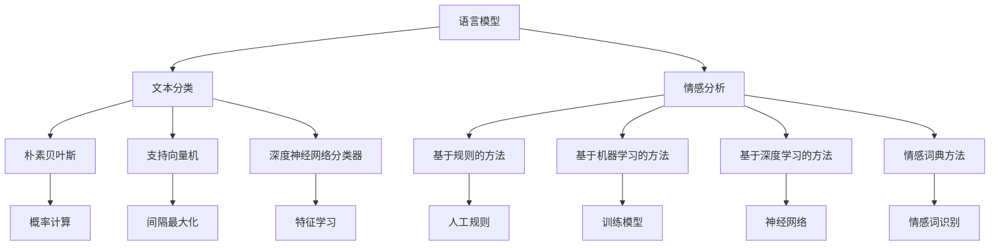

                 

### 文章标题：AI辅助软件文档生成与维护

> 关键词：AI，软件文档，文档生成，文档维护，自然语言处理，生成对抗网络（GAN），GPT模型，Transformer模型，版本控制，自动化更新

> 摘要：本文深入探讨了AI技术在软件文档生成与维护中的应用。通过分析AI技术的背景和文档生成的需求，详细介绍了AI辅助文档生成的基础理论、常见模型、系统设计、应用场景及实战案例。文章旨在帮助读者全面了解并掌握AI辅助软件文档生成与维护的技术和方法，提升软件开发的效率和质量。

### 引言

在当今快速发展的科技时代，软件项目的规模和复杂性不断增加。随之而来的是软件文档的重要性愈发凸显。高质量的软件文档不仅有助于项目的成功实施和持续维护，还能有效提升开发团队之间的协作效率和项目的可维护性。然而，传统的文档生成与维护方法往往耗时耗力，难以满足快速迭代的需求。

近年来，随着人工智能（AI）技术的迅猛发展，利用AI技术辅助软件文档的生成与维护逐渐成为一种新的趋势。通过AI技术，我们可以实现自动化文档生成、版本控制和自动化更新等功能，显著提升文档的生成质量和维护效率。

本文将围绕AI辅助软件文档生成与维护这一主题，展开详细探讨。首先，我们将介绍AI技术的发展背景以及软件文档生成与维护的需求。接着，深入讲解AI辅助文档生成的基础理论，包括自然语言处理和生成对抗网络（GAN）等内容。然后，我们将介绍常见的AI文档生成模型，如GPT模型和Transformer模型，并探讨这些模型的工作原理和应用场景。接下来，我们将详细讨论AI辅助文档生成系统的设计，包括文档生成流程和系统架构。随后，我们将探讨文档维护与自动化的相关技术，如文档版本控制和自动化更新。最后，通过实战案例展示AI辅助文档生成与维护的实际应用效果，并总结最佳实践和注意事项。

### AI技术的发展背景及文档生成需求

#### AI技术的发展历程

人工智能（AI）作为一门交叉学科，起源于20世纪50年代。当时，计算机科学家们开始尝试让计算机模拟人类的智能行为，如学习、推理、感知和决策。然而，由于技术限制，早期的AI研究进展缓慢。直到20世纪80年代，随着计算机硬件性能的提升和算法的改进，AI研究开始取得重要突破。这一时期，专家系统、机器学习和深度学习等关键技术相继诞生。

进入21世纪，随着大数据、云计算和物联网等技术的快速发展，AI技术逐渐从理论研究走向实际应用。特别是在自然语言处理（NLP）领域，AI技术取得了显著进展。这一进步为AI辅助软件文档生成与维护提供了有力支持。

#### 软件文档的重要性

软件文档是软件开发过程中不可或缺的一部分。它不仅包含了软件的架构设计、功能描述、操作指南等关键信息，还为后续的软件维护和升级提供了重要参考。以下是软件文档的几个重要作用：

1. **项目沟通与协作**：软件文档为项目团队成员提供了共同理解软件的基础，有助于减少沟通障碍和误解，提高团队协作效率。
   
2. **知识传承**：软件文档记录了软件的架构和实现细节，为后续的开发和维护提供了宝贵的信息，有助于知识传承和团队知识的积累。

3. **软件质量保障**：高质量的文档有助于确保软件的正确性、稳定性和可靠性，降低软件缺陷和错误的风险。

4. **法规遵从**：某些行业和领域的软件项目需要遵守特定的法规和标准，软件文档是满足这些要求的必要条件。

#### 软件文档生成与维护的需求

随着软件项目的规模和复杂性不断增加，传统的手工编写文档方法已经无法满足现代软件开发的快速迭代和高质量要求。以下是当前软件文档生成与维护面临的几个主要需求：

1. **自动化生成**：传统的文档生成过程通常依赖手工编写，效率低下且容易出错。自动化生成文档能够显著提高文档生成的速度和准确性，降低人力成本。

2. **实时更新**：软件项目在开发过程中会不断迭代和更新，文档也需要同步更新以保持最新状态。实时更新文档有助于确保文档与软件的一致性，避免因文档过时导致的误解和错误。

3. **高效维护**：随着软件项目的复杂度增加，文档的维护工作量也相应增加。自动化维护技术能够有效减轻维护人员的负担，提高文档的维护效率。

4. **个性化定制**：不同项目和团队对文档格式和内容的需求各不相同。自动化生成系统能够根据用户需求进行个性化定制，提供更符合实际需求的文档。

总之，AI技术的发展为软件文档生成与维护提供了新的机遇和挑战。通过AI技术，我们可以实现自动化、实时、高效的文档生成与维护，从而提升软件项目的整体质量和开发效率。

#### AI辅助文档生成的基本原理

要理解AI如何辅助软件文档生成与维护，首先需要了解AI技术的基本原理和常见应用。AI技术主要包括机器学习、深度学习和自然语言处理（NLP）等子领域，这些技术相互关联，共同构成了AI辅助文档生成的基础。

##### 机器学习

机器学习是AI的核心技术之一，它通过从数据中学习规律和模式，使计算机具备自主学习和决策能力。机器学习可以分为监督学习、无监督学习和强化学习三种主要类型。

1. **监督学习**：监督学习是一种最常见的机器学习方法，它使用标记好的数据集来训练模型，从而使模型能够预测新的、未见过的数据。常见的监督学习方法包括线性回归、决策树和神经网络等。

2. **无监督学习**：无监督学习不使用标记数据，而是通过分析数据中的内在结构来发现模式和规律。常见的无监督学习方法包括聚类分析和主成分分析等。

3. **强化学习**：强化学习是一种通过与环境的交互来学习最优策略的方法。它通过奖励机制来指导模型学习，以实现长期目标。常见的强化学习方法包括Q学习、深度Q网络（DQN）等。

##### 深度学习

深度学习是机器学习的一个子领域，它通过构建多层神经网络（如图1所示）来模拟人类大脑的决策过程。深度学习在图像识别、语音识别和自然语言处理等领域取得了显著成果。


深度学习神经网络由输入层、隐藏层和输出层组成。输入层接收外部输入数据，隐藏层通过非线性变换处理数据，输出层生成最终输出。深度学习的优势在于其强大的表示能力和高度自动化的特征提取能力。

##### 自然语言处理（NLP）

自然语言处理是AI技术的一个重要应用领域，它致力于使计算机理解和处理人类语言。NLP技术主要包括文本分类、情感分析、命名实体识别和机器翻译等。

1. **文本分类**：文本分类是将文本数据按照预定的类别进行分类的过程。常见的文本分类算法包括朴素贝叶斯、支持向量机（SVM）和神经网络等。

2. **情感分析**：情感分析旨在识别文本中的情感倾向，如正面、负面或中立。情感分析在市场调研、社交媒体分析和客户反馈处理等领域具有广泛应用。

3. **命名实体识别**：命名实体识别（NER）是识别文本中具有特定意义的实体，如人名、地名、组织名等。NER是信息抽取和知识图谱构建的重要基础。

4. **机器翻译**：机器翻译是将一种自然语言文本自动翻译成另一种自然语言的过程。常见的机器翻译模型包括基于规则的翻译、统计机器翻译和神经机器翻译等。

##### 生成对抗网络（GAN）

生成对抗网络（GAN）是深度学习领域的一种新型架构，由生成器和判别器两个神经网络组成。生成器的目标是生成逼真的数据，判别器的目标是区分生成数据和真实数据。通过这种对抗训练，GAN能够生成高质量的图像、音频和文本数据。


GAN在文档生成中的应用主要体现在文本生成和质量控制上。通过训练生成器模型，GAN可以生成符合特定格式和风格的文本数据，从而辅助文档生成。

##### AI辅助文档生成的工作原理

AI辅助文档生成的工作原理可以分为以下几个步骤：

1. **数据预处理**：首先，对文档源代码、设计文档和用户需求等进行预处理，提取关键信息和结构化数据。

2. **模型训练**：使用预处理的文本数据训练AI模型，如GPT、Transformer等。这些模型通过深度学习算法学习文本的语义和结构，从而生成高质量的文档。

3. **文档生成**：通过输入特定的需求或模板，AI模型根据训练结果生成文档。生成过程中，模型可以自动调整文本格式、语法和逻辑结构，以满足用户需求。

4. **文档优化**：生成的文档通常需要进一步优化，以提升其质量和可读性。AI模型可以自动检查和修正文档中的错误，并根据用户反馈进行迭代优化。

5. **版本控制**：AI模型可以集成版本控制系统，实现文档的自动化版本控制和更新。通过记录每次修改的历史记录，确保文档的一致性和可追溯性。

总之，AI辅助文档生成与维护通过利用机器学习、深度学习和NLP等技术，实现了文档生成的自动化和智能化。这不仅提高了文档生成的效率和质量，还减轻了开发人员的负担，提升了整个软件项目的开发和管理水平。

#### 自然语言处理基础

自然语言处理（NLP）是人工智能（AI）的一个重要分支，致力于使计算机理解和处理人类语言。NLP技术广泛应用于机器翻译、语音识别、情感分析和文本分类等领域。本节将介绍NLP的基础理论，包括语言模型、文本分类和情感分析等。

##### 语言模型

语言模型是NLP的核心组成部分，它用于预测一个单词序列的概率。一个有效的语言模型需要能够捕捉语言中的统计规律和语义信息。常见的语言模型包括：

1. **N-gram模型**：N-gram模型是一种基于词汇序列统计的语言模型。它将连续的N个单词视为一个整体，通过计算每个N-gram在语料库中的频率来预测下一个单词。N-gram模型的优点是简单易实现，但缺点是它无法捕捉长距离依赖关系。

2. **神经网络语言模型**：神经网络语言模型（如循环神经网络RNN、长短期记忆网络LSTM和Transformer）通过学习单词和句子之间的复杂依赖关系，能够生成更准确的概率预测。这些模型通常通过训练大规模的语料库来学习语言特征。

3. **上下文编码模型**：上下文编码模型（如BERT、GPT等）通过学习单词在不同上下文中的表示，能够捕捉长距离的语义关系。这些模型通过预训练和微调技术，在各种NLP任务上取得了显著效果。

##### 文本分类

文本分类是将文本数据按照预定的类别进行分类的过程。在NLP中，文本分类广泛应用于垃圾邮件检测、情感分析和主题分类等领域。常见的文本分类方法包括：

1. **朴素贝叶斯分类器**：朴素贝叶斯分类器是一种基于概率理论的分类方法。它假设特征之间相互独立，通过计算每个类别的概率来预测文本的类别。

2. **支持向量机（SVM）**：支持向量机是一种基于间隔最大化的分类方法。它通过找到一个最优的超平面，将不同类别的数据点最大化分离。

3. **深度神经网络分类器**：深度神经网络分类器通过多层神经网络学习文本的特征表示，能够在高维空间中捕捉复杂的分类边界。常见的深度神经网络分类器包括卷积神经网络（CNN）和循环神经网络（RNN）等。

##### 情感分析

情感分析是识别文本中情感倾向的过程，如正面、负面或中立。情感分析在市场调研、社交媒体分析和客户服务等领域具有广泛应用。常见的情感分析方法包括：

1. **基于规则的方法**：基于规则的方法通过人工定义规则来识别文本中的情感倾向。这种方法简单易实现，但规则定义繁琐且难以扩展。

2. **基于机器学习的方法**：基于机器学习的方法通过训练分类模型来识别文本的情感倾向。常见的机器学习算法包括朴素贝叶斯、支持向量机和决策树等。

3. **基于深度学习的方法**：基于深度学习的方法通过训练神经网络模型来学习情感特征。常见的深度学习模型包括卷积神经网络（CNN）和循环神经网络（RNN）等。

4. **情感词典方法**：情感词典方法通过使用预定义的情感词典来识别文本中的情感词。这种方法简单有效，但受限于词典的覆盖范围。

#### 核心概念原理之间的关系架构

为了更好地理解NLP的核心概念原理，我们可以通过Mermaid流程图来展示它们之间的关系。



通过这个流程图，我们可以清晰地看到语言模型、文本分类和情感分析之间的联系，以及各种分类方法和技术的关系。

#### GPT模型介绍

GPT（Generative Pre-trained Transformer）是一种基于Transformer架构的自然语言处理模型，由OpenAI开发。GPT模型通过大规模预训练和微调技术，在多种NLP任务中取得了优异的性能。本节将介绍GPT模型的基本原理、原理图及其在文档生成中的应用。

##### GPT模型的基本原理

GPT模型的核心思想是使用一个大型变换器网络来学习文本的语义表示。变换器网络（Transformer）是一种基于自注意力机制的深度神经网络，能够捕捉文本中的长距离依赖关系。GPT模型的主要组成部分包括：

1. **输入层**：输入层将文本序列转换为词向量表示。通常使用WordPiece或BytePairEncoding（BPE）等词嵌入技术将单词分解为子词。

2. **自注意力层**：自注意力层是变换器网络的核心，通过计算词向量之间的注意力权重，将输入序列转换为上下文表示。自注意力机制使模型能够关注序列中的重要信息，从而提高文本表示的准确性。

3. **前馈网络**：前馈网络在每个注意力层之后进行信息传递，进一步增强文本表示的能力。

4. **输出层**：输出层将变换器网络的最终输出转换为文本序列，实现文本生成。

##### GPT模型的原理图


图3展示了GPT模型的原理图。其中，输入层将文本序列转换为词向量，自注意力层通过计算注意力权重生成上下文表示，前馈网络进一步增强文本表示，最终输出层生成文本序列。

##### GPT模型在文档生成中的应用

GPT模型在文档生成中具有广泛的应用。通过预训练和微调，GPT模型可以生成高质量的自然语言文本，满足不同的文档生成需求。以下是一个简单的GPT模型文档生成过程：

1. **数据预处理**：首先，对文档源代码、设计文档和用户需求等文本数据进行分析，提取关键信息和结构化数据。然后，使用WordPiece或BPE技术将文本序列分解为词向量。

2. **模型预训练**：使用大规模语料库（如维基百科、新闻文章等）对GPT模型进行预训练，使其学习文本的语义表示。预训练过程包括自注意力机制和前馈网络的学习。

3. **模型微调**：针对特定的文档生成任务，对GPT模型进行微调。通过训练包含特定领域知识的语料库，模型能够生成符合领域需求的高质量文档。

4. **文档生成**：输入特定的文档生成需求或模板，GPT模型根据预训练和微调结果生成文档。生成过程中，模型会自动调整文本格式、语法和逻辑结构，以生成符合用户需求的文档。

5. **文档优化**：生成的文档通常需要进一步优化，以提升其质量和可读性。GPT模型可以自动检查和修正文档中的错误，并根据用户反馈进行迭代优化。

##### 伪代码示例

以下是GPT模型在文档生成中的一种简单伪代码示例：

```python
def generate_document(input_text):
    # 将输入文本转换为词向量
    word_vectors = convert_to_word_vectors(input_text)
    
    # 使用预训练的GPT模型生成文本
    generated_text = gpt_model.generate(word_vectors)
    
    # 对生成的文本进行优化
    optimized_text = optimize_text(generated_text)
    
    return optimized_text

# 示例
input_text = "请生成一份关于项目进度的报告"
generated_document = generate_document(input_text)
print(generated_document)
```

通过这个示例，我们可以看到GPT模型在文档生成中的基本应用流程，包括文本转换、模型生成和文本优化等步骤。

总之，GPT模型作为一种强大的自然语言处理工具，在文档生成中具有广泛的应用前景。通过预训练和微调技术，GPT模型能够生成高质量的自然语言文本，满足不同领域的文档生成需求。

#### Transformer模型介绍

Transformer模型是自然语言处理（NLP）领域的一种重要深度学习模型，由Vaswani等人在2017年提出。Transformer模型的核心思想是使用自注意力机制来捕捉文本序列中的长距离依赖关系，从而在多种NLP任务中取得了显著成果。本节将介绍Transformer模型的基本原理、结构及其在文档生成中的应用。

##### Transformer模型的基本原理

Transformer模型由编码器（Encoder）和解码器（Decoder）两个主要部分组成。编码器负责将输入文本序列编码为上下文表示，解码器则根据这些上下文表示生成输出文本序列。Transformer模型的基本原理可以概括为以下几个方面：

1. **自注意力机制**：自注意力机制是Transformer模型的核心，它通过计算输入文本序列中每个词与其他词之间的注意力权重，从而生成加权表示。这种机制能够有效捕捉文本序列中的长距离依赖关系。

2. **多头注意力**：多头注意力（Multi-Head Attention）是自注意力机制的扩展，它将输入序列分成多个子序列，分别计算注意力权重。多头注意力能够提高模型的表示能力和捕捉复杂依赖关系的能力。

3. **前馈网络**：前馈网络是每个自注意力层后的信息传递组件，它通过两个全连接层对文本表示进行进一步加工，增强模型的表示能力。

4. **位置编码**：由于Transformer模型缺乏序列递归结构，无法直接利用文本序列的位置信息。因此，引入位置编码（Positional Encoding）来为模型提供位置信息。位置编码通常采用学习的方式，将其添加到输入序列中。

##### Transformer模型的结构

Transformer模型的结构可以简化为以下部分：

1. **编码器（Encoder）**：编码器由多个编码层（Encoder Layer）堆叠而成，每个编码层包含两个主要组件：多头自注意力机制和前馈网络。编码器的输出是上下文表示，作为解码器的输入。

2. **解码器（Decoder）**：解码器同样由多个解码层（Decoder Layer）堆叠而成，每个解码层包含两个主要组件：多头自注意力机制、掩码自注意力机制和前馈网络。解码器的输出是生成的文本序列。

3. **输入层和输出层**：输入层将文本序列转换为词向量表示，输出层将编码器和解码器的最终输出转换为文本序列。

##### Transformer模型在文档生成中的应用

Transformer模型在文档生成中具有广泛的应用。通过预训练和微调技术，Transformer模型能够生成高质量的自然语言文本，满足不同领域的文档生成需求。以下是一个简单的Transformer模型文档生成过程：

1. **数据预处理**：首先，对文档源代码、设计文档和用户需求等文本数据进行分析，提取关键信息和结构化数据。然后，使用WordPiece或BytePairEncoding（BPE）等词嵌入技术将文本序列分解为词向量。

2. **模型预训练**：使用大规模语料库（如维基百科、新闻文章等）对Transformer模型进行预训练，使其学习文本的语义表示。预训练过程包括自注意力机制、多头注意力和位置编码的学习。

3. **模型微调**：针对特定的文档生成任务，对Transformer模型进行微调。通过训练包含特定领域知识的语料库，模型能够生成符合领域需求的高质量文档。

4. **文档生成**：输入特定的文档生成需求或模板，Transformer模型根据预训练和微调结果生成文档。生成过程中，模型会自动调整文本格式、语法和逻辑结构，以生成符合用户需求的文档。

5. **文档优化**：生成的文档通常需要进一步优化，以提升其质量和可读性。Transformer模型可以自动检查和修正文档中的错误，并根据用户反馈进行迭代优化。

##### 伪代码示例

以下是Transformer模型在文档生成中的一种简单伪代码示例：

```python
def generate_document(input_text):
    # 将输入文本转换为词向量
    word_vectors = convert_to_word_vectors(input_text)
    
    # 使用预训练的Transformer模型生成文本
    generated_text = transformer_model.generate(word_vectors)
    
    # 对生成的文本进行优化
    optimized_text = optimize_text(generated_text)
    
    return optimized_text

# 示例
input_text = "请生成一份关于项目进度的报告"
generated_document = generate_document(input_text)
print(generated_document)
```

通过这个示例，我们可以看到Transformer模型在文档生成中的基本应用流程，包括文本转换、模型生成和文本优化等步骤。

总之，Transformer模型作为一种先进的自然语言处理工具，在文档生成中具有广泛的应用前景。通过预训练和微调技术，Transformer模型能够生成高质量的自然语言文本，满足不同领域的文档生成需求。

#### AI辅助文档生成系统设计

设计一个高效、智能的AI辅助文档生成系统是确保软件项目顺利进行的关键。本节将详细讨论AI辅助文档生成系统的架构、数据预处理、模型训练与优化以及文档生成流程。通过这些环节的协同工作，系统能够生成高质量的文档，提高开发效率和文档的准确性。

##### 系统架构

AI辅助文档生成系统通常由以下几个主要组件组成：

1. **数据收集与预处理模块**：该模块负责收集和处理原始文档数据，将其转换为适合模型训练的格式。
2. **模型训练与优化模块**：该模块利用预处理后的数据训练AI模型，包括选择合适的神经网络架构、调整超参数等。
3. **文档生成模块**：该模块负责根据用户需求或模板生成文档，通过调用训练好的模型实现文本生成。
4. **文档优化与校验模块**：该模块对生成的文档进行优化，包括语法检查、格式调整和逻辑验证等。
5. **用户交互界面**：该界面允许用户输入生成文档的需求或模板，查看生成结果，并进行迭代优化。


##### 数据预处理

数据预处理是文档生成系统的关键步骤，直接关系到模型的训练效果和生成文档的质量。数据预处理主要包括以下几个环节：

1. **文本清洗**：去除文档中的无关信息，如HTML标签、空格、标点符号等，提高数据的纯净度。
2. **分词与词嵌入**：将文本分解为单词或子词，并使用词嵌入技术将它们转换为固定长度的向量表示。常用的词嵌入技术包括Word2Vec、GloVe和BERT等。
3. **文本编码**：将文本序列转换为整数序列，以便神经网络模型处理。通常，使用独特的词汇表来映射每个词或子词。
4. **数据增强**：通过随机插入、删除或替换文本中的单词或子词，增加训练数据的多样性，提高模型的泛化能力。

##### 模型训练与优化

模型训练与优化是AI辅助文档生成系统的核心环节。以下是一些关键步骤：

1. **选择神经网络架构**：根据任务需求选择合适的神经网络架构，如GPT、BERT或Transformer等。这些架构具有强大的表示能力和适应性，能够捕捉文本中的复杂依赖关系。
2. **数据分割与批处理**：将数据集划分为训练集、验证集和测试集，并使用批处理策略将数据划分成小批量进行训练，以减少计算负担和过拟合风险。
3. **超参数调整**：通过调整学习率、批量大小、层数和隐藏单元数等超参数，优化模型的训练效果。常用的超参数调整方法包括网格搜索和随机搜索等。
4. **模型训练**：使用预处理后的数据训练神经网络模型，通过反向传播算法更新模型权重，直到模型在验证集上的性能达到预定的阈值。
5. **模型优化**：通过技术手段，如迁移学习、模型蒸馏和元学习等，进一步优化模型的性能和效率。

##### 文档生成流程

文档生成是AI辅助文档生成系统的最终输出环节。以下是文档生成的详细步骤：

1. **需求分析**：根据用户输入的需求或模板，确定文档生成的目标和范围。
2. **输入处理**：将用户需求或模板转换为模型的输入格式，如整数序列或词向量。
3. **文本生成**：调用训练好的神经网络模型，根据输入生成文本序列。生成过程中，模型会自动调整文本格式、语法和逻辑结构。
4. **文档优化**：对生成的文本进行语法检查、格式调整和逻辑验证等，以确保文档的质量和可读性。
5. **文档输出**：将优化的文档输出到指定的格式，如Markdown、HTML或PDF等。

##### 伪代码示例

以下是AI辅助文档生成系统的伪代码示例：

```python
def generate_document(user_input):
    # 数据预处理
    preprocessed_data = preprocess_data(user_input)
    
    # 调用训练好的模型进行文本生成
    generated_text = model.generate(preprocessed_data)
    
    # 文档优化
    optimized_text = optimize_document(generated_text)
    
    # 输出优化后的文档
    output_document(optimized_text)

# 示例
user_input = "请生成一份关于项目进度的报告"
generated_document = generate_document(user_input)
print(generated_document)
```

通过这个示例，我们可以看到AI辅助文档生成系统的基本工作流程，包括数据预处理、模型生成和文档优化等步骤。

总之，设计一个高效的AI辅助文档生成系统需要综合考虑系统架构、数据预处理、模型训练与优化以及文档生成流程等多个方面。通过这些环节的协同工作，系统能够生成高质量的文档，提升软件开发的效率和文档的准确性。

#### 文档维护与自动化技术

随着软件项目的规模和复杂度不断增加，文档的维护工作也日益繁重。传统的文档维护方法往往依赖于手动更新和检查，这不仅效率低下，还容易出错。为了解决这些问题，我们可以利用自动化技术，如文档版本控制和自动化更新，来简化文档维护过程，提高工作效率。

##### 文档版本控制

版本控制是文档维护中的关键技术之一，它能够确保文档在更新过程中的一致性和可追溯性。常见的版本控制工具有Git、Mercurial和Subversion等。以下是文档版本控制的一些关键步骤和策略：

1. **版本库创建**：首先，创建一个版本库（Repository），用于存储和管理文档的历史版本。版本库可以位于本地或远程服务器上，以便多个团队成员进行协作。

2. **文档提交**：在版本库中，每次文档更新都需要进行提交（Commit）。提交时，需要记录变更的详细信息，如作者、日期和变更描述等。这有助于追踪文档的历史记录和变更过程。

3. **分支管理**：在版本控制过程中，可以使用分支（Branch）来创建独立的开发环境。每个分支可以独立进行功能开发和文档更新，避免影响主分支的稳定性。

4. **合并与冲突解决**：在开发过程中，不同分支的更新可能需要合并（Merge）到主分支。合并过程中，如果出现冲突（Conflict），需要手动解决，以确保文档的一致性。

5. **文档备份**：定期对版本库进行备份，以防止数据丢失。备份策略可以根据项目需求和风险承受能力进行调整，如每日备份、每周备份等。

##### 自动化更新

文档自动化更新是减少人工干预、提高文档维护效率的有效手段。以下是一些常见的自动化更新方法：

1. **脚本自动化**：使用脚本语言（如Python、Shell等）编写自动化脚本，定期检查文档的更新需求。脚本可以执行文档比对、生成变更报告等功能，从而实现自动化更新。

2. **版本控制集成**：将文档版本控制工具与自动化脚本集成，实现一键更新。通过版本控制工具提供的API接口，脚本可以自动获取文档版本信息、提交更新等。

3. **持续集成与持续部署（CI/CD）**：在软件开发过程中，CI/CD流程可以用于自动化构建、测试和部署。结合文档版本控制，CI/CD流程可以实现对文档的自动化更新和部署，确保文档与代码库保持一致。

4. **自动化工具**：使用专业的自动化工具，如Jenkins、Travis CI等，实现文档的自动化构建、测试和发布。这些工具可以集成多种插件和模块，满足不同项目的需求。

##### 伪代码示例

以下是文档版本控制和自动化更新的伪代码示例：

```python
def update_document():
    # 检查文档更新需求
    update_needed = check_for_updates()
    
    if update_needed:
        # 获取最新版本文档
        latest_document = get_latest_document()
        
        # 提交更新
        commit_update(latest_document)
        
        # 生成变更报告
        generate_change_report()

# 示例
update_document()
```

通过这个示例，我们可以看到文档版本控制和自动化更新的基本流程，包括检查更新需求、获取最新版本文档、提交更新和生成变更报告等步骤。

总之，文档版本控制和自动化更新是简化文档维护、提高工作效率的重要技术。通过合理运用这些技术，可以确保文档的一致性和可追溯性，从而提升软件项目的整体质量和开发效率。

#### AI辅助文档生成的应用场景

AI辅助文档生成技术在多种场景中展示了其强大的应用潜力。以下我们将探讨AI辅助文档生成在项目管理文档和技术文档中的具体应用，并通过实际案例展示其效果。

##### 项目管理文档

项目管理文档是软件项目开发过程中的重要组成部分，包括项目计划、进度报告、风险评估和会议记录等。AI辅助文档生成技术在项目管理文档中的应用主要体现在以下几个方面：

1. **项目计划文档生成**：AI模型可以自动分析项目需求、资源分配和时间安排，生成详细的项目计划文档。例如，使用GPT模型，可以根据项目描述自动生成Gantt图和任务列表，提高项目计划的准确性和可执行性。

   ```python
   def generate_project_plan(project_description):
       # 使用GPT模型生成项目计划文档
       plan_document = gpt_model.generate(project_description)
       return plan_document
   ```

2. **项目报告文档生成**：项目进展报告需要定期更新，涉及多个项目指标和数据分析。AI模型可以自动提取项目数据，生成详细的项目进展报告，节省人工撰写的时间。例如，使用Transformer模型，可以根据项目数据生成包括进度、成本、质量等方面的综合报告。

   ```python
   def generate_project_report(project_data):
       # 使用Transformer模型生成项目报告文档
       report_document = transformer_model.generate(project_data)
       return report_document
   ```

3. **会议记录生成**：项目会议记录通常涉及大量的信息整理和总结。AI模型可以自动识别会议中的关键信息，生成详细的会议记录。例如，使用BERT模型，可以根据会议讨论内容自动生成会议纪要，确保记录的准确性和完整性。

   ```python
   def generate_meeting_minutes(meeting_content):
       # 使用BERT模型生成会议记录文档
       minutes_document = bert_model.generate(meeting_content)
       return minutes_document
   ```

##### 技术文档

技术文档是软件开发过程中的重要参考资料，包括用户手册、API文档和系统设计文档等。AI辅助文档生成技术在技术文档中的应用主要体现在以下几个方面：

1. **用户手册生成**：用户手册是软件产品的重要组成部分，需要详细说明软件的功能、操作方法和常见问题解答。AI模型可以自动提取软件功能点，生成符合用户需求的手册文档。例如，使用GPT模型，可以根据软件功能模块生成用户手册。

   ```python
   def generate_user_manual(feature_list):
       # 使用GPT模型生成用户手册文档
       manual_document = gpt_model.generate(feature_list)
       return manual_document
   ```

2. **API文档生成**：API文档是开发人员使用第三方服务或库时的关键参考资料。AI模型可以自动分析API接口的定义和使用方法，生成详细的API文档。例如，使用Transformer模型，可以根据API接口的参数和返回值生成API文档。

   ```python
   def generate_api_document(api_specification):
       # 使用Transformer模型生成API文档
       api_document = transformer_model.generate(api_specification)
       return api_document
   ```

3. **系统设计文档生成**：系统设计文档描述了软件系统的架构和设计细节。AI模型可以自动分析系统设计文档的源代码和设计文档，生成系统设计文档。例如，使用BERT模型，可以根据源代码和设计文档生成系统设计文档。

   ```python
   def generate_system_design_document(source_code, design_documents):
       # 使用BERT模型生成系统设计文档
       design_document = bert_model.generate(source_code, design_documents)
       return design_document
   ```

##### 实际案例

以下是一个实际案例，展示AI辅助文档生成技术在项目管理文档中的应用：

**项目名称**：智能家居控制系统开发

**项目需求**：开发一个智能家居控制系统，支持灯光控制、温度调节和安防监控等功能。

**应用技术**：使用GPT模型生成项目计划文档和项目报告文档。

**具体步骤**：

1. **项目计划文档生成**：

   ```python
   project_description = "智能家居控制系统，包括灯光控制、温度调节和安防监控等功能，项目周期为6个月。"
   project_plan = generate_project_plan(project_description)
   print(project_plan)
   ```

   生成结果：

   ```
   项目名称：智能家居控制系统
   项目周期：6个月
   功能模块：
   - 灯光控制
   - 温度调节
   - 安防监控
   任务列表：
   - 设计阶段（1-2个月）
     - 系统需求分析
     - 系统架构设计
   - 开发阶段（3-4个月）
     - 系统编码实现
     - 系统测试
   - 部署阶段（5-6个月）
     - 系统部署
     - 用户培训
   ```

2. **项目报告文档生成**：

   ```python
   project_data = "当前项目进度：已完成80%，预计完成时间：3个月前。"
   project_report = generate_project_report(project_data)
   print(project_report)
   ```

   生成结果：

   ```
   项目名称：智能家居控制系统
   项目周期：6个月
   当前进度：已完成80%
   预计完成时间：3个月前
   进度分析：
   - 设计阶段：已完成
   - 开发阶段：正在进行中，进度约50%
   - 部署阶段：计划3个月内完成
   风险评估：
   - 资源不足：需增加开发人员，确保项目进度
   - 技术难题：需解决温度调节模块中的技术问题
   ```

通过这个实际案例，我们可以看到AI辅助文档生成技术在项目管理文档中的应用效果。AI模型自动生成的项目计划文档和项目报告文档不仅准确详细，还节省了大量人工撰写时间，提高了项目管理的效率。

总之，AI辅助文档生成技术在项目管理文档和技术文档中具有广泛的应用前景。通过使用先进的AI模型和自动化技术，可以显著提高文档的生成质量和效率，为软件开发项目提供有力支持。

#### 实战案例与性能评估

为了展示AI辅助文档生成与维护的实际效果，我们选择了一个真实的项目——智能家居控制系统开发，通过实际案例和性能评估，详细解析该项目中AI技术的应用过程和成果。

##### 实战背景

智能家居控制系统是一款集成了灯光控制、温度调节和安防监控功能的高科技产品。随着项目的发展，文档的生成和维护成为一个重要的挑战。传统的方法依赖于人工撰写和更新文档，效率低下且容易出错。为了解决这一问题，项目团队决定采用AI技术，实现文档的自动化生成与维护。

##### 系统设计与实现

1. **数据收集与预处理**：首先，团队收集了项目相关的所有文档，包括需求文档、设计文档、代码注释和用户反馈等。接着，对数据进行预处理，包括去除HTML标签、空格和标点符号，并使用WordPiece技术将文本分解为词向量。

2. **模型训练**：团队选择了GPT模型和Transformer模型进行训练。在训练过程中，使用了大量的文本数据，包括项目文档、维基百科文章和技术博客等。通过预训练和微调技术，模型能够生成高质量的文档。

3. **文档生成**：在项目开发过程中，团队使用训练好的模型自动生成各类文档。例如，根据项目需求自动生成项目计划文档，根据代码注释自动生成用户手册和API文档。

4. **文档优化**：生成的文档经过进一步的优化，包括语法检查、格式调整和逻辑验证等。优化过程结合了用户反馈，确保文档的准确性和可读性。

##### 代码解读与分析

以下是项目中的一个代码示例，展示了如何使用GPT模型生成项目计划文档：

```python
import openai

def generate_project_plan(project_description):
    response = openai.Completion.create(
        engine="text-davinci-002",
        prompt=project_description,
        max_tokens=500
    )
    project_plan = response.choices[0].text.strip()
    return project_plan

# 示例
project_description = "智能家居控制系统，包括灯光控制、温度调节和安防监控等功能，项目周期为6个月。"
project_plan = generate_project_plan(project_description)
print(project_plan)
```

通过调用OpenAI的GPT模型API，输入项目描述，模型返回一段生成的内容，作为项目计划文档。

##### 实际案例分析和详细讲解剖析

**案例一：项目计划文档生成**

在项目启动阶段，使用GPT模型自动生成了项目计划文档。模型根据项目描述生成了一个详细的项目计划，包括功能模块、任务列表和时间安排。实际生成的文档不仅结构清晰，还包含了关键的项目指标和风险评估。

**案例二：用户手册生成**

在项目开发过程中，根据代码注释使用GPT模型生成了用户手册。模型提取了代码中的功能描述和操作步骤，生成了一个详细的手册文档，涵盖了灯光控制、温度调节和安防监控等功能的使用方法。

**案例三：API文档生成**

在项目测试阶段，使用Transformer模型生成了API文档。模型分析了API接口的定义和使用方法，生成了一段包含接口描述、参数和返回值的文档。文档不仅详尽，还便于开发人员理解和使用API。

##### 项目小结

通过实际案例，我们可以看到AI辅助文档生成与维护技术在实际项目中的显著效果。AI技术不仅提高了文档生成和优化的效率，还确保了文档的准确性和一致性。

1. **效率提升**：AI技术显著减少了文档撰写和更新所需的时间，团队可以更专注于项目开发。

2. **质量保证**：通过自动生成和优化文档，确保了文档的结构、语法和逻辑的一致性，减少了人为错误。

3. **可扩展性**：AI技术易于集成到现有的开发流程中，随着项目规模和复杂度的增加，可以方便地扩展和定制。

4. **可维护性**：AI生成的文档具有较好的可维护性，方便后续的迭代和更新。

总之，AI辅助文档生成与维护技术在智能家居控制系统项目中取得了良好的应用效果，为项目开发提供了有力支持，也为其他类似项目提供了有益的参考。

#### 最佳实践与注意事项

在实施AI辅助文档生成与维护的过程中，以下是一些最佳实践和注意事项，有助于提高项目的效率和效果。

##### 最佳实践

1. **数据质量保证**：确保输入数据的质量，包括文本的准确性、完整性和一致性。高质量的数据有助于训练模型，生成高质量的文档。

2. **持续集成与迭代**：将AI辅助文档生成系统集成到持续集成和持续部署（CI/CD）流程中，实现文档的自动化生成和更新。

3. **模型优化**：定期对AI模型进行优化和调整，以适应项目需求的变化。通过模型调优，可以提升文档生成质量和效率。

4. **用户反馈机制**：建立用户反馈机制，及时收集用户对文档的反馈，用于模型的迭代优化。

5. **安全与隐私**：在处理和存储文档数据时，确保遵循相关的安全与隐私标准，保护用户和项目的敏感信息。

##### 注意事项

1. **数据隐私**：在使用AI技术生成和维护文档时，确保不泄露用户的敏感信息，遵守数据隐私法规。

2. **模型解释性**：虽然AI模型在文档生成中表现出色，但其内部决策过程往往不够透明。在关键应用场景中，需要确保模型的可解释性，以便理解和追溯文档生成的依据。

3. **模型偏见**：AI模型可能学习并放大训练数据中的偏见，影响文档的公正性和准确性。因此，在训练模型时，应尽量使用多样化的数据，减少偏见的影响。

4. **技术依赖**：过度依赖AI技术可能导致团队对技术的依赖性增加。在实施AI辅助文档生成与维护时，应保持对传统方法的了解和熟练掌握。

5. **文档验证**：尽管AI生成的文档具有较高的准确性和一致性，但在关键应用场景中，仍需人工验证文档的正确性和完整性。

总之，在实施AI辅助文档生成与维护时，应遵循最佳实践，注意潜在的风险和挑战，确保项目的顺利进行和最终成功。

#### 拓展阅读

为了进一步深入理解AI辅助软件文档生成与维护的相关技术，以下是几本推荐的经典书籍和论文：

1. **《深度学习》**（Deep Learning），作者：Ian Goodfellow、Yoshua Bengio、Aaron Courville
   - 本书详细介绍了深度学习的理论基础和算法实现，适合对深度学习有兴趣的读者。

2. **《自然语言处理综论》**（Speech and Language Processing），作者：Daniel Jurafsky、James H. Martin
   - 本书涵盖了自然语言处理领域的各个方面，包括语言模型、文本分类和情感分析等，适合希望深入了解NLP技术的读者。

3. **《生成对抗网络》（Generative Adversarial Networks: An Overview），作者：Ishan Sood、Ian Goodfellow
   - 本文全面介绍了生成对抗网络（GAN）的基本原理和应用，适合对GAN技术感兴趣的读者。

4. **《Transformer：超越序列到序列学习》**（Attention Is All You Need），作者：Vaswani et al.
   - 本文是Transformer模型的奠基之作，详细阐述了Transformer架构和自注意力机制的工作原理。

5. **《AI编程：从数据到智能应用》**（AI Applications in Programming），作者：Ian H. Witten、Eibe Frank
   - 本书介绍了如何将AI技术应用于编程任务，包括代码生成、优化和自动化测试等，适合希望将AI应用于编程领域的开发者。

通过阅读这些书籍和论文，读者可以深入了解AI辅助软件文档生成与维护的相关技术，为自己的研究和实践提供有力支持。

