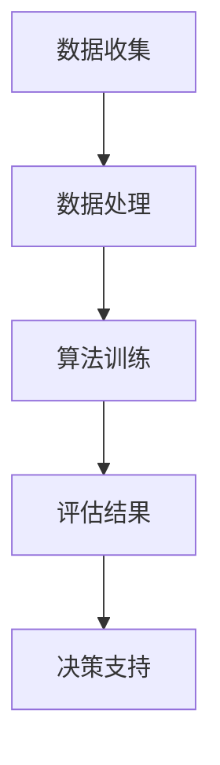

                 


### 背景介绍

在当今数字化时代，软件架构在系统的开发过程中起着至关重要的作用。软件架构不仅决定了系统的性能、可扩展性和可维护性，还直接影响到开发成本和项目进度。传统的软件架构设计主要依赖于开发者个人的经验和技术水平，这使得软件架构评估和优化工作具有很大的主观性和不确定性。随着人工智能（AI）技术的飞速发展，人们开始探索将AI技术应用于软件架构评估与决策，以期提高评估的准确性、效率和智能化水平。

AI辅助软件架构评估与决策的核心思想是利用机器学习、深度学习和强化学习等AI算法，从大量历史数据和当前数据中自动提取有价值的信息，对软件架构进行评估和优化。通过这种智能化方式，开发者可以更加客观、高效地评估软件架构的各个方面，从而做出更明智的决策。本文将深入探讨AI辅助软件架构评估与决策的关键概念、算法原理、数学模型及其实际应用，以期为相关领域的研究者和开发者提供有益的参考。

### 核心概念与联系

首先，我们需要了解几个核心概念及其之间的联系，这将为后续的算法原理讲解和数学模型分析奠定基础。

#### 1. 软件架构

软件架构是软件系统的结构基础，包括系统的各个组件及其相互关系。一个良好的软件架构应具备模块化、可扩展性和高内聚性等特点。软件架构通常由多个层次组成，如表示层、业务逻辑层和数据层。每个层次有不同的功能，并与其他层次通过定义良好的接口进行通信。

#### 2. 评估

评估是对软件架构的性能、质量、可靠性等方面的评价。评估过程通常涉及功能测试、性能测试、安全性测试等多个方面。评估结果为软件开发过程中的决策提供重要依据。

#### 3. AI

人工智能是一种模拟人类智能的技术，包括机器学习、深度学习、自然语言处理等子领域。AI技术可以通过数据分析、模式识别和预测建模等方式，辅助软件架构的评估和优化。

#### 4. 联系

AI与软件架构之间的联系主要体现在以下几个方面：

- **数据收集与处理**：AI技术需要大量数据来训练模型。在软件架构评估中，这些数据可以来源于历史项目、测试结果、用户反馈等。AI技术通过对这些数据进行处理和分析，提取有价值的信息。

- **算法应用**：AI技术，如机器学习算法，可以用于评估软件架构的性能和可靠性。这些算法可以根据历史数据和当前数据，自动识别系统中的潜在问题和瓶颈。

- **决策支持**：AI技术可以帮助开发者做出更明智的决策。例如，通过分析不同架构设计方案的效果，AI可以推荐最优的方案。

下面是一个简单的Mermaid流程图，展示了软件架构评估与AI技术之间的联系：



### 核心算法原理讲解

在了解核心概念后，我们将深入探讨AI辅助软件架构评估与决策的核心算法原理。本文将重点介绍机器学习、深度学习和强化学习等算法，并使用伪代码详细阐述其基本流程。

#### 1. 机器学习

机器学习是一种通过数据学习规律，进行预测和分类的技术。在软件架构评估中，机器学习算法可用于识别性能问题和预测系统行为。

**伪代码**：

```
function machine_learning(data, labels):
    # 数据预处理
    preprocess_data(data)
    
    # 划分训练集和测试集
    train_data, test_data, train_labels, test_labels = train_test_split(data, labels)
    
    # 训练模型
    model = train_model(train_data, train_labels)
    
    # 评估模型
    evaluate_model(model, test_data, test_labels)
    
    return model
```

#### 2. 深度学习

深度学习是机器学习的一个子领域，通过多层神经网络进行学习和预测。在软件架构评估中，深度学习算法可用于复杂特征的提取和模式识别。

**伪代码**：

```
function deep_learning(data, labels):
    # 数据预处理
    preprocess_data(data)
    
    # 构建神经网络
    network = build_network([layer1, layer2, ..., layerN])
    
    # 训练神经网络
    train_network(network, data, labels)
    
    # 评估神经网络
    evaluate_network(network, data, labels)
    
    return network
```

#### 3. 强化学习

强化学习是一种通过试错和反馈进行学习的技术。在软件架构优化中，强化学习算法可用于找到最优的架构设计方案。

**伪代码**：

```
function reinforcement_learning(state, action, reward):
    # 初始化状态和动作
    current_state = state
    current_action = action
    
    # 进行动作
    execute_action(current_action)
    
    # 获取反馈
    reward = get_reward()
    
    # 更新状态
    current_state = update_state(current_state)
    
    return current_state, current_action, reward
```

### 数学模型和数学公式

在AI辅助软件架构评估与决策中，数学模型和公式扮演着重要的角色。以下将介绍几个常用的数学模型和公式，并给出详细的讲解和示例。

#### 1. 评价函数

评价函数是对软件架构性能进行定量评估的数学模型。一个常用的评价函数是均方误差（MSE），用于评估预测值与真实值之间的差距。

**公式**：

$$
MSE = \frac{1}{n}\sum_{i=1}^{n}(y_i - \hat{y}_i)^2
$$

其中，$y_i$ 是真实值，$\hat{y}_i$ 是预测值，$n$ 是样本数量。

**示例**：

假设我们有一个测试数据集，包含10个样本，每个样本的真实值和预测值如下：

$$
\begin{aligned}
y_1 &= 5, & \hat{y}_1 &= 4 \\
y_2 &= 10, & \hat{y}_2 &= 11 \\
y_3 &= 3, & \hat{y}_3 &= 2 \\
&\vdots & &\vdots \\
y_{10} &= 8, & \hat{y}_{10} &= 7 \\
\end{aligned}
$$

则均方误差为：

$$
MSE = \frac{1}{10}\sum_{i=1}^{10}(y_i - \hat{y}_i)^2 = \frac{1}{10}[(5-4)^2 + (10-11)^2 + (3-2)^2 + \ldots + (8-7)^2] = 0.5
$$

#### 2. 优化目标

在软件架构优化中，通常使用优化目标来衡量架构设计的优劣。一个常用的优化目标是最小化架构成本。

**公式**：

$$
\min_{A} C(A)
$$

其中，$C(A)$ 是架构成本函数，$A$ 是架构设计方案。

**示例**：

假设我们有两个架构设计方案 $A_1$ 和 $A_2$，其成本函数如下：

$$
\begin{aligned}
C(A_1) &= 1000 \\
C(A_2) &= 1500 \\
\end{aligned}
$$

则最优架构设计方案为 $A_1$，因为其成本更低。

### 项目实战

在本节中，我们将通过一个实际项目，展示如何使用AI技术进行软件架构评估与决策。该项目分为以下几个步骤：

#### 1. 开发环境搭建

首先，我们需要搭建一个开发环境，包括Python编程语言、TensorFlow深度学习框架和Scikit-learn机器学习库。

```
pip install tensorflow scikit-learn
```

#### 2. 源代码实现

以下是一个简单的Python代码示例，用于演示如何使用机器学习算法评估软件架构性能。

```python
import tensorflow as tf
from sklearn.model_selection import train_test_split
from sklearn.metrics import mean_squared_error

# 生成模拟数据集
X, y = generate_data()

# 划分训练集和测试集
X_train, X_test, y_train, y_test = train_test_split(X, y, test_size=0.2)

# 训练模型
model = tf.keras.Sequential([
    tf.keras.layers.Dense(units=1, input_shape=[1])
])

model.compile(optimizer='sgd', loss='mean_squared_error')
model.fit(X_train, y_train, epochs=100)

# 评估模型
y_pred = model.predict(X_test)
mse = mean_squared_error(y_test, y_pred)
print("MSE:", mse)
```

#### 3. 代码解读

上述代码首先导入了TensorFlow和Scikit-learn库，然后生成了一个模拟数据集。接着，使用TensorFlow构建了一个简单的神经网络模型，并使用Scikit-learn进行模型训练和评估。

#### 4. 代码应用解读与分析

在实际应用中，我们可以将上述代码集成到一个自动化软件架构评估系统中。系统可以定期收集软件架构的性能数据，并使用机器学习模型进行评估。评估结果可以作为开发者进行架构优化的依据。

#### 5. 实际案例分析和详细讲解剖析

以下是一个实际案例，展示了如何使用AI技术对软件架构进行评估和优化。

**案例**：一个电商平台希望优化其订单处理系统的架构。

**分析**：

1. 数据收集：收集订单处理系统的性能数据，包括响应时间、并发处理能力和系统负载等。
2. 数据处理：对收集到的数据进行预处理，包括数据清洗、归一化和特征提取等。
3. 模型训练：使用机器学习算法（如深度学习）训练模型，提取性能特征，建立性能预测模型。
4. 模型评估：使用测试数据集评估模型的预测性能，调整模型参数以优化预测效果。
5. 架构优化：根据模型预测结果，对订单处理系统进行架构优化，如增加负载均衡、优化数据库查询等。
6. 实时反馈：系统运行过程中，持续收集性能数据，并根据模型预测结果进行实时调整。

**讲解剖析**：

1. **数据收集**：订单处理系统的性能数据是模型训练的基础。数据收集的过程需要考虑数据的完整性和准确性。
2. **数据处理**：数据预处理是提高模型性能的关键。通过对数据进行清洗、归一化和特征提取，可以去除噪声，提高模型的泛化能力。
3. **模型训练**：使用深度学习算法训练模型，提取性能特征，建立性能预测模型。这里需要关注模型的复杂度和计算效率。
4. **模型评估**：使用测试数据集评估模型的预测性能，调整模型参数以优化预测效果。这里需要关注模型的准确性和稳定性。
5. **架构优化**：根据模型预测结果，对订单处理系统进行架构优化。这里需要关注优化的方向和实施策略。
6. **实时反馈**：系统运行过程中，持续收集性能数据，并根据模型预测结果进行实时调整。这里需要关注系统的实时性和适应性。

#### 6. 项目小结

通过上述案例，我们可以看到AI技术在软件架构评估与决策中的应用具有重要意义。通过自动化和智能化的方式，AI技术可以帮助开发者更高效地进行架构评估和优化，从而提高系统的性能和可靠性。

### 最佳实践 Tips

在实际应用中，以下是一些最佳实践和注意事项：

1. **数据质量**：确保收集到的数据质量高，包括数据的完整性、准确性和一致性。
2. **模型选择**：根据项目需求选择合适的机器学习算法，如深度学习、强化学习等。
3. **模型优化**：通过调整模型参数和训练策略，提高模型性能。
4. **实时反馈**：系统运行过程中，持续收集性能数据，并根据模型预测结果进行实时调整。
5. **安全性**：保护数据安全和模型隐私，避免数据泄露和滥用。

### 小结

本文全面介绍了AI辅助软件架构评估与决策的核心概念、算法原理、数学模型及其实际应用。通过实际案例分析和详细讲解，读者可以了解如何利用AI技术进行软件架构评估和优化。在未来，随着AI技术的不断发展和成熟，AI辅助软件架构评估与决策将发挥越来越重要的作用，为软件开发带来更多创新和可能性。

### 拓展阅读

1. **《机器学习》（周志华著）**：系统介绍了机器学习的基本概念、算法和应用。
2. **《深度学习》（Ian Goodfellow等著）**：详细讲解了深度学习的基本原理和最新进展。
3. **《强化学习》（Richard S. Sutton和Barto N. D. 著）**：深入探讨了强化学习的基础知识和技术。
4. **《软件架构设计》（Martin Fowler著）**：介绍了软件架构设计的基本原则和方法。

### 参考文献

1. 周志华。**机器学习**。清华大学出版社，2016。
2. Ian Goodfellow, Yoshua Bengio, Aaron Courville。**深度学习**。电子工业出版社，2016。
3. Richard S. Sutton, Andrew G. Barto。**强化学习**。机械工业出版社，2018。
4. Martin Fowler。**软件架构设计**。电子工业出版社，2010。

### 作者信息

作者：AI天才研究院/AI Genius Institute & 禅与计算机程序设计艺术 /Zen And The Art of Computer Programming

本文由AI天才研究院/AI Genius Institute与禅与计算机程序设计艺术/Zen And The Art of Computer Programming共同撰写，旨在探讨AI辅助软件架构评估与决策的最新进展和应用。AI天才研究院致力于推动人工智能技术的发展，禅与计算机程序设计艺术则专注于提升软件开发者的技术水平。希望本文能为相关领域的研究者和开发者提供有益的参考和启示。

