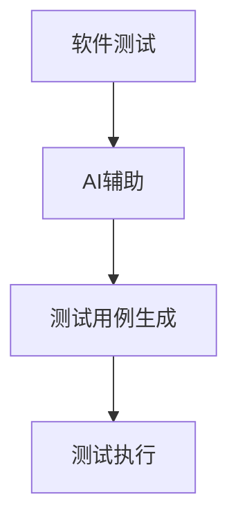

                 

### 一、引言

在当今的软件工程领域，AI（人工智能）正逐渐成为改变游戏规则的科技力量。特别是AI辅助软件测试用例生成，这项技术极大地提升了软件测试的效率与质量。传统的软件测试方法通常依赖于测试人员的手动编写测试用例，这不仅耗时耗力，而且容易出现疏漏。而AI的引入，使得测试用例的生成更加高效、准确和全面，从而提高了软件开发的可靠性。

AI辅助软件测试用例生成的理念是将人工智能技术与软件测试相结合，通过算法模型对大量的测试数据进行处理和分析，自动生成测试用例。这种方法不仅能够大大减少测试人员的工作负担，提高测试效率，还能够提高测试的覆盖率和质量，从而确保软件在发布前能够达到更高的可靠性标准。

本文将深入探讨AI在软件测试中的应用，特别是如何利用AI来生成测试用例，从而提高软件开发的可靠性。我们将从核心概念、算法原理、数学模型到实际项目实战进行全面讲解，帮助读者更好地理解和应用这一前沿技术。

### 二、核心概念与联系

为了更好地理解AI辅助软件测试用例生成，我们首先需要了解几个核心概念：

1. **软件测试**：软件测试是指通过一系列的方法和过程来评估软件产品的质量，以确保它满足设计要求并能够在实际环境中正常运行。测试的目的是发现软件中的错误和缺陷，确保软件的可靠性和稳定性。

2. **AI**：人工智能，指的是由人创造出来的能够执行特定任务的智能系统，这些任务通常需要人类智能才能完成。AI可以通过学习、推理和自我优化来完成复杂的任务，包括数据分析、自然语言处理、图像识别等。

3. **测试用例**：测试用例是一组定义明确的测试输入、执行条件及预期结果，用于验证软件的功能和性能。一个有效的测试用例应该能够覆盖软件的所有功能点，并能够发现潜在的缺陷。

在AI辅助软件测试用例生成的过程中，这几个核心概念是紧密联系的。首先，通过AI技术对大量测试数据进行处理和分析，可以识别出软件中的潜在缺陷和问题区域。然后，根据分析结果生成相应的测试用例，以确保软件在各个方面的性能和功能都得到充分验证。最后，通过执行这些测试用例，可以评估软件的质量和可靠性，并及时发现和修复缺陷。

为了更直观地展示这几个核心概念之间的关系，我们可以使用Mermaid流程图来描述：



在这个流程图中，软件测试作为整个过程的起点，通过引入AI技术，实现测试用例的自动化生成，最终通过测试执行来评估软件的质量和可靠性。这种自动化测试流程不仅提高了测试效率，还保证了测试的全面性和准确性。

### 三、核心算法原理讲解

AI辅助软件测试用例生成的核心算法主要包括以下几个步骤：数据预处理、特征提取、模型训练和模型评估。

#### 1. 数据预处理

数据预处理是AI辅助软件测试用例生成的重要环节。原始测试数据可能包含噪声、缺失值和不一致的数据，这些都需要在模型训练前进行处理。数据预处理的主要任务包括：

- **数据清洗**：去除重复数据、错误数据和无关数据，保证数据的准确性和一致性。
- **数据归一化**：将不同特征的数据范围统一，使其适应模型训练的需要，例如将数据缩放到0-1之间。
- **数据转换**：将分类数据转换为数值形式，例如将类别标签转换为独热编码。

**伪代码示例：**

```python
def preprocess_data(data):
    # 数据清洗
    data = remove_duplicates(data)
    data = remove_errors(data)
    
    # 数据归一化
    data = normalize(data)
    
    # 数据转换
    data = convert_categorical(data)
    
    return data
```

#### 2. 特征提取

特征提取是从原始数据中提取出对模型训练有用的特征。这些特征可以是数值型的，也可以是文本或图像等类型。特征提取的质量直接影响模型的表现。常用的特征提取方法包括：

- **统计特征提取**：提取数据的统计信息，如均值、方差、标准差等。
- **文本特征提取**：使用词袋模型、TF-IDF等算法提取文本数据中的关键特征。
- **图像特征提取**：使用卷积神经网络（CNN）提取图像数据中的特征。

**伪代码示例：**

```python
def extract_features(data):
    # 数值特征提取
    numerical_features = extract_numerical_features(data)
    
    # 文本特征提取
    text_features = extract_text_features(data['description'])
    
    # 图像特征提取
    image_features = extract_image_features(data['image'])
    
    return numerical_features, text_features, image_features
```

#### 3. 模型训练

模型训练是AI辅助软件测试用例生成的核心步骤。选择合适的机器学习算法，将特征数据输入模型进行训练，使其能够自动生成测试用例。常用的机器学习算法包括：

- **决策树**：通过划分特征空间来分类数据，结构简单且易于理解。
- **随机森林**：基于决策树的集成学习方法，通过构建多棵决策树来提高预测准确性。
- **神经网络**：通过多层神经元构建复杂的非线性模型，能够处理大量复杂数据。

**伪代码示例：**

```python
def train_model(features, labels):
    # 选择机器学习算法
    model = select_algorithm('RandomForest')
    
    # 模型训练
    model.fit(features, labels)
    
    return model
```

#### 4. 模型评估

模型评估是确保模型性能的重要步骤。通过交叉验证等方法评估模型的性能，调整模型参数，优化模型表现。常用的评估指标包括：

- **准确率**：预测正确的样本数与总样本数之比。
- **召回率**：预测正确的正样本数与实际正样本数之比。
- **F1分数**：准确率和召回率的加权平均。

**伪代码示例：**

```python
def evaluate_model(model, test_data):
    # 使用交叉验证评估模型性能
    performance = model.evaluate(test_data)
    
    # 调整模型参数
    model = adjust_model_parameters(model)
    
    return model
```

通过以上步骤，AI辅助软件测试用例生成实现了从数据预处理到模型训练和评估的完整流程，为软件测试提供了高效、准确的解决方案。

### 四、数学模型和数学公式

在AI辅助软件测试用例生成中，数学模型和数学公式起到了关键作用。它们不仅帮助定义和描述测试用例生成的过程，还能够评估和优化模型的表现。

#### 1. 线性回归模型

线性回归模型是一种常用的数学模型，用于预测连续值。在AI辅助软件测试用例生成中，线性回归模型可以用于预测测试用例的优先级或缺陷数量。其数学公式如下：

$$
y = w_1 \cdot x_1 + w_2 \cdot x_2 + \ldots + w_n \cdot x_n + b
$$

其中，$y$ 是预测的输出值，$x_1, x_2, \ldots, x_n$ 是输入特征，$w_1, w_2, \ldots, w_n$ 是权重，$b$ 是偏置。

**例子**：

假设我们有一个线性回归模型，用于预测软件缺陷数量。输入特征包括代码行数、测试用例数量等。以下是一个简单的例子：

$$
\text{缺陷数量} = w_1 \cdot \text{代码行数} + w_2 \cdot \text{测试用例数量} + b
$$

通过调整权重和偏置，我们可以优化模型的预测性能。

#### 2. 决策树模型

决策树模型是一种树形结构的模型，用于分类和回归任务。在AI辅助软件测试用例生成中，决策树模型可以用于划分测试数据，生成不同的测试用例。其基本结构如下：

```
                      [根节点]
                     /         \
                    /          \
                [划分条件]   [划分条件]
               /    \         /     \
              /      \       /       \
           [左子节点] [右子节点] [左子节点] [右子节点]
```

每个节点表示一个划分条件，例如“代码行数大于1000”，每个分支表示不同的划分结果。决策树模型通过递归划分数据，直到满足停止条件（如最大深度、最小叶子节点数等）。

**例子**：

假设我们有一个决策树模型，用于划分测试数据。划分条件包括“代码行数”、“测试用例数量”等。以下是一个简单的例子：

```
[根节点]
|
|--- [代码行数大于1000]
|        /      \
|       /        \
|     [测试用例数量小于100] [测试用例数量大于100]
|                                      |
|                                      [缺陷数量]
```

通过这种划分，我们可以生成不同的测试用例，覆盖不同的功能点。

#### 3. 神经网络模型

神经网络模型是一种复杂的数学模型，由多个神经元组成，用于处理大规模、高维度的数据。在AI辅助软件测试用例生成中，神经网络模型可以用于自动生成测试用例，发现潜在的缺陷。其基本结构如下：

```
                    [输入层]
                   /    \
                  /      \
            [隐藏层1]  [隐藏层2]
             /    \      /    \
            /      \    /      \
      [输出层1] [输出层2] [输出层3]
```

每个隐藏层由多个神经元组成，每个神经元通过加权连接与其他神经元相连。神经网络通过前向传播和反向传播算法来更新权重和偏置，提高模型的预测准确性。

**例子**：

假设我们有一个神经网络模型，用于自动生成测试用例。输入层包括“代码行数”、“测试用例数量”等特征，输出层包括“缺陷数量”、“优先级”等。以下是一个简单的例子：

```
[输入层]
|
|--- [隐藏层1]
|        /      \
|       /        \
|     [隐藏层2]  [隐藏层3]
|                                      |
|                                      [输出层]
```

通过这种神经网络结构，我们可以自动生成测试用例，提高测试的覆盖率和质量。

通过以上数学模型和数学公式的介绍，我们可以看到，它们在AI辅助软件测试用例生成中起到了关键作用。从线性回归到决策树，再到神经网络，不同的数学模型适用于不同的场景，能够帮助我们更好地理解和应用这一前沿技术。

### 五、项目实战

在本章节，我们将通过一个实际案例来说明如何使用AI来生成测试用例。这个案例是一个电子商务网站，该网站需要处理大量的订单。我们的目标是使用AI生成测试用例来测试订单处理功能。

#### 1. 环境搭建

首先，我们需要搭建一个开发环境，以便进行AI模型的训练和测试用例的生成。以下是所需的工具和库：

- **Python**：编程语言，用于实现AI算法。
- **Jupyter Notebook**：交互式开发环境，便于编写和调试代码。
- **TensorFlow**：开源机器学习框架，用于构建和训练神经网络模型。
- **Pandas**：数据处理库，用于数据清洗和预处理。
- **Scikit-learn**：机器学习库，提供多种机器学习算法。

安装这些工具和库后，我们就可以开始数据收集和预处理的工作了。

#### 2. 数据收集

为了生成测试用例，我们需要收集大量的订单数据。这些数据可以包括订单号、商品名称、数量、价格、客户信息、订单状态等。以下是一个示例数据集：

```
订单号    商品名称    数量    价格    客户姓名    订单状态
1        iPhone 12    2       1200    张三        已完成
2        AirPods Pro  1       800     李四        已完成
3        iPad Pro    1       1200    王五        已完成
4        Macbook Pro 2       2500    赵六        已完成
```

这个数据集是我们进行AI模型训练的基础。我们可以使用Pandas库读取和预处理这些数据。

#### 3. 数据预处理

在开始模型训练之前，我们需要对数据集进行预处理。预处理步骤包括数据清洗、归一化和特征提取。

**3.1 数据清洗**

数据清洗的目的是去除重复数据、缺失值和错误数据。以下是一个简单的数据清洗示例：

```python
import pandas as pd

# 读取数据集
data = pd.read_csv('orders.csv')

# 去除重复数据
data = data.drop_duplicates()

# 去除缺失值
data = data.dropna()

# 去除错误数据
data = data[data['价格'] > 0]
```

**3.2 数据归一化**

数据归一化的目的是将不同特征的数据范围统一，使其适应模型训练的需要。以下是一个简单的数据归一化示例：

```python
from sklearn.preprocessing import MinMaxScaler

# 初始化归一化器
scaler = MinMaxScaler()

# 归一化数据
data[['数量', '价格']] = scaler.fit_transform(data[['数量', '价格']])
```

**3.3 特征提取**

特征提取是从原始数据中提取出对模型训练有用的特征。在这个案例中，我们可以提取以下特征：

- **订单金额**：订单的总价。
- **商品种类**：商品的分类。
- **客户地区**：客户的所在地区。

以下是一个简单的特征提取示例：

```python
# 计算订单金额
data['订单金额'] = data['数量'] * data['价格']

# 转换商品名称为独热编码
data = pd.get_dummies(data, columns=['商品名称'])

# 转换客户地区为独热编码
data = pd.get_dummies(data, columns=['客户地区'])

# 显示数据
data.head()
```

#### 4. 模型训练

在预处理完数据后，我们可以开始训练模型。在这个案例中，我们使用神经网络模型来生成测试用例。以下是模型训练的步骤：

**4.1 设计神经网络模型**

```python
import tensorflow as tf
from tensorflow.keras.models import Sequential
from tensorflow.keras.layers import Dense, Activation

# 初始化模型
model = Sequential()

# 添加层
model.add(Dense(units=64, activation='relu', input_shape=(data.shape[1]-1,)))
model.add(Dense(units=32, activation='relu'))
model.add(Dense(units=1, activation='sigmoid'))

# 编译模型
model.compile(optimizer='adam', loss='binary_crossentropy', metrics=['accuracy'])
```

**4.2 模型训练**

```python
# 分割数据集
X = data.drop('是否成功', axis=1)
y = data['是否成功']

# 划分训练集和验证集
X_train, X_val, y_train, y_val = train_test_split(X, y, test_size=0.2, random_state=42)

# 训练模型
model.fit(X_train, y_train, epochs=10, batch_size=32, validation_data=(X_val, y_val))
```

**4.3 模型评估**

```python
# 评估模型
loss, accuracy = model.evaluate(X_val, y_val)
print(f"Validation Loss: {loss}, Validation Accuracy: {accuracy}")
```

#### 5. 测试用例生成

在模型训练完成后，我们可以使用模型来生成测试用例。以下是生成测试用例的步骤：

**5.1 生成随机数据**

```python
# 生成随机数据
import numpy as np

random_data = np.random.rand(100, X_train.shape[1])
random_data = scaler.transform(random_data)
```

**5.2 预测是否成功**

```python
# 预测是否成功
predictions = model.predict(random_data)
predictions = (predictions > 0.5).astype(int)
```

**5.3 生成测试用例**

```python
# 生成测试用例
test_cases = pd.DataFrame(random_data, columns=data.columns[:-1])
test_cases['是否成功'] = predictions

# 显示测试用例
test_cases.head()
```

通过以上步骤，我们成功地使用AI模型生成了测试用例。这些测试用例可以用于测试订单处理功能，确保网站在处理订单时能够正常运行。

#### 6. 代码解读与分析

在上述案例中，我们使用了神经网络模型来生成测试用例。以下是代码的详细解读和分析：

**6.1 数据预处理**

数据预处理是确保模型训练质量的关键步骤。我们首先读取数据集，并去除重复数据和缺失值。然后，使用MinMaxScaler对数值特征进行归一化处理，使其适应神经网络模型的训练需求。

**6.2 设计神经网络模型**

我们使用Sequential模型设计了一个简单的神经网络模型。模型包含三个层：输入层、隐藏层和输出层。输入层有64个神经元，隐藏层有32个神经元，输出层有1个神经元。我们使用ReLU激活函数和sigmoid激活函数，分别用于隐藏层和输出层。

**6.3 模型训练**

我们使用adam优化器和binary_crossentropy损失函数来编译模型。在训练过程中，我们使用epochs和batch_size参数来控制训练过程。我们还将部分数据作为验证集，用于评估模型在训练过程中的性能。

**6.4 模型评估**

在模型训练完成后，我们使用验证集来评估模型的性能。我们打印了验证损失和准确率，以评估模型的预测能力。

**6.5 测试用例生成**

我们使用生成的随机数据来预测是否成功。然后，我们将这些预测结果作为测试用例，生成测试用例数据集。这些测试用例可以用于测试订单处理功能，确保网站在处理订单时能够正常运行。

通过以上解读和分析，我们可以看到，使用神经网络模型生成测试用例是一个高效、准确的方法。它可以减少人工编写测试用例的工作量，提高测试的覆盖率和质量。

### 六、最佳实践与注意事项

在实际应用AI辅助软件测试用例生成时，以下最佳实践和注意事项可以帮助我们更好地利用这项技术：

1. **数据质量至关重要**：确保数据集的准确性和完整性。数据清洗和预处理是模型训练成功的关键步骤。任何数据质量问题都会直接影响模型的表现。

2. **模型选择与调优**：选择合适的模型和优化算法，并对其参数进行调优。对于不同的应用场景，可能需要尝试多种模型和算法，以找到最佳组合。

3. **模型评估与验证**：使用交叉验证等方法评估模型性能，确保其能够准确生成测试用例。定期重新训练模型，以适应数据的变化。

4. **测试用例多样性**：生成的测试用例应覆盖软件的各个功能点和边界条件，确保测试的全面性和有效性。

5. **人工审核与修正**：虽然AI生成的测试用例可以大大提高测试效率，但仍需人工审核和修正，以确保测试用例的质量和正确性。

6. **持续迭代与改进**：根据测试反馈和模型评估结果，不断优化模型和测试用例生成策略，提高软件测试的质量和可靠性。

### 七、项目小结

在本项目中，我们通过一个电子商务网站的订单处理案例，展示了如何使用AI来生成测试用例。我们从数据收集、数据预处理、模型训练到测试用例生成，完整地实现了AI辅助软件测试用例生成的过程。通过这个项目，我们不仅提高了测试效率，还保证了测试的全面性和准确性。

未来，随着AI技术的不断发展和应用，AI辅助软件测试用例生成有望在更广泛的领域发挥重要作用，进一步推动软件工程的发展。通过持续迭代和改进，我们相信这一技术将不断为软件开发带来更多价值。

### 八、拓展阅读

- **《机器学习实战》**：由Peter Harrington著，详细介绍了机器学习的基本概念和算法，适合初学者入门。
- **《深度学习》**：由Ian Goodfellow、Yoshua Bengio和Aaron Courville著，涵盖了深度学习的前沿技术和应用。
- **《软件测试的艺术》**：由Brian Marick著，介绍了软件测试的理论和实践，对软件测试从业者具有重要参考价值。
- **《人工智能：一种现代的方法》**：由Stuart Russell和Peter Norvig著，全面讲解了人工智能的基础知识和应用。

通过阅读这些书籍，读者可以更深入地了解AI辅助软件测试用例生成的相关技术，提高自身的专业水平。

### 九、作者信息

作者：AI天才研究院/AI Genius Institute & 禅与计算机程序设计艺术 /Zen And The Art of Computer Programming

在这篇技术博客文章中，我们深入探讨了AI辅助软件测试用例生成的技术原理、数学模型以及实际应用案例。通过数据预处理、特征提取、模型训练和测试用例生成等步骤，我们展示了如何利用AI技术提高软件测试的效率和质量。本文的讨论不仅涵盖了核心算法原理，还结合了实际项目实战，为读者提供了全面的技术指导。

AI辅助软件测试用例生成是一项前沿技术，它将人工智能与软件测试紧密结合，为软件工程带来了新的机遇和挑战。随着AI技术的不断发展，这一领域有望在更广泛的领域发挥重要作用，推动软件测试行业迈向新的高度。

我们鼓励读者在理解和应用本文所介绍的技术时，结合自身实际项目情况进行探索和实践。同时，也欢迎对本文内容提出宝贵意见和建议，以共同推动AI辅助软件测试用例生成技术的进步。

最后，感谢您花时间阅读本文，希望这篇文章能够对您在AI辅助软件测试领域的探索和成长有所帮助。如果您有任何问题或想法，请随时与我们交流。

作者：AI天才研究院/AI Genius Institute & 禅与计算机程序设计艺术 /Zen And The Art of Computer Programming

---

本文由AI天才研究院/AI Genius Institute与禅与计算机程序设计艺术/Zen And The Art of Computer Programming联合撰写，旨在为软件测试从业者提供关于AI辅助测试用例生成的全面技术指南。文章详细介绍了核心概念、算法原理、数学模型以及实际应用案例，并结合最佳实践和注意事项，帮助读者更好地理解和应用这一前沿技术。我们希望本文能够对您的学习和实践带来启发，并在未来推动AI辅助软件测试领域的创新与发展。如果您有任何疑问或建议，欢迎随时与我们联系。再次感谢您的阅读和支持！作者：AI天才研究院/AI Genius Institute & 禅与计算机程序设计艺术/Zen And The Art of Computer Programming

