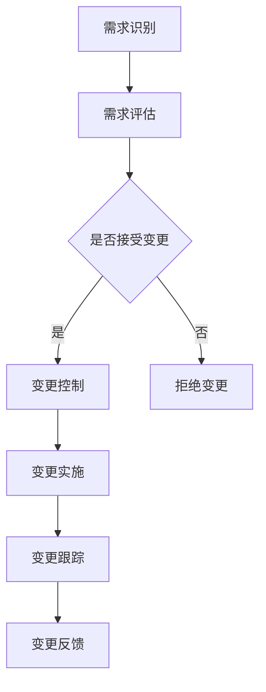

                 

### 文章标题

# AI辅助软件需求变更管理

### 文章关键词

- AI
- 软件需求变更
- 管理流程
- 人工智能应用
- 需求收集与分析
- 变更风险评估
- 监控与反馈

### 文章摘要

本文将探讨如何利用人工智能（AI）辅助软件需求变更管理。我们将首先介绍AI的基本原理和软件需求变更管理的概念，接着详细讲解AI在需求收集、分析、变更风险评估、过程监控与反馈等方面的应用。通过实例分析和最佳实践，本文旨在提供一套完整的AI辅助软件需求变更管理的方案，帮助企业和开发团队更高效地应对需求变更，降低变更风险，提高项目成功率。

---

## 引言与概述

在当今快速变化的数字化时代，软件需求变更已成为软件开发过程中不可避免的一部分。需求变更的原因多种多样，包括市场变化、用户反馈、技术进步等。有效地管理需求变更，对保证项目按时交付、降低成本、提升用户满意度至关重要。

然而，传统的需求变更管理流程往往存在效率低下、变更风险高等问题。随着人工智能技术的快速发展，利用AI辅助软件需求变更管理成为了一个新的研究方向。AI技术能够在需求收集、分析、变更风险评估、过程监控与反馈等方面提供强大的支持，从而提高需求变更管理的效率和效果。

本文将围绕以下主题展开：

1. **AI与软件需求变更管理的基本概念**：介绍AI的基本原理和软件需求变更管理的概念，阐述AI辅助需求变更管理的优势。
2. **AI在软件需求变更管理中的应用**：详细讲解AI在需求收集、分析、变更风险评估、过程监控与反馈等方面的应用。
3. **AI辅助软件需求变更管理的工具与技术**：介绍常用的AI算法和技术，以及AI辅助需求变更管理的平台与工具。
4. **AI辅助软件需求变更管理的实践案例**：通过实际案例展示AI辅助需求变更管理的应用效果。
5. **AI辅助软件需求变更管理的挑战与未来趋势**：分析AI辅助需求变更管理面临的挑战和未来发展趋势。
6. **结论与展望**：总结本文的主要观点，并对未来进行展望。

通过本文的阅读，读者将能够全面了解AI辅助软件需求变更管理的原理和方法，掌握在实际项目中应用AI技术的技巧，从而提高软件需求变更管理的效率和质量。

---

## AI与软件需求变更管理的基本概念

### AI的基本原理

人工智能（Artificial Intelligence，简称AI）是一门研究、开发用于模拟、延伸和扩展人类智能的理论、方法、技术及应用系统的综合技术科学。AI的目标是通过计算机模拟实现人类智能的功能，使其能够解决复杂问题、进行决策和学习。

AI的核心技术主要包括：

- **机器学习**：通过算法让计算机从数据中自动学习并改进性能。常见的机器学习算法包括监督学习、无监督学习和强化学习。
- **深度学习**：一种基于人工神经网络的机器学习方法，通过多层神经网络结构模拟人类大脑的神经元连接和功能。
- **自然语言处理**：使计算机能够理解和生成自然语言的技术，包括语音识别、文本分类、机器翻译等。
- **计算机视觉**：使计算机能够从图像和视频中提取信息的技术，包括图像识别、目标检测、人脸识别等。

### 软件需求变更管理的概念

软件需求变更管理是指在软件开发过程中，对需求进行识别、评估、控制、跟踪和沟通的管理过程。其目的是确保需求变更对项目的影响得到有效控制，以避免因需求变更导致的项目风险和成本增加。

软件需求变更管理的核心内容包括：

- **需求变更识别**：识别需求变更的发生，包括新需求的提出和现有需求的修改。
- **需求变更评估**：评估需求变更对项目进度、成本、质量和风险的影响。
- **需求变更控制**：制定需求变更控制流程，确保变更得到有效管理。
- **需求变更跟踪**：记录和跟踪需求变更的过程和结果，包括变更请求、变更决策和变更实施。
- **需求变更沟通**：与相关干系人进行沟通，确保需求变更得到有效传达和落实。

### AI辅助软件需求变更管理的优势

利用AI辅助软件需求变更管理，可以显著提高变更管理的效率和效果。以下是AI辅助软件需求变更管理的几个主要优势：

1. **提高需求识别准确性**：通过自然语言处理和计算机视觉等技术，AI能够更准确、快速地识别需求变更，减少人为错误。
2. **提高变更评估效率**：AI可以通过机器学习和深度学习算法，快速分析变更对项目各个方面的影响，提供准确的评估结果。
3. **优化变更控制流程**：AI可以自动化变更控制流程，提高变更管理的效率，减少人为干预和错误。
4. **增强变更过程监控与反馈**：AI可以实时监控变更过程，提供实时反馈，帮助项目团队及时调整变更策略。
5. **提高变更风险管理能力**：AI可以通过大数据分析和预测模型，提前识别变更风险，提供风险管理建议，降低变更风险。

### Mermaid 流程图

为了更直观地展示AI辅助软件需求变更管理的过程，我们可以使用Mermaid绘制一个流程图。以下是一个简单的示例：

在这个流程图中，需求识别阶段通过AI技术自动识别需求变更；需求评估阶段利用AI算法分析变更对项目的影响；根据评估结果，项目团队决定是否接受变更；接受变更的进入变更控制阶段，AI协助进行变更实施、跟踪和反馈。

通过以上对AI和软件需求变更管理的基本概念介绍，我们可以看到，AI技术在需求变更管理中具有巨大的潜力和优势。接下来，我们将进一步探讨AI在需求变更管理中的具体应用。

---

## AI在软件需求变更管理中的应用

在软件需求变更管理中，AI技术可以应用于多个关键环节，从而提高变更管理的效率和准确性。以下将详细讨论AI在需求收集、分析、变更风险评估、过程监控与反馈等方面的具体应用。

### 需求收集

需求收集是需求变更管理的第一步，其准确性直接影响到后续的变更评估和管理。传统的需求收集方法主要依靠人工访谈、问卷调查等方式，这些方法不仅耗时费力，而且容易出现遗漏和错误。利用AI技术，尤其是自然语言处理（NLP）和计算机视觉（CV），可以显著提高需求收集的效率和准确性。

1. **自然语言处理**：
   - **文本分析**：通过NLP技术，可以自动分析和提取用户需求文档中的关键信息，如功能需求、性能需求等。
   - **情感分析**：NLP还可以用于分析用户反馈中的情感倾向，识别用户对当前软件的满意度和潜在的需求变更。
   - **主题模型**：利用主题模型，可以从大量文本数据中提取出隐藏的主题，帮助识别用户需求中的共性。

2. **计算机视觉**：
   - **图像识别**：通过CV技术，可以从用户提供的图片或视频中提取出具体的元素和场景，如界面截图、产品原型等，进一步分析用户的需求。
   - **手势识别**：对于某些交互式应用，AI可以通过手势识别技术分析用户的行为和操作，从而推断用户的需求。

### 需求分析

在需求分析阶段，AI技术可以帮助项目团队快速、准确地理解需求，并将其转化为可执行的方案。

1. **需求分类**：AI可以通过机器学习算法对收集到的需求进行分类，识别出优先级高、影响大的需求。
   - **监督学习**：使用标注过的需求数据训练分类模型，对新需求进行自动分类。
   - **无监督学习**：在缺乏标注数据的情况下，利用聚类算法将需求分组，然后根据需求特性进行分类。

2. **需求优先级排序**：AI可以通过数据分析算法，根据需求的重要性和紧急性对需求进行排序。
   - **基于历史数据的优先级排序**：利用历史变更数据，通过回归分析等方法预测新需求的影响，从而确定其优先级。
   - **基于业务价值的优先级排序**：通过评估需求对业务目标的影响，确定其优先级。

3. **需求冲突检测**：AI可以分析多个需求之间的依赖关系和冲突，提前发现潜在的问题。
   - **图论算法**：使用图结构表示需求之间的关系，通过算法分析冲突点和依赖关系。
   - **约束满足问题（CSP）**：通过解决约束满足问题，检测需求之间的不一致性。

### 变更风险评估

变更风险评估是需求变更管理中至关重要的一环，AI技术可以通过数据分析、预测模型等方法提供更准确的评估结果。

1. **历史数据挖掘**：通过分析历史变更数据，AI可以识别出常见的变更风险模式和影响因素。
   - **数据挖掘算法**：如关联规则挖掘、分类回归树等，用于分析变更历史数据，识别风险因素。

2. **预测模型**：AI可以通过构建预测模型，提前预测变更可能带来的风险和影响。
   - **时间序列分析**：利用时间序列分析技术，预测变更对项目进度、成本、质量等方面的影响。
   - **机器学习预测模型**：如回归模型、决策树模型、神经网络模型等，用于预测变更的风险和影响。

### 过程监控与反馈

在变更实施过程中，AI技术可以实时监控变更的执行情况，并提供实时反馈，帮助项目团队及时调整变更策略。

1. **实时监控**：通过集成AI技术，项目管理系统可以实时收集变更执行数据，如代码提交、任务进度等。
   - **数据采集与处理**：利用数据采集工具和实时处理技术，对变更执行过程中的数据进行实时监控。

2. **异常检测**：AI可以识别变更执行过程中的异常情况，如代码质量问题、任务延迟等，并提供报警和提醒。
   - **异常检测算法**：如基于统计的异常检测、基于机器学习的异常检测等。

3. **实时反馈**：AI可以根据实时监控数据，生成反馈报告，提供变更执行的评估和建议。
   - **可视化工具**：利用可视化技术，将变更执行情况以图表、仪表板等形式展示给项目团队。

通过上述对AI在需求收集、分析、变更风险评估、过程监控与反馈等方面的具体应用讨论，我们可以看到，AI技术在软件需求变更管理中具有广泛的应用前景和巨大的潜力。接下来，我们将进一步探讨AI辅助软件需求变更管理的工具和技术。

---

## AI辅助软件需求变更管理的工具与技术

为了实现AI在软件需求变更管理中的有效应用，我们需要借助一系列先进的工具和技术。以下将介绍常用的AI算法、技术，以及AI辅助软件需求变更管理的平台和工具。

### 常用的AI算法

1. **机器学习算法**：
   - **监督学习**：通过已有标注数据训练模型，用于对新数据进行预测或分类。常见的算法包括线性回归、决策树、支持向量机（SVM）等。
   - **无监督学习**：不依赖标注数据，从数据中自动发现模式和结构。常见的算法包括聚类算法、主成分分析（PCA）等。
   - **强化学习**：通过学习奖励机制，使模型能够自主优化策略，达到最大化回报。常见的算法包括Q-learning、深度Q网络（DQN）等。

2. **深度学习算法**：
   - **神经网络**：一种基于人脑神经网络结构的人工智能模型，通过多层神经网络结构进行特征学习和模式识别。
   - **卷积神经网络（CNN）**：专门用于图像识别和计算机视觉任务，能够自动提取图像中的特征。
   - **循环神经网络（RNN）**：适用于处理序列数据，如文本和语音，能够捕捉序列中的时间依赖关系。

3. **自然语言处理（NLP）算法**：
   - **词嵌入**：将文本数据转换为数值表示，便于机器学习算法处理。常见的词嵌入模型包括Word2Vec、GloVe等。
   - **文本分类**：将文本数据分类到预定义的类别中，常见的算法包括朴素贝叶斯、SVM、深度学习模型等。
   - **情感分析**：分析文本中的情感倾向，常见的算法包括基于规则的方法、机器学习方法和深度学习方法。

4. **计算机视觉（CV）算法**：
   - **图像识别**：识别图像中的对象和场景，常见的算法包括SVM、CNN、卷积神经网络等。
   - **目标检测**：在图像中检测并定位多个对象，常见的算法包括YOLO、Faster R-CNN、SSD等。
   - **人脸识别**：识别和验证人脸，常见的算法包括Eigenface、LBP、深度学习模型等。

### AI辅助软件需求变更管理的平台和工具

1. **机器学习平台**：
   - **TensorFlow**：由Google开源的深度学习框架，支持多种神经网络结构和算法，适用于大规模数据处理和模型训练。
   - **PyTorch**：由Facebook开源的深度学习框架，提供灵活的动态计算图，易于实现和调试。
   - **Scikit-learn**：Python开源的机器学习库，提供多种监督学习和无监督学习算法，适用于中小规模的数据分析。

2. **自然语言处理平台**：
   - **NLTK**：Python开源的自然语言处理库，提供多种文本处理工具和算法，适用于文本分类、情感分析等任务。
   - **spaCy**：Python开源的NLP库，提供高效的文本处理和实体识别功能，适用于文本分析和信息提取。
   - **TextBlob**：Python开源的NLP库，提供简单的文本分类、情感分析和词嵌入功能，适用于快速原型开发。

3. **计算机视觉平台**：
   - **OpenCV**：开源的计算机视觉库，提供丰富的图像处理和计算机视觉算法，适用于图像识别、目标检测等任务。
   - **Dlib**：开源的机器学习库，提供人脸识别、人脸检测和姿态估计等功能，适用于计算机视觉应用。
   - **TensorFlow Object Detection API**：基于TensorFlow的物体检测工具包，提供高效的物体检测和分类功能。

4. **AI辅助软件需求变更管理的工具**：
   - **JIRA**：敏捷开发管理工具，提供需求管理、任务跟踪和项目进度监控功能，支持集成AI算法和工具。
   - **Trello**：敏捷项目管理工具，提供看板和卡片管理功能，便于团队协作和需求跟踪。
   - **Confluence**：知识管理工具，提供文档编辑、分享和协作功能，便于记录和管理需求变更相关文档。

通过上述工具和技术的介绍，我们可以看到，AI辅助软件需求变更管理具有广泛的选择和应用空间。在实际应用中，项目团队可以根据具体需求选择合适的工具和技术，实现高效、精准的需求变更管理。

### 实现策略

1. **集成与适配**：将AI工具和技术集成到现有的软件开发和需求管理平台中，如JIRA、Confluence等，确保无缝衔接和高效运行。
2. **数据收集与清洗**：建立完善的数据收集和清洗机制，确保输入数据的质量和完整性，为AI算法提供可靠的数据基础。
3. **模型训练与优化**：根据实际需求变更数据，训练和优化AI模型，提高模型的准确性和鲁棒性，确保需求变更管理的有效性。
4. **迭代与反馈**：建立反馈机制，根据需求变更管理的实际效果，不断迭代和优化AI算法和工具，提高整体变更管理能力。

通过合理运用上述工具和技术，项目团队可以显著提升AI辅助软件需求变更管理的效率和质量，为软件开发项目提供强有力的支持。

---

## AI辅助软件需求变更管理的实践案例

为了更直观地展示AI在软件需求变更管理中的实际应用效果，我们将通过一个具体案例进行详细讲解。该案例涉及一个电商平台的订单管理系统，通过AI技术辅助实现需求变更的管理。

### 案例背景

某电商平台订单管理系统在上线后，由于市场竞争和用户反馈的需求变化，频繁出现需求变更。传统的需求变更管理流程无法满足快速响应的需求，导致项目进度滞后、成本增加，且变更风险难以控制。为了解决这个问题，该电商平台决定采用AI技术辅助进行需求变更管理。

### 案例需求分析

电商平台的需求变更主要集中在以下几个方面：

1. **功能扩展**：根据用户反馈，新增“订单跟踪”功能，让用户可以实时查看订单状态。
2. **性能优化**：为应对高峰期订单量的激增，对订单处理系统进行性能优化，提高系统响应速度和并发处理能力。
3. **用户体验改进**：根据用户调研结果，优化订单页面布局，提高用户操作便捷性和满意度。

### 案例解决方案

1. **需求收集与识别**：
   - 使用自然语言处理技术，从用户反馈、调研报告等文本数据中提取出关键需求信息。
   - 通过计算机视觉技术，分析用户提供的截图、视频等素材，识别出具体的功能需求。

2. **需求分析**：
   - 利用机器学习算法，对收集到的需求进行分类和优先级排序。
   - 通过图论算法，分析需求之间的依赖关系和冲突点，提前发现潜在的问题。

3. **变更风险评估**：
   - 通过历史数据挖掘和预测模型，评估需求变更对项目进度、成本、质量等方面的影响。
   - 提供风险评估报告，帮助项目团队制定变更控制策略。

4. **变更控制与实施**：
   - 利用AI算法自动化变更控制流程，确保变更得到有效管理。
   - 通过实时监控和反馈，确保变更过程透明可控，及时调整变更策略。

5. **过程监控与反馈**：
   - 利用实时监控技术，跟踪变更执行情况，识别异常情况并报警。
   - 通过AI生成实时反馈报告，提供变更执行的评估和建议。

### 实施效果评估

通过AI辅助需求变更管理，该电商平台实现了以下效果：

1. **需求变更管理效率提高**：AI技术自动化了大部分需求变更管理流程，显著减少了人工工作量，提高了变更处理的效率。
2. **变更风险降低**：通过风险评估和实时监控，提前识别并控制了变更风险，确保项目顺利进行。
3. **用户体验提升**：通过及时响应用户需求，优化了订单页面布局和功能，用户满意度显著提高。
4. **项目成本控制**：通过精确的需求变更评估和优化，有效控制了项目成本，降低了不必要的开支。

### 项目小结

通过这个实践案例，我们可以看到AI技术在软件需求变更管理中的实际应用效果。AI不仅提高了需求变更管理的效率和准确性，还降低了变更风险，提升了用户体验和项目成功率。未来，随着AI技术的不断发展和成熟，AI辅助需求变更管理将在更多领域得到广泛应用。

---

## AI辅助软件需求变更管理的挑战与未来趋势

尽管AI技术在软件需求变更管理中展现出了巨大的潜力，但其实际应用仍面临诸多挑战和限制。以下将分析这些挑战，并探讨AI辅助软件需求变更管理的未来发展趋势。

### 挑战

1. **数据质量和多样性**：AI模型的效果高度依赖于输入数据的质量和多样性。然而，在现实项目中，数据往往存在噪声、缺失和不一致性等问题，这会对AI模型的训练和预测带来困难。此外，需求变更数据的多样性也是一个挑战，因为不同类型的变更对项目的影响不同，AI模型需要能够处理这些复杂的多样性。

2. **模型可解释性**：AI模型，特别是深度学习模型，往往被视为“黑箱”，其内部工作机制不透明，难以解释。这对于需求变更管理的决策过程是不利的，因为项目团队需要理解模型的决策过程，以确保变更的合理性和有效性。

3. **计算资源消耗**：AI模型的训练和推理需要大量的计算资源，尤其是在处理大规模数据集时。对于中小型企业和开发团队来说，这可能导致成本高昂，难以大规模应用AI技术。

4. **法律和伦理问题**：AI在软件需求变更管理中的应用可能涉及敏感信息和隐私保护问题，需要遵守相关的法律和伦理规范。此外，AI决策的不透明性也可能引发道德争议，需要制定相应的监管措施。

5. **技术成熟度**：尽管AI技术已经取得了一定的进展，但在实际应用中，一些关键技术仍不够成熟，如实时处理、可解释性等。这限制了AI技术在需求变更管理中的广泛应用。

### 未来趋势

1. **数据治理与质量控制**：未来，随着数据治理技术的发展，AI模型的训练数据将得到更有效的管理和质量控制，减少数据噪声和缺失，提高模型的准确性和可靠性。

2. **模型可解释性和透明性**：为了提高AI模型的可解释性，研究人员和开发者将致力于开发可解释性方法，如可视化工具、解释性算法等，帮助项目团队理解模型的决策过程。

3. **边缘计算与实时处理**：随着边缘计算的兴起，AI模型将在更靠近数据源的边缘设备上进行训练和推理，提高实时处理能力，满足快速响应的需求。

4. **集成与自动化**：AI技术将更深入地集成到软件开发和需求管理平台中，实现自动化需求变更管理，减少人工干预，提高变更管理的效率。

5. **伦理和法规遵守**：随着AI技术的应用，相关的伦理和法律法规将不断完善，为AI辅助软件需求变更管理提供更加明确的指导和支持。

6. **跨领域应用**：AI辅助软件需求变更管理将在更多领域得到应用，如金融、医疗、制造等，解决这些领域特有的需求变更挑战。

通过应对这些挑战和抓住未来趋势，AI辅助软件需求变更管理将逐渐成为软件开发项目中的重要组成部分，为项目团队提供更高效、更可靠的支持。

---

## 结论与展望

本文全面探讨了AI辅助软件需求变更管理的原理、方法、应用和实践案例，揭示了AI技术在需求收集、分析、风险评估、过程监控与反馈等环节的重要作用。通过引入AI技术，我们能够显著提高需求变更管理的效率、准确性和风险管理能力，从而为软件开发项目提供强有力的支持。

展望未来，随着AI技术的不断发展和成熟，AI辅助软件需求变更管理将在更多领域得到广泛应用，解决更多复杂的需求变更挑战。我们期待，通过持续的研究和实践，AI技术将能够更好地服务于软件开发项目，推动整个行业的发展。

在技术发展的同时，我们也需关注数据治理、模型可解释性、法律和伦理问题，确保AI辅助软件需求变更管理的应用合规、透明和可靠。让我们携手共进，推动AI在软件需求变更管理领域的创新与发展。

---

## 附录

### 附录A AI与软件需求变更管理相关资源

- **书籍推荐**：
  - 《人工智能：一种现代的方法》（作者：Stuart Russell 和 Peter Norvig）
  - 《机器学习》（作者：Andrew Ng）
  - 《深度学习》（作者：Ian Goodfellow、Yoshua Bengio 和 Aaron Courville）
- **在线课程**：
  - Coursera上的《机器学习》课程（由Andrew Ng教授）
  - Udacity的《深度学习纳米学位》课程
  - edX上的《人工智能基础》课程（由MIT和Stanford大学教授）

### 附录B 实用算法与工具列表

- **机器学习库**：
  - TensorFlow
  - PyTorch
  - Scikit-learn
- **自然语言处理库**：
  - NLTK
  - spaCy
  - TextBlob
- **计算机视觉库**：
  - OpenCV
  - Dlib
  - TensorFlow Object Detection API
- **需求管理工具**：
  - JIRA
  - Trello
  - Confluence

### 作者信息

**作者：AI天才研究院/AI Genius Institute & 禅与计算机程序设计艺术 /Zen And The Art of Computer Programming**

