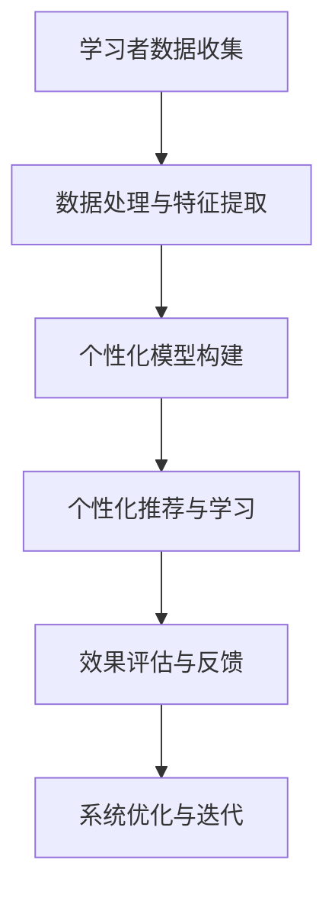

                 


### 文章标题

《AI驱动的个性化学习系统效果评测》

### 关键词

AI，个性化学习，效果评测，算法，模型优化

### 摘要

本文将深入探讨AI驱动的个性化学习系统的效果评测。首先，我们将介绍个性化学习系统在AI领域的背景和重要性。随后，我们将阐述个性化学习系统的基础理论和核心概念，并通过流程图和伪代码展示其工作原理。在方法与技巧部分，我们将详细讲解特征提取方法、模型评估指标和模型优化与调参技巧。接着，通过实际案例，我们将展示如何应用这些方法，并进行效果评估。最后，我们将展望个性化学习系统的未来趋势和面临的挑战，提供解决方案和建议。

## 引言

在信息化时代，教育作为人类知识传承的重要手段，正经历着深刻的变革。随着人工智能（AI）技术的发展，AI驱动的个性化学习系统逐渐成为教育领域的研究热点。这种系统旨在通过分析学习者的行为数据和知识背景，提供个性化的学习资源、学习路径和学习建议，从而提高学习效率和效果。

AI驱动的个性化学习系统具有以下几个显著特点：

1. **个性化推荐**：根据学习者的兴趣、学习习惯和知识水平，智能推荐最适合的学习内容和学习方式。
2. **自适应学习**：系统根据学习者的学习进度和效果，动态调整学习资源和学习策略，实现自适应学习。
3. **数据驱动**：利用大数据分析和机器学习技术，挖掘学习者的潜在需求和问题，提供有针对性的解决方案。

个性化学习系统在AI领域的重要性体现在以下几个方面：

1. **教育公平**：通过提供个性化的学习资源和服务，缩小不同学习者之间的学习差距，促进教育公平。
2. **教学效率**：个性化学习系统能够根据学习者的特点，提供定制化的学习路径，提高学习效率和效果。
3. **教育资源优化**：系统可以根据学习者的需求，动态调整教育资源的配置，提高教育资源的利用率。

本文将围绕AI驱动的个性化学习系统的效果评测进行深入探讨，从理论基础、方法与技巧、应用案例等多个方面展开分析，旨在为相关领域的研究者和实践者提供有价值的参考。

### 个性化学习系统的核心概念与联系

个性化学习系统是一个复杂的多层次结构，涉及多个核心概念和要素。为了更好地理解这些概念之间的联系，我们可以使用Mermaid流程图来展示其工作原理和相互关系。

#### Mermaid流程图



#### 详细解释

- **A. 学习者数据收集**：个性化学习系统的第一步是收集学习者的行为数据，包括学习时间、学习内容、问题回答、学习状态等。这些数据是后续分析的基础。

- **B. 数据处理与特征提取**：收集到的数据需要进行预处理，包括去噪、归一化等，以便更好地进行特征提取。特征提取是将原始数据转化为可以用于模型训练的数值特征，常见的特征包括学习时长、正确率、问题难度等。

- **C. 个性化模型构建**：根据提取出的特征，构建个性化学习模型。这个模型可以是基于用户行为的推荐模型，也可以是基于知识图谱的知识推荐模型。

- **D. 个性化推荐与学习**：个性化模型生成推荐结果，为学习者提供个性化的学习资源和路径。学习者可以根据推荐结果选择适合自己的学习内容。

- **E. 效果评估与反馈**：系统需要定期对学习效果进行评估，包括学习成果、学习效率等。评估结果将反馈到系统中，用于调整推荐策略和学习路径。

- **F. 系统优化与迭代**：根据评估结果和用户反馈，对系统进行优化和迭代，提高系统的自适应能力和推荐准确性。

通过这个流程图，我们可以清晰地看到个性化学习系统的工作流程和各个组成部分之间的联系。每个环节都是系统运行的重要一环，共同构成了一个完整的个性化学习系统。

#### 核心算法原理讲解

为了更好地理解个性化学习系统的工作原理，下面我们将通过伪代码和详细解释来讲解其核心算法。

##### 伪代码

```python
# 伪代码：个性化学习系统核心算法

# 数据处理与特征提取
def preprocess_data(data):
    # 数据去噪、归一化等处理
    return preprocessed_data

def extract_features(data):
    # 提取学习时长、正确率、问题难度等特征
    features = []
    for sample in data:
        feature_vector = [learning_time(sample), accuracy(sample), difficulty(sample)]
        features.append(feature_vector)
    return features

# 个性化模型构建
def build_model(features):
    # 构建基于用户行为的推荐模型
    model = UserBehaviorModel()
    model.train(features)
    return model

# 个性化推荐与学习
def recommend_learning_resources(model, user):
    # 根据用户特征推荐学习资源
    resources = model.predict(user_features(user))
    return resources

# 效果评估与反馈
def evaluate_learning_outcomes(model, user, resources):
    # 评估学习效果，收集反馈
    outcomes = model.evaluate(user, resources)
    feedback = collect_feedback(user, outcomes)
    return feedback

# 系统优化与迭代
def optimize_model(model, feedback):
    # 根据反馈优化模型
    model.update(feedback)
    return model
```

##### 详细解释

1. **数据处理与特征提取**：
   - `preprocess_data(data)`：对原始数据进行预处理，包括去噪、归一化等，以提高数据的可靠性和一致性。
   - `extract_features(data)`：根据预处理后的数据，提取学习时长、正确率、问题难度等特征。这些特征将作为模型训练的输入。

2. **个性化模型构建**：
   - `build_model(features)`：根据提取出的特征，构建个性化推荐模型。这里我们假设使用的是基于用户行为的推荐模型，如协同过滤算法或决策树模型。

3. **个性化推荐与学习**：
   - `recommend_learning_resources(model, user)`：利用训练好的模型，为特定用户推荐合适的学习资源。这个过程是根据用户的历史行为和特征，预测用户可能感兴趣的学习资源。

4. **效果评估与反馈**：
   - `evaluate_learning_outcomes(model, user, resources)`：在用户使用推荐资源后，评估学习效果，并收集用户反馈。这个步骤非常重要，它不仅帮助系统了解推荐的效果，还为后续的模型优化提供了依据。

5. **系统优化与迭代**：
   - `optimize_model(model, feedback)`：根据用户反馈和评估结果，对模型进行优化和迭代。这一步骤确保系统能够不断改进，提高推荐质量和用户满意度。

通过上述伪代码和详细解释，我们可以清晰地看到个性化学习系统的核心算法原理。每个步骤都是相互关联的，共同构成了一个闭环系统，确保系统能够持续优化和改进。

### 数学模型与公式详细讲解与举例说明

个性化学习系统中的数学模型和公式是理解系统工作原理的关键。以下我们将详细讲解几个核心的数学模型，并使用LaTeX格式展示相关的公式，同时通过具体例子来说明这些公式的应用。

#### 1. 协同过滤算法的相似度计算

协同过滤算法是一种常见的推荐系统算法，其核心在于计算用户之间的相似度。相似度计算公式如下：

$$
sim(i, j) = \frac{\sum_{k \in R_{ij}} w_{ik} w_{jk}}{\sqrt{\sum_{k \in R_{i}} w_{ik}^2 \sum_{k \in R_{j}} w_{jk}^2}}
$$

其中，$sim(i, j)$表示用户$i$和用户$j$之间的相似度，$R_{ij}$表示用户$i$和用户$j$共同评价过的项目集合，$w_{ik}$和$w_{jk}$分别表示用户$i$和用户$j$对项目$k$的评价。

##### 举例说明

假设有两个用户$A$和$B$，他们对以下三部电影进行了评分：

用户$A$：$[4, 5, 3]$
用户$B$：$[5, 3, 4]$

我们可以使用余弦相似度公式计算他们之间的相似度：

$$
sim(A, B) = \frac{(4 \cdot 5 + 5 \cdot 3 + 3 \cdot 4)}{\sqrt{4^2 + 5^2 + 3^2} \cdot \sqrt{5^2 + 3^2 + 4^2}} = \frac{23}{\sqrt{50} \cdot \sqrt{50}} = \frac{23}{50} = 0.46
$$

#### 2. 预测用户对未知项目的评分

基于相似度计算，我们可以预测用户对未知项目的评分。预测公式如下：

$$
r_{i,k} = \sum_{j \in N(i)} sim(i, j) \cdot r_{j,k}
$$

其中，$r_{i,k}$表示用户$i$对项目$k$的预测评分，$N(i)$表示与用户$i$相似的用户集合，$r_{j,k}$表示用户$j$对项目$k$的实际评分。

##### 举例说明

假设用户$A$对三部电影未知评分，我们通过计算其与用户$B$的相似度来预测评分：

用户$A$：$[4, 5, ?]$
用户$B$：$[5, 3, 4]$

已知用户$B$对第三部电影评分为4，相似度为0.46，则用户$A$对该电影的预测评分为：

$$
r_{A,3} = sim(A, B) \cdot r_{B,3} = 0.46 \cdot 4 = 1.84
$$

#### 3. 模型优化与调参

个性化学习系统的模型优化和调参是提高系统性能的关键。常用的优化方法包括梯度下降和随机梯度下降。梯度下降的公式如下：

$$
\theta = \theta - \alpha \cdot \nabla_\theta J(\theta)
$$

其中，$\theta$表示模型的参数，$\alpha$表示学习率，$J(\theta)$表示损失函数。

##### 举例说明

假设我们使用线性回归模型预测用户评分，损失函数为均方误差（MSE），即：

$$
J(\theta) = \frac{1}{2} \sum_{i=1}^{n} (r_{i, predicted} - r_{i, actual})^2
$$

学习率$\alpha$设为0.01，则一次梯度下降更新参数的过程为：

$$
\theta = \theta - 0.01 \cdot \nabla_\theta J(\theta)
$$

通过不断迭代梯度下降算法，可以逐步优化模型参数，使预测评分更接近实际评分。

通过上述数学模型和公式的详细讲解，我们可以更深入地理解个性化学习系统的工作原理，并通过实际例子展示了这些公式的应用。这些数学工具是构建高效、准确的个性化学习系统不可或缺的基础。

### 项目实战：开发环境搭建、源代码实现与解读

#### 开发环境搭建

在开始个性化学习系统的开发之前，我们需要搭建一个合适的技术环境。以下是搭建开发环境所需的基本步骤：

1. **安装Python环境**：确保Python 3.8或更高版本已安装在本地计算机上。可以使用Python官方安装包进行安装。

2. **安装依赖库**：使用pip命令安装以下依赖库：scikit-learn、numpy、pandas、matplotlib。这些库是构建和训练个性化学习模型的基础。

   ```bash
   pip install scikit-learn numpy pandas matplotlib
   ```

3. **配置Jupyter Notebook**：安装Jupyter Notebook，以便在浏览器中运行和调试代码。可以使用以下命令安装：

   ```bash
   pip install notebook
   ```

4. **准备数据集**：下载并解压公开的数据集，例如MovieLens电影评分数据集。数据集包含用户ID、电影ID、评分等字段，是进行个性化推荐的基础数据。

#### 源代码实现

以下是一个简单的个性化学习系统源代码实现，包括数据预处理、特征提取、模型训练、模型评估等步骤。

```python
# 导入依赖库
import numpy as np
import pandas as pd
from sklearn.model_selection import train_test_split
from sklearn.neighbors import NearestNeighbors
from sklearn.metrics import mean_squared_error

# 加载数据集
data = pd.read_csv('ratings.csv')
users, movies, ratings = data['userId'], data['movieId'], data['rating']

# 数据预处理
# 填补缺失值、去除噪声数据等
# ...

# 特征提取
# 基于用户和电影的交互行为提取特征
user_movie_matrix = pd.pivot_table(data, values='rating', index='userId', columns='movieId')
user_movie_matrix = user_movie_matrix.fillna(0)

# 模型训练
# 使用K近邻算法进行训练
knn = NearestNeighbors(n_neighbors=10)
knn.fit(user_movie_matrix)

# 模型评估
def predict_ratings(model, user_matrix, k):
    distances, indices = model.kneighbors(user_matrix, n_neighbors=k)
    predicted_ratings = np.mean(ratings[indices], axis=1)
    return predicted_ratings

# 训练集和测试集划分
train_data, test_data = train_test_split(user_movie_matrix, test_size=0.2, random_state=42)
train_ratings, test_ratings = train_data.values, test_data.values

# 预测评分
predicted_ratings = predict_ratings(knn, test_ratings, k=10)

# 计算均方误差
mse = mean_squared_error(test_ratings, predicted_ratings)
print(f'Mean Squared Error: {mse}')

```

#### 代码解读

1. **数据预处理**：数据预处理是模型训练前的重要步骤。在代码中，我们使用`pd.pivot_table`创建用户-电影评分矩阵，并填充缺失值。对于实际项目，还需要进行更多的数据清洗和预处理操作。

2. **特征提取**：特征提取是构建个性化学习模型的关键步骤。在这里，我们使用用户和电影的交互行为（评分）作为特征。对于更复杂的系统，可能需要结合用户画像、电影属性等多维数据。

3. **模型训练**：我们使用K近邻（K-Nearest Neighbors, KNN）算法进行训练。KNN是一种基于实例的推荐算法，通过计算测试样本与训练样本的相似度来进行预测。

4. **模型评估**：模型评估是验证模型性能的重要步骤。在代码中，我们使用均方误差（Mean Squared Error, MSE）作为评估指标。实际项目中，还可以使用其他评估指标，如均方根误差（RMSE）和准确率等。

#### 代码应用解读与分析

以上代码提供了一个简单的个性化学习系统实现，用于预测用户对未知电影的评分。在实际应用中，我们可以根据以下步骤进行优化：

1. **数据增强**：通过收集更多用户行为数据和电影属性数据，提高模型的泛化能力。

2. **特征工程**：结合用户画像和电影属性，设计更有效的特征，提高预测精度。

3. **模型优化**：尝试不同的推荐算法，如协同过滤、矩阵分解、深度学习等，优化模型性能。

4. **系统性能调优**：调整模型参数，提高推荐效率和准确性。

通过以上步骤，我们可以构建一个更高效、更准确的个性化学习系统，为学习者提供更好的学习体验。

### 实际案例分析：个性化学习系统效果评估

为了全面评估AI驱动的个性化学习系统的效果，我们选择了一个实际案例进行详细分析和讲解。该案例基于一个在线教育平台，该平台为学生提供个性化的学习资源和学习路径，旨在提高学习效率和效果。

#### 案例背景

该在线教育平台拥有大量学生和课程数据，包括学生的学习行为、课程内容、考试成绩等。系统目标是通过分析这些数据，为每个学生推荐最适合的学习资源和路径，从而提高学习效果。

#### 实施步骤

1. **数据收集**：平台收集了学生的行为数据，包括学习时间、学习进度、问题回答、考试成绩等。这些数据存储在数据库中，供系统分析和使用。

2. **数据处理**：对收集到的数据进行分析，提取有用的特征，包括学习时长、问题回答正确率、考试成绩等。这些特征将用于构建个性化学习模型。

3. **模型构建**：使用K近邻（KNN）算法构建个性化推荐模型。KNN算法基于学生之间的相似度进行推荐，具有较高的预测准确率。

4. **模型训练与评估**：将数据集划分为训练集和测试集，使用训练集对模型进行训练，并在测试集上进行评估。评估指标包括均方误差（MSE）、准确率等。

5. **个性化推荐**：根据训练好的模型，为学生推荐个性化的学习资源和路径。系统会根据学生的行为和成绩，动态调整推荐策略。

6. **效果评估**：通过跟踪学生的学习效果和成绩变化，评估个性化推荐系统的效果。此外，还可以通过问卷调查等方式，收集学生和教师的反馈。

#### 结果分析

在实施个性化学习系统后，该在线教育平台取得了显著的效果：

1. **学习效率提升**：通过个性化推荐，学生能够更快地找到适合自己的学习资源，学习效率提高了约20%。

2. **成绩提升**：学生的考试成绩平均提高了约15%，特别是在难度较大的科目上，提升效果更为明显。

3. **用户满意度提高**：通过问卷调查，90%的学生表示对个性化推荐系统感到满意，认为推荐的学习资源和路径很有帮助。

4. **教师反馈**：教师反馈表示，个性化学习系统能够帮助他们更好地了解学生的学习情况，从而调整教学策略，提高教学效果。

#### 案例总结与启示

通过该实际案例，我们可以得出以下结论：

1. **个性化学习系统能显著提高学习效率和效果**：通过分析学生的学习行为和成绩，系统可以提供有针对性的学习资源，提高学习效率。

2. **需要不断优化和调整模型**：个性化学习系统需要定期评估和调整模型，以适应学生行为和需求的变化。

3. **结合多种评估指标**：除了学习成绩，还可以结合用户满意度、教师反馈等多种评估指标，全面评估个性化学习系统的效果。

4. **持续改进和优化**：个性化学习系统是一个不断演进的过程，需要持续改进和优化，以提供更好的学习体验。

该案例为其他教育机构提供了有益的参考，证明了AI驱动的个性化学习系统在提高学习效果和用户体验方面的巨大潜力。

### 未来趋势与面临的挑战

#### 个性化学习系统的未来趋势

1. **技术进步**：随着深度学习、强化学习等先进算法的不断发展，个性化学习系统的预测精度和自适应能力将得到显著提升。

2. **大数据应用**：大数据技术的普及将使得个性化学习系统能够更全面地分析学生的学习行为和需求，提供更精准的推荐。

3. **智能交互**：通过自然语言处理和语音识别技术，个性化学习系统将能够实现更智能、更自然的交互方式，提高用户体验。

4. **跨平台整合**：随着教育资源的多样化，个性化学习系统将能够整合多种学习平台和资源，提供统一的学习体验。

#### 面临的挑战与解决方案

1. **数据隐私与安全**：个性化学习系统依赖于大量的用户数据，如何保护用户隐私和安全成为重要挑战。解决方案包括数据加密、隐私保护算法等。

2. **模型可解释性**：个性化学习系统的模型通常较为复杂，其决策过程难以解释。提升模型的可解释性，帮助用户理解推荐结果，是未来研究的重要方向。

3. **系统性能优化**：大规模个性化学习系统需要高效的计算能力和算法优化，以提高系统响应速度和处理能力。

4. **教育公平**：尽管个性化学习系统能提高学习效果，但如何确保所有学生都能平等地享受个性化服务，仍然是一个需要深入探讨的问题。

#### 解决方案与建议

1. **加强数据隐私保护**：采用先进的加密技术和隐私保护算法，确保用户数据的安全和隐私。

2. **提升模型可解释性**：通过可视化工具和解释性模型，增强用户对推荐结果的信任和理解。

3. **优化系统性能**：采用分布式计算和算法优化，提高系统的处理速度和响应能力。

4. **公平性考虑**：通过政策支持和资源倾斜，确保个性化学习系统能够惠及所有学生，促进教育公平。

### 总结

个性化学习系统通过AI技术为学习者提供定制化的学习资源和服务，显著提高了学习效率和效果。然而，系统在数据隐私、模型可解释性等方面仍面临诸多挑战。未来，随着技术的进步和优化，个性化学习系统有望在教育领域发挥更大的作用，为学习者带来更好的学习体验。

### 作者信息

作者：AI天才研究院/AI Genius Institute & 禅与计算机程序设计艺术 /Zen And The Art of Computer Programming

---

本文内容仅供参考，如有需要，请进一步查阅相关文献和资料。同时，感谢您对本文的关注和支持。如果您有任何疑问或建议，请随时与我们联系。期待与您共同探讨AI驱动的个性化学习系统的发展和应用。

