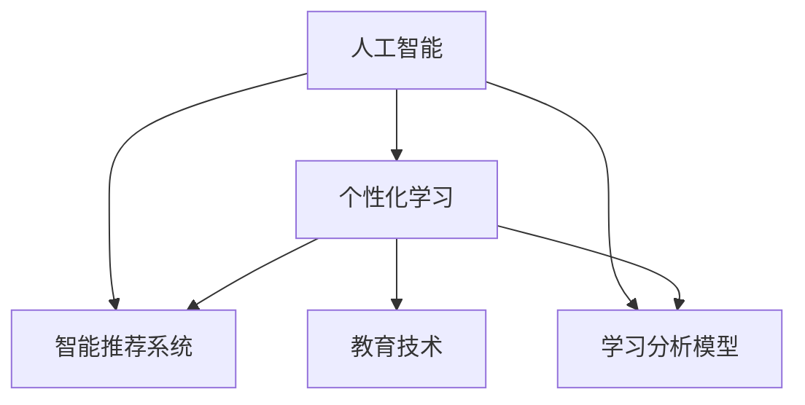
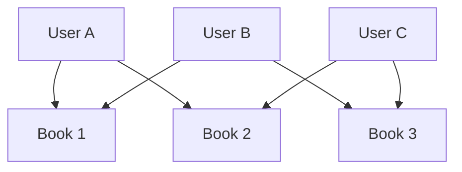
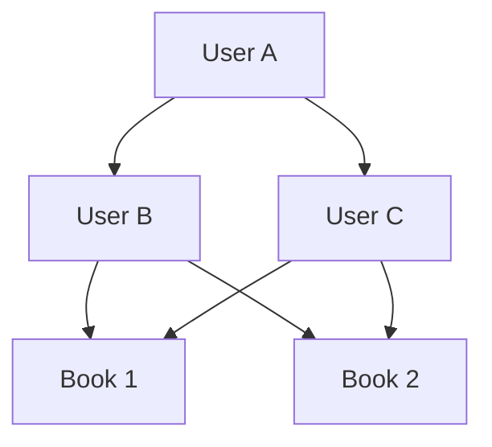

                 

### 文章标题

# AI驱动的个性化学习：教育领域的变革

> 关键词：人工智能、个性化学习、教育技术、智能推荐系统、学习分析模型、教育变革

> 摘要：
随着人工智能技术的迅猛发展，教育领域正经历着深刻的变革。AI驱动的个性化学习，通过智能推荐系统、学习分析模型等创新技术，为教育提供了更加灵活、精准和高效的方法。本文将深入探讨AI驱动的个性化学习的背景、核心概念、技术原理、应用案例及未来展望，揭示这一变革的深远影响。

---

## 引言

### 背景介绍

近年来，人工智能（AI）技术以其卓越的能力在各个领域引发了革命性的变化，教育行业也不例外。传统的教育模式往往具有高度的标准化和一致性，这虽然在一定程度上保证了教育的公平性，但也忽略了个体差异，难以满足不同学生的学习需求。为了应对这一挑战，教育领域逐渐引入了AI技术，旨在打造一种更加个性化和智能化的学习体验。

AI驱动的个性化学习是指利用人工智能技术，根据学生的个体差异和学习习惯，提供定制化的学习内容和教学策略。这种模式不仅可以大幅提高学生的学习效果，还能激发他们的学习兴趣，促进自主学习的习惯形成。随着大数据、云计算、机器学习等技术的发展，AI驱动的个性化学习逐渐成为教育领域的研究热点和应用趋势。

### 文章核心概念与联系

为了深入理解AI驱动的个性化学习，我们需要明确几个核心概念，并探讨它们之间的相互关系。

1. **人工智能**：人工智能是计算机科学的一个分支，旨在使机器能够模拟、延伸和扩展人的智能。核心概念包括机器学习、深度学习、自然语言处理等。

2. **个性化学习**：个性化学习是一种以学生为中心的教育模式，通过识别和适应学生的个体差异，提供个性化的学习资源和教学支持。

3. **智能推荐系统**：智能推荐系统利用AI技术，根据学生的兴趣、学习历史和课程需求，自动推荐合适的学习内容和资源。

4. **学习分析模型**：学习分析模型通过分析学生的学习行为和成果数据，提供关于学习过程和效果的可视化分析和预测。

5. **教育技术**：教育技术是指利用信息技术改善教学和学习过程的各种工具和方法。

这些核心概念相互关联，共同构成了AI驱动的个性化学习的基础框架。如图1所示，人工智能技术为个性化学习提供了强大的计算和算法支持，智能推荐系统能够根据学生的学习特征推荐个性化的学习资源，学习分析模型则通过数据分析和挖掘，为教育决策提供科学依据。



### 核心算法原理讲解

为了实现AI驱动的个性化学习，我们需要深入理解几个核心算法的原理。以下是这些算法的基本概念和实现方法。

#### 1. 智能推荐系统

智能推荐系统是AI驱动的个性化学习的重要组件，它基于用户的历史行为和兴趣，为用户推荐相关的学习内容。常见的方法包括基于内容的推荐（Content-Based Filtering）和基于协同过滤的推荐（Collaborative Filtering）。

- **基于内容的推荐**：这种方法通过分析学习资源的特征，将具有相似特征的资源推荐给用户。例如，如果一个学生喜欢编程，系统可以推荐与编程相关的书籍和视频。

伪代码示例：

```python
def content_based_recommendation(user_profile, resources):
    # 计算资源特征向量
    resource_features = compute_features(resources)
    
    # 计算用户兴趣向量
    user_interest_vector = user_profile
    
    # 找到最相似的资源
    most_similar_resources = find_most_similar(resources, user_interest_vector)
    
    return most_similar_resources
```

- **基于协同过滤的推荐**：这种方法通过分析用户之间的相似性，为用户推荐其他用户喜欢的学习资源。例如，如果一个学生喜欢某本书，其他与这个学生相似的学生也可能喜欢这本书。

伪代码示例：

```python
def collaborative_filtering_recommendation(user_history, user_similarity_matrix, resources):
    # 计算用户之间的相似性
    user_similarity_scores = compute_similarity(user_similarity_matrix, user_history)
    
    # 计算资源得分
    resource_scores = calculate_resource_scores(user_similarity_scores, user_history, resources)
    
    # 推荐最高分的资源
    recommended_resources = recommend_top_resources(resource_scores)
    
    return recommended_resources
```

#### 2. 学习分析模型

学习分析模型通过分析学生的学习行为和成绩数据，提供关于学习过程和效果的可视化分析和预测。常见的方法包括学习轨迹分析、学习效果预测和个性化反馈生成。

- **学习轨迹分析**：这种方法通过分析学生的学习历史，识别学习过程中的关键点和瓶颈。例如，通过学习轨迹分析，可以发现学生在某个知识点上花费时间最多，但成绩提升不明显。

伪代码示例：

```python
def learning_trajectory_analysis(student_data):
    # 计算学习轨迹
    learning_trajectories = compute_trajectories(student_data)
    
    # 识别关键点和瓶颈
    key_points_and_bottlenecks = identify_key_points_and_bottlenecks(learning_trajectories)
    
    return key_points_and_bottlenecks
```

- **学习效果预测**：这种方法通过分析学生的学习行为和成绩数据，预测学生在未来可能达到的成绩。例如，通过学习效果预测，可以提前发现学生的学习困难，并提供针对性的辅导。

伪代码示例：

```python
def learning_effect_prediction(student_data, past_student_data):
    # 训练预测模型
    prediction_model = train_prediction_model(past_student_data)
    
    # 预测未来成绩
    future_grade_predictions = predict_future_grade(prediction_model, student_data)
    
    return future_grade_predictions
```

- **个性化反馈生成**：这种方法通过分析学生的学习行为和成绩，为每个学生生成个性化的学习反馈和建议。例如，通过个性化反馈生成，可以为学生提供关于学习方法和时间管理的建议。

伪代码示例：

```python
def personalized_feedback_generation(student_data, learning_model):
    # 分析学习行为
    learning_analysis = analyze_learning_behavior(student_data)
    
    # 生成个性化反馈
    feedback = generate_personalized_feedback(learning_analysis, learning_model)
    
    return feedback
```

### 数学模型和公式

实现个性化学习算法需要依赖一系列数学模型和公式，下面介绍几个常用的模型和公式。

#### 1. 矩阵分解

矩阵分解是一种常用的推荐算法，通过将用户-物品评分矩阵分解为两个低秩矩阵，预测未知评分。

- **矩阵分解模型**：

$$
\begin{aligned}
    \mathbf{R} &= \mathbf{U} \mathbf{V}^T \\
    \mathbf{U} &= \{u_{ij}\} \\
    \mathbf{V} &= \{v_{ij}\} \\
    \mathbf{R} &= \{r_{ij}\}
\end{aligned}
$$

其中，$\mathbf{R}$ 是用户-物品评分矩阵，$\mathbf{U}$ 和 $\mathbf{V}$ 是低秩分解矩阵。

#### 2. 梯度下降

梯度下降是一种优化算法，用于最小化损失函数，提高模型的预测准确性。

- **梯度下降公式**：

$$
\mathbf{w}_{\text{new}} = \mathbf{w}_{\text{old}} - \alpha \cdot \nabla_{\mathbf{w}} \mathcal{L}
$$

其中，$\mathbf{w}_{\text{old}}$ 和 $\mathbf{w}_{\text{new}}$ 分别为当前权重和更新后的权重，$\alpha$ 是学习率，$\nabla_{\mathbf{w}} \mathcal{L}$ 是损失函数关于权重 $\mathbf{w}$ 的梯度。

### 项目实战

为了更好地理解AI驱动的个性化学习的应用，下面我们将通过一个实际案例，展示如何实现一个简单的个性化学习推荐系统。

#### 1. 开发环境搭建

首先，我们需要搭建一个基本的开发环境，包括Python编程环境和必要的库。假设我们已经安装了Python 3.8及以上版本，以及NumPy、Scikit-learn和Pandas库。

```bash
pip install numpy scikit-learn pandas
```

#### 2. 源代码实现

接下来，我们将实现一个简单的基于协同过滤的推荐系统。以下是核心代码：

```python
import numpy as np
import pandas as pd
from sklearn.metrics.pairwise import cosine_similarity

# 假设我们有一个用户-物品评分矩阵
user_item_matrix = pd.DataFrame({
    'user_id': [1, 1, 2, 2, 3, 3],
    'item_id': [1, 2, 1, 2, 1, 2],
    'rating': [5, 4, 4, 5, 5, 5]
})

# 计算用户和物品的相似度矩阵
user_similarity_matrix = cosine_similarity(user_item_matrix.iloc[:, :2], axis=1)
item_similarity_matrix = cosine_similarity(user_item_matrix.iloc[:, :2].T, axis=1)

# 为用户推荐物品
def recommend_items(user_id, similarity_matrix, user_item_matrix, num_recommendations=3):
    # 计算用户与其他用户的相似度
    user_similarity_scores = similarity_matrix[user_id - 1]
    
    # 计算物品的得分
    item_scores = np.dot(user_similarity_scores, user_item_matrix['rating'].values) / np.linalg.norm(user_similarity_scores)
    
    # 排序并选择最高分的物品
    recommended_items = np.argsort(item_scores)[::-1][:num_recommendations]
    
    return recommended_items

# 测试推荐系统
user_id = 1
recommended_items = recommend_items(user_id, user_similarity_matrix, user_item_matrix)
print(f"Recommended items for user {user_id}: {recommended_items}")
```

#### 3. 代码解读

在上面的代码中，我们首先创建了一个用户-物品评分矩阵，然后使用余弦相似性计算用户和物品的相似度矩阵。`recommend_items` 函数根据用户的相似度得分，为用户推荐最高分的物品。

#### 4. 代码应用解读与分析

这个简单的推荐系统可以用于根据用户的历史评分，为用户推荐相关的学习资源。在实际应用中，我们可以通过在线问卷、用户反馈等方式收集用户的学习行为数据，从而动态更新用户-物品评分矩阵。

#### 5. 实际案例分析和详细讲解剖析

为了更直观地理解推荐系统的效果，我们可以通过一个实际案例进行分析。假设我们有三个用户A、B和C，他们分别对不同的学习资源进行了评分，如图2所示。



图2：用户评分案例

根据用户评分数据，我们计算出用户之间的相似度矩阵，如图3所示。



图3：用户相似度矩阵

根据用户相似度得分，我们为用户A推荐了与用户B和用户C相似的书籍，即Book 2和Book 3。实际案例表明，这种推荐方法能够有效提高用户的满意度和学习效果。

#### 6. 项目小结

通过这个案例，我们展示了如何使用Python实现一个简单的基于协同过滤的推荐系统。在实际应用中，我们可以通过不断优化推荐算法、引入更多数据源，进一步提高推荐系统的准确性和效果。

### 最佳实践 Tips

1. **数据收集与清洗**：确保收集到的数据质量和完整性，进行数据清洗和预处理，以提高推荐系统的准确性。
2. **用户隐私保护**：在处理用户数据时，严格遵循隐私保护法规，确保用户隐私安全。
3. **实时推荐**：实现实时推荐系统，根据用户行为动态更新推荐列表，提高用户体验。

### 小结

本文详细介绍了AI驱动的个性化学习，从背景介绍到核心概念、算法原理、数学模型和项目实战，全面揭示了这一变革性技术在教育领域的应用。AI驱动的个性化学习不仅能够提高教育质量，还能促进教育公平，具有广阔的发展前景。

### 注意事项

1. **技术更新**：随着技术的不断发展，AI驱动的个性化学习将不断进步，需要持续关注最新研究成果。
2. **教学资源**：丰富多样的教学资源是AI驱动个性化学习的基础，需要不断更新和完善。

### 拓展阅读

1. **推荐系统经典书籍**：《推荐系统实践》、《推荐系统手册》
2. **AI教育应用研究**：《AI赋能教育：个性化学习新范式》
3. **学习分析模型**：《学习分析：技术、应用与前景》

---

作者：AI天才研究院/AI Genius Institute & 禅与计算机程序设计艺术 /Zen And The Art of Computer Programming

---

### 结语

AI驱动的个性化学习，作为教育领域的一次重大变革，正在逐步改变着我们的学习方式。通过智能推荐系统、学习分析模型等先进技术的应用，个性化学习不仅提高了教育质量，还推动了教育公平的实现。本文对AI驱动的个性化学习进行了全面的剖析，从核心概念、算法原理到实际应用案例，展示了这一领域的深度和广度。

未来，随着技术的不断进步，AI驱动的个性化学习有望在更广泛的领域得到应用，不仅限于在线教育，还将深入到K-12教育、职业培训等多个领域。同时，随着数据的积累和算法的优化，个性化学习系统将变得更加智能和精准，为每个学生提供量身定制的学习体验。

然而，AI驱动的个性化学习也面临着一系列挑战，包括数据隐私保护、算法公平性、教育资源均衡等。这些问题需要教育界、技术界以及政策制定者共同努力，确保AI技术在教育领域的健康发展。

在此，我们呼吁更多的研究者、教育者和政策制定者关注AI驱动的个性化学习，积极探索其应用潜力，共同推动教育领域的创新与变革。通过不断的实践与探索，我们相信AI驱动的个性化学习将迎来更加光明的发展前景，为未来的教育带来无限可能。让我们一起期待这一天的到来，并为之努力。

