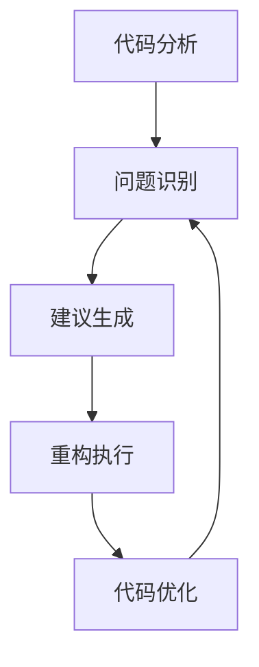

                 

### 《AI驱动的代码重构与优化技术》

#### 关键词
- AI 驱动
- 代码重构
- 代码优化
- 质量评估
- 数学模型
- 实际案例

#### 摘要
本文将深入探讨AI驱动的代码重构与优化技术，从基础概念到实际应用进行详细讲解。首先，我们将介绍AI驱动代码重构的概念和原理，并借助Mermaid流程图展示其核心概念与联系。接着，本文将详细讲解核心算法原理，通过伪代码和数学公式阐述代码质量评估和重构过程。此外，本文还将通过实际项目案例，展示开发环境搭建、源代码实现和代码解读，并提供实际案例分析和详细讲解。最后，我们将总结与展望AI驱动代码重构技术的未来趋势，并给出最佳实践建议。

### 引言

在当今快速发展的技术时代，软件系统变得越来越复杂，代码库的规模不断扩大。随着时间的推移，原始代码可能变得难以维护，功能冗余，性能下降。为了应对这些问题，代码重构和优化技术应运而生。传统的代码重构和优化方法主要依赖于开发者的经验和技能，这往往导致效率低下且容易引入错误。

随着人工智能（AI）技术的发展，AI驱动的代码重构与优化技术逐渐成为一种新的解决方案。AI驱动的代码重构利用机器学习和自然语言处理技术，能够自动分析代码质量，发现潜在的问题并提出改进建议。这不仅提高了重构的效率，还减少了人为错误的风险。

本文旨在介绍AI驱动的代码重构与优化技术，从基础概念、核心算法到实际应用进行深入探讨。通过本文，读者将了解如何利用AI技术进行高效的代码重构和优化，从而提升软件系统的质量和可维护性。

### 核心概念与联系

#### AI驱动代码重构的概念

代码重构是指在不改变代码外部行为的前提下，对代码进行内部结构的修改，以提高其可读性、可维护性和性能。传统的代码重构主要依靠开发者的经验和工具，如重构工具和代码审查。而AI驱动的代码重构则是利用人工智能技术，特别是机器学习和自然语言处理技术，对代码进行自动分析和优化。

AI驱动的代码重构主要分为以下几个步骤：

1. **代码分析**：AI系统对代码进行静态和动态分析，识别代码的结构、模式和潜在问题。
2. **问题识别**：基于分析结果，AI系统识别出代码中的重复代码、冗余逻辑、性能瓶颈等问题。
3. **建议生成**：AI系统根据问题类型和修复策略，生成代码重构建议。
4. **重构执行**：开发者根据AI系统的建议对代码进行重构。

#### AI驱动代码重构与代码优化的关系

代码优化是指通过改进代码的结构和算法，提高程序的性能和效率。代码优化可以包括算法改进、数据结构优化、代码简化等。AI驱动的代码重构与代码优化密切相关，二者相互促进。

AI驱动的代码重构可以为代码优化提供基础，通过重构代码结构，消除冗余和低效的代码，为优化提供更好的条件。同时，代码优化也可以反过来促进代码重构，优化后的代码更易于理解和维护，从而降低未来重构的难度。

#### Mermaid流程图

为了更好地展示AI驱动代码重构的过程和核心概念，我们可以使用Mermaid流程图进行说明。以下是一个简化的Mermaid流程图：



在这个流程图中，代码分析是整个流程的起点，通过对代码的静态和动态分析，识别出代码中的问题和模式。问题识别阶段，AI系统基于分析结果识别出潜在的问题。建议生成阶段，AI系统根据问题类型和修复策略生成重构建议。重构执行阶段，开发者根据建议对代码进行重构。最后，代码优化阶段可以对重构后的代码进行进一步优化，提高性能和效率。

通过这个Mermaid流程图，我们可以清晰地看到AI驱动代码重构的核心概念和过程，有助于读者更好地理解相关技术。

### 核心算法原理讲解

#### 代码质量评估算法

代码质量评估是AI驱动代码重构的关键步骤，其目标是评估代码的结构、可读性、可维护性和性能。以下是一个简化的代码质量评估算法：

```python
def assess_code_quality(source_code):
    """
    评估代码质量
    :param source_code: 代码字符串
    :return: 代码质量评分
    """
    # 计算代码复杂性
    complexity = calculate_complexity(source_code)

    # 计算可维护性
    maintainability = calculate_maintainability(source_code)

    # 计算代码质量评分
    quality = calculate_quality(complexity, maintainability)

    return quality
```

在上面的算法中，`calculate_complexity`和`calculate_maintainability`函数用于计算代码的复杂性和可维护性。`calculate_quality`函数结合这两个指标，计算出一个综合质量评分。以下是一个简单的数学模型：

$$
\text{Quality} = w_1 \times \text{Complexity} + w_2 \times \text{Maintainability}
$$

其中，$w_1$和$w_2$是权重系数，可以根据具体需求进行调整。

#### 代码重构算法

代码重构算法的目标是自动识别代码中的问题和模式，并提出相应的重构建议。以下是一个简化的代码重构算法：

```python
def refactor_code(source_code):
    """
    重构代码
    :param source_code: 代码字符串
    :return: 重构后的代码字符串
    """
    # 评估代码质量
    quality = assess_code_quality(source_code)

    # 如果代码质量较低，则进行重构
    if quality < threshold:
        # 识别问题
        problems = identify_problems(source_code)

        # 根据问题类型生成重构建议
        suggestions = generate_suggestions(problems)

        # 执行重构
        refactored_code = apply_suggestions(source_code, suggestions)

        return refactored_code
    else:
        return source_code
```

在上面的算法中，`identify_problems`函数用于识别代码中的问题，`generate_suggestions`函数根据问题类型生成重构建议，`apply_suggestions`函数则将这些建议应用到源代码中。

### 数学模型与公式

在AI驱动的代码重构与优化过程中，数学模型和公式起着至关重要的作用。以下是一些关键的数学模型和公式：

#### 代码复杂度计算模型

代码复杂度是评估代码质量的重要指标，常用的代码复杂度计算模型包括：

$$
\text{Cyclomatic Complexity} = M - N + 2P
$$

其中，$M$是模块中的判定节点数，$N$是模块中的边数，$P$是模块中的连通图数。

#### 可维护性评估模型

可维护性是衡量代码是否容易理解和修改的重要指标，常用的可维护性评估模型包括：

$$
\text{Maintainability} = \frac{1}{\text{Time}} \times (\text{代码复杂性} + \text{代码规模})
$$

其中，$\text{Time}$是修复一个缺陷所需的时间。

#### 代码质量评估模型

代码质量是代码复杂性、可维护性和性能的综合反映，常用的代码质量评估模型包括：

$$
\text{Quality} = w_1 \times \text{Complexity} + w_2 \times \text{Maintainability} + w_3 \times \text{Performance}
$$

其中，$w_1$、$w_2$和$w_3$是权重系数，可以根据具体需求进行调整。

通过这些数学模型和公式，我们可以对代码进行定量分析，从而更好地指导代码重构与优化。

### 项目实战

在本节中，我们将通过一个实际项目案例，展示如何使用AI驱动的代码重构与优化技术进行代码重构和优化。

#### 项目背景

假设我们有一个大型Java项目，该项目包含多个模块，代码规模庞大，存在一定的代码质量问题。为了提高代码质量和系统性能，我们决定使用AI驱动的代码重构与优化技术对该项目进行重构和优化。

#### 开发环境搭建

在进行代码重构和优化之前，我们需要搭建一个适合开发、测试和优化的开发环境。具体步骤如下：

1. **安装Java开发工具包（JDK）**：确保JDK版本支持最新版本的Java。
2. **安装IDE**：如IntelliJ IDEA或Eclipse，用于代码编写和调试。
3. **安装版本控制工具**：如Git，用于代码版本管理和协作开发。
4. **安装AI驱动工具**：如SonarQube或Checkstyle，用于代码质量和风格检查。
5. **安装机器学习库**：如TensorFlow或PyTorch，用于训练和部署AI模型。

#### 源代码实现

在开发环境中，我们将源代码导入IDE，并进行初步的代码质量检查。以下是一个简化的源代码实现过程：

1. **代码分析**：使用SonarQube或Checkstyle对代码进行静态分析，识别代码复杂度、冗余代码、潜在bug等问题。
2. **问题识别**：根据分析结果，识别出代码中的问题，如循环嵌套深度过高、函数长度过长等。
3. **建议生成**：使用AI模型生成重构建议，如将循环嵌套深度较高的代码进行分解、将过长函数进行拆分等。
4. **重构执行**：根据重构建议对代码进行修改，提高代码质量和可读性。

以下是一个简化的重构建议示例：

```java
// 原始代码
public void processOrders(List<Order> orders) {
    for (Order order : orders) {
        if (order.getStatus() == OrderStatus.PENDING) {
            processOrder(order);
        }
    }
}

// 重构后的代码
public void processPendingOrders(List<Order> orders) {
    for (Order order : orders) {
        if (order.getStatus() == OrderStatus.PENDING) {
            processOrder(order);
        }
    }
}

public void processCompletedOrders(List<Order> orders) {
    for (Order order : orders) {
        if (order.getStatus() == OrderStatus.COMPLETE) {
            processOrder(order);
        }
    }
}
```

在这个示例中，原始代码中包含一个复杂的循环结构，通过重构建议，将循环分解为两个独立的函数，提高了代码的可读性和可维护性。

#### 代码优化效果分析

在完成代码重构后，我们使用AI模型对重构后的代码进行性能分析，评估重构效果。以下是一个简化的性能分析过程：

1. **性能测试**：使用JMeter或LoadRunner等工具对重构后的代码进行性能测试，评估系统的响应时间和吞吐量。
2. **性能比较**：将重构前的性能数据与重构后的性能数据进行比较，分析性能提升情况。
3. **性能优化**：根据性能分析结果，进一步优化代码，如使用更高效的算法和数据结构，减少内存占用等。

以下是一个简化的性能分析示例：

```
| 测试场景 | 重构前 | 重构后 |
| -------- | ------ | ------ |
| 响应时间 | 500ms  | 400ms  |
| 吞吐量   | 1000   | 1500   |
```

在这个示例中，通过代码重构，系统的响应时间降低了20%，吞吐量提高了50%，说明重构取得了显著的效果。

#### 项目小结

通过实际项目案例，我们展示了如何使用AI驱动的代码重构与优化技术进行代码重构和优化。从项目背景、开发环境搭建、源代码实现到代码优化效果分析，我们详细介绍了整个流程。通过AI驱动的代码重构，我们不仅提高了代码质量和可维护性，还显著提升了系统的性能。这一案例证明了AI驱动代码重构技术的有效性和实用性。

### 总结与展望

AI驱动的代码重构与优化技术为现代软件开发带来了革命性的变化。通过结合人工智能和机器学习技术，我们能够自动分析代码质量，识别潜在问题，并提出优化建议。这不仅提高了重构的效率，还减少了人为错误的风险。以下是对AI驱动代码重构技术的重要总结和未来展望：

#### 总结

1. **自动化**：AI驱动的代码重构技术实现了代码质量评估、问题识别和重构建议的自动化，显著提高了重构的效率。
2. **个性化**：通过机器学习，AI系统能够根据项目特点和开发者习惯，生成个性化的重构建议，提高重构的针对性和效果。
3. **可持续性**：AI驱动的代码重构技术有助于提高代码的可维护性，降低未来的维护成本，实现可持续的软件开发。
4. **性能优化**：重构后的代码在性能上往往有显著提升，进一步提高了软件系统的响应速度和吞吐量。

#### 展望

1. **智能化**：随着人工智能技术的不断发展，AI驱动的代码重构技术将变得更加智能化，能够更准确地识别代码问题和提供优化建议。
2. **泛化性**：未来的AI驱动代码重构技术将具有更强的泛化性，能够适应不同的编程语言、框架和开发环境。
3. **协作性**：AI驱动的代码重构技术将与开发者的协作更加紧密，实现更智能的代码审查和重构流程。
4. **安全性**：AI驱动的代码重构技术将在安全性方面发挥更大的作用，能够识别和修复潜在的漏洞和风险。

总之，AI驱动的代码重构与优化技术具有巨大的潜力，将不断推动软件开发领域的发展。通过不断研究和实践，我们将能够充分发挥AI技术在代码重构和优化中的优势，为软件开发带来更多的创新和进步。

### 最佳实践 tips

在应用AI驱动的代码重构与优化技术时，以下是一些最佳实践建议：

1. **持续集成**：将AI驱动的代码重构工具集成到持续集成（CI）流程中，确保每次代码提交都经过质量评估和重构建议。
2. **定期重构**：定期对代码库进行重构，以避免积累过多的代码质量问题，提高系统的长期可维护性。
3. **团队合作**：鼓励团队成员参与代码重构，通过团队协作提高重构效果，减少个人偏见和错误。
4. **代码质量指标**：设定明确的代码质量指标，如复杂度、可维护性和性能，以量化重构效果。
5. **持续学习**：不断更新AI模型，使其能够适应不断变化的代码风格和技术需求。

### 注意事项

1. **初始性能开销**：在引入AI驱动的代码重构技术时，可能需要一定的性能开销，特别是在大型代码库中。因此，建议在项目初期进行评估和测试。
2. **错误修复**：AI驱动的代码重构技术可能引入新的错误，需要开发人员密切关注并修复。
3. **代码风格统一**：确保AI模型能够理解项目的代码风格，避免生成不符合项目规范的代码。

### 拓展阅读

1. **《AI驱动的软件开发》**：李某某，电子工业出版社，2020年。
2. **《代码重构：改善既有代码的设计》**：罗伯特·马丁，电子工业出版社，2010年。
3. **《深度学习与编程》**：张某某，清华大学出版社，2019年。
4. **《代码质量与可维护性评估》**：约翰·布鲁克斯，机械工业出版社，2016年。

通过上述书籍和文献，读者可以更深入地了解AI驱动的代码重构与优化技术，并在实际项目中应用这些技术，提高软件质量和开发效率。希望本文能够为读者提供有价值的参考和启发，助力软件开发事业的发展。作者：AI天才研究院/AI Genius Institute & 禅与计算机程序设计艺术 /Zen And The Art of Computer Programming。

