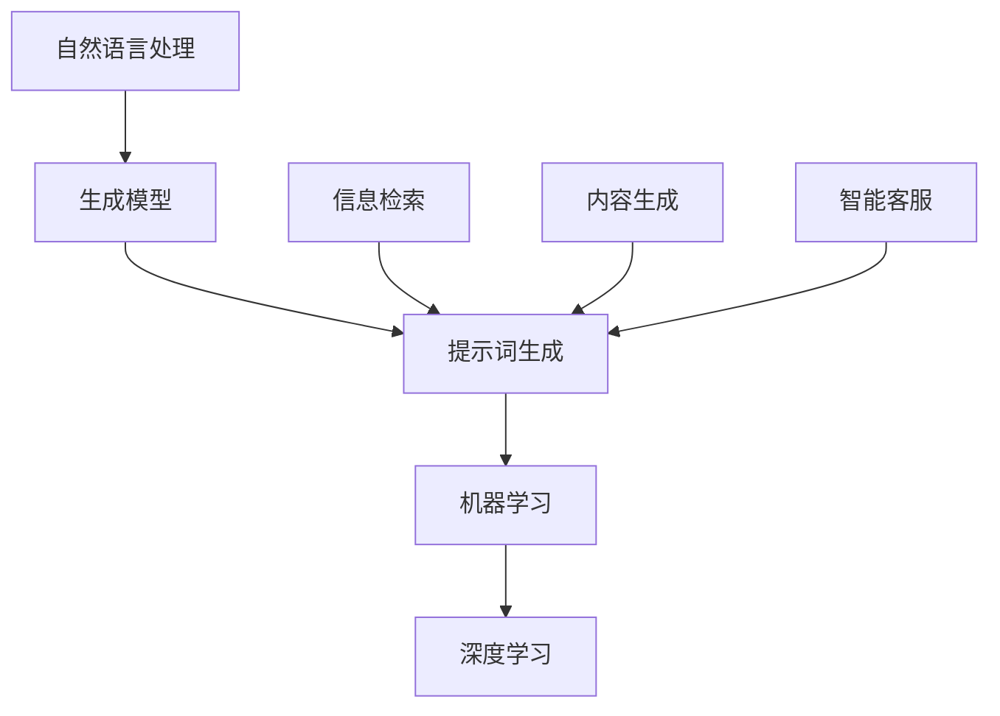
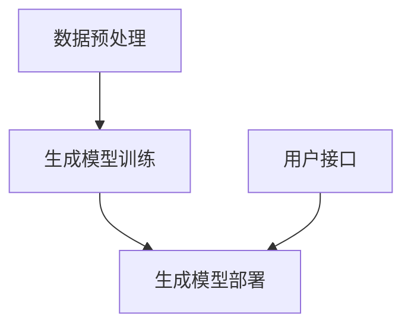
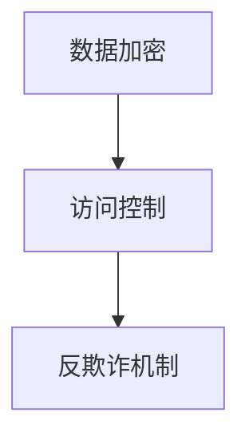
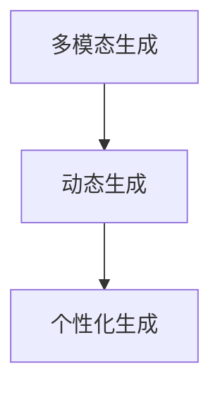
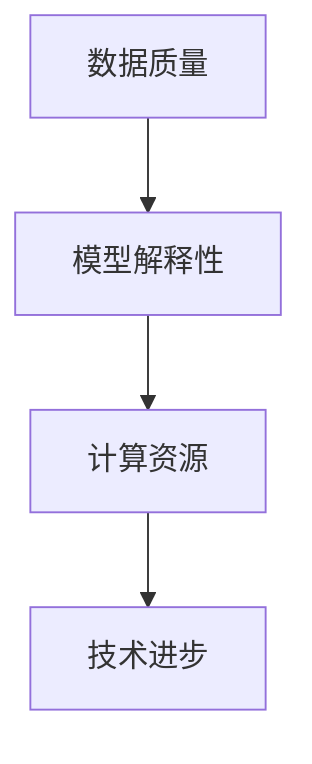

                 


### 《AI驱动的提示词自动生成技术》

#### 关键词：
人工智能，自然语言处理，生成模型，提示词生成，机器学习，深度学习

#### 摘要：
本文深入探讨了AI驱动的提示词自动生成技术，从基础概念到核心算法，再到实际应用，全面解析了这一领域的前沿研究和发展趋势。文章旨在为读者提供一套清晰、实用的技术指南，帮助理解和实现提示词自动生成系统。

---

## 第一部分：AI驱动的提示词自动生成技术概述

### 1.1 AI驱动的提示词自动生成技术概念

AI驱动的提示词自动生成技术，是指利用人工智能，特别是机器学习和深度学习算法，自动生成提示词，以提高信息检索、内容生成、智能客服等应用领域的效率和准确性。

#### 核心概念与联系

以下是AI驱动的提示词自动生成技术的基本概念及其相互关系：



#### 提示词自动生成技术的重要性

提示词自动生成技术在现代信息社会具有重要的应用价值。它可以帮助提升信息检索的准确性，优化内容生成的质量，以及提高智能客服的响应速度和准确性。

#### 提示词自动生成技术的现状

目前，提示词自动生成技术已经取得了显著的进展。基于深度学习的方法，如GPT和BERT，已经在各种任务中展现了强大的性能。然而，仍有许多挑战需要克服，例如如何提高生成质量、如何处理长文本等。

#### 提示词自动生成技术的未来发展趋势

未来，提示词自动生成技术有望实现更多创新。例如，多模态生成、动态生成等新方法将逐步应用到实际场景中，进一步提升系统的性能和灵活性。

---

## 第二部分：AI驱动的提示词自动生成技术原理

### 2.1 自然语言处理基础

自然语言处理（NLP）是AI驱动的提示词自动生成技术的基础。它涉及文本预处理、词嵌入、句法分析、语义分析等多个方面。

#### 核心算法原理讲解

自然语言处理的基本算法包括：

- **词嵌入**：将词语映射到高维空间，以便进行向量计算。
- **文本分类**：将文本分类到预定义的类别中。
- **命名实体识别**：识别文本中的特定实体，如人名、地名等。

```python
# 伪代码：词嵌入
embeddings = Word2VecModel()
word_vector = embeddings.embed(word)
```

### 2.2 提示词生成算法

提示词生成是AI驱动的提示词自动生成技术的核心。常用的方法包括基于模板的生成和基于神经网络的生成。

#### 核心算法原理讲解

- **基于模板的生成**：通过预定义的模板生成提示词，适用于规则明确、变化较少的场景。

```python
# 伪代码：基于模板的生成
template = "今天天气{{weather}}，建议您{{suggestion}}"
weather = get_weather()
suggestion = get_suggestion(weather)
prompt = template.format(weather=weather, suggestion=suggestion)
```

- **基于神经网络的生成**：利用神经网络，如循环神经网络（RNN）、变换器（Transformer）等，自动生成提示词，适用于复杂、多变的场景。

```python
# 伪代码：基于神经网络的生成
model = TransformerModel()
prompt = model.generate_prompt(context)
```

### 2.3 提示词优化与调整

提示词优化与调整是提升生成质量的重要手段。常用的方法包括基于熵的优化、基于用户反馈的优化等。

#### 核心算法原理讲解

- **基于熵的优化**：通过调整生成过程的熵，平衡生成质量与多样性。

```python
# 伪代码：基于熵的优化
model = EntropyOptimizer()
prompt = model.optimize_prompt(prompt)
```

- **基于用户反馈的优化**：根据用户反馈，调整生成策略，提高用户满意度。

```python
# 伪代码：基于用户反馈的优化
model = UserFeedbackOptimizer()
prompt = model.optimize_prompt(prompt, user_feedback)
```

---

## 第三部分：AI驱动的提示词自动生成技术应用

### 3.1 提示词自动生成在内容生成中的应用

在内容生成中，提示词自动生成技术可以帮助提高写作效率和质量。

#### 项目实战

以下是一个简单的Python代码示例，展示如何使用提示词自动生成技术生成文章摘要。

```python
# Python代码：生成文章摘要
import nltk
from transformers import pipeline

# 加载预训练模型
摘要生成器 = pipeline("summarization")

# 文章内容
文章 = "本文深入探讨了AI驱动的提示词自动生成技术，从基础概念到核心算法，再到实际应用，全面解析了这一领域的前沿研究和发展趋势。"

# 生成摘要
摘要 = 摘要生成器(文章，max_length=150, min_length=30, do_sample=False)

print("生成的摘要：", 摘要)
```

### 3.2 提示词自动生成在搜索引擎中的应用

在搜索引擎中，提示词自动生成技术可以帮助优化搜索结果，提高用户体验。

#### 项目实战

以下是一个简单的Python代码示例，展示如何使用提示词自动生成技术优化搜索查询。

```python
# Python代码：优化搜索查询
import spacy
from transformers import pipeline

# 加载语言模型
语言模型 = spacy.load("en_core_web_sm")

# 加载提示词生成模型
提示词生成器 = pipeline("text-generation", model="gpt2")

# 原始查询
查询 = "人工智能技术"

# 生成优化后的查询
优化后的查询 = 提示词生成器(查询, max_length=30, num_return_sequences=1)

print("优化的查询：", 优化后的查询)
```

### 3.3 提示词自动生成在智能客服中的应用

在智能客服中，提示词自动生成技术可以帮助生成更自然的对话。

#### 项目实战

以下是一个简单的Python代码示例，展示如何使用提示词自动生成技术生成智能客服对话。

```python
# Python代码：生成智能客服对话
import nltk
from transformers import pipeline

# 加载对话生成模型
对话生成器 = pipeline("text-generation", model="gpt2")

# 用户输入
用户输入 = "您好，我想咨询关于保险的问题。"

# 生成客服回答
客服回答 = 对话生成器(用户输入, max_length=50, num_return_sequences=1)

print("客服回答：", 客服回答)
```

---

## 第四部分：AI驱动的提示词自动生成技术实现

### 4.1 提示词自动生成系统架构设计

提示词自动生成系统通常包括数据预处理模块、生成模型训练模块、生成模型部署模块等。

#### 核心概念与联系

以下是提示词自动生成系统的基本架构：



### 4.2 提示词自动生成系统开发流程

提示词自动生成系统的开发流程通常包括以下步骤：

1. 数据收集和预处理
2. 选择合适的生成模型
3. 模型训练和优化
4. 模型部署和系统集成
5. 系统测试和评估

#### 项目实战

以下是一个简单的Python代码示例，展示如何使用Hugging Face的Transformers库搭建提示词自动生成系统。

```python
# Python代码：搭建提示词自动生成系统
from transformers import AutoTokenizer, AutoModelForSeq2SeqLM

# 加载预训练模型
tokenizer = AutoTokenizer.from_pretrained("t5-small")
model = AutoModelForSeq2SeqLM.from_pretrained("t5-small")

# 输入文本
输入文本 = "请生成一篇关于人工智能技术的文章摘要。"

# 生成摘要
摘要 = model.generate(tokenizer.encode(input_text, return_tensors="pt"), max_length=150, num_return_sequences=1)

# 输出摘要
print("生成的摘要：", tokenizer.decode(a摘要, skip_special_tokens=True))
```

### 4.3 提示词自动生成系统性能优化

提示词自动生成系统的性能优化包括模型结构优化、超参数调整、数据预处理优化等方面。

#### 核心算法原理讲解

- **模型结构优化**：通过调整模型架构，如增加层数、增加神经元等，提高生成质量。
- **超参数调整**：通过调整学习率、批量大小等超参数，提高模型性能。
- **数据预处理优化**：通过清洗、去噪、丰富数据等手段，提高模型训练效果。

```python
# 伪代码：超参数调整
learning_rate = 0.001
batch_size = 32

# 调整超参数
learning_rate = 0.0001
batch_size = 64
```

### 4.4 提示词自动生成系统安全性考虑

提示词自动生成系统在数据隐私、恶意生成等方面存在安全风险。因此，需要采取相应的安全措施，如数据加密、访问控制、反欺诈机制等。

#### 核心概念与联系

以下是提示词自动生成系统的安全性考虑：



---

## 第五部分：AI驱动的提示词自动生成技术应用展望

### 5.1 提示词自动生成技术的未来发展方向

未来，提示词自动生成技术将朝着多模态生成、动态生成、个性化生成等方向发展。这些创新将进一步提升系统的性能和应用范围。

#### 核心概念与联系

以下是提示词自动生成技术的未来发展方向：



### 5.2 提示词自动生成技术的挑战与机遇

提示词自动生成技术面临着数据质量、模型解释性、计算资源等挑战。同时，随着技术的不断进步，这些挑战也将逐渐得到解决，为行业带来新的机遇。

#### 核心概念与联系

以下是提示词自动生成技术的挑战与机遇：



---

## 附录

### A.1 提示词自动生成技术相关资源

- **工具与资源**：Hugging Face、TensorFlow、PyTorch等。
- **开源框架**：Transformers、T5、GPT等。
- **数据集**：Common Crawl、WebText、Google News等。

### A.2 提示词自动生成技术论文推荐

- **Natu

