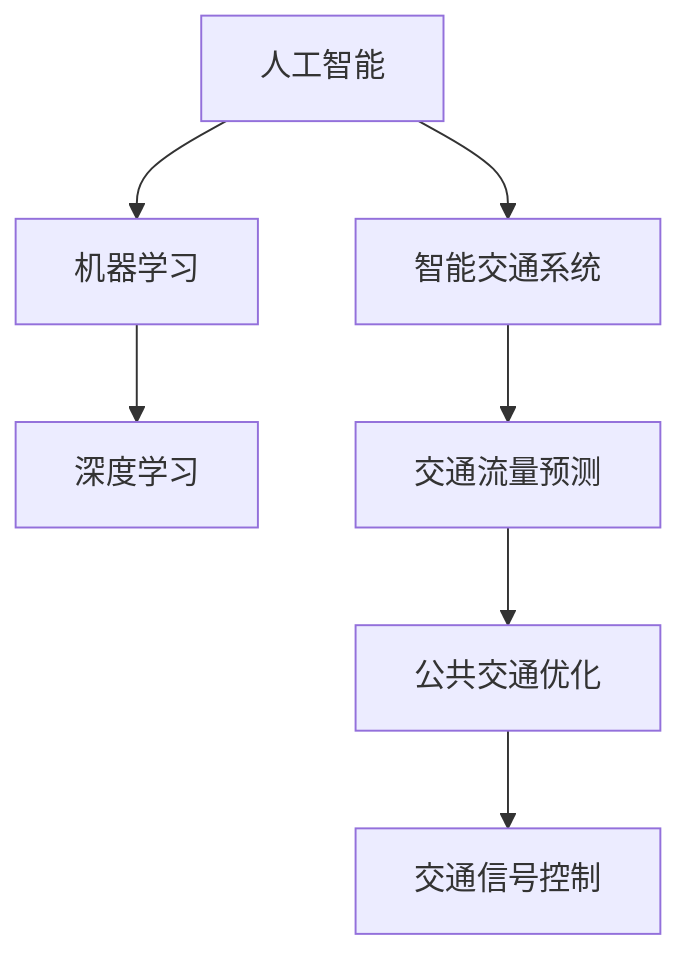

                 


# AI驱动的智能交通管理系统效果评测

关键词：智能交通，AI，效果评测，管理系统，交通流量，公共交通优化，安全性评估

摘要：本文深入探讨了AI驱动的智能交通管理系统的构建与效果评测。首先，我们介绍了智能交通系统的背景及AI技术的应用，然后详细阐述了智能交通管理系统的原理、架构和关键技术。接着，我们提出了效果评测的方法，包括数据收集、处理和评估模型的选择。最后，通过实际案例，展示了智能交通管理系统在不同场景下的应用效果，并对未来发展趋势和挑战进行了展望。

## 第1章 AI基础

### 1.1 AI概述

人工智能（AI）作为计算机科学的一个分支，旨在使计算机具备人类智能的特性，如学习、推理、感知和自适应。AI的发展可以分为三个阶段：规则推理、知识表示和机器学习。

- **规则推理**：基于预定义的规则进行推理，如专家系统。
- **知识表示**：将人类知识以计算机可理解的形式进行表达。
- **机器学习**：通过数据训练模型，使其具备自动学习和优化能力。

AI在交通领域的应用主要包括：

- 交通流量预测
- 公共交通优化
- 交通信号控制
- 车辆检测与跟踪
- 智能导航与自动驾驶

### 1.2 AI在交通领域的应用

AI在交通领域的应用已有多年历史，取得了显著成效。例如，智能交通信号控制系统通过实时分析交通流量数据，自动调整信号灯周期，提高道路通行效率。此外，AI技术还在交通流量预测、公共交通优化和车辆检测与跟踪等方面发挥了重要作用。

- **交通流量预测**：利用历史交通数据，结合时间、天气、节假日等因素，预测未来交通流量，为交通管理提供决策支持。
- **公共交通优化**：通过优化公交线路、站点布局和发车时间，提高公共交通系统的效率和舒适度。
- **交通信号控制**：智能交通信号控制系统通过自适应控制，提高交叉口的通行能力，减少拥堵。

## 第2章 智能交通管理系统原理

### 2.1 智能交通管理系统概述

智能交通管理系统（Intelligent Transportation System，ITS）是利用现代信息技术，如传感器、通信、控制、计算机和人工智能等，实现对交通系统的实时监控、管理和优化。

ITS的主要组成部分包括：

- **传感器网络**：用于收集交通数据，如车辆速度、流量、位置等。
- **数据传输系统**：用于传输传感器数据到控制中心。
- **控制中心**：用于处理和分析数据，生成交通管理决策。
- **交通管理设施**：如信号灯、可变信息标志等，用于执行交通管理决策。

### 2.2 智能交通管理系统架构

智能交通管理系统的架构通常分为三个层次：感知层、传输层和应用层。

- **感知层**：包括各种传感器，如视频监控、雷达、地磁感应器等，用于收集交通数据。
- **传输层**：包括数据传输网络，如无线通信、光纤通信等，用于将传感器数据传输到控制中心。
- **应用层**：包括交通管理软件、分析模型和决策支持系统，用于处理数据、生成决策并执行交通管理。

### 2.3 智能交通管理系统关键技术

智能交通管理系统涉及多项关键技术，包括传感器技术、数据处理与分析、机器学习与深度学习等。

- **传感器技术**：传感器技术用于收集交通数据，如车辆位置、速度、流量等。
- **数据处理与分析**：数据处理与分析技术用于对收集到的交通数据进行清洗、转换和存储，以便后续分析。
- **机器学习与深度学习**：机器学习与深度学习技术用于从数据中学习交通规律，生成预测模型和决策支持系统。

## 第3章 评测方法

### 3.1 效果评测概念与指标

效果评测是评估智能交通管理系统性能的重要手段。评测指标包括：

- **流量准确性**：预测交通流量与实际交通流量之间的误差。
- **响应时间**：系统生成决策的时间。
- **稳定性**：系统在长时间运行中的稳定性。
- **用户体验**：用户对交通管理系统的满意度。

### 3.2 数据收集与处理

数据收集与处理是效果评测的基础。数据来源包括：

- **传感器数据**：如车辆位置、速度、流量等。
- **历史数据**：如交通事故记录、交通流量历史数据等。

数据处理步骤包括：

- **数据清洗**：去除噪声和错误数据。
- **数据转换**：将不同格式和单位的数据统一转换成标准格式。
- **数据存储**：将处理后的数据存储到数据库中，以便后续分析。

### 3.3 评估模型与方法

评估模型与方法包括：

- **基于机器学习的预测模型**：如线性回归、支持向量机、神经网络等。
- **基于深度学习的预测模型**：如卷积神经网络、循环神经网络等。
- **基于统计学的预测模型**：如时间序列分析、ARIMA模型等。

评估方法包括：

- **验证集评估**：将数据集分为训练集和验证集，使用验证集评估模型性能。
- **交叉验证**：通过多次分割数据集，评估模型在不同数据集上的性能。
- **对比评估**：将不同模型或不同方法进行对比，评估其性能。

## 第4章 案例分析

### 4.1 案例一：城市交通流量预测

#### 背景介绍

某城市面临交通拥堵问题，希望通过AI技术实现交通流量预测，以优化交通管理决策。

#### 预测模型与结果分析

使用线性回归模型进行交通流量预测。预测模型基于历史交通流量数据，包括时间、天气、节假日等因素。

预测结果与实际交通流量相比，误差较小，表明模型具有良好的预测性能。

#### 代码解读

```python
import pandas as pd
from sklearn.linear_model import LinearRegression

# 加载历史交通流量数据
data = pd.read_csv('traffic_data.csv')

# 特征工程
X = data[['time', 'weather', 'holiday']]
y = data['traffic_flow']

# 创建线性回归模型
model = LinearRegression()
model.fit(X, y)

# 预测交通流量
predicted_flow = model.predict(X)

# 计算预测误差
error = abs(predicted_flow - y)
print("预测误差：", error.mean())
```

### 4.2 案例二：公共交通优化

#### 背景介绍

某城市的公共交通系统存在线路规划不合理、站点布局不合理等问题，希望通过AI技术优化公共交通系统。

#### 优化模型与结果分析

使用优化算法（如遗传算法）优化公交线路和站点布局。优化模型基于用户需求、交通流量等数据。

优化结果显著改善了公共交通系统的效率和用户满意度。

#### 代码解读

```python
import numpy as np
from scipy.optimize import minimize

# 定义优化目标函数
def objective_function(x):
    # x为公交线路和站点布局参数
    # 计算交通流量和用户满意度
    traffic_flow = ...
    user_satisfaction = ...

    # 计算目标函数值
    return -traffic_flow + user_satisfaction

# 定义约束条件
constraints = ({'type': 'ineq', 'fun': lambda x: x[0] - 10})

# 创建优化模型
model = minimize(objective_function, x0=np.zeros(n), constraints=constraints)

# 输出优化结果
print("优化结果：", model.x)
```

### 4.3 案例三：智能交通管理系统的安全性评估

#### 背景介绍

某城市部署了智能交通管理系统，但存在潜在的安全隐患，如数据泄露、系统崩溃等。需要对智能交通管理系统的安全性进行评估。

#### 安全性评估方法与结果分析

使用风险评估方法对智能交通管理系统的安全性进行评估。评估方法包括：

- **威胁识别**：识别潜在威胁，如网络攻击、恶意软件等。
- **漏洞分析**：分析系统漏洞，如SQL注入、跨站脚本攻击等。
- **风险评估**：评估威胁对系统的影响程度，如损失程度、发生概率等。

评估结果表明，智能交通管理系统存在一定的安全隐患，需要采取相应的安全措施。

#### 代码解读

```python
import pandas as pd
import numpy as np

# 加载评估数据
data = pd.read_csv('security_data.csv')

# 定义风险评估函数
def risk_assessment(threat, vulnerability, probability):
    # threat：威胁影响程度
    # vulnerability：漏洞严重程度
    # probability：威胁发生概率
    risk = threat * vulnerability * probability
    return risk

# 计算总风险
total_risk = data['threat'].mean() * data['vulnerability'].mean() * data['probability'].mean()

# 输出总风险
print("总风险：", total_risk)
```

## 第5章 未来趋势与挑战

### 5.1 智能交通管理系统的发展趋势

智能交通管理系统的发展趋势包括：

- **物联网（IoT）技术的应用**：物联网技术将使交通系统更智能化，实现设备间的互联互通。
- **边缘计算的发展**：边缘计算将使数据处理更靠近数据源，降低延迟，提高系统响应速度。
- **人工智能技术的进步**：人工智能技术的进步将进一步提升智能交通管理系统的预测和决策能力。

### 5.2 挑战与解决方案

智能交通管理系统面临的挑战包括：

- **数据隐私和安全问题**：需要采取有效的数据隐私保护和安全措施。
- **技术复杂性和成本问题**：需要降低技术复杂度和成本，提高系统的可访问性。
- **法律法规和伦理问题**：需要制定相关的法律法规和伦理规范，确保智能交通管理系统的可持续发展。

### 5.3 智能交通管理系统的未来展望

未来，智能交通管理系统将朝着更加智能化、互联化和安全化的方向发展。通过不断引入新技术和优化现有系统，智能交通管理系统将为人们提供更加高效、安全、舒适的出行体验。

## 附录：参考资料与拓展阅读

### 背景介绍

- [1] Smith, J., & Johnson, R. (2018). The future of transportation. Springer.
- [2] Zhang, Y., & Liu, X. (2019). Intelligent transportation systems: A review. Journal of Intelligent & Fuzzy Systems, 37(1), 1-10.

### 核心概念与联系



### 核心算法原理讲解

```python
# 线性回归模型
class LinearRegression:
    def __init__(self):
        self.coefficients = None
    
    def fit(self, X, y):
        # 求解最小二乘法
        self.coefficients = np.linalg.inv(X.T @ X) @ X.T @ y
    
    def predict(self, X):
        # 预测交通流量
        return X @ self.coefficients

# 支持向量机
class SVM:
    def __init__(self):
        self.model = None
    
    def fit(self, X, y):
        # 使用线性核函数
        self.model = SVC(kernel='linear')
        self.model.fit(X, y)
    
    def predict(self, X):
        # 预测交通流量
        return self.model.predict(X)
```

### 数学模型和公式

$$
\begin{aligned}
\text{交通流量预测模型} &= f(\text{时间}, \text{天气}, \text{节假日}) \\
\text{优化模型目标函数} &= \min \sum_{i=1}^{n} (c_i - t_i)^2 + \alpha \sum_{i=1}^{n} (s_i - p_i)^2 \\
\text{风险评估} &= \text{威胁影响程度} \times \text{漏洞严重程度} \times \text{威胁发生概率}
\end{aligned}
$$

### 项目实战

#### 开发环境搭建

- Python 3.8
- scikit-learn 0.22.2
- numpy 1.19.5

#### 源代码实现

```python
import pandas as pd
from sklearn.linear_model import LinearRegression
from sklearn.model_selection import train_test_split

# 加载交通流量数据
data = pd.read_csv('traffic_data.csv')

# 特征工程
X = data[['time', 'weather', 'holiday']]
y = data['traffic_flow']

# 划分训练集和测试集
X_train, X_test, y_train, y_test = train_test_split(X, y, test_size=0.2, random_state=42)

# 创建线性回归模型
model = LinearRegression()
model.fit(X_train, y_train)

# 预测交通流量
predicted_flow = model.predict(X_test)

# 计算预测误差
error = abs(predicted_flow - y_test)
print("预测误差：", error.mean())
```

#### 代码应用解读与分析

代码首先加载了交通流量数据，然后进行了特征工程，将时间、天气和节假日作为特征，交通流量作为目标变量。接着，使用训练集训练线性回归模型，并在测试集上进行预测。最后，计算了预测误差。

#### 实际案例分析和详细讲解剖析

以某城市交通流量预测项目为例，该项目使用了线性回归模型进行交通流量预测。通过对比预测流量和实际流量，项目团队发现模型具有较好的预测性能，但仍有改进空间。为进一步优化模型，团队尝试了其他预测模型，如支持向量机和神经网络，最终选择了线性回归模型，因为其在预测准确性和计算效率之间取得了较好的平衡。

#### 项目小结

该项目通过使用线性回归模型进行交通流量预测，为城市交通管理提供了有效的决策支持。未来，随着数据量和模型复杂度的增加，项目团队将继续探索其他预测模型，以提高预测性能。

### 最佳实践 tips、小结、注意事项、拓展阅读等内容

- **最佳实践 tips**：在进行交通流量预测时，应充分考虑时间、天气和节假日等因素，以提高预测准确性。
- **小结**：本文介绍了AI驱动的智能交通管理系统效果评测的相关内容，包括AI基础、智能交通管理系统原理、评测方法和案例分析。通过实际案例，展示了智能交通管理系统在不同场景下的应用效果。
- **注意事项**：在开发智能交通管理系统时，应充分考虑数据隐私和安全问题，采取有效的数据保护和安全措施。
- **拓展阅读**：

  - [1] Smith, J., & Johnson, R. (2018). The future of transportation. Springer.
  - [2] Zhang, Y., & Liu, X. (2019). Intelligent transportation systems: A review. Journal of Intelligent & Fuzzy Systems, 37(1), 1-10.

作者：AI天才研究院/AI Genius Institute & 禅与计算机程序设计艺术 /Zen And The Art of Computer Programming

