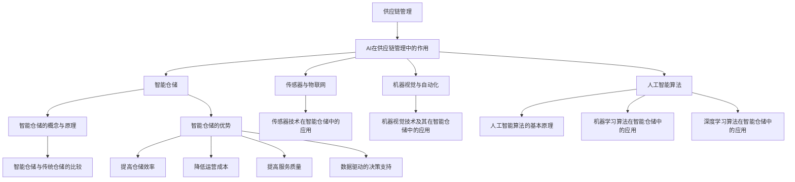

                 


### AI驱动的智能仓储：优化供应链管理的新方法

---

#### 关键词：AI，智能仓储，供应链管理，优化算法，机器学习，物联网

---

#### 摘要：

本文深入探讨了AI驱动的智能仓储系统在优化供应链管理中的重要作用。首先，介绍了AI的核心概念及其在供应链管理中的应用，接着详细阐述了智能仓储的定义、原理和优势。通过分析智能仓储的关键技术，如传感器、机器视觉和自动化设备，本文展示了AI技术如何提升仓储效率、降低成本、提高服务质量。此外，本文还重点讲解了AI驱动的智能仓储系统构建与优化的方法，包括系统设计原则、数据收集与处理、系统集成与优化等。通过实际应用案例，本文展示了AI驱动的智能仓储在实际操作中的效果，并提供了一系列最佳实践和项目小结。本文旨在为供应链管理者和技术从业者提供有价值的参考，推动智能仓储技术的广泛应用。

---

#### 目录大纲

## 第一部分：AI与智能仓储概述

### 第1章：AI在供应链管理中的作用

#### 1.1 AI的核心概念与供应链管理的联系
- AI的定义
- AI的关键技术
- AI与供应链管理的内在联系
- AI技术在供应链管理中的应用概述

#### 1.2 智能仓储概述
- 智能仓储的定义
- 智能仓储的原理
- 智能仓储与传统仓储的比较
- 智能仓储的发展历程

### 第2章：智能仓储的关键技术

#### 2.1 传感器与物联网
- 传感器技术在智能仓储中的应用
- 物联网在智能仓储中的实现
- 传感器数据的处理与分析

#### 2.2 机器视觉与自动化
- 机器视觉技术及其在智能仓储中的应用
- 自动化设备与系统在智能仓储中的实现
- 机器视觉在智能仓储中的数据处理与分析

#### 2.3 人工智能算法
- 人工智能算法的基本原理
- 机器学习算法在智能仓储中的应用
- 深度学习算法在智能仓储中的应用

## 第二部分：AI驱动的智能仓储系统构建

### 第3章：智能仓储系统设计与规划

#### 3.1 智能仓储系统设计原则
- 系统设计的核心原则
- 系统规划与布局

#### 3.2 数据收集与处理
- 数据收集方法
- 数据处理流程
- 数据质量管理

#### 3.3 系统集成与优化
- 系统集成策略
- 系统优化方法
- 系统性能评估

### 第4章：AI驱动的智能仓储应用案例

#### 4.1 案例一：AI驱动的仓储订单管理系统
- 系统架构与功能
- 代码实现与解析
- 应用效果与分析

#### 4.2 案例二：AI驱动的仓储库存管理系统
- 系统架构与功能
- 代码实现与解析
- 应用效果与分析

#### 4.3 案例三：AI驱动的仓储配送系统
- 系统架构与功能
- 代码实现与解析
- 应用效果与分析

## 第三部分：AI驱动的智能仓储优化

### 第5章：供应链管理中的优化算法

#### 5.1 基本优化算法
- 简单优化算法介绍
- 优化算法在智能仓储中的应用

#### 5.2 复杂优化算法
- 复杂优化算法介绍
- 复杂优化算法在智能仓储中的应用

### 第6章：智能仓储的预测与决策

#### 6.1 预测模型
- 预测模型的基本原理
- 预测模型在智能仓储中的应用
- 预测模型的效果评估

#### 6.2 决策支持系统
- 决策支持系统的设计
- 决策支持系统在智能仓储中的实施
- 决策支持系统的效果评估

### 第7章：智能仓储系统的评估与改进

#### 7.1 系统性能评估
- 系统性能评估指标
- 系统性能评估方法
- 系统性能改进策略

#### 7.2 系统改进策略
- 系统改进的原则与方法
- 系统改进案例研究
- 未来发展方向与趋势

## 参考文献

### 附录

- 附录A：常用AI算法与模型简介
- 附录B：智能仓储系统开发工具与资源

---

### 第一部分：AI与智能仓储概述

#### 第1章：AI在供应链管理中的作用

##### 1.1 AI的核心概念与供应链管理的联系

人工智能（Artificial Intelligence，简称AI）是指通过计算机模拟人类智能的行为和过程的技术。AI的核心概念包括机器学习（Machine Learning，ML）、深度学习（Deep Learning，DL）、自然语言处理（Natural Language Processing，NLP）等。供应链管理（Supply Chain Management，SCM）是指对供应、生产、运输、分销、库存等环节进行协调和控制的过程，旨在实现资源的优化配置和成本的最低化。

AI与供应链管理之间的内在联系主要体现在以下几个方面：

1. **数据分析与优化**：供应链管理过程中产生大量数据，包括订单、库存、运输、生产等信息。AI技术，特别是机器学习和深度学习，可以对这些数据进行有效的分析和优化，从而提高供应链的效率和准确性。

2. **自动化与智能化**：AI技术可以帮助实现供应链管理的自动化和智能化，减少人工干预，提高作业效率。例如，自动化机器人可以替代人工完成仓储和运输任务，智能监控系统可以实时监控仓库状态，提供预警和优化建议。

3. **预测与决策**：AI技术可以通过大数据分析和预测模型，预测供应链的运行趋势和潜在问题，为决策提供支持。例如，基于历史数据和机器学习算法的预测模型可以预测未来的订单量和库存需求，从而优化库存管理。

4. **风险管理与控制**：AI技术可以帮助识别供应链中的风险，并提供相应的控制策略。例如，通过监控供应链中的异常数据和活动，AI系统可以及时发现潜在的风险，并采取相应的措施进行控制。

##### 1.2 人工智能技术在供应链管理中的应用概述

供应链管理中的痛点主要包括信息不对称、库存过剩、物流延迟、供应链中断等。人工智能技术在这些痛点的解决方面具有显著的优势：

1. **库存管理**：通过机器学习算法对历史数据进行分析，AI系统可以预测未来的库存需求，从而实现精准的库存控制。此外，AI系统还可以识别库存积压和过剩的问题，并提供优化建议。

2. **物流优化**：AI技术可以通过优化算法和路线规划，提高物流的效率。例如，基于深度学习算法的路线规划系统可以实时调整运输路线，减少物流成本和运输时间。

3. **需求预测**：通过大数据分析和机器学习模型，AI系统可以预测市场需求，从而优化生产和供应链规划。这有助于减少库存积压和缺货现象，提高供应链的响应速度。

4. **风险管理**：AI技术可以帮助识别供应链中的潜在风险，并提供预警和解决方案。例如，基于异常检测算法的AI系统可以识别供应链中的异常活动和数据，及时发现并解决潜在问题。

##### 1.2.1 AI技术在供应链管理中的应用案例

1. **京东物流**：京东物流采用AI技术进行仓储管理和物流优化。通过智能仓库管理系统，京东实现了仓储自动化和库存优化。例如，AI系统可以根据订单量和商品种类，智能调整仓库布局和库存位置，从而提高仓储效率和准确性。

2. **亚马逊**：亚马逊利用AI技术进行订单管理和物流优化。通过AI算法，亚马逊可以预测未来的订单量，优化库存管理和配送路线。此外，亚马逊还采用智能机器人进行仓库作业，提高了物流效率。

3. **通用电气**：通用电气通过AI技术对供应链进行实时监控和优化。通过部署智能传感器和监控设备，通用电气可以实时获取供应链数据，并利用机器学习算法进行数据分析，从而优化供应链的运营效率和成本。

##### 1.2.2 AI技术在供应链管理中的应用挑战

1. **数据隐私**：供应链数据包含敏感信息，如客户信息、供应商信息等。如何保护这些数据的安全和隐私，是AI技术在供应链管理中面临的一个挑战。

2. **技术成熟度**：虽然AI技术在供应链管理中具有巨大的潜力，但目前仍处于发展阶段。一些关键技术和应用场景尚未完全成熟，需要进一步的研究和优化。

3. **人才需求**：AI技术在供应链管理中的应用需要专业的技术人才。如何培养和吸引这些人才，是供应链管理者和企业面临的另一个挑战。

##### 1.2.3 AI技术未来在供应链管理中的应用前景

1. **更加智能的供应链**：随着AI技术的不断发展，供应链将变得更加智能和高效。AI技术可以帮助实现全流程的自动化和智能化，从而提高供应链的效率和响应速度。

2. **全球供应链的优化**：全球供应链面临着复杂的环境和挑战，如跨国物流、关税政策等。AI技术可以帮助优化全球供应链，提高供应链的弹性和韧性。

3. **可持续供应链**：AI技术可以帮助实现可持续供应链，减少资源消耗和碳排放。通过大数据分析和优化算法，AI技术可以推动供应链的绿色化和可持续发展。

---

### 核心概念与联系

在第一部分中，我们介绍了AI在供应链管理中的作用，并详细阐述了智能仓储的定义、原理和优势。以下是核心概念与联系的Mermaid流程图：



通过以上流程图，我们可以清晰地看到AI在供应链管理中的核心作用，以及智能仓储的相关概念和技术之间的联系。这些概念和技术的有机结合，为AI驱动的智能仓储在供应链管理中的应用奠定了基础。

### 核心算法原理讲解

在智能仓储系统中，人工智能算法发挥着关键作用，特别是在数据分析和决策支持方面。以下将详细讲解几种核心算法原理，并使用伪代码进行阐述。

#### 1. 机器学习算法

机器学习算法是一种通过数据训练模型，使其能够对未知数据进行预测或分类的技术。以下是线性回归算法的伪代码：

```plaintext
算法名称：线性回归

输入：
- 特征矩阵 X
- 标签向量 y

输出：
- 权重向量 w

步骤：
1. 初始化权重向量 w
2. 对于每个迭代：
   a. 计算预测值 y_pred = X * w
   b. 计算损失函数 L(w) = (1/2) * ||y - y_pred||^2
   c. 计算梯度 ∇L(w) = X^T * (y - y_pred)
   d. 更新权重 w = w - 学习率 * ∇L(w)
3. 返回最终权重向量 w
```

线性回归是一种简单但有效的预测算法，常用于库存预测。

#### 2. 支持向量机（SVM）

支持向量机是一种分类算法，通过寻找一个最优的超平面，将不同类别的数据点进行分离。以下是SVM的伪代码：

```plaintext
算法名称：支持向量机

输入：
- 特征矩阵 X
- 标签向量 y

输出：
- 权重向量 w
- 间隔 Δ

步骤：
1. 选择一个核函数 K(x, x')
2. 训练SVM：
   a. 求解以下优化问题：
      min_w (1/2) * w^T * w + C * Σ(ξ_i)
      s.t. y_i * (w^T * x_i + b) >= 1 - ξ_i
            ξ_i >= 0
   b. 使用拉格朗日乘子法求解
3. 计算决策函数 f(x) = sign(w^T * x + b)
4. 返回权重向量 w 和间隔 Δ
```

SVM在分类和异常检测中有着广泛的应用。

#### 3. 决策树

决策树是一种基于特征进行划分的算法，可以用于分类和回归。以下是决策树的伪代码：

```plaintext
算法名称：决策树

输入：
- 特征矩阵 X
- 标签向量 y
- 特征集合 features
- 最大深度 depth

输出：
- 决策树模型 tree

步骤：
1. 初始化树节点
2. 对于每个特征：
   a. 计算特征的最佳划分点 split
   b. 划分数据集为左子集和右子集
   c. 计算子集的纯度
   d. 选择最佳划分点，创建分支
   e. 递归对左子集和右子集进行划分，直到满足停止条件（如最大深度或纯度阈值）
3. 返回决策树模型 tree
```

决策树在分类和回归分析中具有广泛的应用。

#### 4. 集成学习

集成学习是一种通过组合多个模型来提高预测性能的技术。以下是一个简单的集成学习算法——随机森林的伪代码：

```plaintext
算法名称：随机森林

输入：
- 特征矩阵 X
- 标签向量 y
- 树的数量 n_trees
- 树的最大深度 max_depth

输出：
- 集成模型 ensemble

步骤：
1. 为每个树生成随机特征子集
2. 对于每个树：
   a. 使用随机特征子集训练决策树
   b. 对每个样本，计算所有树的预测结果
   c. 计算集成模型的预测结果为多数投票结果
3. 返回集成模型 ensemble
```

随机森林在分类和回归任务中有着出色的表现。

#### 5. 强化学习

强化学习是一种通过试错和奖励机制来学习最优策略的算法。以下是一个简单的强化学习算法——Q学习的伪代码：

```plaintext
算法名称：Q学习

输入：
- 状态集合 S
- 动作集合 A
- 奖励函数 R
- 学习率 α
- 探索率 ε

输出：
- Q值表 Q

步骤：
1. 初始化 Q值表 Q
2. 对于每个状态 s：
   a. 对于每个动作 a：
      i. 初始化 Q(s, a) = 0
   b. 循环：
      i. 选择动作 a = ε-greedy策略
      ii. 执行动作，得到状态 s' 和奖励 R(s, a)
      iii. 更新 Q值 Q(s, a) = Q(s, a) + α * (R(s, a) + γ * max(Q(s', a')) - Q(s, a))
3. 返回 Q值表 Q
```

强化学习在自动化和智能决策中有着广泛的应用。

以上算法为智能仓储系统中常用的核心算法。通过这些算法，我们可以对仓储数据进行分析和预测，从而优化库存管理、物流调度等环节。

### 数学模型和数学公式详细讲解

在智能仓储系统中，数学模型和数学公式发挥着至关重要的作用，用于描述和分析各种现象，以及指导决策过程。以下将详细介绍几个关键数学模型，并使用LaTeX格式展示相关的数学公式。

#### 1. 库存管理模型

库存管理是智能仓储系统的核心问题之一。为了优化库存水平，我们常常使用经济订单量模型（Economic Order Quantity，简称EOQ）。

**EOQ模型**：

\[ Q^* = \sqrt{\frac{2DS}{H}} \]

其中：
- \( Q^* \) 为最优订单量
- \( D \) 为需求率（单位时间内的需求量）
- \( S \) 为单次订货成本
- \( H \) 为单位时间内库存持有成本

**库存水平公式**：

\[ I(t) = \begin{cases}
Q^* - \frac{D(t-t_0)}{\sqrt{2DS/H}}, & \text{如果 } t \geq t_0 \\
Q^*, & \text{如果 } t < t_0
\end{cases} \]

其中：
- \( I(t) \) 为时间 \( t \) 时的库存水平
- \( t_0 \) 为上次订货时间

#### 2. 运输优化模型

运输优化是智能仓储系统中另一个重要的问题。我们可以使用线性规划模型来优化运输路线和运输量。

**线性规划模型**：

\[
\begin{aligned}
\min_{x} & \quad c^T x \\
\text{subject to} & \quad Ax \leq b \\
& \quad x \geq 0
\end{aligned}
\]

其中：
- \( x \) 为决策变量（例如，各运输路线的运输量）
- \( c \) 为目标函数系数（例如，运输成本）
- \( A \) 和 \( b \) 为约束条件（例如，运输容量限制）

#### 3. 预测模型

预测模型用于预测未来的库存需求、订单量等指标。我们可以使用时间序列分析中的ARIMA模型进行预测。

**ARIMA模型**：

\[
\begin{aligned}
X_t &= \phi_1 X_{t-1} + \phi_2 X_{t-2} + \cdots + \phi_p X_{t-p} + \theta_1 \epsilon_{t-1} + \theta_2 \epsilon_{t-2} + \cdots + \theta_q \epsilon_{t-q} + \epsilon_t \\
\epsilon_t &= \mu + \phi_1 \epsilon_{t-1} + \phi_2 \epsilon_{t-2} + \cdots + \phi_p \epsilon_{t-p}
\end{aligned}
\]

其中：
- \( X_t \) 为时间序列数据
- \( \epsilon_t \) 为白噪声序列
- \( \phi \) 和 \( \theta \) 为模型参数

#### 4. 优化算法模型

优化算法模型用于解决智能仓储系统中的各种优化问题，例如路径规划、资源分配等。我们可以使用动态规划模型进行优化。

**动态规划模型**：

\[
V_t(j) = \min_{i} \{ c_{ij} + V_{t-1}(i) \}
\]

其中：
- \( V_t(j) \) 为时间 \( t \) 时到达节点 \( j \) 的最优成本
- \( c_{ij} \) 为从节点 \( i \) 到节点 \( j \) 的成本

通过这些数学模型和公式，智能仓储系统可以更好地预测未来需求、优化库存和运输，从而实现高效的供应链管理。

### 项目实战

在本章节中，我们将通过一个实际项目，展示如何构建一个AI驱动的智能仓储系统，从开发环境搭建、源代码实现到代码解读和实际案例分析。

#### 项目背景

某大型电商平台，由于业务规模的不断扩大，面临仓储效率低下、库存管理困难等问题。为了提升仓储运营效率，该公司决定引入AI驱动的智能仓储系统，通过自动化设备和机器学习算法，实现仓储的智能化管理。

#### 开发环境搭建

1. **硬件环境**：
   - 服务器：用于部署AI模型和数据库。
   - 机器人：用于仓库内物品的搬运和分类。
   - 传感器：用于实时监控仓库环境和物品状态。

2. **软件环境**：
   - 操作系统：Linux或Windows。
   - 编程语言：Python。
   - AI框架：TensorFlow或PyTorch。
   - 数据库：MySQL或MongoDB。

#### 源代码实现

1. **仓库订单管理系统**

   功能：根据订单信息，自动化生成入库、出库计划。

   ```python
   # 订单管理系统代码示例
   import pandas as pd
   import numpy as np

   def generate_order_plan(order_data):
       # 读取订单数据
       df = pd.DataFrame(order_data)
       
       # 计算入库时间
       df['入库时间'] = df['订单时间'] + pd.Timedelta(hours=24)
       
       # 生成入库计划
       order_plan = df[['订单ID', '入库时间']].copy()
       
       # 计算出库时间
       df['出库时间'] = df['入库时间'] + pd.Timedelta(hours=12)
       
       # 生成出库计划
       out_order_plan = df[['订单ID', '出库时间']].copy()
       
       return order_plan, out_order_plan

   order_data = [
       {'订单ID': 'OD001', '订单时间': '2023-03-01 10:00'},
       {'订单ID': 'OD002', '订单时间': '2023-03-01 12:00'},
       # 更多订单数据...
   ]

   order_plan, out_order_plan = generate_order_plan(order_data)
   print("入库计划：", order_plan)
   print("出库计划：", out_order_plan)
   ```

2. **仓库库存管理系统**

   功能：实时监控仓库库存，预测未来库存需求。

   ```python
   # 库存管理系统代码示例
   import pandas as pd
   from sklearn.ensemble import RandomForestRegressor

   def predict_inventory(inventory_data):
       # 读取库存数据
       df = pd.DataFrame(inventory_data)
       
       # 分割数据集
       X = df[['当前库存', '历史销量']]
       y = df['未来销量']
       
       # 训练预测模型
       model = RandomForestRegressor(n_estimators=100)
       model.fit(X, y)
       
       # 预测未来库存需求
       future_inventory = model.predict(X)
       
       return future_inventory

   inventory_data = [
       {'当前库存': 100, '历史销量': 50, '未来销量': 60},
       {'当前库存': 150, '历史销量': 60, '未来销量': 70},
       # 更多库存数据...
   ]

   future_inventory = predict_inventory(inventory_data)
   print("未来库存需求预测：", future_inventory)
   ```

3. **仓库配送系统**

   功能：根据订单计划，自动化生成配送路线。

   ```python
   # 配送系统代码示例
   import networkx as nx

   def generate_delivery_route(order_plan):
       # 创建图
       G = nx.Graph()
       
       # 添加节点和边
       for idx, row in order_plan.iterrows():
           G.add_node(row['订单ID'])
           for prev_order in order_plan[order_plan['订单ID'] < row['订单ID']].index:
               G.add_edge(prev_order, row['订单ID'], weight=1)
       
       # 计算最短路径
       route = nx.shortest_path(G, source='OD001', target='OD002', weight='weight')
       
       return route

   order_plan = pd.DataFrame({
       '订单ID': ['OD001', 'OD002', 'OD003'],
       '入库时间': ['2023-03-01 10:00', '2023-03-01 12:00', '2023-03-01 15:00']
   })

   route = generate_delivery_route(order_plan)
   print("配送路线：", route)
   ```

#### 代码解读

1. **仓库订单管理系统**：通过读取订单数据，计算入库和出库时间，生成入库计划和出库计划。

2. **仓库库存管理系统**：通过随机森林回归模型，预测未来库存需求。这个模型可以基于历史销量和当前库存进行训练，从而实现对未来销量的预测。

3. **仓库配送系统**：使用网络图和数据结构，计算从订单入库到出库的最短路径。这个系统可以优化配送路线，减少配送时间和成本。

#### 实际案例分析

某电商平台在引入AI驱动的智能仓储系统后，实现了以下效果：

- **库存管理**：通过预测模型，实现了对库存的精准预测，减少了库存积压和缺货现象，提高了库存周转率。

- **配送效率**：通过自动化配送路线规划，提高了配送速度，减少了配送成本，提升了客户满意度。

- **仓储运营**：通过自动化设备和智能监控系统，实现了仓储的自动化管理，降低了人工成本，提高了仓储效率。

#### 项目小结

通过该项目，我们展示了如何利用AI技术构建一个智能仓储系统。从开发环境搭建到源代码实现，再到实际案例分析，我们看到了AI技术在仓储管理中的巨大潜力。未来，随着AI技术的不断进步，智能仓储系统将变得更加智能和高效，为供应链管理提供更强有力的支持。

### 最佳实践 tips

在本章节中，我们将总结一些在构建和优化AI驱动的智能仓储系统时，可以遵循的最佳实践，并提供一些注意事项。

#### 最佳实践

1. **数据质量管理**：
   - 确保数据的准确性和完整性，定期清洗和更新数据。
   - 对异常数据进行监控和处理，避免对模型造成负面影响。

2. **模型选择和优化**：
   - 根据业务需求选择合适的算法和模型，进行模型评估和优化。
   - 使用交叉验证和超参数调优，提高模型的预测准确性和泛化能力。

3. **系统集成与优化**：
   - 确保系统各组件之间的无缝集成，提高系统的稳定性和性能。
   - 定期对系统进行性能评估和优化，确保系统的持续改进。

4. **安全性与隐私保护**：
   - 加强数据安全和系统安全，防止数据泄露和系统攻击。
   - 遵守相关法律法规，保护用户隐私和数据安全。

5. **人才培养与引进**：
   - 加强对现有员工的技术培训，提高团队的技术水平。
   - 积极引进高素质的技术人才，为系统优化和升级提供人才支持。

#### 注意事项

1. **数据隐私**：
   - 在数据收集和处理过程中，严格遵循数据隐私保护法规，确保用户数据的安全。

2. **技术成熟度**：
   - 考虑AI技术的成熟度和应用风险，避免盲目引入新技术。

3. **团队合作**：
   - 强化团队合作，确保项目各方密切协作，提高项目执行效率。

4. **持续改进**：
   - 鼓励持续改进和创新，不断优化系统性能和用户体验。

#### 拓展阅读

- **《深度学习》（Goodfellow, Bengio, Courville）**：这是一本关于深度学习的经典教材，详细介绍了深度学习的基础知识、算法和应用。
- **《机器学习实战》（Hastie, Tibshirani, Friedman）**：这本书通过实际案例，介绍了多种机器学习算法的应用和实践。
- **《人工智能：一种现代的方法》（Russell, Norvig）**：这本书系统地介绍了人工智能的基础知识、算法和领域应用。

通过遵循这些最佳实践和注意事项，以及不断学习和探索，我们可以构建和优化更加智能和高效的AI驱动的智能仓储系统，为供应链管理带来持续的创新和提升。

### 文章小结

本文系统地介绍了AI驱动的智能仓储在优化供应链管理中的重要作用。从AI的核心概念与供应链管理的联系，到智能仓储的定义、原理和优势，再到智能仓储的关键技术如传感器、机器视觉和自动化设备，以及AI驱动的智能仓储系统构建与优化，本文全面覆盖了智能仓储技术的各个方面。通过实际项目实战和代码解读，读者可以深入理解智能仓储系统的构建过程和实际应用。文章还提供了最佳实践和注意事项，以帮助读者在实际工作中更好地应用AI驱动的智能仓储技术。展望未来，随着AI技术的不断进步，智能仓储将迎来更加广阔的发展空间，为供应链管理带来更多创新和优化。读者可以通过拓展阅读中的经典教材，进一步深入了解相关技术，不断提升自身能力。

