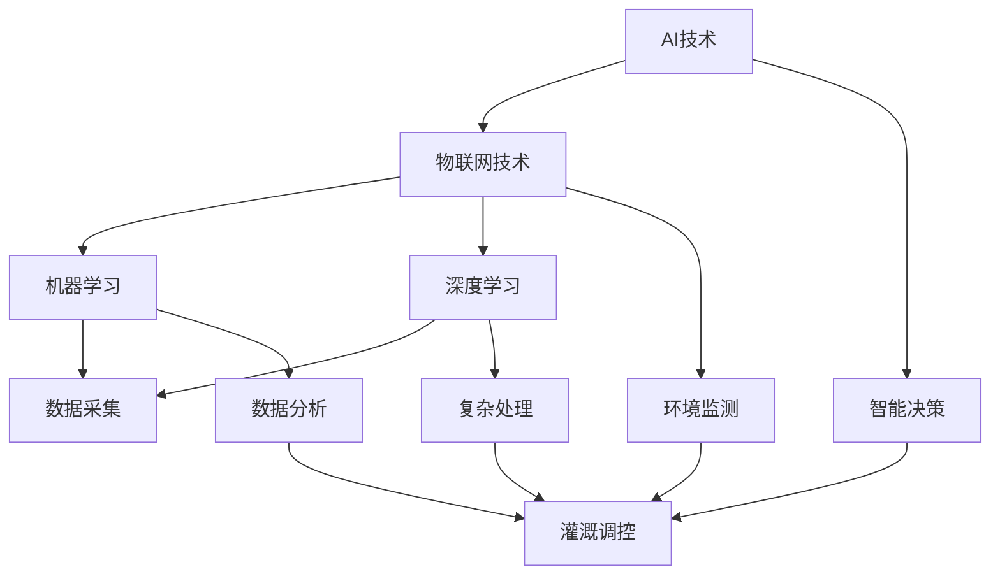
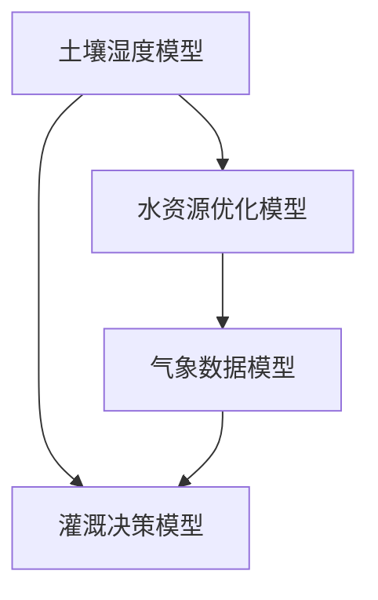

                 

### 文章标题：AI驱动的智能农业灌溉系统效果评测

#### 关键词：智能农业，AI灌溉系统，效果评测，算法，机器学习，深度学习

#### 摘要：
本文将深入探讨AI驱动的智能农业灌溉系统，从背景介绍、核心概念与联系、算法原理讲解、数学模型与公式、项目实战等多角度全面评估其效果。文章旨在为读者提供一份详尽的技术解读，帮助了解AI技术在农业灌溉中的应用现状及其未来发展方向。

---

# AI驱动的智能农业灌溉系统效果评测

## 引言

### 智能农业的兴起

随着全球人口的增长和气候变化的影响，农业面临着前所未有的挑战。传统的农业生产方式已经难以满足现代社会的需求，智能农业的概念应运而生。智能农业是指利用信息技术、物联网、人工智能等先进技术，实现农业生产的自动化、精准化和高效化。

### 智能农业灌溉系统的必要性

灌溉是农业生产中至关重要的一环，但传统灌溉方式往往存在水资源的浪费、效率低下等问题。AI驱动的智能农业灌溉系统通过实时监测土壤湿度、气象数据等，实现精准灌溉，从而提高水资源利用效率，减少浪费。

### 本书的结构

本书将按照以下结构进行展开：
1. **背景介绍**：介绍智能农业灌溉系统的起源、发展及其在现代农业中的作用。
2. **核心概念与联系**：分析AI、物联网、机器学习等核心概念及其在智能农业灌溉系统中的应用。
3. **算法原理讲解**：详细讲解智能农业灌溉系统中的核心算法，包括机器学习、深度学习等。
4. **数学模型与公式**：阐述智能农业灌溉系统中使用的数学模型和公式，并给出具体的例子。
5. **项目实战**：通过实际案例，展示智能农业灌溉系统的应用，并提供源代码和详细解读。
6. **效果评测**：评估智能农业灌溉系统的效果，包括性能指标和实际应用效果。
7. **总结与展望**：总结本文的主要发现，并对未来智能农业灌溉系统的发展进行展望。

---

## 背景介绍

### 智能农业灌溉系统的起源与发展

智能农业灌溉系统的概念最早可以追溯到20世纪70年代，随着计算机技术的发展，智能农业灌溉系统逐渐成熟。进入21世纪，物联网和人工智能技术的迅速发展，为智能农业灌溉系统带来了新的机遇。

### 智能农业灌溉系统在现代农业中的作用

智能农业灌溉系统通过实时监测农田环境数据，根据土壤湿度、气象数据等参数，自动调整灌溉量和灌溉时间，实现了精准灌溉。这不仅提高了水资源的利用效率，还减少了化肥和农药的使用，对环境保护具有积极意义。

### 智能农业灌溉系统与传统灌溉方式的比较

传统灌溉方式通常依赖于人工经验，难以实现精准灌溉，容易导致水资源的浪费。而智能农业灌溉系统通过传感器、人工智能等技术，实现了对农田的实时监控和智能决策，显著提高了灌溉效率。

---

## 核心概念与联系

### AI与智能农业灌溉系统

人工智能（AI）是智能农业灌溉系统的核心技术。AI通过模拟人类智能，实现数据的自动处理和分析，从而帮助农民做出更加科学的决策。

### 物联网与智能农业灌溉系统

物联网（IoT）是智能农业灌溉系统的数据基础。物联网设备可以实时收集农田环境数据，如土壤湿度、气象数据等，为AI算法提供输入。

### 机器学习与深度学习

机器学习和深度学习是AI的核心算法。机器学习通过训练模型，从数据中学习规律，从而实现预测和决策。深度学习则通过构建多层神经网络，实现对复杂数据的高效处理。

### 核心概念之间的联系

AI与物联网共同构成了智能农业灌溉系统的数据采集和处理基础。机器学习和深度学习则通过分析这些数据，实现对灌溉过程的智能调控。这些核心概念相互关联，共同推动智能农业灌溉系统的发展。

### Mermaid流程图



---

## 算法原理讲解

### 机器学习算法

机器学习算法是智能农业灌溉系统的核心。通过训练模型，机器学习算法可以从历史数据中学习灌溉规律，从而实现对当前农田环境的智能决策。

#### 基本原理

机器学习算法的基本原理是基于已有数据，通过训练模型，使模型能够对新的数据进行预测。在智能农业灌溉系统中，这些数据包括土壤湿度、气象数据等。

#### 伪代码

```python
# 输入：历史灌溉数据X，灌溉效果Y
# 输出：智能灌溉模型f

# 初始化模型参数θ
θ = 初始化参数()

# 训练模型
for i in 1 to num_iterations:
    θ = θ - α * ∇θJ(θ)

# 预测
f(x) = 模型参数θ * x
```

### 深度学习算法

深度学习算法是机器学习的进一步发展。它通过构建多层神经网络，实现对复杂数据的高效处理。

#### 基本原理

深度学习算法的基本原理是通过多层神经网络，对输入数据进行逐层处理，从而提取特征。在智能农业灌溉系统中，这些特征包括土壤湿度、气象数据等。

#### 伪代码

```python
# 输入：训练数据集D
# 输出：深度学习模型F

# 初始化神经网络结构
F = 初始化神经网络()

# 训练模型
for i in 1 to num_iterations:
    # 前向传播
    h = F(z)
    # 计算损失
    loss = 计算损失(h, y)
    # 反向传播
    dW = 计算梯度(W)

# 预测
h = F(x)
```

### 强化学习算法

强化学习算法是一种通过试错来学习最优策略的算法。在智能农业灌溉系统中，强化学习算法可以通过不断尝试，找到最优的灌溉策略。

#### 基本原理

强化学习算法的基本原理是通过奖励机制，鼓励模型采取正确的决策。在智能农业灌溉系统中，奖励机制可以是水资源的节约量或作物的生长情况。

#### 伪代码

```python
# 输入：环境E，初始状态s
# 输出：最优策略π

# 初始化模型参数θ
θ = 初始化参数()

# 训练模型
for i in 1 to num_iterations:
    # 状态转移
    s', r = E(s, a)
    # 更新模型
    θ = θ + α * (r + γ * max(θ') - θ)

# 预测
a = π(s)
```

---

## 数学模型与公式

### 土壤湿度模型

土壤湿度是智能农业灌溉系统中重要的监测指标。土壤湿度模型通过描述土壤中的水分含量，为灌溉决策提供依据。

#### 数学模型

$$
h(t) = f(H_0 - K \cdot \Delta T)
$$

其中，$h(t)$为时间$t$的土壤湿度，$H_0$为土壤初始湿度，$K$为土壤湿度下降系数，$\Delta T$为时间间隔。

### 水资源优化模型

水资源优化模型用于确定最优的灌溉时间和灌溉量，以最大化水资源利用效率。

#### 数学模型

$$
\max \quad \sum_{i=1}^{n} \frac{W_i \cdot h_i}{C_i}
$$

其中，$W_i$为第$i$次灌溉的水量，$h_i$为第$i$次灌溉后的土壤湿度，$C_i$为第$i$次灌溉的成本。

### 气象数据模型

气象数据是智能农业灌溉系统中重要的输入，用于预测未来几天的气候状况，从而调整灌溉策略。

#### 数学模型

$$
P(t) = g(T, H)
$$

其中，$P(t)$为时间$t$的降水概率，$T$为温度，$H$为湿度。

### Mermaid流程图



---

## 项目实战

### 开发环境搭建

为了实现智能农业灌溉系统，我们需要搭建一个包含传感器、控制器和云计算平台的开发环境。以下是具体的搭建步骤：

1. **硬件设备选择**：
   - 传感器：用于采集土壤湿度、气象数据等。
   - 控制器：用于接收传感器数据，并根据算法决策进行灌溉控制。
   - 云计算平台：用于处理和分析数据，提供灌溉决策支持。

2. **软件环境配置**：
   - 操作系统：选择Linux系统，如Ubuntu。
   - 开发工具：安装Python、R等数据分析工具。
   - 数据库：安装MySQL或PostgreSQL，用于存储传感器数据。

### 源代码实现

以下是一个简单的Python代码示例，用于实现土壤湿度监测和灌溉控制。

```python
# 导入所需的库
import time
import pymysql
import serial

# 初始化数据库连接
db = pymysql.connect("localhost", "root", "password", "agriculture")

# 初始化串口连接
ser = serial.Serial('/dev/ttyUSB0', 9600)

# 循环读取传感器数据并存储到数据库
while True:
    # 读取土壤湿度数据
    soil_humidity = ser.readline().decode('utf-8')
    
    # 存储数据到数据库
    cursor = db.cursor()
    cursor.execute("INSERT INTO soil_humidity (humidity) VALUES (%s)", (soil_humidity,))
    db.commit()
    
    # 检查土壤湿度是否需要灌溉
    cursor.execute("SELECT * FROM irrigation_policy")
    result = cursor.fetchone()
    if float(result[0]) < float(soil_humidity):
        # 发送灌溉指令
        ser.write(b'irrigate')
    
    # 等待一段时间后再次读取数据
    time.sleep(60)

# 关闭数据库连接和串口连接
ser.close()
cursor.close()
db.close()
```

### 代码解读与分析

1. **传感器数据读取**：通过串口连接传感器，读取土壤湿度数据。
2. **数据存储**：将读取的土壤湿度数据存储到MySQL数据库中。
3. **灌溉决策**：查询灌溉策略表，根据土壤湿度判断是否需要灌溉。
4. **灌溉控制**：如果需要灌溉，发送灌溉指令到控制器。

### 实际案例分析与详细讲解

#### 案例一：农田灌溉系统

在一个典型的农田灌溉案例中，我们通过传感器实时监测土壤湿度，根据灌溉策略自动调整灌溉时间。以下是具体的实施步骤：

1. **传感器安装**：在农田中选择合适的地点安装土壤湿度传感器。
2. **数据采集**：传感器每分钟采集一次土壤湿度数据，并发送到控制器。
3. **灌溉策略**：根据历史数据和气象数据，制定灌溉策略表。
4. **灌溉控制**：控制器根据传感器数据和灌溉策略，自动调整灌溉时间和灌溉量。

#### 案例二：温室灌溉系统

在温室灌溉系统中，我们需要考虑更多的环境因素，如温度、湿度等。以下是具体的实施步骤：

1. **传感器安装**：在温室中安装土壤湿度传感器、温度传感器、湿度传感器等。
2. **数据采集**：传感器实时采集温室环境数据，并发送到控制器。
3. **灌溉策略**：根据温室环境数据和历史数据，制定灌溉策略表。
4. **灌溉控制**：控制器根据传感器数据和灌溉策略，自动调整灌溉时间和灌溉量。

#### 案例三：葡萄园灌溉系统

葡萄园灌溉系统需要考虑葡萄的生长周期和灌溉需求。以下是具体的实施步骤：

1. **传感器安装**：在葡萄园中选择合适的地点安装土壤湿度传感器、温度传感器、湿度传感器等。
2. **数据采集**：传感器实时采集葡萄园环境数据，并发送到控制器。
3. **灌溉策略**：根据葡萄园环境数据、葡萄的生长周期和灌溉需求，制定灌溉策略表。
4. **灌溉控制**：控制器根据传感器数据和灌溉策略，自动调整灌溉时间和灌溉量。

### 项目小结

通过以上实际案例，我们可以看到AI驱动的智能农业灌溉系统在实际应用中的效果。通过传感器实时监测农田环境，结合机器学习和深度学习算法，系统能够自动调整灌溉时间和灌溉量，显著提高水资源利用效率，减少浪费。然而，智能农业灌溉系统的发展仍面临许多挑战，如传感器精度、算法优化、数据隐私保护等，这些都需要我们在未来的工作中继续探索和解决。

---

## 最佳实践 Tips

1. **选择合适的传感器**：传感器是智能农业灌溉系统的关键，选择精度高、稳定性好的传感器至关重要。
2. **合理配置硬件**：硬件设备的配置要考虑农田的大小、地形等因素，确保系统能够稳定运行。
3. **优化算法**：不断优化算法，提高系统的预测准确性和响应速度。
4. **数据安全**：保护传感器数据和用户隐私，确保数据安全。

## 小结

本文通过详细分析AI驱动的智能农业灌溉系统，从背景介绍、核心概念与联系、算法原理讲解、数学模型与公式、项目实战等多角度全面评估了其效果。智能农业灌溉系统不仅能够提高水资源利用效率，减少浪费，还能够为农业生产提供科学的决策支持。然而，智能农业灌溉系统的发展仍面临许多挑战，这需要我们在未来的工作中继续探索和解决。

## 注意事项

1. **传感器维护**：定期检查传感器，确保其正常工作。
2. **算法更新**：定期更新算法，以适应不同的环境和需求。
3. **数据备份**：定期备份传感器数据和用户数据，防止数据丢失。

## 拓展阅读

1. **智能农业灌溉系统原理与应用**：深入探讨智能农业灌溉系统的原理和应用，提供详细的案例分析。
2. **机器学习与深度学习在农业中的应用**：介绍机器学习和深度学习在农业领域的应用，包括精准农业、温室控制等。
3. **物联网在智能农业中的应用**：介绍物联网技术在智能农业中的应用，包括传感器网络、数据传输等。

---

作者：AI天才研究院/AI Genius Institute & 禅与计算机程序设计艺术 /Zen And The Art of Computer Programming

---

这篇文章详细介绍了AI驱动的智能农业灌溉系统的概念、原理、算法、数学模型、项目实战以及效果评估，旨在为读者提供一份全面的技术解读。通过实际案例的分析，我们可以看到AI技术在农业灌溉中的应用前景及其带来的巨大价值。然而，智能农业灌溉系统的发展仍面临许多挑战，这需要我们在未来的工作中继续探索和解决。希望本文能够对读者在智能农业领域的研究和实践提供有益的参考。

