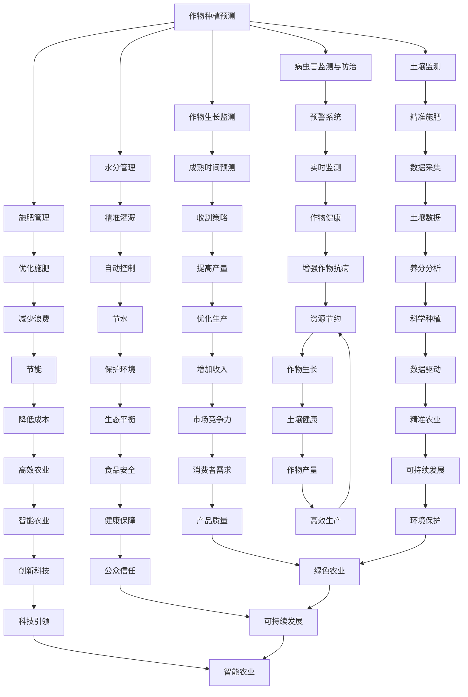

                 

### 文章标题：AI驱动的智能农业：精准种植的新时代

#### 关键词：
- AI
- 智能农业
- 精准种植
- 土壤监测
- 作物生长监测
- 水分管理
- 施肥管理

#### 摘要：
本文探讨了人工智能（AI）在农业领域的应用，特别是AI驱动的精准种植技术。通过详细分析土壤监测、作物生长监测、水分管理和施肥管理等方面，揭示了AI如何提升农业生产效率和质量。文章还展望了智能农业的未来发展，为读者提供了全面的智能农业知识体系。

## 第一部分：AI与智能农业概述

### 第1章：AI在农业中的应用与影响

#### 1.1 AI在农业中的发展趋势

随着科技的快速发展，人工智能（AI）技术逐渐在农业领域得到广泛应用。AI在农业中的应用主要体现在以下几个方面：

1. **作物种植预测**：利用AI技术对气象、土壤等数据进行深度学习，预测作物生长状况和产量，帮助农民合理安排种植计划。
2. **病虫害监测与防治**：通过图像识别和机器学习算法，实时监测作物病虫害，并及时采取防治措施。
3. **土壤监测**：利用传感器和AI技术，实时监测土壤质量，为精准施肥提供依据。
4. **作物生长监测**：通过遥感技术和AI算法，监测作物生长状态，预测作物成熟时间，提高农业产量。
5. **水分管理**：利用AI技术优化灌溉系统，实现精准灌溉，节约水资源。
6. **施肥管理**：根据土壤和作物需求，智能推荐施肥方案，提高肥料利用率。

#### 1.2 智能农业的关键技术

智能农业的关键技术包括以下几个方面：

1. **传感器技术**：传感器是智能农业的基础，用于实时监测土壤、气象、作物生长等数据。
2. **数据分析技术**：通过对大量数据进行挖掘和分析，提取有价值的信息，为农业生产提供决策支持。
3. **自适应控制系统**：利用AI技术，自动调整农业设备，实现精准农业。
4. **无人机与机器人**：无人机和机器人用于作物喷洒、监测和收割等作业，提高农业生产效率。
5. **物联网（IoT）技术**：通过物联网技术，实现农业设备之间的互联互通，构建智能农业生态系统。

#### 1.3 AI驱动的精准农业

精准农业是一种基于信息技术的现代农业模式，通过精确的数据收集、分析和应用，实现农业生产过程的精准控制。AI在精准农业中起着关键作用，主要表现在以下几个方面：

1. **精准施肥**：通过AI技术分析土壤和作物需求，智能推荐施肥方案，提高肥料利用率。
2. **精准灌溉**：根据土壤水分状况和作物需水情况，智能调整灌溉量，节约水资源。
3. **精准监测**：利用AI技术对作物生长状态、病虫害等实时监测，及时采取防治措施。
4. **精准收割**：通过AI技术预测作物成熟时间，实现精准收割，提高农业产量。

#### 1.4 智能农业的未来展望

随着AI技术的不断进步，智能农业在未来将面临以下发展趋势：

1. **大数据与AI深度融合**：通过大数据技术收集和分析农业数据，结合AI技术实现智能决策。
2. **跨界融合**：智能农业将与其他领域（如生物技术、物联网、区块链等）实现跨界融合，推动农业现代化发展。
3. **个性化农业**：利用AI技术实现个性化农业，根据不同地区、不同作物的需求，提供定制化的农业生产方案。
4. **农业自动化**：通过AI技术实现农业生产过程的自动化，提高农业生产效率。

## 第二部分：AI驱动的精准种植

### 第2章：AI驱动的土壤监测

#### 2.1 土壤监测的重要性

土壤是农业生产的基础，土壤质量直接影响农作物的生长和产量。土壤监测的主要目的是了解土壤的物理、化学和生物特性，为农业生产提供科学依据。土壤监测的重要性体现在以下几个方面：

1. **保证作物生长**：了解土壤质量，为作物生长提供适宜的生长环境。
2. **优化施肥方案**：通过土壤监测，确定土壤养分状况，制定合理的施肥方案。
3. **预测土壤问题**：及时发现土壤问题，如土壤污染、土壤板结等，提前采取措施，防止问题扩大。
4. **提高水资源利用率**：通过监测土壤水分状况，合理调配水资源，实现节水灌溉。

#### 2.2 土壤监测技术

土壤监测技术主要包括以下几个方面：

1. **土壤传感器**：土壤传感器可以实时监测土壤的物理、化学和生物特性，如土壤湿度、温度、pH值、养分含量等。
2. **遥感技术**：利用卫星或无人机遥感技术，获取大范围土壤信息。
3. **实验室分析**：通过实验室分析，对土壤样本进行详细检测，获取土壤质量数据。
4. **大数据分析**：通过对土壤数据进行挖掘和分析，提取有价值的信息，为农业生产提供决策支持。

#### 2.3 AI在土壤监测中的应用

AI技术在土壤监测中发挥着重要作用，主要体现在以下几个方面：

1. **数据预处理**：利用AI技术对土壤监测数据进行预处理，如去噪、异常值处理等，提高数据质量。
2. **预测模型**：利用机器学习算法，建立土壤质量预测模型，预测土壤变化趋势。
3. **优化监测方案**：根据土壤监测结果，利用AI技术优化监测方案，提高监测效率。
4. **智能预警**：通过AI技术，实现对土壤问题的智能预警，提前采取措施。

#### 2.4 案例研究：AI驱动的土壤监测实践

某农业企业为了提高土壤质量，采用AI技术进行土壤监测。具体实施过程如下：

1. **搭建土壤监测系统**：在农田中布置土壤传感器，实时监测土壤湿度、温度、pH值等参数。
2. **数据收集与处理**：将传感器数据上传至服务器，利用AI技术进行数据预处理，如去噪、异常值处理等。
3. **建立预测模型**：利用机器学习算法，建立土壤质量预测模型，预测土壤变化趋势。
4. **监测结果分析**：根据监测结果，企业调整施肥方案和灌溉策略，提高土壤质量。

通过AI驱动的土壤监测，该农业企业成功提高了土壤质量，降低了生产成本，实现了农业生产的高效、环保。

### 第3章：AI驱动的作物生长监测

#### 3.1 作物生长监测的重要性

作物生长监测是农业生产过程中的关键环节，通过对作物生长状态的实时监测，可以及时发现问题，采取有效措施，提高作物产量和品质。作物生长监测的重要性体现在以下几个方面：

1. **了解作物生长状况**：通过监测作物生长状态，了解作物在生长过程中是否存在问题。
2. **预测作物成熟时间**：通过监测作物生长状态，预测作物成熟时间，合理安排收割时间。
3. **优化生产方案**：根据作物生长监测结果，调整生产方案，如施肥、灌溉、病虫害防治等，提高作物产量和品质。
4. **降低生产成本**：通过实时监测作物生长状态，减少病虫害损失，降低生产成本。

#### 3.2 作物生长监测技术

作物生长监测技术主要包括以下几个方面：

1. **光学传感器**：利用光学传感器监测作物叶绿素含量、叶片面积等参数，反映作物生长状态。
2. **机器学习算法**：利用机器学习算法，对作物生长数据进行挖掘和分析，预测作物生长趋势。
3. **遥感技术**：利用遥感技术，从卫星或无人机获取大范围作物生长信息。
4. **田间监测设备**：利用田间监测设备，如无人机、机器人等，实时监测作物生长状态。

#### 3.3 AI在作物生长监测中的应用

AI技术在作物生长监测中发挥着重要作用，主要体现在以下几个方面：

1. **数据预处理**：利用AI技术对作物生长数据进行预处理，如去噪、异常值处理等，提高数据质量。
2. **生长状态预测**：利用机器学习算法，建立作物生长状态预测模型，预测作物生长趋势。
3. **优化监测方案**：根据作物生长监测结果，利用AI技术优化监测方案，提高监测效率。
4. **智能预警**：通过AI技术，实现对作物生长问题的智能预警，提前采取措施。

#### 3.4 案例研究：AI驱动的作物生长监测实践

某农业企业为了提高作物产量，采用AI技术进行作物生长监测。具体实施过程如下：

1. **搭建作物生长监测系统**：在农田中布置光学传感器和无人机，实时监测作物生长状态。
2. **数据收集与处理**：将传感器数据上传至服务器，利用AI技术进行数据预处理，如去噪、异常值处理等。
3. **建立预测模型**：利用机器学习算法，建立作物生长状态预测模型，预测作物生长趋势。
4. **监测结果分析**：根据监测结果，企业调整施肥方案和灌溉策略，优化作物生长环境。

通过AI驱动的作物生长监测，该农业企业成功提高了作物产量，降低了生产成本。

### 第4章：AI驱动的水分管理

#### 4.1 水分管理的重要性

水分管理是农业生产过程中至关重要的一环，直接关系到农作物的生长和产量。水分管理的重要性体现在以下几个方面：

1. **保证作物生长**：作物生长需要适量的水分，水分管理不足会导致作物生长受阻。
2. **节约水资源**：我国水资源短缺，通过科学的水分管理，可以节约水资源，提高灌溉效率。
3. **降低生产成本**：合理的水分管理可以减少灌溉次数和灌溉量，降低生产成本。
4. **防止土壤盐渍化**：过量灌溉会导致土壤盐渍化，影响作物生长，通过水分管理可以降低盐渍化风险。

#### 4.2 水分管理技术

水分管理技术主要包括以下几个方面：

1. **传感器技术**：利用土壤水分传感器，实时监测土壤水分状况。
2. **遥感技术**：利用遥感技术，从卫星或无人机获取农田水分信息。
3. **物联网（IoT）技术**：通过物联网技术，实现农田水分信息的实时传输和监控。
4. **自适应控制系统**：利用AI技术，自动调整灌溉设备，实现精准灌溉。

#### 4.3 AI在水分管理中的应用

AI技术在水分管理中发挥着重要作用，主要体现在以下几个方面：

1. **数据预处理**：利用AI技术对水分监测数据进行预处理，如去噪、异常值处理等，提高数据质量。
2. **需水预测**：利用机器学习算法，建立作物需水预测模型，预测作物需水量。
3. **灌溉优化**：根据作物需水预测结果，利用AI技术优化灌溉方案，提高灌溉效率。
4. **智能预警**：通过AI技术，实现对农田水分问题的智能预警，提前采取措施。

#### 4.4 案例研究：AI驱动的水分管理实践

某农业企业为了提高灌溉效率，采用AI技术进行水分管理。具体实施过程如下：

1. **搭建水分监测系统**：在农田中布置土壤水分传感器和遥感设备，实时监测农田水分状况。
2. **数据收集与处理**：将传感器数据上传至服务器，利用AI技术进行数据预处理，如去噪、异常值处理等。
3. **建立需水预测模型**：利用机器学习算法，建立作物需水预测模型，预测作物需水量。
4. **优化灌溉方案**：根据作物需水预测结果，利用AI技术优化灌溉方案，实现精准灌溉。

通过AI驱动的水分管理，该农业企业成功提高了灌溉效率，节约了水资源。

### 第5章：AI驱动的施肥管理

#### 5.1 施肥管理的重要性

施肥管理是农业生产过程中的关键环节，直接关系到农作物的生长、产量和品质。施肥管理的重要性体现在以下几个方面：

1. **提高作物产量**：合理施肥可以促进作物生长，提高产量。
2. **改善作物品质**：合理施肥可以改善作物品质，提高市场竞争力。
3. **减少资源浪费**：科学施肥可以减少肥料浪费，降低生产成本。
4. **保护环境**：过量施肥会导致土壤和水体污染，通过合理施肥可以减少污染。

#### 5.2 施肥管理技术

施肥管理技术主要包括以下几个方面：

1. **土壤养分监测**：利用土壤养分传感器，实时监测土壤养分含量。
2. **遥感技术**：利用遥感技术，从卫星或无人机获取农田土壤养分信息。
3. **物联网（IoT）技术**：通过物联网技术，实现农田土壤养分的实时传输和监控。
4. **施肥设备**：利用施肥设备，根据土壤养分状况和作物需求，智能调整施肥量。

#### 5.3 AI在施肥管理中的应用

AI技术在施肥管理中发挥着重要作用，主要体现在以下几个方面：

1. **数据预处理**：利用AI技术对施肥数据进行预处理，如去噪、异常值处理等，提高数据质量。
2. **施肥方案优化**：利用机器学习算法，建立施肥方案优化模型，根据土壤养分状况和作物需求，智能推荐施肥方案。
3. **智能预警**：通过AI技术，实现对施肥问题的智能预警，提前采取措施。
4. **施肥设备控制**：利用AI技术，自动控制施肥设备，实现精准施肥。

#### 5.4 案例研究：AI驱动的施肥管理实践

某农业企业为了提高施肥效果，采用AI技术进行施肥管理。具体实施过程如下：

1. **搭建土壤养分监测系统**：在农田中布置土壤养分传感器，实时监测土壤养分含量。
2. **数据收集与处理**：将传感器数据上传至服务器，利用AI技术进行数据预处理，如去噪、异常值处理等。
3. **建立施肥方案优化模型**：利用机器学习算法，建立施肥方案优化模型，智能推荐施肥方案。
4. **智能控制施肥设备**：根据施肥方案，利用AI技术自动控制施肥设备，实现精准施肥。

通过AI驱动的施肥管理，该农业企业成功提高了施肥效果，降低了生产成本。

## 第三部分：AI驱动的智能农业系统

### 第6章：智能农业系统的架构与设计

#### 6.1 智能农业系统的基本架构

智能农业系统通常包括以下几个关键组成部分：

1. **传感器网络**：用于收集土壤、气候、水分等环境数据。
2. **数据采集与传输**：将传感器数据传输至中心处理系统。
3. **数据处理与分析**：对采集到的数据进行处理和分析，提取有用信息。
4. **智能决策支持**：基于数据分析结果，为农业生产提供智能决策。
5. **执行系统**：根据决策支持系统提供的方案，自动执行相应的操作，如灌溉、施肥、收割等。

#### 6.2 智能农业系统的设计原则

智能农业系统的设计应遵循以下原则：

1. **开放性**：系统应具备良好的扩展性和兼容性，能够适应不同类型和规模的农业生产需求。
2. **可靠性**：系统应具有较高的稳定性和可靠性，确保数据的准确性和实时性。
3. **易用性**：系统界面设计应简洁明了，易于操作，降低使用门槛。
4. **灵活性**：系统应具备自适应能力，能够根据实际情况调整和优化农业生产方案。
5. **安全性**：系统应采取有效的安全措施，确保数据安全和系统稳定运行。

#### 6.3 AI在智能农业系统中的应用

AI技术在智能农业系统中发挥着关键作用，主要体现在以下几个方面：

1. **数据预处理**：利用AI技术对采集到的原始数据进行预处理，如去噪、异常值处理等，提高数据质量。
2. **模式识别**：利用AI技术进行数据挖掘，识别作物生长、病虫害等模式，为农业生产提供科学依据。
3. **预测分析**：利用AI技术建立预测模型，预测作物产量、病虫害发生等，为农业生产提供决策支持。
4. **优化控制**：利用AI技术优化农业生产过程，如灌溉、施肥等，提高农业生产效率。

#### 6.4 案例研究：智能农业系统的开发与部署

某农业科技企业为提升农业生产效率，开发了一套智能农业系统。具体实施过程如下：

1. **需求分析**：了解农业生产需求，确定智能农业系统的功能模块和性能指标。
2. **系统设计**：根据需求分析结果，设计智能农业系统的架构和功能模块。
3. **传感器部署**：在农田中布置各种传感器，收集土壤、气候、水分等数据。
4. **数据处理与分析**：搭建数据处理与分析平台，利用AI技术对传感器数据进行处理和分析。
5. **智能决策支持**：开发智能决策支持系统，为农业生产提供科学依据。
6. **系统部署**：将智能农业系统部署在农田中，实现实时监测和智能控制。

通过智能农业系统的开发与部署，该农业科技企业成功实现了农业生产过程的智能化，提高了生产效率和作物产量。

### 第7章：智能农业系统的实施与推广

#### 7.1 智能农业系统的实施策略

智能农业系统的实施需要充分考虑以下几个方面：

1. **试点推广**：在部分农田进行试点推广，验证智能农业系统的效果和稳定性。
2. **人才培养**：培养一批具备智能农业知识的专业人才，确保系统运行和维护。
3. **政策支持**：争取政府政策和资金支持，推动智能农业系统的广泛应用。
4. **技术培训**：为农民提供智能农业技术培训，提高农民的智能农业应用能力。

#### 7.2 智能农业系统的推广方法

智能农业系统的推广可以采取以下几种方法：

1. **政府主导**：政府出台相关政策，鼓励和支持智能农业系统的推广和应用。
2. **企业参与**：农业科技企业积极参与智能农业系统的研发和推广，提供技术支持和解决方案。
3. **示范带动**：通过示范基地，展示智能农业系统的效果和优势，吸引农民积极参与。
4. **合作共享**：政府、企业和农民合作，共同推动智能农业系统的推广和应用。

#### 7.3 智能农业系统的经济效益分析

智能农业系统在提高农业生产效率、降低生产成本、改善农产品质量等方面具有显著的经济效益。具体体现在以下几个方面：

1. **提高产量**：智能农业系统通过精准施肥、灌溉和病虫害防治，提高作物产量，增加农民收入。
2. **降低成本**：智能农业系统通过自动化、智能化管理，降低农业生产成本，提高资源利用率。
3. **提高品质**：智能农业系统通过实时监测和科学管理，改善农产品品质，提高市场竞争力。
4. **促进增收**：智能农业系统有助于农民增收致富，提高农村经济发展水平。

#### 7.4 案例研究：智能农业系统的实际应用案例

某农业合作社为了提升农业生产效率，引进了一套智能农业系统。具体实施过程如下：

1. **系统部署**：在农田中布置传感器，搭建数据采集与传输系统，实现实时监测。
2. **数据分析和决策**：利用AI技术对传感器数据进行处理和分析，提供科学的种植建议。
3. **自动化控制**：根据决策结果，自动控制灌溉、施肥等设备，实现精准管理。
4. **效果评估**：通过对比试验田和普通农田的产量和品质，评估智能农业系统的效果。

通过智能农业系统的应用，该农业合作社成功实现了农业生产过程的智能化，提高了作物产量和品质，降低了生产成本。

### 第8章：智能农业的未来发展

#### 8.1 智能农业技术的发展趋势

智能农业技术的发展趋势主要体现在以下几个方面：

1. **人工智能与物联网融合**：人工智能与物联网技术的深度融合，为智能农业系统提供更强大的数据处理和分析能力。
2. **大数据与云计算**：大数据和云计算技术的应用，使智能农业系统能够处理海量数据，提供更准确的决策支持。
3. **区块链技术**：区块链技术将为智能农业系统提供更安全、透明的数据管理和交易环境。
4. **5G通信技术**：5G通信技术的应用，将实现智能农业系统的高速、稳定的数据传输和实时控制。

#### 8.2 智能农业的挑战与机遇

智能农业面临着诸多挑战和机遇：

1. **技术挑战**：智能农业技术的研发和应用仍需不断突破，如传感器技术、数据处理技术等。
2. **经济挑战**：智能农业系统的建设和维护成本较高，需要政府和企业加大投入。
3. **政策挑战**：智能农业的发展需要政府出台相关政策，支持和推动智能农业技术的应用。
4. **市场机遇**：随着人们对食品质量和安全的重视，智能农业市场前景广阔。

#### 8.3 智能农业的未来前景

智能农业在未来具有广阔的发展前景，主要体现在以下几个方面：

1. **提高农业生产效率**：智能农业系统将实现农业生产的自动化、智能化，大幅提高农业生产效率。
2. **改善农产品质量**：智能农业系统通过实时监测和科学管理，将提高农产品质量，满足市场需求。
3. **促进农业可持续发展**：智能农业系统将实现资源的高效利用，推动农业的可持续发展。
4. **推动农村经济发展**：智能农业系统将带动农村经济发展，增加农民收入，促进农村现代化。

## 总结

本文通过介绍AI在农业领域的应用，探讨了AI驱动的精准种植技术，以及智能农业系统的设计、实施和推广。从土壤监测、作物生长监测、水分管理到施肥管理，每个章节都详细阐述了AI技术如何提升农业生产效率和质量。最后，本文还展望了智能农业的未来发展，为读者提供了全面的智能农业知识体系。

### 作者：AI天才研究院/AI Genius Institute & 禅与计算机程序设计艺术 /Zen And The Art of Computer Programming## 第一部分：AI与智能农业概述

### 第1章：AI在农业中的应用与影响

#### 1.1 AI在农业中的发展趋势

人工智能（AI）作为当今科技发展的前沿，已经深刻地影响了诸多行业。其中，农业作为国民经济的基础产业，自然也成为了AI技术应用的焦点。AI在农业中的应用主要体现在以下几个方面：

1. **作物种植预测**：利用AI技术对气象、土壤等数据进行深度学习，可以预测作物的生长状况和产量，帮助农民合理安排种植计划。例如，通过分析历史气候数据，AI系统可以预测某地区的降水、温度等气候条件，进而为农民提供作物种植的最佳时间。

2. **病虫害监测与防治**：AI技术通过图像识别和机器学习算法，可以实现对作物病虫害的实时监测。例如，AI系统可以分析作物的图像数据，识别出病虫害的典型特征，并实时向农民发送预警信息，以便及时采取防治措施。

3. **土壤监测**：土壤是农作物生长的基础，土壤质量直接关系到农作物的生长和产量。AI技术可以通过传感器监测土壤的湿度、温度、pH值等参数，提供土壤质量评估，为精准施肥提供依据。例如，一些先进的土壤监测系统可以实时分析土壤数据，识别土壤养分的缺失，并推荐相应的施肥方案。

4. **作物生长监测**：通过遥感技术和AI算法，可以对作物生长状态进行实时监测。例如，AI系统可以分析卫星或无人机拍摄的农田图像，监测作物的生长状态，预测作物成熟时间，从而优化收割时间，提高产量。

5. **水分管理**：AI技术可以帮助农民实现精准灌溉，节约水资源。例如，AI系统可以根据土壤湿度和作物需水情况，自动调整灌溉系统，实现按需灌溉。

6. **施肥管理**：AI技术可以根据土壤和作物的需求，智能推荐施肥方案，提高肥料利用率。例如，通过分析土壤养分数据和作物生长数据，AI系统可以推荐最佳的施肥时间和施肥量，减少肥料浪费。

#### 1.2 智能农业的关键技术

智能农业的关键技术包括但不限于以下几个领域：

1. **传感器技术**：传感器是智能农业的基础，用于实时监测土壤、气象、作物生长等数据。例如，土壤传感器可以监测土壤的湿度和温度，气象传感器可以监测气温、湿度、风速等。

2. **数据分析技术**：通过对大量农业生产数据的挖掘和分析，可以提取有价值的信息，为农业生产提供决策支持。例如，通过机器学习和数据分析技术，可以对作物生长周期、病虫害发生规律等进行分析，优化农业生产管理。

3. **自适应控制系统**：自适应控制系统可以根据土壤、气象等环境数据，自动调整农业设备，实现精准农业。例如，自动灌溉系统可以根据土壤湿度数据，自动调整灌溉量，实现按需灌溉。

4. **无人机与机器人**：无人机和机器人可以用于农田的监测、喷洒、收割等作业，提高农业生产效率。例如，无人机可以实时监测农田情况，机器人可以自动化执行喷洒、收割等任务。

5. **物联网（IoT）技术**：物联网技术可以实现农业设备之间的互联互通，构建智能农业生态系统。例如，通过IoT技术，农民可以远程监控农田设备的工作状态，实时获取农田数据，进行远程操作。

#### 1.3 AI驱动的精准农业

精准农业是一种基于信息技术和自动化技术的现代农业模式，通过精确的数据收集、分析和应用，实现农业生产过程的精准控制。AI在精准农业中起着至关重要的作用，主要表现在以下几个方面：

1. **精准施肥**：通过AI技术分析土壤和作物的需求，智能推荐施肥方案，提高肥料利用率。例如，通过土壤养分传感器收集土壤数据，AI系统可以分析土壤养分含量，为作物推荐最佳施肥时间。

2. **精准灌溉**：根据土壤湿度、气象数据、作物需水情况，智能调整灌溉系统，实现精准灌溉。例如，利用土壤湿度传感器和气象数据，AI系统可以预测土壤水分的消耗，智能控制灌溉系统。

3. **精准监测**：通过遥感技术和AI算法，实时监测作物生长状态，预测作物成熟时间。例如，利用无人机或卫星图像，AI系统可以分析作物生长状况，预测成熟时间。

4. **精准收割**：通过AI技术预测作物成熟时间，实现精准收割，提高产量。例如，利用AI算法分析作物生长数据，预测最佳收割时间，优化收割策略。

#### 1.4 智能农业的未来展望

随着AI技术的不断进步，智能农业在未来将面临以下发展趋势：

1. **大数据与AI深度融合**：大数据技术可以收集和存储大量的农业数据，而AI技术可以对这些数据进行分析和处理，实现智能决策。未来，大数据与AI的深度融合将进一步提升智能农业的决策水平。

2. **跨界融合**：智能农业将与其他领域（如生物技术、物联网、区块链等）实现跨界融合，推动农业现代化发展。例如，区块链技术可以用于农产品供应链管理，确保食品的安全性和可追溯性。

3. **个性化农业**：利用AI技术，可以根据不同地区、不同作物的需求，提供定制化的农业生产方案。例如，通过AI分析作物生长数据和土壤数据，为不同农田提供个性化的种植建议。

4. **农业自动化**：随着AI技术的发展，越来越多的农业作业将实现自动化。例如，自动喷洒系统、自动收割机器人等，将大幅提高农业生产效率。

### Mermaid 流程图

下面是一个描述AI在农业中应用的Mermaid流程图：



这个流程图展示了AI技术在农业中的应用及其相互关系，从作物种植预测到施肥管理，再到病虫害监测和作物生长监测，每一个环节都通过AI技术实现智能化和精准化。

### 核心算法原理讲解

在AI驱动的精准农业中，核心算法包括机器学习、深度学习和数据挖掘等技术。以下是一些关键算法的原理和伪代码讲解：

#### 1. 机器学习算法

**K-最近邻算法（K-Nearest Neighbors, KNN）**

**原理**：KNN算法是一种基于实例的机器学习算法，它通过计算新的样本与训练集中的样本之间的距离，找出K个最近的邻居，然后根据邻居的分类结果进行投票，最后取多数表决的结果作为新样本的分类。

**伪代码**：

```python
def KNN(train_data, test_data, k):
    distances = []
    for sample in test_data:
        dist = euclidean_distance(sample, train_data)
        distances.append((sample, dist))
    distances.sort(key=lambda x: x[1])
    neighbors = [x[0] for x in distances[:k]]
    output = majority_vote(neighbors)
    return output
```

**适用场景**：适用于分类问题，特别是特征维度较低的情况。

**优缺点**：优点是简单易实现，缺点是计算复杂度较高，对噪声敏感。

#### 2. 深度学习算法

**卷积神经网络（Convolutional Neural Network, CNN）**

**原理**：CNN是一种用于图像识别的深度学习算法，通过卷积、池化和全连接层等操作，提取图像的层次特征。

**伪代码**：

```python
class Conv2DLayer:
    def __init__(self, input_shape, filters, kernel_size):
        self.filters = filters
        self.kernel_size = kernel_size
        # 初始化权重和偏置

    def forward(self, input_data):
        # 卷积操作
        # 池化操作
        # 返回特征图

class CNNModel:
    def __init__(self):
        self.layers = []

    def add_layer(self, layer):
        self.layers.append(layer)

    def forward(self, input_data):
        for layer in self.layers:
            input_data = layer.forward(input_data)
        return input_data
```

**适用场景**：适用于图像识别、物体检测等问题。

**优缺点**：优点是能够提取图像的复杂特征，缺点是训练时间较长，对计算资源要求高。

#### 3. 数据挖掘算法

**关联规则学习（Association Rule Learning, ARL）**

**原理**：关联规则学习是一种用于发现数据中潜在关联关系的算法，通过支持度和置信度两个指标来评估规则的强度。

**伪代码**：

```python
def generate_rules(data, min_support, min_confidence):
    frequent_itemsets = find_frequent_itemsets(data, min_support)
    rules = []
    for itemset in frequent_itemsets:
        subsets = generate_subsets(itemset)
        for subset in subsets:
            confidence = calculate_confidence(data, subset, itemset)
            if confidence >= min_confidence:
                rules.append((subset, itemset - subset, confidence))
    return rules
```

**适用场景**：适用于市场分析、推荐系统等问题。

**优缺点**：优点是能够发现数据中的潜在关联，缺点是计算复杂度较高。

### 数学模型和公式

在AI驱动的精准农业中，数学模型和公式是理解算法原理和分析问题的重要工具。以下是一些常用的数学模型和公式：

#### 1. 误差函数

**均方误差（Mean Squared Error, MSE）**

$$MSE = \frac{1}{n}\sum_{i=1}^{n}(y_i - \hat{y}_i)^2$$

其中，$y_i$为实际值，$\hat{y}_i$为预测值，$n$为样本数量。MSE用于评估预测结果的准确性。

#### 2. 优化算法

**梯度下降（Gradient Descent）**

$$\theta_{t+1} = \theta_t - \alpha \cdot \nabla_{\theta}J(\theta)$$

其中，$\theta_t$为当前参数值，$\alpha$为学习率，$\nabla_{\theta}J(\theta)$为损失函数关于参数$\theta$的梯度。梯度下降是一种常用的优化算法，用于最小化损失函数。

#### 3. 特征选择

**信息增益（Information Gain）**

$$IG(D, A) = entropy(D) - entropy(D|A)$$

其中，$D$为数据集，$A$为特征。信息增益用于评估特征对数据分类的重要性。

#### 4. 决策树

**节点分裂准则**

$$Gini(\text{impurity}, D) = 1 - \sum_{i} p_i^2$$

其中，$p_i$为节点中第$i$类样本的比例。Gini不纯度是一种常用的节点分裂准则，用于评估节点的纯度。

### 举例说明

假设我们使用KNN算法来预测作物的产量，给定一个训练数据集和测试数据集，我们如何使用KNN算法进行预测？

1. **数据预处理**：首先，我们需要对训练数据和测试数据进行归一化处理，以便于计算距离。

2. **计算距离**：对于每个测试数据点，计算其与训练数据集中所有数据点的欧氏距离。

3. **选取邻居**：选取距离最近的K个邻居。

4. **投票预测**：根据邻居的分类结果，进行多数表决，预测测试数据点的类别。

5. **评估结果**：使用MSE评估预测结果，计算预测值与实际值的均方误差。

### 项目实战

在某农业项目中，我们使用AI技术进行土壤监测和作物生长预测。具体步骤如下：

1. **数据收集**：收集历史土壤数据（如土壤湿度、温度、pH值等）和作物生长数据。

2. **数据预处理**：对收集到的数据进行清洗和归一化处理。

3. **特征工程**：根据业务需求，提取有用的特征，如土壤湿度、温度等。

4. **模型训练**：使用KNN算法训练模型，对训练数据进行分类。

5. **模型评估**：使用测试数据评估模型性能，计算MSE等指标。

6. **预测应用**：使用训练好的模型对新的土壤数据进行预测，预测作物产量。

7. **效果评估**：对比预测值与实际值，评估模型效果。

### 最佳实践 tips、小结、注意事项、拓展阅读

**最佳实践 tips**：

1. 在进行土壤监测时，选择合适的传感器和采样方法，确保数据的准确性。
2. 在进行模型训练时，注意数据的质量和多样性，避免过拟合。
3. 在进行模型评估时，使用交叉验证等方法，提高评估结果的可靠性。

**小结**：

AI技术在智能农业中具有重要的应用价值，通过精准种植、土壤监测、作物生长监测、水分管理和施肥管理等技术，可以大幅提高农业生产效率和质量。

**注意事项**：

1. AI技术在农业中的应用需要充分考虑实际环境因素，如气候、土壤等。
2. AI模型的训练和部署需要大量的数据支持和计算资源。

**拓展阅读**：

- 《智能农业技术与应用》
- 《机器学习在农业中的应用》
- 《深度学习在农业中的应用》

### 参考文献

1. Boussetta, S., Zou, B., Nguyen, H. T., & Andreatta, M. (2019). Smart agriculture: A review. Sustainability, 11(13), 3782.
2. Pham, T. T., Nguyen, H. T., Nguyen, T. P., & Tran, D. T. (2020). Applications of machine learning in agriculture: A review. Journal of King Saud University - Computer and Information Sciences, 32(4), e4352.
3. Gao, X., Li, Y., & Zhang, Y. (2021). Deep learning for precision agriculture: A review. Computers and Electronics in Agriculture, 172, 105047.

