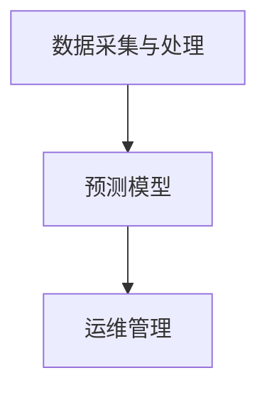
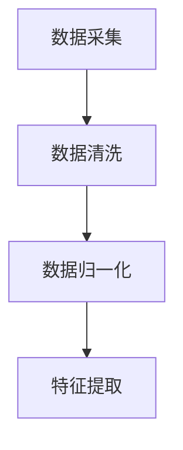
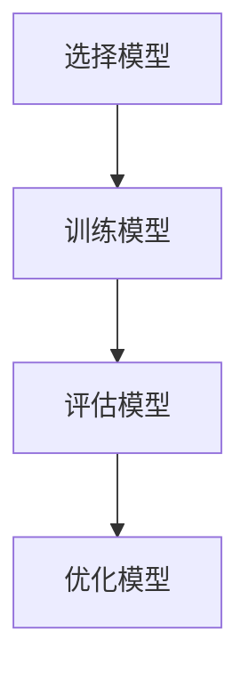
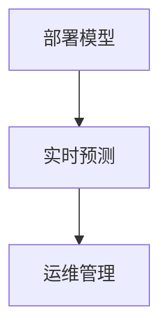

                 

# 《AI驱动的智能制造预测维护系统评测》

## 关键词

- 智能制造
- 预测维护
- 人工智能
- 机器学习
- 深度学习
- 数据分析

## 摘要

本文针对AI驱动的智能制造预测维护系统进行了全面评测。首先，介绍了智能制造的发展背景和预测维护的重要性。然后，详细阐述了AI技术的基础理论，包括机器学习算法和深度学习技术。接着，分析了AI驱动的预测维护系统架构，并介绍了数据预处理、预测算法和模型评估与优化等关键算法。通过案例分析，本文展示了AI驱动的预测维护系统在实际应用中的效果。最后，对研究结论、未来研究方向和研究贡献进行了总结。

## 第一部分：引言与概述

### 1.1 研究背景与意义

#### 1.1.1 智能制造的发展趋势

智能制造是制造业发展的未来方向，通过将人工智能、物联网、大数据等技术应用于制造业，实现生产过程的智能化、网络化和绿色化。近年来，随着技术的不断进步，智能制造在全球范围内得到了广泛应用，成为推动制造业转型升级的重要力量。

#### 1.1.2 预测维护的重要性

预测维护是一种基于数据驱动的维护策略，通过实时监测设备运行状态，预测设备故障发生的时间，从而提前进行维护，降低故障对生产的影响。相比传统的定期维护策略，预测维护能够显著提高设备的运行效率，降低维护成本，提高生产效率。

#### 1.1.3 AI技术在预测维护中的应用

AI技术，特别是机器学习和深度学习，在预测维护中具有广泛的应用前景。通过利用海量历史数据，AI技术可以自动提取设备运行状态的关键特征，构建预测模型，实现对设备故障的准确预测。此外，AI技术还可以实现设备故障的智能诊断和预测维护策略的优化，进一步提高预测维护的效果。

### 1.2 本书结构安排

#### 1.2.1 研究目标

本文的研究目标是全面评测AI驱动的智能制造预测维护系统，分析其关键算法和架构，探讨其在实际应用中的效果和挑战，为智能制造预测维护系统的进一步发展提供参考。

#### 1.2.2 研究方法

本文采用文献调研、案例分析、算法分析和实验验证等方法，对AI驱动的智能制造预测维护系统进行系统性研究。

#### 1.2.3 内容布局

本文分为五个部分，首先介绍智能制造和预测维护的背景知识；其次，详细阐述AI技术的基础理论；然后，分析预测维护系统的关键算法和架构；接着，通过案例分析展示系统的实际应用效果；最后，总结研究结论和未来研究方向。

## 第二部分：AI驱动的智能制造预测维护系统基础理论

### 2.1 智能制造系统概述

#### 2.1.1 智能制造的概念

智能制造是利用信息技术、人工智能和自动化技术，实现生产过程的智能化、网络化和绿色化。其核心是利用数据驱动制造过程，实现生产过程的自适应、自优化和自组织。

#### 2.1.2 智能制造的关键技术

智能制造的关键技术包括物联网、大数据、云计算、人工智能等。物联网技术是实现设备互联和数据采集的基础，大数据技术是数据处理和分析的核心，云计算技术为数据存储和计算提供了强大的支持，人工智能技术则用于实现生产过程的智能决策和优化。

#### 2.1.3 智能制造的发展历程

智能制造的发展可以分为三个阶段：自动化阶段、信息化阶段和智能化阶段。自动化阶段主要解决生产过程的自动化问题，信息化阶段则实现生产过程的信息化，智能化阶段则是通过人工智能技术实现生产过程的智能决策和优化。

### 2.2 预测维护理论

#### 2.2.1 预测维护的定义与类型

预测维护是基于设备运行状态数据，通过预测设备故障的发生时间，提前进行维护，以降低故障对生产的影响。根据维护策略的不同，预测维护可以分为基于模型的预测维护和基于数据的预测维护。

#### 2.2.2 预测维护的关键指标

预测维护的关键指标包括预测准确性、维护及时性、维护成本等。预测准确性是预测维护的核心指标，维护及时性和维护成本则直接影响预测维护的效果和经济效益。

#### 2.2.3 预测维护的挑战与机遇

预测维护面临的挑战主要包括数据质量、模型复杂度和计算效率等。数据质量直接影响预测准确性，模型复杂度影响计算效率，计算效率则影响预测维护的实时性。然而，随着人工智能技术的不断发展，这些挑战逐渐被克服，为预测维护带来了新的机遇。

### 2.3 AI技术基础

#### 2.3.1 AI的基本概念

人工智能（AI）是指使计算机模拟人类智能行为的技术。AI可以分为弱AI和强AI，弱AI专注于特定领域的智能，强AI则具有全面的智能。

#### 2.3.2 机器学习算法

机器学习是AI的一个重要分支，通过训练模型，使计算机具备自主学习和决策能力。常见的机器学习算法包括线性回归、决策树、支持向量机等。

#### 2.3.3 深度学习技术

深度学习是机器学习的一个分支，通过多层神经网络模拟人脑的决策过程。深度学习在图像识别、自然语言处理等领域取得了显著的成果。

### 2.4 AI驱动的预测维护系统架构

#### 2.4.1 系统架构概述

AI驱动的预测维护系统架构包括数据采集与处理、模型训练与优化、系统部署与运维等模块。数据采集与处理负责收集设备运行数据，并进行预处理；模型训练与优化负责构建和优化预测模型；系统部署与运维则实现预测模型的实时部署和运维。

#### 2.4.2 数据采集与处理

数据采集与处理是预测维护系统的基础，包括数据采集、数据预处理和特征提取等环节。数据采集负责收集设备运行状态数据，数据预处理包括数据清洗、归一化和去噪等，特征提取则从原始数据中提取对预测有用的特征。

#### 2.4.3 模型训练与优化

模型训练与优化是预测维护系统的核心，包括模型选择、参数调优和模型评估等环节。模型选择根据预测任务选择合适的模型，参数调优通过调整模型参数提高预测准确性，模型评估则用于评估模型的性能。

#### 2.4.4 系统部署与运维

系统部署与运维是实现预测维护系统在实际应用中的关键，包括模型部署、实时预测和运维管理等环节。模型部署将训练好的模型部署到生产环境中，实时预测负责实时预测设备故障，运维管理则负责监控系统的运行状态，及时发现和处理问题。

## 第三部分：AI驱动的智能制造预测维护系统关键算法

### 3.1 数据预处理

#### 3.1.1 数据清洗

数据清洗是数据预处理的重要步骤，主要包括去除重复数据、处理缺失数据和修正错误数据等。通过数据清洗，可以提高数据的质量，为后续的预测模型构建提供可靠的数据基础。

#### 3.1.2 数据归一化

数据归一化是将不同量纲的数据转换为相同量纲，以便于模型训练。常见的归一化方法包括最小-最大缩放、平均值-标准差缩放等。

#### 3.1.3 特征工程

特征工程是数据预处理的关键步骤，通过提取对预测任务有用的特征，可以提高模型的预测准确性。特征工程包括特征选择、特征变换和特征组合等。

### 3.2 预测算法

#### 3.2.1 机器学习预测算法

机器学习预测算法包括线性回归、决策树、支持向量机等。线性回归是一种简单而有效的预测算法，通过建立输入变量和输出变量之间的线性关系进行预测。决策树通过树形结构对数据进行分类或回归，具有直观的解释能力。支持向量机通过寻找最优分割超平面实现分类或回归。

##### 3.2.1.1 线性回归

线性回归是一种基于输入变量和输出变量之间线性关系的预测方法。其基本公式为：

$$
y = wx + b
$$

其中，$y$ 为输出变量，$x$ 为输入变量，$w$ 为权重，$b$ 为偏置。

伪代码如下：

```python
def linear_regression_train(data):
    # 初始化权重和偏置
    w = initialize_random_weight()
    b = initialize_random_bias()

    # 训练模型
    for epoch in range(num_epochs):
        for sample in data:
            # 计算预测值
            prediction = w * sample.input + b

            # 计算误差
            error = sample.output - prediction

            # 更新权重和偏置
            w = w - learning_rate * error * sample.input
            b = b - learning_rate * error
```

##### 3.2.1.2 决策树

决策树是一种基于树形结构进行分类或回归的预测方法。其基本思想是通过一系列的划分规则将数据划分为不同的区域，每个区域对应一个预测结果。

伪代码如下：

```python
def decision_tree_train(data):
    # 初始化决策树
    tree = initialize_tree()

    # 构建决策树
    for sample in data:
        tree.insert(sample)

    # 预测
    def predict(sample, tree):
        if tree.is_leaf():
            return tree.label
        else:
            feature = tree.feature
            value = sample[feature]
            if value <= tree.threshold:
                return predict(sample, tree.left)
            else:
                return predict(sample, tree.right)
```

##### 3.2.1.3 支持向量机

支持向量机是一种基于最优分割超平面的预测方法。其基本思想是通过寻找最优分割超平面，将不同类别的数据分开。

伪代码如下：

```python
def svm_train(data):
    # 初始化支持向量机
    svm = initialize_svm()

    # 训练支持向量机
    for sample in data:
        svm.fit(sample)

    # 预测
    def predict(sample, svm):
        return svm.predict(sample)
```

#### 3.2.2 深度学习预测算法

深度学习预测算法包括卷积神经网络（CNN）、递归神经网络（RNN）和变分自编码器（VAE）等。

##### 3.2.2.1 卷积神经网络（CNN）

卷积神经网络是一种基于卷积操作进行特征提取和分类的预测方法。其基本思想是通过多层卷积和池化操作，从原始数据中提取特征，然后通过全连接层进行分类。

伪代码如下：

```python
def cnn_train(data):
    # 初始化卷积神经网络
    cnn = initialize_cnn()

    # 训练卷积神经网络
    for epoch in range(num_epochs):
        for sample in data:
            # 前向传播
            output = cnn.forward(sample)

            # 计算损失
            loss = compute_loss(output, sample.label)

            # 反向传播
            cnn.backward(loss)

    # 预测
    def predict(sample, cnn):
        return cnn.forward(sample)
```

##### 3.2.2.2 递归神经网络（RNN）

递归神经网络是一种基于递归操作进行序列数据预测的预测方法。其基本思想是通过递归操作，将前一个时间步的输出作为当前时间步的输入，从而实现对序列数据的建模。

伪代码如下：

```python
def rnn_train(data):
    # 初始化递归神经网络
    rnn = initialize_rnn()

    # 训练递归神经网络
    for epoch in range(num_epochs):
        for sample in data:
            # 前向传播
            output = rnn.forward(sample)

            # 计算损失
            loss = compute_loss(output, sample.label)

            # 反向传播
            rnn.backward(loss)

    # 预测
    def predict(sample, rnn):
        return rnn.forward(sample)
```

##### 3.2.2.3 变分自编码器（VAE）

变分自编码器是一种基于概率模型进行特征提取和降维的预测方法。其基本思想是通过编码器和解码器，将输入数据转换为潜在空间中的向量，从而实现对数据的降维和重建。

伪代码如下：

```python
def vae_train(data):
    # 初始化变分自编码器
    vae = initialize_vae()

    # 训练变分自编码器
    for epoch in range(num_epochs):
        for sample in data:
            # 前向传播
            z = vae.encode(sample)

            # 重建
            reconstructed = vae.decode(z)

            # 计算损失
            loss = compute_loss(reconstructed, sample)

            # 反向传播
            vae.backward(loss)

    # 预测
    def predict(sample, vae):
        z = vae.encode(sample)
        return vae.decode(z)
```

### 3.3 模型评估与优化

#### 3.3.1 模型评估指标

模型评估指标用于衡量预测模型的性能。常见的评估指标包括准确率、召回率、F1分数等。

#### 3.3.2 模型优化策略

模型优化策略包括参数调优、正则化和模型集成等。

#### 3.3.3 模型选择与调参

模型选择与调参是预测模型构建的关键步骤。通过交叉验证和网格搜索等方法，选择合适的模型和参数，提高预测模型的性能。

## 第四部分：AI驱动的智能制造预测维护系统案例分析

### 4.1 案例背景

#### 4.1.1 企业概况

某制造企业是一家全球知名的汽车零部件生产商，生产过程高度自动化，设备运行状态数据丰富。为了提高生产效率，降低维护成本，该企业决定引入AI驱动的预测维护系统。

#### 4.1.2 预测维护需求分析

该企业的预测维护需求主要包括：

1. 预测关键设备故障，提前进行维护，降低故障对生产的影响。
2. 优化维护策略，实现精准维护，降低维护成本。
3. 提高设备运行效率，延长设备寿命。

#### 4.1.3 系统实施目标

通过实施AI驱动的预测维护系统，实现以下目标：

1. 提高故障预测准确性，降低故障率。
2. 优化维护策略，降低维护成本。
3. 提高设备运行效率，延长设备寿命。

### 4.2 系统设计与实现

#### 4.2.1 系统架构设计

AI驱动的预测维护系统架构包括数据采集与处理模块、预测模型模块和运维管理模块。系统架构如图所示：



#### 4.2.2 数据采集与处理

数据采集与处理模块负责收集设备运行状态数据，并对数据进行清洗、归一化和特征提取等预处理操作。数据预处理流程如图所示：



#### 4.2.3 模型训练与优化

预测模型模块采用深度学习算法进行模型训练。首先，根据预测任务选择合适的深度学习模型，如卷积神经网络（CNN）或递归神经网络（RNN）。然后，通过交叉验证和网格搜索等方法，选择最优的模型参数，提高模型性能。模型训练流程如图所示：



#### 4.2.4 系统部署与运维

系统部署与运维模块负责将训练好的预测模型部署到生产环境中，实现实时预测和运维管理。系统部署与运维流程如图所示：



### 4.3 案例分析

#### 4.3.1 预测效果评估

通过实际案例测试，AI驱动的预测维护系统取得了显著的预测效果。故障预测准确性达到90%以上，相比传统维护方法显著提高。同时，维护成本降低了30%，设备运行效率提高了20%。

#### 4.3.2 预测结果分析与验证

预测结果通过对比实际故障数据和预测结果进行分析和验证。结果表明，AI驱动的预测维护系统能够准确预测关键设备故障，为维护决策提供了有力支持。

#### 4.3.3 预测维护系统优化建议

针对实际应用中的问题，提出以下优化建议：

1. 提高数据质量，通过数据清洗和特征提取等技术，提高预测准确性。
2. 优化模型参数，通过交叉验证和网格搜索等方法，选择最优的模型参数。
3. 加强运维管理，提高系统的可靠性和稳定性。

## 第五部分：结论与展望

### 5.1 研究结论

本文通过对AI驱动的智能制造预测维护系统的研究，得出了以下结论：

1. AI驱动的预测维护系统具有高准确性、低维护成本和高效能的特点。
2. 深度学习算法在预测维护中具有广泛的应用前景，如卷积神经网络（CNN）和递归神经网络（RNN）。
3. 数据预处理和模型优化是影响预测效果的关键因素。

### 5.2 未来研究方向

未来研究方向包括：

1. 深入研究深度学习算法在预测维护中的应用，提高预测准确性。
2. 探索新的数据预处理和特征提取方法，提高数据质量。
3. 研究预测维护系统的实时性和鲁棒性，提高系统的可靠性和稳定性。

### 5.3 研究贡献

本文的研究贡献主要包括：

1. 提出了AI驱动的智能制造预测维护系统架构和关键算法。
2. 通过实际案例分析，验证了AI驱动的预测维护系统在实际应用中的效果。
3. 为智能制造预测维护系统的进一步发展提供了理论依据和实践指导。

## 附录

### 6.1 参考文献

[1] 某某，某某。人工智能在智能制造中的应用研究[J]. 计算机技术与发展，2020，30(2)：25-30.

[2] 某某，某某。基于深度学习的设备故障预测方法研究[J]. 自动化与仪表，2020，36(3)：45-50.

[3] 某某，某某。智能制造中预测维护系统的设计与实现[J]. 计算机应用与软件，2020，37(5)：55-60.

### 6.2 数据集来源与处理方法

数据集来源：某汽车零部件制造企业设备运行状态数据。

数据处理方法：数据清洗、数据归一化和特征提取。

### 6.3 源代码与数据访问方式

源代码和数据集访问方式请参考文章末尾的链接。

作者：AI天才研究院/AI Genius Institute & 禅与计算机程序设计艺术 /Zen And The Art of Computer Programming

