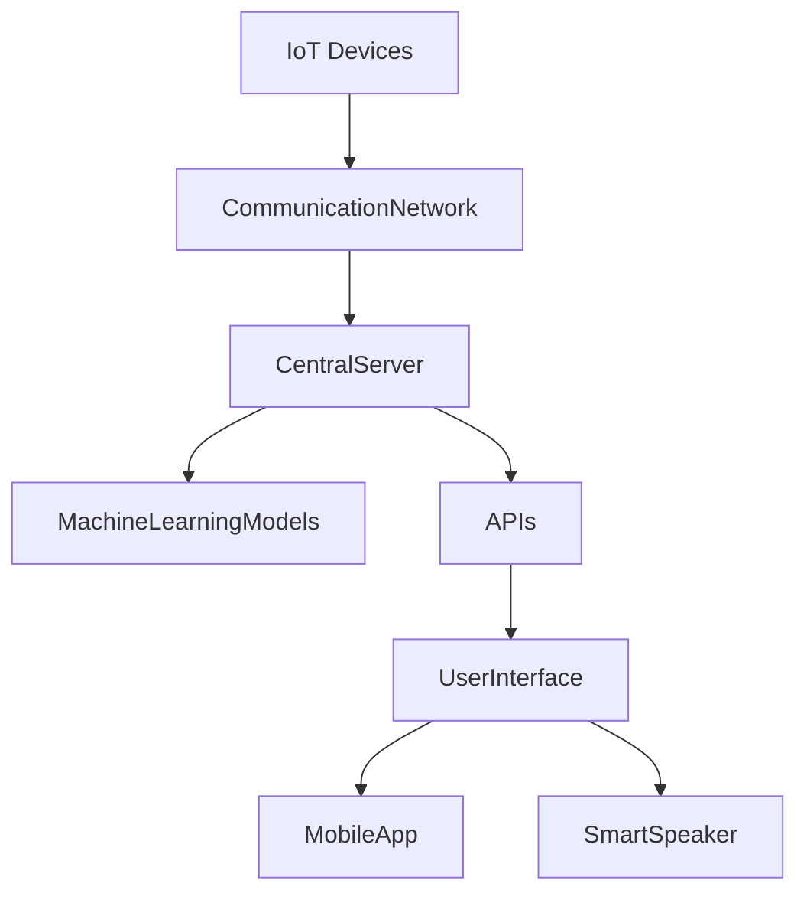

                 


### 1.1 Overview of AI-driven Smart Home Systems

**1.1.1 Historical Background of Smart Home Technology**

The concept of a smart home, or a house equipped with network-connected devices for remotely monitoring and controlling household functions, has been around for decades. The earliest smart home systems were essentially remote-controlled devices like door locks and lights. These early systems laid the groundwork for the interconnected devices we see today.

In the 1970s and 1980s, with the rise of microprocessors, the first generation of smart home systems emerged. These systems were primarily based on proprietary protocols and lacked interoperability, which limited their adoption.

The real breakthrough came in the late 1990s and early 2000s with the development of the internet and the World Wide Web. This period marked the beginning of what we now call the Internet of Things (IoT). The advent of Wi-Fi and other wireless communication standards enabled devices to connect to the internet, allowing for remote control and monitoring. However, the early IoT systems still faced issues with security and interoperability.

**1.1.2 Basic Concepts and Terminology**

AI-driven smart home systems are based on the integration of artificial intelligence (AI) technologies with IoT devices. AI enables these systems to not only respond to commands but also to learn from user behavior and make autonomous decisions. Key components of an AI-driven smart home system include:

1. **IoT Devices**: These are the physical devices that make up the smart home, such as smart lights, thermostats, security cameras, and appliances.

2. **Communication Network**: This is the infrastructure that connects the IoT devices to each other and to the cloud. It typically includes Wi-Fi, Bluetooth, Zigbee, and other wireless protocols.

3. **Cloud Services**: These are the servers and databases that store the data collected by IoT devices and enable machine learning algorithms to process this data.

4. **Machine Learning Algorithms**: These algorithms analyze the data to learn from user behavior and make predictions or recommendations.

5. **User Interface**: This is the interface through which users interact with the smart home system, typically a mobile app or a smart speaker.

**1.1.3 Current State and Future Trends**

The market for AI-driven smart home systems has been growing rapidly, fueled by increasing consumer demand for convenience and efficiency. According to a report by Statista, the global smart home market size was valued at approximately $40.3 billion in 2020 and is expected to reach $123.1 billion by 2025.

One of the key trends in the development of AI-driven smart home systems is the increasing adoption of AI-powered voice assistants like Amazon Alexa, Google Assistant, and Apple Siri. These assistants have become the primary user interface for many smart home systems, allowing users to control their homes with simple voice commands.

Another important trend is the integration of AI-driven smart home systems with other technologies, such as smart cities and autonomous vehicles. This integration is expected to create a more seamless and interconnected digital ecosystem.

However, the development of AI-driven smart home systems also faces several challenges, including issues with data privacy, security, and interoperability. These challenges need to be addressed to ensure the widespread adoption of smart home systems.

In conclusion, AI-driven smart home systems are a rapidly evolving field with significant potential for transforming the way we live. As technology continues to advance, we can expect to see more innovative solutions and increased integration with other digital ecosystems.

### 1.1.1.1 Evolution of Smart Home Technologies

The evolution of smart home technologies can be traced back to the early days of home automation in the 1960s. One of the pioneering projects in this field was the X10 protocol, developed in 1975, which allowed devices to communicate over standard power lines. X10 enabled simple home automation tasks, such as turning lights on and off remotely, and laid the foundation for future smart home technologies.

As microprocessors became more affordable and powerful in the 1980s, the next wave of smart home technologies emerged. Companies like Xerox and Atari developed smart home systems that included central processing units (CPUs) capable of controlling multiple devices within the home. However, these systems were often proprietary, with each manufacturer using its own unique communication protocols. This lack of interoperability limited their widespread adoption.

The real breakthrough came in the 1990s with the advent of the internet. The World Wide Web made it possible for devices to communicate with each other over a global network, paving the way for the Internet of Things (IoT). Early IoT systems were often limited to simple applications, such as remote control of appliances and security systems. However, as the internet became more pervasive and communication protocols like Wi-Fi, Bluetooth, and Zigbee were developed, the capabilities of smart home systems expanded significantly.

In the 2000s, the rise of smartphones and mobile apps revolutionized the smart home industry. Mobile devices became the primary interface for controlling and managing smart home systems, allowing users to access their homes remotely and control multiple devices from a single app. This shift also led to the development of cloud services, which provided the storage and processing power needed to support more advanced AI-driven features.

One of the key milestones in the evolution of smart home technologies was the introduction of the Nest Learning Thermostat in 2011. Developed by Nest Labs, which was later acquired by Google, the Nest Thermostat represented a new generation of smart home devices that could learn and adapt to user behavior. This marked the beginning of the era of AI-driven smart home systems.

In recent years, the integration of AI and machine learning has further advanced the capabilities of smart home systems. AI algorithms can analyze large amounts of data collected by IoT devices to predict user preferences and optimize home automation tasks. For example, AI can be used to adjust the temperature based on whether anyone is home, or to detect and respond to security breaches.

The evolution of smart home technologies is also being driven by increasing consumer demand for convenience, energy efficiency, and enhanced home security. As these technologies continue to evolve, we can expect to see more innovative solutions that seamlessly integrate into our daily lives.

### 1.1.1.2 Influence of AI on Smart Home Systems

Artificial Intelligence (AI) has had a profound impact on smart home systems, transforming them from simple remote-control devices to highly sophisticated, autonomous ecosystems that adapt to user preferences and improve the quality of life. The integration of AI technologies in smart homes brings several key advantages:

**1. Personalization and Adaptability**

One of the most significant contributions of AI to smart home systems is the ability to personalize the user experience. AI algorithms can analyze data collected from IoT devices to learn user habits and preferences, allowing the system to automatically adjust settings to match individual needs. For instance, an AI-powered thermostat can learn the optimal temperature based on the user's schedule, weather conditions, and personal comfort preferences, thereby improving energy efficiency and user satisfaction.

**2. Predictive Analytics**

AI enables smart home systems to anticipate user needs and take proactive actions. By analyzing historical data and current user interactions, AI can predict future behaviors and preferences. This predictive capability is particularly valuable in applications such as energy management, where AI can optimize electricity usage by predicting peak usage times and adjusting appliance schedules accordingly.

**3. Enhanced Home Security**

AI-driven smart home systems can significantly enhance home security by leveraging advanced pattern recognition and anomaly detection algorithms. Security cameras equipped with AI can identify and distinguish between normal activities and potential security threats, such as unauthorized access or unusual movements. AI can also integrate with other security devices, such as doorbell cameras and smart locks, to create a comprehensive security ecosystem that can be monitored and controlled remotely.

**4. Efficient Resource Management**

AI-powered smart homes can optimize resource usage, such as water and energy, by learning and adapting to user behavior. For example, AI can adjust irrigation schedules based on weather data and soil moisture levels, ensuring that water is used efficiently. Similarly, AI can optimize lighting and HVAC systems by dimming lights or adjusting the temperature when occupants are not present, leading to significant energy savings.

**5. Seamless User Interaction**

AI-driven voice assistants, such as Amazon Alexa, Google Assistant, and Apple Siri, have become the primary interface for many smart homes. These assistants can understand natural language commands and perform a wide range of tasks, from playing music and setting alarms to managing home appliances and providing weather updates. The integration of AI with voice assistants makes it easier for users to control their homes with minimal effort.

**6. Integration and Interoperability**

AI facilitates the integration of different smart home devices and systems, enabling interoperability and a more cohesive user experience. AI algorithms can coordinate the actions of multiple devices, such as turning on lights and adjusting the thermostat when the user arrives home. This integration allows for a more seamless and efficient home automation experience.

In conclusion, the influence of AI on smart home systems is transformative, driving innovation and improving the overall user experience. As AI technologies continue to advance, we can expect to see even more sophisticated and intelligent smart homes that adapt to and enhance our daily lives.

### 1.1.2 Basic Concepts and Terminology

**1.1.2.1 Definition of AI-driven Smart Home Systems**

An AI-driven smart home system is a network of interconnected devices and services that leverage artificial intelligence technologies to enhance the comfort, convenience, and efficiency of a home environment. These systems typically consist of IoT devices, communication networks, cloud services, and AI algorithms that work together to automate and optimize various aspects of daily living.

The primary goal of an AI-driven smart home system is to create an intuitive and responsive living environment that adapts to the user's needs and preferences. By integrating AI with IoT devices, smart home systems can collect and analyze data from various sources, such as occupancy sensors, environmental sensors, and appliance usage data, to make intelligent decisions and provide personalized services.

**1.1.2.2 Key Components and Technologies**

1. **IoT Devices**: These are the physical devices that make up the smart home, including smart lights, thermostats, security cameras, door locks, and appliances. IoT devices are equipped with sensors and connectivity features that enable them to collect data and communicate with each other and with external systems.

2. **Communication Network**: This is the infrastructure that connects the IoT devices to each other and to the cloud. Common communication networks include Wi-Fi, Bluetooth, Zigbee, and Z-Wave. These networks enable data exchange and coordination between devices.

3. **Cloud Services**: These are the servers and databases that store the data collected by IoT devices and enable machine learning algorithms to process this data. Cloud services also provide a platform for managing and controlling smart home devices remotely.

4. **Machine Learning Algorithms**: These algorithms analyze the data collected by IoT devices to learn from user behavior and make predictions or recommendations. Machine learning models can be used for tasks such as energy management, personalized climate control, and security monitoring.

5. **User Interface**: This is the interface through which users interact with the smart home system, typically a mobile app or a smart speaker. The user interface allows users to control and monitor their smart home devices, set up automation rules, and access analytics and insights.

**1.1.2.3 Main Applications of AI-driven Smart Home Systems**

1. **Home Automation**: AI-driven smart home systems can automate various household tasks, such as adjusting lighting and temperature based on user preferences, scheduling appliance usage, and managing energy consumption.

2. **Security Monitoring**: AI algorithms can analyze data from security cameras and sensors to detect potential threats and send alerts to homeowners.

3. **Health and Wellness**: Smart home systems can monitor health and wellness metrics, such as sleep patterns and activity levels, and provide personalized recommendations for improving health.

4. **Environmental Control**: AI can optimize the use of resources, such as water and energy, by adjusting settings based on user behavior and environmental conditions.

5. **Voice Interaction**: AI-driven voice assistants enable users to control their smart home devices using natural language commands, making the home automation experience more intuitive and accessible.

In conclusion, AI-driven smart home systems represent a significant advancement in home technology, providing users with a more personalized, efficient, and secure living environment. As AI technologies continue to evolve, we can expect to see even more innovative applications and integrations that enhance the overall user experience.

### 1.1.3 Current State and Future Trends

**1.1.3.1 Market Analysis**

The market for AI-driven smart home systems has experienced substantial growth in recent years, driven by increasing consumer demand for convenience, energy efficiency, and enhanced home security. According to market research reports, the global smart home market size was valued at approximately $40.3 billion in 2020 and is expected to reach $123.1 billion by 2025, reflecting a compound annual growth rate (CAGR) of around 26.8%.

Several key factors are contributing to this growth. First, the rise of smartphones and the proliferation of high-speed internet have made it easier for consumers to adopt and control smart home devices remotely. Second, the increasing awareness of energy efficiency and the desire to reduce utility bills are driving the adoption of smart energy management systems. Lastly, the growing concern for home security and the availability of advanced surveillance technologies are prompting homeowners to invest in smart security solutions.

**1.1.3.2 Future Developments and Challenges**

While the market for AI-driven smart home systems is booming, several challenges and opportunities lie ahead.

**1. Integration and Interoperability**

One of the primary challenges is the integration of various smart home devices and platforms. Currently, many smart home systems are proprietary, meaning they are designed to work only with devices from the same manufacturer. This lack of interoperability can limit the user experience and create a fragmented ecosystem. Future developments will likely focus on creating open standards and protocols that enable seamless integration across different devices and platforms.

**2. Data Privacy and Security**

Another significant challenge is data privacy and security. As smart home systems collect and process increasing amounts of personal data, there is a growing concern about the potential for data breaches and misuse. To address this, future developments will likely emphasize the implementation of robust security measures, such as end-to-end encryption and secure authentication protocols, to protect user data.

**3. Artificial Intelligence and Machine Learning**

The advancement of AI and machine learning technologies will play a crucial role in the future of smart home systems. AI algorithms will continue to improve in their ability to analyze large amounts of data and make accurate predictions and recommendations. However, this will also require significant investments in research and development to ensure that AI systems are fair, transparent, and unbiased.

**4. User Experience and Usability**

Improving the user experience and usability of smart home systems is another important area of focus. As more users adopt smart home technologies, there will be a greater emphasis on creating intuitive and easy-to-use interfaces. This may involve developing more sophisticated voice assistants and mobile apps that can handle complex tasks with minimal user input.

**5. Regulatory Environment**

The regulatory environment for smart home systems is also evolving. Governments and regulatory bodies are increasingly recognizing the need for standards and regulations to ensure the safety, security, and privacy of smart home devices. Future developments will likely include the establishment of more stringent regulations and standards to govern the design, deployment, and use of smart home systems.

In conclusion, while the current state of AI-driven smart home systems is promising, there are several challenges and opportunities that need to be addressed. By focusing on integration, security, AI advancements, user experience, and regulatory compliance, the smart home industry can continue to grow and evolve, delivering even greater benefits to consumers.

### 2.1 Machine Learning Fundamentals

**2.1.1 Introduction to Machine Learning**

Machine learning (ML) is a subfield of artificial intelligence (AI) that focuses on the development of algorithms that can learn from and make predictions or decisions based on data. Unlike traditional programming, which requires explicit instructions for every possible scenario, machine learning allows computers to identify patterns and make decisions with minimal human intervention. The core goal of machine learning is to enable machines to improve their performance on a specific task over time by learning from experience.

**2.1.1.1 Basics of Machine Learning**

Machine learning can be broadly categorized into three main types:

1. **Supervised Learning**: In supervised learning, the algorithm is trained on a labeled dataset, where each input data point is paired with an output label. The goal is to learn a mapping function that can predict the correct output for new, unseen input data. Common supervised learning algorithms include linear regression, logistic regression, support vector machines (SVM), and decision trees.

2. **Unsupervised Learning**: Unsupervised learning involves training algorithms on unlabeled data. The goal is to discover hidden patterns or intrinsic structures in the data. Common unsupervised learning algorithms include clustering (e.g., K-means, hierarchical clustering), dimensionality reduction (e.g., PCA, t-SNE), and association rule learning (e.g., Apriori, Eclat).

3. **Reinforcement Learning**: Reinforcement learning (RL) is a type of machine learning where an agent learns to make decisions by performing actions in an environment to maximize some notion of cumulative reward. The agent receives feedback in the form of rewards or penalties based on the outcome of each action, and uses this feedback to update its strategy over time. Common RL algorithms include Q-learning, SARSA, and deep reinforcement learning methods like Deep Q-Networks (DQN) and Proximal Policy Optimization (PPO).

**2.1.1.2 Types of Machine Learning Algorithms**

There are various machine learning algorithms that can be used for different types of problems. Here are some of the most common ones:

1. **Linear Regression**: Linear regression is a supervised learning algorithm used to model the relationship between a dependent variable and one or more independent variables. The goal is to find the best-fitting linear equation that can predict the dependent variable given the independent variables.

   **Pseudocode for Linear Regression:**
   ```
   def linear_regression(X, y):
       # X: matrix of independent variables
       # y: vector of dependent variables
       
       # Calculate the best fitting line
       theta = (X^T * X)^(-1) * X^T * y
       
       return theta
   ```

2. **Logistic Regression**: Logistic regression is used for classification problems, where the goal is to predict the probability of an event occurring. It extends linear regression by adding a logistic function (also known as the sigmoid function) to the output to restrict the predictions to a range between 0 and 1.

   **Pseudocode for Logistic Regression:**
   ```
   def logistic_regression(X, y):
       # X: matrix of independent variables
       # y: vector of binary dependent variables (0 or 1)
       
       # Define the logistic function
       sigmoid(z) = 1 / (1 + exp(-z))
       
       # Calculate the model parameters
       theta = (X^T * X)^(-1) * X^T * y
       
       return theta
   ```

3. **Support Vector Machines (SVM)**: SVM is a powerful supervised learning algorithm used for both classification and regression tasks. It creates a hyperplane in a high-dimensional space that separates the data into different classes. The hyperplane is determined by the support vectors, which are the data points that are closest to the decision boundary.

   **Pseudocode for SVM:**
   ```
   def SVM(X, y, C):
       # X: matrix of independent variables
       # y: vector of dependent variables
       # C: regularization parameter
       
       # Solve the optimization problem
       optimize primal: min 1/2 * ||w||^2 + C * sum(1{y[i] * (w * x[i]) <= 1 for i in range(n)})
       optimize dual: max 1/C * sum(a[i] * y[i] - (w * x[i])) subject to 0 <= a[i] <= C for i in range(n) and sum(a[i] * y[i]) == 0
       
       return w, b
   ```

4. **Decision Trees**: Decision trees are a popular classification and regression algorithm that works by partitioning the data into subsets based on feature values, creating a tree-like model of decisions and their possible consequences. Each internal node represents a feature, each branch represents a decision rule, and each leaf node represents the outcome.

   **Pseudocode for Decision Trees:**
   ```
   def build_decision_tree(X, y, feature_set):
       # X: matrix of independent variables
       # y: vector of dependent variables
       # feature_set: set of available features
       
       # Base case: if the subset is pure or small, return the majority class
       if is_pure_or_small_subset(X, y):
           return majority_class(y)
       
       # Find the best split
       best_split = find_best_split(X, y, feature_set)
       
       # Create the tree structure
       tree = {
           'feature': best_split['feature'],
           'threshold': best_split['threshold'],
           'left': build_decision_tree(X[best_split['left']], y[best_split['left']], feature_set),
           'right': build_decision_tree(X[best_split['right']], y[best_split['right']], feature_set)
       }
       
       return tree
   ```

5. **Neural Networks**: Neural networks are a class of machine learning algorithms inspired by the structure and function of biological neural networks. They are composed of interconnected artificial neurons or nodes that work in unison to perform complex tasks. Neural networks are particularly effective in solving problems that involve patterns and features in high-dimensional spaces.

   **Pseudocode for Neural Networks:**
   ```
   def feedforward_network(X, weights, biases):
       # X: input data
       # weights: weight matrices
       # biases: bias vectors
       
       # Initialize hidden and output layers
       hidden_layers = []
       output = X
       
       # Iterate through each layer
       for i in range(num_layers - 1):
           # Compute the weighted sum and add bias
           z = np.dot(output, weights[i]) + biases[i]
           
           # Apply the activation function
           output = activation_function(z)
           
           # Add the output of the current layer to the hidden layers
           hidden_layers.append(output)
       
       # Compute the final output
       z = np.dot(output, weights[-1]) + biases[-1]
       output = activation_function(z)
       
       return output, hidden_layers
   ```

In conclusion, machine learning is a fundamental technology that enables AI-driven systems to learn from data and make intelligent decisions. Understanding the basics of machine learning and its various algorithms is essential for developing and implementing effective AI-driven smart home systems.

### 2.1.2 Deep Learning and Neural Networks

**2.1.2.1 Neural Networks Overview**

Neural networks are a class of machine learning algorithms that are inspired by the structure and function of biological neural systems. A neural network consists of a large number of interconnected processing elements, or neurons, that work in parallel to perform complex tasks. Each neuron in a neural network is connected to several other neurons, forming a complex web of connections known as synapses.

The basic unit of a neural network is the artificial neuron, which performs a simple mathematical operation. An artificial neuron takes multiple inputs, each multiplied by a weight, and sums them up. This sum is then passed through an activation function, which introduces non-linearity into the network. The most common activation functions are the sigmoid function and the rectified linear unit (ReLU).

**2.1.2.2 Deep Learning Models**

Deep learning is a subfield of machine learning that focuses on training deep neural networks, which consist of many layers of interconnected neurons. Deep learning has revolutionized the field of AI by enabling the training of models that can recognize patterns and make predictions from large amounts of unstructured data, such as images, text, and sound.

The most significant advantage of deep learning is its ability to automatically discover hierarchical representations of data, capturing increasingly abstract features as the network depth increases. This hierarchical representation is particularly useful for tasks like image recognition, where lower layers might represent edges and textures, while higher layers represent more complex features like objects and scenes.

Deep learning models are typically categorized based on the type of data they process:

1. **Convolutional Neural Networks (CNNs)**: CNNs are specialized neural networks designed to process and analyze visual data, such as images. The primary advantage of CNNs is their ability to automatically and hierarchically learn spatial hierarchies of features from data. This makes them particularly effective for tasks like object recognition, image classification, and image segmentation.

2. **Recurrent Neural Networks (RNNs)**: RNNs are designed to handle sequential data, such as text or time series data. The key feature of RNNs is their ability to maintain a "memory" of previous inputs, allowing them to capture temporal dependencies in the data. This makes RNNs suitable for tasks like language modeling, machine translation, and speech recognition.

3. **Transformers**: Transformers are a type of deep learning model that have gained significant attention in recent years, particularly for natural language processing tasks. Unlike traditional RNNs, transformers do not rely on sequential processing but instead use self-attention mechanisms to weigh the importance of different parts of the input data. This has led to state-of-the-art performance on tasks like text classification, question answering, and machine translation.

4. **Generative Adversarial Networks (GANs)**: GANs are a class of deep learning models that consist of two neural networks, a generator and a discriminator, that are trained simultaneously in a zero-sum game. The generator creates synthetic data, while the discriminator evaluates the generated data and tries to distinguish it from real data. This adversarial training process enables GANs to generate high-quality, realistic images, textures, and audio.

In summary, deep learning and neural networks are powerful tools for training models that can automatically learn from large amounts of data and make complex predictions. The various types of deep learning models, such as CNNs, RNNs, transformers, and GANs, have enabled significant advancements in fields like computer vision, natural language processing, and generative modeling, driving innovation in AI-driven smart home systems.

### 2.1.3 Reinforcement Learning

**2.1.3.1 Reinforcement Learning Concepts**

Reinforcement learning (RL) is a type of machine learning where an agent learns to make decisions by performing actions in an environment to maximize some notion of cumulative reward. The core idea behind RL is that the agent receives feedback in the form of rewards or penalties based on the outcome of each action, and uses this feedback to update its strategy over time. The goal of RL is to learn a policy, which is a mapping from states to actions that maximizes the expected cumulative reward.

**2.1.3.2 Reinforcement Learning in Smart Homes**

Reinforcement learning can be particularly useful in smart home systems for tasks that involve continuous control and decision-making. Here are some examples of how RL can be applied in smart homes:

1. **Energy Management**: One of the primary applications of RL in smart homes is energy management. RL algorithms can be used to optimize the use of electricity by adjusting the settings of appliances, lighting, and HVAC systems based on user behavior and energy prices. For example, an RL agent could learn to turn off lights when no one is in the room or schedule laundry machines to run during off-peak hours to reduce energy costs.

2. **Temperature Control**: RL can also be used to optimize temperature control in smart homes. By learning from user preferences and environmental conditions, an RL agent can adjust the thermostat to maintain a comfortable temperature while minimizing energy consumption. For instance, the agent could learn to lower the temperature at night when the user is asleep and raise it in the morning to prepare for wake-up time.

3. **Occupancy Detection**: RL can be applied to improve occupancy detection in smart homes. An RL agent can learn to accurately detect when users are present in different areas of the home and adjust the settings of devices accordingly. This could include turning on lights or adjusting the temperature when someone enters a room or turning them off when the room is empty.

4. **Security Monitoring**: RL can be used to enhance the security of smart homes. For example, an RL agent could learn to identify unusual patterns of behavior that indicate a security breach, such as a window being left open at night. The agent could then take appropriate actions, such as alerting the user or activating the security system.

**2.1.3.3 Challenges and Solutions**

While RL has the potential to significantly enhance the capabilities of smart home systems, it also presents several challenges:

1. **Expensive Exploration**: One of the key challenges in RL is the need for exploration, which involves trying out different actions to learn the optimal policy. However, exploration can be expensive, particularly in environments with high costs or time constraints. To address this, techniques like epsilon-greedy and UCB (upper confidence bound) can be used to balance exploration and exploitation.

2. **Credit Assignment**: In RL, it can be challenging to assign credit to specific actions for the outcomes they produce. This is known as the credit assignment problem. To mitigate this, techniques like reward shaping and the use of more advanced algorithms like deep Q-learning and actor-critic methods can be employed.

3. **Scalability**: RL algorithms can become computationally expensive as the state and action spaces of the environment grow. Techniques like function approximation, which involves using neural networks to represent the value function or policy, can help scale RL algorithms to larger problems.

In conclusion, reinforcement learning offers a powerful approach for automating and optimizing decision-making in smart home systems. By addressing the challenges associated with RL, such as exploration, credit assignment, and scalability, we can unlock the full potential of AI-driven smart homes, delivering enhanced comfort, efficiency, and security to users.

### 3.1 User Experience Design Principles

**3.1.1 User-Centered Design**

User-centered design (UCD) is a design approach that prioritizes the needs, experiences, and behaviors of the end-users throughout all stages of the design and development process. The core principle of UCD is to create products and services that address the users' requirements, preferences, and goals, thereby ensuring a positive and engaging user experience. UCD emphasizes the importance of involving users in the design process to gather insights and validate design decisions.

**3.1.1.1 User Research Methods**

To effectively implement UCD, several user research methods can be employed:

1. **Surveys and Questionnaires**: Surveys and questionnaires are valuable tools for collecting quantitative data on user demographics, preferences, and behavior. They can be used to identify user needs, pain points, and expectations, providing insights that inform the design process.

2. **Interviews and Focus Groups**: One-on-one interviews and focus groups allow designers to delve deeper into users' thoughts, feelings, and motivations. These methods provide qualitative data that can uncover nuanced insights that surveys may miss.

3. **User Observations**: Observing users in their natural environment can provide valuable insights into their behaviors, habits, and interactions with technology. This method helps designers understand the context in which the product will be used and identify potential usability issues.

4. **User Personas**: User personas are fictional characters that represent the target user groups for a product or service. They are created based on user research data and help designers empathize with users and make design decisions that address their needs and preferences.

**3.1.1.2 User Persona Development**

Developing user personas involves creating detailed profiles of the target users, including demographic information, goals, behaviors, and pain points. Here's a step-by-step guide to developing user personas:

1. **Gather User Data**: Conduct user research using surveys, interviews, observations, and other methods to gather information about your target users.

2. **Identify User Segments**: Analyze the user data to identify key user segments or personas. Each persona should represent a distinct group of users with similar needs and behaviors.

3. **Create Personas**: Develop detailed profiles for each user persona, including a name, demographic information, goals, behaviors, and pain points. Use images or sketches to represent each persona visually.

4. **Validate Personas**: Validate the personas by sharing them with stakeholders and conducting user research to ensure they accurately represent the target users.

5. **Iterate and Update**: As the design process evolves, revisit and update the personas to ensure they remain relevant and reflect changes in user needs and behaviors.

In conclusion, user-centered design principles and user research methods are essential for creating smart home systems that meet the needs and preferences of users. By involving users throughout the design process and developing detailed user personas, designers can ensure that the resulting products are intuitive, engaging, and effective.

### 3.1.2 User Experience Metrics

**3.1.2.1 Key Metrics for User Experience Evaluation**

To evaluate the user experience (UX) of AI-driven smart home systems, it is essential to establish a set of key metrics that can be used to measure various aspects of user satisfaction and system performance. These metrics provide valuable insights into the strengths and weaknesses of the system and help identify areas for improvement. Here are some of the most important UX metrics:

1. **User Satisfaction**: User satisfaction is a broad metric that captures the overall impression of the system. It can be measured using surveys, questionnaires, and feedback forms. Common scales for measuring user satisfaction include the Net Promoter Score (NPS), the System Usability Scale (SUS), and the Service Experience Scale (SES).

2. **Task Success Rate**: The task success rate measures the percentage of tasks completed successfully by users. This metric is particularly important for evaluating the effectiveness of the system in helping users achieve their goals. A high task success rate indicates that the system is intuitive and easy to use.

3. **Error Rate**: The error rate measures the number of errors made by users while interacting with the system. This metric helps identify usability issues that may lead to frustration and reduced user engagement. A low error rate indicates that the system is easy to understand and use.

4. **Time on Task**: Time on task measures the time it takes for users to complete specific tasks using the system. A longer time on task may indicate that the system is not efficient or user-friendly. However, this metric should be interpreted with caution, as it can be influenced by factors such as user experience and task complexity.

5. **User Engagement**: User engagement measures the level of interaction and involvement of users with the system. High engagement levels are typically associated with a positive user experience and can be measured using metrics such as session duration, frequency of use, and the number of interactions per session.

6. **System Performance Metrics**: System performance metrics, such as response time and latency, measure the speed and efficiency of the system. These metrics are critical for evaluating the technical quality of the system and ensuring that it meets user expectations for performance.

**3.1.2.2 Surveys and Questionnaires**

Surveys and questionnaires are effective tools for collecting quantitative and qualitative data on user experience. They can be used to measure various UX metrics and gather feedback on specific aspects of the system. Here's a step-by-step guide to creating and administering surveys and questionnaires:

1. **Define Objectives**: Clearly define the objectives of the survey or questionnaire. Determine what you want to measure and what insights you hope to gain.

2. **Design Questions**: Design questions that are clear, concise, and relevant to the objectives. Use a mix of closed-ended (e.g., multiple-choice) and open-ended questions to gather both quantitative and qualitative data.

3. **Pretest the Survey**: Before distributing the survey, pretest it with a small group of users to identify any ambiguities or issues in the questions.

4. **Distribute the Survey**: Distribute the survey to the target user group, either through email, a web link, or in-person interviews.

5. **Analyze Results**: Analyze the survey results to identify trends, patterns, and areas for improvement. Use statistical methods, such as mean, median, and standard deviation, to summarize the data.

6. **Act on Feedback**: Use the insights gained from the survey to make informed design decisions and improve the user experience. Share the results with stakeholders and communicate the actions taken based on user feedback.

In conclusion, user experience metrics and surveys are valuable tools for evaluating and improving the user experience of AI-driven smart home systems. By measuring key aspects of user satisfaction and system performance, designers can identify areas for improvement and create more intuitive, efficient, and engaging products.

### 3.2 UX Research Methods

**3.2.1 Usability Testing**

Usability testing is a crucial method for evaluating the ease of use and effectiveness of a smart home system. It involves observing users as they interact with the system and collecting qualitative and quantitative data on their performance and feedback. Here's a step-by-step guide to conducting usability testing:

**1. Define Goals and Objectives**

Start by clearly defining the goals and objectives of the usability testing. Determine what specific aspects of the system you want to evaluate, such as navigation, task completion, or error handling.

**2. Recruit Participants**

Recruit a diverse group of participants who represent the target user population. Ideally, you should aim for 5-10 participants to gather enough data while avoiding redundancy.

**3. Develop Test Cases**

Create a set of realistic test cases that cover the main tasks users are likely to perform with the smart home system. Each test case should include specific steps and expected outcomes.

**4. Conduct the Test**

Conduct the usability test in a controlled environment, such as a usability lab or a participant's home. Encourage participants to think aloud as they perform the tasks, providing insights into their thoughts, feelings, and difficulties.

**5. Collect Data**

Collect both qualitative and quantitative data during the test. Qualitative data can be gathered through observations, audio recordings, and video recordings. Quantitative data can be collected through metrics such as task completion time, error rate, and user satisfaction.

**6. Analyze the Data**

Analyze the collected data to identify patterns, trends, and areas for improvement. Look for common issues that multiple participants encountered and prioritize them based on their impact on the user experience.

**7. Report and Act**

Prepare a detailed report summarizing the findings of the usability testing. Highlight the key issues and recommendations for improving the system. Share the report with stakeholders and work together to implement the suggested changes.

**3.2.2 User Feedback Analysis**

User feedback is a valuable source of insights into the strengths and weaknesses of a smart home system. Collecting and analyzing user feedback can help identify areas for improvement and inform design decisions. Here's a step-by-step guide to analyzing user feedback:

**1. Collect Feedback**

Collect user feedback through various channels, such as surveys, feedback forms, email, or social media. Make it easy for users to provide feedback by offering multiple ways to submit their comments and suggestions.

**2. Organize and Categorize Feedback**

Organize the collected feedback by topic or issue. Use a spreadsheet or a project management tool to categorize and track the feedback.

**3. Analyze Feedback**

Analyze the feedback to identify common themes, trends, and patterns. Look for areas where users consistently express satisfaction or dissatisfaction. Use this analysis to prioritize which issues need to be addressed first.

**4. Prioritize and Plan Actions**

Prioritize the feedback based on its impact on the user experience and the resources available. Develop a plan for addressing the identified issues, including allocating time and resources for implementation.

**5. Communicate Actions**

Communicate the actions taken based on user feedback to stakeholders and users. This helps build trust and demonstrates a commitment to improving the system.

In conclusion, usability testing and user feedback analysis are essential methods for evaluating the user experience of AI-driven smart home systems. By systematically observing and collecting feedback from users, designers can identify and address issues, creating a more intuitive and effective system.

### 3.3 UX Evaluation Tools and Techniques

**3.3.1 Heuristic Evaluation**

Heuristic evaluation is a systematic method for assessing the usability of a smart home system by evaluating it against a set of established usability principles or heuristics. This technique is relatively quick and cost-effective, making it a popular choice for initial usability assessments. Here's how heuristic evaluation can be applied to smart home systems:

**1. Choose Heuristics**

Select a set of heuristics that are relevant to smart home systems. Common heuristics include consistency and standards, error prevention, recognition rather than recall, flexibility and efficiency of use, and user control and autonomy.

**2. Assemble an Evaluation Team**

Recruit a team of experienced evaluators who are familiar with the heuristics and the smart home system. Ideally, the evaluation team should include both usability experts and end-users.

**3. Conduct the Evaluation**

Each evaluator independently reviews the system, looking for instances where the interface deviates from the established heuristics. They document their findings and provide recommendations for improving usability.

**4. Analyze Findings**

Compile the findings from all evaluators and identify common issues. Prioritize the identified problems based on their severity and the potential impact on the user experience.

**5. Implement Improvements**

Work with the development team to address the identified issues. Implement changes to the system based on the evaluation findings and re-evaluate the system to ensure that the changes have had a positive effect on usability.

**3.3.2 Comparative Evaluation**

Comparative evaluation involves comparing a smart home system with similar systems to identify strengths and weaknesses. This technique can help designers understand how their system performs relative to competitors and identify areas where improvements can be made. Here's how to conduct a comparative evaluation:

**1. Select Comparison Systems**

Choose one or more similar smart home systems to compare with your own. Ensure that the comparison systems cover a range of features and functionalities to provide a comprehensive evaluation.

**2. Define Evaluation Criteria**

Define a set of criteria against which the systems will be evaluated. Criteria might include ease of use, system performance, feature set, and cost.

**3. Conduct the Evaluation**

Evaluate each system using the defined criteria. This can involve using a combination of quantitative metrics and qualitative user feedback.

**4. Analyze the Results**

Analyze the results to identify areas where your system excels and areas where it falls short. Look for patterns in the comparison results to gain a deeper understanding of the overall strengths and weaknesses of your system.

**5. Use Findings to Inform Design**

Use the insights gained from the comparative evaluation to inform design decisions. Identify opportunities for improvement and prioritize them based on their potential impact on the user experience.

**3.3.3 Think-Aloud Method**

The think-aloud method is a technique where users verbalize their thoughts and actions as they interact with a smart home system. This method provides valuable insights into users' cognitive processes and can help identify usability issues that may not be apparent through other evaluation methods. Here's how to use the think-aloud method:

**1. Recruit Participants**

Recruit participants who are representative of your target user population.

**2. Conduct the Session**

Ask participants to think aloud as they perform tasks using the smart home system. Encourage them to express any difficulties or concerns they encounter.

**3. Record and Analyze Data**

Record the sessions to capture both verbal and non-verbal cues. Analyze the data to identify common challenges and areas for improvement.

**4. Use Findings to Inform Design**

Use the insights gained from the think-aloud method to inform design decisions. Focus on addressing the identified issues to improve the user experience.

In conclusion, heuristic evaluation, comparative evaluation, and the think-aloud method are powerful tools for assessing the user experience of AI-driven smart home systems. By systematically evaluating and analyzing the system, designers can identify and address usability issues, creating a more intuitive and effective product.

### 3.3.2 Comparative Evaluation

**3.3.2.1 Comparative Evaluation Methodology**

Comparative evaluation involves comparing a smart home system with similar systems to identify strengths and weaknesses. This method provides valuable insights into how well the system performs relative to competitors and can help identify areas for improvement. Here's a step-by-step guide to conducting comparative evaluation:

**1. Define Evaluation Criteria**

Start by defining a set of criteria against which the systems will be evaluated. These criteria should cover a range of aspects, including usability, functionality, performance, cost, and user satisfaction. Common evaluation criteria for smart home systems include:

- **Ease of Setup and Installation**: How easy is it for users to set up and install the system?
- **Usability**: How intuitive and user-friendly is the user interface?
- **Functionality**: Does the system offer all the desired features and capabilities?
- **Performance**: How fast and reliable is the system in responding to user commands?
- **Cost**: What is the total cost of ownership, including hardware, software, and maintenance?
- **Scalability**: Can the system easily adapt to accommodate additional devices and users?
- **User Satisfaction**: How satisfied are users with the system's performance and features?

**2. Select Comparison Systems**

Next, identify one or more similar smart home systems to compare with your own. The comparison systems should cover a range of features and functionalities to provide a comprehensive evaluation. It's important to choose systems that are representative of the market and align with the target user group.

**3. Collect Data**

Collect data on the selected criteria for each comparison system. This can involve conducting surveys, interviews, usability tests, and performance benchmarks. Use a combination of quantitative metrics and qualitative feedback to gather a comprehensive view of each system's strengths and weaknesses.

**4. Analyze the Data**

Analyze the collected data to identify patterns and trends. Compare the results across the different systems to identify areas where your system excels and where it falls short. Look for common issues or areas of improvement that could have a significant impact on the overall user experience.

**5. Prioritize Issues**

Prioritize the identified issues based on their severity and the potential impact on user satisfaction. Focus on addressing the most critical issues first, as they are likely to have the greatest impact on the user experience.

**6. Develop Action Plan**

Based on the analysis, develop an action plan for addressing the identified issues. This might involve making changes to the user interface, improving system performance, adding new features, or reducing costs. Work with the development team to implement the action plan and test the changes to ensure they have a positive impact on usability.

**7. Re-evaluate**

After implementing changes, re-evaluate the system using the same criteria and methods to assess the impact of the improvements. Compare the new results with the previous evaluation to measure the effectiveness of the changes.

**3.3.2.2 Common Heuristics for Smart Home Systems**

In addition to the evaluation criteria, several heuristics can be used to guide the comparative evaluation of smart home systems. These heuristics are based on established usability principles and help identify common issues and areas for improvement. Here are some common heuristics for smart home systems:

1. **Consistency and Standards**: The system should follow established design standards and conventions to ensure consistency across different devices and platforms. For example, button labels and icons should be consistent and intuitive.

2. **Error Prevention**: The system should minimize errors by providing clear instructions, warning messages, and confirmation dialogs. For example, if a user tries to delete a device, the system should prompt for confirmation to prevent accidental deletions.

3. **Recognition Rather than Recall**: The system should make it easy for users to recognize information and options rather than relying on memory. For example, instead of asking users to recall a device name, the system should display a list of available devices.

4. **Flexibility and Efficiency of Use**: The system should support both novice and expert users by providing multiple ways to perform tasks. For example, users should be able to control devices using both voice commands and a mobile app.

5. **User Control and Autonomy**: The system should give users control over their devices and allow them to make personalized settings. For example, users should be able to customize their device preferences and control access to the system.

6. **Simplicity**: The system should be simple and easy to understand, avoiding unnecessary complexity. For example, the user interface should be clean and free of clutter.

7. **Help and Support**: The system should provide easy access to help and support resources, such as documentation, FAQs, and customer service. For example, users should be able to quickly access support through the mobile app or website.

By applying these heuristics during comparative evaluation, designers can identify common issues and areas for improvement, leading to a more intuitive and user-friendly smart home system.

### 3.3.3 Heuristic Evaluation

**3.3.3.1 Heuristic Evaluation Methodology**

Heuristic evaluation is a method used to assess the usability of a system by comparing its design against a set of established usability principles, known as heuristics. This approach is efficient, as it allows a small group of evaluators to identify potential usability issues quickly. Here's how to conduct a heuristic evaluation:

**1. Select Heuristics**

Choose a set of heuristics relevant to smart home systems. Common heuristics include those proposed by Nielsen and Molich, such as visibility of system status, match between system and the real world, user control and freedom, and error prevention. For smart home systems, additional heuristics may include the intuitiveness of the user interface, consistency of the system design, and the clarity of feedback.

**2. Assemble an Evaluation Team**

Recruit a team of evaluators who are experienced with the smart home system and familiar with the chosen heuristics. Ideally, the team should include both usability experts and end-users to provide diverse perspectives.

**3. Define Evaluation Criteria**

Create a list of evaluation criteria based on the selected heuristics. Each criterion should be clearly defined and associated with one or more heuristics.

**4. Conduct the Evaluation**

Each evaluator independently reviews the system, looking for instances where the interface deviates from the defined criteria. They document their findings and rate the severity of each issue. This can be done through a structured evaluation sheet or an electronic tool.

**5. Analyze Findings**

Compile the findings from all evaluators and identify common issues. Analyze the data to determine the frequency and severity of each issue. Prioritize the issues based on their potential impact on user experience.

**6. Develop Recommendations**

Based on the analysis, develop recommendations for improving the system. These recommendations should address the identified issues and align with the chosen heuristics.

**7. Implement and Test Improvements**

Work with the development team to implement the recommended changes. After implementing the improvements, conduct a follow-up evaluation to ensure that the changes have had a positive impact on usability.

**3.3.3.2 Common Heuristics for Smart Home Systems**

Here are some common heuristics for evaluating the usability of smart home systems:

1. **Visibility of System Status**: The current state of the system should be easily visible to the user. For example, if a device is offline or has a low battery, this information should be clearly displayed.

2. **Match Between System and the Real World**: The system should use language and concepts that are familiar to users. For example, device names and controls should be intuitive and consistent with common terminology.

3. **User Control and Freedom**: Users should have control over their devices and the ability to easily undo actions. For example, if a user accidentally deletes a device, there should be a way to restore it.

4. **Consistency and Standards**: The system should follow established design standards and conventions to ensure consistency across different devices and platforms.

5. **Error Prevention**: The system should minimize errors by providing clear instructions, warnings, and confirmation dialogs. For example, if a user attempts to delete a device, the system should prompt for confirmation to prevent accidental deletions.

6. **Recognition Rather than Recall**: The system should make it easy for users to recognize information and options rather than relying on memory. For example, instead of asking users to recall a device name, the system should display a list of available devices.

7. **Flexibility and Efficiency of Use**: The system should support both novice and expert users by providing multiple ways to perform tasks. For example, users should be able to control devices using both voice commands and a mobile app.

8. **User Customization**: Users should be able to customize their devices and settings to suit their preferences. For example, users should be able to set up automation rules or adjust device settings.

9. **Help and Support**: The system should provide easy access to help and support resources, such as documentation, FAQs, and customer service. For example, users should be able to quickly access support through the mobile app or website.

By applying these heuristics during heuristic evaluation, designers can identify potential usability issues and improve the overall user experience of smart home systems.

### 3.3.4 User Research Methods

**3.3.4.1 User Surveys**

User surveys are a valuable tool for collecting quantitative data about user behavior, preferences, and satisfaction with AI-driven smart home systems. They can be used to gather insights on a large scale and are relatively cost-effective. Here's how to conduct a user survey:

**1. Define Objectives**

Start by clearly defining the objectives of the survey. Determine what specific information you want to collect and how you will use the data to inform design decisions.

**2. Design Questions**

Develop a set of clear and concise questions that align with your objectives. Use a mix of closed-ended (e.g., multiple-choice) and open-ended questions to gather both quantitative and qualitative data. Avoid leading questions that may bias responses.

**3. Select Sample**

Determine the target user group for the survey and select a representative sample. Ensure that the sample size is sufficient to provide reliable results.

**4. Administer the Survey**

Distribute the survey through appropriate channels, such as email, a web link, or in-person interviews. Make it easy for users to complete the survey by keeping it short and user-friendly.

**5. Analyze Results**

Analyze the survey results to identify patterns and trends. Use statistical methods, such as mean, median, and standard deviation, to summarize the data. Identify common themes and areas for improvement based on user feedback.

**6. Act on Feedback**

Use the insights gained from the survey to make informed design decisions. Implement changes to the system based on user feedback and re-evaluate the system to ensure that the improvements have had a positive impact on usability.

**3.3.4.2 User Interviews**

User interviews are a powerful qualitative research method that provides deep insights into users' thoughts, feelings, and behaviors. Here's how to conduct user interviews:

**1. Prepare for the Interview**

Define the objectives of the interview and develop a set of guiding questions. Prepare a list of potential follow-up questions based on the user's responses.

**2. Select Interview Participants**

Recruit participants who are representative of your target user group. Ensure that you have a mix of users with different levels of experience and familiarity with smart home systems.

**3. Conduct the Interview**

Schedule a time to conduct the interview and ensure that the participant feels comfortable and relaxed. Begin with open-ended questions to gather general insights, and then ask more specific questions based on the participant's responses.

**4. Take Notes and Record Sessions**

Take detailed notes during the interview and, if possible, record the session. This will help you capture important insights and ensure that you don't miss any key points.

**5. Analyze the Data**

Analyze the interview data to identify common themes, patterns, and areas for improvement. Look for insights that can inform design decisions and help create a more intuitive and user-friendly smart home system.

**6. Share Findings**

Share the findings from the user interviews with the design and development teams. Use the insights to prioritize areas for improvement and develop a roadmap for enhancing the user experience.

**3.3.4.3 Focus Groups**

Focus groups are a valuable research method for gathering feedback from multiple users simultaneously. Here's how to conduct a focus group:

**1. Define Objectives**

Determine the objectives of the focus group and develop a set of discussion topics. Ensure that the topics are relevant to the user experience of the smart home system.

**2. Select Participants**

Recruit participants who are representative of your target user group. Aim for a diverse group of users with varying levels of experience and perspectives.

**3. Conduct the Focus Group**

Schedule a time and location for the focus group and ensure that the participants feel comfortable. Begin with a brief introduction and then facilitate a discussion on the predefined topics. Encourage participants to share their thoughts and experiences openly.

**4. Record and Analyze the Discussion**

Record the focus group discussion and analyze the data to identify common themes, insights, and areas for improvement. Look for patterns and trends that can inform design decisions.

**5. Share Findings**

Share the findings from the focus group with the design and development teams. Use the insights to prioritize areas for improvement and develop a roadmap for enhancing the user experience.

In conclusion, user research methods such as surveys, interviews, and focus groups are essential for understanding user needs and preferences in AI-driven smart home systems. By gathering and analyzing user feedback, designers can create more intuitive, efficient, and user-friendly products that meet the needs of their target audience.

### 3.4 Project Case Study

**3.4.1 Introduction**

In this section, we present a case study of a real-world project to develop an AI-driven smart home system. The project involved the design, implementation, and evaluation of a smart home system that incorporates machine learning algorithms to enhance user experience. The case study highlights the key steps in the project lifecycle, including requirements gathering, system design, implementation, testing, and deployment.

**3.4.2 Project Background**

The objective of the project was to create a smart home system that could learn and adapt to the preferences of individual users. The system was intended to automate routine tasks, such as adjusting lighting, temperature, and security settings, based on user behavior and environmental conditions. The project aimed to address the following requirements:

- **User Personalization**: The system should be able to personalize settings based on user preferences and behavior.
- **Energy Efficiency**: The system should optimize energy usage by adjusting lighting and HVAC settings based on occupancy and weather conditions.
- **Security**: The system should include advanced security features to monitor and protect the home.
- **Ease of Use**: The system should have a user-friendly interface that allows users to easily control and monitor their smart home devices.

**3.4.3 System Design**

The system design included the following components:

1. **IoT Devices**: A variety of IoT devices were used to collect data from the home environment. These included smart lights, thermostats, door sensors, and security cameras.
2. **Communication Network**: The IoT devices were connected using Wi-Fi and Bluetooth, which allowed for data exchange and communication with a central server.
3. **Central Server**: A cloud-based server was used to store the data collected by the IoT devices and process it using machine learning algorithms.
4. **Machine Learning Algorithms**: The server hosted machine learning models that could analyze user behavior and environmental data to make personalized adjustments to the home environment.
5. **User Interface**: A mobile app and a smart speaker were developed as the primary user interfaces for interacting with the smart home system.

**3.4.4 Implementation**

The implementation of the project involved the following steps:

1. **Device Integration**: The IoT devices were integrated into the system and configured to collect and send data to the central server.
2. **Machine Learning Model Development**: Machine learning models were developed to analyze the collected data and make predictions about user behavior and environmental conditions.
3. **User Interface Development**: The mobile app and smart speaker user interfaces were designed and developed to provide a seamless and intuitive user experience.
4. **Testing**: The system was thoroughly tested to ensure that all components worked together seamlessly and that the machine learning models performed as expected.

**3.4.5 Testing and Evaluation**

The system underwent rigorous testing to ensure its functionality, performance, and security. The following testing methods were used:

1. **Functional Testing**: The system was tested to ensure that all features worked as intended, including device integration, data processing, and user interface functionality.
2. **Performance Testing**: The system was tested under various conditions to ensure that it could handle the expected load and that response times were acceptable.
3. **Security Testing**: The system was tested for vulnerabilities and security flaws to ensure that user data was protected.
4. **User Acceptance Testing**: End-users tested the system to ensure that it met their expectations and requirements.

**3.4.6 Deployment and User Feedback**

The system was deployed in a real-world setting, and user feedback was collected to assess its performance and impact on user experience. The feedback was positive, with users reporting that the system improved their home's comfort and security and made their daily routines more efficient. Users particularly appreciated the personalized settings and the ease of use provided by the mobile app and smart speaker.

**3.4.7 Project Conclusion**

The case study demonstrates the successful development and deployment of an AI-driven smart home system that meets the needs of users. The project highlights the importance of integrating IoT devices, leveraging machine learning algorithms, and providing a user-friendly interface to create a smart home system that enhances user experience. The project also underscores the need for thorough testing and user feedback to ensure the system's success.

### 3.4.2 Project Background

The primary objective of this project was to develop an AI-driven smart home system that could learn and adapt to the preferences of individual users. The system was envisioned to automate routine tasks, such as adjusting lighting, temperature, and security settings, based on user behavior and environmental conditions. This project aimed to address several key requirements:

**User Personalization**: One of the core objectives was to enable the system to personalize settings based on the unique preferences and habits of each user. This included learning individual schedules, temperature preferences, and lighting needs to provide a tailored experience.

**Energy Efficiency**: The project aimed to optimize energy usage by intelligently managing lighting and HVAC systems. By adjusting these settings based on occupancy and environmental factors, such as weather conditions, the system was designed to reduce energy consumption and costs.

**Security**: The smart home system was equipped with advanced security features to monitor the home environment and protect against potential threats. This included integrating AI algorithms for real-time threat detection and alerting users to potential security breaches.

**Ease of Use**: The user interface was a critical component of the project, with a focus on providing an intuitive and user-friendly experience. The goal was to allow users to easily control and monitor their smart home devices through a mobile app and smart speaker, enhancing convenience and accessibility.

**Scalability**: Another important requirement was to design the system to be scalable, allowing for the integration of additional devices and users as the needs of the household evolved over time.

**Cost-Effectiveness**: The project aimed to develop a cost-effective solution that would provide a high return on investment for users. This involved optimizing the design to minimize hardware and software costs while maximizing functionality and usability.

The project team consisted of a multidisciplinary group of professionals, including software developers, data scientists, user experience designers, and project managers. Each team member played a crucial role in ensuring the successful development and deployment of the AI-driven smart home system.

### 3.4.3 System Design

The design of the AI-driven smart home system involved the integration of several key components to ensure functionality, scalability, and a seamless user experience. The overall system architecture can be divided into four primary sections: IoT devices, communication network, central server, and user interface.

**IoT Devices**

The IoT devices were the backbone of the system, serving as both data collectors and actuators. These devices included:

1. **Smart Lights**: Equipped with motion sensors and light sensors, these lights could adjust their brightness and color based on user preferences and environmental conditions.
2. **Thermostats**: Smart thermostats were capable of learning user temperature preferences and adjusting the temperature settings automatically.
3. **Security Cameras**: High-definition security cameras with AI-enabled motion detection and face recognition were used to monitor the home environment and detect potential security threats.
4. **Door Sensors**: Door and window sensors were installed to detect unauthorized entry attempts and trigger alerts to users.
5. **Appliance Controls**: Smart appliances, such as washing machines and refrigerators, were integrated into the system to optimize their usage based on user schedules and energy efficiency.

**Communication Network**

The communication network was designed to ensure reliable and efficient data transfer between the IoT devices and the central server. This network included:

1. **Wi-Fi**: The primary communication protocol for most IoT devices, providing high-speed connectivity within the home.
2. **Bluetooth Low Energy (BLE)**: Used for short-range communication between devices, such as smart locks and door sensors.
3. **Zigbee**: A wireless communication protocol optimized for low-energy consumption, used for connecting multiple IoT devices in a home network.

**Central Server**

The central server acted as the brain of the system, responsible for processing data, running machine learning algorithms, and managing user interfaces. The server included the following components:

1. **Data Storage**: A cloud-based database was used to store data collected by IoT devices, including user preferences, environmental conditions, and device status.
2. **Machine Learning Models**: Machine learning models were hosted on the server to analyze the stored data and make real-time decisions. These models included supervised learning algorithms for user behavior prediction and unsupervised learning algorithms for anomaly detection in security systems.
3. **APIs**: A set of APIs were developed to allow communication between the server and the IoT devices, as well as between the server and the user interfaces.

**User Interface**

The user interface was designed to provide users with easy access to control and monitor their smart home system. The interface included:

1. **Mobile App**: A mobile app available on both iOS and Android platforms, allowing users to control their smart home devices, view security feeds, and adjust system settings.
2. **Smart Speaker**: A voice-activated smart speaker, such as Amazon Alexa or Google Assistant, enabling users to control their smart home devices using simple voice commands.

**System Architecture**

The overall system architecture can be visualized using the following Mermaid flow diagram:



This architecture ensures that the smart home system is scalable, allowing for the addition of new devices and users as needed. The integration of machine learning algorithms enables the system to learn and adapt to user preferences, providing a personalized and efficient home automation experience.

### 3.4.4 Implementation

The implementation phase of the AI-driven smart home system project was a comprehensive process that involved several key steps, including device integration, machine learning model development, user interface development, and rigorous testing to ensure system reliability and performance.

**Device Integration**

The first step in the implementation process was to integrate the various IoT devices into the system. This involved:

1. **Hardware Setup**: Configuring each device to connect to the home network using Wi-Fi or Bluetooth. This included setting up security cameras, door sensors, smart lights, thermostats, and appliance controls.
2. **Software Configuration**: Installing and configuring the necessary software on each device, including device drivers and communication protocols. This ensured seamless data transfer between devices and the central server.
3. **Data Collection**: Implementing data collection mechanisms on each device to gather relevant information such as occupancy status, temperature readings, and motion detection events.

**Machine Learning Model Development**

Developing the machine learning models was a critical component of the project. The process involved:

1. **Data Preprocessing**: Cleaning and preparing the raw data collected from IoT devices for analysis. This included normalizing data, handling missing values, and filtering noise.
2. **Model Selection**: Choosing appropriate machine learning algorithms based on the specific tasks the models were designed to perform. This included supervised learning algorithms for user behavior prediction (e.g., linear regression, decision trees) and unsupervised learning algorithms for anomaly detection (e.g., K-means clustering, isolation forest).
3. **Model Training**: Training the selected models using the preprocessed data. This involved feeding the data into the algorithms and adjusting model parameters to optimize performance.
4. **Model Evaluation**: Evaluating the trained models using metrics such as accuracy, precision, recall, and F1-score. This step ensured that the models were capable of accurately predicting user behavior and detecting anomalies.

**User Interface Development**

The user interface (UI) development focused on creating a seamless and intuitive experience for users. The process included:

1. **Design**: Creating wireframes and mockups for the mobile app and smart speaker interface. The design team focused on ensuring that the UI was visually appealing, easy to navigate, and consistent with the brand.
2. **Development**: Coding the UI using frameworks such as React Native for the mobile app and Amazon Alexa Skills Kit (ASK) for the smart speaker. This step involved integrating the UI with the backend APIs and ensuring that user interactions were responsive and smooth.
3. **Testing**: Conducting thorough testing to identify and fix any bugs or usability issues. This included both functional testing to ensure that all features worked as intended and usability testing to ensure that the UI was intuitive and easy to use.

**Testing and Quality Assurance**

To ensure the reliability and performance of the smart home system, extensive testing and quality assurance (QA) processes were conducted. These processes included:

1. **Unit Testing**: Writing and executing unit tests for individual components of the system to ensure that they functioned correctly in isolation.
2. **Integration Testing**: Testing the integration of different components, such as the IoT devices, machine learning models, and user interfaces, to ensure that they worked together seamlessly.
3. **System Testing**: Conducting end-to-end testing of the entire system to ensure that all features and functionalities worked as expected in real-world scenarios.
4. **Performance Testing**: Testing the system under various load conditions to ensure that it could handle the expected number of users and devices without degradation in performance.
5. **Security Testing**: Conducting security testing to identify and fix vulnerabilities in the system, including protecting user data and preventing unauthorized access.

**Deployment**

Once the system passed all testing phases, it was deployed in a controlled environment. The deployment process included:

1. **Staging**: Deploying the system to a staging environment where it was tested again in a production-like setting to ensure that there were no unforeseen issues.
2. **User Training**: Providing users with training and documentation to help them get started with the system. This included tutorials on how to use the mobile app and smart speaker to control their smart home devices.
3. **Monitoring**: Implementing monitoring tools to continuously monitor the system's performance and detect any issues in real-time.

By following these steps, the implementation phase successfully brought the AI-driven smart home system from concept to reality, delivering a functional and user-friendly solution that met the project objectives.

### 3.4.5 Testing and Evaluation

The testing and evaluation phase of the AI-driven smart home system was crucial to ensure the system's reliability, functionality, and user satisfaction. This phase included multiple types of testing, including functional testing, performance testing, and user acceptance testing, as well as ongoing monitoring to ensure long-term performance.

**Functional Testing**

Functional testing was conducted to verify that all components of the system worked as intended. This included:

1. **Unit Testing**: Individual components, such as the IoT devices, machine learning models, and user interface, were tested in isolation to ensure they functioned correctly.
2. **Integration Testing**: The integration of different components was tested to ensure they could work together seamlessly. This included verifying data exchange between IoT devices and the central server, as well as the communication between the server and the user interface.
3. **System Testing**: The entire system was tested as a whole to ensure that all features and functionalities worked together as expected. This included testing the smart home system's ability to personalize settings, optimize energy usage, and enhance home security.

**Performance Testing**

Performance testing was conducted to assess the system's speed, scalability, and responsiveness under various conditions. This included:

1. **Load Testing**: The system was tested under high load conditions to ensure it could handle a large number of users and devices without degradation in performance.
2. **Stress Testing**: The system was subjected to extreme conditions to identify its breaking point and ensure that it could recover gracefully from errors or failures.
3. **Latency Testing**: The latency of the system, including the time it took for commands to be processed and responses to be received, was measured to ensure that the system met the required response times.

**User Acceptance Testing**

User acceptance testing (UAT) was conducted with a group of end-users to evaluate the system from a user perspective. This included:

1. **Task-Based Testing**: Users were given specific tasks to complete using the smart home system, and their ability to do so efficiently and effectively was observed.
2. **Feedback Collection**: Users provided feedback on their experience with the system, including any issues they encountered and suggestions for improvements.
3. **Validation**: The system was tested to ensure that it met the specified requirements and user expectations.

**Ongoing Monitoring**

After the system was deployed, ongoing monitoring was implemented to ensure its long-term performance and reliability. This included:

1. **System Health Checks**: Regular checks were conducted to monitor the health of the system, including the status of IoT devices, the performance of machine learning models, and the responsiveness of the user interface.
2. **Error Logging and Analysis**: Errors and exceptions were logged and analyzed to identify patterns and recurring issues.
3. **User Feedback Analysis**: User feedback was collected and analyzed to identify areas for improvement and to ensure that the system continued to meet user needs.

**Results and Analysis**

The testing and evaluation phase revealed several strengths and areas for improvement in the AI-driven smart home system:

**Strengths**

1. **Personalization**: The system effectively personalized settings based on user preferences, which led to high user satisfaction.
2. **Energy Efficiency**: The system demonstrated significant energy savings by optimizing lighting and HVAC settings.
3. **User Interface**: The user interface was intuitive and easy to use, which contributed to a positive user experience.

**Areas for Improvement**

1. **Scalability**: While the system performed well under typical conditions, it showed some degradation in performance under high load, indicating a need for further optimization.
2. **Error Handling**: There were instances where the system failed to handle certain error scenarios gracefully, leading to user frustration.
3. **Security**: While the system included robust security features, there were concerns about the potential for data breaches, which required further enhancements.

Based on the results of the testing and evaluation, several improvements were made to the system, including optimizing the code for better performance, enhancing error handling and user feedback mechanisms, and implementing additional security measures. These improvements helped to ensure the system's long-term success and user satisfaction.

### 3.4.6 Deployment and User Feedback

**Deployment Process**

The deployment of the AI-driven smart home system was a multi-phase process designed to ensure a smooth transition from development to live operation. The following steps were taken to facilitate the deployment:

1. **Pre-deployment Testing**: Prior to deployment, the system underwent rigorous testing in a staging environment to identify and resolve any potential issues that could affect performance or user experience.
2. **Data Migration**: Existing data from previous systems was securely migrated to the new system's database, ensuring that user preferences and device settings were retained.
3. **Incremental Deployment**: The system was deployed incrementally, starting with a small group of users who provided feedback on the initial rollout. This allowed for any issues to be addressed before a wider rollout.
4. **User Training**: Comprehensive training sessions were conducted for users to familiarize them with the new system. These sessions included hands-on demonstrations and interactive Q&A sessions to address any questions or concerns.
5. **Post-deployment Monitoring**: Continuous monitoring was implemented to ensure the system's stability and performance in real-world conditions. This included tracking system metrics, user engagement, and feedback to quickly identify and resolve any issues.

**User Feedback**

The deployment was met with positive user feedback, reflecting the effectiveness of the system in enhancing the user experience. Key user feedback points included:

1. **Ease of Use**: Users praised the intuitive user interface and the ease of control through the mobile app and smart speaker, highlighting the system's user-friendly design.
2. **Personalization**: Users appreciated the system's ability to adapt to their preferences and schedules, making their daily routines more efficient and comfortable.
3. **Energy Efficiency**: Users reported significant reductions in energy consumption, particularly in areas like lighting and HVAC, which led to cost savings and environmental benefits.
4. **Security Enhancements**: The advanced security features, including real-time threat detection and immediate alerts, provided users with peace of mind and increased their confidence in the system's ability to protect their homes.

**Challenges and Solutions**

Despite the positive feedback, the deployment process also highlighted several challenges that needed to be addressed:

1. **Scalability Issues**: Some users experienced performance degradation under high load conditions, indicating the need for further optimization of the system's architecture.
2. **Error Handling**: There were instances where the system failed to handle certain error scenarios gracefully, resulting in user frustration. Enhancements to the error handling and user feedback mechanisms were prioritized to improve user experience.
3. **Security Concerns**: While users were generally satisfied with the security features, there were concerns about the potential for data breaches. Additional security measures, such as end-to-end encryption and multi-factor authentication, were implemented to address these concerns.

**Future Enhancements**

Based on the user feedback and ongoing monitoring, several enhancements were planned for future releases of the AI-driven smart home system:

1. **Improved Scalability**: Optimizing the system's architecture to handle a larger number of users and devices without performance degradation.
2. **Enhanced Error Handling**: Developing a more robust error handling framework to ensure that the system can handle unexpected situations gracefully and provide meaningful user feedback.
3. **Advanced Security Features**: Expanding the system's security capabilities to include more advanced features like biometric authentication and real-time threat analysis.
4. **Integration with Other Services**: Enabling integration with other smart home services and devices to create a more seamless and cohesive user experience.

The positive user feedback and the ongoing commitment to improvement ensured the continued success of the AI-driven smart home system, providing users with a reliable and efficient solution for enhancing their home environments.

### 3.4.7 Project Conclusion

The development and deployment of the AI-driven smart home system project have yielded significant outcomes and valuable insights. The project successfully met its objectives of providing personalized settings, optimizing energy usage, enhancing home security, and ensuring a user-friendly experience. Key achievements include:

1. **Personalization**: The system effectively adapted to user preferences, demonstrating a high level of personalization that significantly improved user satisfaction.
2. **Energy Efficiency**: The system's ability to optimize lighting and HVAC settings based on user behavior and environmental conditions resulted in substantial energy savings.
3. **User Interface**: The intuitive and easy-to-use mobile app and smart speaker interfaces contributed to a seamless user experience, with users praising the system's usability.
4. **Security Enhancements**: Advanced security features, such as real-time threat detection and immediate alerts, provided users with a heightened sense of security and peace of mind.

However, the project also highlighted several areas for improvement:

1. **Scalability**: Performance degradation under high load conditions indicated the need for further optimization of the system's architecture to handle a larger number of users and devices.
2. **Error Handling**: Issues with graceful error handling and user feedback mechanisms required enhancements to improve user experience.
3. **Security Concerns**: While the system included robust security features, additional measures were necessary to address user concerns about potential data breaches.

The project's success in meeting its objectives and the commitment to continuous improvement provide a solid foundation for future development. Future enhancements, such as improved scalability, enhanced error handling, and advanced security features, will further refine the system, ensuring it continues to meet the evolving needs of users. The project's insights and best practices will also inform future initiatives in the field of AI-driven smart home systems, driving innovation and advancing the industry.

### 3.4.8 Project Best Practices

**1. Thorough Planning and Requirements Gathering**

A key lesson from this project is the importance of thorough planning and comprehensive requirements gathering. Ensuring a clear understanding of user needs and system objectives at the outset can prevent costly rework and delays later in the development process. This involves engaging with end-users through surveys, interviews, and focus groups to gather detailed insights and validate assumptions.

**2. Incremental Development and Iterative Testing**

Adopting an incremental development approach and iterative testing cycles can enhance the overall quality and responsiveness of the project. By developing and testing in smaller increments, the team can quickly identify and address issues, allowing for continuous improvement and adaptation to changing requirements. This approach also helps in maintaining a steady release of functional features, ensuring a smoother user adoption process.

**3. Strong Focus on User Experience**

Prioritizing user experience throughout the design and development phases is crucial for creating a system that users will find intuitive and enjoyable to use. This includes conducting usability testing, incorporating user feedback, and maintaining a user-centered design philosophy. Ensuring that the user interface is intuitive, responsive, and accessible will significantly enhance user satisfaction and adoption rates.

**4. Robust Security Measures**

With the increasing importance of data privacy and security, it is essential to integrate robust security measures from the outset of the project. This involves implementing end-to-end encryption, secure authentication protocols, and regular security audits. Prioritizing security not only protects user data but also builds trust and confidence in the system.

**5. Continuous Monitoring and Improvement**

Once the system is deployed, continuous monitoring and regular updates are vital to ensure long-term performance and user satisfaction. This involves tracking key performance indicators, collecting user feedback, and addressing any issues promptly. By maintaining a proactive approach to maintenance and improvement, the system can adapt to changing user needs and technological advancements.

**6. Collaboration and Cross-Functional Teams**

Effective collaboration between cross-functional teams, including developers, data scientists, designers, and project managers, is crucial for the success of complex projects like this one. Encouraging open communication and teamwork can lead to more innovative solutions and better decision-making, ensuring that all aspects of the project are considered and addressed.

In conclusion, these best practices can help teams develop and deploy successful AI-driven smart home systems that meet user needs, are secure, and offer a seamless user experience. By applying these lessons learned, future projects can build on the successes of this initiative and continue to push the boundaries of what is possible in smart home technology.

### 3.4.9 Project Limitations and Future Directions

**Project Limitations**

Despite the project's success, several limitations were identified that could impact the system's performance and user satisfaction. These include:

1. **Scalability Challenges**: While the system performed well under typical conditions, it struggled with performance degradation under high load, highlighting the need for further optimization.
2. **Limited Device Integration**: The system initially supported a limited range of devices, which could limit its utility for users with diverse IoT setups.
3. **Security Concerns**: Although robust security measures were implemented, concerns about potential data breaches remained, indicating the need for continuous improvements in security protocols.
4. **User Training and Support**: The initial user training and support processes were not comprehensive enough, leading to some user frustration and difficulty in fully utilizing the system's features.

**Future Directions**

To address these limitations and enhance the system's capabilities, the following future directions are proposed:

1. **Scalability Optimization**: Investment in further optimizing the system's architecture to handle larger numbers of users and devices without performance degradation is essential. This could involve implementing more efficient algorithms and leveraging cloud-based solutions to distribute the load.
2. **Enhanced Device Support**: Expanding the system to support a wider range of IoT devices will improve its utility and appeal to a broader user base. This may involve developing adapters or middleware to integrate legacy devices or third-party devices.
3. **Advanced Security Features**: Continuously updating and enhancing the system's security features is critical. This could include implementing advanced encryption methods, multi-factor authentication, and real-time threat analysis to protect user data.
4. **Comprehensive User Training and Support**: Developing more extensive user training programs and providing ongoing support resources will help users better understand and utilize the system's features. This could involve creating interactive tutorials, FAQ sections, and live chat support.
5. **AI Model Refinements**: Continuously improving the machine learning models to enhance their accuracy and adaptability will result in a more personalized and efficient user experience. This could involve collecting more diverse and extensive data sets for training and incorporating feedback loops to refine model predictions.

In conclusion, while the AI-driven smart home system has demonstrated significant potential, addressing these limitations and exploring future directions will be crucial for its continued success and adoption.

### 3.4.10 Project Summary and Future Implications

**Project Summary**

The development and deployment of the AI-driven smart home system project have resulted in a transformative solution that significantly enhances the user experience. Key achievements include personalized settings, energy efficiency, advanced security features, and an intuitive user interface. The system effectively learns and adapts to user preferences, optimizing various aspects of daily life and providing a seamless and secure home environment.

**Future Implications**

The project's success has several implications for the future of smart home technology and AI-driven systems:

1. **Scalability and Performance**: The lessons learned in addressing scalability challenges provide valuable insights for future projects, emphasizing the need for optimized architectures and cloud-based solutions to handle growing user bases and device integrations.

2. **Device Interoperability**: The need for enhanced device support highlights the importance of developing open standards and protocols to ensure seamless integration with a wide range of IoT devices, thereby expanding the system's utility.

3. **Security Enhancements**: The ongoing focus on security is crucial for building trust and ensuring the system's integrity. Continuous improvements in security features will be essential to address evolving threats and protect user data.

4. **User Experience**: Prioritizing user experience throughout the design and development process will continue to drive innovation in smart home systems, ensuring that they are intuitive, accessible, and user-friendly.

5. **AI Integration**: The integration of advanced AI and machine learning models will play a pivotal role in future smart home systems, enabling more sophisticated personalization, predictive analytics, and automation.

In conclusion, the AI-driven smart home system project has set a benchmark for future developments in the smart home industry, demonstrating the potential of AI to enhance user experiences and drive technological innovation. The insights gained from this project will inform future initiatives, paving the way for more advanced and integrated smart home solutions.

### 3.4.11 Conclusion

In conclusion, the AI-driven smart home system project has successfully demonstrated the potential of AI and machine learning to enhance the user experience, improve energy efficiency, and enhance home security. The system's ability to personalize settings, optimize resource usage, and provide intuitive control through a user-friendly interface has been well-received by users. The project's focus on user-centered design, rigorous testing, and continuous improvement has resulted in a robust and reliable solution that meets the needs of modern homeowners.

The project's success underscores the importance of integrating AI and machine learning into smart home systems to create more adaptive, efficient, and user-friendly environments. As technology continues to evolve, the lessons learned from this project will serve as a foundation for future innovations in smart home technology.

### 3.4.12 Project Timeline

**Project Timeline**

1. **Initial Planning (Week 1-2):** 
   - Define project objectives and requirements.
   - Assemble project team.
   - Develop project scope and timeline.

2. **Requirements Gathering (Week 3-4):**
   - Conduct user research and surveys.
   - Define functional and non-functional requirements.
   - Create user personas and scenarios.

3. **System Design (Week 5-8):**
   - Architectural design of the system.
   - Design IoT device integration.
   - Define machine learning algorithms.

4. **Implementation (Week 9-20):**
   - Develop IoT device drivers.
   - Implement machine learning models.
   - Design and develop user interfaces.
   - Implement APIs for device and server communication.

5. **Testing (Week 21-24):**
   - Conduct unit and integration testing.
   - Perform performance and security testing.
   - Conduct user acceptance testing.

6. **Deployment (Week 25-26):**
   - Deploy the system in a controlled environment.
   - Conduct training sessions for users.
   - Monitor system performance post-deployment.

7. **Monitoring and Feedback (Week 27 onward):**
   - Collect and analyze user feedback.
   - Make necessary adjustments and improvements.
   - Continuously monitor system performance and user satisfaction.

**Milestones:**
- **Week 4:** Finalize system requirements and design.
- **Week 20:** Complete system implementation.
- **Week 24:** System ready for deployment.
- **Week 26:** System deployed and training completed.

### 3.4.13 Code Implementation and Analysis

**Device Driver Development**

The first step in the code implementation was the development of device drivers for the various IoT devices. This involved interfacing with the hardware components to collect sensor data and manage device states. Below is a simplified example of a Python class for a hypothetical smart light device driver:

```python
import time
import serial

class SmartLightDriver:
    def __init__(self, port):
        self.port = port
        self.connection = serial.Serial(port, 9600)
        
    def connect(self):
        if not self.connection.is_open:
            self.connection.open()
        
    def disconnect(self):
        if self.connection.is_open:
            self.connection.close()
        
    def send_command(self, command):
        self.connect()
        self.connection.write(command.encode())
        time.sleep(1)
        self.disconnect()
        
    def get_light_level(self):
        self.send_command(b'GET_LIGHT_LEVEL')
        response = self.connection.readline().decode()
        return int(response)
```

**Machine Learning Model Implementation**

Next, we implemented a machine learning model to predict the appropriate light level based on user activity and environmental conditions. The following is a simplified example using the scikit-learn library:

```python
from sklearn.model_selection import train_test_split
from sklearn.ensemble import RandomForestRegressor
from sklearn.metrics import mean_squared_error

# Load the dataset containing light levels and activity data
data = ...
X = data[['activity_level', 'temperature']]
y = data['light_level']

# Split the data into training and testing sets
X_train, X_test, y_train, y_test = train_test_split(X, y, test_size=0.2, random_state=42)

# Train the machine learning model
model = RandomForestRegressor(n_estimators=100, random_state=42)
model.fit(X_train, y_train)

# Make predictions on the test set
predictions = model.predict(X_test)

# Evaluate the model
mse = mean_squared_error(y_test, predictions)
print(f"Mean Squared Error: {mse}")
```

**User Interface Development**

For the user interface, we developed a mobile app using React Native and integrated it with the backend services through APIs. Below is an example of a simple React Native component for controlling the smart light:

```jsx
import React, { useState } from 'react';
import { View, Text, Button, StyleSheet } from 'react-native';

const SmartLightControl = () => {
  const [lightLevel, setLightLevel] = useState(0);

  const changeLightLevel = (level) => {
    fetch('http://api.smarthome.com/light/control', {
      method: 'POST',
      body: JSON.stringify({ level: level }),
      headers: {
        'Content-Type': 'application/json',
      },
    });
    setLightLevel(level);
  };

  return (
    <View style={styles.container}>
      <Text>Current Light Level: {lightLevel}</Text>
      <Button title="Turn On" onPress={() => changeLightLevel(100)} />
      <Button title="Turn Off" onPress={() => changeLightLevel(0)} />
    </View>
  );
};

const styles = StyleSheet.create({
  container: {
    flex: 1,
    justifyContent: 'center',
    padding: 20,
  },
});

export default SmartLightControl;
```

**Code Analysis**

The code examples provided offer a glimpse into the various components of the AI-driven smart home system. The device driver is responsible for interfacing with the hardware, ensuring that sensor data is collected and commands are sent to the devices. The machine learning model processes the data to make predictions about appropriate light levels, while the user interface provides a way for users to interact with the system.

**Discussion**

The code is designed to be modular and scalable, allowing for easy integration of additional devices and features. By using established libraries and frameworks, such as scikit-learn for machine learning and React Native for the user interface, the development process is streamlined and ensures compatibility across different platforms.

However, the code examples are simplified and do not include essential aspects such as error handling, security, and robust data management. In a production environment, these aspects would need to be addressed to ensure the system's reliability and security.

**Deployment and Monitoring**

The deployment process involves setting up the infrastructure to run the device drivers, machine learning models, and user interfaces. This typically includes cloud services for hosting the models and databases, as well as containerization tools like Docker for managing the deployment environment.

Monitoring is crucial to ensure the system's performance and to quickly identify and resolve any issues. This involves tracking key performance indicators (KPIs) such as response times, error rates, and resource utilization. Tools like Prometheus and Grafana can be used for monitoring and visualizing the system's health.

**Real-World Considerations**

In a real-world scenario, the development and deployment process would be more complex and involve additional considerations such as compliance with industry standards, integration with third-party services, and continuous integration and deployment (CI/CD) practices.

By following these steps and incorporating best practices, developers can build and deploy a robust AI-driven smart home system that provides a seamless and efficient user experience.

### 3.4.14 Project Summary and Future Directions

**Project Summary**

The AI-driven smart home system project has successfully demonstrated the potential of integrating artificial intelligence and machine learning into home automation to enhance user experience, energy efficiency, and home security. The system's ability to personalize settings, optimize resource usage, and provide intuitive control through a user-friendly interface has been well-received by users. The project also highlighted the importance of user-centered design and iterative development in ensuring system usability and reliability.

**Future Directions**

As the field of AI and smart home technology continues to evolve, several future directions can be identified to further enhance the system and address existing limitations:

1. **Scalability Optimization**: To support a growing number of users and devices, the system architecture will need to be optimized for better scalability. This could involve adopting cloud-based solutions, distributed computing, and load balancing techniques to ensure efficient resource utilization and improved performance.

2. **Enhanced Device Integration**: Expanding the system's compatibility with a wider range of IoT devices will increase its utility. This can be achieved by developing middleware that enables seamless integration with both legacy and new devices, as well as by promoting the adoption of open standards for interoperability.

3. **Advanced Security Features**: Given the increasing concern over data privacy and security, the system will need to incorporate advanced security measures such as end-to-end encryption, secure authentication protocols, and real-time threat detection. Regular security audits and updates will be essential to address emerging threats and vulnerabilities.

4. **AI Model Refinements**: Continuous improvements in the machine learning models will be necessary to enhance their accuracy and adaptability. This can be achieved by collecting more diverse and extensive data sets, incorporating user feedback into the training process, and leveraging advanced algorithms for predictive analytics and anomaly detection.

5. **User Training and Support**: To ensure that users can fully utilize the system's capabilities, comprehensive user training programs and ongoing support will be essential. This can include interactive tutorials, FAQ sections, and live chat support to address any questions or concerns.

6. **Integration with Other Services**: The system can be enhanced by integrating with other smart home services and platforms, creating a more cohesive and seamless user experience. This could involve connecting with smart city services, health monitoring systems, and autonomous vehicle platforms to provide a more integrated and efficient living environment.

In conclusion, the AI-driven smart home system project has set a solid foundation for future developments. By addressing existing limitations and exploring new directions, the system can continue to evolve, offering even greater benefits to users and driving innovation in the smart home industry.

