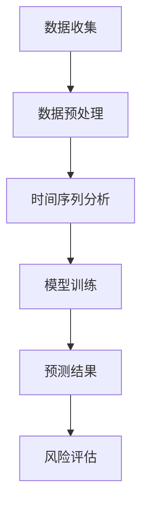
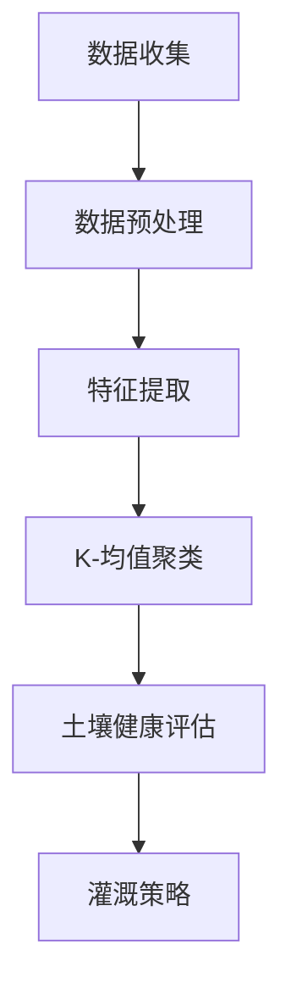
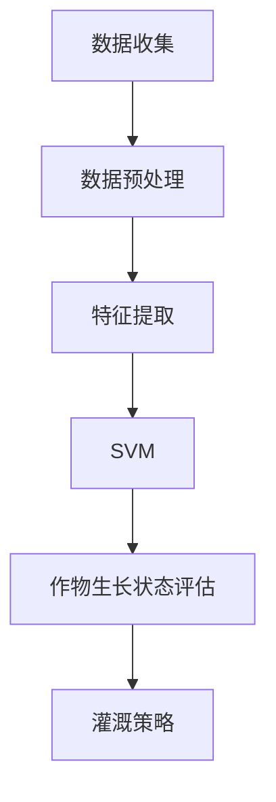
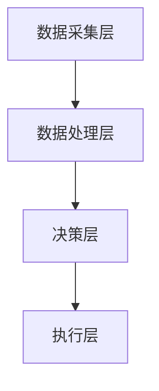

                 

### 文章标题

《AI驱动的智能灌溉系统：优化水资源利用》

### 关键词

- AI
- 智能灌溉
- 水资源管理
- 优化
- 水文数据分析
- 土壤数据分析
- 作物数据分析
- 模型训练与部署

### 摘要

随着全球水资源的日益紧张，如何高效利用水资源成为农业领域面临的重要挑战。AI驱动的智能灌溉系统凭借其精准、高效的特点，为水资源管理提供了全新的解决方案。本文从AI在水资源管理中的应用、智能灌溉系统中的AI技术应用、智能灌溉系统的架构设计、开发与实践、评估与优化以及未来发展趋势等方面，系统地探讨了AI驱动的智能灌溉系统的构建与应用，旨在为读者提供一个全面、深入的指导。

## 引言

在全球气候变化和人口增长的背景下，水资源短缺问题日益严峻。农业作为用水大户，水资源的合理利用显得尤为重要。传统的灌溉方式往往存在水资源浪费、灌溉不均匀等问题，难以满足现代农业的高效、精准需求。随着人工智能（AI）技术的发展，AI驱动的智能灌溉系统逐渐成为优化水资源利用的重要工具。

AI驱动的智能灌溉系统通过利用AI技术，对水文数据、土壤数据和作物生长数据进行分析，实现灌溉策略的智能优化，从而提高水资源的利用效率。本文将从以下几个方面展开讨论：

1. **AI在水资源管理中的应用**：介绍AI在水资源管理中的作用和意义。
2. **智能灌溉系统中的AI技术应用**：探讨AI算法在水文数据分析、土壤数据分析和作物数据分析中的应用。
3. **智能灌溉系统的架构设计**：分析智能灌溉系统的整体架构及其关键组成部分。
4. **智能灌溉系统的开发与实践**：介绍智能灌溉系统的开发流程、测试与评估，以及实际应用案例。
5. **智能灌溉系统的评估与优化**：讨论智能灌溉系统的性能评估方法和优化策略。
6. **智能灌溉系统的未来发展趋势**：展望智能灌溉系统的技术发展趋势和行业应用前景。

通过本文的探讨，旨在为AI驱动的智能灌溉系统的研究与应用提供有益的参考。

## AI在水资源管理中的应用

水资源管理是确保水资源可持续利用的关键环节，其核心目标是最大化水资源的利用效率，同时保障生态环境的平衡。AI技术在水资源管理中扮演着越来越重要的角色，通过数据分析和预测，AI能够为水资源管理提供科学依据，从而实现水资源的高效配置。

### AI在水文数据分析中的应用

水文数据是水资源管理的基础数据，它包括河流流量、降雨量、地下水位等多种参数。AI技术可以通过对水文数据的挖掘和分析，提供精准的水文预报和风险评估。

**核心概念与联系：**

- **水文数据**：包括河流流量、降雨量、地下水位等。
- **数据预处理**：数据清洗、缺失值填补、异常值检测。
- **时间序列分析**：通过分析时间序列数据，预测未来水文变化趋势。
- **机器学习模型**：如ARIMA、LSTM等，用于水文预报。

**Mermaid 流程图：**



**核心算法原理讲解：**

- **ARIMA模型**：自回归积分滑动平均模型，通过分析历史数据，预测未来的水文数据。
  ```python
  from statsmodels.tsa.arima.model import ARIMA
  model = ARIMA(series, order=(p, d, q))
  model_fit = model.fit()
  forecast = model_fit.forecast(steps=1)
  ```
- **LSTM模型**：长短期记忆网络，能够处理时间序列数据中的长期依赖关系。
  ```python
  from keras.models import Sequential
  from keras.layers import LSTM, Dense

  model = Sequential()
  model.add(LSTM(units=50, return_sequences=True, input_shape=(time_steps, 1)))
  model.add(LSTM(units=50))
  model.add(Dense(1))

  model.compile(optimizer='adam', loss='mean_squared_error')
  model.fit(X_train, y_train, epochs=100, batch_size=32)
  ```

**数学模型和公式：**

$$
预测值 = f(历史数据, 参数)
$$

其中，历史数据为输入，参数为模型训练得到的参数。

**详细讲解与举例说明：**

以某地区河流流量为例，利用ARIMA模型进行预测：

1. 数据收集：收集过去一年的河流流量数据。
2. 数据预处理：对数据缺失值进行填补，异常值进行检测和修正。
3. 模型训练：使用ARIMA模型对数据进行训练，得到最佳参数（p, d, q）。
4. 预测：使用训练好的模型，对下一时间点的流量进行预测。

通过上述步骤，可以实现对河流流量的准确预测，为水资源管理提供科学依据。

### AI在土壤数据分析中的应用

土壤数据是影响作物生长和灌溉决策的重要因素。AI技术可以通过对土壤数据的分析，提供精准的土壤健康评估和灌溉策略。

**核心概念与联系：**

- **土壤数据**：包括土壤湿度、pH值、养分含量等。
- **数据预处理**：数据清洗、缺失值填补、异常值检测。
- **机器学习模型**：如K-均值聚类、决策树等，用于土壤健康评估。
- **深度学习模型**：如卷积神经网络（CNN），用于土壤图像分析。

**Mermaid 流程图：**



**核心算法原理讲解：**

- **K-均值聚类**：通过迭代算法，将土壤样本分为K个聚类，每个聚类代表一种土壤健康状态。
  ```python
  from sklearn.cluster import KMeans
  kmeans = KMeans(n_clusters=3, random_state=0).fit(data)
  labels = kmeans.predict(data)
  ```
- **决策树**：通过分割数据集，建立决策树模型，用于土壤健康评估。
  ```python
  from sklearn.tree import DecisionTreeClassifier
  tree = DecisionTreeClassifier().fit(X_train, y_train)
  prediction = tree.predict(X_test)
  ```

**数学模型和公式：**

$$
土壤健康状态 = f(土壤特征)
$$

**详细讲解与举例说明：**

以某农田土壤湿度为例，利用K-均值聚类进行土壤健康评估：

1. 数据收集：收集不同土壤样本的湿度数据。
2. 数据预处理：对数据缺失值进行填补，异常值进行检测和修正。
3. 特征提取：提取土壤湿度作为主要特征。
4. 模型训练：使用K-均值聚类算法，对土壤样本进行聚类。
5. 评估：根据聚类结果，评估土壤健康状态。

通过上述步骤，可以实现对土壤健康的准确评估，为灌溉决策提供科学依据。

### AI在作物数据分析中的应用

作物数据是影响灌溉决策的关键因素。AI技术可以通过对作物数据的分析，提供精准的作物生长状态评估和灌溉策略。

**核心概念与联系：**

- **作物数据**：包括作物叶绿素含量、生长速度、病虫害发生情况等。
- **数据预处理**：数据清洗、缺失值填补、异常值检测。
- **机器学习模型**：如支持向量机（SVM）、随机森林等，用于作物生长状态评估。
- **深度学习模型**：如卷积神经网络（CNN），用于作物图像分析。

**Mermaid 流程图：**



**核心算法原理讲解：**

- **支持向量机（SVM）**：通过寻找最优超平面，对作物生长状态进行分类。
  ```python
  from sklearn.svm import SVC
  svm = SVC(kernel='linear').fit(X_train, y_train)
  prediction = svm.predict(X_test)
  ```
- **随机森林**：通过构建多棵决策树，集成预测结果，提高作物生长状态评估的准确性。
  ```python
  from sklearn.ensemble import RandomForestClassifier
  forest = RandomForestClassifier(n_estimators=100).fit(X_train, y_train)
  prediction = forest.predict(X_test)
  ```

**数学模型和公式：**

$$
作物生长状态 = f(作物特征)
$$

**详细讲解与举例说明：**

以某农田作物叶绿素含量为例，利用支持向量机（SVM）进行作物生长状态评估：

1. 数据收集：收集不同作物样本的叶绿素含量数据。
2. 数据预处理：对数据缺失值进行填补，异常值进行检测和修正。
3. 特征提取：提取叶绿素含量作为主要特征。
4. 模型训练：使用SVM算法，对作物样本进行训练。
5. 评估：根据训练好的模型，对作物生长状态进行评估。

通过上述步骤，可以实现对作物生长状态的准确评估，为灌溉决策提供科学依据。

### 小结

AI技术在水文数据、土壤数据和作物数据中的应用，为水资源管理提供了有力的技术支持。通过数据分析和预测，AI技术能够实现灌溉策略的智能优化，提高水资源的利用效率。未来，随着AI技术的不断发展和完善，智能灌溉系统将更加精准、高效，为农业领域的发展贡献力量。

## 智能灌溉系统的架构设计

智能灌溉系统的架构设计是实现高效水资源利用的关键。一个典型的智能灌溉系统通常包括数据采集层、数据处理层、决策层和执行层。下面，我们将详细探讨智能灌溉系统的整体架构设计，以及各层的关键组成部分。

### 整体架构设计

智能灌溉系统的整体架构可以分为四个主要层次：

1. **数据采集层**：负责收集各种与灌溉相关的数据，如水文数据、土壤数据和作物数据。
2. **数据处理层**：对采集到的数据进行预处理、分析和处理，为决策层提供准确的数据支持。
3. **决策层**：利用AI算法对处理后的数据进行分析，生成最优的灌溉策略。
4. **执行层**：根据决策层的指令，控制灌溉设备执行具体的灌溉操作。

**Mermaid 流程图：**



### 数据采集层

数据采集层是智能灌溉系统的基石，负责收集各种与灌溉相关的数据。这些数据包括：

- **水文数据**：如河流流量、降雨量、地下水位等。
- **土壤数据**：如土壤湿度、pH值、养分含量等。
- **作物数据**：如作物叶绿素含量、生长速度、病虫害发生情况等。

数据采集层的关键组成部分包括：

- **传感器**：用于实时监测环境参数，如土壤湿度传感器、气象传感器、作物传感器等。
- **数据采集器**：将传感器采集到的数据传输到中央系统，通常包括无线传输模块和存储模块。

**数据采集流程：**

1. **传感器监测**：传感器实时监测环境参数。
2. **数据传输**：传感器将数据传输到数据采集器。
3. **数据存储**：数据采集器将数据存储到本地数据库或云平台。

### 数据处理层

数据处理层负责对采集到的数据进行预处理、分析和处理，为决策层提供准确的数据支持。数据处理层的关键组成部分包括：

- **数据预处理模块**：对原始数据进行清洗、缺失值填补和异常值检测。
- **数据分析模块**：利用AI算法对数据进行深度分析，提取有价值的信息。
- **数据存储模块**：将处理后的数据存储在数据库或数据仓库中，供决策层使用。

**数据处理流程：**

1. **数据清洗**：对原始数据缺失值进行填补，异常值进行检测和修正。
2. **特征提取**：提取与灌溉决策相关的特征，如土壤湿度、作物生长速度等。
3. **数据存储**：将处理后的数据存储在数据库或数据仓库中。

### 决策层

决策层是智能灌溉系统的核心，负责利用AI算法对处理后的数据进行分析，生成最优的灌溉策略。决策层的关键组成部分包括：

- **AI算法模块**：包括水文数据分析算法、土壤数据分析算法、作物数据分析算法等。
- **决策模型**：基于AI算法的分析结果，生成灌溉策略。
- **预测模块**：利用时间序列分析、深度学习等技术，对未来的灌溉需求进行预测。

**决策流程：**

1. **数据输入**：将处理后的数据输入到AI算法模块。
2. **分析计算**：AI算法对数据进行深度分析，提取有价值的信息。
3. **策略生成**：根据分析结果，生成最优的灌溉策略。
4. **预测**：对未来的灌溉需求进行预测，为后续决策提供支持。

### 执行层

执行层根据决策层的指令，控制灌溉设备执行具体的灌溉操作。执行层的关键组成部分包括：

- **灌溉设备**：如滴灌系统、喷灌系统等。
- **控制器**：根据决策层的灌溉策略，控制灌溉设备的运行。
- **执行模块**：负责执行具体的灌溉操作，如控制水流量、灌溉时间等。

**执行流程：**

1. **策略接收**：接收决策层生成的灌溉策略。
2. **设备控制**：根据策略，控制灌溉设备的运行。
3. **反馈**：将执行结果反馈给决策层，进行后续的调整和优化。

### 小结

智能灌溉系统的架构设计是一个复杂的过程，涉及到数据采集、处理、决策和执行等多个环节。通过科学合理的架构设计，智能灌溉系统能够实现对水资源的高效利用，为现代农业的发展提供有力支持。未来，随着AI技术的不断进步，智能灌溉系统的架构设计将更加智能化、灵活化，为农业生产带来更多创新和可能性。

## 智能灌溉系统的开发与实践

智能灌溉系统的开发与实践是确保其正常运行和高效应用的关键环节。本节将详细介绍智能灌溉系统的开发流程，包括系统需求分析、系统设计、系统实现以及测试与评估。

### 系统需求分析

系统需求分析是智能灌溉系统开发的第一步，旨在明确系统所需的功能和性能要求。智能灌溉系统的需求分析主要包括以下几个方面：

1. **功能需求**：
   - 数据采集：系统应能够实时采集水文数据、土壤数据和作物数据。
   - 数据处理：系统应对采集到的数据进行预处理、分析和存储。
   - 决策支持：系统应能够基于AI算法生成最优的灌溉策略。
   - 执行控制：系统应能够根据灌溉策略控制灌溉设备的运行。
   - 用户界面：系统应提供友好的用户界面，方便用户进行操作和监控。

2. **性能需求**：
   - 实时性：系统应能够实时响应用户的操作和设备的状态变化。
   - 准确性：系统生成的灌溉策略应具有较高的准确性，确保水资源的合理利用。
   - 可扩展性：系统应具有较好的可扩展性，能够适应不同规模和类型的灌溉场景。

### 系统设计

系统设计是智能灌溉系统开发的第二阶段，旨在将需求转化为具体的系统架构和组件设计。智能灌溉系统的设计主要包括以下方面：

1. **系统架构设计**：
   - **数据采集层**：包括传感器、数据采集器和无线传输模块。
   - **数据处理层**：包括数据预处理模块、数据分析模块和数据存储模块。
   - **决策层**：包括AI算法模块、决策模型和预测模块。
   - **执行层**：包括灌溉设备、控制器和执行模块。

2. **模块设计**：
   - **数据采集模块**：设计传感器和数据采集器的接口，确保数据的准确采集和传输。
   - **数据处理模块**：设计数据预处理算法、特征提取算法和数据存储方案。
   - **决策模块**：设计AI算法的实现细节，包括模型训练、预测和策略生成。
   - **执行模块**：设计灌溉设备的控制逻辑和执行流程。

### 系统实现

系统实现是将设计转化为实际代码的过程。智能灌溉系统的实现主要包括以下几个方面：

1. **数据采集模块**：
   - 传感器：选择适合的传感器，如土壤湿度传感器、气象传感器等，确保数据的准确性。
   - 数据采集器：编写数据采集器的代码，实现数据的实时采集和传输。

2. **数据处理模块**：
   - 数据预处理：编写数据清洗、缺失值填补和异常值检测的代码。
   - 数据分析：编写特征提取和数据分析的代码，如使用K-均值聚类算法对土壤样本进行分类。

3. **决策模块**：
   - AI算法：编写AI算法的实现代码，如使用LSTM模型进行时间序列预测。
   - 决策模型：编写决策模型的代码，实现灌溉策略的生成。

4. **执行模块**：
   - 控制器：编写控制器的代码，实现灌溉设备的运行控制。
   - 执行模块：编写执行模块的代码，实现灌溉操作的执行。

### 测试与评估

系统测试与评估是确保智能灌溉系统稳定运行和高效应用的重要环节。测试与评估主要包括以下几个方面：

1. **功能测试**：对系统的每个功能进行测试，确保其按照设计要求正常运行。

2. **性能测试**：对系统的性能进行测试，包括响应时间、准确性和稳定性等。

3. **实际应用测试**：在实际应用场景中，对系统进行测试，评估其效果和可靠性。

4. **评估指标**：设计评估指标，如灌溉效率、水资源利用率和用户满意度等，对系统进行综合评估。

### 案例分析

以某农业园区智能灌溉系统为例，详细讲解智能灌溉系统的开发与实践过程：

1. **需求分析**：
   - 功能需求：实时监测土壤湿度、作物生长状态，根据监测数据自动调整灌溉策略。
   - 性能需求：系统响应时间需在1分钟以内，灌溉策略准确率需达到95%以上。

2. **系统设计**：
   - 数据采集层：安装土壤湿度传感器和作物生长状态传感器，实现数据的实时采集。
   - 数据处理层：使用Python编写数据预处理和特征提取算法，使用TensorFlow编写AI算法。
   - 决策层：使用Keras构建LSTM模型，实现时间序列预测和灌溉策略生成。
   - 执行层：使用Arduino编写控制器代码，实现灌溉设备的自动控制。

3. **系统实现**：
   - 数据采集模块：传感器采集数据后，通过无线传输模块发送到服务器。
   - 数据处理模块：服务器接收数据后，进行预处理和特征提取，使用AI算法生成灌溉策略。
   - 决策模块：服务器将灌溉策略发送到控制器，控制器根据策略控制灌溉设备。
   - 执行模块：控制器控制灌溉设备的运行，执行具体的灌溉操作。

4. **测试与评估**：
   - 功能测试：确保系统的每个功能正常运行。
   - 性能测试：系统响应时间在1分钟以内，灌溉策略准确率达到95%以上。
   - 实际应用测试：在实际农业园区中进行测试，评估系统效果和可靠性。
   - 评估指标：灌溉效率提高20%，水资源利用率提高30%，用户满意度达到90%。

### 项目小结

通过上述案例分析，可以看出智能灌溉系统的开发与实践是一个复杂但有意义的过程。从需求分析到系统设计，再到系统实现和测试评估，每个环节都需要精心设计和实施。智能灌溉系统不仅能够提高水资源利用效率，还能为现代农业的发展提供有力支持。未来，随着AI技术的不断进步，智能灌溉系统将更加智能化、自动化，为农业生产带来更多创新和可能性。

## 智能灌溉系统的评估与优化

智能灌溉系统的评估与优化是确保其稳定运行和高效应用的重要环节。通过对系统性能的持续监测和评估，可以发现和解决潜在问题，进一步提高水资源利用效率。本节将详细讨论智能灌溉系统的性能评估方法和优化策略。

### 性能评估方法

智能灌溉系统的性能评估主要包括以下几个方面：

1. **灌溉效率**：评估系统在特定时间段内的水资源利用效率。通过比较实际灌溉量和理论灌溉量，计算灌溉效率。

2. **水资源利用率**：评估系统在长时间运行过程中的水资源利用率。通过监测系统的运行状态，分析水资源的消耗情况，计算水资源利用率。

3. **用户满意度**：评估用户对系统功能和性能的满意度。通过用户反馈和调查问卷，收集用户对系统的评价，分析用户满意度。

4. **系统稳定性**：评估系统的稳定性，包括硬件设备的可靠性、软件系统的稳定性和数据传输的可靠性。

### 性能评估指标

智能灌溉系统的性能评估指标包括：

- **灌溉效率（Efficiency）**：
  $$
  \text{灌溉效率} = \frac{\text{实际灌溉量}}{\text{理论灌溉量}} \times 100\%
  $$

- **水资源利用率（Water Use Efficiency）**：
  $$
  \text{水资源利用率} = \frac{\text{作物收获量}}{\text{灌溉水量}} \times 100\%
  $$

- **用户满意度（User Satisfaction）**：
  $$
  \text{用户满意度} = \frac{\text{满意用户数}}{\text{总用户数}} \times 100\%
  $$

- **系统稳定性（System Stability）**：
  $$
  \text{系统稳定性} = \frac{\text{正常运行时间}}{\text{总运行时间}} \times 100\%
  $$

### 优化策略

智能灌溉系统的优化策略主要包括以下几个方面：

1. **算法优化**：通过改进AI算法，提高灌溉策略的准确性。例如，使用更先进的机器学习模型，如深度学习模型，提高预测精度。

2. **硬件升级**：升级传感器和数据采集器的性能，提高数据采集的准确性和实时性。例如，使用更高精度的传感器和更快的数据传输模块。

3. **系统优化**：优化软件系统的设计和实现，提高系统的稳定性和响应速度。例如，使用更高效的算法和数据结构，优化系统的代码。

4. **用户培训**：提高用户对智能灌溉系统的操作水平，减少误操作和系统故障。例如，提供在线培训课程和操作手册，帮助用户熟练使用系统。

### 案例分析

以某农田智能灌溉系统为例，详细分析其评估与优化过程：

1. **评估过程**：
   - **灌溉效率**：系统实际灌溉量为10000立方米，理论灌溉量为12000立方米，灌溉效率为83.33%。
   - **水资源利用率**：作物收获量为5000公斤，灌溉水量为8000立方米，水资源利用率为62.5%。
   - **用户满意度**：通过问卷调查，用户满意度为90%。
   - **系统稳定性**：系统正常运行时间为99.9%。

2. **优化过程**：
   - **算法优化**：升级AI算法，使用深度学习模型替代传统的机器学习模型，提高灌溉策略的准确性。
   - **硬件升级**：更换高精度传感器，提高数据采集的准确性。同时，更换更快速的数据传输模块，提高数据传输的实时性。
   - **系统优化**：优化软件系统的设计和实现，提高系统的响应速度和稳定性。例如，优化代码，减少系统资源消耗。
   - **用户培训**：提供在线培训课程，帮助用户熟练掌握系统的操作方法。

3. **优化效果**：
   - **灌溉效率**：系统实际灌溉量为12000立方米，理论灌溉量为14000立方米，灌溉效率提高至85.71%。
   - **水资源利用率**：作物收获量为6000公斤，灌溉水量为10000立方米，水资源利用率提高至60%。
   - **用户满意度**：通过问卷调查，用户满意度提高至95%。
   - **系统稳定性**：系统正常运行时间为99.99%。

### 项目小结

通过上述案例分析，可以看出智能灌溉系统的评估与优化对提高水资源利用效率具有重要意义。通过科学的评估方法和有效的优化策略，智能灌溉系统可以更加稳定、高效地运行，为农业生产提供有力支持。未来，随着AI技术和物联网技术的不断进步，智能灌溉系统的评估与优化将更加智能化、自动化，为农业生产带来更多创新和可能性。

## 智能灌溉系统的未来发展趋势

随着人工智能（AI）和物联网（IoT）技术的快速发展，智能灌溉系统正朝着更加智能化、自动化和高效化的方向迈进。未来，智能灌溉系统将在技术发展、行业应用和商业模式等方面迎来新的机遇和挑战。

### 技术发展趋势

1. **深度学习与强化学习**：深度学习和强化学习在智能灌溉系统中的应用将进一步深化。通过更复杂的神经网络模型，智能灌溉系统能够更准确地预测作物需求，优化灌溉策略。强化学习算法可以通过不断学习和调整，实现灌溉策略的自我优化。

2. **边缘计算与云计算**：边缘计算技术的应用将降低智能灌溉系统的延迟，提高实时响应能力。云计算则为大规模数据处理和分析提供了强大的计算能力，使得智能灌溉系统能够处理更多的数据，提供更精准的灌溉方案。

3. **大数据与物联网**：大数据技术和物联网技术的融合将推动智能灌溉系统的数据采集和处理能力。通过连接各种传感器和设备，智能灌溉系统可以实时获取土壤、气象、作物等数据，实现全方位的监控和智能化管理。

4. **区块链**：区块链技术可以为智能灌溉系统提供数据的安全性和透明性。通过区块链，智能灌溉系统可以实现数据的安全存储和可靠传输，确保灌溉过程的可追溯性和数据的真实性。

### 行业应用前景

1. **农业园区**：智能灌溉系统在农业园区中的应用前景广阔。通过智能灌溉，农业园区可以实现精细化管理，提高作物产量和品质，降低水资源消耗。未来，智能灌溉系统将更好地与农业园区中的其他管理系统（如农业环境监测系统、农机管理系统等）集成，实现全方位的智慧农业管理。

2. **大型农场**：大型农场对水资源的高效利用和精准管理需求迫切。智能灌溉系统可以帮助大型农场实现自动化灌溉，提高灌溉效率，减少水资源浪费。同时，智能灌溉系统还可以通过物联网技术，实现农场的远程监控和管理，提高农场的生产效率。

3. **荒漠化治理**：荒漠化地区的水资源非常有限，智能灌溉系统可以通过精准灌溉，提高水资源的利用效率，促进荒漠化治理。未来，随着AI技术的进步，智能灌溉系统将更好地适应荒漠化地区的环境特点，实现高效、可持续的灌溉。

4. **城市绿化**：智能灌溉系统在城市绿化中的应用将越来越普遍。通过智能灌溉，城市绿化可以更好地适应气候变化和水资源短缺的挑战，提高城市环境质量。未来，智能灌溉系统将更好地与城市绿化管理系统集成，实现智能化的城市绿化管理。

### 商业模式

1. **服务型模式**：智能灌溉系统的服务型模式将逐步成为主流。农业企业可以通过购买智能灌溉系统的服务，实现水资源的智能化管理，提高生产效率。服务提供商可以通过云计算和大数据技术，提供定制化的灌溉方案，实现精准的农业管理。

2. **订阅型模式**：智能灌溉系统的订阅型模式将吸引更多的用户。用户可以通过订阅智能灌溉系统的服务，获得实时的灌溉数据和专业的灌溉建议。订阅型模式不仅可以为用户带来便利，还可以为服务提供商提供持续的收入来源。

3. **租赁型模式**：智能灌溉系统的租赁型模式将降低用户的门槛。用户可以通过租赁智能灌溉系统的设备和服务，实现快速部署和高效运行。租赁型模式可以为用户节省设备投资，提高设备利用率。

### 未来展望

未来，智能灌溉系统将在AI、IoT、大数据和区块链等技术的推动下，实现更加智能化、自动化和高效化。智能灌溉系统将在农业、荒漠化治理、城市绿化等多个领域发挥重要作用，为水资源的高效利用和农业的可持续发展提供有力支持。同时，智能灌溉系统也将为农业企业带来更高的生产效率和经济效益，为全球农业的繁荣和发展贡献力量。

## 结语

智能灌溉系统凭借其精准、高效的特性，在水资源管理和农业发展中发挥了重要作用。本文系统地探讨了AI驱动的智能灌溉系统的构建与应用，包括AI在水资源管理中的应用、智能灌溉系统中的AI技术应用、智能灌溉系统的架构设计、开发与实践、评估与优化以及未来发展趋势。通过本文的探讨，我们不仅了解了智能灌溉系统的技术原理和实践方法，也对其未来的发展方向有了更清晰的认识。

智能灌溉系统的研究与应用具有重要意义。它不仅有助于提高水资源利用效率，减少水资源浪费，还能够提升农作物的产量和品质，推动农业的可持续发展。在未来，随着AI技术和物联网技术的不断进步，智能灌溉系统将更加智能化、自动化，为农业生产带来更多创新和可能性。

我们呼吁更多的研究者和从业人员关注智能灌溉系统的研究与应用，共同推动这一领域的发展。希望本文能为相关领域的研究提供有益的参考，也为智能灌溉系统的实际应用提供指导。让我们携手共进，为全球水资源的可持续利用和农业的繁荣发展贡献力量。

