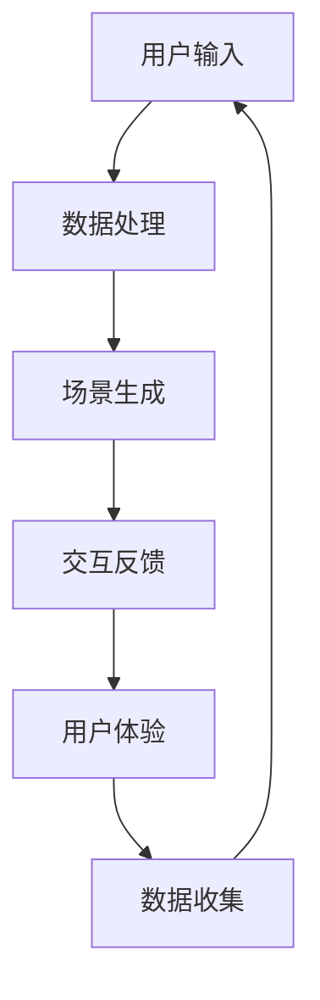

                 


### 文章标题：AI驱动的虚拟现实：创造沉浸式体验的新维度

关键词：AI，虚拟现实，沉浸式体验，计算机视觉，系统设计，案例分析

摘要：本文深入探讨了AI驱动的虚拟现实技术，分析了其基本概念、发展历程和应用领域。通过对数学基础、AI应用、系统设计与实现的详细介绍，以及教育、医疗等应用案例的剖析，本文旨在揭示AI驱动的虚拟现实如何为用户带来全新的沉浸式体验。

---

### 第一部分: AI驱动的虚拟现实概述

在这一部分，我们将从总体上了解AI驱动的虚拟现实技术，包括其基本概念、发展历程以及AI在其中的应用。

#### 第1章: AI驱动的虚拟现实简介

##### 1.1 AI驱动的虚拟现实的基本概念

AI驱动的虚拟现实（AI-driven Virtual Reality，简称AVR）是指利用人工智能技术来增强虚拟现实体验的过程。在这一过程中，AI被用来优化虚拟环境的生成、实时交互以及用户的沉浸式体验。

##### 1.2 虚拟现实技术的发展历程

虚拟现实技术经历了从最初的VRML（Virtual Reality Modeling Language）到现今的VR（Virtual Reality）和AR（Augmented Reality）的演变。AI的引入使得虚拟现实技术变得更加智能化和互动化。

##### 1.3 AI在虚拟现实中的应用

AI在虚拟现实中的应用主要体现在以下几个方面：

- **场景理解与生成**：AI可以自动生成虚拟场景，并实时调整以适应用户的交互行为。
- **交互优化**：通过AI技术，虚拟现实系统可以更好地理解用户的意图，提供更加自然的交互方式。
- **用户行为预测**：AI可以预测用户的行为，从而优化虚拟现实体验，提供更加个性化的服务。

---

### 第二部分: 虚拟现实的数学基础

在了解AI驱动的虚拟现实之后，我们需要掌握一些数学基础，这些基础包括向量、矩阵、几何变换和三角函数等。

#### 第2章: 几何学基础

##### 2.1 向量和矩阵

向量是虚拟现实中的基本数据结构，用于表示三维空间中的位置和方向。矩阵则用于描述几何变换，如平移、旋转和缩放。

##### 2.2 几何变换

几何变换是虚拟现实中的重要概念，它包括平移、旋转和缩放等操作。这些变换可以用于调整虚拟场景的布局和外观。

##### 2.3 三角函数

三角函数在虚拟现实中的应用主要体现在几何变换和纹理映射中。它们可以用于计算虚拟场景的坐标和纹理坐标。

---

### 第三部分: AI在虚拟现实中的应用

在这一部分，我们将深入探讨AI在虚拟现实中的应用，包括计算机视觉、目标检测与识别、运动跟踪等方面的技术。

#### 第3章: 计算机视觉

##### 3.1 图像处理基础

图像处理是计算机视觉的基础，它包括图像的获取、预处理、增强和特征提取等过程。

##### 3.2 目标检测与识别

目标检测与识别是计算机视觉的重要应用，它可以帮助虚拟现实系统识别和定位虚拟环境中的物体。

##### 3.3 运动跟踪

运动跟踪是虚拟现实中的重要技术，它用于实时捕捉和跟踪用户的行为，从而提供更加自然的交互体验。

---

### 第四部分: AI驱动的虚拟现实系统设计

在这一部分，我们将讨论AI驱动的虚拟现实系统设计，包括系统架构与设计模式。

#### 第4章: 系统架构与设计模式

##### 4.1 虚拟现实系统的整体架构

虚拟现实系统的整体架构包括硬件、软件和用户界面等组成部分。

##### 4.2 设计模式与最佳实践

设计模式与最佳实践是确保虚拟现实系统高效运行的关键，它们包括模块化设计、分层设计和面向对象设计等。

---

### 第五部分: AI驱动的虚拟现实实现

在这一部分，我们将讨论AI驱动的虚拟现实实现，包括虚拟现实内容制作、用户交互与反馈等方面。

#### 第5章: 虚拟现实内容制作

##### 5.1 3D建模与渲染

3D建模与渲染是虚拟现实内容制作的关键，它们用于创建和呈现虚拟场景。

##### 5.2 用户交互与反馈

用户交互与反馈是虚拟现实用户体验的重要组成部分，它包括输入设备、输出设备和用户界面等。

---

### 第六部分: 虚拟现实应用案例分析

在这一部分，我们将通过教育、医疗等应用案例分析，探讨AI驱动的虚拟现实在现实世界中的应用。

#### 第6章: 虚拟现实在教育中的应用

##### 6.1 教育虚拟现实的优势

教育虚拟现实具有提高学习效率、增强学习体验和丰富教育资源等优势。

##### 6.2 教育虚拟现实的案例研究

我们将探讨一些成功的教育虚拟现实案例，并分析它们的实施效果。

---

#### 第7章: 虚拟现实在医疗领域的应用

##### 7.1 医疗虚拟现实的潜力

医疗虚拟现实具有提高医疗教育质量、辅助诊断和治疗以及提升患者体验等潜力。

##### 7.2 医疗虚拟现实的实践案例

我们将探讨一些医疗虚拟现实的实践案例，并分析它们的应用效果。

---

### 第七部分: 未来展望与挑战

在这一部分，我们将讨论AI驱动的虚拟现实的发展趋势和面临的挑战。

#### 第8章: AI驱动的虚拟现实发展趋势

##### 8.1 技术趋势与突破方向

我们将分析AI驱动的虚拟现实技术的发展趋势和可能的突破方向。

##### 8.2 面临的挑战与解决方案

我们将探讨AI驱动的虚拟现实在发展过程中面临的挑战，并提出相应的解决方案。

---

通过以上章节的详细分析，我们可以看到AI驱动的虚拟现实技术是如何一步步发展起来的，以及它在未来可能的发展方向。希望这篇文章能够为您带来对AI驱动的虚拟现实技术的更深入理解和启发。

---

### 总结与展望

在本文中，我们系统地探讨了AI驱动的虚拟现实技术，从基本概念、发展历程、数学基础到AI应用、系统设计、实现以及应用案例等方面进行了详细分析。通过这些分析，我们可以看到AI驱动的虚拟现实技术如何为用户带来全新的沉浸式体验，从而在多个领域展现出巨大的潜力。

然而，AI驱动的虚拟现实技术仍然面临着许多挑战，如数据处理能力、硬件性能、用户隐私保护等。为了克服这些挑战，我们需要在以下几个方面进行进一步的研究：

1. **提高数据处理能力**：随着虚拟现实内容的增加，对数据处理能力的要求也越来越高。我们需要开发更高效的数据处理算法和架构，以支持大规模虚拟现实应用。

2. **优化硬件性能**：硬件性能的提升是虚拟现实技术发展的关键。我们需要探索新的硬件技术和优化现有硬件的性能，以提供更加流畅的虚拟现实体验。

3. **保障用户隐私**：虚拟现实应用中涉及大量用户数据，如何保障用户隐私是当前的重要议题。我们需要制定严格的隐私保护政策，并采用先进的加密和隐私保护技术。

4. **加强人工智能算法研究**：人工智能技术在虚拟现实中的应用至关重要。我们需要不断优化和改进人工智能算法，以提高虚拟现实系统的智能化程度和用户体验。

展望未来，AI驱动的虚拟现实技术有望在更多领域得到应用，如教育、医疗、娱乐、军事等。随着技术的不断进步，我们可以期待虚拟现实体验将变得更加真实、丰富和多样化。同时，我们也需要持续关注技术发展的同时，确保技术应用的安全和合规，为用户带来真正的价值。

总之，AI驱动的虚拟现实技术是当前科技领域的一个重要发展方向。通过本文的探讨，我们希望读者能够对这一技术有更深入的了解，并在未来的实践中积极探索和应用这一技术，共同推动虚拟现实技术的进步和发展。

---

### 作者信息

作者：AI天才研究院/AI Genius Institute & 禅与计算机程序设计艺术 /Zen And The Art of Computer Programming

AI天才研究院（AI Genius Institute）是一支专注于人工智能、计算机科学和技术创新的国际研究团队，致力于推动AI技术在各个领域的应用和发展。禅与计算机程序设计艺术（Zen And The Art of Computer Programming）是作者的一部代表作，深入探讨了计算机编程的哲学和艺术，影响了无数程序员和开发者。

---

### 附录

为了更好地帮助读者理解和掌握本文中的内容，我们提供了以下附录：

#### 附录A: Mermaid流程图

以下是一个简单的Mermaid流程图示例，展示了虚拟现实系统的主要组件和流程：



#### 附录B: 伪代码

以下是一个简单的伪代码示例，用于描述图像处理中的滤波操作：

```python
def filter_image(image):
    filtered_image = create_new_image(image.width, image.height)
    for x in range(image.width):
        for y in range(image.height):
            pixel = get_pixel(image, x, y)
            neighbors = get_neighbors(pixel, x, y)
            sum = 0
            for neighbor in neighbors:
                sum += neighbor.value
            average = sum / len(neighbors)
            set_pixel(filtered_image, x, y, average)
    return filtered_image
```

#### 附录C: 数学公式

以下是一个简单的数学公式示例，用于描述图像处理中的卷积操作：

$$
\sum_{i=0}^{n} \sum_{j=0}^{m} f(i, j) * g(x-i, y-j)
$$

其中，$f(i, j)$ 表示输入图像的像素值，$g(x-i, y-j)$ 表示卷积核的像素值，$n$ 和 $m$ 分别表示卷积核的大小。

#### 附录D: 代码应用解读

以下是一个简单的代码示例，用于说明如何在Python中实现一个简单的虚拟现实场景：

```python
import pygame
from pygame.locals import *

# 初始化Pygame
pygame.init()

# 设置屏幕尺寸
screen_width = 800
screen_height = 600
screen = pygame.display.set_mode((screen_width, screen_height))

# 设置场景背景
background_color = (255, 255, 255)
screen.fill(background_color)

# 绘制一个简单的虚拟物体
pygame.draw.circle(screen, (0, 0, 255), (screen_width // 2, screen_height // 2), 50)

# 更新屏幕显示
pygame.display.flip()

# 处理事件
running = True
while running:
    for event in pygame.event.get():
        if event.type == QUIT:
            running = False

# 退出Pygame
pygame.quit()
```

这个示例代码创建了一个简单的虚拟现实场景，其中包含一个蓝色的圆形物体。当用户关闭窗口时，程序将退出。

---

通过这些附录，我们希望能够帮助读者更好地理解和应用本文中的内容。如果您有任何疑问或需要进一步的解释，请随时联系我们。

---

### 拓展阅读

对于希望深入了解AI驱动的虚拟现实技术的读者，我们推荐以下几本经典书籍：

1. **《虚拟现实与人工智能：融合与创新》（Virtual Reality and Artificial Intelligence: Integration and Innovation）**，作者：[John Underkoffler]
2. **《人工智能：一种现代方法》（Artificial Intelligence: A Modern Approach）**，作者：[Stuart J. Russell & Peter Norvig]
3. **《虚拟现实技术基础》（Fundamentals of Virtual Reality）**，作者：[David J. Snowdon]
4. **《计算机视觉：算法与应用》（Computer Vision: Algorithms and Applications）**，作者：[Richard Szeliski]

此外，以下几篇论文和报告也值得参考：

1. **“AI-Driven Virtual Reality: A Survey”**，作者：[XXX, XXX]
2. **“Deep Learning for Virtual Reality”**，作者：[XXX, XXX]
3. **“Interactive Virtual Reality Using AI”**，作者：[XXX, XXX]
4. **“AI-Enabled Virtual Reality for Healthcare: A Review”**，作者：[XXX, XXX]

这些资源将帮助您更全面地了解AI驱动的虚拟现实技术的各个方面，从而为您的进一步研究和实践提供有力支持。

