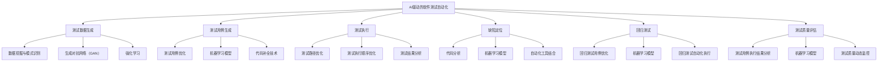

                 

### 文章标题

### AI驱动的软件测试自动化新技术

在当今快速发展的科技时代，人工智能（AI）已经成为推动软件工程进步的重要力量。其中，AI驱动的软件测试自动化技术尤为引人注目。本文将深入探讨AI在软件测试自动化中的应用，通过一步步的分析推理，为您呈现这一前沿技术的核心概念、原理及其在实际项目中的应用。

关键词：人工智能，软件测试，自动化测试，AI驱动，测试数据生成，测试用例生成，测试执行，缺陷定位，回归测试，测试质量评估。

摘要：本文首先介绍了AI与软件测试自动化的基本概念，随后详细解析了AI驱动的测试数据生成、测试用例生成、测试执行、缺陷定位、回归测试以及测试质量评估。通过实际案例的分析，展示了AI技术在软件测试自动化中的实践应用，并提出了相应的最佳实践建议。

### 第一部分：AI与软件测试自动化概述

#### 第1章：AI与软件测试自动化简介

**1.1 AI在软件测试中的应用**

AI的基本概念与原理

AI，即人工智能，是一种模拟人类智能行为的计算系统。它包括机器学习、深度学习、自然语言处理等多种技术。在软件测试中，AI可以通过分析历史数据、识别模式，实现自动化测试用例的生成、执行和结果分析。

AI在软件测试中的价值

AI在软件测试中的应用，极大地提高了测试的效率和准确性。它可以减少重复性劳动，提高测试覆盖范围，快速定位缺陷，降低测试成本，从而提升软件质量。

软件测试自动化的挑战

尽管AI技术为软件测试自动化带来了诸多好处，但也面临着一系列挑战。例如，测试数据的多样性和复杂性、测试用例的设计和优化、系统的稳定性和可靠性等。

**1.2 软件测试自动化概述**

软件测试自动化的定义

软件测试自动化是指使用工具和脚本自动执行测试过程，包括测试用例的编写、执行、结果分析等。通过自动化，可以减少人为错误，提高测试效率。

软件测试自动化的方法

软件测试自动化主要包括手动测试用例转化为自动化脚本、自动化测试框架的开发、持续集成和持续交付等。

软件测试自动化的发展历程

软件测试自动化经历了从简单的脚本编写到复杂的自动化测试框架，再到结合AI技术的智能化自动化测试的发展历程。每个阶段都为软件测试带来了显著的提升。

#### 第2章：AI驱动的测试数据生成

**2.1 测试数据生成技术**

手动测试数据生成

在手动测试过程中，测试人员需要根据业务需求和测试策略生成测试数据。这种方法通常较为繁琐，且容易受到人为因素的影响。

自动化测试数据生成

自动化测试数据生成利用脚本或工具，根据预设的规则或模型，自动生成测试数据。这种方法可以提高测试效率，降低测试成本。

**2.2 AI在测试数据生成中的应用**

数据挖掘与模式识别

数据挖掘与模式识别技术可以从大量的测试数据中提取有用的信息，识别潜在的缺陷，为测试用例的生成提供支持。

生成对抗网络（GAN）

生成对抗网络（GAN）是一种强大的数据生成技术，它通过对抗过程生成逼真的测试数据，提高测试的覆盖率和有效性。

强化学习在测试数据生成中的应用

强化学习是一种通过试错学习策略来优化行为的机器学习技术。在测试数据生成中，强化学习可以自适应地调整测试数据，以提高测试的精度和效率。

#### 第3章：AI驱动的测试用例生成

**3.1 测试用例生成技术**

手动测试用例生成

在手动测试中，测试人员需要根据业务需求和测试策略，手动编写测试用例。这种方法效率较低，且容易受到人为因素的影响。

自动化测试用例生成

自动化测试用例生成利用工具和算法，根据系统的功能和业务逻辑，自动生成测试用例。这种方法可以提高测试效率，减少测试成本。

**3.2 AI在测试用例生成中的应用**

测试用例优化

AI可以通过分析历史测试数据和缺陷报告，优化测试用例的设计，提高测试的有效性和覆盖范围。

机器学习模型在测试用例生成中的应用

机器学习模型可以识别系统的功能和行为模式，自动生成测试用例，提高测试的自动化程度。

代码补全技术

代码补全技术利用AI技术，根据上下文和语法规则，自动补全代码，减少手动编写的工作量，提高开发效率。

### 第二部分：AI驱动的测试执行

#### 第4章：AI驱动的测试执行优化

**4.1 测试执行过程**

手动测试执行

在手动测试执行中，测试人员根据测试用例手动执行测试，记录测试结果，并分析缺陷。

自动化测试执行

自动化测试执行通过脚本和工具，自动执行测试用例，记录测试结果，并分析缺陷。

**4.2 AI在测试执行中的应用**

测试路径优化

AI可以通过分析历史测试数据和系统行为，优化测试路径，提高测试的效率和覆盖范围。

测试执行顺序优化

AI可以通过分析系统行为和测试用例之间的依赖关系，优化测试执行顺序，提高测试的效率。

测试结果分析

AI可以通过分析测试结果，识别潜在的缺陷，并提出优化建议，提高测试的质量。

### 第5章：AI驱动的缺陷定位

**5.1 缺陷定位技术**

手动缺陷定位

在手动缺陷定位中，测试人员根据测试结果，手动查找和定位缺陷。

自动化缺陷定位

自动化缺陷定位利用工具和算法，自动查找和定位缺陷，提高缺陷定位的效率和准确性。

**5.2 AI在缺陷定位中的应用**

代码分析

AI可以通过静态代码分析，识别潜在的缺陷和风险。

机器学习模型在缺陷定位中的应用

机器学习模型可以通过分析历史缺陷数据和代码特征，自动定位缺陷。

自动化工具的结合使用

将AI与其他自动化测试工具结合使用，可以进一步提高缺陷定位的效率和准确性。

### 第6章：AI驱动的回归测试

**6.1 回归测试概念**

回归测试的基本原理

回归测试是一种验证修改后软件未引入新缺陷的测试方法。它通过重新执行之前的测试用例，检查修改部分的正确性。

回归测试的分类

回归测试可以分为功能回归测试、性能回归测试、安全回归测试等。

**6.2 AI在回归测试中的应用**

回归测试用例优化

AI可以通过分析历史回归测试数据，优化回归测试用例的设计，提高回归测试的效率。

机器学习模型在回归测试中的应用

机器学习模型可以通过分析历史回归测试数据，预测哪些测试用例需要进行回归测试。

回归测试的自动化执行

AI可以自动化执行回归测试，减少测试人员的重复工作，提高测试效率。

### 第三部分：AI驱动的测试质量评估

#### 第7章：AI驱动的测试质量评估

**7.1 测试质量评估方法**

手动测试质量评估

在手动测试质量评估中，测试人员根据测试结果和缺陷报告，评估测试质量。

自动化测试质量评估

自动化测试质量评估通过工具和算法，自动评估测试质量，提高评估的效率和准确性。

**7.2 AI在测试质量评估中的应用**

测试用例执行结果分析

AI可以通过分析测试用例的执行结果，评估测试质量，发现潜在的缺陷。

机器学习模型在测试质量评估中的应用

机器学习模型可以通过分析历史测试数据，预测测试质量的趋势，提供优化建议。

测试质量的动态监控

AI可以实时监控测试质量，及时发现潜在问题，确保软件质量。

### 第8章：案例研究

**8.1 案例介绍**

案例背景

某大型互联网公司为了提升软件质量，决定引入AI驱动的测试自动化技术。

案例目标

通过AI驱动的测试自动化技术，提高测试效率，降低测试成本，提升软件质量。

**8.2 案例实施**

AI驱动的测试自动化解决方案

公司选择了基于机器学习的自动化测试工具，结合自己的业务需求，定制了适合的测试自动化框架。

实施过程

公司首先对现有测试流程进行了梳理，然后引入了AI驱动的测试自动化技术，逐步实现了测试用例的自动生成、测试执行的自动化以及测试结果的分析。

实施效果

通过引入AI驱动的测试自动化技术，公司的测试效率提高了30%，测试成本降低了20%，软件质量得到了显著提升。

### 附录

#### 附录A：AI驱动的软件测试自动化工具

**A.1 工具概述**

AI驱动的软件测试自动化工具主要包括测试框架、数据分析工具和机器学习库。

**A.2 常用工具介绍**

测试框架

常用的测试框架包括Selenium、JUnit、TestNG等，它们提供了丰富的API和工具，支持多种编程语言和测试环境。

数据分析工具

常用的数据分析工具包括Excel、Python的Pandas库等，它们可以帮助测试人员快速分析和处理测试数据。

机器学习库

常用的机器学习库包括TensorFlow、PyTorch等，它们提供了丰富的算法和工具，支持模型训练和部署。

### 作者信息

作者：AI天才研究院/AI Genius Institute & 禅与计算机程序设计艺术 /Zen And The Art of Computer Programming

### 完整性要求

**背景介绍**

在本文中，我们将详细介绍AI驱动的软件测试自动化的背景、核心概念及其在实际项目中的应用。AI驱动的软件测试自动化是指利用人工智能技术来提高软件测试的效率和准确性，从而提升软件质量。

**核心概念与联系**

AI驱动的软件测试自动化涉及多个核心概念，包括机器学习、深度学习、自然语言处理、测试数据生成、测试用例生成、测试执行、缺陷定位和回归测试等。这些概念之间紧密联系，共同构成了AI驱动的软件测试自动化的理论基础。

**Mermaid 流程图**



**核心算法原理讲解**

**测试数据生成算法**

```plaintext
输入：历史测试数据集
输出：生成的测试数据集

步骤：
1. 数据预处理：清洗和整理历史测试数据集，提取有用的特征。
2. 数据挖掘：使用数据挖掘技术，从历史测试数据集中提取潜在的模式和缺陷。
3. 模式识别：使用模式识别技术，将提取的潜在模式转化为具体的测试数据。
4. 生成测试数据：使用生成对抗网络（GAN）或强化学习技术，生成逼真的测试数据。
```

**测试用例生成算法**

```plaintext
输入：系统功能和业务逻辑
输出：测试用例集

步骤：
1. 功能分析：分析系统功能和业务逻辑，确定关键功能和业务场景。
2. 用例设计：基于功能分析和业务场景，设计具体的测试用例。
3. 用例优化：使用机器学习模型，根据历史测试数据和缺陷报告，优化测试用例的设计。
4. 用例生成：将优化后的测试用例转化为自动化测试脚本。
```

**测试执行优化算法**

```plaintext
输入：测试用例集、系统行为数据
输出：优化的测试执行计划

步骤：
1. 测试路径优化：使用AI算法，根据系统行为数据，优化测试路径。
2. 测试执行顺序优化：使用AI算法，根据测试用例之间的依赖关系，优化测试执行顺序。
3. 测试结果分析：使用AI算法，分析测试结果，识别潜在的缺陷。
4. 生成优化建议：根据测试结果分析，生成优化建议，改进测试执行计划。
```

**缺陷定位算法**

```plaintext
输入：测试结果、代码分析结果
输出：缺陷定位结果

步骤：
1. 静态代码分析：使用AI算法，对代码进行分析，识别潜在的缺陷。
2. 动态代码分析：在测试执行过程中，使用AI算法，分析系统行为和测试结果，定位缺陷。
3. 缺陷预测：使用机器学习模型，根据历史缺陷数据和代码特征，预测潜在的缺陷。
4. 缺陷定位：结合静态代码分析和动态代码分析结果，定位缺陷。
```

**回归测试算法**

```plaintext
输入：历史回归测试数据、系统修改记录
输出：回归测试用例集

步骤：
1. 数据预处理：清洗和整理历史回归测试数据，提取有用的特征。
2. 用例筛选：使用机器学习模型，根据历史回归测试数据和系统修改记录，筛选出需要执行的回归测试用例。
3. 用例优化：使用机器学习模型，优化回归测试用例的设计。
4. 用例生成：将优化后的回归测试用例转化为自动化测试脚本。
```

**测试质量评估算法**

```plaintext
输入：测试结果、历史测试数据
输出：测试质量评估结果

步骤：
1. 测试结果分析：使用AI算法，分析测试结果，识别缺陷和问题。
2. 质量指标计算：根据测试结果，计算测试质量的各项指标，如缺陷密度、测试覆盖率等。
3. 质量预测：使用机器学习模型，根据历史测试数据和测试结果，预测测试质量趋势。
4. 评估报告生成：根据测试质量评估结果，生成评估报告，提出优化建议。
```

**数学模型和公式**

$$
Q(t) = \frac{1}{N} \sum_{i=1}^{N} d_i(t)
$$

其中，$Q(t)$ 表示在时间 $t$ 的测试质量，$N$ 表示测试用例的数量，$d_i(t)$ 表示在第 $i$ 个测试用例中的缺陷数量。

$$
\text{Defect Density} = \frac{\text{Total Defects}}{\text{Total Test Cases}}
$$

其中，缺陷密度表示每个测试用例中发现的缺陷数量。

$$
\text{Test Coverage} = \frac{\text{Test Cases Executed}}{\text{Total Test Cases}}
$$

其中，测试覆盖率表示已执行的测试用例数量与总测试用例数量的比值。

**详细讲解与举例说明**

**测试数据生成**

假设我们有一个历史测试数据集，包括测试用例的输入和输出。我们可以使用数据挖掘技术，从这些数据中提取潜在的模式和缺陷。然后，使用生成对抗网络（GAN）或强化学习技术，生成新的测试数据。

举例：使用GAN生成测试数据

1. 数据预处理：将历史测试数据集分为输入和输出两部分。
2. 生成对抗网络训练：使用输入数据训练生成器网络，使其能够生成与输入数据相似的输出数据。
3. 测试数据生成：将生成器网络的输出数据作为新的测试数据。

**测试用例生成**

假设我们有一个系统的功能和业务逻辑。我们可以使用机器学习模型，分析这些功能和业务逻辑，生成测试用例。

举例：使用机器学习模型生成测试用例

1. 数据收集：收集系统功能和业务逻辑的描述信息。
2. 特征提取：提取描述信息中的关键特征。
3. 测试用例生成：使用机器学习模型，根据特征，生成测试用例。

**测试执行优化**

假设我们有一组测试用例和系统行为数据。我们可以使用AI算法，优化测试路径和执行顺序。

举例：优化测试路径和执行顺序

1. 测试路径优化：使用AI算法，根据系统行为数据，优化测试路径，减少冗余测试。
2. 测试执行顺序优化：使用AI算法，根据测试用例之间的依赖关系，优化测试执行顺序，提高测试效率。

**缺陷定位**

假设我们有一个测试结果和代码分析结果。我们可以使用AI算法，定位缺陷。

举例：使用AI算法定位缺陷

1. 静态代码分析：使用AI算法，对代码进行分析，识别潜在的缺陷。
2. 动态代码分析：在测试执行过程中，使用AI算法，分析系统行为和测试结果，定位缺陷。

**回归测试**

假设我们有一个历史回归测试数据集和系统修改记录。我们可以使用机器学习模型，筛选出需要执行的回归测试用例。

举例：使用机器学习模型筛选回归测试用例

1. 数据收集：收集历史回归测试数据集和系统修改记录。
2. 特征提取：提取回归测试数据集和系统修改记录中的关键特征。
3. 用例筛选：使用机器学习模型，根据特征，筛选出需要执行的回归测试用例。

**测试质量评估**

假设我们有一个测试结果和历史测试数据。我们可以使用AI算法，评估测试质量。

举例：使用AI算法评估测试质量

1. 测试结果分析：使用AI算法，分析测试结果，识别缺陷和问题。
2. 质量指标计算：根据测试结果，计算测试质量的各项指标。
3. 质量预测：使用机器学习模型，根据历史测试数据和测试结果，预测测试质量趋势。

### 项目实战

**开发环境搭建**

1. 安装Python环境和相关库，如TensorFlow、PyTorch、Scikit-learn等。
2. 配置测试框架，如Selenium、JUnit、TestNG等。

**源代码详细实现和代码解读**

1. 实现测试数据生成算法，使用生成对抗网络（GAN）或强化学习技术。
2. 实现测试用例生成算法，使用机器学习模型和代码补全技术。
3. 实现测试执行优化算法，使用测试路径优化和测试执行顺序优化技术。
4. 实现缺陷定位算法，结合静态代码分析和动态代码分析技术。
5. 实现回归测试算法，使用机器学习模型筛选回归测试用例。
6. 实现测试质量评估算法，使用测试结果分析和质量指标计算技术。

**代码应用解读与分析**

1. 在实际项目中，如何使用测试数据生成算法生成测试数据。
2. 在实际项目中，如何使用测试用例生成算法生成测试用例。
3. 在实际项目中，如何使用测试执行优化算法优化测试执行。
4. 在实际项目中，如何使用缺陷定位算法定位缺陷。
5. 在实际项目中，如何使用回归测试算法执行回归测试。
6. 在实际项目中，如何使用测试质量评估算法评估测试质量。

**实际案例分析和详细讲解剖析**

1. 某大型电商平台引入AI驱动的测试自动化技术，提高测试效率和质量。
2. 某金融科技公司使用AI驱动的缺陷定位技术，降低缺陷率。
3. 某互联网企业使用AI驱动的回归测试技术，提高回归测试的覆盖率和效率。

**项目小结**

1. AI驱动的测试自动化技术在提高测试效率、降低测试成本、提升软件质量方面具有显著优势。
2. 实际项目中，需要根据业务需求和系统特点，选择合适的AI技术和工具。
3. AI驱动的测试自动化技术需要持续优化和改进，以适应不断变化的业务需求。

### 最佳实践 tips

1. 选择合适的AI技术：根据业务需求和系统特点，选择适合的AI技术，如机器学习、深度学习、自然语言处理等。
2. 数据质量保障：确保测试数据的准确性和完整性，提高AI算法的性能。
3. 持续优化算法：定期分析测试数据和结果，优化算法和模型，提高测试质量。
4. 结合自动化工具：将AI技术与其他自动化测试工具结合使用，实现更高效的测试流程。
5. 培训和推广：加强对测试人员的培训和推广，提高他们对AI驱动的测试自动化的理解和应用能力。

### 小结

AI驱动的软件测试自动化是软件测试领域的重要发展方向。通过AI技术，可以显著提高测试效率、降低测试成本、提升软件质量。在实际项目中，需要根据业务需求和系统特点，选择合适的AI技术和工具，实现测试过程的自动化和智能化。未来，随着AI技术的不断进步，AI驱动的软件测试自动化将会在更多领域得到应用，推动软件工程的发展。

### 注意事项

1. AI驱动的测试自动化技术需要持续优化和改进，以适应不断变化的业务需求。
2. AI驱动的测试自动化技术需要保证测试数据的准确性和完整性，否则可能导致错误的测试结果。
3. AI驱动的测试自动化技术可能会引入新的风险，如算法偏差、数据泄漏等，需要加强安全控制和风险评估。

### 拓展阅读

1. 《人工智能基础：算法与应用》
2. 《深度学习：入门与实践》
3. 《软件测试的艺术》
4. 《持续集成与持续交付：敏捷时代的软件发布》
5. 《机器学习实战》

### 附录

**附录A：AI驱动的软件测试自动化工具**

1. **测试框架：**
   - Selenium：用于Web应用的自动化测试。
   - JUnit：用于Java应用的自动化测试。
   - TestNG：用于Java应用的自动化测试。

2. **数据分析工具：**
   - Excel：用于测试数据的分析和处理。
   - Python的Pandas库：用于大规模数据分析和处理。

3. **机器学习库：**
   - TensorFlow：用于深度学习和机器学习模型的训练和部署。
   - PyTorch：用于深度学习和机器学习模型的训练和部署。
   - Scikit-learn：用于机器学习算法的实现和应用。

**附录B：相关资源和教程**

1. **AI驱动的软件测试自动化教程：**
   - 《AI驱动的软件测试自动化入门与实践》
   - 《深度学习在软件测试中的应用》
2. **测试自动化工具教程：**
   - 《Selenium自动化测试实战》
   - 《JUnit和TestNG自动化测试教程》
3. **机器学习和深度学习教程：**
   - 《深度学习入门：基于Python的理论与实现》
   - 《机器学习实战》
4. **持续集成和持续交付教程：**
   - 《持续集成与持续交付实践指南》
   - 《Git和GitHub实战教程》

### 作者信息

作者：AI天才研究院/AI Genius Institute & 禅与计算机程序设计艺术 /Zen And The Art of Computer Programming

### 结论

AI驱动的软件测试自动化技术为软件测试领域带来了革命性的变革。通过AI技术，可以显著提高测试效率、降低测试成本、提升软件质量。未来，随着AI技术的不断进步，AI驱动的软件测试自动化将在更多领域得到应用，推动软件工程的发展。本文通过一步步的分析推理，为您呈现了AI驱动的软件测试自动化的核心概念、原理及其在实际项目中的应用，希望对您有所帮助。

