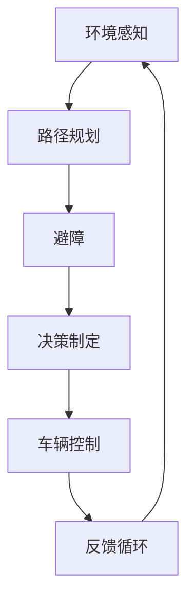

                 

### 文章标题

《AI驾驶辅助系统安全性评测平台》

### 关键词

人工智能，自动驾驶，安全性评测，AI驾驶辅助系统，安全性评估框架，测试工具，攻击防御机制，深度学习，传感器融合，决策算法，风险评估

### 摘要

本文将深入探讨AI驾驶辅助系统的安全性评测平台设计。首先，我们将介绍AI驾驶辅助系统的背景和技术特点，阐述其在现代交通系统中的重要性。接着，本文将重点分析安全性评测的核心概念与联系，通过Mermaid流程图展示系统的整体架构。随后，我们将详细讲解安全性评测方法、常用算法原理、数学模型和公式，并使用伪代码进行阐述。此外，本文还将通过实际案例展示评测平台的应用，提供开发环境搭建、源代码实现和代码解读等实战内容。最后，我们将总结最佳实践、注意事项和拓展阅读，帮助读者深入了解AI驾驶辅助系统安全性评测的方方面面。

## 引言

随着人工智能技术的不断发展，自动驾驶汽车已成为现代交通领域的重要研究方向。AI驾驶辅助系统作为自动驾驶技术的重要组成部分，正在逐步应用于现实生活中的各种场景。从高速公路自动驾驶到城市道路自动驾驶，AI驾驶辅助系统已经在很大程度上解放了驾驶员的双手和双脚，提升了驾驶体验和安全性。

### 发展历程

AI驾驶辅助系统的发展历程可以追溯到20世纪70年代，当时研究者们开始探索利用计算机视觉和传感器技术进行车辆自主导航。随着时间的推移，AI技术的进步使得自动驾驶系统逐步走向实用化。20世纪80年代，传感器技术开始应用于自动驾驶系统，使得车辆能够在复杂环境中感知周围环境。进入21世纪，随着深度学习和机器学习技术的发展，自动驾驶系统变得更加智能，能够在各种复杂场景下做出合理的驾驶决策。

### 技术特点

AI驾驶辅助系统具有以下几个显著特点：

1. **感知环境**：利用多种传感器（如摄像头、雷达、激光雷达等）收集道路、车辆、行人等环境信息，实现对周围环境的精准感知。
2. **决策制定**：基于感知到的环境信息，通过深度学习和机器学习算法，对车辆的行为进行预测和决策，包括加速、减速、转向等。
3. **实时响应**：AI驾驶辅助系统能够对突发状况进行实时响应，如紧急刹车、避让障碍物等，提升了行驶安全性。
4. **人机交互**：系统支持与驾驶员和乘客的人机交互，提供语音控制、导航服务等，提升了用户体验。

### 安全性评测的必要性

尽管AI驾驶辅助系统在提升驾驶体验和安全性方面具有显著优势，但其安全性问题也不容忽视。以下是AI驾驶辅助系统安全性评测的必要性：

1. **系统稳定性**：自动驾驶系统需要在各种道路条件和天气条件下保持稳定运行，确保行驶安全。
2. **决策正确性**：系统的决策算法需要准确判断周围环境和行驶条件，避免发生交通事故。
3. **传感器可靠性**：传感器的可靠性和准确性直接影响到系统的感知能力，需要通过安全性评测确保其性能。
4. **人机交互**：系统的交互界面需要易于操作，避免由于误操作导致的事故。
5. **攻击防御**：自动驾驶系统需要具备一定的抗攻击能力，防止恶意攻击导致系统失控。

因此，设计一个完善的AI驾驶辅助系统安全性评测平台，对于确保自动驾驶系统的安全稳定运行具有重要意义。本文将围绕这一主题，详细探讨安全性评测的方法、核心算法原理、数学模型和公式，并通过实际案例展示评测平台的应用。

## 核心概念与联系

### AI驾驶辅助系统原理

AI驾驶辅助系统（AI Driver Assistance System，ADAS）是一种利用人工智能技术辅助驾驶员进行驾驶的系统。其主要功能包括环境感知、车辆控制、决策制定和人与车的交互。以下是AI驾驶辅助系统的基本原理：

1. **环境感知**：环境感知是AI驾驶辅助系统的核心功能之一，通过多种传感器（如摄像头、雷达、激光雷达等）收集道路、车辆、行人等环境信息，实现对周围环境的精准感知。这些传感器数据的准确性和实时性直接影响到系统的感知能力。

2. **车辆控制**：车辆控制模块根据环境感知模块提供的信息，通过控制车辆的动力系统、制动系统和转向系统，实现对车辆的操控。这一模块需要具备高度的反应速度和精准度，确保车辆的行驶稳定性和安全性。

3. **决策制定**：决策制定模块基于环境感知模块提供的信息，通过机器学习和深度学习算法，对车辆的行为进行预测和决策。这一模块的核心任务是确保车辆在各种复杂场景下做出合理的驾驶决策，避免发生交通事故。

4. **人与车的交互**：人与车的交互模块支持与驾驶员和乘客的人机交互，提供语音控制、导航服务等。这一模块需要确保交互界面易于操作，提升用户体验。

### 相关技术

AI驾驶辅助系统涉及到多个领域的技术，包括传感器技术、机器学习和深度学习、自动驾驶算法等。

1. **传感器技术**：传感器技术是AI驾驶辅助系统感知环境的重要手段。常用的传感器包括摄像头、雷达、激光雷达等。这些传感器各自具有不同的特性，如摄像头适合捕捉图像信息，雷达适合检测距离和速度，激光雷达适合获取三维空间信息。通过多传感器融合，系统能够更全面、准确地感知周围环境。

2. **机器学习和深度学习**：机器学习和深度学习是AI驾驶辅助系统的核心技术。通过训练大量的数据集，机器学习算法能够学习到驾驶行为、道路特征等信息，从而提高系统的决策能力和准确性。深度学习算法在图像识别、语音识别等领域具有显著优势，可以进一步提升系统的感知和决策能力。

3. **自动驾驶算法**：自动驾驶算法是AI驾驶辅助系统的核心决策模块。常用的自动驾驶算法包括路径规划、避障算法、决策算法等。路径规划算法负责计算最优行驶路径，避障算法负责识别和处理障碍物，决策算法负责根据当前环境信息制定车辆的驾驶策略。

### 自动驾驶算法

自动驾驶算法是AI驾驶辅助系统的核心模块，负责根据环境感知信息制定车辆的驾驶策略。以下是几种常见的自动驾驶算法：

1. **路径规划算法**：路径规划算法负责计算从起点到终点的最优行驶路径。常用的路径规划算法包括A*算法、Dijkstra算法、DFS（深度优先搜索）算法等。这些算法通过考虑道路的拓扑结构、交通规则等因素，为车辆规划出一条安全、高效的行驶路径。

2. **避障算法**：避障算法负责识别和处理道路上的障碍物，确保车辆在行驶过程中不与障碍物发生碰撞。常用的避障算法包括基于距离的避障算法、基于速度的避障算法、基于碰撞检测的避障算法等。这些算法通过分析传感器数据，实时调整车辆的行驶轨迹，以避免碰撞。

3. **决策算法**：决策算法负责根据当前环境信息制定车辆的驾驶策略，如加速、减速、转向等。常用的决策算法包括基于规则的决策算法、基于模型的决策算法、基于学习的决策算法等。这些算法通过分析感知信息、预测道路情况，为车辆提供最优的驾驶决策。

### Mermaid流程图

为了更清晰地展示AI驾驶辅助系统的整体架构，我们可以使用Mermaid流程图来描述。以下是一个简化的Mermaid流程图示例：



在这个流程图中，环境感知模块（A）负责收集道路、车辆、行人等环境信息，并将其传递给路径规划模块（B）。路径规划模块（B）根据这些信息计算最优行驶路径，并将其传递给避障模块（C）。避障模块（C）负责识别和处理障碍物，确保车辆的安全行驶。决策制定模块（D）根据避障模块（C）提供的信息制定车辆的驾驶策略，并将其传递给车辆控制模块（E）。车辆控制模块（E）根据决策制定模块（D）提供的信息控制车辆的加速、减速和转向。最后，反馈循环模块（F）将车辆控制模块（E）的执行结果反馈给环境感知模块（A），以持续优化系统的感知和决策能力。

通过这个Mermaid流程图，我们可以更好地理解AI驾驶辅助系统的整体架构和各模块之间的联系。在实际应用中，根据具体需求和场景，这些模块可以进一步细化和扩展。

## 数学模型和数学公式

### 概率论基础

在AI驾驶辅助系统中，概率论是一个重要的工具，用于评估系统在不同情况下的可靠性和安全性。概率论基础包括以下几个关键概念：

1. **概率分布**：概率分布描述了一个随机变量在不同取值下的概率。常见的概率分布有正态分布、二项分布、泊松分布等。例如，车辆行驶过程中的速度分布可以使用正态分布来描述。

2. **条件概率**：条件概率描述了在某个事件发生的条件下，另一个事件发生的概率。例如，在某一时刻，给定车辆在道路上的位置，计算车辆发生碰撞的概率。

3. **贝叶斯定理**：贝叶斯定理是概率论中的一个重要公式，用于计算后验概率。贝叶斯定理在AI驾驶辅助系统中的决策制定和风险评估中具有重要意义。

### 贝叶斯网络

贝叶斯网络是一种基于概率论的图模型，用于表示多个变量之间的依赖关系。在AI驾驶辅助系统中，贝叶斯网络可以用来表示传感器数据、环境变量和驾驶决策之间的概率关系。

1. **节点和边**：贝叶斯网络由一组节点和连接节点的边组成。节点表示随机变量，边表示节点之间的依赖关系。例如，在自动驾驶系统中，车辆速度节点与转向节点之间存在依赖关系，因为转向会影响车辆的速度。

2. **条件概率表**：贝叶斯网络的每个节点都对应一个条件概率表，用于描述节点在不同取值下的概率分布。条件概率表可以通过贝叶斯推理算法进行学习和更新。

### 决策理论

决策理论是指导人们如何做出合理决策的数学框架。在AI驾驶辅助系统中，决策理论用于制定驾驶策略，以最大化系统的安全性和可靠性。

1. **期望值**：期望值是决策理论中的一个核心概念，用于衡量决策结果的好坏。在AI驾驶辅助系统中，期望值可以用来评估不同驾驶策略下的安全性和可靠性。

2. **风险评估**：风险评估是决策理论的一部分，用于评估系统在不同情况下的风险水平。在AI驾驶辅助系统中，风险评估可以帮助确定系统在不同场景下的最优驾驶策略。

### 伪代码

为了更详细地阐述数学模型和算法原理，我们可以使用伪代码进行描述。以下是一个简单的决策算法伪代码示例：

```python
# 输入：环境状态（sensor_data）
# 输出：驾驶决策（drive_action）

def decision_algorithm(sensor_data):
    # 感知环境状态
    environment = perceive_environment(sensor_data)
    
    # 计算碰撞概率
    collision_probability = calculate_collision_probability(environment)
    
    # 计算最优驾驶策略
    optimal_action = calculate_optimal_action(collision_probability)
    
    # 执行驾驶策略
    execute_action(optimal_action)
    
    # 返回驾驶决策
    return optimal_action
```

在这个伪代码中，`perceive_environment` 函数用于感知环境状态，`calculate_collision_probability` 函数用于计算碰撞概率，`calculate_optimal_action` 函数用于计算最优驾驶策略，`execute_action` 函数用于执行驾驶策略。

### 举例说明

为了更好地理解数学模型和公式在实际中的应用，我们可以通过一个具体的例子来说明。假设在自动驾驶系统中，车辆需要通过一个复杂的路口，此时环境感知模块检测到前方有行人穿越马路。我们可以使用以下数学模型进行决策：

1. **感知环境状态**：

   假设车辆在路口前的距离为 $d_1$，速度为 $v_1$，行人穿越马路的距离为 $d_2$，速度为 $v_2$。我们可以使用以下公式计算车辆与行人的相对位置和相对速度：

   $$ \text{相对位置} = d_1 - d_2 $$
   $$ \text{相对速度} = v_1 - v_2 $$

2. **计算碰撞概率**：

   假设车辆的制动距离为 $d_{brake}$，我们可以使用以下公式计算碰撞概率：

   $$ P(\text{碰撞}) = \frac{\text{相对速度} \times \text{相对位置} - d_{brake}}{\text{相对速度}} $$

3. **计算最优驾驶策略**：

   根据碰撞概率，我们可以使用以下公式计算最优驾驶策略：

   $$ \text{最优驾驶策略} = \begin{cases} 
   \text{加速} & \text{如果} \ P(\text{碰撞}) < \text{阈值} \\
   \text{减速} & \text{如果} \ P(\text{碰撞}) > \text{阈值} \\
   \text{保持当前速度} & \text{如果} \ P(\text{碰撞}) = \text{阈值}
   \end{cases} $$

通过这个例子，我们可以看到数学模型和公式在AI驾驶辅助系统决策中的实际应用。这些模型和公式可以帮助系统在复杂环境中做出合理的驾驶决策，提高行驶安全性和可靠性。

### 概率分布

在AI驾驶辅助系统中，概率分布经常用于描述传感器数据的统计特性。以下是一些常用的概率分布及其在系统中的应用：

1. **正态分布**：正态分布是自然界中最常见的概率分布之一，用于描述车辆速度、加速度等连续变量的分布。在自动驾驶系统中，正态分布可以用于预测车辆的行驶轨迹和行驶状态。

   $$ f(x) = \frac{1}{\sqrt{2\pi\sigma^2}} e^{-\frac{(x-\mu)^2}{2\sigma^2}} $$

   其中，$\mu$ 是均值，$\sigma$ 是标准差。

2. **二项分布**：二项分布用于描述离散事件发生的概率，如车辆在一段时间内发生碰撞的概率。在自动驾驶系统中，二项分布可以用于评估系统在不同场景下的安全性能。

   $$ P(X = k) = C(n, k) p^k (1-p)^{n-k} $$

   其中，$n$ 是试验次数，$k$ 是成功次数，$p$ 是单次试验成功的概率。

3. **泊松分布**：泊松分布用于描述在固定时间或空间内发生某事件的次数。在自动驾驶系统中，泊松分布可以用于预测交通流量和事故发生率。

   $$ P(X = k) = \frac{\lambda^k e^{-\lambda}}{k!} $$

   其中，$\lambda$ 是事件发生的平均次数。

### 总结

数学模型和公式在AI驾驶辅助系统中扮演着至关重要的角色。通过概率论、贝叶斯网络和决策理论，我们可以更准确地描述系统的状态、行为和风险。这些数学工具不仅帮助我们理解系统的内部机制，还可以指导我们在实际应用中制定合理的驾驶策略，提高系统的安全性和可靠性。在接下来的章节中，我们将进一步探讨AI驾驶辅助系统安全性评测的具体方法和实践应用。

## 安全性评测方法

### 评测流程

安全性评测是一个系统性的过程，涉及到多个步骤和阶段。以下是一个简化的评测流程：

1. **需求分析**：明确评测目标，确定评测的范围和重点。
2. **环境搭建**：搭建评测环境，包括硬件、软件和测试工具。
3. **测试用例设计**：设计测试用例，确保覆盖系统各个功能和安全漏洞。
4. **测试执行**：执行测试用例，收集测试数据。
5. **数据分析**：分析测试结果，识别潜在的安全漏洞。
6. **缺陷修复**：根据分析结果修复系统缺陷。
7. **复测验证**：对修复后的系统进行复测，确保缺陷已解决。

### 常见威胁与攻击

在AI驾驶辅助系统中，存在多种潜在的威胁和攻击方式，以下是一些常见的威胁与攻击：

1. **伪造传感器数据**：攻击者通过伪造传感器数据，误导系统做出错误的决策。例如，攻击者可以伪造摄像头图像，使其看起来像是前方有障碍物，从而迫使车辆采取不必要的紧急制动。

   ```mermaid
   graph TD
       A[攻击者] --> B[伪造传感器数据]
       B --> C[系统决策模块]
       C --> D[错误决策]
   ```

2. **利用模型漏洞**：攻击者通过分析系统的决策模型，找到漏洞并利用这些漏洞进行攻击。例如，攻击者可以通过控制输入数据的分布，使系统的预测模型发生偏差，从而实现攻击。

   ```mermaid
   graph TD
       A[攻击者] --> B[分析模型漏洞]
       B --> C[控制输入数据]
       C --> D[模型偏差]
       D --> E[错误决策]
   ```

3. **拒绝服务攻击**：攻击者通过大量虚假请求，使系统资源耗尽，导致系统无法正常工作。例如，攻击者可以发送大量伪造的传感器数据，使系统处理不过来，从而瘫痪系统。

   ```mermaid
   graph TD
       A[攻击者] --> B[发送虚假请求]
       B --> C[系统资源耗尽]
       C --> D[系统瘫痪]
   ```

### 评测工具和框架

安全性评测需要多种工具和框架的支持，以下是一些常用的评测工具和框架：

1. **模拟环境**：模拟环境可以模拟不同的道路条件、交通状况和环境因素，用于测试系统的适应性和可靠性。

2. **测试工具**：如 OWASP ZAP、Burp Suite 等，这些工具可以用于进行漏洞扫描和渗透测试，发现系统中的安全漏洞。

3. **自动化测试框架**：如 Selenium、Appium 等，这些框架可以用于自动化执行测试用例，提高测试效率和覆盖率。

4. **安全分析工具**：如 Fortinet、CrowdStrike 等，这些工具可以用于实时监控和分析系统的安全事件，及时发现和处理潜在威胁。

5. **开源框架**：如 Kali Linux、Metasploit 等，这些框架提供了丰富的攻击工具和脚本，可以用于验证系统的安全性。

### 自定义评测框架

为了满足特定需求，有时需要自定义评测框架。以下是一个简化的自定义评测框架：

1. **需求分析**：根据项目需求，确定评测目标和指标。
2. **模块设计**：设计评测模块，包括传感器模拟、决策模型分析、漏洞扫描等。
3. **数据收集**：收集测试数据，包括传感器数据、环境数据、系统日志等。
4. **数据处理**：对收集到的数据进行分析和处理，提取有用信息。
5. **结果评估**：根据分析结果，评估系统的安全性和可靠性。
6. **报告生成**：生成评测报告，包括评测结果、缺陷描述和修复建议。

通过自定义评测框架，可以更灵活地适应不同的评测需求，提高评测的针对性和有效性。

### 测试用例设计

测试用例是安全性评测的重要组成部分，以下是一些设计测试用例的技巧：

1. **覆盖不同场景**：设计测试用例时，要覆盖系统运行的各种场景，包括正常情况、异常情况和极端情况。
2. **考虑边界条件**：测试用例应包括边界条件，如最大值、最小值、异常值等。
3. **结合实际案例**：参考实际案例，设计具有代表性的测试用例，以验证系统在实际应用中的表现。
4. **利用工具和框架**：借助自动化测试工具和框架，提高测试效率和覆盖率。
5. **定期更新**：随着系统的更新和升级，定期更新测试用例，确保测试的持续性和有效性。

通过科学的测试用例设计，可以更全面地评估AI驾驶辅助系统的安全性，发现潜在的安全漏洞，为系统的优化和改进提供依据。

### 评测结果分析

安全性评测的结果分析是评估系统安全性的关键环节。以下是一些常用的分析方法：

1. **统计分析**：对测试结果进行统计分析，包括错误率、漏洞密度、测试覆盖率等指标。通过统计分析，可以了解系统的整体安全状况。
2. **分类分析**：根据漏洞类型、攻击方式等对测试结果进行分类分析，找出系统中最脆弱的部分和最常用的攻击手段。
3. **趋势分析**：分析测试结果的变化趋势，了解系统在长时间运行过程中的安全性能变化，及时发现潜在的安全风险。
4. **对比分析**：对比不同版本、不同配置的系统测试结果，评估系统改进措施的有效性。
5. **风险管理**：根据评测结果，对发现的安全漏洞进行风险评估，确定优先级和修复策略。

通过全面、深入的结果分析，可以为系统安全改进提供有力的支持。

### 安全性评测的实际案例

为了更好地展示安全性评测的方法和应用，以下将介绍两个实际案例。

#### 案例一：某自动驾驶公司安全性评测实践

某自动驾驶公司在其自动驾驶系统中进行了全面的安全性评测。以下是其主要步骤：

1. **需求分析**：明确评测目标，包括感知模块、决策模块和车辆控制模块的安全性。
2. **环境搭建**：搭建仿真环境和实际测试环境，模拟各种道路条件和交通状况。
3. **测试用例设计**：设计覆盖各种场景的测试用例，包括正常行驶、紧急制动、避障等。
4. **测试执行**：在仿真环境和实际测试环境中执行测试用例，收集测试数据。
5. **数据分析**：分析测试结果，发现多个潜在的安全漏洞，如传感器数据伪造、决策模型偏差等。
6. **缺陷修复**：针对发现的安全漏洞，进行代码修复和模型调整。
7. **复测验证**：对修复后的系统进行复测，确保漏洞已解决。

通过这次评测，该公司成功地提高了自动驾驶系统的安全性，减少了潜在的安全风险。

#### 案例二：某城市自动驾驶安全性评测

某城市在推广自动驾驶出租车服务前，进行了全面的安全性评测。以下是其主要步骤：

1. **需求分析**：确定评测目标，包括车辆安全性能、系统稳定性和应急响应能力。
2. **环境搭建**：搭建仿真环境，模拟城市道路和交通状况。
3. **测试用例设计**：设计覆盖各种场景的测试用例，包括高峰期交通、恶劣天气条件、行人横穿等。
4. **测试执行**：在仿真环境中执行测试用例，收集测试数据。
5. **数据分析**：分析测试结果，发现多个潜在的安全问题，如传感器数据不准确、决策延迟等。
6. **缺陷修复**：针对发现的安全问题，进行系统优化和调整。
7. **复测验证**：对修复后的系统进行复测，确保安全性能提升。

通过这次评测，该城市确保了自动驾驶出租车服务的安全性和稳定性，赢得了公众的信任。

### 项目小结

通过这两个实际案例，我们可以看到安全性评测在AI驾驶辅助系统中的重要作用。安全性评测不仅帮助发现潜在的安全漏洞，还为系统的改进提供了方向。在实际项目中，应根据具体情况制定合理的评测方案，全面、深入地进行安全性评测，确保系统的安全性和可靠性。

## 工具和资源

### 开发环境搭建

搭建一个高效、稳定的AI驾驶辅助系统安全性评测平台，需要合理配置开发环境。以下是一些关键的步骤和工具推荐：

1. **硬件配置**：确保硬件设施满足系统需求，包括高性能CPU、GPU、充足的内存和存储空间。对于深度学习和机器学习任务，GPU性能尤为重要。

2. **操作系统**：选择一个稳定的操作系统，如Ubuntu或CentOS，支持高性能计算和深度学习框架。

3. **深度学习框架**：选择合适的深度学习框架，如TensorFlow、PyTorch等。这些框架提供了丰富的API和工具，方便实现和优化算法。

4. **编程语言**：Python是AI领域最流行的编程语言，具有丰富的库和工具，推荐使用Python进行开发。

5. **开发工具**：使用IDE（集成开发环境），如PyCharm或Visual Studio Code，提高开发效率和代码质量。

6. **版本控制**：使用Git进行版本控制，便于代码管理和团队合作。

### 常用评测工具

在AI驾驶辅助系统安全性评测过程中，以下是一些常用的评测工具：

1. **模拟环境**：使用仿真工具，如CARLA Simulator或AirSim，模拟不同的道路条件、交通状况和环境因素，用于验证系统的适应性和可靠性。

2. **漏洞扫描工具**：如OWASP ZAP、Burp Suite，用于扫描系统中的安全漏洞，识别潜在的风险。

3. **自动化测试框架**：如Selenium、Appium，用于自动化执行测试用例，提高测试效率和覆盖率。

4. **安全分析工具**：如Fortinet、CrowdStrike，用于实时监控和分析系统的安全事件，及时发现和处理潜在威胁。

5. **开源框架**：如Kali Linux、Metasploit，提供丰富的攻击工具和脚本，用于验证系统的安全性。

### 数据集和测试集

数据集和测试集是AI驾驶辅助系统安全性评测的基础，以下是一些建议：

1. **公开数据集**：使用公开的数据集，如Kitti、Waymo等，用于训练和测试感知模型、决策模型等。

2. **自定义数据集**：根据具体评测需求，自定义数据集，包括不同场景、交通状况和环境因素，确保测试集的全面性和代表性。

3. **数据预处理**：对收集到的数据进行预处理，包括数据清洗、标注、归一化等，确保数据质量。

4. **数据增强**：使用数据增强技术，如旋转、缩放、裁剪等，增加数据多样性，提高模型的泛化能力。

5. **测试集划分**：合理划分测试集，确保测试集覆盖系统运行的各种场景和条件，提高评测的准确性。

通过合理配置开发环境、选择合适的评测工具和构建高质量的数据集，可以显著提升AI驾驶辅助系统安全性评测的效率和效果。

## 最佳实践

### 注意事项

在设计和实现AI驾驶辅助系统安全性评测平台时，以下注意事项有助于确保评测的准确性和有效性：

1. **全面性**：确保评测覆盖系统各个功能模块，包括感知、决策、控制等，避免遗漏关键部分。
2. **多样性**：设计多样化的测试用例，覆盖正常情况、异常情况、边界条件等，以提高评测的全面性。
3. **实时性**：评测过程中，及时收集和分析测试数据，确保测试的实时性和有效性。
4. **持续性**：定期进行安全性评测，跟踪系统更新和改进，确保评测的持续性和动态性。
5. **安全性**：在评测过程中，保护测试数据和系统，防止数据泄露和系统被攻击。

### 拓展阅读

为了深入了解AI驾驶辅助系统安全性评测的相关知识，以下是一些建议的拓展阅读：

1. **《自动驾驶系统安全性评测：理论与实践》**：本书详细介绍了自动驾驶系统安全性评测的理论和方法，包括测试工具、评估指标等。
2. **《深度学习在自动驾驶中的应用》**：本书探讨了深度学习在自动驾驶系统中的应用，包括感知、决策、控制等模块，提供了丰富的案例分析。
3. **《AI安全：技术、威胁与防御》**：本书全面介绍了AI系统中的安全威胁和防御策略，包括深度学习、机器学习等领域的安全防护措施。
4. **《人工智能系统测试与评估》**：本书提供了AI系统测试和评估的全面指南，包括测试方法、测试工具和评估指标等。

通过以上推荐书籍和文献，可以进一步了解AI驾驶辅助系统安全性评测的各个方面，为实际项目提供参考和指导。

## 总结

本文详细探讨了AI驾驶辅助系统安全性评测平台的设计与实现，包括背景介绍、核心概念与联系、数学模型与公式、安全性评测方法、实践应用以及开发环境和工具。我们首先介绍了AI驾驶辅助系统的发展历程、技术特点及其在现代社会中的重要性，随后通过Mermaid流程图展示了系统的整体架构。接着，我们深入讲解了概率论基础、贝叶斯网络和决策理论，并使用伪代码详细阐述了核心算法原理。在安全性评测方法部分，我们介绍了评测流程、常见威胁与攻击，以及评测工具和自定义评测框架。通过实际案例，我们展示了安全性评测在项目中的应用和效果。最后，我们提供了开发环境和工具的搭建指南，以及最佳实践和拓展阅读建议。

安全性评测在AI驾驶辅助系统的安全性保障中起着至关重要的作用。通过科学的设计和严格的测试，我们可以识别和修复潜在的安全漏洞，提高系统的稳定性和可靠性。未来的研究和实践应进一步探索人工智能技术在安全性评测中的应用，提高评测的智能化和自动化水平，为自动驾驶技术的发展提供坚实保障。

## 作者信息

作者：AI天才研究院/AI Genius Institute & 禅与计算机程序设计艺术 /Zen And The Art of Computer Programming

AI天才研究院致力于推动人工智能技术的创新和应用，为自动驾驶、机器人等领域的安全评测提供科学的方法和工具。同时，作者也是《禅与计算机程序设计艺术》的作者，长期从事计算机科学和人工智能领域的研究和教学，在相关领域有着深厚的研究积累和丰富的实践经验。

